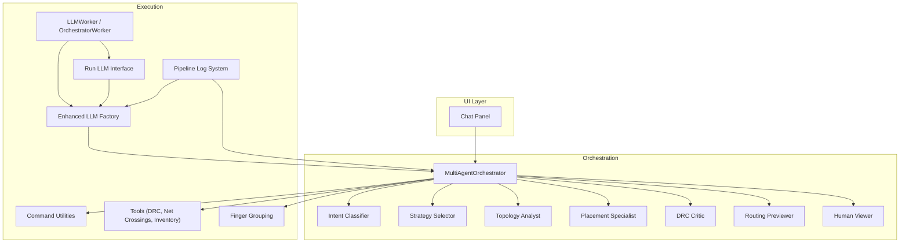
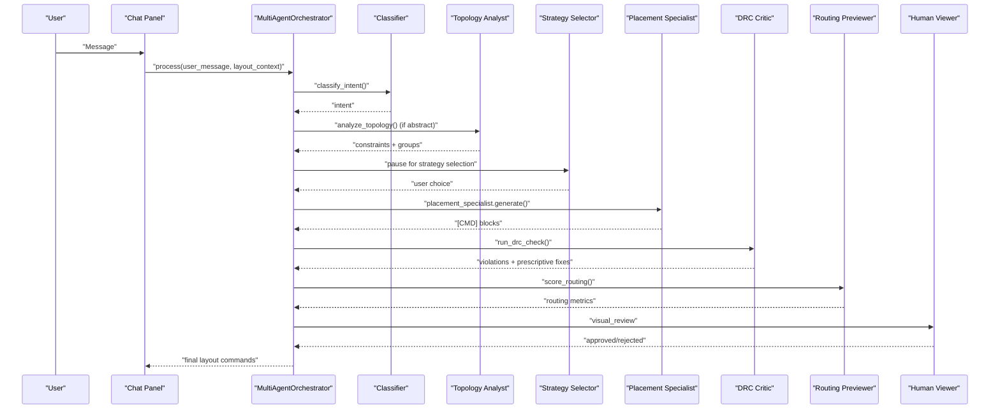
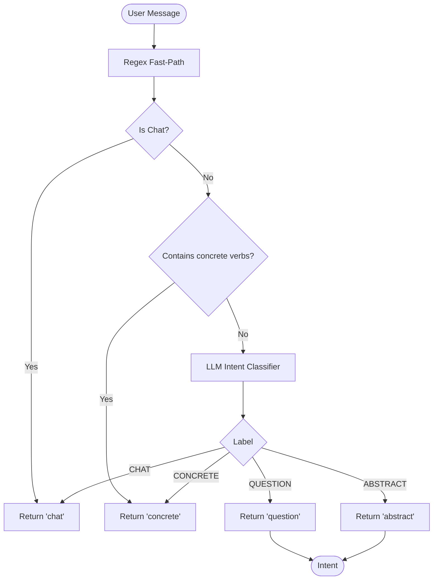
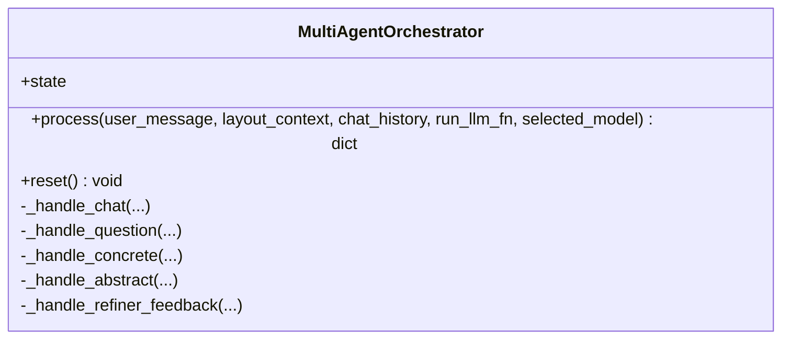
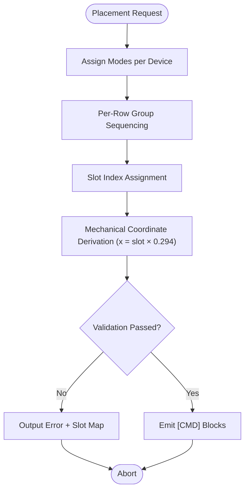
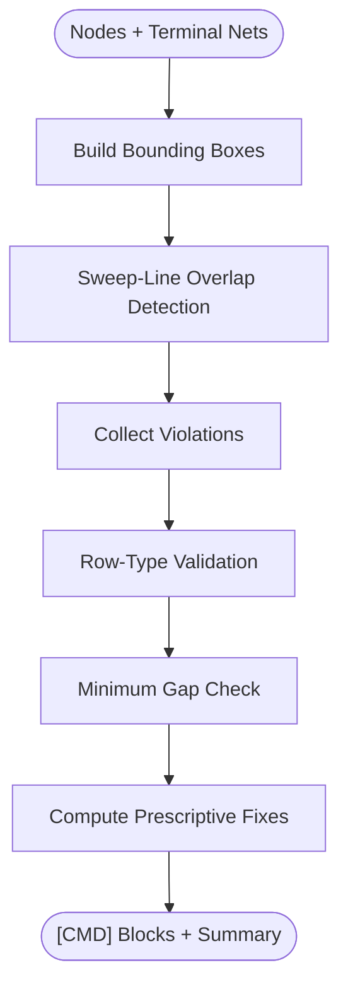
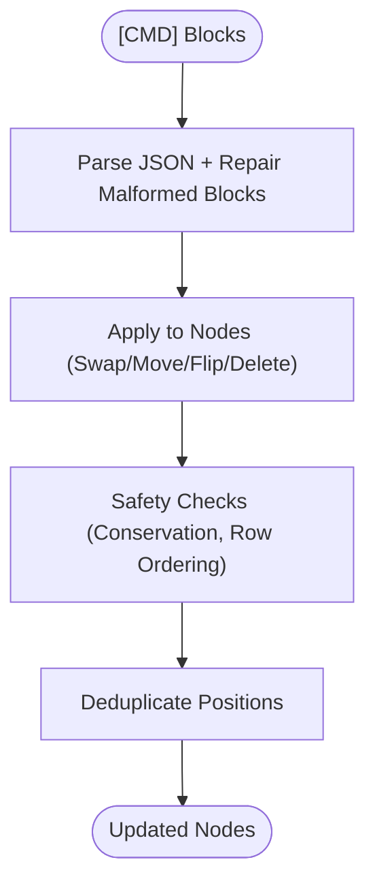
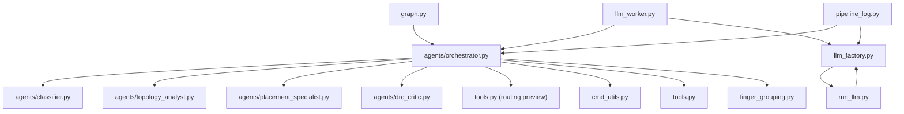

# AI Chat Panel and Multi-Agent System

<cite>
**Referenced Files in This Document**
- [ai_chat_bot/__init__.py](file://ai_agent/ai_chat_bot/__init__.py)
- [ai_chat_bot/state.py](file://ai_agent/ai_chat_bot/state.py)
- [ai_chat_bot/analog_kb.py](file://ai_agent/ai_chat_bot/analog_kb.py)
- [ai_chat_bot/cmd_utils.py](file://ai_agent/ai_chat_bot/cmd_utils.py)
- [ai_chat_bot/tools.py](file://ai_agent/ai_chat_bot/tools.py)
- [ai_chat_bot/agents/orchestrator.py](file://ai_agent/ai_chat_bot/agents/orchestrator.py)
- [ai_chat_bot/agents/classifier.py](file://ai_agent/ai_chat_bot/agents/classifier.py)
- [ai_chat_bot/agents/topology_analyst.py](file://ai_agent/ai_chat_bot/agents/topology_analyst.py)
- [ai_chat_bot/agents/placement_specialist.py](file://ai_agent/ai_chat_bot/agents/placement_specialist.py)
- [ai_chat_bot/agents/drc_critic.py](file://ai_agent/ai_chat_bot/agents/drc_critic.py)
- [ai_chat_bot/llm_worker.py](file://ai_agent/ai_chat_bot/llm_worker.py)
- [ai_chat_bot/llm_factory.py](file://ai_agent/ai_chat_bot/llm_factory.py)
- [ai_chat_bot/run_llm.py](file://ai_agent/ai_chat_bot/run_llm.py)
- [ai_chat_bot/routing_utils.py](file://ai_agent/ai_chat_bot/routing_utils.py)
- [ai_chat_bot/graph.py](file://ai_agent/ai_chat_bot/graph.py)
- [ai_chat_bot/finger_grouping.py](file://ai_agent/ai_chat_bot/finger_grouping.py)
- [ai_chat_bot/pipeline_log.py](file://ai_agent/ai_chat_bot/pipeline_log.py)
- [ai_chat_bot/nodes.py](file://ai_agent/ai_chat_bot/nodes.py)
- [ai_chat_bot/edges.py](file://ai_agent/ai_chat_bot/edges.py)
</cite>

## Update Summary
**Changes Made**
- Enhanced LLM integration with native provider adapters for Google Gemini, Vertex AI, Alibaba Qwen, and Anthropic Claude
- Added new pipeline_log system for structured logging with Windows-compatible character encoding
- Improved error handling with robust fallback mechanisms for all providers
- Updated provider selection logic to support multiple native adapters
- Enhanced logging system with timestamped, formatted output for better debugging

## Table of Contents
1. [Introduction](#introduction)
2. [Project Structure](#project-structure)
3. [Core Components](#core-components)
4. [Architecture Overview](#architecture-overview)
5. [Detailed Component Analysis](#detailed-component-analysis)
6. [Dependency Analysis](#dependency-analysis)
7. [Performance Considerations](#performance-considerations)
8. [Troubleshooting Guide](#troubleshooting-guide)
9. [Conclusion](#conclusion)
10. [Appendices](#appendices)

## Introduction
This document explains the AI chat panel and multi-agent system for analog IC layout automation. It covers the four-stage pipeline (Topology Analysis, Placement, DRC Check, and Routing Preview), the intent classification system that routes user requests to appropriate agents, the specialized agents (orchestrator, classifier, topology analyst, placement specialist, DRC critic, and strategy selector), the enhanced LLM worker system supporting multiple providers with native adapters and automatic fallback, the command execution system for layout operations, typical AI interactions, and API configuration and provider selection.

## Project Structure
The AI chat panel integrates with a multi-agent orchestration pipeline built around LangGraph. The orchestrator routes user intents to specialized agents, which produce structured outputs and commands. The LLM worker manages provider selection and executes LLM calls safely on background threads with enhanced error handling. Supporting utilities handle layout commands, DRC checks, routing previews, and finger grouping for multi-finger devices.

**Diagram sources**
- [ai_chat_bot/llm_worker.py:87-165](file://ai_agent/ai_chat_bot/llm_worker.py#L87-L165)
- [ai_chat_bot/agents/orchestrator.py:23-96](file://ai_agent/ai_chat_bot/agents/orchestrator.py#L23-L96)
- [ai_chat_bot/graph.py:1-52](file://ai_agent/ai_chat_bot/graph.py#L1-L52)
- [ai_chat_bot/llm_factory.py:49-145](file://ai_agent/ai_chat_bot/llm_factory.py#L49-L145)
- [ai_chat_bot/pipeline_log.py:1-157](file://ai_agent/ai_chat_bot/pipeline_log.py#L1-L157)

**Section sources**
- [ai_chat_bot/__init__.py:1-7](file://ai_agent/ai_chat_bot/__init__.py#L1-L7)
- [ai_chat_bot/llm_worker.py:87-165](file://ai_agent/ai_chat_bot/llm_worker.py#L87-L165)
- [ai_chat_bot/graph.py:1-52](file://ai_agent/ai_chat_bot/graph.py#L1-L52)

## Core Components
- Intent classification: Fast regex-based classification for chat/concrete/question/abstract intents, with LLM fallback.
- Multi-agent orchestrator: Routes user messages through agents and supports human-in-the-loop interruptions.
- Specialized agents:
  - Topology Analyst: Extracts circuit topology and matching/symmetry constraints.
  - Placement Specialist: Generates [CMD] blocks for device placement respecting analog constraints.
  - DRC Critic: Detects overlaps/gaps/row errors and prescribes corrective moves.
  - Strategy Selector: Pauses for strategy selection during topology-driven flows.
- Enhanced LLM worker and factory: Centralized provider selection with native adapters for Google Gemini, Vertex AI, Alibaba Qwen, and Anthropic Claude, supporting timeouts and fallbacks.
- Command execution: Parses [CMD] blocks and applies layout changes with safety checks.
- Tools and utilities: DRC scoring, net crossing estimation, device conservation, overlap resolution, and finger grouping.
- Pipeline logging: Structured logging system with Windows-compatible character encoding and timestamped output.

**Section sources**
- [ai_chat_bot/agents/classifier.py:60-105](file://ai_agent/ai_chat_bot/agents/classifier.py#L60-L105)
- [ai_chat_bot/agents/orchestrator.py:43-96](file://ai_agent/ai_chat_bot/agents/orchestrator.py#L43-L96)
- [ai_chat_bot/agents/topology_analyst.py:163-326](file://ai_agent/ai_chat_bot/agents/topology_analyst.py#L163-L326)
- [ai_chat_bot/agents/placement_specialist.py:15-596](file://ai_agent/ai_chat_bot/agents/placement_specialist.py#L15-L596)
- [ai_chat_bot/agents/drc_critic.py:265-546](file://ai_agent/ai_chat_bot/agents/drc_critic.py#L265-L546)
- [ai_chat_bot/llm_worker.py:87-165](file://ai_agent/ai_chat_bot/llm_worker.py#L87-L165)
- [ai_chat_bot/llm_factory.py:29-131](file://ai_agent/ai_chat_bot/llm_factory.py#L29-L131)
- [ai_chat_bot/run_llm.py:76-162](file://ai_agent/ai_chat_bot/run_llm.py#L76-L162)
- [ai_chat_bot/cmd_utils.py:109-171](file://ai_agent/ai_chat_bot/cmd_utils.py#L109-L171)
- [ai_chat_bot/tools.py:15-114](file://ai_agent/ai_chat_bot/tools.py#L15-L114)
- [ai_chat_bot/finger_grouping.py:116-192](file://ai_agent/ai_chat_bot/finger_grouping.py#L116-L192)
- [ai_chat_bot/pipeline_log.py:1-157](file://ai_agent/ai_chat_bot/pipeline_log.py#L1-L157)

## Architecture Overview
The system implements a four-stage pipeline driven by a LangGraph application:
1) Topology Analysis: Identifies matching/symmetry constraints and circuit functions.
2) Strategy Selection: Pauses for user strategy selection.
3) Placement: Generates precise device placements and [CMD] blocks.
4) DRC Check: Validates overlaps, gaps, and row assignments; prescribes fixes.
5) Routing Preview: Estimates routing quality and proposes targeted swaps.
6) Human Viewer: Presents final layout for approval; resumes pipeline upon approval.

**Diagram sources**
- [ai_chat_bot/agents/orchestrator.py:43-226](file://ai_agent/ai_chat_bot/agents/orchestrator.py#L43-L226)
- [ai_chat_bot/graph.py:11-52](file://ai_agent/ai_chat_bot/graph.py#L11-L52)
- [ai_chat_bot/agents/drc_critic.py:265-546](file://ai_agent/ai_chat_bot/agents/drc_critic.py#L265-L546)
- [ai_chat_bot/routing_utils.py:7-97](file://ai_agent/ai_chat_bot/routing_utils.py#L7-L97)

## Detailed Component Analysis

### Intent Classification System
The classifier quickly categorizes user messages into four buckets:
- Chat: Casual conversation.
- Question: Informational queries requiring no layout changes.
- Concrete: Direct device operations (swap, move, flip, add dummy, delete).
- Abstract: High-level goals requiring topology analysis and placement.

It uses regex fast-path for trivial cases and falls back to a lightweight LLM call for ambiguous inputs.

**Diagram sources**
- [ai_chat_bot/agents/classifier.py:14-105](file://ai_agent/ai_chat_bot/agents/classifier.py#L14-L105)

**Section sources**
- [ai_chat_bot/agents/classifier.py:60-105](file://ai_agent/ai_chat_bot/agents/classifier.py#L60-L105)

### Multi-Agent Orchestrator
The orchestrator maintains pipeline state and routes messages based on intent:
- Chat/Question: Single-agent replies without commands.
- Concrete: Direct command generation.
- Abstract: Full four-stage pipeline with human-in-the-loop interrupts.

**Diagram sources**
- [ai_chat_bot/agents/orchestrator.py:23-226](file://ai_agent/ai_chat_bot/agents/orchestrator.py#L23-L226)

**Section sources**
- [ai_chat_bot/agents/orchestrator.py:43-226](file://ai_agent/ai_chat_bot/agents/orchestrator.py#L43-L226)

### Topology Analyst Agent
Analyzes SPICE netlist topology to identify:
- Fundamental topologies (differential pair, current mirror, cascode, etc.)
- Primary groups and functional roles
- Matching and symmetry requirements
- Secondary tags for additional relationships

Outputs structured topology information for downstream agents.

**Section sources**
- [ai_chat_bot/agents/topology_analyst.py:163-326](file://ai_agent/ai_chat_bot/agents/topology_analyst.py#L163-L326)
- [ai_chat_bot/analog_kb.py:11-333](file://ai_agent/ai_chat_bot/analog_kb.py#L11-L333)

### Placement Specialist Agent
Generates [CMD] blocks for device positioning with:
- Mode assignment: Common-centroid, interdigitation, mirror biasing, simple.
- Strict validation: No overlaps, centroid checks for CC, symmetry checks for MB, dummy placement rules.
- Routing-aware placement priorities.

**Diagram sources**
- [ai_chat_bot/agents/placement_specialist.py:374-596](file://ai_agent/ai_chat_bot/agents/placement_specialist.py#L374-L596)

**Section sources**
- [ai_chat_bot/agents/placement_specialist.py:15-596](file://ai_agent/ai_chat_bot/agents/placement_specialist.py#L15-L596)

### DRC Critic Agent
Implements:
- Sweep-line overlap detection O(N log N + R)
- Dynamic gap computation based on terminal nets
- Cost-driven legalizer with symmetry preservation

**Diagram sources**
- [ai_chat_bot/agents/drc_critic.py:184-546](file://ai_agent/ai_chat_bot/agents/drc_critic.py#L184-L546)

**Section sources**
- [ai_chat_bot/agents/drc_critic.py:265-546](file://ai_agent/ai_chat_bot/agents/drc_critic.py#L265-L546)

### Strategy Selector and Human Viewer
- Strategy Selector: Pauses after topology analysis to let the user select among proposed strategies.
- Human Viewer: Presents placement and routing preview; resumes pipeline upon approval or edits.

**Section sources**
- [ai_chat_bot/graph.py:11-52](file://ai_agent/ai_chat_bot/graph.py#L11-L52)
- [ai_chat_bot/llm_worker.py:355-371](file://ai_agent/ai_chat_bot/llm_worker.py#L355-L371)

### Enhanced LLM Worker and Provider Selection
**Updated** Enhanced with native provider adapters for Google Gemini, Vertex AI, Alibaba Qwen, and Anthropic Claude, plus improved error handling and fallback mechanisms.

- LLMWorker: Executes multi-agent pipeline on a background thread, emitting signals for replies and commands.
- OrchestratorWorker: Drives the LangGraph pipeline with human-in-the-loop support.
- LLMFactory: Centralized provider selection with native adapters and timeouts.

**Native Provider Adapters:**
- **Google Gemini**: Native google-genai adapter with automatic fallback to LangChain when unavailable
- **Vertex AI**: Native Google Vertex AI adapter for Gemini and Claude models
- **Alibaba Qwen**: Native OpenAI-compatible adapter for DashScope API
- **Anthropic Claude**: Native Vertex AI adapter for Claude models

**Enhanced Features:**
- Automatic fallback to native adapters when LangChain adapters are unavailable
- Improved error handling with Windows-compatible character encoding
- Structured logging with timestamps and stage progress tracking
- Enhanced timeout management with exponential backoff for transient errors

Timeouts configurable by task weight ("light" or "heavy").

**Section sources**
- [ai_chat_bot/llm_worker.py:87-165](file://ai_agent/ai_chat_bot/llm_worker.py#L87-L165)
- [ai_chat_bot/llm_worker.py:170-461](file://ai_agent/ai_chat_bot/llm_worker.py#L170-L461)
- [ai_chat_bot/llm_factory.py:29-131](file://ai_agent/ai_chat_bot/llm_factory.py#L29-L131)
- [ai_chat_bot/run_llm.py:76-162](file://ai_agent/ai_chat_bot/run_llm.py#L76-L162)

### Command Execution System
The system parses [CMD] blocks and applies layout operations:
- Supported actions: swap, move, flip, delete.
- Safety checks: device conservation, PMOS/NMOS row ordering, deduplication.
- Utilities: nearest free x search, overlap resolution, inventory validation.

**Diagram sources**
- [ai_chat_bot/cmd_utils.py:61-171](file://ai_agent/ai_chat_bot/cmd_utils.py#L61-L171)
- [ai_chat_bot/tools.py:69-114](file://ai_agent/ai_chat_bot/tools.py#L69-L114)

**Section sources**
- [ai_chat_bot/cmd_utils.py:109-171](file://ai_agent/ai_chat_bot/cmd_utils.py#L109-L171)
- [ai_chat_bot/tools.py:69-114](file://ai_agent/ai_chat_bot/tools.py#L69-L114)

### Routing Preview and Targeted Swaps
- Routing Previewer estimates routing complexity using a pure-Python heuristic.
- Targeted swaps propose neighbor swaps for highest-cost nets to reduce wire spans.

**Section sources**
- [ai_chat_bot/tools.py:41-53](file://ai_agent/ai_chat_bot/tools.py#L41-L53)
- [ai_chat_bot/routing_utils.py:7-97](file://ai_agent/ai_chat_bot/routing_utils.py#L7-L97)

### Multi-Finger Device Handling
Robust detection and grouping of multi-finger devices:
- Detects various finger naming conventions.
- Validates numeric suffix grouping thresholds.
- Aggregates to logical devices and expands back to physical fingers deterministically.

**Section sources**
- [ai_chat_bot/finger_grouping.py:116-192](file://ai_agent/ai_chat_bot/finger_grouping.py#L116-L192)
- [ai_chat_bot/finger_grouping.py:198-354](file://ai_agent/ai_chat_bot/finger_grouping.py#L198-L354)

### Enhanced Pipeline Logging System
**New** Structured logging system with Windows-compatible character encoding and timestamped output.

- **Windows-Compatible Encoding**: `_safe_print()` function prevents UnicodeEncodeError exceptions
- **Timestamped Output**: All log entries include formatted timestamps
- **Stage Progress Tracking**: Structured stage numbering with status indicators
- **Environment Control**: `PLACEMENT_STEPS_ONLY` environment variable for minimal output
- **Structured Formatting**: Consistent banner formatting and summary blocks

**Features:**
- `ip_step()`: Always-printed step notifications with status icons
- `vprint()`: Verbose printing controlled by environment variable
- `steps_only()`: Returns True when in step-only mode
- `pipeline_start()`: Formatted pipeline initialization banner
- `pipeline_end()`: Structured summary with metrics and timing
- `stage_start()`: Stage timing and progress tracking
- `stage_end()`: Completion logging with duration and details

**Section sources**
- [ai_chat_bot/pipeline_log.py:1-157](file://ai_agent/ai_chat_bot/pipeline_log.py#L1-L157)

## Dependency Analysis
The orchestrator composes agents and utilities, with the LLM worker coordinating provider selection and execution. The LangGraph application defines the pipeline flow and conditional edges for human-in-the-loop.

**Diagram sources**
- [ai_chat_bot/agents/orchestrator.py:69-95](file://ai_agent/ai_chat_bot/agents/orchestrator.py#L69-L95)
- [ai_chat_bot/llm_worker.py:87-165](file://ai_agent/ai_chat_bot/llm_worker.py#L87-L165)
- [ai_chat_bot/graph.py:1-52](file://ai_agent/ai_chat_bot/graph.py#L1-L52)

**Section sources**
- [ai_chat_bot/agents/orchestrator.py:43-96](file://ai_agent/ai_chat_bot/agents/orchestrator.py#L43-L96)
- [ai_chat_bot/llm_worker.py:87-165](file://ai_agent/ai_chat_bot/llm_worker.py#L87-L165)
- [ai_chat_bot/graph.py:1-52](file://ai_agent/ai_chat_bot/graph.py#L1-L52)

## Performance Considerations
- DRC overlap detection uses sweep-line with O(N log N + R) complexity, a significant improvement over naive O(N²).
- Dynamic gap computation reduces unnecessary spacing while preserving yield-limiting constraints.
- Cost-driven legalizer minimizes movement and preserves symmetry across matched groups.
- Command parsing and application include repair logic for malformed blocks and deduplication to prevent redundant work.
- **Enhanced** Native provider adapters reduce latency by eliminating intermediate translation layers.
- **Improved** Error handling with automatic fallback prevents pipeline crashes on provider failures.
- **Optimized** Structured logging reduces overhead in production environments.

## Troubleshooting Guide
Common issues and remedies:
- Intent classification failures: The classifier defaults to "abstract" on errors; verify selected model and environment variables.
- LLM timeouts: Adjust LLM_TIMEOUT_LIGHT or LLM_TIMEOUT_HEAVY environment variables.
- DRC violations persist: Review prescriptive fixes and ensure symmetry constraints are preserved.
- Command parsing errors: CMD blocks are auto-repaired; inspect logs for malformed markers.
- Device conservation failures: Ensure no devices are deleted or duplicated during placement.
- **New** Provider adapter failures: Check environment variables and fallback mechanisms are working.
- **New** Character encoding errors: Pipeline log system includes Windows-compatible encoding handling.
- **New** Pipeline logging issues: Verify PLACEMENT_STEPS_ONLY environment variable settings.

**Section sources**
- [ai_chat_bot/agents/classifier.py:102-105](file://ai_agent/ai_chat_bot/agents/classifier.py#L102-L105)
- [ai_chat_bot/llm_factory.py:19-27](file://ai_agent/ai_chat_bot/llm_factory.py#L19-L27)
- [ai_chat_bot/cmd_utils.py:84-101](file://ai_agent/ai_chat_bot/cmd_utils.py#L84-L101)
- [ai_chat_bot/tools.py:69-114](file://ai_agent/ai_chat_bot/tools.py#L69-L114)
- [ai_chat_bot/pipeline_log.py:26-37](file://ai_agent/ai_chat_bot/pipeline_log.py#L26-L37)

## Conclusion
The AI chat panel and multi-agent system provide a robust, extensible framework for analog layout automation. The four-stage pipeline ensures high-quality placements with strong DRC compliance and routing awareness, while the intent classification and human-in-the-loop controls offer flexibility and transparency. The enhanced LLM worker system centralizes provider selection and execution with native adapters for multiple providers, enabling seamless integration across Google Gemini, Vertex AI, Alibaba Qwen, and Anthropic Claude with improved error handling and Windows-compatible character encoding.

## Appendices

### Typical AI Interactions and Design Assistance
- Improve matching: "Optimize the current mirror to reduce mismatch."
- Reduce routing crossings: "Minimize wire crossings on the output net."
- Fix DRC violations: "Resolve overlap and gap violations."
- Perform layout operations: "Swap MM3 and MM5", "Move MM8 to the left", "Flip MM12 horizontally", "Add a dummy on the right", "Delete device MM2".

### API Configuration and Provider Selection
**Updated** Enhanced provider support with native adapters and improved fallback mechanisms.

- Environment variables:
  - LLM_TIMEOUT_LIGHT, LLM_TIMEOUT_HEAVY
  - GOOGLE_API_KEY or GEMINI_API_KEY
  - ALIBABA_API_KEY
  - VERTEX_PROJECT_ID, VERTEX_LOCATION
  - PLACEMENT_STEPS_ONLY (controls pipeline logging verbosity)
- Provider keys supported by the factory:
  - **Gemini** (default fallback) - Native google-genai adapter with LangChain fallback
  - **Alibaba** (DashScope Qwen) - Native OpenAI-compatible adapter with LangChain fallback
  - **VertexGemini** - Native Google Vertex AI adapter for Gemini models
  - **VertexClaude** - Native Google Vertex AI adapter for Claude models
- **New** Pipeline logging environment:
  - PLACEMENT_STEPS_ONLY=1 - Minimal console output for initial placement
  - PLACEMENT_DEBUG_FULL_LOG=1 - Full debug output with detailed prompts

**Section sources**
- [ai_chat_bot/llm_factory.py:46-126](file://ai_agent/ai_chat_bot/llm_factory.py#L46-L126)
- [ai_chat_bot/pipeline_log.py:39-44](file://ai_agent/ai_chat_bot/pipeline_log.py#L39-L44)