# Agent Architecture and Pipeline

<cite>
**Referenced Files in This Document**
- [state.py](file://ai_agent/ai_chat_bot/state.py)
- [classifier.py](file://ai_agent/ai_chat_bot/agents/classifier.py)
- [topology_analyst.py](file://ai_agent/ai_chat_bot/agents/topology_analyst.py)
- [strategy_selector.py](file://ai_agent/ai_chat_bot/agents/strategy_selector.py)
- [placement_specialist.py](file://ai_agent/ai_chat_bot/agents/placement_specialist.py)
- [drc_critic.py](file://ai_agent/ai_chat_bot/agents/drc_critic.py)
- [routing_previewer.py](file://ai_agent/ai_chat_bot/agents/routing_previewer.py)
- [analog_kb.py](file://ai_agent/ai_chat_bot/analog_kb.py)
- [tools.py](file://ai_agent/ai_chat_bot/tools.py)
- [skill_middleware.py](file://ai_agent/ai_chat_bot/skill_middleware.py)
- [graph.py](file://ai_agent/ai_chat_bot/graph.py)
</cite>

## Table of Contents
1. [Introduction](#introduction)
2. [Project Structure](#project-structure)
3. [Core Components](#core-components)
4. [Architecture Overview](#architecture-overview)
5. [Detailed Component Analysis](#detailed-component-analysis)
6. [Dependency Analysis](#dependency-analysis)
7. [Performance Considerations](#performance-considerations)
8. [Troubleshooting Guide](#troubleshooting-guide)
9. [Conclusion](#conclusion)

## Introduction
This document describes the multi-agent system architecture for automated analog IC layout. The system implements a four-stage pipeline:
- Topology Analysis
- Strategy Selection
- Placement
- DRC Check
- Routing Preview

It uses an orchestrator pattern built on a LangGraph state machine to coordinate specialized agents, manage workflow state transitions, and support human-in-the-loop approvals. The intent classification system routes user requests to appropriate agents, while robust error handling and fallback mechanisms ensure reliable recovery during failures.

## Project Structure
The multi-agent system resides under ai_agent/ai_chat_bot and integrates with supporting modules for tools, skills, and state management. The orchestrator composes agents into a directed acyclic graph with conditional edges for retries and human review.

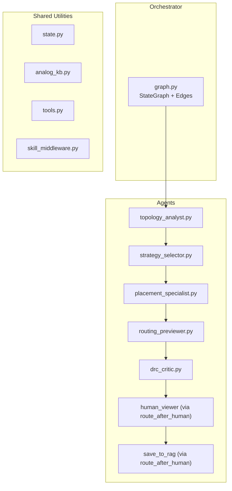

**Diagram sources**
- [graph.py:1-52](file://ai_agent/ai_chat_bot/graph.py#L1-L52)
- [state.py:1-37](file://ai_agent/ai_chat_bot/state.py#L1-L37)
- [analog_kb.py:1-333](file://ai_agent/ai_chat_bot/analog_kb.py#L1-L333)
- [tools.py:1-230](file://ai_agent/ai_chat_bot/tools.py#L1-L230)
- [skill_middleware.py:1-278](file://ai_agent/ai_chat_bot/skill_middleware.py#L1-L278)

**Section sources**
- [graph.py:1-52](file://ai_agent/ai_chat_bot/graph.py#L1-L52)

## Core Components
- Orchestrator (LangGraph State Machine)
  - Defines nodes for each stage and conditional edges for retries and human review.
  - Maintains persistent state across iterations using a MemorySaver checkpoint.
- Agents
  - Topology Analyst: Extracts topology constraints and device roles.
  - Strategy Selector: Proposes compatible, non-conflicting strategies.
  - Placement Specialist: Generates deterministic, validated placement commands.
  - DRC Critic: Detects and prescribes fixes for geometric violations.
  - Routing Pre-Viewer: Scores routing quality and suggests beneficial swaps.
- Shared Utilities
  - State: Typed dictionary defining inputs, intermediate results, and flags.
  - Knowledge Base: Domain rules injected into prompts.
  - Tools: Safe wrappers around core algorithms (DRC, routing scoring, validation).
  - Skill Middleware: Progressive disclosure of placement skills.

**Section sources**
- [state.py:1-37](file://ai_agent/ai_chat_bot/state.py#L1-L37)
- [analog_kb.py:1-333](file://ai_agent/ai_chat_bot/analog_kb.py#L1-L333)
- [tools.py:1-230](file://ai_agent/ai_chat_bot/tools.py#L1-L230)
- [skill_middleware.py:1-278](file://ai_agent/ai_chat_bot/skill_middleware.py#L1-L278)

## Architecture Overview
The orchestrator coordinates a linear pipeline with post-processing and feedback loops:
- Linear flow: Topology Analyst → Strategy Selector → Placement Specialist → Routing Pre-Viewer → DRC Critic.
- Feedback loop: DRC Critic can loop back to Routing Pre-Viewer or Placement Specialist depending on severity and retry budget.
- Human-in-the-loop: After DRC, the system pauses for human review; approved flows save results; rejected edits loop back to Placement Specialist.

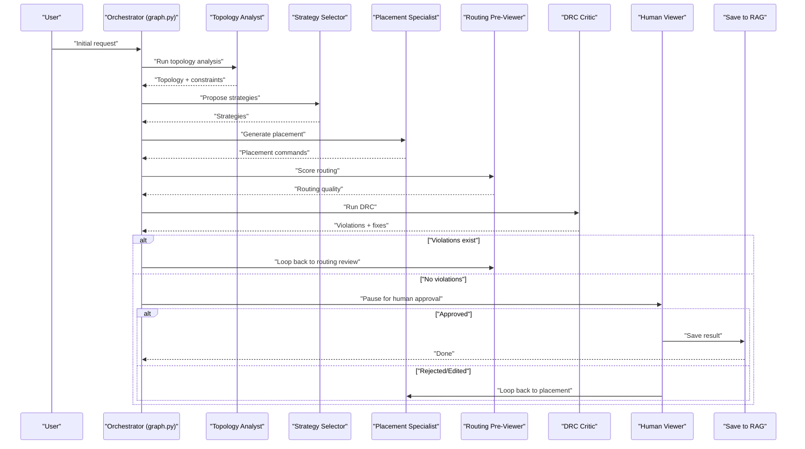

**Diagram sources**
- [graph.py:25-52](file://ai_agent/ai_chat_bot/graph.py#L25-L52)
- [drc_critic.py:265-546](file://ai_agent/ai_chat_bot/agents/drc_critic.py#L265-L546)
- [routing_previewer.py:125-269](file://ai_agent/ai_chat_bot/agents/routing_previewer.py#L125-L269)
- [placement_specialist.py:602-609](file://ai_agent/ai_chat_bot/agents/placement_specialist.py#L602-L609)

## Detailed Component Analysis

### Orchestrator Pattern and Workflow Control
- State Management
  - The orchestrator uses a typed state dictionary to track inputs, intermediate results, flags, and pending updates.
  - Key fields include user message, chat history, device nodes, SPICE file path, topology constraints, placement snapshots, DRC flags, routing metrics, and human approval flag.
- Node Composition
  - Nodes encapsulate agent invocations and post-processing steps (e.g., finger expansion).
- Conditional Edges
  - DRC violations trigger a retry loop back to routing review or placement depending on severity and retry counters.
  - Human-in-the-loop routes approved flows to persistence and rejected flows back to placement for refinement.

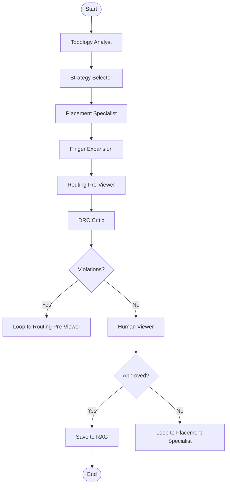

**Diagram sources**
- [graph.py:11-52](file://ai_agent/ai_chat_bot/graph.py#L11-L52)
- [state.py:3-37](file://ai_agent/ai_chat_bot/state.py#L3-L37)

**Section sources**
- [state.py:3-37](file://ai_agent/ai_chat_bot/state.py#L3-L37)
- [graph.py:11-52](file://ai_agent/ai_chat_bot/graph.py#L11-L52)

### Intent Classification System
- Purpose
  - Classify user intent into categories to route to appropriate agents: concrete device operations, abstract design goals, informational questions, or casual chat.
- Implementation
  - Fast-path regex for greetings and explicit commands avoids LLM calls.
  - LLM-based classifier provides a robust fallback when intent is ambiguous.
  - Defaults to abstract to ensure the pipeline always proceeds.

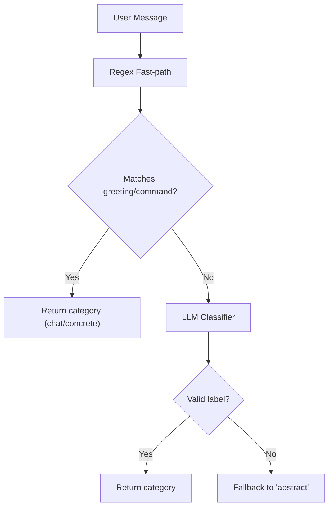

**Diagram sources**
- [classifier.py:14-105](file://ai_agent/ai_chat_bot/agents/classifier.py#L14-L105)

**Section sources**
- [classifier.py:60-105](file://ai_agent/ai_chat_bot/agents/classifier.py#L60-L105)

### Topology Analysis
- Responsibilities
  - Identify circuit topologies (differential pairs, mirrors, cascodes), assign devices to primary groups, define roles, and extract matching/symmetry requirements.
- Output
  - Structured topology constraints for downstream agents.
- Knowledge Injection
  - Domain rules and multi-finger layout guidance are injected into prompts to guide the LLM.

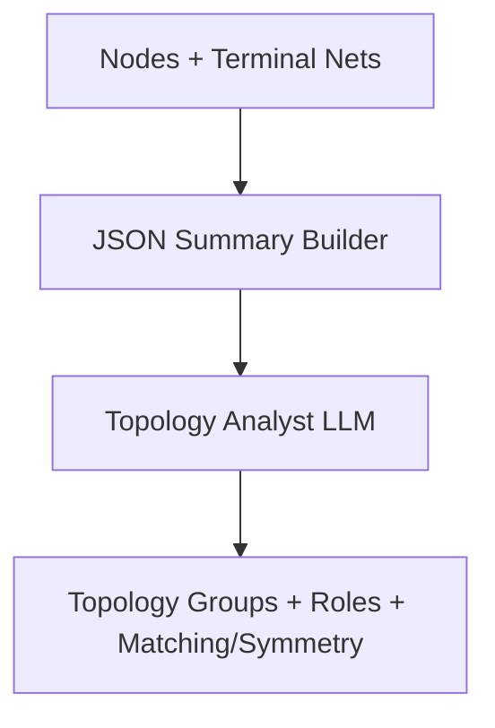

**Diagram sources**
- [topology_analyst.py:163-325](file://ai_agent/ai_chat_bot/agents/topology_analyst.py#L163-L325)
- [analog_kb.py:11-333](file://ai_agent/ai_chat_bot/analog_kb.py#L11-L333)

**Section sources**
- [topology_analyst.py:27-159](file://ai_agent/ai_chat_bot/agents/topology_analyst.py#L27-L159)
- [topology_analyst.py:163-325](file://ai_agent/ai_chat_bot/agents/topology_analyst.py#L163-L325)
- [analog_kb.py:11-333](file://ai_agent/ai_chat_bot/analog_kb.py#L11-L333)

### Strategy Selection
- Responsibilities
  - Generate 3–5 compatible, non-conflicting strategies that respect topology groups and matching/symmetry constraints.
- Decision Logic
  - Parses user request and topology constraints to propose strategies.
  - Includes a deterministic fallback when mirrors are detected.

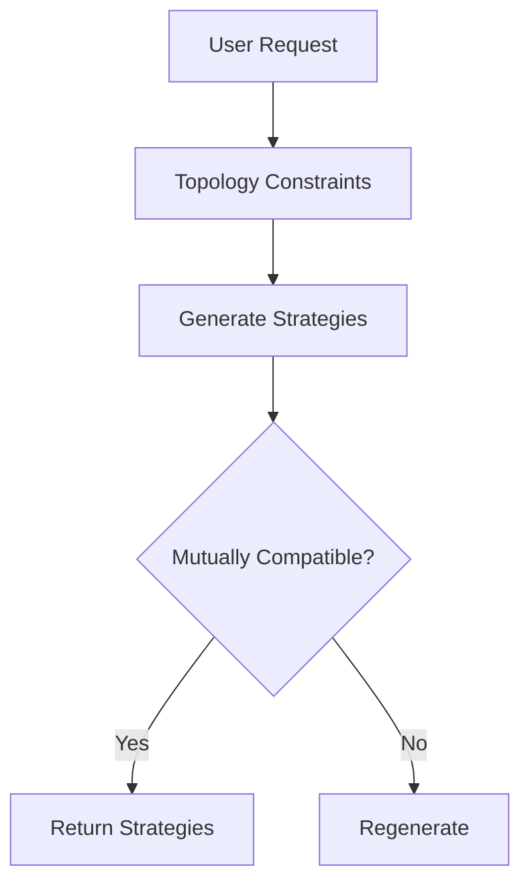

**Diagram sources**
- [strategy_selector.py:123-168](file://ai_agent/ai_chat_bot/agents/strategy_selector.py#L123-L168)

**Section sources**
- [strategy_selector.py:9-103](file://ai_agent/ai_chat_bot/agents/strategy_selector.py#L9-L103)
- [strategy_selector.py:123-219](file://ai_agent/ai_chat_bot/agents/strategy_selector.py#L123-L219)

### Placement Specialist
- Responsibilities
  - Produce deterministic, validated placement commands respecting device conservation, row-level constraints, and routing quality.
- Modes and Sequencing
  - Common Centroid, Interdigitated, Mirror Biasing, and Simple sequencing with strict validation rules.
  - Slot-first coordinate derivation to prevent overlaps.
- Validation
  - Overlap checks, centroid/symmetry validations, and interdigitation quality checks.
- Integration
  - Uses knowledge base and optional skill middleware for advanced guidance.

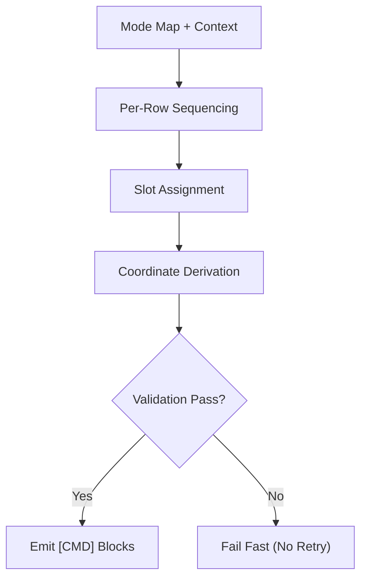

**Diagram sources**
- [placement_specialist.py:15-596](file://ai_agent/ai_chat_bot/agents/placement_specialist.py#L15-L596)
- [analog_kb.py:11-333](file://ai_agent/ai_chat_bot/analog_kb.py#L11-L333)
- [skill_middleware.py:77-102](file://ai_agent/ai_chat_bot/skill_middleware.py#L77-L102)

**Section sources**
- [placement_specialist.py:602-829](file://ai_agent/ai_chat_bot/agents/placement_specialist.py#L602-L829)
- [placement_specialist.py:615-641](file://ai_agent/ai_chat_bot/agents/placement_specialist.py#L615-L641)
- [analog_kb.py:11-333](file://ai_agent/ai_chat_bot/analog_kb.py#L11-L333)
- [skill_middleware.py:19-102](file://ai_agent/ai_chat_bot/skill_middleware.py#L19-L102)

### DRC Critic
- Responsibilities
  - Detect overlaps, minimum gaps, and row-type errors; prescribe exact fix coordinates; preserve symmetry for matched groups.
- Algorithms
  - Sweep-line overlap detection with O(N log N + R) complexity.
  - Dynamic gap computation based on terminal nets.
  - Cost-driven legalizer with symmetry preservation.
- Output
  - Structured violations and prescriptive [CMD] blocks.

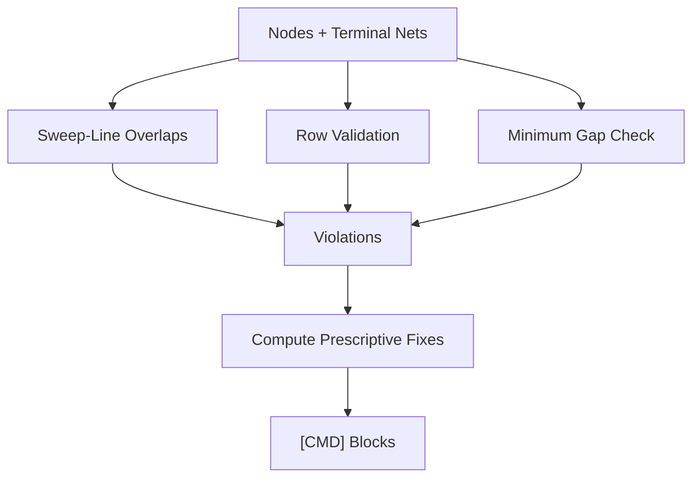

**Diagram sources**
- [drc_critic.py:184-258](file://ai_agent/ai_chat_bot/agents/drc_critic.py#L184-L258)
- [drc_critic.py:265-546](file://ai_agent/ai_chat_bot/agents/drc_critic.py#L265-L546)
- [drc_critic.py:575-800](file://ai_agent/ai_chat_bot/agents/drc_critic.py#L575-L800)

**Section sources**
- [drc_critic.py:45-101](file://ai_agent/ai_chat_bot/agents/drc_critic.py#L45-L101)
- [drc_critic.py:265-546](file://ai_agent/ai_chat_bot/agents/drc_critic.py#L265-L546)
- [drc_critic.py:575-800](file://ai_agent/ai_chat_bot/agents/drc_critic.py#L575-L800)

### Routing Pre-Viewer
- Responsibilities
  - Estimate routing quality via wire length and crossing counts; recommend beneficial swaps and priority annotations.
- Scoring
  - Computes per-net spans, wire lengths, and criticality; identifies worst nets and suggests same-row swap candidates.
- Output
  - Structured report and [CMD] blocks for targeted improvements.

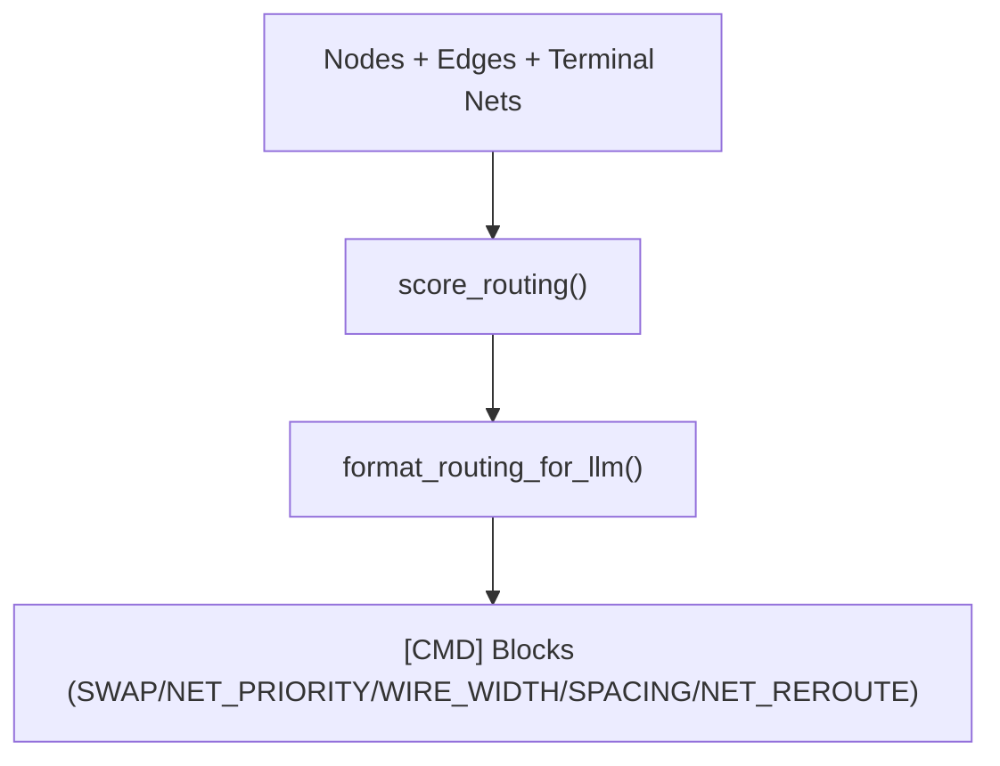

**Diagram sources**
- [routing_previewer.py:125-269](file://ai_agent/ai_chat_bot/agents/routing_previewer.py#L125-L269)
- [routing_previewer.py:274-370](file://ai_agent/ai_chat_bot/agents/routing_previewer.py#L274-L370)

**Section sources**
- [routing_previewer.py:48-118](file://ai_agent/ai_chat_bot/agents/routing_previewer.py#L48-L118)
- [routing_previewer.py:125-269](file://ai_agent/ai_chat_bot/agents/routing_previewer.py#L125-L269)
- [routing_previewer.py:274-370](file://ai_agent/ai_chat_bot/agents/routing_previewer.py#L274-L370)

### Human-in-the-Loop and Pause/Resume
- Mechanism
  - After DRC, the orchestrator pauses at a human viewer node awaiting approval.
  - Approved flows save results; rejected flows loop back to Placement Specialist for edits.
- State Flag
  - The approved flag in the state dictionary controls the routing after human review.

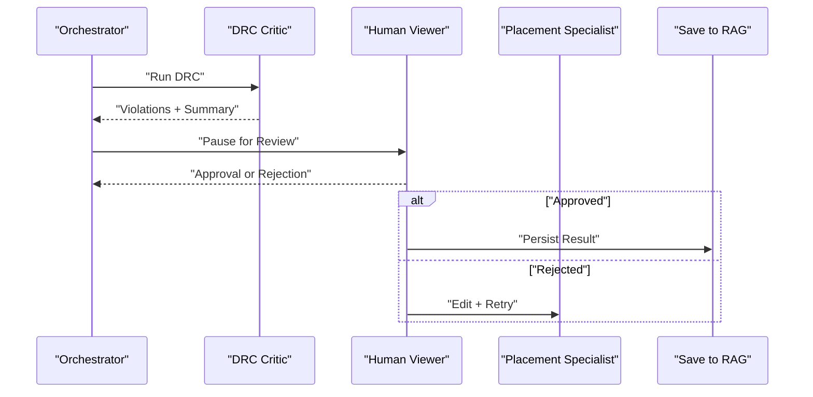

**Diagram sources**
- [graph.py:47-47](file://ai_agent/ai_chat_bot/graph.py#L47-L47)
- [state.py:36-37](file://ai_agent/ai_chat_bot/state.py#L36-L37)

**Section sources**
- [graph.py:47-47](file://ai_agent/ai_chat_bot/graph.py#L47-L47)
- [state.py:36-37](file://ai_agent/ai_chat_bot/state.py#L36-L37)

## Dependency Analysis
- Agent-to-Agent Dependencies
  - Topology Analyst feeds Strategy Selector; Strategy Selector feeds Placement Specialist; Placement Specialist feeds Routing Pre-Viewer; Routing Pre-Viewer and DRC Critic feed back into Placement Specialist or Routing Pre-Viewer depending on results.
- Shared Utilities
  - Tools provide safe wrappers for DRC, routing scoring, device conservation, and overlap resolution.
  - Knowledge Base and Skill Middleware augment agent prompts with domain expertise.
- State Coupling
  - All nodes read/write the same typed state, ensuring consistent data flow and minimizing duplication.

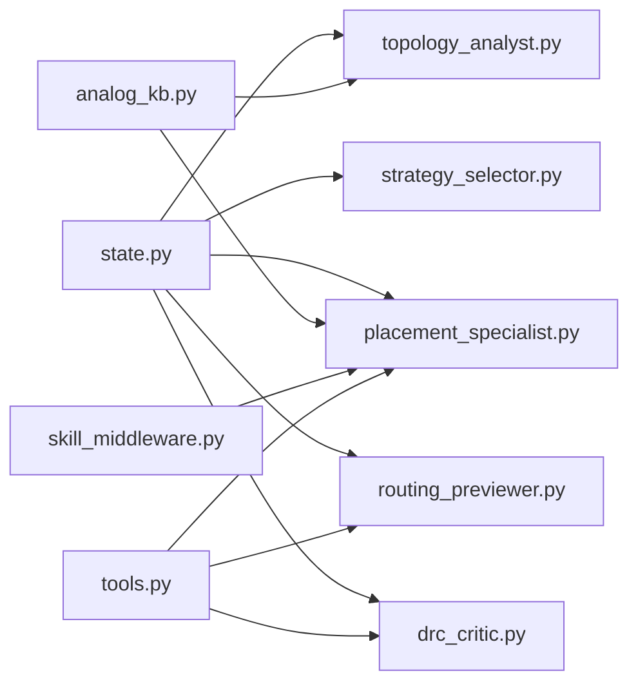

**Diagram sources**
- [state.py:1-37](file://ai_agent/ai_chat_bot/state.py#L1-L37)
- [analog_kb.py:1-333](file://ai_agent/ai_chat_bot/analog_kb.py#L1-L333)
- [skill_middleware.py:1-278](file://ai_agent/ai_chat_bot/skill_middleware.py#L1-L278)
- [tools.py:1-230](file://ai_agent/ai_chat_bot/tools.py#L1-L230)

**Section sources**
- [state.py:1-37](file://ai_agent/ai_chat_bot/state.py#L1-L37)
- [analog_kb.py:1-333](file://ai_agent/ai_chat_bot/analog_kb.py#L1-L333)
- [tools.py:1-230](file://ai_agent/ai_chat_bot/tools.py#L1-L230)
- [skill_middleware.py:1-278](file://ai_agent/ai_chat_bot/skill_middleware.py#L1-L278)

## Performance Considerations
- DRC Complexity
  - The sweep-line overlap detection reduces typical O(N^2) checks to O(N log N + R), significantly improving scalability for large device counts.
- Routing Heuristics
  - Per-net span and criticality weighting provide a practical proxy for wire length and crossings, guiding targeted improvements.
- Validation Efficiency
  - Slot-first coordinate derivation and deterministic sequencing minimize validation overhead and prevent cascading failures.

[No sources needed since this section provides general guidance]

## Troubleshooting Guide
- DRC Failures
  - Use the structured violations and prescriptive fix coordinates to resolve overlaps, gaps, and row errors.
  - Preserve matched-group symmetries when applying group moves.
- Placement Validation Failures
  - Fail-fast policy prevents retries; inspect slot maps and validation messages to identify the root cause (overlap, centroid mismatch, symmetry violation).
- Routing Quality
  - Review the routing report and suggested swaps; prioritize critical nets and avoid separating adjacent matched pairs.
- Device Conservation
  - The validation guard ensures no devices are lost or duplicated; investigate discrepancies in proposed vs. original inventories.
- Human-in-the-Loop
  - If the result is rejected, iterate on placement adjustments; approved results are persisted for downstream use.

**Section sources**
- [drc_critic.py:265-546](file://ai_agent/ai_chat_bot/agents/drc_critic.py#L265-L546)
- [placement_specialist.py:615-641](file://ai_agent/ai_chat_bot/agents/placement_specialist.py#L615-L641)
- [routing_previewer.py:125-269](file://ai_agent/ai_chat_bot/agents/routing_previewer.py#L125-L269)
- [tools.py:69-115](file://ai_agent/ai_chat_bot/tools.py#L69-L115)

## Conclusion
The multi-agent system combines specialized agents with a robust orchestrator to automate analog layout from topology understanding through placement, DRC enforcement, and routing optimization. The intent classification system ensures appropriate routing of user requests, while the state machine and human-in-the-loop features provide reliable control and recovery. Shared utilities and middleware inject domain knowledge and skills to guide high-quality outcomes.