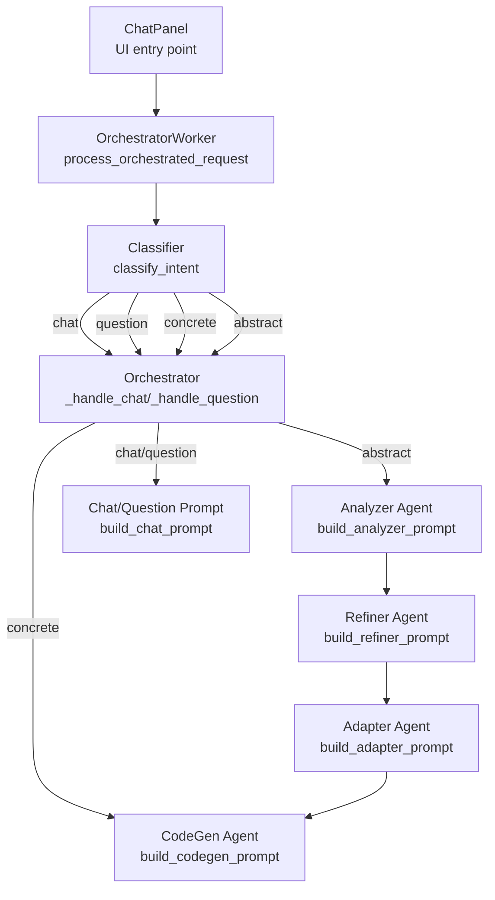
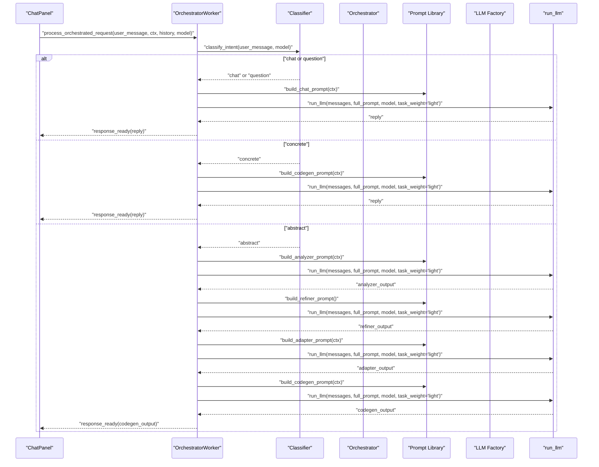
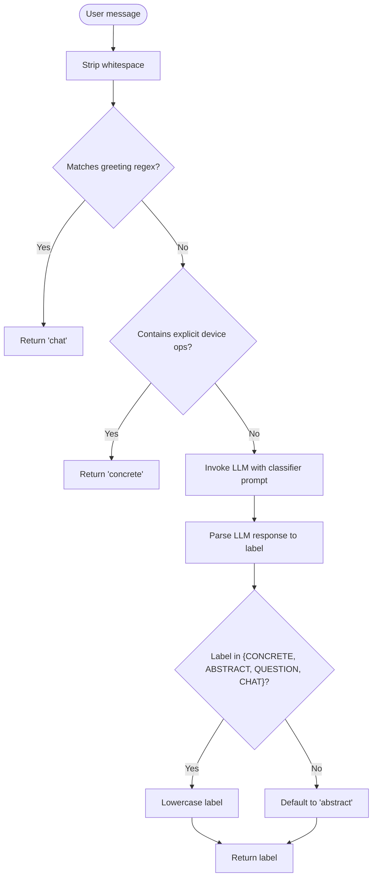
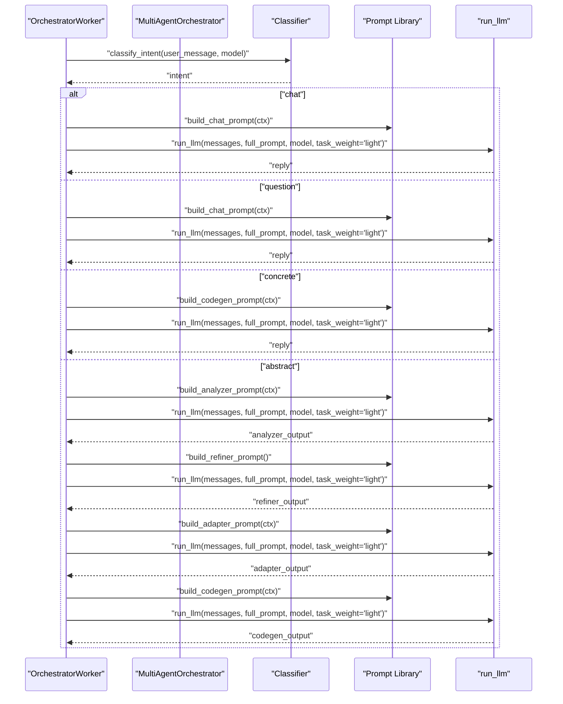
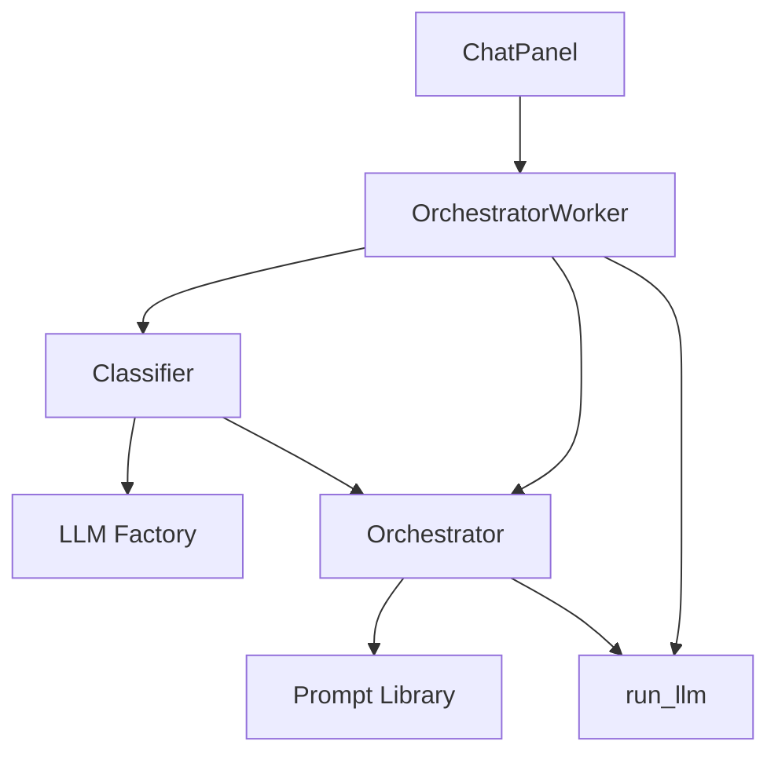

# Intent Classification System

<cite>
**Referenced Files in This Document**
- [classifier.py](file://ai_agent/ai_chat_bot/agents/classifier.py)
- [prompts.py](file://ai_agent/ai_chat_bot/agents/prompts.py)
- [orchestrator.py](file://ai_agent/ai_chat_bot/agents/orchestrator.py)
- [llm_factory.py](file://ai_agent/ai_chat_bot/llm_factory.py)
- [run_llm.py](file://ai_agent/ai_chat_bot/run_llm.py)
- [llm_worker.py](file://ai_agent/ai_chat_bot/llm_worker.py)
- [chat_panel.py](file://symbolic_editor/chat_panel.py)
- [graph.py](file://ai_agent/ai_chat_bot/graph.py)
</cite>

## Table of Contents
1. [Introduction](#introduction)
2. [Project Structure](#project-structure)
3. [Core Components](#core-components)
4. [Architecture Overview](#architecture-overview)
5. [Detailed Component Analysis](#detailed-component-analysis)
6. [Dependency Analysis](#dependency-analysis)
7. [Performance Considerations](#performance-considerations)
8. [Troubleshooting Guide](#troubleshooting-guide)
9. [Conclusion](#conclusion)

## Introduction
This document explains the intent classification system that routes user requests to appropriate agents in the AI-Based-Analog-Layout-Automation project. The classifier determines whether a user’s message should be treated as a casual greeting (chat), a direct device manipulation request (concrete), an informational query (question), or a high-level design goal requiring analysis (abstract). It uses a fast regex-based path for common cases and falls back to a lightweight LLM call when ambiguity exists. The classification outcome drives the downstream multi-agent pipeline, ensuring efficient and accurate routing of user intents.

## Project Structure
The intent classification system resides within the AI chat bot module and integrates with the broader multi-agent orchestrator and LLM infrastructure. The key files are:
- Classifier agent: performs intent classification
- Orchestrator: routes messages to appropriate agents based on classification
- Prompt library: defines agent-specific prompts and layout context formatting
- LLM factory and runner: provide unified LLM invocation with retries and timeouts
- Chat panel and worker: front-end integration and pipeline orchestration

**Diagram sources**
- [chat_panel.py:584-614](file://symbolic_editor/chat_panel.py#L584-L614)
- [llm_worker.py:196-336](file://ai_agent/ai_chat_bot/llm_worker.py#L196-L336)
- [classifier.py:60-105](file://ai_agent/ai_chat_bot/agents/classifier.py#L60-L105)
- [orchestrator.py:23-226](file://ai_agent/ai_chat_bot/agents/orchestrator.py#L23-L226)
- [prompts.py:86-241](file://ai_agent/ai_chat_bot/agents/prompts.py#L86-L241)

**Section sources**
- [classifier.py:1-105](file://ai_agent/ai_chat_bot/agents/classifier.py#L1-L105)
- [orchestrator.py:1-226](file://ai_agent/ai_chat_bot/agents/orchestrator.py#L1-L226)
- [prompts.py:1-383](file://ai_agent/ai_chat_bot/agents/prompts.py#L1-L383)
- [llm_worker.py:1-461](file://ai_agent/ai_chat_bot/llm_worker.py#L1-L461)
- [chat_panel.py:1-800](file://symbolic_editor/chat_panel.py#L1-L800)

## Core Components
- Intent classifier: fast regex-based classification for greetings and explicit device operations, with a lightweight LLM fallback for ambiguous cases
- Orchestrator: routes classified intents to chat/question handlers, concrete command generation, or the abstract pipeline
- Prompt library: provides concise, task-focused prompts for each agent and formats layout context for LLMs
- LLM factory and runner: centralized model instantiation and robust request handling with retries and timeouts
- Front-end integration: ChatPanel detects layout context and triggers the orchestrator pipeline; OrchestratorWorker executes the multi-agent flow

Key behaviors:
- Regex fast-path avoids LLM calls for trivial cases (e.g., greetings, explicit device operations)
- LLM fallback returns one of the four canonical labels and defaults to abstract on error
- Abstract requests initiate a multi-stage pipeline: Analyzer → Refiner → Adapter → CodeGen
- Concrete requests bypass the pipeline and produce direct commands

**Section sources**
- [classifier.py:60-105](file://ai_agent/ai_chat_bot/agents/classifier.py#L60-L105)
- [orchestrator.py:43-96](file://ai_agent/ai_chat_bot/agents/orchestrator.py#L43-L96)
- [prompts.py:86-241](file://ai_agent/ai_chat_bot/agents/prompts.py#L86-L241)
- [llm_factory.py:29-131](file://ai_agent/ai_chat_bot/llm_factory.py#L29-L131)
- [run_llm.py:76-162](file://ai_agent/ai_chat_bot/run_llm.py#L76-L162)
- [llm_worker.py:196-336](file://ai_agent/ai_chat_bot/llm_worker.py#L196-L336)
- [chat_panel.py:481-514](file://symbolic_editor/chat_panel.py#L481-L514)

## Architecture Overview
The classification system sits at the front of the multi-agent pipeline. It inspects the user message, decides the intent category, and directs the orchestrator accordingly. The orchestrator then selects the appropriate agent prompts and executes the necessary LLM calls.

**Diagram sources**
- [chat_panel.py:584-614](file://symbolic_editor/chat_panel.py#L584-L614)
- [llm_worker.py:196-336](file://ai_agent/ai_chat_bot/llm_worker.py#L196-L336)
- [classifier.py:60-105](file://ai_agent/ai_chat_bot/agents/classifier.py#L60-L105)
- [orchestrator.py:43-226](file://ai_agent/ai_chat_bot/agents/orchestrator.py#L43-L226)
- [prompts.py:86-241](file://ai_agent/ai_chat_bot/agents/prompts.py#L86-L241)
- [llm_factory.py:29-131](file://ai_agent/ai_chat_bot/llm_factory.py#L29-L131)
- [run_llm.py:76-162](file://ai_agent/ai_chat_bot/run_llm.py#L76-L162)

## Detailed Component Analysis

### Classifier Agent
The classifier performs intent classification using:
- A regex-based fast-path for greetings and explicit device operations
- A lightweight LLM fallback for ambiguous messages
- Robust error handling that defaults to abstract intent

Classification logic:
- Chat: casual greetings, thanks, small talk
- Concrete: explicit device operations (swap, move, flip, add dummy, delete, set orientation)
- Question: informational queries that do not require layout changes
- Abstract: high-level goals requiring topology analysis (optimize, improve, reduce, fix, CMRR, matching, symmetry, routing, parasitics, DRC, placement)

Decision-making criteria:
- If the message matches the greeting regex, return chat
- If the message contains explicit device-operation keywords, return concrete
- Otherwise, ask the LLM to classify into one of the four categories
- On LLM failure or empty response, default to abstract

**Diagram sources**
- [classifier.py:60-105](file://ai_agent/ai_chat_bot/agents/classifier.py#L60-L105)

**Section sources**
- [classifier.py:14-105](file://ai_agent/ai_chat_bot/agents/classifier.py#L14-L105)

### Orchestrator Integration
The orchestrator receives the classified intent and routes the request to:
- Chat/Question handler: returns conversational replies without layout changes
- Concrete handler: generates direct commands via CodeGen prompt
- Abstract handler: runs Analyzer → Refiner → Adapter → CodeGen pipeline

State management:
- Tracks pipeline state to handle user feedback during Refiner pause
- Caches Analyzer output for Adapter step

**Diagram sources**
- [llm_worker.py:236-336](file://ai_agent/ai_chat_bot/llm_worker.py#L236-L336)
- [orchestrator.py:43-226](file://ai_agent/ai_chat_bot/agents/orchestrator.py#L43-L226)
- [prompts.py:86-241](file://ai_agent/ai_chat_bot/agents/prompts.py#L86-L241)
- [run_llm.py:76-162](file://ai_agent/ai_chat_bot/run_llm.py#L76-L162)

**Section sources**
- [orchestrator.py:23-226](file://ai_agent/ai_chat_bot/agents/orchestrator.py#L23-L226)
- [llm_worker.py:196-336](file://ai_agent/ai_chat_bot/llm_worker.py#L196-L336)

### Prompt Library and Layout Context
The prompt library provides:
- Short, focused prompts for each agent to prevent prompt dilution
- Layout context formatting supporting both abstracted hierarchy and raw device listings
- Grid-aware CodeGen prompt with coordinate rules and matching protection

Key prompts:
- Chat/Question: friendly conversational responses, no [CMD] blocks
- Analyzer: identifies circuit topology and proposes improvement strategies
- Refiner: formats strategies for user selection
- Adapter: maps approved strategies to concrete directives using real device IDs
- CodeGen: produces [CMD] JSON blocks with strict rules and grid snapping

**Section sources**
- [prompts.py:17-383](file://ai_agent/ai_chat_bot/agents/prompts.py#L17-L383)

### LLM Factory and Runner
The LLM factory centralizes model instantiation and selects models based on task weight:
- Light tasks (chat, classification, single-agent): cheaper, faster models
- Heavy tasks (analysis, refinement): more capable models

The runner provides:
- Automatic retry with exponential backoff for transient API errors
- Unified interface for single-turn and streaming requests
- Timeout configuration via environment variables

**Section sources**
- [llm_factory.py:29-131](file://ai_agent/ai_chat_bot/llm_factory.py#L29-L131)
- [run_llm.py:76-162](file://ai_agent/ai_chat_bot/run_llm.py#L76-L162)

### Front-End Integration
The ChatPanel:
- Detects layout context and triggers the orchestrator pipeline for all messages when layout is present
- Routes messages containing specific keywords to the multi-agent pipeline
- Emits signals to OrchestratorWorker for processing and displays thinking indicators

**Section sources**
- [chat_panel.py:481-514](file://symbolic_editor/chat_panel.py#L481-L514)
- [chat_panel.py:584-614](file://symbolic_editor/chat_panel.py#L584-L614)

## Dependency Analysis
The classifier depends on:
- LLM factory for lightweight model instantiation
- Regex patterns for fast-path classification
- Orchestrator for routing decisions

The orchestrator depends on:
- Classifier for intent determination
- Prompt library for agent-specific prompts
- LLM runner for multi-turn conversations

The LLM factory and runner are shared across the system, ensuring consistent behavior and resource management.

**Diagram sources**
- [classifier.py:12-13](file://ai_agent/ai_chat_bot/agents/classifier.py#L12-L13)
- [llm_factory.py:29-131](file://ai_agent/ai_chat_bot/llm_factory.py#L29-L131)
- [orchestrator.py:69-70](file://ai_agent/ai_chat_bot/agents/orchestrator.py#L69-L70)
- [prompts.py:86-241](file://ai_agent/ai_chat_bot/agents/prompts.py#L86-L241)
- [run_llm.py:76-162](file://ai_agent/ai_chat_bot/run_llm.py#L76-L162)
- [llm_worker.py:196-336](file://ai_agent/ai_chat_bot/llm_worker.py#L196-L336)
- [chat_panel.py:584-614](file://symbolic_editor/chat_panel.py#L584-L614)

**Section sources**
- [classifier.py:12-13](file://ai_agent/ai_chat_bot/agents/classifier.py#L12-L13)
- [llm_factory.py:29-131](file://ai_agent/ai_chat_bot/llm_factory.py#L29-L131)
- [orchestrator.py:69-70](file://ai_agent/ai_chat_bot/agents/orchestrator.py#L69-L70)
- [prompts.py:86-241](file://ai_agent/ai_chat_bot/agents/prompts.py#L86-L241)
- [run_llm.py:76-162](file://ai_agent/ai_chat_bot/run_llm.py#L76-L162)
- [llm_worker.py:196-336](file://ai_agent/ai_chat_bot/llm_worker.py#L196-L336)
- [chat_panel.py:584-614](file://symbolic_editor/chat_panel.py#L584-L614)

## Performance Considerations
- Regex fast-path minimizes LLM calls for common cases, reducing latency and cost
- Lightweight LLM calls are used for classification and single-agent tasks
- Retries and timeouts prevent pipeline stalls due to transient API issues
- Prompt shortening reduces token usage and speeds up inference
- Coordinate grid rules avoid expensive recomputation by constraining movement to valid grids

[No sources needed since this section provides general guidance]

## Troubleshooting Guide
Common issues and resolutions:
- LLM errors or empty responses: classifier defaults to abstract, ensuring the pipeline continues
- Ambiguous messages: rely on the LLM fallback to disambiguate intent
- Transient API errors: run_llm retries with exponential backoff
- Incorrect agent selection: verify classifier regex coverage and prompt clarity
- Layout context missing: ensure ChatPanel provides nodes/edges/terminal_nets to the orchestrator

**Section sources**
- [classifier.py:92-104](file://ai_agent/ai_chat_bot/agents/classifier.py#L92-L104)
- [run_llm.py:99-123](file://ai_agent/ai_chat_bot/run_llm.py#L99-L123)
- [llm_worker.py:332-336](file://ai_agent/ai_chat_bot/llm_worker.py#L332-L336)

## Conclusion
The intent classification system efficiently routes user requests to the appropriate agents using a fast regex path and a lightweight LLM fallback. It integrates tightly with the orchestrator and prompt library to deliver accurate, context-aware responses. The design balances performance and accuracy while providing robust fallbacks and clear error handling, enabling reliable automation of analog layout tasks.