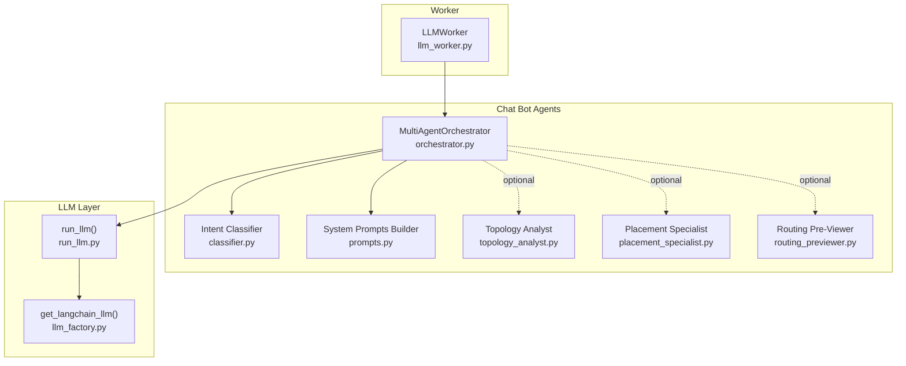
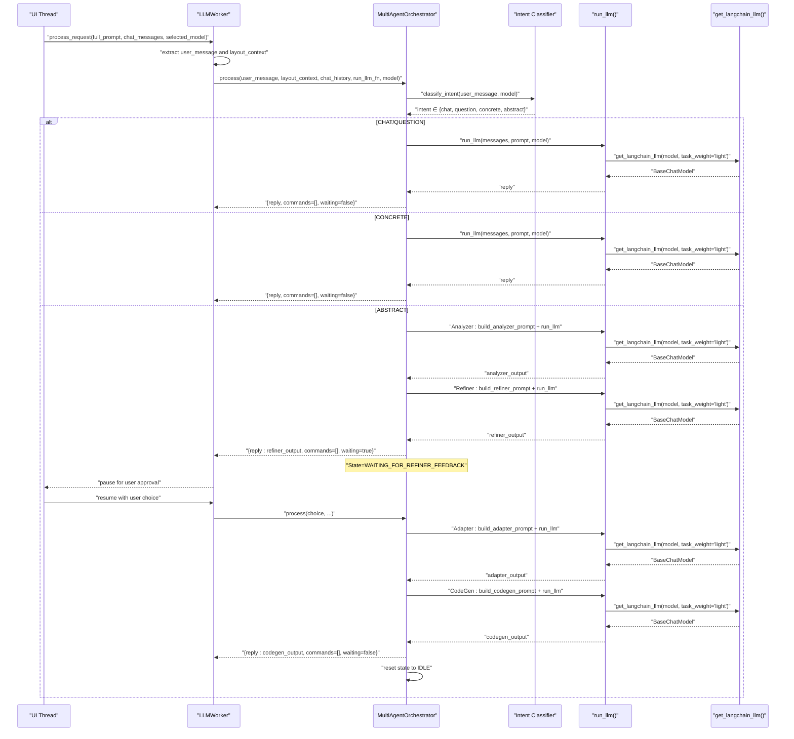
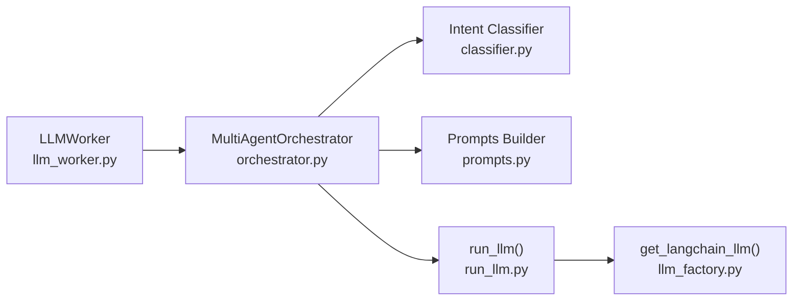

# Orchestrator System

<cite>
**Referenced Files in This Document**
- [orchestrator.py](file://ai_agent/ai_chat_bot/agents/orchestrator.py)
- [classifier.py](file://ai_agent/ai_chat_bot/agents/classifier.py)
- [prompts.py](file://ai_agent/ai_chat_bot/agents/prompts.py)
- [llm_factory.py](file://ai_agent/ai_chat_bot/llm_factory.py)
- [run_llm.py](file://ai_agent/ai_chat_bot/run_llm.py)
- [llm_worker.py](file://ai_agent/ai_chat_bot/llm_worker.py)
- [state.py](file://ai_agent/ai_chat_bot/state.py)
- [topology_analyst.py](file://ai_agent/ai_chat_bot/agents/topology_analyst.py)
- [placement_specialist.py](file://ai_agent/ai_chat_bot/agents/placement_specialist.py)
- [routing_previewer.py](file://ai_agent/ai_chat_bot/agents/routing_previewer.py)
</cite>

## Table of Contents
1. [Introduction](#introduction)
2. [Project Structure](#project-structure)
3. [Core Components](#core-components)
4. [Architecture Overview](#architecture-overview)
5. [Detailed Component Analysis](#detailed-component-analysis)
6. [Dependency Analysis](#dependency-analysis)
7. [Performance Considerations](#performance-considerations)
8. [Troubleshooting Guide](#troubleshooting-guide)
9. [Conclusion](#conclusion)

## Introduction
This document explains the MultiAgentOrchestrator system that coordinates a multi-agent pipeline for analog IC layout automation without external frameworks like LangGraph. The orchestrator implements a state machine to route user intents to specialized agents and manages human-in-the-loop approvals for complex proposals. It supports four workflow modes:
- CHAT/QUESTION: Friendly conversational replies
- CONCRETE: Direct command generation for immediate device edits
- ABSTRACT: Complex proposals with analyzer/refiner, human approval, adapter, and code generation

The orchestrator tracks state using a simple enum and caches intermediate analyzer output to streamline the approval-to-execution flow.

## Project Structure
The orchestrator lives in the chat bot agents package alongside specialized agents and prompts. It integrates with a worker that executes LLM calls and emits Qt signals to the UI.

**Diagram sources**
- [orchestrator.py:1-226](file://ai_agent/ai_chat_bot/agents/orchestrator.py#L1-L226)
- [classifier.py:1-105](file://ai_agent/ai_chat_bot/agents/classifier.py#L1-L105)
- [prompts.py:1-383](file://ai_agent/ai_chat_bot/agents/prompts.py#L1-L383)
- [run_llm.py:1-162](file://ai_agent/ai_chat_bot/run_llm.py#L1-L162)
- [llm_factory.py:1-131](file://ai_agent/ai_chat_bot/llm_factory.py#L1-L131)
- [llm_worker.py:1-461](file://ai_agent/ai_chat_bot/llm_worker.py#L1-L461)

**Section sources**
- [orchestrator.py:1-226](file://ai_agent/ai_chat_bot/agents/orchestrator.py#L1-L226)
- [llm_worker.py:87-165](file://ai_agent/ai_chat_bot/llm_worker.py#L87-L165)

## Core Components
- PipelineState: Tracks orchestration state with IDLE and WAITING_FOR_REFINER_FEEDBACK.
- MultiAgentOrchestrator: Routes messages, manages state, and orchestrates agent workflows.
- Intent Classifier: Fast regex-based classifier with LLM fallback.
- Prompts: Dedicated prompts for each agent role.
- LLM Integration: Unified run_llm wrapper with retries and model factory.

Key responsibilities:
- State management: reset, cache analyzer output, and switch between waiting and idle.
- Intent routing: CHAT/QUESTION, CONCRETE, ABSTRACT.
- Four-stage ABSTRACT flow: Analyzer → Refiner (pause) → Adapter → CodeGen.
- Human-in-the-loop: Pause after Refiner output and resume with approved choice.

**Section sources**
- [orchestrator.py:17-39](file://ai_agent/ai_chat_bot/agents/orchestrator.py#L17-L39)
- [orchestrator.py:43-96](file://ai_agent/ai_chat_bot/agents/orchestrator.py#L43-L96)
- [orchestrator.py:139-177](file://ai_agent/ai_chat_bot/agents/orchestrator.py#L139-L177)
- [orchestrator.py:182-225](file://ai_agent/ai_chat_bot/agents/orchestrator.py#L182-L225)
- [classifier.py:60-105](file://ai_agent/ai_chat_bot/agents/classifier.py#L60-L105)
- [prompts.py:86-241](file://ai_agent/ai_chat_bot/agents/prompts.py#L86-L241)
- [run_llm.py:76-162](file://ai_agent/ai_chat_bot/run_llm.py#L76-L162)
- [llm_factory.py:29-131](file://ai_agent/ai_chat_bot/llm_factory.py#L29-L131)

## Architecture Overview
The orchestrator sits between the UI worker and specialized agents. The worker extracts the latest user message and layout context, then calls orchestrator.process. The orchestrator classifies intent and routes to the appropriate handler. ABSTRACT workflow pauses after Refiner output and resumes upon user approval.

**Diagram sources**
- [llm_worker.py:104-165](file://ai_agent/ai_chat_bot/llm_worker.py#L104-L165)
- [orchestrator.py:43-96](file://ai_agent/ai_chat_bot/agents/orchestrator.py#L43-L96)
- [orchestrator.py:139-177](file://ai_agent/ai_chat_bot/agents/orchestrator.py#L139-L177)
- [orchestrator.py:182-225](file://ai_agent/ai_chat_bot/agents/orchestrator.py#L182-L225)
- [classifier.py:60-105](file://ai_agent/ai_chat_bot/agents/classifier.py#L60-L105)
- [run_llm.py:76-162](file://ai_agent/ai_chat_bot/run_llm.py#L76-L162)
- [llm_factory.py:29-131](file://ai_agent/ai_chat_bot/llm_factory.py#L29-L131)

## Detailed Component Analysis

### PipelineState and State Management
- IDLE: Default state; orchestrator proceeds with intent classification and agent execution.
- WAITING_FOR_REFINER_FEEDBACK: Paused after Refiner output; awaiting user choice to resume.

State transitions:
- IDLE → WAITING_FOR_REFINER_FEEDBACK after Analyzer+Refiner in ABSTRACT.
- WAITING_FOR_REFINER_FEEDBACK → IDLE after successful Adapter+CodeGen with user approval.

Caching:
- _pending_analyzer_output stores Analyzer output for Adapter step to avoid recomputation.

Reset behavior:
- reset() clears state and cached analyzer output.

**Section sources**
- [orchestrator.py:17-39](file://ai_agent/ai_chat_bot/agents/orchestrator.py#L17-L39)
- [orchestrator.py:63-66](file://ai_agent/ai_chat_bot/agents/orchestrator.py#L63-L66)
- [orchestrator.py:174-175](file://ai_agent/ai_chat_bot/agents/orchestrator.py#L174-L175)
- [orchestrator.py:222-223](file://ai_agent/ai_chat_bot/agents/orchestrator.py#L222-L223)

### Main Process Method
- Extracts user message and layout context from the worker.
- If state is waiting for feedback, routes to _handle_refiner_feedback.
- Otherwise, classifies intent and routes to _handle_chat, _handle_question, _handle_concrete, or _handle_abstract.

History handling:
- Chat handlers include recent chat history entries to provide context.

**Section sources**
- [orchestrator.py:43-96](file://ai_agent/ai_chat_bot/agents/orchestrator.py#L43-L96)
- [llm_worker.py:112-137](file://ai_agent/ai_chat_bot/llm_worker.py#L112-L137)

### Intent Classification
- Fast-path regex for casual chat and concrete device operations.
- LLM-based classifier for ambiguous cases with a strict output format.
- Falls back to abstract on error to keep the pipeline running.

**Section sources**
- [classifier.py:14-105](file://ai_agent/ai_chat_bot/agents/classifier.py#L14-L105)

### CHAT/QUESTION Handlers
- Build a chat prompt from layout context.
- Include recent chat history for context.
- Single LLM call returns a friendly reply; no commands.

**Section sources**
- [orchestrator.py:100-121](file://ai_agent/ai_chat_bot/agents/orchestrator.py#L100-L121)
- [prompts.py:86-96](file://ai_agent/ai_chat_bot/agents/prompts.py#L86-L96)

### CONCRETE Handler
- Builds a codegen prompt and returns a single LLM reply.
- Intended for direct device operations; no commands are generated here.

**Section sources**
- [orchestrator.py:126-134](file://ai_agent/ai_chat_bot/agents/orchestrator.py#L126-L134)
- [prompts.py:189-241](file://ai_agent/ai_chat_bot/agents/prompts.py#L189-L241)

### ABSTRACT Handler (Analyzer → Refiner → Pause)
- Analyzer: Identifies circuit topology and proposes 2–4 improvement strategies.
- Refiner: Formats strategies into numbered options and asks the user to choose.
- Orchestrator caches analyzer output and sets state to waiting for feedback.

Human-in-the-loop:
- Orchestrator returns waiting=true and pauses execution.
- UI should display Refiner output and await user choice.

**Section sources**
- [orchestrator.py:139-177](file://ai_agent/ai_chat_bot/agents/orchestrator.py#L139-L177)
- [prompts.py:102-137](file://ai_agent/ai_chat_bot/agents/prompts.py#L102-L137)
- [prompts.py:143-157](file://ai_agent/ai_chat_bot/agents/prompts.py#L143-L157)

### Refiner Feedback Handler (Adapter → CodeGen → Resume)
- Adapter: Maps approved strategy to concrete directives using real device IDs.
- CodeGen: Produces [CMD] JSON blocks with grid-aware coordinates.
- Orchestrator resets state and clears cached analyzer output.

**Section sources**
- [orchestrator.py:182-225](file://ai_agent/ai_chat_bot/agents/orchestrator.py#L182-L225)
- [prompts.py:163-183](file://ai_agent/ai_chat_bot/agents/prompts.py#L163-L183)
- [prompts.py:189-241](file://ai_agent/ai_chat_bot/agents/prompts.py#L189-L241)

### Agent Roles and Prompts
- Analyzer: Topology-aware strategy proposal with analog KB injection.
- Refiner: Concise, numbered strategy presentation with user choice prompt.
- Adapter: Maps approved plan to device-centric directives.
- CodeGen: Strict JSON command generator with coordinate rules and matching protection.

**Section sources**
- [prompts.py:102-137](file://ai_agent/ai_chat_bot/agents/prompts.py#L102-L137)
- [prompts.py:143-157](file://ai_agent/ai_chat_bot/agents/prompts.py#L143-L157)
- [prompts.py:163-183](file://ai_agent/ai_chat_bot/agents/prompts.py#L163-L183)
- [prompts.py:189-241](file://ai_agent/ai_chat_bot/agents/prompts.py#L189-L241)

### Optional Agents in the Full Pipeline
While the orchestrator focuses on the chatbot pipeline, the broader system includes:
- Topology Analyst: Extracts topology constraints from netlists.
- Placement Specialist: Generates [CMD] blocks with strict matching and row rules.
- Routing Pre-Viewer: Estimates routing quality and suggests swaps.

These agents participate in the LangGraph pipeline and are not invoked by the chatbot orchestrator.

**Section sources**
- [topology_analyst.py:27-159](file://ai_agent/ai_chat_bot/agents/topology_analyst.py#L27-L159)
- [placement_specialist.py:15-596](file://ai_agent/ai_chat_bot/agents/placement_specialist.py#L15-L596)
- [routing_previewer.py:48-117](file://ai_agent/ai_chat_bot/agents/routing_previewer.py#L48-L117)

## Dependency Analysis
The orchestrator depends on:
- Intent Classifier for routing decisions
- Prompts for building agent-specific system prompts
- LLM integration for executing agent tasks
- Worker for extracting user message and layout context

**Diagram sources**
- [orchestrator.py:1-226](file://ai_agent/ai_chat_bot/agents/orchestrator.py#L1-L226)
- [classifier.py:1-105](file://ai_agent/ai_chat_bot/agents/classifier.py#L1-L105)
- [prompts.py:1-383](file://ai_agent/ai_chat_bot/agents/prompts.py#L1-L383)
- [run_llm.py:1-162](file://ai_agent/ai_chat_bot/run_llm.py#L1-L162)
- [llm_factory.py:1-131](file://ai_agent/ai_chat_bot/llm_factory.py#L1-L131)
- [llm_worker.py:1-461](file://ai_agent/ai_chat_bot/llm_worker.py#L1-L461)

**Section sources**
- [orchestrator.py:69-95](file://ai_agent/ai_chat_bot/agents/orchestrator.py#L69-L95)
- [run_llm.py:126-162](file://ai_agent/ai_chat_bot/run_llm.py#L126-L162)
- [llm_factory.py:29-131](file://ai_agent/ai_chat_bot/llm_factory.py#L29-L131)
- [llm_worker.py:104-165](file://ai_agent/ai_chat_bot/llm_worker.py#L104-L165)

## Performance Considerations
- Classifier fast-path reduces LLM calls for simple cases.
- run_llm includes exponential backoff for transient API errors to prevent pipeline stalls.
- ABSTRACT flow caches analyzer output to avoid recomputation during approval/resume.
- Worker extracts only the latest user message and layout context to minimize prompt size.

Recommendations:
- Keep chat history trimming consistent with handler logic.
- Monitor LLM latency and tune task_weight for heavy operations.
- Consider batching or caching frequently reused prompts if extending the system.

[No sources needed since this section provides general guidance]

## Troubleshooting Guide
Common issues and strategies:
- Empty or invalid LLM responses: run_llm retries transient errors and returns descriptive messages; check API keys and quotas.
- Classifier fallback: If LLM fails, classifier falls back to abstract; verify selected_model and environment variables.
- State stuck in waiting: Ensure user choice is passed to orchestrator to resume; reset state if needed.
- Coordinate rule violations: CodeGen enforces grid-aware coordinates; verify layout context and device IDs.

**Section sources**
- [run_llm.py:98-124](file://ai_agent/ai_chat_bot/run_llm.py#L98-L124)
- [run_llm.py:156-162](file://ai_agent/ai_chat_bot/run_llm.py#L156-L162)
- [classifier.py:102-105](file://ai_agent/ai_chat_bot/agents/classifier.py#L102-L105)
- [orchestrator.py:35-39](file://ai_agent/ai_chat_bot/agents/orchestrator.py#L35-L39)
- [prompts.py:207-238](file://ai_agent/ai_chat_bot/agents/prompts.py#L207-L238)

## Conclusion
The MultiAgentOrchestrator implements a robust, stateful routing mechanism for analog layout tasks. It classifies user intent, coordinates specialized agents, and enables human-in-the-loop approvals for complex proposals. Its design emphasizes simplicity, reliability, and clear state transitions, enabling predictable behavior across chatbot and broader pipeline contexts.