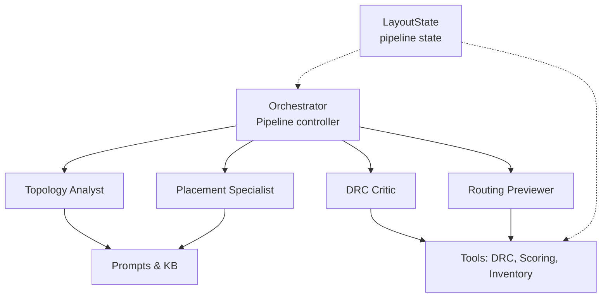
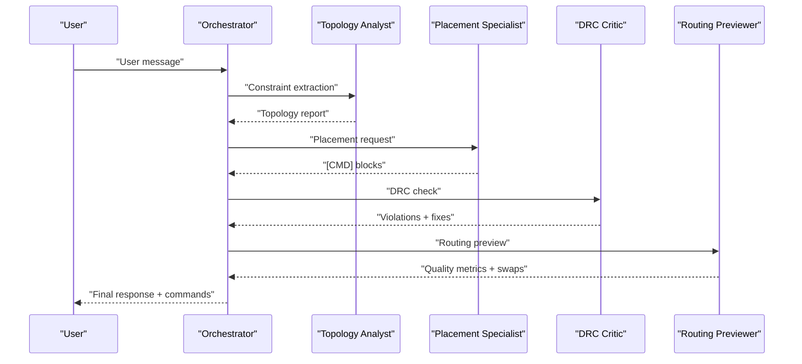
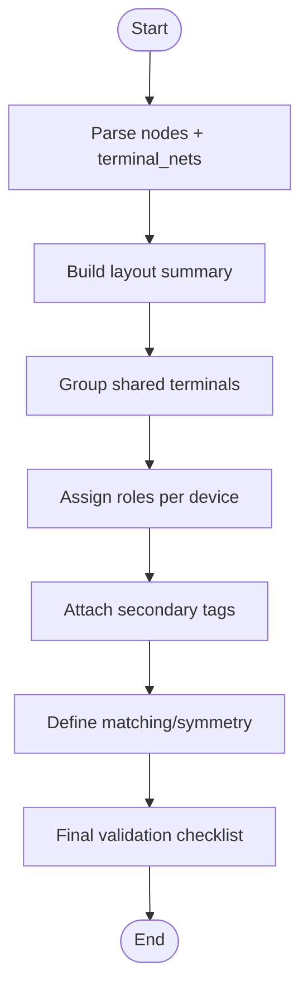
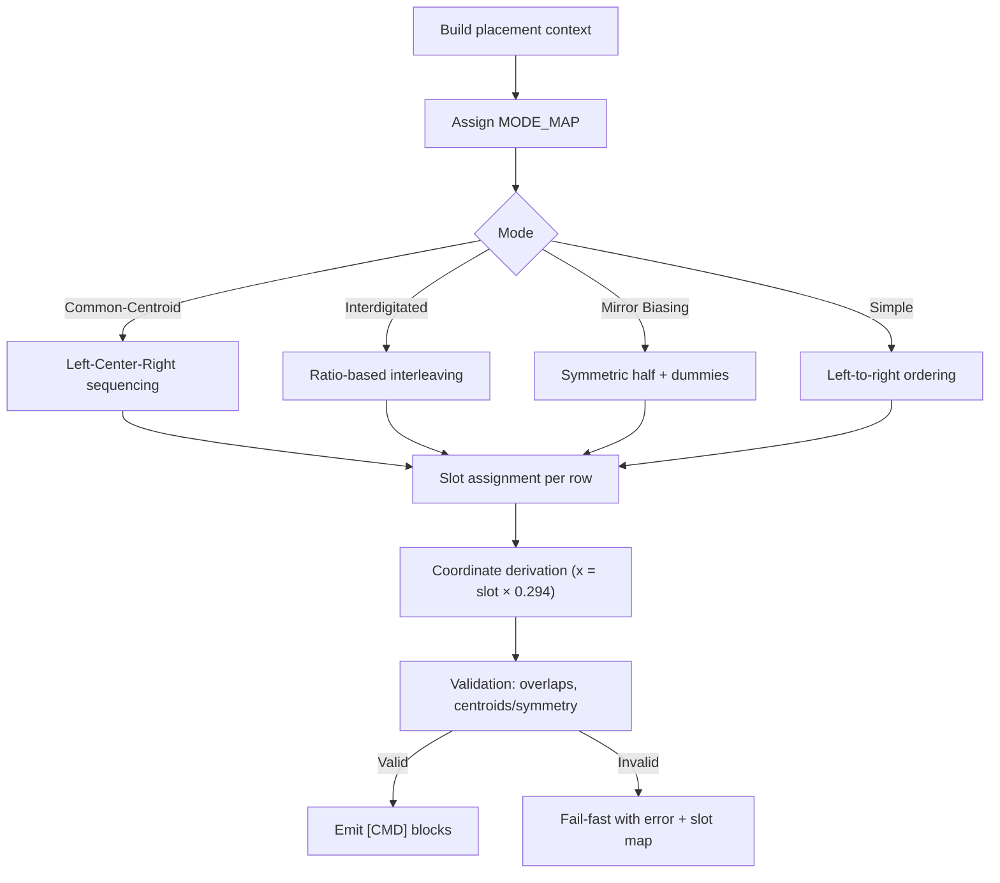
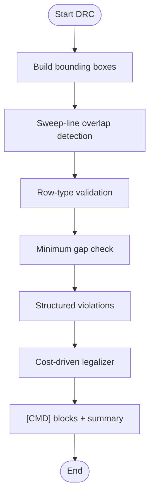
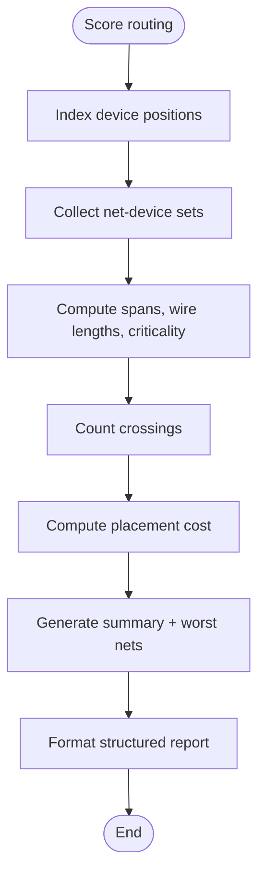
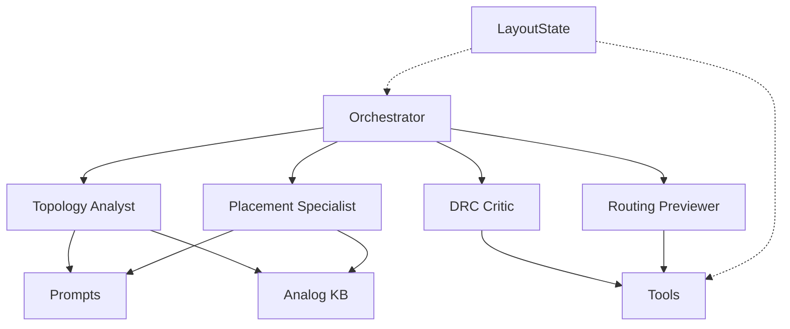

# Specialized Agent Types

<cite>
**Referenced Files in This Document**
- [topology_analyst.py](file://ai_agent/ai_chat_bot/agents/topology_analyst.py)
- [placement_specialist.py](file://ai_agent/ai_chat_bot/agents/placement_specialist.py)
- [drc_critic.py](file://ai_agent/ai_chat_bot/agents/drc_critic.py)
- [routing_previewer.py](file://ai_agent/ai_chat_bot/agents/routing_previewer.py)
- [prompts.py](file://ai_agent/ai_chat_bot/agents/prompts.py)
- [analog_kb.py](file://ai_agent/ai_chat_bot/analog_kb.py)
- [orchestrator.py](file://ai_agent/ai_chat_bot/agents/orchestrator.py)
- [tools.py](file://ai_agent/ai_chat_bot/tools.py)
- [state.py](file://ai_agent/ai_chat_bot/state.py)
- [skill_middleware.py](file://ai_agent/ai_chat_bot/skill_middleware.py)
- [common-centroid-matching.md](file://ai_agent/SKILLS/common-centroid-matching.md)
- [interdigitated-matching.md](file://ai_agent/SKILLS/interdigitated-matching.md)
- [mirror-biasing-sequencing.md](file://ai_agent/SKILLS/mirror-biasing-sequencing.md)
</cite>

## Table of Contents
1. [Introduction](#introduction)
2. [Project Structure](#project-structure)
3. [Core Components](#core-components)
4. [Architecture Overview](#architecture-overview)
5. [Detailed Component Analysis](#detailed-component-analysis)
6. [Dependency Analysis](#dependency-analysis)
7. [Performance Considerations](#performance-considerations)
8. [Troubleshooting Guide](#troubleshooting-guide)
9. [Conclusion](#conclusion)
10. [Appendices](#appendices)

## Introduction
This document explains the specialized agent types that compose the multi-agent analog layout automation pipeline. It focuses on four agents:
- Topology Analyst: extracts circuit topology and device-centric grouping for downstream agents.
- Placement Specialist: generates precise device placement commands respecting matching, symmetry, and routing goals.
- DRC Critic: enforces design rule compliance and manufacturing constraints with fast algorithms and symmetry-preserving legalizations.
- Routing Previewer: evaluates current placement for routing quality and suggests targeted swap and routing adjustments.

For each agent, we describe responsibilities, inputs, processing logic, outputs, agent-specific prompts, data structures, and integration patterns. We also show how agents collaborate in the pipeline and how specialized skills are injected to guide placement.

## Project Structure
The agents live under ai_agent/ai_chat_bot/agents and are integrated by the orchestrator. Supporting utilities include tools for DRC, routing scoring, and state management. Domain knowledge is injected via prompts and a dedicated analog knowledge base.

**Diagram sources**
- [orchestrator.py:23-226](file://ai_agent/ai_chat_bot/agents/orchestrator.py#L23-L226)
- [topology_analyst.py:27-159](file://ai_agent/ai_chat_bot/agents/topology_analyst.py#L27-L159)
- [placement_specialist.py:15-596](file://ai_agent/ai_chat_bot/agents/placement_specialist.py#L15-L596)
- [drc_critic.py:45-101](file://ai_agent/ai_chat_bot/agents/drc_critic.py#L45-L101)
- [routing_previewer.py:48-117](file://ai_agent/ai_chat_bot/agents/routing_previewer.py#L48-L117)
- [prompts.py:17-80](file://ai_agent/ai_chat_bot/agents/prompts.py#L17-L80)
- [tools.py:15-230](file://ai_agent/ai_chat_bot/tools.py#L15-L230)
- [state.py:3-37](file://ai_agent/ai_chat_bot/state.py#L3-L37)

**Section sources**
- [orchestrator.py:1-226](file://ai_agent/ai_chat_bot/agents/orchestrator.py#L1-L226)
- [state.py:1-37](file://ai_agent/ai_chat_bot/state.py#L1-L37)

## Core Components
- Topology Analyst: Parses layout JSON and netlists to identify circuit topologies, primary device groups, roles, secondary tags, matching/symmetry requirements, and overall circuit function. Outputs a structured, device-centric topology report.
- Placement Specialist: Produces [CMD] blocks for device repositioning, enforcing device conservation, row-level constraints, and routing-aware ordering. Integrates with skill middleware for mode-specific strategies.
- DRC Critic: Validates placement against overlaps, minimum gaps, and row-type errors using sweep-line algorithms and dynamic gap computation. Generates exact corrective [CMD] blocks with symmetry preservation.
- Routing Previewer: Estimates routing quality via wire length and crossing counts, classifies net criticality, and recommends swaps and routing adjustments to reduce congestion.

**Section sources**
- [topology_analyst.py:27-159](file://ai_agent/ai_chat_bot/agents/topology_analyst.py#L27-L159)
- [placement_specialist.py:15-596](file://ai_agent/ai_chat_bot/agents/placement_specialist.py#L15-L596)
- [drc_critic.py:45-101](file://ai_agent/ai_chat_bot/agents/drc_critic.py#L45-L101)
- [routing_previewer.py:48-117](file://ai_agent/ai_chat_bot/agents/routing_previewer.py#L48-L117)

## Architecture Overview
The agents operate in a staged pipeline: Topology Analyst → Placement Specialist → DRC Critic → Routing Previewer. The orchestrator routes user intents to appropriate agents and manages state transitions.

**Diagram sources**
- [orchestrator.py:43-226](file://ai_agent/ai_chat_bot/agents/orchestrator.py#L43-L226)
- [topology_analyst.py:163-324](file://ai_agent/ai_chat_bot/agents/topology_analyst.py#L163-L324)
- [placement_specialist.py:602-610](file://ai_agent/ai_chat_bot/agents/placement_specialist.py#L602-L610)
- [drc_critic.py:265-546](file://ai_agent/ai_chat_bot/agents/drc_critic.py#L265-L546)
- [routing_previewer.py:125-268](file://ai_agent/ai_chat_bot/agents/routing_previewer.py#L125-L268)

## Detailed Component Analysis

### Topology Analyst
Responsibilities:
- Analyze SPICE/netlist-derived topology to identify fundamental circuit topologies (e.g., differential pairs, current mirrors, cascode).
- Assign each device to exactly one primary group aligned with functional roles.
- Tag devices with optional secondary tags (e.g., part_of_current_mirror).
- Define functional roles per device (input, load, tail, reference, output, bias, cascode).
- Identify matching and symmetry requirements within groups.
- Determine overall circuit function.

Inputs:
- nodes: device list from layout JSON/canvas.
- terminal_nets: mapping device_id → terminal nets.

Processing logic:
- Builds a layout summary with device counts, positions, and terminal nets.
- Identifies shared-gate/drain/source connectivity groups.
- Emits a structured report with circuit type, topology groups, roles, secondary tags, matching/symmetry statements, and a final validation checklist.

Outputs:
- Text-formatted topology report following a strict template.

Agent-specific prompt:
- System prompt defines objectives, critical rules, and output format.

Integration patterns:
- Called by the orchestrator to produce a topology snapshot for downstream agents.
- Uses a helper to convert raw JSON into a prompt-ready summary.

**Diagram sources**
- [topology_analyst.py:163-324](file://ai_agent/ai_chat_bot/agents/topology_analyst.py#L163-L324)

**Section sources**
- [topology_analyst.py:27-159](file://ai_agent/ai_chat_bot/agents/topology_analyst.py#L27-L159)
- [topology_analyst.py:163-324](file://ai_agent/ai_chat_bot/agents/topology_analyst.py#L163-L324)

### Placement Specialist
Responsibilities:
- Generate [CMD] blocks for device repositioning to improve symmetry, matching, and routing.
- Enforce device conservation, row-based constraints, and routing-aware ordering.
- Support multiple placement modes: Common-Centroid, Interdigitated, Mirror Biasing, and Simple.

Inputs:
- nodes: current device inventory.
- constraints_text: optional user constraints.
- terminal_nets: net-to-terminal mapping.
- edges: connectivity graph.
- spice_nets: SPICE-style net information.

Processing logic:
- Build placement context: immutable transistors, logical vs finger instances, row references.
- Mode assignment: interpret user intent to assign CC/IG/MB/S modes.
- Per-mode sequencing:
  - Common-Centroid: left-center-right algorithm for centroid balancing.
  - Interdigitated: ratio-based deterministic interleaving across the row.
  - Mirror Biasing: symmetric half-construction with dummy endcaps.
  - Simple: left-to-right ordering.
- Slot assignment per row, mechanical coordinate derivation, overlap validation, and centroid/symmetry checks.
- Emit [CMD] blocks or fail-fast with error and slot map.

Outputs:
- MODE_MAP and per-row slot assignments, coordinates, validations, and [CMD] blocks.

Agent-specific prompt:
- System prompt defines priority hierarchy, execution halts, finger count clarification, mode rules, sequencing algorithms, slot assignment, dummy placement, routing-aware placement, and validation rules.

Integration patterns:
- Uses a helper to create agent configuration with middleware stack.
- Integrates with skill middleware to inject specialized placement skills.

**Diagram sources**
- [placement_specialist.py:15-596](file://ai_agent/ai_chat_bot/agents/placement_specialist.py#L15-L596)
- [placement_specialist.py:602-610](file://ai_agent/ai_chat_bot/agents/placement_specialist.py#L602-L610)

**Section sources**
- [placement_specialist.py:15-596](file://ai_agent/ai_chat_bot/agents/placement_specialist.py#L15-L596)
- [placement_specialist.py:602-610](file://ai_agent/ai_chat_bot/agents/placement_specialist.py#L602-L610)
- [skill_middleware.py:19-102](file://ai_agent/ai_chat_bot/skill_middleware.py#L19-L102)
- [common-centroid-matching.md:1-26](file://ai_agent/SKILLS/common-centroid-matching.md#L1-L26)
- [interdigitated-matching.md:1-29](file://ai_agent/SKILLS/interdigitated-matching.md#L1-L29)
- [mirror-biasing-sequencing.md:1-29](file://ai_agent/SKILLS/mirror-biasing-sequencing.md#L1-L29)

### DRC Critic
Responsibilities:
- Detect and fix all placement violations: overlaps, gaps, row-type errors.
- Preserve device types within correct rows and enforce matched-group symmetry.
- Use advanced algorithms: sweep-line overlap detection, dynamic gap computation, and cost-driven legalizer.

Inputs:
- nodes: device list with geometry.
- gap_px: default minimum spacing.
- terminal_nets: device-to-terminal net mapping.
- geometric_tags: matched-group metadata.

Processing logic:
- Detect overlaps via sweep-line with O(N log N + R) complexity.
- Compute dynamic gaps based on shared equipotential nets (yield-limiting constraints).
- Validate row-type correctness and minimum gaps per row.
- Generate structured violations with prescriptive fixes and group-move annotations.
- Compute cost-driven legalizations with symmetry preservation using a mini Manhattan cost.

Outputs:
- DRC result dictionary with pass/fail, violations, structured records, and summary.

Agent-specific prompt:
- System prompt defines role, constraints, procedure, and output format for generating [CMD] blocks.

Integration patterns:
- Exposed as a tool for orchestration and downstream agents.
- Uses helper functions for shared potential detection, effective gap calculation, and group membership.

**Diagram sources**
- [drc_critic.py:265-546](file://ai_agent/ai_chat_bot/agents/drc_critic.py#L265-L546)
- [drc_critic.py:575-800](file://ai_agent/ai_chat_bot/agents/drc_critic.py#L575-L800)

**Section sources**
- [drc_critic.py:45-101](file://ai_agent/ai_chat_bot/agents/drc_critic.py#L45-L101)
- [drc_critic.py:265-546](file://ai_agent/ai_chat_bot/agents/drc_critic.py#L265-L546)
- [drc_critic.py:575-800](file://ai_agent/ai_chat_bot/agents/drc_critic.py#L575-L800)

### Routing Previewer
Responsibilities:
- Evaluate current placement for routing quality: wire length estimation, net crossings, and criticality.
- Recommend targeted swaps and routing adjustments to reduce congestion and improve signal integrity.

Inputs:
- nodes: device list with geometry.
- edges: connectivity graph with net names.
- terminal_nets: device-to-terminal net mapping.

Processing logic:
- Compute per-net spans, wire lengths (including cross-row contributions), and criticality (critical/bias/signal).
- Estimate total crossings via overlapping x-spans.
- Rank worst nets and propose same-row swap candidates that reduce net spans without breaking matched pairs.
- Format a structured report for the LLM with device positions and swap suggestions.

Outputs:
- Routing score, worst nets, per-net details, total wire length, placement cost, and formatted report.

Agent-specific prompt:
- System prompt defines role, workflow, task description, pipeline steps, verification, interaction guideline, supported [CMD] actions, and principles.

Integration patterns:
- Exposed as a tool for orchestration and preview generation.
- Uses net classification heuristics and a cost function to prioritize critical nets.

**Diagram sources**
- [routing_previewer.py:125-268](file://ai_agent/ai_chat_bot/agents/routing_previewer.py#L125-L268)
- [routing_previewer.py:274-370](file://ai_agent/ai_chat_bot/agents/routing_previewer.py#L274-L370)

**Section sources**
- [routing_previewer.py:48-117](file://ai_agent/ai_chat_bot/agents/routing_previewer.py#L48-L117)
- [routing_previewer.py:125-268](file://ai_agent/ai_chat_bot/agents/routing_previewer.py#L125-L268)
- [routing_previewer.py:274-370](file://ai_agent/ai_chat_bot/agents/routing_previewer.py#L274-L370)

## Dependency Analysis
Agents depend on shared utilities and prompts. The orchestrator coordinates agent invocation and state transitions. The tools module exposes pure-Python functions for DRC, routing scoring, and inventory validation. The analog knowledge base is injected into agent prompts to guide decisions without training.

**Diagram sources**
- [orchestrator.py:23-226](file://ai_agent/ai_chat_bot/agents/orchestrator.py#L23-L226)
- [prompts.py:17-80](file://ai_agent/ai_chat_bot/agents/prompts.py#L17-L80)
- [analog_kb.py:11-333](file://ai_agent/ai_chat_bot/analog_kb.py#L11-L333)
- [tools.py:15-230](file://ai_agent/ai_chat_bot/tools.py#L15-L230)
- [state.py:3-37](file://ai_agent/ai_chat_bot/state.py#L3-L37)

**Section sources**
- [orchestrator.py:1-226](file://ai_agent/ai_chat_bot/agents/orchestrator.py#L1-L226)
- [prompts.py:1-383](file://ai_agent/ai_chat_bot/agents/prompts.py#L1-L383)
- [analog_kb.py:1-333](file://ai_agent/ai_chat_bot/analog_kb.py#L1-L333)
- [tools.py:1-230](file://ai_agent/ai_chat_bot/tools.py#L1-L230)
- [state.py:1-37](file://ai_agent/ai_chat_bot/state.py#L1-L37)

## Performance Considerations
- Topology Analyst: Pure Python analysis of connectivity groups; minimal overhead.
- Placement Specialist: Deterministic sequencing algorithms with explicit validation; fail-fast reduces retries.
- DRC Critic: Sweep-line overlap detection reduces complexity to O(N log N + R); dynamic gap computation avoids unnecessary spacing.
- Routing Previewer: Efficient per-net span and crossing counting; prioritizes critical nets to focus optimization.

[No sources needed since this section provides general guidance]

## Troubleshooting Guide
Common issues and resolutions:
- Overlaps after placement: Use DRC Critic to generate exact corrective [CMD] blocks; verify overlap-free output.
- Violations after DRC fixes: Re-run Routing Previewer to confirm reduced crossings and wire length.
- Device conservation failures: Use the inventory validation tool to catch missing or extra devices.
- Placement mode conflicts: Review MODE_MAP and ensure consistent mode assignment per device.

**Section sources**
- [drc_critic.py:265-546](file://ai_agent/ai_chat_bot/agents/drc_critic.py#L265-L546)
- [tools.py:69-114](file://ai_agent/ai_chat_bot/tools.py#L69-L114)
- [placement_specialist.py:615-641](file://ai_agent/ai_chat_bot/agents/placement_specialist.py#L615-L641)

## Conclusion
The specialized agents implement a robust, staged pipeline for analog layout automation. The Topology Analyst provides structured topology insights, the Placement Specialist enforces precise placement with matching and symmetry, the DRC Critic guarantees manufacturing compliance, and the Routing Previewer optimizes routing quality. Together, they enable reliable, high-quality layout synthesis guided by domain knowledge and validated by tools.

[No sources needed since this section summarizes without analyzing specific files]

## Appendices

### Agent Interaction Examples
- Topology Analyst → Placement Specialist: The topology report informs mode assignments and grouping for placement.
- Placement Specialist → DRC Critic: Post-placement validation identifies overlaps/gaps and row errors.
- DRC Critic → Routing Previewer: After fixes, routing preview evaluates congestion and suggests swaps.

**Section sources**
- [orchestrator.py:43-226](file://ai_agent/ai_chat_bot/agents/orchestrator.py#L43-L226)
- [topology_analyst.py:163-324](file://ai_agent/ai_chat_bot/agents/topology_analyst.py#L163-L324)
- [placement_specialist.py:602-610](file://ai_agent/ai_chat_bot/agents/placement_specialist.py#L602-L610)
- [drc_critic.py:265-546](file://ai_agent/ai_chat_bot/agents/drc_critic.py#L265-L546)
- [routing_previewer.py:125-268](file://ai_agent/ai_chat_bot/agents/routing_previewer.py#L125-L268)

### Agent-Specific Prompts and Knowledge Injection
- Topology Analyst prompt emphasizes structured topology extraction and device-centric grouping.
- Placement Specialist prompt defines strict priority hierarchy, mode rules, and validation procedures.
- DRC Critic prompt specifies fix-generation rules and output format.
- Routing Previewer prompt outlines evaluation workflow and supported [CMD] actions.
- Analog knowledge base is injected into Topology Analyst and Placement Specialist prompts to guide decisions.

**Section sources**
- [topology_analyst.py:27-159](file://ai_agent/ai_chat_bot/agents/topology_analyst.py#L27-L159)
- [placement_specialist.py:15-596](file://ai_agent/ai_chat_bot/agents/placement_specialist.py#L15-L596)
- [drc_critic.py:45-101](file://ai_agent/ai_chat_bot/agents/drc_critic.py#L45-L101)
- [routing_previewer.py:48-117](file://ai_agent/ai_chat_bot/agents/routing_previewer.py#L48-L117)
- [prompts.py:17-80](file://ai_agent/ai_chat_bot/agents/prompts.py#L17-L80)
- [analog_kb.py:11-333](file://ai_agent/ai_chat_bot/analog_kb.py#L11-L333)

### Data Structures and Integration Patterns
- LayoutState tracks pipeline inputs, intermediate results, and pending commands.
- Tools provide safe wrappers for DRC, routing scoring, and inventory validation.
- Skill middleware augments Placement Specialist prompts with specialized placement skills.

**Section sources**
- [state.py:3-37](file://ai_agent/ai_chat_bot/state.py#L3-L37)
- [tools.py:15-230](file://ai_agent/ai_chat_bot/tools.py#L15-L230)
- [skill_middleware.py:19-102](file://ai_agent/ai_chat_bot/skill_middleware.py#L19-L102)