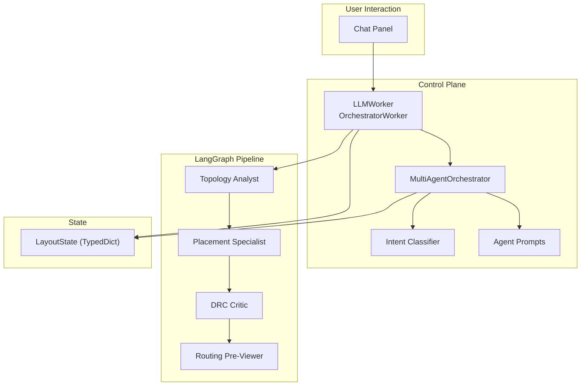
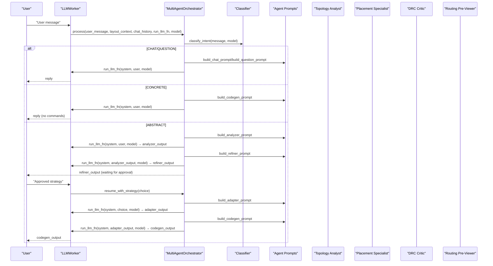
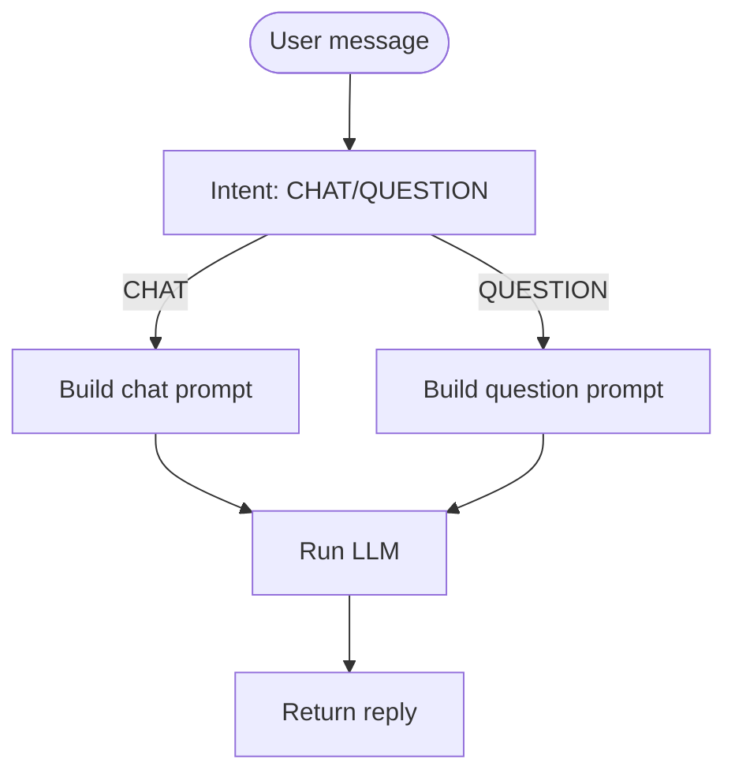
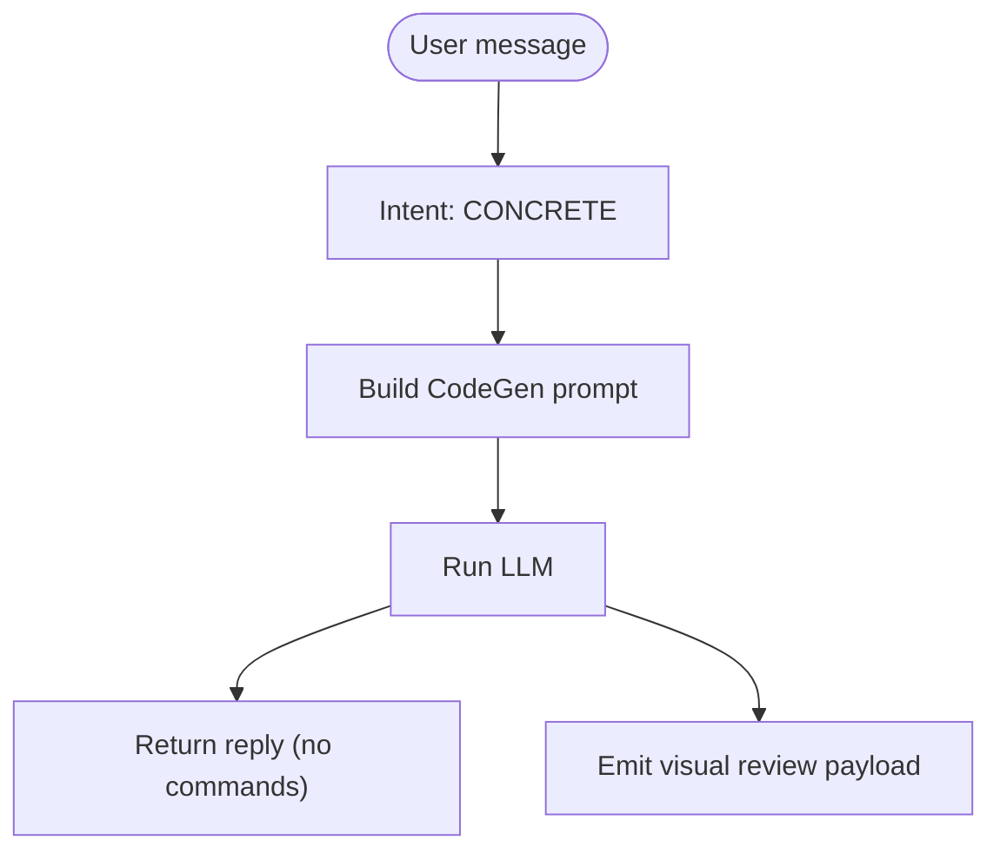
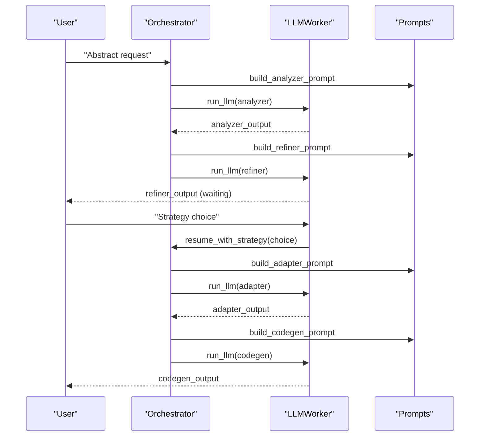
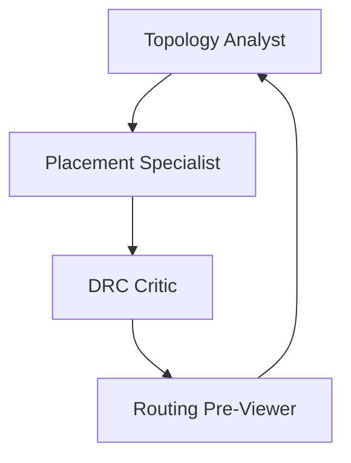
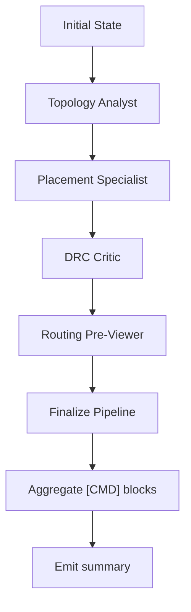
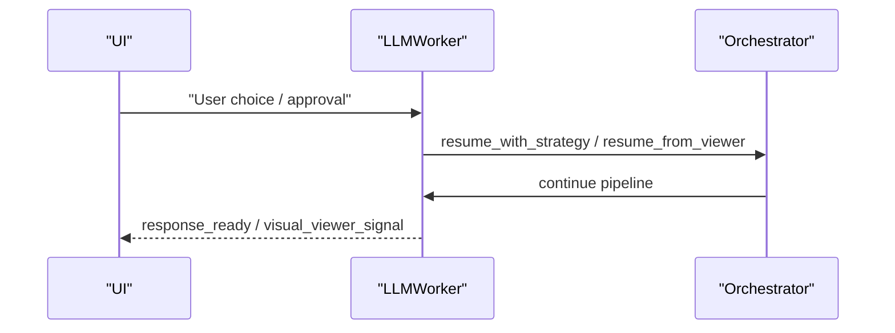
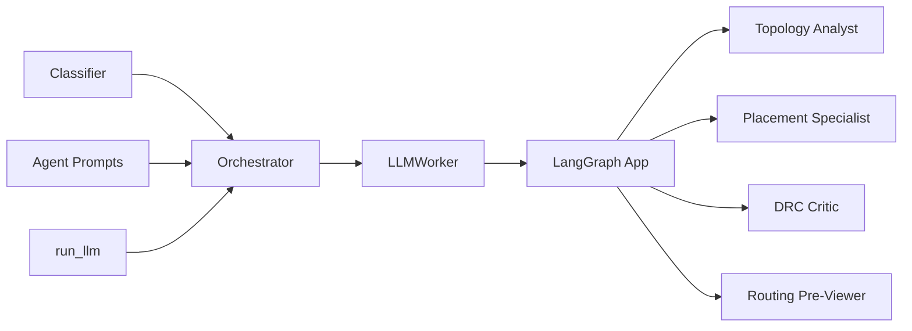

# Workflow Pipeline Stages

<cite>
**Referenced Files in This Document**
- [state.py](file://ai_agent/ai_chat_bot/state.py)
- [orchestrator.py](file://ai_agent/ai_chat_bot/agents/orchestrator.py)
- [classifier.py](file://ai_agent/ai_chat_bot/agents/classifier.py)
- [prompts.py](file://ai_agent/ai_chat_bot/agents/prompts.py)
- [llm_worker.py](file://ai_agent/ai_chat_bot/llm_worker.py)
- [run_llm.py](file://ai_agent/ai_chat_bot/run_llm.py)
- [topology_analyst.py](file://ai_agent/ai_chat_bot/agents/topology_analyst.py)
- [placement_specialist.py](file://ai_agent/ai_chat_bot/agents/placement_specialist.py)
- [drc_critic.py](file://ai_agent/ai_chat_bot/agents/drc_critic.py)
- [routing_previewer.py](file://ai_agent/ai_chat_bot/agents/routing_previewer.py)
</cite>

## Table of Contents
1. [Introduction](#introduction)
2. [Project Structure](#project-structure)
3. [Core Components](#core-components)
4. [Architecture Overview](#architecture-overview)
5. [Detailed Component Analysis](#detailed-component-analysis)
6. [Dependency Analysis](#dependency-analysis)
7. [Performance Considerations](#performance-considerations)
8. [Troubleshooting Guide](#troubleshooting-guide)
9. [Conclusion](#conclusion)

## Introduction
This document explains the four-stage workflow pipeline architecture used by the AI-based analog layout automation system. It covers:
- CHAT/QUESTION: simple conversational responses and basic queries
- CONCRETE: direct command generation without human approval
- ABSTRACT: analyzer–refiner–adapter–codegen workflow with human-in-the-loop approval
- Pipeline state management, command execution flow, and result aggregation
- Pause/resume functionality for approvals and handling user feedback
- Error handling, recovery, and state persistence across stages

## Project Structure
The pipeline is implemented across several modules:
- Orchestrator and intent classification: route user input to appropriate handlers
- Agent prompts and specialized agents: analyzer, refiner, adapter, code generator
- LLM worker and runner: execute LLM calls and stream LangGraph pipeline
- Stage agents: topology analysis, placement, DRC, routing preview
- State management: typed dictionary capturing pipeline state and pending commands

**Diagram sources**
- [llm_worker.py:87-165](file://ai_agent/ai_chat_bot/llm_worker.py#L87-L165)
- [orchestrator.py:23-96](file://ai_agent/ai_chat_bot/agents/orchestrator.py#L23-L96)
- [classifier.py:60-105](file://ai_agent/ai_chat_bot/agents/classifier.py#L60-L105)
- [prompts.py:86-241](file://ai_agent/ai_chat_bot/agents/prompts.py#L86-L241)
- [state.py:3-37](file://ai_agent/ai_chat_bot/state.py#L3-L37)

**Section sources**
- [llm_worker.py:87-165](file://ai_agent/ai_chat_bot/llm_worker.py#L87-L165)
- [orchestrator.py:23-96](file://ai_agent/ai_chat_bot/agents/orchestrator.py#L23-L96)
- [classifier.py:60-105](file://ai_agent/ai_chat_bot/agents/classifier.py#L60-L105)
- [prompts.py:86-241](file://ai_agent/ai_chat_bot/agents/prompts.py#L86-L241)
- [state.py:3-37](file://ai_agent/ai_chat_bot/state.py#L3-L37)

## Core Components
- MultiAgentOrchestrator: routes user messages to CHAT/QUESTION, CONCRETE, or ABSTRACT flows; manages pause/resume state during ABSTRACT approvals
- Intent Classifier: fast regex-based classification for CHAT/QUESTION and CONCRETE; LLM fallback for ABSTRACT
- Agent Prompts: system prompts for Analyzer, Refiner, Adapter, CodeGen, and conversational modes
- LLM Worker: executes LLM calls with retry/backoff; streams LangGraph pipeline and emits signals for UI
- Stage Agents: Topology Analyst, Placement Specialist, DRC Critic, Routing Pre-Viewer
- LayoutState: typed dictionary capturing inputs, topology, strategy, placement, DRC, routing, pending commands, and human approval flag

**Section sources**
- [orchestrator.py:23-96](file://ai_agent/ai_chat_bot/agents/orchestrator.py#L23-L96)
- [classifier.py:60-105](file://ai_agent/ai_chat_bot/agents/classifier.py#L60-L105)
- [prompts.py:86-241](file://ai_agent/ai_chat_bot/agents/prompts.py#L86-L241)
- [llm_worker.py:87-165](file://ai_agent/ai_chat_bot/llm_worker.py#L87-L165)
- [state.py:3-37](file://ai_agent/ai_chat_bot/state.py#L3-L37)

## Architecture Overview
The pipeline supports two pathways:
- Single-stage: CHAT/QUESTION and CONCRETE produce immediate textual or command responses
- Four-stage: ABSTRACT triggers Analyzer → Refiner (pause) → Adapter → CodeGen, with human approval between Refiner and Adapter

**Diagram sources**
- [llm_worker.py:195-336](file://ai_agent/ai_chat_bot/llm_worker.py#L195-L336)
- [orchestrator.py:43-96](file://ai_agent/ai_chat_bot/agents/orchestrator.py#L43-L96)
- [classifier.py:60-105](file://ai_agent/ai_chat_bot/agents/classifier.py#L60-L105)
- [prompts.py:86-241](file://ai_agent/ai_chat_bot/agents/prompts.py#L86-L241)

## Detailed Component Analysis

### CHAT/QUESTION Stage
- Purpose: Friendly conversational replies and informational queries without layout changes
- Flow:
  - Classifier labels as CHAT or QUESTION
  - Build conversational system prompt with layout context
  - Run single LLM call and return reply
- Behavior:
  - No [CMD] blocks are generated
  - Chat history is included for context

**Diagram sources**
- [classifier.py:60-105](file://ai_agent/ai_chat_bot/agents/classifier.py#L60-L105)
- [prompts.py:86-97](file://ai_agent/ai_chat_bot/agents/prompts.py#L86-L97)
- [orchestrator.py:100-121](file://ai_agent/ai_chat_bot/agents/orchestrator.py#L100-L121)

**Section sources**
- [classifier.py:60-105](file://ai_agent/ai_chat_bot/agents/classifier.py#L60-L105)
- [prompts.py:86-97](file://ai_agent/ai_chat_bot/agents/prompts.py#L86-L97)
- [orchestrator.py:100-121](file://ai_agent/ai_chat_bot/agents/orchestrator.py#L100-L121)

### CONCRETE Stage
- Purpose: Direct device operations mapped to specific commands
- Flow:
  - Classifier labels as CONCRETE
  - Build CodeGen prompt with layout context
  - Run single LLM call to produce directives
- Behavior:
  - No human approval; commands are generated directly
  - LLMWorker may emit a visual review payload for preview

**Diagram sources**
- [classifier.py:60-105](file://ai_agent/ai_chat_bot/agents/classifier.py#L60-L105)
- [prompts.py:189-241](file://ai_agent/ai_chat_bot/agents/prompts.py#L189-L241)
- [llm_worker.py:265-291](file://ai_agent/ai_chat_bot/llm_worker.py#L265-L291)

**Section sources**
- [classifier.py:60-105](file://ai_agent/ai_chat_bot/agents/classifier.py#L60-L105)
- [prompts.py:189-241](file://ai_agent/ai_chat_bot/agents/prompts.py#L189-L241)
- [llm_worker.py:265-291](file://ai_agent/ai_chat_bot/llm_worker.py#L265-L291)

### ABSTRACT Stage (Analyzer → Refiner → Adapter → CodeGen)
- Purpose: High-level layout improvements with human-in-the-loop approval
- Flow:
  - Analyzer identifies circuit topology and proposes 2–4 strategies
  - Refiner formats strategies for user selection; pipeline pauses
  - User selects one or more strategies
  - Adapter maps approved strategies to concrete directives using real device IDs
  - CodeGen produces [CMD] JSON blocks
- State management:
  - Orchestrator tracks waiting-for-feedback state
  - Analyzer output is cached for Adapter step
  - State resets after completion

**Diagram sources**
- [orchestrator.py:139-177](file://ai_agent/ai_chat_bot/agents/orchestrator.py#L139-L177)
- [orchestrator.py:182-225](file://ai_agent/ai_chat_bot/agents/orchestrator.py#L182-L225)
- [prompts.py:102-183](file://ai_agent/ai_chat_bot/agents/prompts.py#L102-L183)
- [llm_worker.py:444-460](file://ai_agent/ai_chat_bot/llm_worker.py#L444-L460)

**Section sources**
- [orchestrator.py:139-177](file://ai_agent/ai_chat_bot/agents/orchestrator.py#L139-L177)
- [orchestrator.py:182-225](file://ai_agent/ai_chat_bot/agents/orchestrator.py#L182-L225)
- [prompts.py:102-183](file://ai_agent/ai_chat_bot/agents/prompts.py#L102-L183)
- [llm_worker.py:444-460](file://ai_agent/ai_chat_bot/llm_worker.py#L444-L460)

### LangGraph Four-Stage Pipeline (Topology → Placement → DRC → Routing)
- Purpose: Automated layout refinement with human-in-the-loop interrupts
- Stages:
  - Topology Analyst: extracts topology and constraints from netlist
  - Placement Specialist: generates device movement commands with strict sequencing rules
  - DRC Critic: detects and fixes geometric violations with symmetry-preserving legalizer
  - Routing Pre-Viewer: scores routing quality and suggests swaps to reduce crossings/spans
- Interrupts:
  - Strategy selection (after Analyzer)
  - Visual review (after Placement/DRC)
- Finalization:
  - Aggregates final commands and emits summary

**Diagram sources**
- [topology_analyst.py:163-324](file://ai_agent/ai_chat_bot/agents/topology_analyst.py#L163-L324)
- [placement_specialist.py:646-800](file://ai_agent/ai_chat_bot/agents/placement_specialist.py#L646-L800)
- [drc_critic.py:265-545](file://ai_agent/ai_chat_bot/agents/drc_critic.py#L265-L545)
- [routing_previewer.py:125-268](file://ai_agent/ai_chat_bot/agents/routing_previewer.py#L125-L268)

**Section sources**
- [topology_analyst.py:163-324](file://ai_agent/ai_chat_bot/agents/topology_analyst.py#L163-L324)
- [placement_specialist.py:646-800](file://ai_agent/ai_chat_bot/agents/placement_specialist.py#L646-L800)
- [drc_critic.py:265-545](file://ai_agent/ai_chat_bot/agents/drc_critic.py#L265-L545)
- [routing_previewer.py:125-268](file://ai_agent/ai_chat_bot/agents/routing_previewer.py#L125-L268)

### Pipeline State Management and Result Aggregation
- State fields:
  - Inputs: user_message, chat_history, nodes, edges, terminal_nets, selected_model
  - Strategy: Analysis_result, strategy_result
  - Placement: placement_nodes, deterministic_snapshot
  - DRC: drc_flags, drc_pass, drc_retry_count, gap_px
  - Routing: routing_pass_count, routing_result
  - Pending updates: pending_cmds
  - Human approval: approved
- Aggregation:
  - Final placement nodes are converted to [CMD] move commands
  - Pending commands are used if placement_nodes are unavailable
  - Summary includes topology constraints, DRC status, routing score/cost, and command count

**Diagram sources**
- [state.py:3-37](file://ai_agent/ai_chat_bot/state.py#L3-L37)
- [llm_worker.py:391-442](file://ai_agent/ai_chat_bot/llm_worker.py#L391-L442)

**Section sources**
- [state.py:3-37](file://ai_agent/ai_chat_bot/state.py#L3-L37)
- [llm_worker.py:391-442](file://ai_agent/ai_chat_bot/llm_worker.py#L391-L442)

### Pause/Resume and Human Feedback Handling
- Pause occurs after Refiner output in ABSTRACT flow
- Resume triggered by:
  - Strategy selection (resume_with_strategy)
  - Visual review approval (resume_from_viewer)
- LLMWorker emits signals for UI:
  - topology_ready_for_review
  - visual_viewer_signal
  - response_ready

**Diagram sources**
- [llm_worker.py:179-182](file://ai_agent/ai_chat_bot/llm_worker.py#L179-L182)
- [llm_worker.py:444-460](file://ai_agent/ai_chat_bot/llm_worker.py#L444-L460)

**Section sources**
- [llm_worker.py:179-182](file://ai_agent/ai_chat_bot/llm_worker.py#L179-L182)
- [llm_worker.py:444-460](file://ai_agent/ai_chat_bot/llm_worker.py#L444-L460)

### Example Workflows
- CHAT/QUESTION: “What is MM3?” → Classifier: QUESTION → LLM reply with device info
- CONCRETE: “Swap MM3 and MM5” → Classifier: CONCRETE → LLM returns directives → LLMWorker emits visual review payload
- ABSTRACT: “Improve matching” → Analyzer proposes strategies → Refiner formats options → User approves → Adapter maps to device IDs → CodeGen emits [CMD] blocks

[No sources needed since this section describes conceptual workflows]

## Dependency Analysis
- Orchestrator depends on:
  - Classifier for intent routing
  - Agent prompts for system messages
  - LLM runner for model invocation
- LLMWorker depends on:
  - Orchestrator for orchestration
  - LangGraph app for streaming pipeline
  - Retry/backoff logic for robust LLM calls
- Stage agents depend on:
  - Layout context (nodes, edges, terminal_nets)
  - Prompt templates for structured reasoning

**Diagram sources**
- [classifier.py:60-105](file://ai_agent/ai_chat_bot/agents/classifier.py#L60-L105)
- [prompts.py:86-241](file://ai_agent/ai_chat_bot/agents/prompts.py#L86-L241)
- [run_llm.py:76-162](file://ai_agent/ai_chat_bot/run_llm.py#L76-L162)
- [llm_worker.py:87-165](file://ai_agent/ai_chat_bot/llm_worker.py#L87-L165)

**Section sources**
- [classifier.py:60-105](file://ai_agent/ai_chat_bot/agents/classifier.py#L60-L105)
- [prompts.py:86-241](file://ai_agent/ai_chat_bot/agents/prompts.py#L86-L241)
- [run_llm.py:76-162](file://ai_agent/ai_chat_bot/run_llm.py#L76-L162)
- [llm_worker.py:87-165](file://ai_agent/ai_chat_bot/llm_worker.py#L87-L165)

## Performance Considerations
- Classifier fast-path: regex-based classification avoids LLM calls for trivial CHAT/CONCRETE cases
- LLM retry/backoff: exponential backoff for transient API errors reduces pipeline interruptions
- LangGraph streaming: incremental events enable responsive UI and early interrupts
- Stage-specific optimizations:
  - DRC sweep-line overlap detection: O(N log N + R) complexity
  - Routing scoring: per-net spans and criticality prioritization

[No sources needed since this section provides general guidance]

## Troubleshooting Guide
- Intent classification failures:
  - Regex fast-path may misclassify ambiguous inputs; fallback to LLM classification
  - Classifier returns abstract on error to keep pipeline running
- LLM reliability:
  - run_llm includes retry/backoff for rate limits and service unavailability
  - Empty responses are handled gracefully
- Pipeline interruptions:
  - Strategy selection and visual review interrupts are signaled to UI
  - Resume via user choice or approval triggers continuation
- State recovery:
  - Orchestrator reset clears state on chat clear
  - Finalization aggregates commands even if placement_nodes are missing

**Section sources**
- [classifier.py:60-105](file://ai_agent/ai_chat_bot/agents/classifier.py#L60-L105)
- [run_llm.py:76-162](file://ai_agent/ai_chat_bot/run_llm.py#L76-L162)
- [llm_worker.py:162-165](file://ai_agent/ai_chat_bot/llm_worker.py#L162-L165)
- [llm_worker.py:337-380](file://ai_agent/ai_chat_bot/llm_worker.py#L337-L380)
- [llm_worker.py:444-460](file://ai_agent/ai_chat_bot/llm_worker.py#L444-L460)

## Conclusion
The four-stage workflow pipeline combines intent-based routing, human-in-the-loop approvals, and automated layout refinement. CHAT/QUESTION and CONCRETE provide immediate responses, while ABSTRACT enables sophisticated topology-aware improvements. Robust state management, pause/resume mechanisms, and error-handling ensure reliable execution across stages.