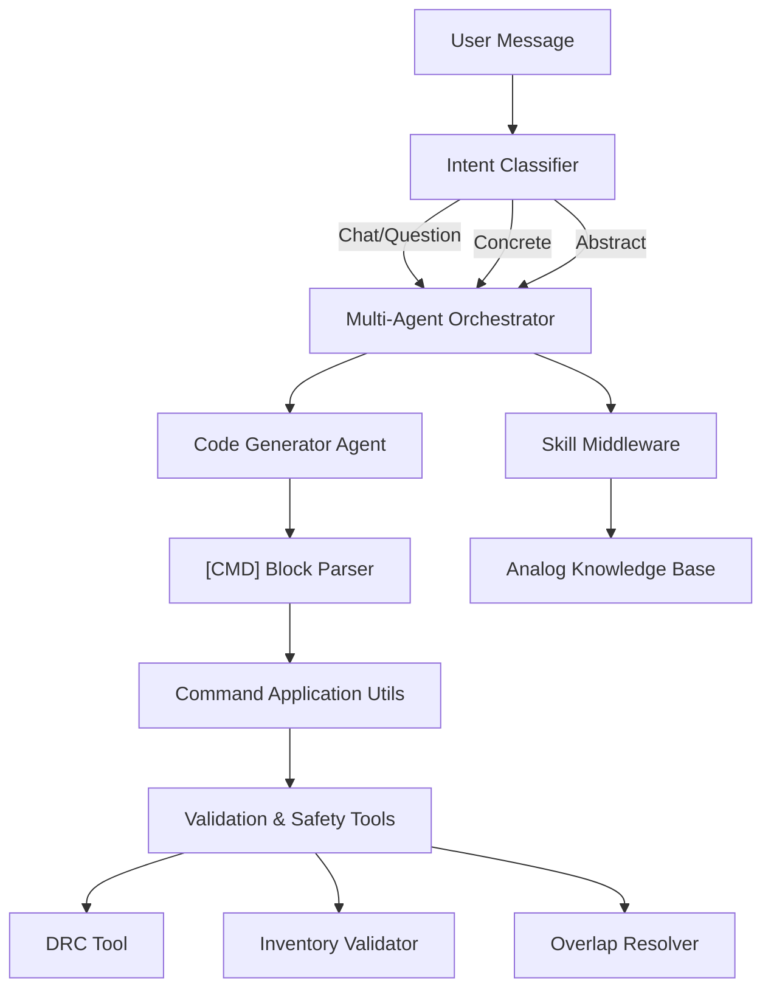
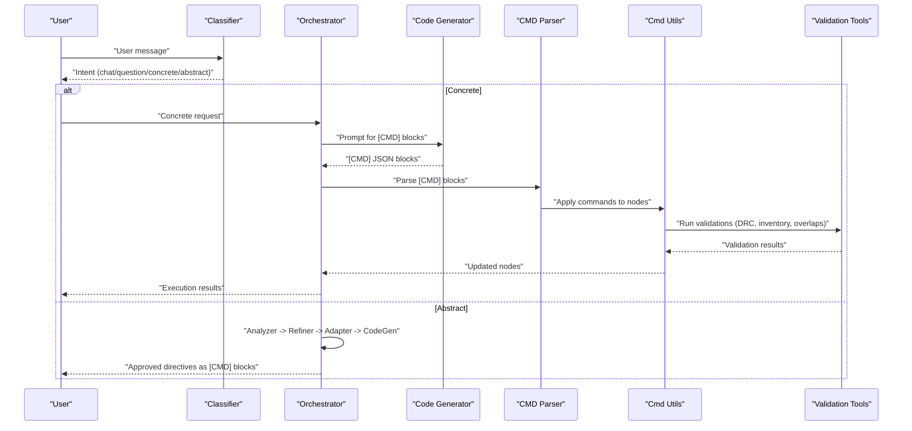
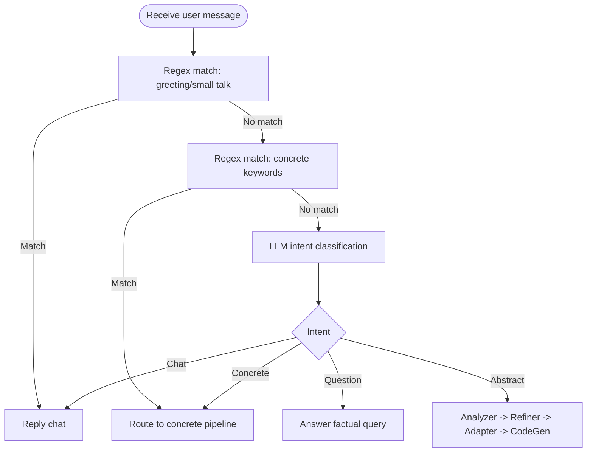
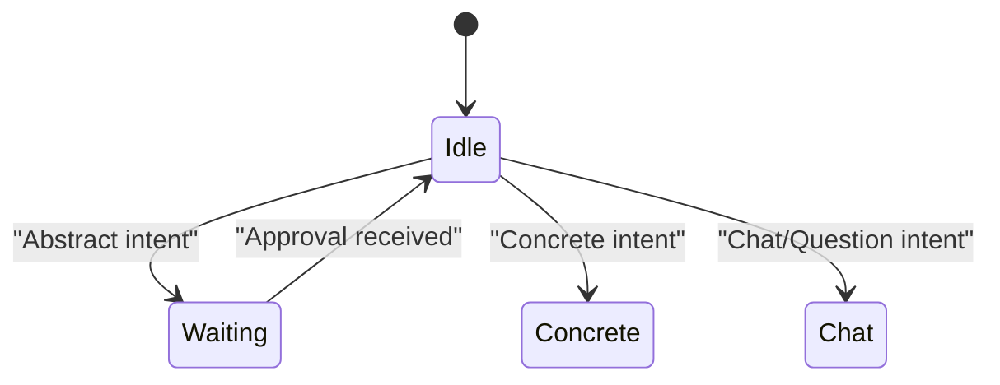
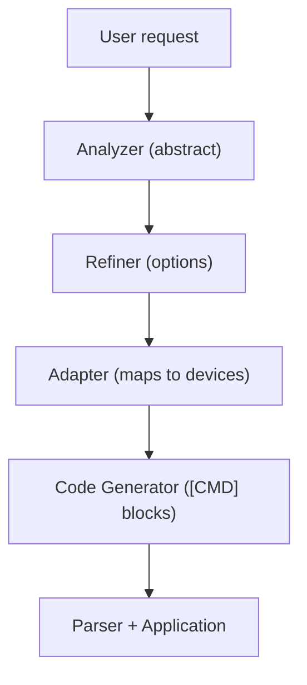
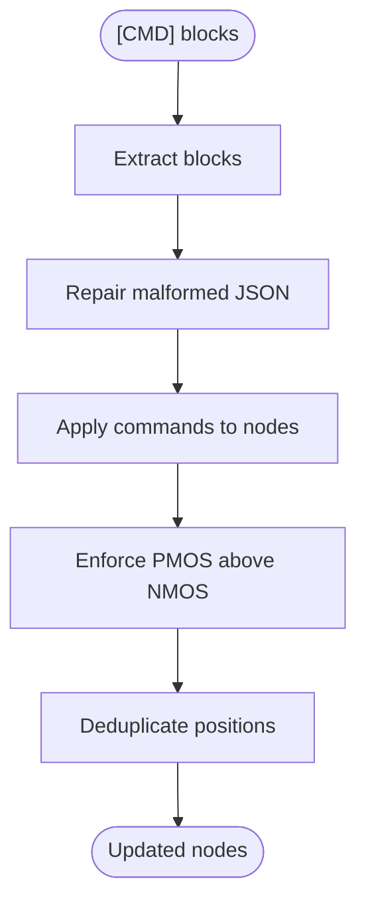
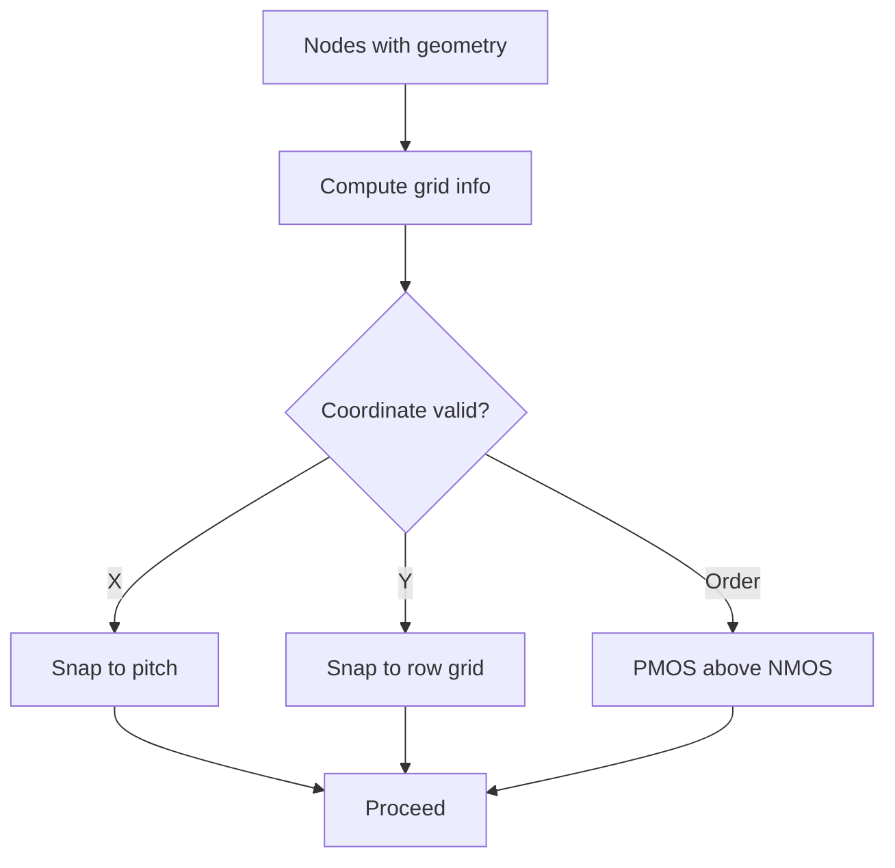
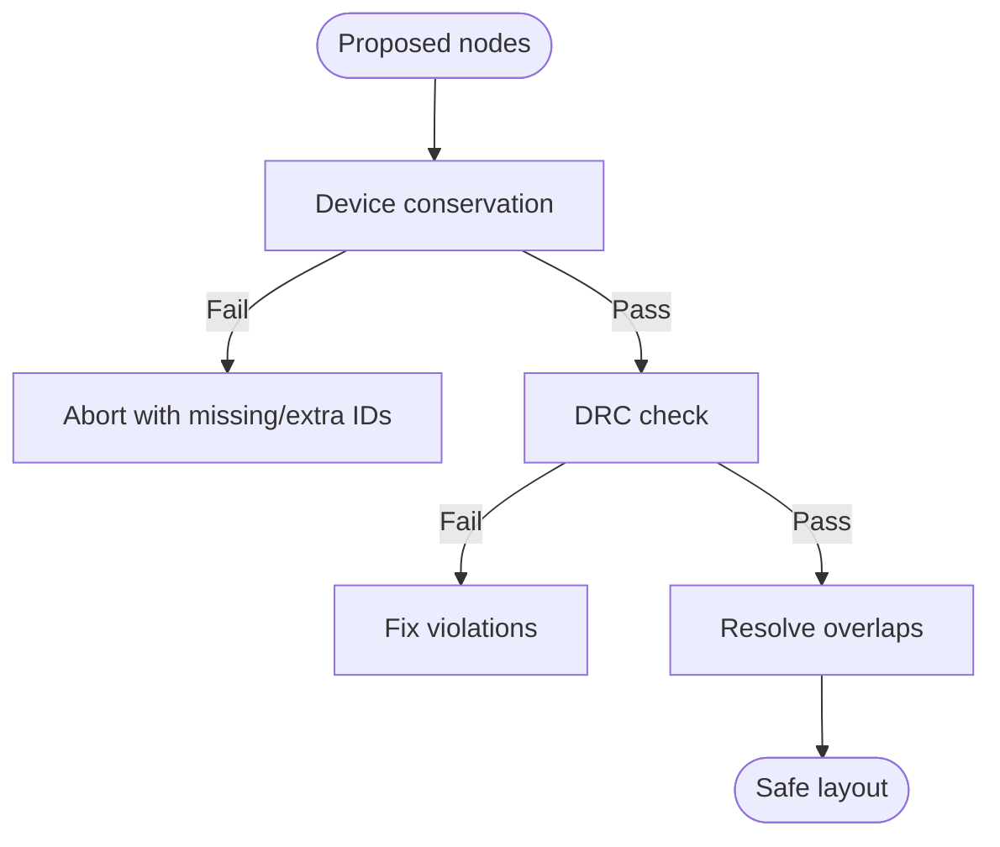
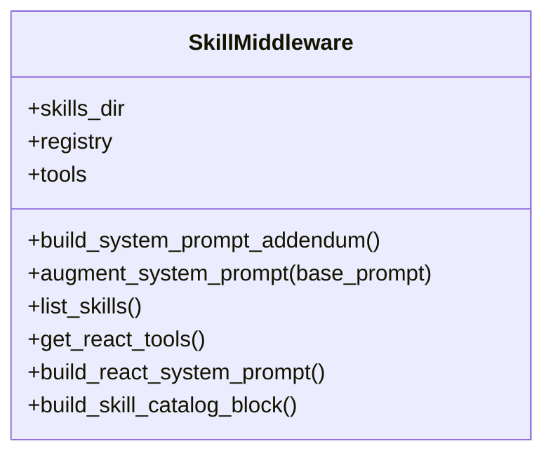
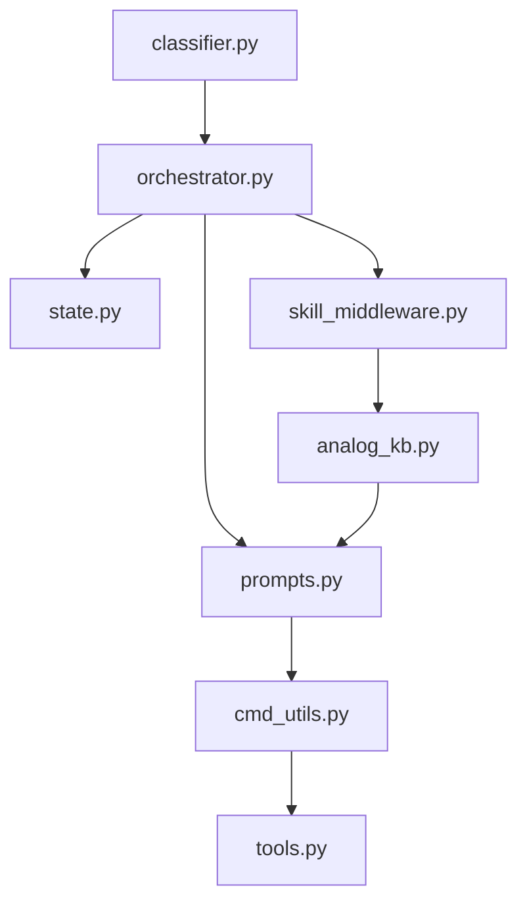

# Command Execution System

<cite>
**Referenced Files in This Document**
- [cmd_utils.py](file://ai_agent/ai_chat_bot/cmd_utils.py)
- [skill_middleware.py](file://ai_agent/ai_chat_bot/skill_middleware.py)
- [tools.py](file://ai_agent/ai_chat_bot/tools.py)
- [orchestrator.py](file://ai_agent/ai_chat_bot/agents/orchestrator.py)
- [classifier.py](file://ai_agent/ai_chat_bot/agents/classifier.py)
- [prompts.py](file://ai_agent/ai_chat_bot/agents/prompts.py)
- [state.py](file://ai_agent/ai_chat_bot/state.py)
- [analog_kb.py](file://ai_agent/ai_chat_bot/analog_kb.py)
- [common-centroid-matching.md](file://ai_agent/SKILLS/common-centroid-matching.md)
- [interdigitated-matching.md](file://ai_agent/SKILLS/interdigitated-matching.md)
- [mirror-biasing-sequencing.md](file://ai_agent/SKILLS/mirror-biasing-sequencing.md)
</cite>

## Table of Contents
1. [Introduction](#introduction)
2. [Project Structure](#project-structure)
3. [Core Components](#core-components)
4. [Architecture Overview](#architecture-overview)
5. [Detailed Component Analysis](#detailed-component-analysis)
6. [Dependency Analysis](#dependency-analysis)
7. [Performance Considerations](#performance-considerations)
8. [Troubleshooting Guide](#troubleshooting-guide)
9. [Conclusion](#conclusion)
10. [Appendices](#appendices)

## Introduction
This document describes the command execution system that enables AI to perform layout operations. It explains how natural language is processed to extract structured commands from conversational text, documents supported operations (swap, move, flip, delete, and others), and details the command parsing logic, device identification, coordinate validation, and safety checks. It also covers the skill middleware system for extending capabilities and custom tool development, and provides examples of command syntax variations and error handling for invalid operations.

## Project Structure
The command execution system spans several modules:
- Natural language processing and intent classification
- Multi-agent orchestration that routes messages to appropriate agents
- Command parsing and application utilities
- Safety and validation tools
- Skill middleware for progressive disclosure of expert strategies
- Knowledge base injected into agents for analog layout guidance

**Diagram sources**
- [classifier.py:60-105](file://ai_agent/ai_chat_bot/agents/classifier.py#L60-L105)
- [orchestrator.py:43-226](file://ai_agent/ai_chat_bot/agents/orchestrator.py#L43-L226)
- [prompts.py:189-242](file://ai_agent/ai_agent/ai_chat_bot/agents/prompts.py#L189-L242)
- [cmd_utils.py:61-171](file://ai_agent/ai_chat_bot/cmd_utils.py#L61-L171)
- [tools.py:55-114](file://ai_agent/ai_chat_bot/tools.py#L55-L114)
- [skill_middleware.py:28-102](file://ai_agent/ai_chat_bot/skill_middleware.py#L28-L102)
- [analog_kb.py:11-333](file://ai_agent/ai_chat_bot/analog_kb.py#L11-L333)

**Section sources**
- [classifier.py:60-105](file://ai_agent/ai_chat_bot/agents/classifier.py#L60-L105)
- [orchestrator.py:43-226](file://ai_agent/ai_chat_bot/agents/orchestrator.py#L43-L226)
- [prompts.py:189-242](file://ai_agent/ai_agent/ai_chat_bot/agents/prompts.py#L189-L242)
- [cmd_utils.py:61-171](file://ai_agent/ai_chat_bot/cmd_utils.py#L61-L171)
- [tools.py:55-114](file://ai_agent/ai_chat_bot/tools.py#L55-L114)
- [skill_middleware.py:28-102](file://ai_agent/ai_chat_bot/skill_middleware.py#L28-L102)
- [analog_kb.py:11-333](file://ai_agent/ai_chat_bot/analog_kb.py#L11-L333)

## Core Components
- Intent classifier determines whether a user’s message is chat, question, concrete (direct device operation), or abstract (topology-level request).
- Multi-agent orchestrator coordinates the pipeline: chat/question replies, abstract analysis with refinement, and concrete directive generation.
- Code generator produces [CMD] JSON blocks with strict rules for actions, coordinates, and matching protection.
- Command utilities parse [CMD] blocks, apply operations to device nodes, enforce row ordering, and deduplicate positions.
- Validation and safety tools ensure device conservation, DRC compliance, and overlap resolution.
- Skill middleware progressively exposes expert strategies via markdown frontmatter and on-demand loading.
- Analog knowledge base injects domain-specific guidance into agents.

**Section sources**
- [classifier.py:60-105](file://ai_agent/ai_chat_bot/agents/classifier.py#L60-L105)
- [orchestrator.py:43-226](file://ai_agent/ai_chat_bot/agents/orchestrator.py#L43-L226)
- [prompts.py:189-242](file://ai_agent/ai_agent/ai_chat_bot/agents/prompts.py#L189-L242)
- [cmd_utils.py:61-171](file://ai_agent/ai_chat_bot/cmd_utils.py#L61-L171)
- [tools.py:55-114](file://ai_agent/ai_chat_bot/tools.py#L55-L114)
- [skill_middleware.py:28-102](file://ai_agent/ai_chat_bot/skill_middleware.py#L28-L102)
- [analog_kb.py:11-333](file://ai_agent/ai_chat_bot/analog_kb.py#L11-L333)

## Architecture Overview
The system follows a multi-agent pipeline:
- User intent is classified quickly via regex, falling back to a lightweight LLM when ambiguous.
- For concrete intents, the Code Generator produces [CMD] blocks containing structured operations.
- The [CMD] blocks are parsed and applied to the layout graph with safety checks.
- Abstract intents trigger analysis and refinement steps, with optional user approval before generating concrete directives.

**Diagram sources**
- [classifier.py:60-105](file://ai_agent/ai_chat_bot/agents/classifier.py#L60-L105)
- [orchestrator.py:43-226](file://ai_agent/ai_chat_bot/agents/orchestrator.py#L43-L226)
- [prompts.py:189-242](file://ai_agent/ai_agent/ai_chat_bot/agents/prompts.py#L189-L242)
- [cmd_utils.py:61-171](file://ai_agent/ai_chat_bot/cmd_utils.py#L61-L171)
- [tools.py:55-114](file://ai_agent/ai_chat_bot/tools.py#L55-L114)

## Detailed Component Analysis

### Natural Language Processing and Intent Classification
- The classifier uses regex patterns for quick classification of chat and concrete commands, avoiding LLM calls for simple cases.
- For ambiguous messages, a lightweight LLM is invoked with a short, focused prompt to label the intent as concrete, abstract, question, or chat.
- Supported concrete keywords include swap, move, flip, add dummy, delete, remove, set orientation, fix abutment, fix finger, and more.

**Diagram sources**
- [classifier.py:60-105](file://ai_agent/ai_chat_bot/agents/classifier.py#L60-L105)

**Section sources**
- [classifier.py:60-105](file://ai_agent/ai_chat_bot/agents/classifier.py#L60-L105)

### Multi-Agent Orchestration
- The orchestrator manages a simple state machine to handle mid-pipeline approvals for abstract tasks.
- For chat and question intents, it builds a concise system prompt and returns a reply without commands.
- For concrete intents, it returns immediately with an empty commands list (commands are generated by the Code Generator in later stages).
- For abstract intents, it runs Analyzer, Refiner, Adapter, and CodeGen in sequence, pausing for user approval when needed.

**Diagram sources**
- [orchestrator.py:17-31](file://ai_agent/ai_chat_bot/agents/orchestrator.py#L17-L31)
- [orchestrator.py:43-226](file://ai_agent/ai_chat_bot/agents/orchestrator.py#L43-L226)

**Section sources**
- [orchestrator.py:43-226](file://ai_agent/ai_chat_bot/agents/orchestrator.py#L43-L226)

### Code Generation and [CMD] Block Syntax
- The Code Generator enforces strict rules for [CMD] blocks, including supported actions, coordinate snapping, and matching protection.
- Actions include swap, move, move_row, abut, add_dummy, and others. Coordinates must follow the grid derived from device widths and row pitches.
- The prompt template demonstrates examples and constraints for each action.

**Diagram sources**
- [prompts.py:189-242](file://ai_agent/ai_agent/ai_chat_bot/agents/prompts.py#L189-L242)
- [orchestrator.py:139-226](file://ai_agent/ai_chat_bot/agents/orchestrator.py#L139-L226)

**Section sources**
- [prompts.py:189-242](file://ai_agent/ai_agent/ai_chat_bot/agents/prompts.py#L189-L242)
- [orchestrator.py:139-226](file://ai_agent/ai_chat_bot/agents/orchestrator.py#L139-L226)

### Command Parsing and Application Utilities
- The parser extracts [CMD] blocks from text, normalizes delimiters, repairs malformed JSON, and logs warnings for malformed blocks.
- The application engine deep-copies nodes, maps IDs to geometry, and applies operations:
  - swap/swap_devices: exchanges positions and orientations of two devices
  - move/move_device: updates x/y coordinates; supports non-forced Y changes with rollback if PMOS/NMOS row order is violated
  - flip/flip_h/flip_v: toggles orientation flags
  - delete: removes a device from the node list
- After applying commands, it enforces PMOS-above-NMOS ordering globally and deduplicates positions across rows.

**Diagram sources**
- [cmd_utils.py:61-107](file://ai_agent/ai_chat_bot/cmd_utils.py#L61-L107)
- [cmd_utils.py:109-171](file://ai_agent/ai_chat_bot/cmd_utils.py#L109-L171)

**Section sources**
- [cmd_utils.py:61-171](file://ai_agent/ai_chat_bot/cmd_utils.py#L61-L171)

### Device Identification and Coordinate Validation
- Device identification relies on stable IDs present in the layout context. Finger devices are grouped into logical devices; commands must target actual device IDs.
- Coordinate validation enforces:
  - X coordinates must be multiples of device width (pitch)
  - Y coordinates must lie on row grid: base_Y + N * row_pitch
  - PMOS row must remain above NMOS row after non-forced Y moves
  - Minimum spacing enforced during deduplication and overlap resolution

**Diagram sources**
- [prompts.py:244-282](file://ai_agent/ai_agent/ai_chat_bot/agents/prompts.py#L244-L282)
- [cmd_utils.py:19-37](file://ai_agent/ai_chat_bot/cmd_utils.py#L19-L37)
- [cmd_utils.py:39-60](file://ai_agent/ai_chat_bot/cmd_utils.py#L39-L60)

**Section sources**
- [prompts.py:244-282](file://ai_agent/ai_agent/ai_chat_bot/agents/prompts.py#L244-L282)
- [cmd_utils.py:19-60](file://ai_agent/ai_chat_bot/cmd_utils.py#L19-L60)

### Safety Checks and Layout Validation
- Device conservation guard ensures no devices are deleted or duplicated during proposed changes.
- DRC tool validates overlap and gap constraints.
- Overlap resolver iteratively pushes overlapping devices to eliminate collisions.
- Additional validation tools include nearest free X calculation for placement and row-based overlap detection.

**Diagram sources**
- [tools.py:69-114](file://ai_agent/ai_chat_bot/tools.py#L69-L114)
- [tools.py:55-67](file://ai_agent/ai_chat_bot/tools.py#L55-L67)
- [tools.py:170-210](file://ai_agent/ai_chat_bot/tools.py#L170-L210)

**Section sources**
- [tools.py:69-114](file://ai_agent/ai_chat_bot/tools.py#L69-L114)
- [tools.py:55-67](file://ai_agent/ai_chat_bot/tools.py#L55-L67)
- [tools.py:170-210](file://ai_agent/ai_chat_bot/tools.py#L170-L210)

### Skill Middleware System
- Scans the skills directory for markdown files with frontmatter to build a catalog.
- Provides a tool to load a skill on demand, returning the full content for agent context.
- Augments system prompts with the available skills catalog and instructions to load specific skills.

**Diagram sources**
- [skill_middleware.py:19-102](file://ai_agent/ai_chat_bot/skill_middleware.py#L19-L102)

**Section sources**
- [skill_middleware.py:19-102](file://ai_agent/ai_chat_bot/skill_middleware.py#L19-L102)

### Supported Commands and Syntax Variations
- swap/swap_devices: exchange positions and orientations of two devices
- move/move_device: update x/y coordinates; supports force_y flag for Y changes
- flip/flip_h/flip_v: toggle orientation flags
- delete: remove a device by ID
- add_dummy: insert dummy devices (type, count, side)
- move_row: shift all devices of a type to a new row grid
- abut: abut two transistors sharing a source/drain net

Examples of syntax variations are demonstrated in the Code Generator prompt template.

**Section sources**
- [prompts.py:189-242](file://ai_agent/ai_agent/ai_chat_bot/agents/prompts.py#L189-L242)
- [cmd_utils.py:109-171](file://ai_agent/ai_chat_bot/cmd_utils.py#L109-L171)

### Error Handling for Invalid Operations
- Malformed [CMD] blocks are detected and auto-repaired; warnings are logged when repair succeeds or fails.
- Device not found errors are logged for move operations targeting unknown IDs.
- PMOS/NMOS ordering violations trigger rollback of non-forced Y moves.
- Device conservation failures abort with detailed missing/extra ID reports.

**Section sources**
- [cmd_utils.py:84-107](file://ai_agent/ai_chat_bot/cmd_utils.py#L84-L107)
- [cmd_utils.py:144-146](file://ai_agent/ai_chat_bot/cmd_utils.py#L144-L146)
- [cmd_utils.py:161-168](file://ai_agent/ai_chat_bot/cmd_utils.py#L161-L168)
- [tools.py:69-114](file://ai_agent/ai_chat_bot/tools.py#L69-L114)

### Command Execution Safety and Layout Validation
- Before applying commands, the system validates:
  - Device conservation (no deletions or hallucinations)
  - DRC compliance (overlap and gap checks)
  - Row ordering (PMOS above NMOS)
  - Overlap resolution via iterative push-and-snap
- Matching protection rules prevent moving individual devices inside fixed matched blocks; only whole-block movement is permitted.

**Section sources**
- [tools.py:69-114](file://ai_agent/ai_chat_bot/tools.py#L69-L114)
- [prompts.py:233-238](file://ai_agent/ai_agent/ai_chat_bot/agents/prompts.py#L233-L238)
- [analog_kb.py:70-80](file://ai_agent/ai_chat_bot/analog_kb.py#L70-L80)

## Dependency Analysis
The system exhibits clear layering:
- Agents depend on prompts and knowledge base
- Orchestrator coordinates agents and passes layout context
- Command utilities depend on geometry and row ordering rules
- Validation tools depend on geometry and device lists
- Skill middleware depends on markdown frontmatter scanning

**Diagram sources**
- [classifier.py:60-105](file://ai_agent/ai_chat_bot/agents/classifier.py#L60-L105)
- [orchestrator.py:43-226](file://ai_agent/ai_chat_bot/agents/orchestrator.py#L43-L226)
- [prompts.py:189-242](file://ai_agent/ai_agent/ai_chat_bot/agents/prompts.py#L189-L242)
- [cmd_utils.py:61-171](file://ai_agent/ai_chat_bot/cmd_utils.py#L61-L171)
- [tools.py:55-114](file://ai_agent/ai_chat_bot/tools.py#L55-L114)
- [skill_middleware.py:28-102](file://ai_agent/ai_chat_bot/skill_middleware.py#L28-L102)
- [analog_kb.py:11-333](file://ai_agent/ai_chat_bot/analog_kb.py#L11-L333)

**Section sources**
- [classifier.py:60-105](file://ai_agent/ai_chat_bot/agents/classifier.py#L60-L105)
- [orchestrator.py:43-226](file://ai_agent/ai_chat_bot/agents/orchestrator.py#L43-L226)
- [prompts.py:189-242](file://ai_agent/ai_agent/ai_chat_bot/agents/prompts.py#L189-L242)
- [cmd_utils.py:61-171](file://ai_agent/ai_chat_bot/cmd_utils.py#L61-L171)
- [tools.py:55-114](file://ai_agent/ai_chat_bot/tools.py#L55-L114)
- [skill_middleware.py:28-102](file://ai_agent/ai_chat_bot/skill_middleware.py#L28-L102)
- [analog_kb.py:11-333](file://ai_agent/ai_chat_bot/analog_kb.py#L11-L333)

## Performance Considerations
- Regex-based intent classification avoids LLM calls for simple cases, reducing latency.
- Deduplication and overlap resolution operate row-wise and converge quickly; pass limits prevent excessive iterations.
- Grid computation derives from layout context to minimize redundant calculations.
- Skills are scanned once and loaded on demand to avoid heavy initialization overhead.

[No sources needed since this section provides general guidance]

## Troubleshooting Guide
Common issues and resolutions:
- Empty or malformed [CMD] blocks: Auto-repair attempts; if unsuccessful, inspect raw markers and JSON structure.
- Device not found during move: Verify device ID exists in the current layout context.
- PMOS/NMOS ordering violation: Non-forced Y moves are rolled back; adjust commands to respect row ordering.
- Device conservation failure: Review missing/extra IDs reported by the validator; ensure no deletions or hallucinations occur.
- DRC violations: Run DRC tool and resolve overlaps; use overlap resolver to push devices apart.

**Section sources**
- [cmd_utils.py:84-107](file://ai_agent/ai_chat_bot/cmd_utils.py#L84-L107)
- [cmd_utils.py:144-146](file://ai_agent/ai_chat_bot/cmd_utils.py#L144-L146)
- [cmd_utils.py:161-168](file://ai_agent/ai_chat_bot/cmd_utils.py#L161-L168)
- [tools.py:69-114](file://ai_agent/ai_chat_bot/tools.py#L69-L114)
- [tools.py:55-67](file://ai_agent/ai_chat_bot/tools.py#L55-L67)

## Conclusion
The command execution system integrates intent classification, multi-agent orchestration, structured command generation, robust parsing and application, and comprehensive safety checks. It supports precise layout operations while enforcing analog layout rules, device conservation, and DRC compliance. The skill middleware and knowledge base enable progressive disclosure of expert strategies, facilitating both immediate actions and higher-level design improvements.

[No sources needed since this section summarizes without analyzing specific files]

## Appendices

### Supported Commands Summary
- swap/swap_devices: exchange positions and orientations of two devices
- move/move_device: update x/y coordinates; supports force_y flag
- flip/flip_h/flip_v: toggle orientation flags
- delete: remove a device by ID
- add_dummy: insert dummy devices (type, count, side)
- move_row: shift all devices of a type to a new row grid
- abut: abut two transistors sharing a source/drain net

**Section sources**
- [prompts.py:189-242](file://ai_agent/ai_agent/ai_chat_bot/agents/prompts.py#L189-L242)
- [cmd_utils.py:109-171](file://ai_agent/ai_chat_bot/cmd_utils.py#L109-L171)

### Skill Catalog and Loading
- Skills are discovered from markdown frontmatter and presented as a catalog.
- The load_skill tool retrieves full content on demand for detailed guidance.

**Section sources**
- [skill_middleware.py:28-102](file://ai_agent/ai_chat_bot/skill_middleware.py#L28-L102)
- [common-centroid-matching.md:1-26](file://ai_agent/SKILLS/common-centroid-matching.md#L1-L26)
- [interdigitated-matching.md:1-29](file://ai_agent/SKILLS/interdigitated-matching.md#L1-L29)
- [mirror-biasing-sequencing.md:1-29](file://ai_agent/SKILLS/mirror-biasing-sequencing.md#L1-L29)