# GUI Integration and User Interface

<cite>
**Referenced Files in This Document**
- [chat_panel.py](file://symbolic_editor/chat_panel.py)
- [layout_tab.py](file://symbolic_editor/layout_tab.py)
- [main.py](file://symbolic_editor/main.py)
- [llm_worker.py](file://ai_agent/ai_chat_bot/llm_worker.py)
- [run_llm.py](file://ai_agent/ai_chat_bot/run_llm.py)
- [graph.py](file://ai_agent/ai_chat_bot/graph.py)
- [state.py](file://ai_agent/ai_chat_bot/state.py)
</cite>

## Table of Contents
1. [Introduction](#introduction)
2. [Project Structure](#project-structure)
3. [Core Components](#core-components)
4. [Architecture Overview](#architecture-overview)
5. [Detailed Component Analysis](#detailed-component-analysis)
6. [Dependency Analysis](#dependency-analysis)
7. [Performance Considerations](#performance-considerations)
8. [Troubleshooting Guide](#troubleshooting-guide)
9. [Conclusion](#conclusion)

## Introduction
This document explains the chat panel GUI integration for the AI-based analog layout automation system. It covers the PySide6-based interface with auto-resizing input widgets and animated thinking indicators, the signal-slot architecture connecting the chat panel to AI backend workers, the message rendering system supporting markdown formatting and HTML conversion, the keyword-based routing system that triggers the multi-agent pipeline versus single-agent mode, and practical examples of user interaction patterns, conversation history management, UI state handling, and the worker-thread pattern with thread-safe communication.

## Project Structure
The chat panel lives inside the symbolic editor’s tabbed interface. Each tab owns a chat panel, a device tree, a properties panel, a symbolic editor canvas, and a KLayout preview. The chat panel communicates with AI workers via Qt signals/slots and a dedicated QThread.

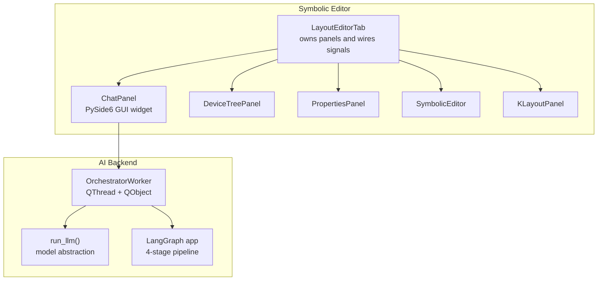

**Diagram sources**
- [layout_tab.py:64-108](file://symbolic_editor/layout_tab.py#L64-L108)
- [chat_panel.py:95-158](file://symbolic_editor/chat_panel.py#L95-L158)
- [llm_worker.py:170-336](file://ai_agent/ai_chat_bot/llm_worker.py#L170-L336)
- [run_llm.py:76-162](file://ai_agent/ai_chat_bot/run_llm.py#L76-L162)
- [graph.py:1-52](file://ai_agent/ai_chat_bot/graph.py#L1-L52)

**Section sources**
- [layout_tab.py:64-108](file://symbolic_editor/layout_tab.py#L64-L108)
- [chat_panel.py:95-158](file://symbolic_editor/chat_panel.py#L95-L158)

## Core Components
- ChatPanel: PySide6 widget hosting the chat UI, input area, and animated thinking indicators. It manages conversation history, renders messages, and routes user queries to either single-agent or multi-agent workers.
- OrchestratorWorker: A QThread-backed worker that runs the multi-agent LangGraph pipeline and emits signals for responses, commands, and human-in-the-loop interrupts.
- run_llm: Unified LLM interface with retry/backoff for transient API errors.
- LangGraph app: Defines the 4-stage pipeline (Topology → Placement → DRC → Routing) with human-in-the-loop interrupts.

Key responsibilities:
- Thread safety: All cross-thread communication happens via Qt signals/slots.
- Routing: Keyword-based classification determines whether to use the multi-agent pipeline or single-agent path.
- Rendering: Lightweight markdown-to-HTML conversion with styled bubbles.
- Batch command execution: Aggregates AI commands into a single undo operation.

**Section sources**
- [chat_panel.py:95-158](file://symbolic_editor/chat_panel.py#L95-L158)
- [llm_worker.py:170-336](file://ai_agent/ai_chat_bot/llm_worker.py#L170-L336)
- [run_llm.py:76-162](file://ai_agent/ai_chat_bot/run_llm.py#L76-L162)
- [graph.py:1-52](file://ai_agent/ai_chat_bot/graph.py#L1-L52)

## Architecture Overview
The chat panel uses the Worker-Object Pattern: a dedicated QThread hosts an OrchestratorWorker that performs LLM inference and LangGraph streaming. The GUI communicates exclusively via Qt signals/slots, ensuring thread-safe communication.

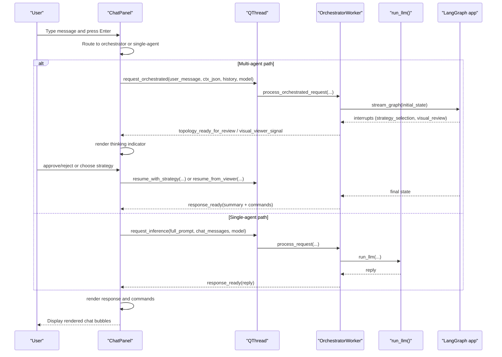

**Diagram sources**
- [chat_panel.py:463-650](file://symbolic_editor/chat_panel.py#L463-L650)
- [llm_worker.py:195-336](file://ai_agent/ai_chat_bot/llm_worker.py#L195-L336)
- [run_llm.py:76-162](file://ai_agent/ai_chat_bot/run_llm.py#L76-L162)
- [graph.py:1-52](file://ai_agent/ai_chat_bot/graph.py#L1-L52)

## Detailed Component Analysis

### ChatPanel: PySide6 GUI Widget
- Auto-resizing input widget: ChatInputEdit inherits QTextEdit and grows up to a fixed height while preserving a minimum. Enter sends; Shift+Enter inserts a newline.
- Animated thinking indicators: Two modes:
  - Single-agent: Dots animation appended to “Thinking”.
  - Multi-agent: Cycles through four stage labels (“Stage 1/4 …”, “Stage 2/4 …”, etc.) updating the last bubble.
- Message rendering: Converts markdown to HTML and renders distinct user/AI/system bubbles with timestamps.
- Conversation history: Maintains a list of {"role", "content"} entries and trims older messages for prompt building.
- Keyword routing: Detects orchestrator-triggering keywords to switch to the multi-agent pipeline; otherwise uses single-agent mode.
- Human-in-the-loop: Emits signals for strategy selection and visual review interrupts; resumes the pipeline accordingly.

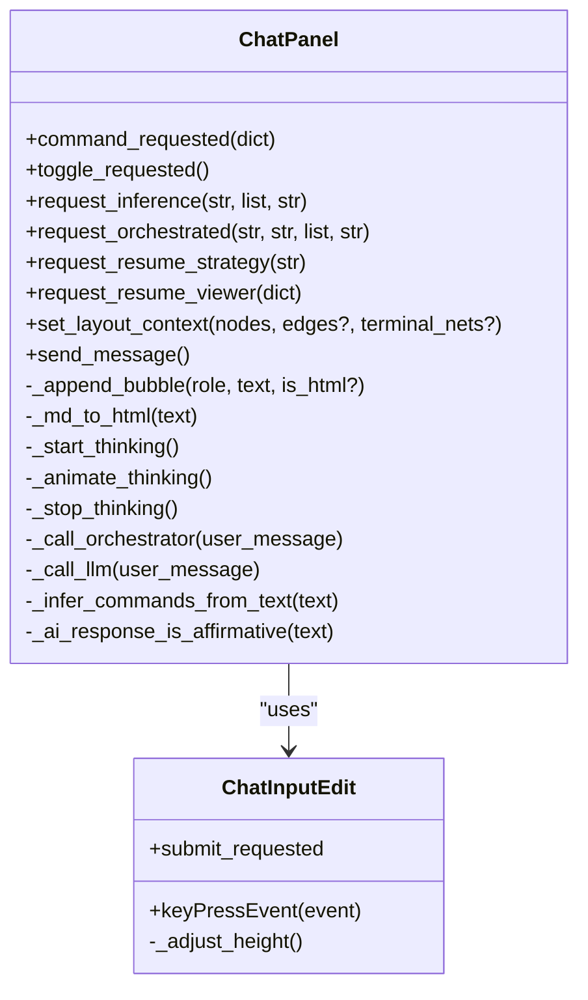

**Diagram sources**
- [chat_panel.py:62-90](file://symbolic_editor/chat_panel.py#L62-L90)
- [chat_panel.py:95-158](file://symbolic_editor/chat_panel.py#L95-L158)
- [chat_panel.py:402-459](file://symbolic_editor/chat_panel.py#L402-L459)
- [chat_panel.py:528-580](file://symbolic_editor/chat_panel.py#L528-L580)
- [chat_panel.py:584-650](file://symbolic_editor/chat_panel.py#L584-L650)

**Section sources**
- [chat_panel.py:62-90](file://symbolic_editor/chat_panel.py#L62-L90)
- [chat_panel.py:95-158](file://symbolic_editor/chat_panel.py#L95-L158)
- [chat_panel.py:402-459](file://symbolic_editor/chat_panel.py#L402-L459)
- [chat_panel.py:528-580](file://symbolic_editor/chat_panel.py#L528-L580)
- [chat_panel.py:584-650](file://symbolic_editor/chat_panel.py#L584-L650)

### OrchestratorWorker: Multi-Agent Pipeline Driver
- Extends LLMWorker to drive the LangGraph pipeline with human-in-the-loop interrupts.
- Emits signals for:
  - response_ready: final reply or summary.
  - topology_ready_for_review: strategy selection interrupt.
  - visual_viewer_signal: visual review interrupt with placement/routing payload.
- Implements resume_with_strategy and resume_from_viewer to continue streaming after user decisions.
- Integrates with run_llm for model invocation and with the LangGraph app for streaming.

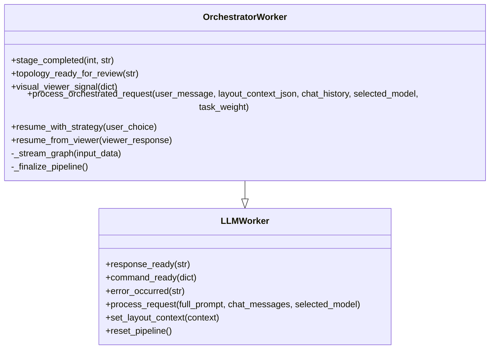

**Diagram sources**
- [llm_worker.py:87-165](file://ai_agent/ai_chat_bot/llm_worker.py#L87-L165)
- [llm_worker.py:170-461](file://ai_agent/ai_chat_bot/llm_worker.py#L170-L461)

**Section sources**
- [llm_worker.py:87-165](file://ai_agent/ai_chat_bot/llm_worker.py#L87-L165)
- [llm_worker.py:170-461](file://ai_agent/ai_chat_bot/llm_worker.py#L170-L461)

### LangGraph Pipeline and State
- The LangGraph app defines a linear 4-stage pipeline with conditional edges for DRC retries and human-in-the-loop interrupts.
- The LayoutState TypedDict captures inputs, topology, strategy, placement, DRC, routing, pending commands, and approval flags.

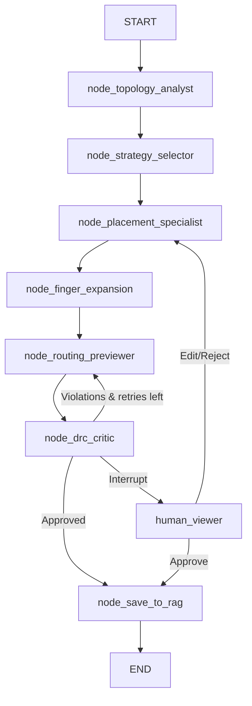

**Diagram sources**
- [graph.py:1-52](file://ai_agent/ai_chat_bot/graph.py#L1-L52)
- [state.py:3-37](file://ai_agent/ai_chat_bot/state.py#L3-L37)

**Section sources**
- [graph.py:1-52](file://ai_agent/ai_chat_bot/graph.py#L1-L52)
- [state.py:3-37](file://ai_agent/ai_chat_bot/state.py#L3-L37)

### Signal-Slot Wiring and Worker-Thread Pattern
- ChatPanel creates a QThread and moves an OrchestratorWorker onto it.
- GUI-to-worker signals:
  - request_inference → LLMWorker.process_request
  - request_orchestrated → OrchestratorWorker.process_orchestrated_request
  - request_resume_strategy → OrchestratorWorker.resume_with_strategy
  - request_resume_viewer → OrchestratorWorker.resume_from_viewer
- Worker-to-GUI signals:
  - response_ready → ChatPanel._on_llm_response
  - error_occurred → ChatPanel._on_llm_error
  - topology_ready_for_review → ChatPanel._on_topology_review
  - visual_viewer_signal → ChatPanel._on_visual_viewer_signal

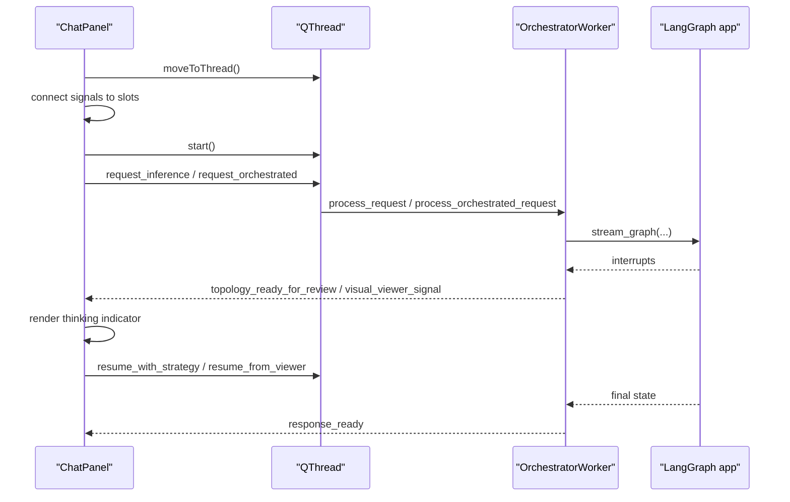

**Diagram sources**
- [chat_panel.py:134-154](file://symbolic_editor/chat_panel.py#L134-L154)
- [chat_panel.py:140-147](file://symbolic_editor/chat_panel.py#L140-L147)
- [llm_worker.py:195-336](file://ai_agent/ai_chat_bot/llm_worker.py#L195-L336)

**Section sources**
- [chat_panel.py:134-154](file://symbolic_editor/chat_panel.py#L134-L154)
- [chat_panel.py:140-147](file://symbolic_editor/chat_panel.py#L140-L147)
- [llm_worker.py:195-336](file://ai_agent/ai_chat_bot/llm_worker.py#L195-L336)

### Message Rendering and Markdown-to-HTML
- Lightweight conversion supports code blocks, inline code, bold, italic, bullet/numbered lists, and line breaks.
- Renders distinct user and AI bubbles with timestamps and avatars.
- System messages use a different style.

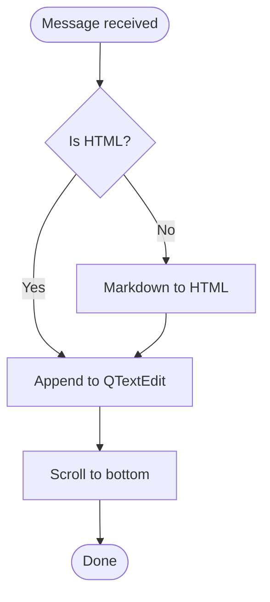

**Diagram sources**
- [chat_panel.py:345-381](file://symbolic_editor/chat_panel.py#L345-L381)
- [chat_panel.py:402-459](file://symbolic_editor/chat_panel.py#L402-L459)

**Section sources**
- [chat_panel.py:345-381](file://symbolic_editor/chat_panel.py#L345-L381)
- [chat_panel.py:402-459](file://symbolic_editor/chat_panel.py#L402-L459)

### Keyword-Based Routing and Human-in-the-Loop
- Multi-agent triggers: Optimizations, improvements, auto-place, auto-layout, fix DRC, reduce crossings/routing, rearrange, reorder, minimize, suggest placement, better placement, swap all, pipeline.
- Single-agent fallback: All other queries.
- Human-in-the-loop interrupts:
  - Strategy selection after topology analysis.
  - Visual review after routing/DRC checks.
- Resume paths: After user approval or edits, the pipeline resumes with the chosen strategy or viewer response.

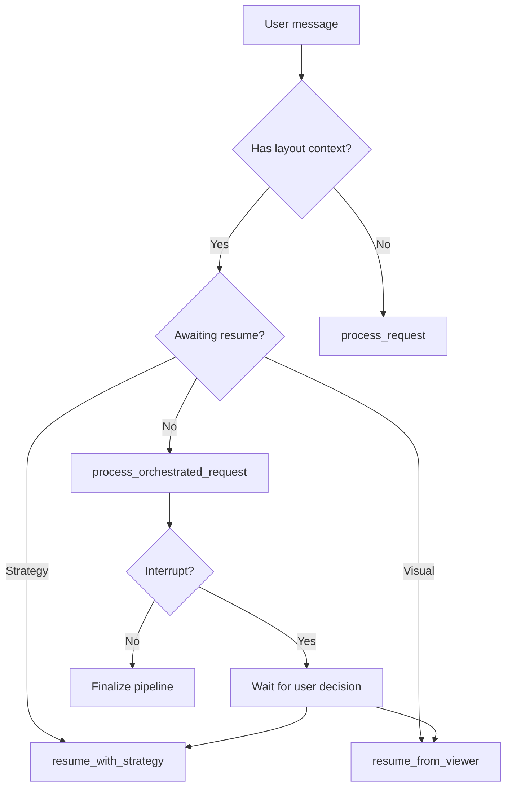

**Diagram sources**
- [chat_panel.py:481-514](file://symbolic_editor/chat_panel.py#L481-L514)
- [chat_panel.py:486-505](file://symbolic_editor/chat_panel.py#L486-L505)
- [llm_worker.py:444-461](file://ai_agent/ai_chat_bot/llm_worker.py#L444-L461)

**Section sources**
- [chat_panel.py:481-514](file://symbolic_editor/chat_panel.py#L481-L514)
- [chat_panel.py:486-505](file://symbolic_editor/chat_panel.py#L486-L505)
- [llm_worker.py:444-461](file://ai_agent/ai_chat_bot/llm_worker.py#L444-L461)

### Conversation History Management and UI State
- ChatPanel maintains a multi-turn history list and trims recent messages for prompt construction.
- Layout context is synchronized from the tab to the chat panel and passed to the worker.
- UI state toggles: Clear chat, toggle panel visibility, and welcome message on initialization.

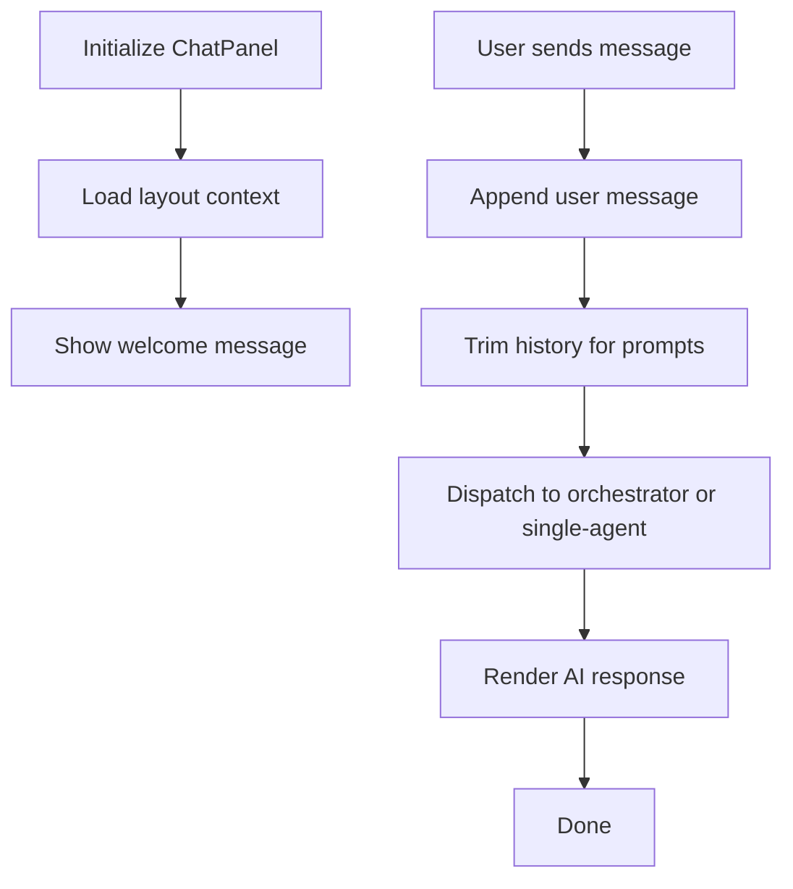

**Diagram sources**
- [chat_panel.py:171-178](file://symbolic_editor/chat_panel.py#L171-L178)
- [chat_panel.py:386-398](file://symbolic_editor/chat_panel.py#L386-L398)
- [chat_panel.py:463-479](file://symbolic_editor/chat_panel.py#L463-L479)
- [chat_panel.py:615-650](file://symbolic_editor/chat_panel.py#L615-L650)

**Section sources**
- [chat_panel.py:171-178](file://symbolic_editor/chat_panel.py#L171-L178)
- [chat_panel.py:386-398](file://symbolic_editor/chat_panel.py#L386-L398)
- [chat_panel.py:463-479](file://symbolic_editor/chat_panel.py#L463-L479)
- [chat_panel.py:615-650](file://symbolic_editor/chat_panel.py#L615-L650)

### Worker-Thread Pattern and Thread-Safe Communication
- The chat panel creates a QThread and moves the OrchestratorWorker onto it.
- All GUI updates occur on the GUI thread; worker-to-GUI communication is strictly via signals.
- run_llm includes automatic retry with exponential backoff for transient API errors to improve reliability.

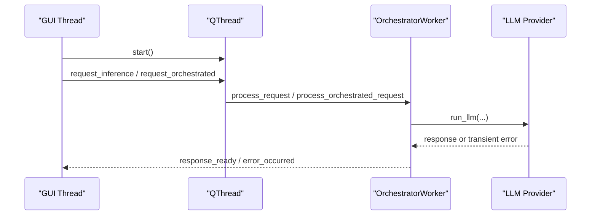

**Diagram sources**
- [chat_panel.py:134-154](file://symbolic_editor/chat_panel.py#L134-L154)
- [llm_worker.py:103-157](file://ai_agent/ai_chat_bot/llm_worker.py#L103-L157)
- [run_llm.py:91-123](file://ai_agent/ai_chat_bot/run_llm.py#L91-L123)

**Section sources**
- [chat_panel.py:134-154](file://symbolic_editor/chat_panel.py#L134-L154)
- [llm_worker.py:103-157](file://ai_agent/ai_chat_bot/llm_worker.py#L103-L157)
- [run_llm.py:91-123](file://ai_agent/ai_chat_bot/run_llm.py#L91-L123)

## Dependency Analysis
- ChatPanel depends on OrchestratorWorker and run_llm for inference.
- OrchestratorWorker depends on LangGraph app and run_llm for streaming and model invocation.
- LayoutEditorTab wires ChatPanel signals to internal handlers and AI command execution.

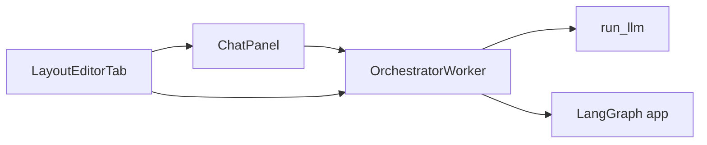

**Diagram sources**
- [chat_panel.py:95-158](file://symbolic_editor/chat_panel.py#L95-L158)
- [llm_worker.py:170-336](file://ai_agent/ai_chat_bot/llm_worker.py#L170-L336)
- [run_llm.py:76-162](file://ai_agent/ai_chat_bot/run_llm.py#L76-L162)
- [graph.py:1-52](file://ai_agent/ai_chat_bot/graph.py#L1-L52)
- [layout_tab.py:220-228](file://symbolic_editor/layout_tab.py#L220-L228)

**Section sources**
- [chat_panel.py:95-158](file://symbolic_editor/chat_panel.py#L95-L158)
- [llm_worker.py:170-336](file://ai_agent/ai_chat_bot/llm_worker.py#L170-L336)
- [run_llm.py:76-162](file://ai_agent/ai_chat_bot/run_llm.py#L76-L162)
- [graph.py:1-52](file://ai_agent/ai_chat_bot/graph.py#L1-L52)
- [layout_tab.py:220-228](file://symbolic_editor/layout_tab.py#L220-L228)

## Performance Considerations
- Auto-resizing input avoids unnecessary scrollbars and improves UX.
- Markdown-to-HTML conversion is lightweight and avoids heavy DOM libraries.
- Thinking indicators reduce perceived latency by providing feedback during long-running tasks.
- run_llm includes retry/backoff to mitigate transient provider errors.
- Batch command execution reduces undo overhead by grouping multiple AI actions.

## Troubleshooting Guide
Common issues and resolutions:
- No response from AI:
  - Verify model selection and API keys are configured.
  - Check for transient errors and retries.
- Pipeline stalls at human-in-the-loop:
  - Approve or reject strategy; or provide edits for visual review.
- Commands not applied:
  - Ensure device IDs exist and are not locked.
  - Confirm command format and action type.
- Chat panel not visible:
  - Toggle via View menu or toolbar.

**Section sources**
- [run_llm.py:91-123](file://ai_agent/ai_chat_bot/run_llm.py#L91-L123)
- [layout_tab.py:1700-1781](file://symbolic_editor/layout_tab.py#L1700-L1781)

## Conclusion
The chat panel integrates a robust PySide6 GUI with a thread-safe worker architecture. It supports keyword-based routing to a multi-agent pipeline, animated thinking indicators, markdown rendering, and batch command execution. The signal-slot design ensures reliable cross-thread communication, while the LangGraph pipeline enables human-in-the-loop workflows for complex layout tasks.