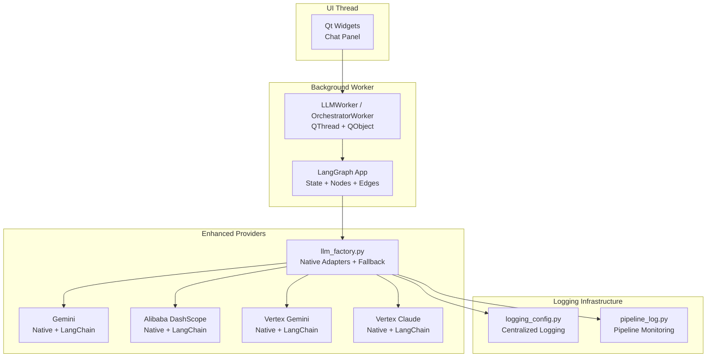
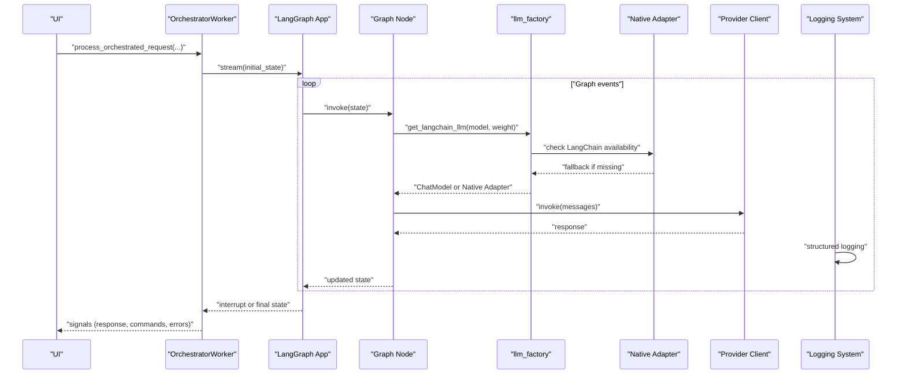
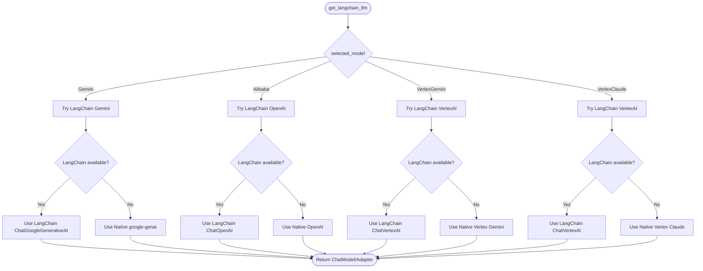
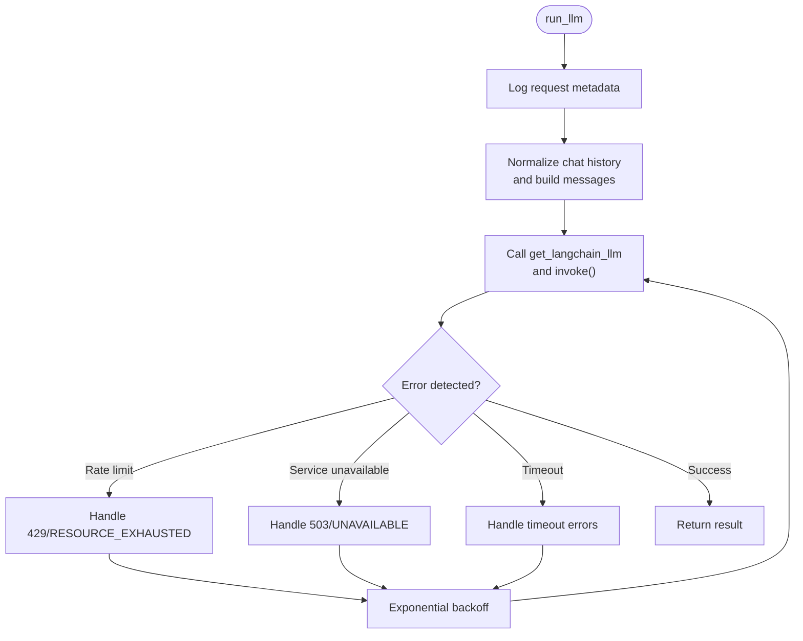
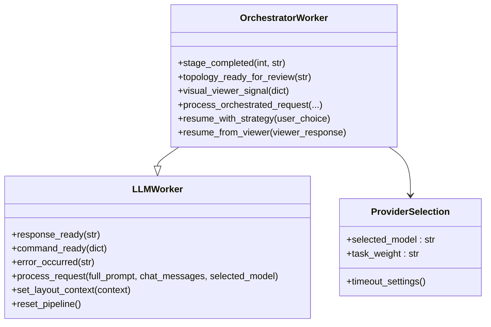
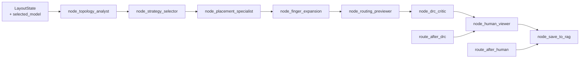
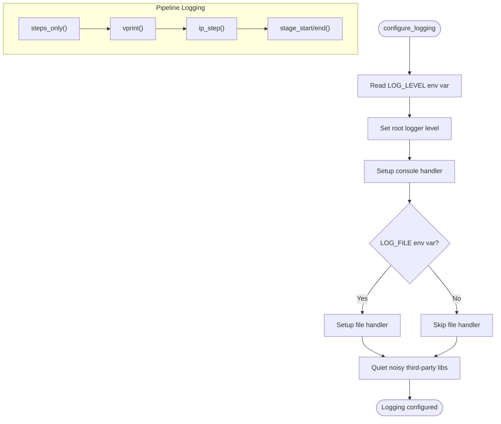
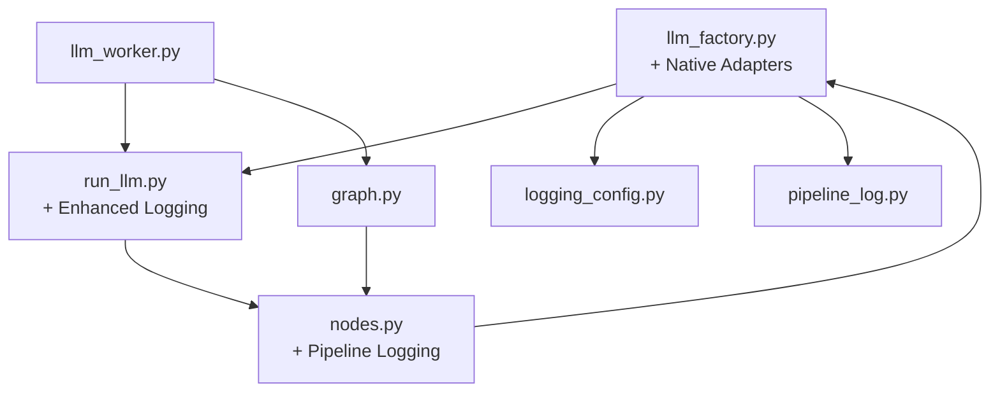

# LLM Provider Integration

<cite>
**Referenced Files in This Document**
- [llm_factory.py](file://ai_agent/ai_chat_bot/llm_factory.py)
- [run_llm.py](file://ai_agent/ai_chat_bot/run_llm.py)
- [llm_worker.py](file://ai_agent/ai_chat_bot/llm_worker.py)
- [graph.py](file://ai_agent/ai_chat_bot/graph.py)
- [state.py](file://ai_agent/ai_chat_bot/state.py)
- [nodes.py](file://ai_agent/ai_chat_bot/nodes.py)
- [edges.py](file://ai_agent/ai_chat_bot/edges.py)
- [classifier.py](file://ai_agent/ai_chat_bot/agents/classifier.py)
- [logging_config.py](file://config/logging_config.py)
- [pipeline_log.py](file://ai_agent/ai_chat_bot/pipeline_log.py)
</cite>

## Update Summary
**Changes Made**
- Enhanced provider system with native adapters for multiple LLM providers
- Added comprehensive logging infrastructure with centralized configuration
- Improved provider selection with fallback mechanisms for missing adapters
- Expanded supported providers beyond the original scope
- Added structured logging helpers for pipeline monitoring

## Table of Contents
1. [Introduction](#introduction)
2. [Project Structure](#project-structure)
3. [Core Components](#core-components)
4. [Architecture Overview](#architecture-overview)
5. [Detailed Component Analysis](#detailed-component-analysis)
6. [Enhanced Logging Infrastructure](#enhanced-logging-infrastructure)
7. [Dependency Analysis](#dependency-analysis)
8. [Performance Considerations](#performance-considerations)
9. [Troubleshooting Guide](#troubleshooting-guide)
10. [Conclusion](#conclusion)

## Introduction
This document explains the LLM provider integration system used by the AI-based analog layout automation pipeline. The system has been enhanced with native adapters for multiple LLM providers, improved logging infrastructure, and centralized configuration management. It covers:
- Enhanced provider support including Gemini, Alibaba DashScope, Vertex AI, and Claude
- Native adapter pattern with automatic fallback mechanisms
- Unified interface and factory pattern with comprehensive logging
- Automatic fallback and retry mechanisms
- Worker architecture using QThread and the Worker-Object pattern
- Multi-agent orchestration with LangGraph
- Local model support and cloud provider integration patterns
- Practical examples of provider switching, error handling, and performance optimization

## Project Structure
The LLM integration resides under ai_agent/ai_chat_bot and centers around:
- A provider factory with native adapters that instantiates LangChain chat models
- A unified run interface that handles retries and timeouts
- A Qt-based worker that runs the multi-agent pipeline off the GUI thread
- A LangGraph pipeline that orchestrates specialized agents
- Centralized logging configuration and pipeline monitoring utilities

**Diagram sources**
- [llm_factory.py:49-289](file://ai_agent/ai_chat_bot/llm_factory.py#L49-L289)
- [llm_worker.py:87-165](file://ai_agent/ai_chat_bot/llm_worker.py#L87-L165)
- [graph.py:1-52](file://ai_agent/ai_chat_bot/graph.py#L1-L52)
- [logging_config.py:22-65](file://config/logging_config.py#L22-L65)
- [pipeline_log.py:39-157](file://ai_agent/ai_chat_bot/pipeline_log.py#L39-L157)

**Section sources**
- [llm_factory.py:1-290](file://ai_agent/ai_chat_bot/llm_factory.py#L1-L290)
- [llm_worker.py:1-461](file://ai_agent/ai_chat_bot/llm_worker.py#L1-L461)
- [graph.py:1-52](file://ai_agent/ai_chat_bot/graph.py#L1-L52)
- [logging_config.py:1-65](file://config/logging_config.py#L1-L65)
- [pipeline_log.py:1-157](file://ai_agent/ai_chat_bot/pipeline_log.py#L1-L157)

## Core Components
- **Enhanced Provider Factory**: Selects and configures LangChain chat models with native adapter fallbacks, supporting Gemini, Alibaba DashScope, Vertex Gemini, and Vertex Claude.
- **Unified Run Interface**: Wraps model invocation with retry logic for transient errors and builds LangChain-compatible messages.
- **Worker-Object Pattern**: Runs the multi-agent pipeline on a background QThread, emitting Qt signals for UI updates.
- **LangGraph Pipeline**: Defines a linear, conditionally looping workflow of specialized nodes (topology, strategy, placement, DRC, routing, viewer, save).
- **Centralized Logging**: Provides structured logging configuration and pipeline monitoring utilities.
- **Native Adapter Pattern**: Implements lightweight adapters for direct provider communication when LangChain adapters are unavailable.

Key responsibilities:
- **Provider Factory**: Instantiates provider-specific clients, injects API keys and base URLs, and provides fallback mechanisms.
- **Run Interface**: Normalizes chat history, invokes the model, parses results, and handles provider-specific error patterns.
- **Worker**: Coordinates orchestration, emits responses and commands, handles errors, and manages provider selection.
- **Graph**: Encapsulates state transitions, human-in-the-loop interrupts, and pipeline monitoring.
- **Logging**: Configures application-wide logging, suppresses noisy third-party libraries, and provides structured pipeline output.

**Section sources**
- [llm_factory.py:49-289](file://ai_agent/ai_chat_bot/llm_factory.py#L49-L289)
- [run_llm.py:76-162](file://ai_agent/ai_chat_bot/run_llm.py#L76-L162)
- [llm_worker.py:87-165](file://ai_agent/ai_chat_bot/llm_worker.py#L87-L165)
- [graph.py:1-52](file://ai_agent/ai_chat_bot/graph.py#L1-L52)
- [logging_config.py:22-65](file://config/logging_config.py#L22-L65)
- [pipeline_log.py:39-157](file://ai_agent/ai_chat_bot/pipeline_log.py#L39-L157)

## Architecture Overview
The system separates concerns across layers with enhanced provider support and logging:
- **UI Layer**: Emits requests and receives updates via Qt signals.
- **Worker Layer**: Executes the multi-agent pipeline in a background thread with provider selection.
- **Orchestration Layer**: LangGraph nodes encapsulate domain logic and LLM interactions with structured logging.
- **Provider Layer**: Factory resolves provider-specific configuration, credentials, and fallback adapters.
- **Logging Layer**: Centralized configuration with pipeline monitoring and step-only mode support.

**Diagram sources**
- [llm_worker.py:195-336](file://ai_agent/ai_chat_bot/llm_worker.py#L195-L336)
- [graph.py:337-380](file://ai_agent/ai_chat_bot/graph.py#L337-L380)
- [nodes.py:325-393](file://ai_agent/ai_chat_bot/nodes.py#L325-L393)
- [llm_factory.py:157-289](file://ai_agent/ai_chat_bot/llm_factory.py#L157-L289)
- [logging_config.py:22-65](file://config/logging_config.py#L22-L65)

## Detailed Component Analysis

### Enhanced Provider Factory: llm_factory.py
- **Purpose**: Centralized provider selection with native adapter fallbacks and comprehensive logging.
- **Supported providers**: Gemini, Alibaba DashScope, Vertex Gemini, Vertex Claude.
- **Task weighting**: Chooses lighter or heavier models depending on task_weight.
- **Native adapters**: Lightweight wrapper classes that expose invoke() method for direct provider communication.
- **Environment-driven configuration**: Timeout resolution via LLM_TIMEOUT_LIGHT/HEAVY, API keys, and project settings.
- **Enhanced fallback behavior**: Graceful degradation from LangChain adapters to native implementations.

**Diagram sources**
- [llm_factory.py:157-289](file://ai_agent/ai_chat_bot/llm_factory.py#L157-L289)
- [llm_factory.py:49-144](file://ai_agent/ai_chat_bot/llm_factory.py#L49-L144)

**Section sources**
- [llm_factory.py:157-289](file://ai_agent/ai_chat_bot/llm_factory.py#L157-L289)
- [llm_factory.py:49-144](file://ai_agent/ai_chat_bot/llm_factory.py#L49-L144)

### Unified Run Interface: run_llm.py
- **Purpose**: Provides a single entry point for LLM invocations with robust error handling and enhanced logging.
- **Retry strategy**: Exponential backoff for transient errors (429/503) up to a fixed number of attempts.
- **Message normalization**: Builds a LangChain-compatible message list from chat history and full prompt.
- **Error classification**: Detects rate limits, service unavailability, and timeout errors with actionable messages.
- **Enhanced logging**: Structured output with request metadata and performance metrics.

**Diagram sources**
- [run_llm.py:76-162](file://ai_agent/ai_chat_bot/run_llm.py#L76-L162)

**Section sources**
- [run_llm.py:76-162](file://ai_agent/ai_chat_bot/run_llm.py#L76-L162)

### Worker-Object Pattern: llm_worker.py
- **Purpose**: Offload LLM work to a background QThread to keep the UI responsive with enhanced provider support.
- **Signals**: response_ready, command_ready, error_occurred; OrchestratorWorker adds stage_completed and visual viewer signals.
- **Multi-Agent Orchestration**: Uses MultiAgentOrchestrator to route requests through specialized agents.
- **Enhanced Provider Selection**: Integrates with the enhanced provider factory for seamless model switching.
- **LangGraph Pipeline**: OrchestratorWorker streams the LangGraph app, emitting interrupts for strategy selection and visual review.
- **Human-in-the-loop**: Resumes the pipeline after user decisions with structured logging.

**Diagram sources**
- [llm_worker.py:87-165](file://ai_agent/ai_chat_bot/llm_worker.py#L87-L165)
- [llm_worker.py:170-461](file://ai_agent/ai_chat_bot/llm_worker.py#L170-L461)

**Section sources**
- [llm_worker.py:87-165](file://ai_agent/ai_chat_bot/llm_worker.py#L87-L165)
- [llm_worker.py:170-336](file://ai_agent/ai_chat_bot/llm_worker.py#L170-L336)
- [llm_worker.py:337-461](file://ai_agent/ai_chat_bot/llm_worker.py#L337-L461)

### LangGraph Pipeline: graph.py, state.py, nodes.py, edges.py
- **State**: Typed dictionary capturing inputs, intermediate results, counters, and pending commands with enhanced provider tracking.
- **Nodes**: Specialized stages (topology, strategy, placement, DRC, routing, viewer, save) that call the provider via the factory and LLM interface.
- **Edges**: Deterministic and conditional transitions, including retries and human-in-the-loop with structured logging.
- **Enhanced Monitoring**: Nodes integrate with pipeline logging utilities for step-by-step execution tracking.
- **Human-in-the-loop**: Nodes can interrupt to present placement/routing for approval or strategy selection.

**Diagram sources**
- [graph.py:1-52](file://ai_agent/ai_chat_bot/graph.py#L1-L52)
- [state.py:3-42](file://ai_agent/ai_chat_bot/state.py#L3-L42)
- [edges.py:6-34](file://ai_agent/ai_chat_bot/edges.py#L6-L34)
- [nodes.py:325-393](file://ai_agent/ai_chat_bot/nodes.py#L325-L393)

**Section sources**
- [graph.py:1-52](file://ai_agent/ai_chat_bot/graph.py#L1-L52)
- [state.py:3-42](file://ai_agent/ai_chat_bot/state.py#L3-L42)
- [edges.py:6-34](file://ai_agent/ai_chat_bot/edges.py#L6-L34)
- [nodes.py:325-393](file://ai_agent/ai_chat_bot/nodes.py#L325-L393)

## Enhanced Logging Infrastructure
The system now includes comprehensive logging infrastructure with centralized configuration and pipeline monitoring:

### Centralized Logging Configuration
- **Configuration**: Single entry point for application-wide logging setup
- **Handlers**: Console handler with human-readable format and optional file handler
- **Levels**: Debug-level for project modules, Warning for third-party libraries
- **Noise Suppression**: Quiets noisy third-party libraries including Google GenAI, OpenAI, and Anthropic SDKs

### Pipeline Monitoring Utilities
- **Step-only Mode**: Suppresses detailed logs during initial placement for cleaner console output
- **Structured Formatting**: Timestamped, aligned output with stage progress tracking
- **Pipeline Lifecycle**: Start/end banners with configuration details and summary statistics
- **Stage Timing**: Individual stage execution time tracking and reporting

**Diagram sources**
- [logging_config.py:22-65](file://config/logging_config.py#L22-L65)
- [pipeline_log.py:39-157](file://ai_agent/ai_chat_bot/pipeline_log.py#L39-L157)

**Section sources**
- [logging_config.py:22-65](file://config/logging_config.py#L22-L65)
- [pipeline_log.py:39-157](file://ai_agent/ai_chat_bot/pipeline_log.py#L39-L157)

## Dependency Analysis
- **Factory-to-Provider**: The factory depends on provider SDKs (Google GenAI, Vertex AI, OpenAI, Anthropic) and environment variables.
- **Run-to-Factory**: The run interface depends on the factory for model instantiation and enhanced logging.
- **Worker-to-Run**: The worker delegates LLM calls to the run interface with provider selection.
- **Graph-to-Run**: Nodes call the run interface for provider invocations with structured logging.
- **Worker-to-Graph**: The orchestrator worker streams the LangGraph app and resumes on interrupts.
- **Logging Integration**: All components integrate with centralized logging configuration.

**Diagram sources**
- [llm_factory.py:157-289](file://ai_agent/ai_chat_bot/llm_factory.py#L157-L289)
- [run_llm.py:126-162](file://ai_agent/ai_chat_bot/run_llm.py#L126-L162)
- [nodes.py:325-393](file://ai_agent/ai_chat_bot/nodes.py#L325-L393)
- [llm_worker.py:195-336](file://ai_agent/ai_chat_bot/llm_worker.py#L195-L336)
- [graph.py:1-52](file://ai_agent/ai_chat_bot/graph.py#L1-L52)
- [logging_config.py:22-65](file://config/logging_config.py#L22-L65)
- [pipeline_log.py:39-157](file://ai_agent/ai_chat_bot/pipeline_log.py#L39-L157)

**Section sources**
- [llm_factory.py:157-289](file://ai_agent/ai_chat_bot/llm_factory.py#L157-L289)
- [run_llm.py:126-162](file://ai_agent/ai_chat_bot/run_llm.py#L126-L162)
- [nodes.py:325-393](file://ai_agent/ai_chat_bot/nodes.py#L325-L393)
- [llm_worker.py:195-336](file://ai_agent/ai_chat_bot/llm_worker.py#L195-L336)
- [graph.py:1-52](file://ai_agent/ai_chat_bot/graph.py#L1-L52)
- [logging_config.py:22-65](file://config/logging_config.py#L22-L65)
- [pipeline_log.py:39-157](file://ai_agent/ai_chat_bot/pipeline_log.py#L39-L157)

## Performance Considerations
- **Task-weighted models**: Use lighter models for quick steps (light) and heavier models for complex reasoning (heavy).
- **Timeouts**: Configure per-task timeouts via environment variables to avoid long hangs.
- **Retries**: Automatic exponential backoff reduces impact of transient provider errors.
- **Message normalization**: Keep chat history trimmed to reduce overhead.
- **Human-in-the-loop**: Interrupts minimize unnecessary computation by pausing until user decisions.
- **Native adapters**: Direct provider communication reduces overhead when LangChain adapters are unavailable.
- **Logging efficiency**: Step-only mode suppresses detailed logs during initial placement for better performance.
- **Provider fallback**: Graceful degradation ensures system continues operating even with partial adapter availability.

## Troubleshooting Guide
Common issues and remedies:
- **Missing API keys**: Ensure environment variables are set for the selected provider (GEMINI_API_KEY, ALIBABA_API_KEY, VERTEX_PROJECT_ID, VERTEX_LOCATION).
- **Transient errors**: The run interface retries on 429/503; monitor logs for backoff behavior and retry delays.
- **Timeout errors**: Adjust LLM_TIMEOUT_LIGHT or LLM_TIMEOUT_HEAVY depending on task weight.
- **Provider fallback**: Unknown provider keys fall back to default Gemini; check provider selection logic.
- **LangChain adapter issues**: System automatically falls back to native adapters when LangChain packages are unavailable.
- **Logging configuration**: Verify LOG_LEVEL and LOG_FILE environment variables for desired logging behavior.
- **Pipeline monitoring**: Use PLACEMENT_STEPS_ONLY to control detailed logging output during initial placement.
- **LangGraph interruptions**: Resume the pipeline after strategy or visual review decisions with structured logging feedback.

**Section sources**
- [llm_factory.py:174-201](file://ai_agent/ai_chat_bot/llm_factory.py#L174-L201)
- [run_llm.py:103-123](file://ai_agent/ai_chat_bot/run_llm.py#L103-L123)
- [llm_worker.py:332-336](file://ai_agent/ai_chat_bot/llm_worker.py#L332-L336)
- [logging_config.py:37-52](file://config/logging_config.py#L37-L52)
- [pipeline_log.py:39-76](file://ai_agent/ai_chat_bot/pipeline_log.py#L39-L76)

## Conclusion
The enhanced LLM provider integration system combines a centralized factory with native adapters, a unified run interface, a Qt-based worker, and a LangGraph pipeline to deliver a robust, extensible, and responsive AI-assisted layout automation workflow. The system now supports multiple providers with automatic fallback mechanisms, incorporates comprehensive logging infrastructure, and enables human-in-the-loop controls for high-quality outcomes. The native adapter pattern ensures continued operation even when LangChain adapters are unavailable, while centralized logging provides visibility into system performance and execution flow.