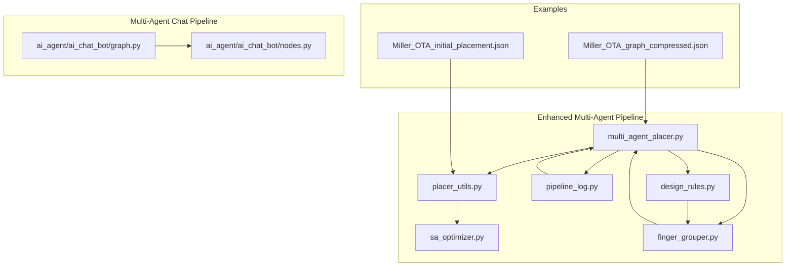
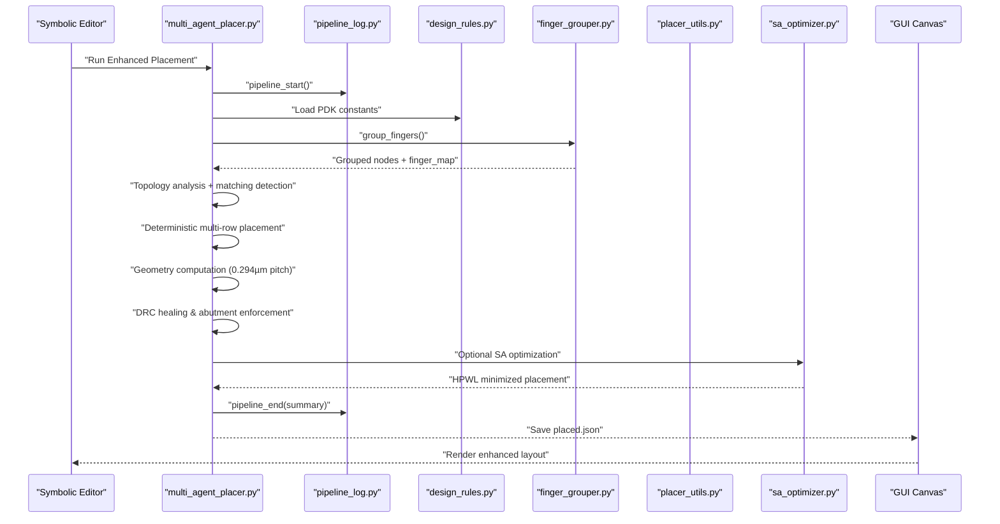
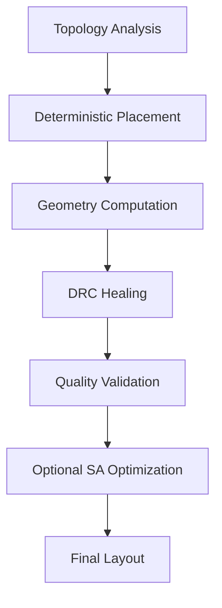
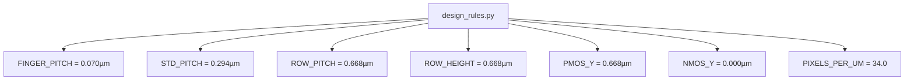
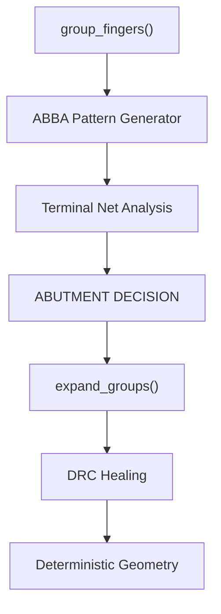
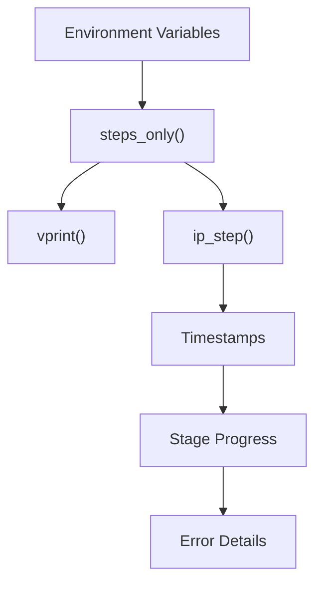
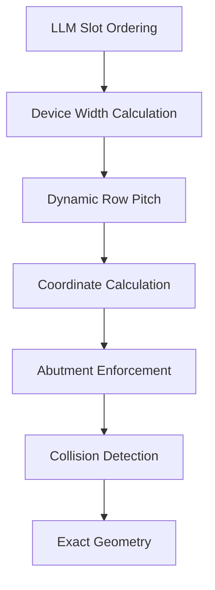
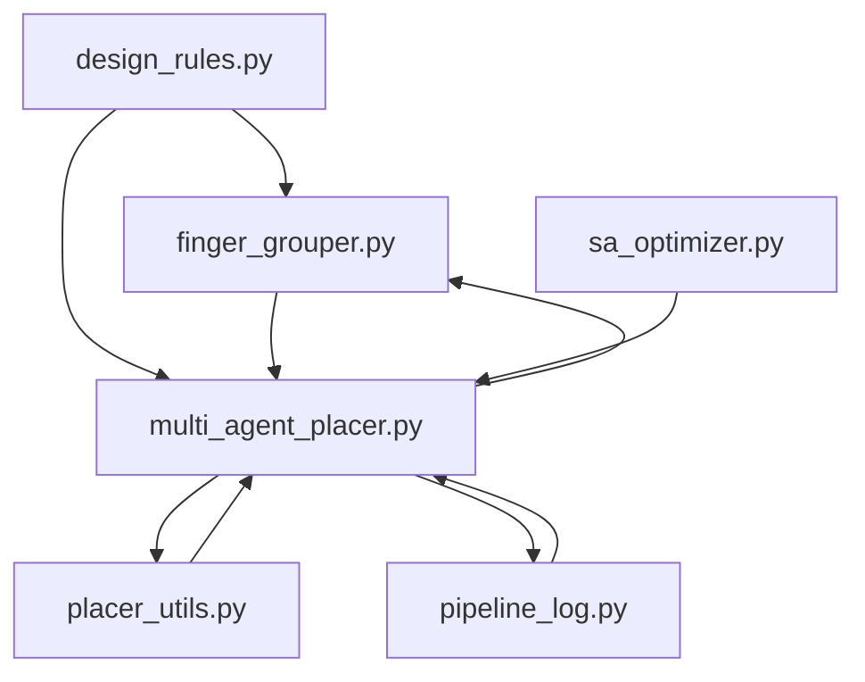

# AI Initial Placement System

<cite>
**Referenced Files in This Document**
- [README.md](file://ai_agent/ai_initial_placement/README.md)
- [multi_agent_placer.py](file://ai_agent/ai_initial_placement/multi_agent_placer.py)
- [placer_utils.py](file://ai_agent/ai_initial_placement/placer_utils.py)
- [sa_optimizer.py](file://ai_agent/ai_initial_placement/sa_optimizer.py)
- [finger_grouper.py](file://ai_agent/ai_initial_placement/finger_grouper.py)
- [pipeline_log.py](file://ai_agent/ai_chat_bot/pipeline_log.py)
- [design_rules.py](file://config/design_rules.py)
- [Miller_OTA_graph_compressed.json](file://examples/Miller_OTA/Miller_OTA_graph_compressed.json)
- [Miller_OTA_initial_placement.json](file://examples/Miller_OTA/Miller_OTA_initial_placement.json)
- [graph.py](file://ai_agent/ai_chat_bot/graph.py)
- [nodes.py](file://ai_agent/ai_chat_bot/nodes.py)
- [BUGFIX_ABUTMENT_SPACING.md](file://docs/BUGFIX_ABUTMENT_SPACING.md)
- [common-centroid-matching.md](file://ai_agent/SKILLS/common-centroid-matching.md)
- [interdigitated-matching.md](file://ai_agent/SKILLS/interdigitated-matching.md)
</cite>

## Update Summary
**Changes Made**
- Updated multi-agent pipeline architecture to replace legacy LLM hallucination-based placement with deterministic geometry engine
- Added new pipeline_log system with structured logging, timestamps, and stage progress tracking
- Enhanced finger grouping with ABBA interdigitation patterns for improved matching
- Implemented centralized design rules configuration system for PDK constants
- Updated multi-row placement capabilities with topology-driven deterministic engine
- Added comprehensive validation and quality reporting mechanisms

## Table of Contents
1. [Introduction](#introduction)
2. [Project Structure](#project-structure)
3. [Core Components](#core-components)
4. [Architecture Overview](#architecture-overview)
5. [Detailed Component Analysis](#detailed-component-analysis)
6. [Dependency Analysis](#dependency-analysis)
7. [Performance Considerations](#performance-considerations)
8. [Troubleshooting Guide](#troubleshooting-guide)
9. [Conclusion](#conclusion)
10. [Appendices](#appendices)

## Introduction
This document explains the AI initial placement system that powers automated analog layout generation using advanced multi-agent pipeline architecture. The system has evolved from legacy LLM hallucination-based placement to a deterministic geometry engine that guarantees DRC compliance while maintaining AI-driven reasoning capabilities. It covers the enhanced multi-agent pipeline with topology analysis, row planning, placement specification, deterministic geometry computation, and DRC healing. The system now features ABBA interdigitation patterns for superior matching, centralized design rules configuration, and comprehensive logging infrastructure.

## Project Structure
The AI initial placement system is organized into an enhanced multi-agent pipeline architecture:
- A topology analysis stage that identifies circuit functions and matching requirements
- A deterministic multi-row placement engine that computes exact geometries
- A comprehensive logging system with structured pipeline tracking
- Centralized design rules management for PDK constants
- Advanced finger grouping with ABBA interdigitation patterns
- Integrated validation and quality reporting mechanisms

**Diagram sources**
- [multi_agent_placer.py:1-1983](file://ai_agent/ai_initial_placement/multi_agent_placer.py#L1-L1983)
- [pipeline_log.py:1-157](file://ai_agent/ai_chat_bot/pipeline_log.py#L1-L157)
- [design_rules.py:1-31](file://config/design_rules.py#L1-L31)
- [finger_grouper.py:1-1706](file://ai_agent/ai_initial_placement/finger_grouper.py#L1-L1706)
- [placer_utils.py:1-1367](file://ai_agent/ai_initial_placement/placer_utils.py#L1-L1367)
- [sa_optimizer.py:1-256](file://ai_agent/ai_initial_placement/sa_optimizer.py#L1-L256)

**Section sources**
- [README.md:1-119](file://ai_agent/ai_initial_placement/README.md#L1-L119)

## Core Components
- **Enhanced Multi-Agent Pipeline**: Four-stage deterministic pipeline with topology analysis, multi-row placement, geometry computation, and DRC healing
- **Centralized Design Rules**: Unified PDK constants management for SAED14nm process technology
- **Advanced Finger Grouping**: ABBA interdigitation patterns with enhanced matching awareness
- **Structured Logging System**: Pipeline-wide logging with timestamps, progress tracking, and quality metrics
- **Deterministic Geometry Engine**: Mathematical computation replacing LLM hallucinations for exact placements
- **Quality Validation**: Comprehensive DRC checking and layout quality assessment

**Section sources**
- [multi_agent_placer.py:1-1983](file://ai_agent/ai_initial_placement/multi_agent_placer.py#L1-L1983)
- [pipeline_log.py:1-157](file://ai_agent/ai_chat_bot/pipeline_log.py#L1-L157)
- [design_rules.py:1-31](file://config/design_rules.py#L1-L31)
- [finger_grouper.py:645-914](file://ai_agent/ai_initial_placement/finger_grouper.py#L645-L914)

## Architecture Overview
The enhanced system replaces legacy LLM hallucination-based placement with a deterministic geometry engine while preserving AI-driven reasoning capabilities. The multi-agent pipeline ensures mathematical guarantees for DRC compliance and layout quality.

**Diagram sources**
- [multi_agent_placer.py:1783-1983](file://ai_agent/ai_initial_placement/multi_agent_placer.py#L1783-L1983)
- [pipeline_log.py:81-157](file://ai_agent/ai_chat_bot/pipeline_log.py#L81-L157)
- [design_rules.py:14-19](file://config/design_rules.py#L14-L19)
- [finger_grouper.py:114-200](file://ai_agent/ai_initial_placement/finger_grouper.py#L114-L200)

## Detailed Component Analysis

### Enhanced Multi-Agent Pipeline Architecture
The system now operates as a four-stage deterministic pipeline that guarantees DRC compliance:

**Stage 1: Topology Analysis**
- Pure-Python circuit analysis with LLM enhancement
- Identifies functional blocks, matching requirements, and placement constraints
- Generates topology-aware placement directives

**Stage 2: Deterministic Multi-Row Placement**
- LLM provides row assignments and ordering
- Deterministic geometry engine computes exact coordinates
- Mathematical guarantee of PMOS/NMOS separation

**Stage 3: Geometry Computation**
- Converts slot-based ordering to precise micron coordinates
- Implements 0.294µm standard pitch and 0.070µm abutment spacing
- Dynamic row pitch calculation based on device heights

**Stage 4: DRC Healing**
- Per-row repacking to eliminate x-collisions
- Exact abutment spacing enforcement (0.070µm)
- Layout quality validation and reporting

**Diagram sources**
- [multi_agent_placer.py:268-1983](file://ai_agent/ai_initial_placement/multi_agent_placer.py#L268-L1983)

**Section sources**
- [multi_agent_placer.py:1-1983](file://ai_agent/ai_initial_placement/multi_agent_placer.py#L1-L1983)

### Centralized Design Rules Management
The system now uses a unified design rules configuration that centralizes all PDK constants:

- **Standard Pitch**: 0.294µm for non-abutted devices
- **Row Pitch**: 0.668µm for PMOS/NMOS separation
- **Finger Pitch**: 0.070µm for abutted devices
- **Device Heights**: Dynamic calculation based on actual device dimensions
- **Rendering Scale**: 34.0 pixels per µm for GUI display

**Diagram sources**
- [design_rules.py:14-30](file://config/design_rules.py#L14-L30)

**Section sources**
- [design_rules.py:1-31](file://config/design_rules.py#L1-L31)

### Advanced Finger Grouping with ABBA Patterns
The enhanced finger grouping system implements sophisticated interdigitation patterns:

**ABBA Interdigitation Pattern**
- Equal-sized groups: A1 B1 B2 A2 | A3 B3 B4 A4
- Unequal-sized groups: Even distribution of B fingers among A fingers
- Thermal symmetry optimization for matched devices

**Enhanced Matching Detection**
- ABBA pattern generation for true interdigitation
- Mirror pattern support for asymmetric matching
- Terminal net analysis for S/D net sharing detection
- Automatic abutment decision based on shared terminals

**Diagram sources**
- [finger_grouper.py:645-914](file://ai_agent/ai_initial_placement/finger_grouper.py#L645-L914)
- [finger_grouper.py:114-200](file://ai_agent/ai_initial_placement/finger_grouper.py#L114-L200)

**Section sources**
- [finger_grouper.py:645-914](file://ai_agent/ai_initial_placement/finger_grouper.py#L645-L914)
- [finger_grouper.py:114-200](file://ai_agent/ai_initial_placement/finger_grouper.py#L114-L200)

### Structured Pipeline Logging System
The new pipeline_log module provides comprehensive logging infrastructure:

**Key Features**
- **Step-only mode**: Minimal console output for production runs
- **Timestamped entries**: Precise timing for performance analysis
- **Stage progress tracking**: Five-stage pipeline monitoring
- **Structured formatting**: Consistent log message presentation
- **Environment controls**: PLACEMENT_STEPS_ONLY and PLACEMENT_DEBUG_FULL_LOG

**Logging Categories**
- **Pipeline banners**: Model, device counts, and configuration details
- **Stage transitions**: Start/end timing for each pipeline stage
- **Quality metrics**: Layout dimensions, aspect ratios, and device counts
- **Error reporting**: Detailed failure analysis and recovery information

**Diagram sources**
- [pipeline_log.py:39-76](file://ai_agent/ai_chat_bot/pipeline_log.py#L39-L76)
- [pipeline_log.py:81-157](file://ai_agent/ai_chat_bot/pipeline_log.py#L81-L157)

**Section sources**
- [pipeline_log.py:1-157](file://ai_agent/ai_chat_bot/pipeline_log.py#L1-L157)

### Deterministic Geometry Engine
The replacement of LLM hallucinations with mathematical computation ensures exact placements:

**Key Improvements**
- **Exact coordinate calculation**: No floating-point rounding errors
- **Dynamic row pitch**: Based on actual device heights and routing gaps
- **Guaranteed separation**: PMOS/NMOS rows separated by exactly 0.668µm
- **Abutment enforcement**: Strict 0.070µm spacing for abutted devices
- **Layout centering**: Symmetric positioning for balanced aspect ratios

**Mathematical Guarantees**
- **Row separation**: min(PMOS_y) = max(NMOS_y) + 0.668µm
- **Abutment precision**: |x2 - x1 - 0.070| < 0.005µm for abutted pairs
- **Device width accuracy**: Uses actual device widths, not standardized pitches
- **Overlap prevention**: Bounding box-based collision detection

**Diagram sources**
- [multi_agent_placer.py:1096-1278](file://ai_agent/ai_initial_placement/multi_agent_placer.py#L1096-L1278)

**Section sources**
- [multi_agent_placer.py:1096-1278](file://ai_agent/ai_initial_placement/multi_agent_placer.py#L1096-L1278)

### Quality Validation and Reporting
The enhanced system includes comprehensive validation and quality assessment:

**Validation Checks**
- **Device coverage**: Every device appears exactly once
- **Type integrity**: No PMOS in NMOS rows or vice versa
- **Overlap prevention**: Same-row device collision detection
- **Abutment accuracy**: Exact 0.070µm spacing enforcement
- **Aspect ratio optimization**: Target ~1.0 aspect ratio for square layouts

**Quality Metrics**
- **Layout dimensions**: Width, height, and aspect ratio calculation
- **Device density**: Number of devices per row and total count
- **Shape assessment**: Near-square, wide, or tall layout classification
- **PMOS/NMOS separation**: Final verification of row separation

**Section sources**
- [multi_agent_placer.py:1285-1366](file://ai_agent/ai_initial_placement/multi_agent_placer.py#L1285-L1366)
- [multi_agent_placer.py:1934-1960](file://ai_agent/ai_initial_placement/multi_agent_placer.py#L1934-L1960)

## Dependency Analysis
The enhanced system maintains clear layering with additional dependencies:

**Diagram sources**
- [design_rules.py:1-31](file://config/design_rules.py#L1-L31)
- [multi_agent_placer.py:1-1983](file://ai_agent/ai_initial_placement/multi_agent_placer.py#L1-L1983)
- [pipeline_log.py:1-157](file://ai_agent/ai_chat_bot/pipeline_log.py#L1-L157)
- [finger_grouper.py:1-1706](file://ai_agent/ai_initial_placement/finger_grouper.py#L1-L1706)
- [placer_utils.py:1-1367](file://ai_agent/ai_initial_placement/placer_utils.py#L1-L1367)
- [sa_optimizer.py:1-256](file://ai_agent/ai_initial_placement/sa_optimizer.py#L1-L256)

**Section sources**
- [design_rules.py:1-31](file://config/design_rules.py#L1-L31)
- [multi_agent_placer.py:1-1983](file://ai_agent/ai_initial_placement/multi_agent_placer.py#L1-L1983)
- [pipeline_log.py:1-157](file://ai_agent/ai_chat_bot/pipeline_log.py#L1-L157)
- [finger_grouper.py:1-1706](file://ai_agent/ai_initial_placement/finger_grouper.py#L1-L1706)
- [placer_utils.py:1-1367](file://ai_agent/ai_initial_placement/placer_utils.py#L1-L1367)
- [sa_optimizer.py:1-256](file://ai_agent/ai_initial_placement/sa_optimizer.py#L1-L256)

## Performance Considerations
The enhanced system provides improved performance characteristics:

**Token Efficiency**: Compressed graph reduces prompt size by 95–97% while maintaining AI reasoning capabilities
**Deterministic Execution**: Elimination of floating-point hallucinations reduces retries and validation failures
**Mathematical Guarantees**: Exact coordinate computation eliminates iterative correction loops
**Parallel Processing**: Pipeline stages can be executed concurrently where dependencies allow
**Memory Efficiency**: Centralized design rules reduce memory footprint across modules
**Logging Overhead**: Structured logging adds minimal overhead compared to validation benefits

## Troubleshooting Guide
Enhanced troubleshooting capabilities with structured logging:

**Common Issues**
- **Pipeline failures**: Check PLACEMENT_STEPS_ONLY environment variable for reduced logging
- **Design rule violations**: Verify PDK constants in design_rules.py are correct for target process
- **ABBA pattern failures**: Ensure matching groups have compatible finger counts
- **Row separation errors**: Confirm dynamic row pitch calculation accounts for device heights
- **Logging verbosity**: Use PLACEMENT_DEBUG_FULL_LOG=1 for full diagnostic output

**Diagnostic Tools**
- **Pipeline logs**: Review timestamped stage transitions for performance analysis
- **Quality reports**: Monitor aspect ratios and device densities for layout optimization
- **Error summaries**: Pipeline captures detailed error information for quick resolution
- **Fallback mechanisms**: Deterministic fallback ensures placement even with LLM failures

**Section sources**
- [pipeline_log.py:39-76](file://ai_agent/ai_chat_bot/pipeline_log.py#L39-L76)
- [multi_agent_placer.py:1825-1847](file://ai_agent/ai_initial_placement/multi_agent_placer.py#L1825-L1847)

## Conclusion
The enhanced AI initial placement system represents a significant advancement in automated analog layout generation. By replacing LLM hallucinations with deterministic geometry computation while preserving AI-driven reasoning capabilities, the system achieves mathematical guarantees for DRC compliance and layout quality. The addition of ABBA interdigitation patterns, centralized design rules management, and comprehensive logging infrastructure provides unprecedented reliability and performance for analog circuit placement.

## Appendices

### Enhanced ABBA Interdigitation Patterns
The system now supports sophisticated matching patterns for improved device symmetry:

**ABBA Pattern Generation**
- Equal-sized matched groups: A-B-B-A interdigitation for thermal symmetry
- Unequal-sized groups: Even distribution of fingers for optimal matching
- Terminal net analysis: Determines whether devices share S/D nets for abutment decisions
- Pattern optimization: Selects best matching strategy based on device characteristics

**Matching Techniques**
- **ABBA Interdigitation**: True ABBA motif (A-B-B-A) for perfect thermal matching
- **Mirror Patterns**: Symmetric patterns for asymmetric matching requirements
- **Common Centroid**: Multi-finger balancing across multiple devices
- **Interdigitated Matching**: Proportional interleaving for improved matching quality

**Section sources**
- [finger_grouper.py:645-914](file://ai_agent/ai_initial_placement/finger_grouper.py#L645-L914)
- [common-centroid-matching.md:1-26](file://ai_agent/SKILLS/common-centroid-matching.md#L1-L26)
- [interdigitated-matching.md:1-29](file://ai_agent/SKILLS/interdigitated-matching.md#L1-L29)