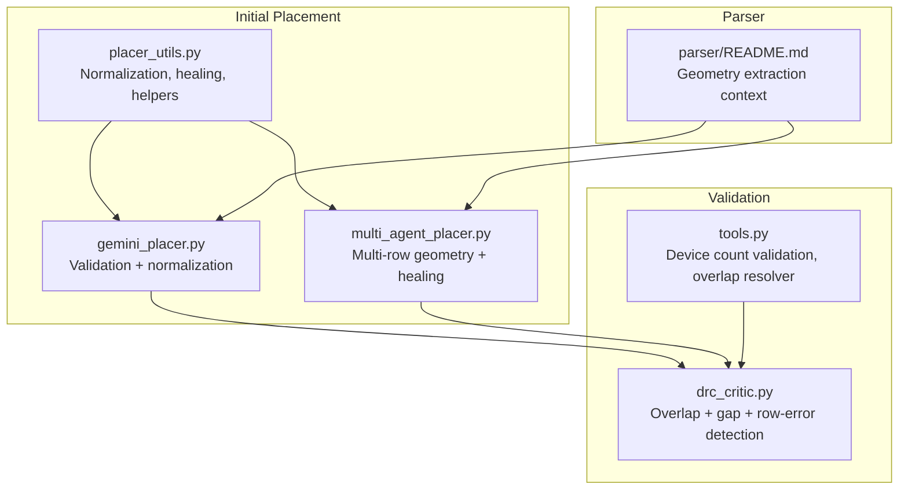
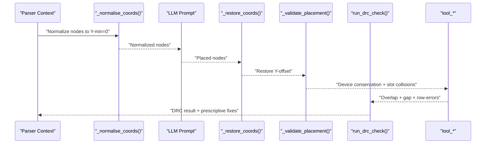
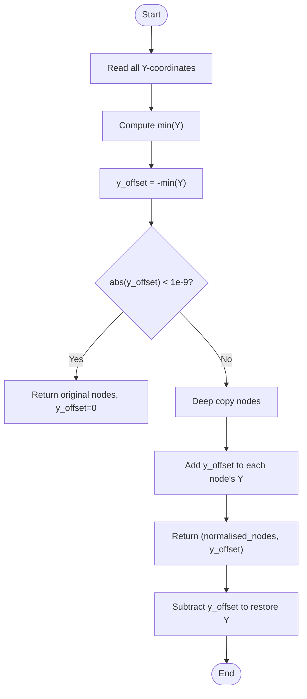
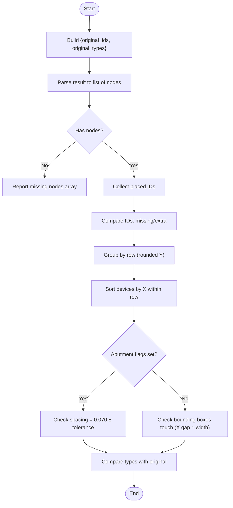
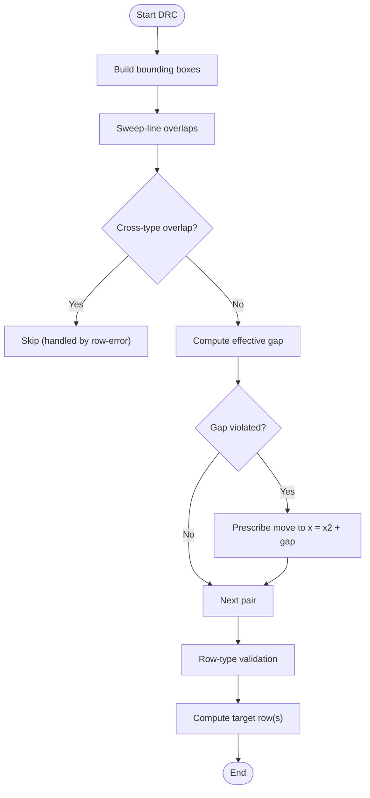
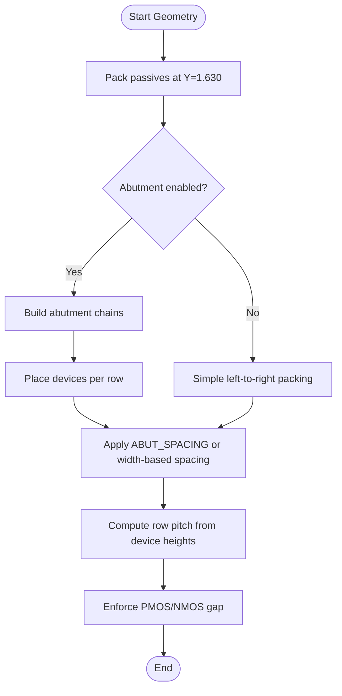
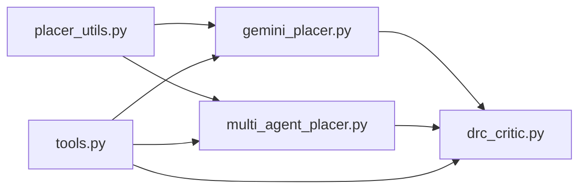

# Coordinate Normalization and Validation

<cite>
**Referenced Files in This Document**
- [placer_utils.py](file://ai_agent/ai_initial_placement/placer_utils.py)
- [gemini_placer.py](file://ai_agent/ai_initial_placement/gemini_placer.py)
- [multi_agent_placer.py](file://ai_agent/ai_initial_placement/multi_agent_placer.py)
- [drc_critic.py](file://ai_agent/ai_chat_bot/agents/drc_critic.py)
- [tools.py](file://ai_agent/ai_chat_bot/tools.py)
- [validation_script.py](file://tests/validation_script.py)
- [README.md](file://parser/README.md)
</cite>

## Table of Contents
1. [Introduction](#introduction)
2. [Project Structure](#project-structure)
3. [Core Components](#core-components)
4. [Architecture Overview](#architecture-overview)
5. [Detailed Component Analysis](#detailed-component-analysis)
6. [Dependency Analysis](#dependency-analysis)
7. [Performance Considerations](#performance-considerations)
8. [Troubleshooting Guide](#troubleshooting-guide)
9. [Conclusion](#conclusion)

## Introduction
This document explains the coordinate normalization and validation systems that ensure placement quality and Design Rule Compliance (DRC). It covers:
- Y-coordinate offset calculation and restoration to handle arbitrary coordinate frames
- Validation pipeline: device count verification, collision detection in x-slots, and type consistency checks
- Fin grid quantization and spacing enforcement
- Examples of normalized coordinate transformations and validation error scenarios with corrective actions

## Project Structure
The relevant modules are organized around placement and validation:
- Initial placement and normalization: placer_utils.py, gemini_placer.py, multi_agent_placer.py
- DRC validation and legalizer: drc_critic.py
- Tool wrappers and validation utilities: tools.py
- Example validation script: validation_script.py
- Parser context: README.md (layout reader and geometry extraction)

**Diagram sources**
- [placer_utils.py:393-461](file://ai_agent/ai_initial_placement/placer_utils.py#L393-L461)
- [gemini_placer.py:422-597](file://ai_agent/ai_initial_placement/gemini_placer.py#L422-L597)
- [multi_agent_placer.py:1-800](file://ai_agent/ai_initial_placement/multi_agent_placer.py#L1-L800)
- [drc_critic.py:265-546](file://ai_agent/ai_chat_bot/agents/drc_critic.py#L265-L546)
- [tools.py:69-114](file://ai_agent/ai_chat_bot/tools.py#L69-L114)
- [README.md:44-44](file://parser/README.md#L44-L44)

**Section sources**
- [placer_utils.py:393-461](file://ai_agent/ai_initial_placement/placer_utils.py#L393-L461)
- [gemini_placer.py:422-597](file://ai_agent/ai_initial_placement/gemini_placer.py#L422-L597)
- [multi_agent_placer.py:1-800](file://ai_agent/ai_initial_placement/multi_agent_placer.py#L1-L800)
- [drc_critic.py:265-546](file://ai_agent/ai_chat_bot/agents/drc_critic.py#L265-L546)
- [tools.py:69-114](file://ai_agent/ai_chat_bot/tools.py#L69-L114)
- [README.md:44-44](file://parser/README.md#L44-L44)

## Core Components
- Coordinate normalization and restoration:
  - Shifts all Y-coordinates so the minimum Y equals zero, then restores offsets after placement.
  - Ensures layouts extracted from arbitrary or negative frames are normalized before prompting the LLM and restored upon saving.
- Validation pipeline:
  - Device count conservation: ensures no devices are dropped or duplicated.
  - Slot-based collision detection: validates no two devices occupy the same x-slot within a row.
  - Type consistency: ensures PMOS/NMOS types remain unchanged during placement.
- DRC validation:
  - Sweep-line overlap detection with O(N log N + R) complexity.
  - Dynamic gap computation based on terminal nets (equipotential abutment allowed).
  - Row-type error detection and correction guidance.
- Fin grid quantization and spacing:
  - Abutment spacing enforced at 0.070 µm between abutted device origins.
  - Standard pitch spacing at 0.294 µm for non-abutted devices.
  - Passive devices pinned to a dedicated row at Y = 1.630 µm.

**Section sources**
- [placer_utils.py:393-461](file://ai_agent/ai_initial_placement/placer_utils.py#L393-L461)
- [placer_utils.py:297-388](file://ai_agent/ai_initial_placement/placer_utils.py#L297-L388)
- [drc_critic.py:265-546](file://ai_agent/ai_chat_bot/agents/drc_critic.py#L265-L546)
- [gemini_placer.py:284-358](file://ai_agent/ai_initial_placement/gemini_placer.py#L284-L358)
- [multi_agent_placer.py:78-82](file://ai_agent/ai_initial_placement/multi_agent_placer.py#L78-L82)

## Architecture Overview
The system integrates normalization, validation, and DRC enforcement across placement stages.

**Diagram sources**
- [placer_utils.py:393-461](file://ai_agent/ai_initial_placement/placer_utils.py#L393-L461)
- [gemini_placer.py:422-597](file://ai_agent/ai_initial_placement/gemini_placer.py#L422-L597)
- [drc_critic.py:265-546](file://ai_agent/ai_chat_bot/agents/drc_critic.py#L265-L546)
- [tools.py:69-114](file://ai_agent/ai_chat_bot/tools.py#L69-L114)

## Detailed Component Analysis

### Coordinate Normalization and Restoration
- Purpose: Bring layouts into a sane positive Y-range before prompting the LLM and restore the original frame before saving.
- Process:
  - Compute offset as negative of the minimum Y across all nodes.
  - Shift Y by adding the offset; restore by subtracting the offset.
  - Deep-copy nodes to avoid mutating originals.

**Diagram sources**
- [placer_utils.py:393-461](file://ai_agent/ai_initial_placement/placer_utils.py#L393-L461)

**Section sources**
- [placer_utils.py:393-461](file://ai_agent/ai_initial_placement/placer_utils.py#L393-L461)
- [gemini_placer.py:453-459](file://ai_agent/ai_initial_placement/gemini_placer.py#L453-L459)
- [gemini_placer.py:563-564](file://ai_agent/ai_initial_placement/gemini_placer.py#L563-L564)

### Validation Pipeline: Device Count, Slots, and Type Consistency
- Device count verification:
  - Compares original and proposed device sets, reporting missing or extra devices.
- Collision detection in x-slots:
  - Groups devices by (type, rounded x/0.294) to detect slot collisions.
- Type consistency checks:
  - Ensures PMOS/NMOS types are preserved.

**Diagram sources**
- [placer_utils.py:297-388](file://ai_agent/ai_initial_placement/placer_utils.py#L297-L388)
- [gemini_placer.py:284-358](file://ai_agent/ai_initial_placement/gemini_placer.py#L284-L358)

**Section sources**
- [placer_utils.py:297-388](file://ai_agent/ai_initial_placement/placer_utils.py#L297-L388)
- [gemini_placer.py:284-358](file://ai_agent/ai_initial_placement/gemini_placer.py#L284-L358)
- [tools.py:69-114](file://ai_agent/ai_chat_bot/tools.py#L69-L114)

### DRC Validation: Overlap, Gap, and Row Errors
- Overlap detection:
  - Sweep-line algorithm processes left/right events and active Y-intervals to detect overlaps efficiently.
- Dynamic gap computation:
  - If devices share an equipotential net (excluding power nets), gap is zero (abutment allowed).
- Row-type validation:
  - Detects PMOS below NMOS or NMOS above PMOS bands and suggests target rows.
- Legalizer:
  - Cost-driven movement with symmetry preservation and bisection-based slot probing.

**Diagram sources**
- [drc_critic.py:265-546](file://ai_agent/ai_chat_bot/agents/drc_critic.py#L265-L546)

**Section sources**
- [drc_critic.py:265-546](file://ai_agent/ai_chat_bot/agents/drc_critic.py#L265-L546)

### Fin Grid Quantization and Spacing Enforcement
- Abutment spacing:
  - Origin-to-origin spacing is 0.070 µm for abutted devices.
- Standard pitch:
  - Non-abutted devices are spaced at 0.294 µm.
- Passive row:
  - Dedicated row at Y = 1.630 µm; devices packed by width.
- Multi-agent geometry engine:
  - Computes row pitch dynamically from device heights to avoid vertical overlap.
  - Enforces PMOS/NMOS separation with an extra gap.

**Diagram sources**
- [placer_utils.py:699-778](file://ai_agent/ai_initial_placement/placer_utils.py#L699-L778)
- [multi_agent_placer.py:78-82](file://ai_agent/ai_initial_placement/multi_agent_placer.py#L78-L82)
- [multi_agent_placer.py:709-728](file://ai_agent/ai_initial_placement/multi_agent_placer.py#L709-L728)

**Section sources**
- [placer_utils.py:699-778](file://ai_agent/ai_initial_placement/placer_utils.py#L699-L778)
- [multi_agent_placer.py:78-82](file://ai_agent/ai_initial_placement/multi_agent_placer.py#L78-L82)
- [multi_agent_placer.py:709-728](file://ai_agent/ai_initial_placement/multi_agent_placer.py#L709-L728)

### Examples and Corrective Actions
- Normalized coordinate transformation:
  - Before prompting: nodes’ Y-min is shifted to zero using the offset.
  - After placement: restore original Y-frame by subtracting the offset.
- Validation error scenarios:
  - Missing devices: ensure all original IDs are present in the proposed layout.
  - Extra devices: reject hallucinations.
  - Slot collisions: resolve by moving devices to free x-slots within the row.
  - Type swaps: preserve PMOS/NMOS types.
- DRC corrective actions:
  - Overlaps: move the right-most device to x = left_x + left_width + gap.
  - Gaps: enforce dynamic gap based on terminal nets; abutment allowed when equipotential.
  - Row errors: move devices to correct row bands; maintain symmetry for matched groups.

**Section sources**
- [placer_utils.py:393-461](file://ai_agent/ai_initial_placement/placer_utils.py#L393-L461)
- [placer_utils.py:297-388](file://ai_agent/ai_initial_placement/placer_utils.py#L297-L388)
- [drc_critic.py:341-527](file://ai_agent/ai_chat_bot/agents/drc_critic.py#L341-L527)
- [tools.py:69-114](file://ai_agent/ai_chat_bot/tools.py#L69-L114)

## Dependency Analysis
Key dependencies and interactions:
- Normalization utilities are reused by both single-agent and multi-agent placement modules.
- Validation wraps around placement outputs to catch structural issues before DRC.
- DRC depends on terminal nets and geometric tags for dynamic gap computation and symmetry preservation.

**Diagram sources**
- [placer_utils.py:393-461](file://ai_agent/ai_initial_placement/placer_utils.py#L393-L461)
- [gemini_placer.py:422-597](file://ai_agent/ai_initial_placement/gemini_placer.py#L422-L597)
- [multi_agent_placer.py:1-800](file://ai_agent/ai_initial_placement/multi_agent_placer.py#L1-L800)
- [drc_critic.py:265-546](file://ai_agent/ai_chat_bot/agents/drc_critic.py#L265-L546)
- [tools.py:69-114](file://ai_agent/ai_chat_bot/tools.py#L69-L114)

**Section sources**
- [placer_utils.py:393-461](file://ai_agent/ai_initial_placement/placer_utils.py#L393-L461)
- [gemini_placer.py:422-597](file://ai_agent/ai_initial_placement/gemini_placer.py#L422-L597)
- [multi_agent_placer.py:1-800](file://ai_agent/ai_initial_placement/multi_agent_placer.py#L1-L800)
- [drc_critic.py:265-546](file://ai_agent/ai_chat_bot/agents/drc_critic.py#L265-L546)
- [tools.py:69-114](file://ai_agent/ai_chat_bot/tools.py#L69-L114)

## Performance Considerations
- Normalization is O(N) for reading Y-values and copying nodes.
- Validation overlap check uses row-wise sorting and pairwise comparisons; typical rows are small, keeping per-row checks efficient.
- DRC uses a sweep-line approach with O((N+R) log N) complexity, significantly faster than naive O(N²) for large N.
- Dynamic gap computation avoids unnecessary spacing by recognizing equipotential nets.

[No sources needed since this section provides general guidance]

## Troubleshooting Guide
Common issues and resolutions:
- Negative Y origins:
  - Apply normalization to shift min(Y) to zero; restore after placement.
- Slot collisions:
  - Use the overlap resolver to iteratively push devices right to free slots.
- Device conservation failures:
  - Verify that no devices are missing or duplicated; use the device count validator.
- DRC overlaps or gaps:
  - Follow prescriptive fixes from the DRC critic; ensure matched groups move uniformly.
- Geometry validation:
  - Compare total width of finger instances to the consolidated device width using the validation script.

**Section sources**
- [placer_utils.py:393-461](file://ai_agent/ai_initial_placement/placer_utils.py#L393-L461)
- [tools.py:170-209](file://ai_agent/ai_chat_bot/tools.py#L170-L209)
- [tools.py:69-114](file://ai_agent/ai_chat_bot/tools.py#L69-L114)
- [drc_critic.py:265-546](file://ai_agent/ai_chat_bot/agents/drc_critic.py#L265-L546)
- [validation_script.py:1-31](file://tests/validation_script.py#L1-L31)

## Conclusion
The coordinate normalization and validation systems provide a robust foundation for high-quality analog placement:
- Normalization ensures consistent Y-frames across arbitrary extraction contexts.
- Validation and DRC enforcement catch structural and geometric violations early.
- Fin grid quantization and dynamic spacing rules align with physical constraints and symmetry requirements.
Together, these mechanisms improve placement reliability, reduce manual intervention, and maintain DRC compliance.