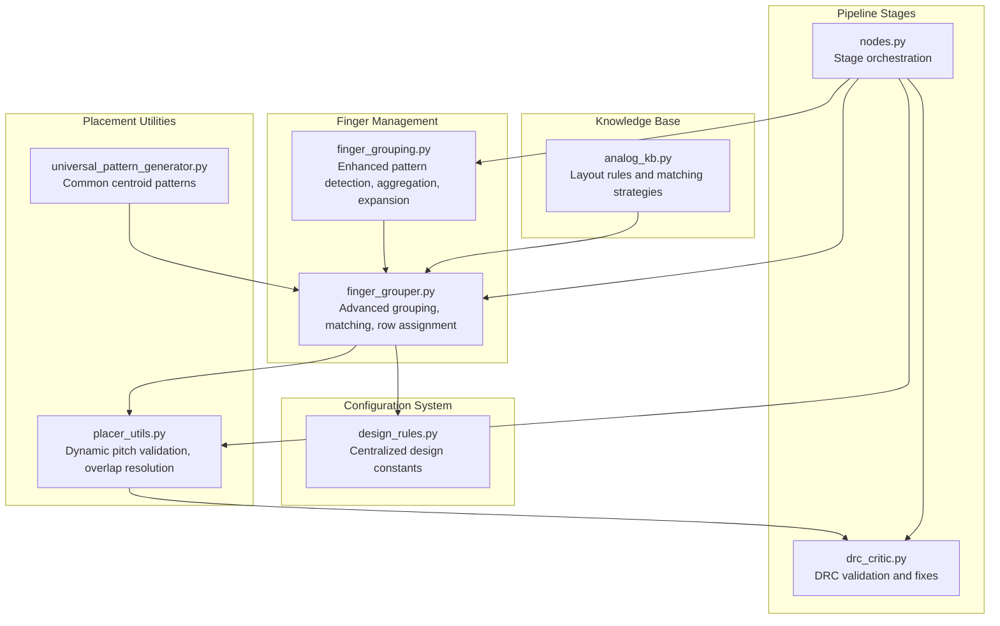
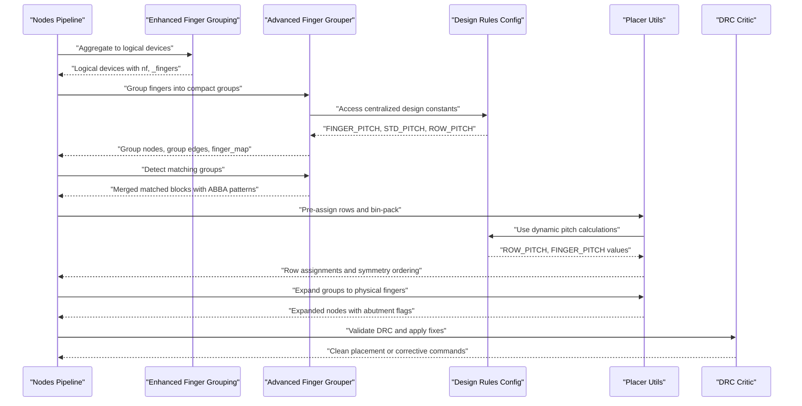
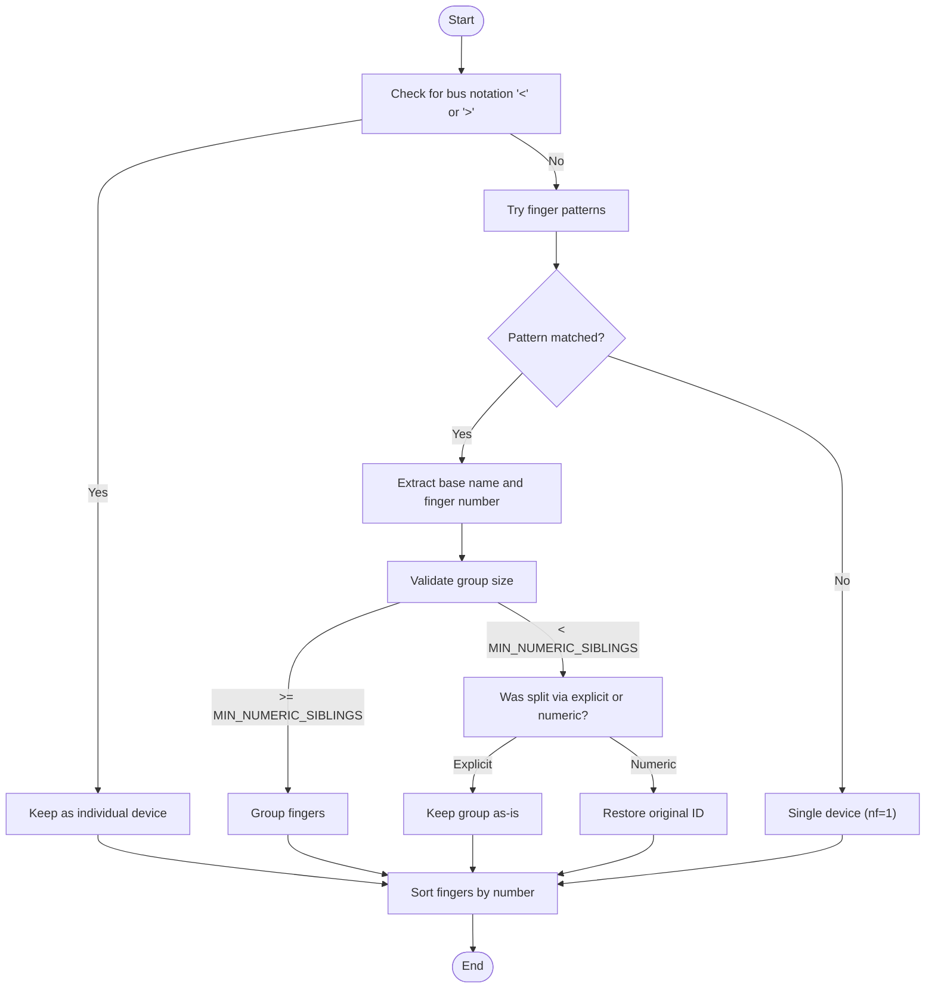
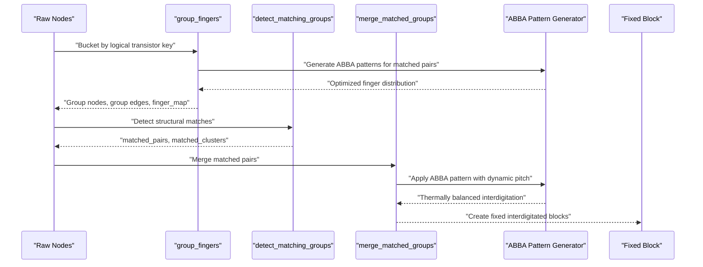
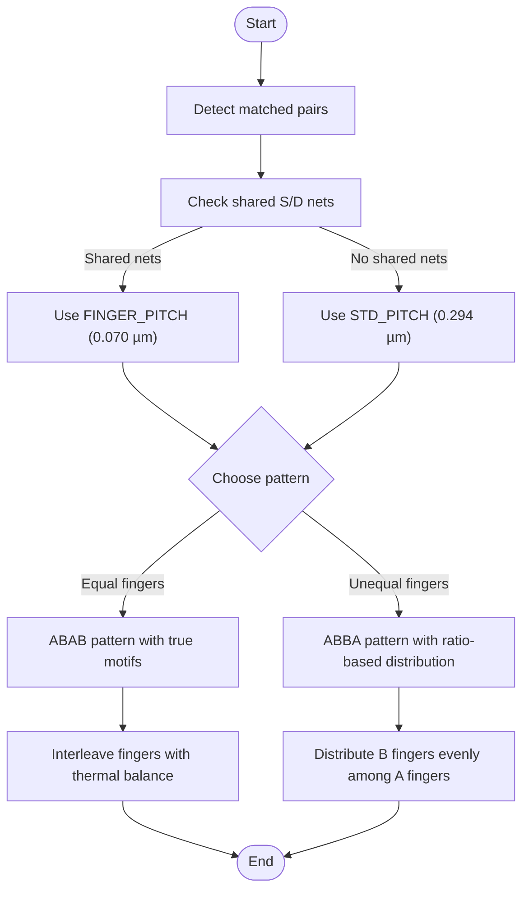
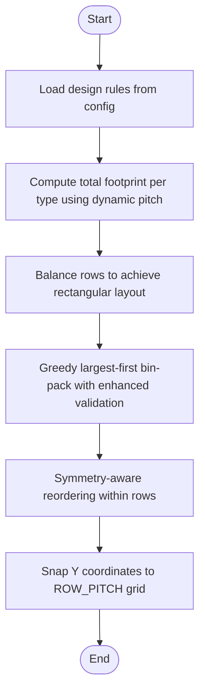
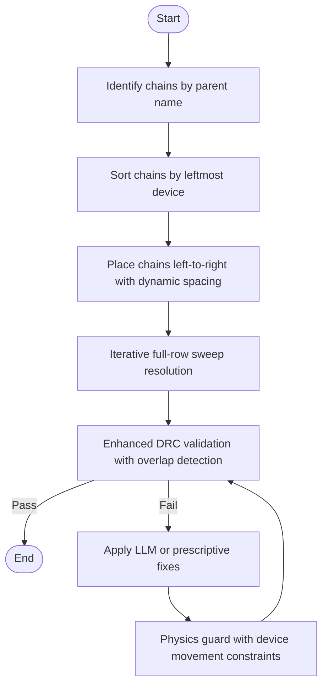
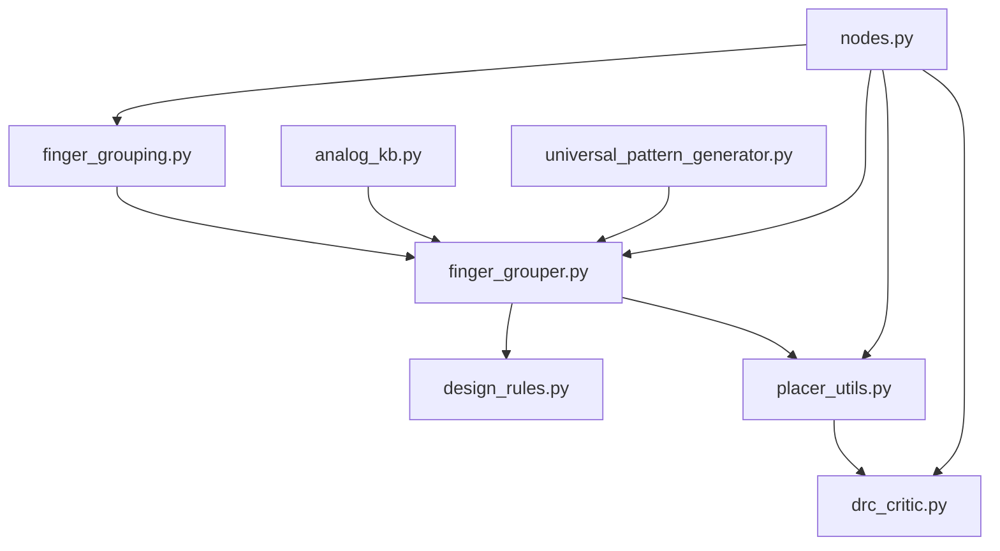

# Device Grouping and Multi-Finger Strategies

<cite>
**Referenced Files in This Document**
- [finger_grouping.py](file://ai_agent/ai_chat_bot/finger_grouping.py)
- [finger_grouper.py](file://ai_agent/ai_initial_placement/finger_grouper.py)
- [analog_kb.py](file://ai_agent/ai_chat_bot/analog_kb.py)
- [placer_utils.py](file://ai_agent/ai_initial_placement/placer_utils.py)
- [nodes.py](file://ai_agent/ai_chat_bot/nodes.py)
- [drc_critic.py](file://ai_agent/ai_chat_bot/agents/drc_critic.py)
- [universal_pattern_generator.py](file://ai_agent/matching/universal_pattern_generator.py)
- [design_rules.py](file://config/design_rules.py)
- [Current_Mirror_CM.json](file://examples/current_mirror/Current_Mirror_CM.json)
</cite>

## Update Summary
**Changes Made**
- Enhanced finger grouping logic with sophisticated ABBA pattern generation for interdigitated matching
- Improved row snapping with dynamic pitch support from centralized design rules
- Implemented advanced overlap resolution mechanisms with iterative full-row sweeps
- Centralized design constants system for consistent spacing and row management
- Updated mathematical formulations to reflect dynamic pitch calculations

## Table of Contents
1. [Introduction](#introduction)
2. [Project Structure](#project-structure)
3. [Core Components](#core-components)
4. [Architecture Overview](#architecture-overview)
5. [Detailed Component Analysis](#detailed-component-analysis)
6. [Dependency Analysis](#dependency-analysis)
7. [Performance Considerations](#performance-considerations)
8. [Troubleshooting Guide](#troubleshooting-guide)
9. [Conclusion](#conclusion)

## Introduction
This document explains the device grouping and multi-finger strategies used in the placement system. It covers how PMOS/NMOS devices are grouped based on electrical parameters such as number of fingers (nf), multiplier (m), and channel length (l). It documents the finger optimization algorithms that maximize device efficiency while maintaining DRC compliance, details grouping criteria for different device types, and describes the impact on overall layout density. The document also includes examples of optimal grouping configurations and the mathematical formulations used for finger allocation, as well as the relationship between device grouping and subsequent placement optimization.

**Updated** Enhanced with centralized design rules configuration, sophisticated ABBA pattern generation, and advanced overlap resolution mechanisms.

## Project Structure
The device grouping and multi-finger strategies are implemented across several modules with centralized configuration management:
- Finger pattern detection and aggregation for both logical and physical finger devices
- Grouping of multi-finger transistors into compact transistor-level representations
- Interdigitated matching strategies for differential pairs and current mirrors with ABBA pattern optimization
- Row assignment and bin-packing for layout density optimization with dynamic pitch support
- Post-placement healing and DRC validation with iterative overlap resolution

**Diagram sources**
- [finger_grouping.py:116-191](file://ai_agent/ai_chat_bot/finger_grouping.py#L116-L191)
- [finger_grouper.py:116-232](file://ai_agent/ai_initial_placement/finger_grouper.py#L116-L232)
- [design_rules.py:11-31](file://config/design_rules.py#L11-L31)
- [analog_kb.py:11-333](file://ai_agent/ai_chat_bot/analog_kb.py#L11-L333)
- [placer_utils.py:1560-1670](file://ai_agent/ai_initial_placement/placer_utils.py#L1560-L1670)
- [universal_pattern_generator.py:51-95](file://ai_agent/matching/universal_pattern_generator.py#L51-L95)
- [nodes.py:615-634](file://ai_agent/ai_chat_bot/nodes.py#L615-L634)
- [drc_critic.py:24-566](file://ai_agent/ai_chat_bot/agents/drc_critic.py#L24-L566)

**Section sources**
- [finger_grouping.py:1-512](file://ai_agent/ai_chat_bot/finger_grouping.py#L1-L512)
- [finger_grouper.py:1-1706](file://ai_agent/ai_initial_placement/finger_grouper.py#L1-L1706)
- [design_rules.py:1-31](file://config/design_rules.py#L1-L31)
- [analog_kb.py:11-333](file://ai_agent/ai_chat_bot/analog_kb.py#L11-L333)
- [placer_utils.py:1560-1670](file://ai_agent/ai_initial_placement/placer_utils.py#L1560-L1670)
- [nodes.py:615-634](file://ai_agent/ai_chat_bot/nodes.py#L615-L634)
- [drc_critic.py:24-566](file://ai_agent/ai_chat_bot/agents/drc_critic.py#L24-L566)

## Core Components
- **Enhanced Finger pattern detection and grouping**: Detects multi-finger devices using various naming conventions and aggregates them into logical devices while preserving bus notation and avoiding false splits. Features improved validation logic for numeric suffix groups and explicit single finger handling.
- **Advanced Grouping and matching**: Groups multi-finger transistors into compact representations for the LLM, detects structural matches (differential pairs, current mirrors, cross-coupled pairs), and merges matched pairs into fixed interdigitated blocks using sophisticated ABBA pattern generation.
- **Sophisticated Interdigitation strategies**: Implements enhanced ABBA interdigitation patterns with dynamic pitch calculation, distributing fingers evenly for maximum thermal symmetry and maintaining proper abutment spacing based on shared terminals.
- **Dynamic Row assignment and bin-packing**: Determines PMOS/NMOS row assignments using centralized design rules and performs deterministic bin-packing with dynamic pitch support to balance layout density and maintain rectangular aspect ratios.
- **Advanced Post-placement healing and validation**: Resolves inter-group overlaps using iterative full-row sweep algorithms, validates DRC compliance with sophisticated overlap detection, and applies prescriptive fixes with physics guard enforcement.

**Updated** Enhanced with centralized design rules integration, sophisticated ABBA pattern generation, and iterative overlap resolution mechanisms.

**Section sources**
- [finger_grouping.py:116-191](file://ai_agent/ai_chat_bot/finger_grouping.py#L116-L191)
- [finger_grouper.py:116-232](file://ai_agent/ai_initial_placement/finger_grouper.py#L116-L232)
- [finger_grouper.py:826-984](file://ai_agent/ai_initial_placement/finger_grouper.py#L826-L984)
- [finger_grouper.py:645-740](file://ai_agent/ai_initial_placement/finger_grouper.py#L645-L740)
- [placer_utils.py:1560-1670](file://ai_agent/ai_initial_placement/placer_utils.py#L1560-L1670)
- [drc_critic.py:24-566](file://ai_agent/ai_chat_bot/agents/drc_critic.py#L24-L566)

## Architecture Overview
The device grouping and multi-finger strategies operate in an enhanced staged pipeline with centralized configuration management:
1. **Enhanced Finger pattern detection and aggregation** convert physical finger devices into logical devices using improved validation logic.
2. **Advanced Grouping** transforms individual finger-level nodes into compact transistor-level groups for the LLM with sophisticated ABBA pattern generation.
3. **Intelligent Matching** detects structural relationships and merges matched pairs into fixed interdigitated blocks with dynamic pitch calculation.
4. **Dynamic Row assignment and bin-packing** determine PMOS/NMOS row placement using centralized design rules and optimize layout density.
5. **Iterative Post-placement healing** resolves overlaps using full-row sweep algorithms and validates DRC compliance.

**Diagram sources**
- [nodes.py:615-634](file://ai_agent/ai_chat_bot/nodes.py#L615-L634)
- [finger_grouping.py:198-252](file://ai_agent/ai_chat_bot/finger_grouping.py#L198-L252)
- [finger_grouper.py:116-232](file://ai_agent/ai_initial_placement/finger_grouper.py#L116-L232)
- [finger_grouper.py:826-984](file://ai_agent/ai_initial_placement/finger_grouper.py#L826-L984)
- [design_rules.py:11-31](file://config/design_rules.py#L11-L31)
- [placer_utils.py:1560-1670](file://ai_agent/ai_initial_placement/placer_utils.py#L1560-L1670)
- [placer_utils.py:1358-1555](file://ai_agent/ai_initial_placement/placer_utils.py#L1358-L1555)
- [drc_critic.py:24-566](file://ai_agent/ai_chat_bot/agents/drc_critic.py#L24-L566)

## Detailed Component Analysis

### Enhanced Finger Pattern Detection and Aggregation
This component handles the detection and grouping of multi-finger devices with improved validation logic. It supports multiple naming conventions and ensures that bus notation is not grouped as fingers. It also validates numeric suffix groups to prevent false splits using enhanced logic.

Key behaviors:
- **Bus notation** (e.g., MM8<0>, MM8<21>) is never grouped - kept as individual devices.
- **Explicit finger suffixes** (_F1, _f1, F1) are always grouped.
- **Numeric suffixes** (_0, _1) are only grouped when >= MIN_NUMERIC_SIBLINGS share the same base name.
- **Dummy devices** are never grouped.
- **Enhanced validation** prevents false splits for single devices with numeric suffixes.

**Diagram sources**
- [finger_grouping.py:116-191](file://ai_agent/ai_chat_bot/finger_grouping.py#L116-L191)
- [finger_grouping.py:80-114](file://ai_agent/ai_chat_bot/finger_grouping.py#L80-L114)

**Section sources**
- [finger_grouping.py:116-191](file://ai_agent/ai_chat_bot/finger_grouping.py#L116-L191)
- [finger_grouping.py:80-114](file://ai_agent/ai_chat_bot/finger_grouping.py#L80-L114)

### Advanced Grouping and Matching for Compact Transistor-Level Representations
This component collapses multiple finger-level nodes into single transistor-level groups for the LLM and builds compact edges with enhanced ABBA pattern generation. It also detects structural matches and merges matched pairs into fixed interdigitated blocks using sophisticated pattern algorithms.

Key behaviors:
- **Bucket every finger node** under its logical transistor key with enhanced validation.
- **Counts true fingers** (nf per transistor instance) and multiplier copies with improved accuracy.
- **Builds representative group nodes** with electrical parameters and dynamic pitch calculations.
- **Detects structural matches** (differential pairs, current mirrors, cross-coupled pairs) with enhanced pattern recognition.
- **Merges matched pairs** into fixed blocks with sophisticated ABBA pattern generation for thermal symmetry.

**Updated** Enhanced with sophisticated ABBA pattern generation that distributes fingers evenly for maximum thermal symmetry.

**Diagram sources**
- [finger_grouper.py:116-232](file://ai_agent/ai_initial_placement/finger_grouper.py#L116-L232)
- [finger_grouper.py:256-305](file://ai_agent/ai_initial_placement/finger_grouper.py#L256-L305)
- [finger_grouper.py:826-984](file://ai_agent/ai_initial_placement/finger_grouper.py#L826-L984)
- [finger_grouper.py:645-740](file://ai_agent/ai_initial_placement/finger_grouper.py#L645-L740)

**Section sources**
- [finger_grouper.py:116-232](file://ai_agent/ai_initial_placement/finger_grouper.py#L116-L232)
- [finger_grouper.py:256-305](file://ai_agent/ai_initial_placement/finger_grouper.py#L256-L305)
- [finger_grouper.py:826-984](file://ai_agent/ai_initial_placement/finger_grouper.py#L826-L984)
- [finger_grouper.py:645-740](file://ai_agent/ai_initial_placement/finger_grouper.py#L645-L740)

### Sophisticated Interdigitation Strategies for Differential Pairs and Current Mirrors
Interdigitation reduces mismatches by interleaving fingers of matched devices with enhanced ABBA pattern generation. The system supports ABAB and ABBA patterns with sophisticated thermal symmetry optimization and dynamic pitch calculation based on shared terminals.

Key behaviors:
- **ABAB pattern**: Alternates fingers from each matched device with true ABBA motifs for equal-length devices.
- **ABBA pattern**: Distributes B fingers evenly among A fingers for maximum thermal symmetry using ratio-based proportional distribution.
- **Dynamic pitch calculation**: Uses FINGER_PITCH (0.070 µm) for abutted interdigitation or STD_PITCH (0.294 µm) for non-abutted spacing based on shared S/D nets.
- **Enhanced thermal symmetry**: Ensures proper heat dissipation balance between matched devices.

**Updated** Enhanced with sophisticated ABBA pattern generation that optimizes finger distribution for thermal symmetry and dynamic pitch calculation based on terminal connections.

**Diagram sources**
- [finger_grouper.py:645-740](file://ai_agent/ai_initial_placement/finger_grouper.py#L645-L740)
- [finger_grouper.py:892-914](file://ai_agent/ai_initial_placement/finger_grouper.py#L892-L914)
- [universal_pattern_generator.py:51-95](file://ai_agent/matching/universal_pattern_generator.py#L51-L95)

**Section sources**
- [finger_grouper.py:645-740](file://ai_agent/ai_initial_placement/finger_grouper.py#L645-L740)
- [finger_grouper.py:892-914](file://ai_agent/ai_initial_placement/finger_grouper.py#L892-L914)
- [universal_pattern_generator.py:51-95](file://ai_agent/matching/universal_pattern_generator.py#L51-L95)

### Dynamic Row Assignment and Bin-Packing for Layout Density Optimization
This component determines PMOS/NMOS row assignments using centralized design rules and performs deterministic bin-packing with dynamic pitch support to balance layout density and maintain rectangular aspect ratios. It enforces strict isolation of NMOS, PMOS, and passive devices.

Key behaviors:
- **Centralized design rules**: Uses FINGER_PITCH, STD_PITCH, and ROW_PITCH from design_rules.py for consistent spacing.
- **Computes total footprint** per type using dynamic pitch calculations and balances rows to achieve rectangular layout.
- **Uses greedy largest-first bin-pack** with enhanced validation to distribute groups across rows.
- **Enforces symmetry-aware reordering** within each row with improved thermal management.
- **Snaps Y coordinates** to standardized row grid spacing using ROW_PITCH from design rules.

**Updated** Enhanced with centralized design rules integration for consistent pitch calculations and improved row assignment algorithms.

**Diagram sources**
- [finger_grouper.py:1159-1334](file://ai_agent/ai_initial_placement/finger_grouper.py#L1159-L1334)
- [design_rules.py:11-31](file://config/design_rules.py#L11-L31)
- [placer_utils.py:1338-1356](file://ai_agent/ai_initial_placement/placer_utils.py#L1338-L1356)

**Section sources**
- [finger_grouper.py:1159-1334](file://ai_agent/ai_initial_placement/finger_grouper.py#L1159-L1334)
- [design_rules.py:11-31](file://config/design_rules.py#L11-L31)
- [placer_utils.py:1338-1356](file://ai_agent/ai_initial_placement/placer_utils.py#L1338-L1356)

### Advanced Post-Placement Healing and DRC Validation
After placement, the system resolves inter-group overlaps using iterative full-row sweep algorithms and validates DRC compliance with sophisticated overlap detection. It ensures no two devices in the same row overlap while preserving hierarchy abutment and applies prescriptive fixes when necessary.

Key behaviors:
- **Iterative full-row sweep**: Eliminates overlaps using iterative algorithms that converge for any pile-up configuration.
- **Chain identification**: Identifies chains by parent name and sorts chains by leftmost device for proper ordering.
- **Dynamic overlap resolution**: Places chains left-to-right with abutment spacing within chains and standard spacing between chains.
- **Enhanced DRC validation**: Validates DRC compliance with sophisticated overlap detection using sweep-line algorithms.
- **Physics guard enforcement**: Applies physics guard to resolve remaining overlaps with proper device movement constraints.

**Updated** Enhanced with iterative full-row sweep algorithms that replace single adjacent-pair passes and sophisticated overlap detection mechanisms.

**Diagram sources**
- [placer_utils.py:1560-1670](file://ai_agent/ai_initial_placement/placer_utils.py#L1560-L1670)
- [placer_utils.py:1558-1669](file://ai_agent/ai_initial_placement/placer_utils.py#L1558-L1669)
- [drc_critic.py:24-566](file://ai_agent/ai_chat_bot/agents/drc_critic.py#L24-L566)

**Section sources**
- [placer_utils.py:1560-1670](file://ai_agent/ai_initial_placement/placer_utils.py#L1560-L1670)
- [placer_utils.py:1558-1669](file://ai_agent/ai_initial_placement/placer_utils.py#L1558-L1669)
- [drc_critic.py:24-566](file://ai_agent/ai_chat_bot/agents/drc_critic.py#L24-L566)

### Enhanced Mathematical Formulations for Finger Allocation
The system uses sophisticated mathematical formulations to optimize finger allocation and layout density with centralized design rule support:

- **Total device width calculation**:
  - For logical devices: total_width = nf × finger_width
  - For physical devices: total_width = Σ(widths of individual fingers)
  - **Dynamic pitch support**: Uses FINGER_PITCH (0.070 µm) for abutted interdigitation or STD_PITCH (0.294 µm) for standard spacing
- **Enhanced abutment spacing**:
  - Within matched blocks: FINGER_PITCH = 0.070 µm (from design_rules.py)
  - Between groups: STD_PITCH = 0.294 µm (from design_rules.py)
  - **Dynamic calculation**: Based on shared S/D nets between matched devices
- **Centralized row assignment and bin-packing**:
  - Uses ROW_PITCH (0.668 µm) from design_rules.py for consistent row spacing
  - Greedy largest-first bin-pack minimizes the number of rows needed with enhanced validation
  - Balancing factor ensures rectangular layout by constraining the wider type's row limit
- **Height computation**:
  - Device height scales with nfin: height ≈ 0.55 + nfin × 0.05 µm
  - Ensures PMOS/NMOS separation by preventing overlap between rows using ROW_HEIGHT_UM

**Updated** Enhanced with centralized design rules integration for consistent spacing calculations and improved mathematical formulations.

**Section sources**
- [finger_grouper.py:189-199](file://ai_agent/ai_initial_placement/finger_grouper.py#L189-L199)
- [design_rules.py:11-31](file://config/design_rules.py#L11-L31)
- [placer_utils.py:1073-1334](file://ai_agent/ai_initial_placement/placer_utils.py#L1073-L1334)
- [placer_utils.py:1415-1425](file://ai_agent/ai_initial_placement/placer_utils.py#L1415-L1425)

### Examples of Optimal Grouping Configurations
Examples demonstrate how multi-finger transistors are represented and grouped with enhanced ABBA pattern optimization:

- **Current mirror configuration**:
  - Multiple fingers per device are grouped into logical devices with nf_per_device and multiplier using enhanced validation.
  - Interdigitated blocks are created for matched pairs with sophisticated ABBA pattern that ensures thermal symmetry.
- **Differential pair configuration**:
  - Differential pairs are placed symmetrically with ABBA interdigitation optimized for maximum thermal balance.
  - Tail current sources are positioned adjacent to the diff pair with proper abutment spacing.

**Updated** Enhanced with ABBA pattern generation that optimizes finger distribution for thermal symmetry and improved matching performance.

**Section sources**
- [Current_Mirror_CM.json:1-800](file://examples/current_mirror/Current_Mirror_CM.json#L1-L800)
- [finger_grouper.py:826-984](file://ai_agent/ai_initial_placement/finger_grouper.py#L826-L984)
- [finger_grouper.py:645-740](file://ai_agent/ai_initial_placement/finger_grouper.py#L645-L740)

## Dependency Analysis
The device grouping and multi-finger strategies depend on several modules with enhanced centralized configuration management:

- **Enhanced Finger grouping** depends on:
  - Pattern detection and aggregation for physical finger devices with improved validation logic
  - Centralized design rules for consistent spacing calculations
  - Knowledge base for layout rules and matching strategies
- **Advanced Grouping and matching** depends on:
  - Interdigitation generators with sophisticated ABBA pattern optimization
  - Dynamic row assignment utilities with centralized design rule integration
  - Enhanced overlap resolution utilities for iterative conflict resolution
- **Post-placement healing** depends on:
  - Iterative full-row sweep algorithms for comprehensive overlap resolution
  - DRC validation with sophisticated overlap detection mechanisms
  - Physics guard enforcement for proper device movement constraints

**Updated** Enhanced with centralized design rules integration and sophisticated overlap resolution mechanisms.

**Diagram sources**
- [finger_grouping.py:116-191](file://ai_agent/ai_chat_bot/finger_grouping.py#L116-L191)
- [finger_grouper.py:116-232](file://ai_agent/ai_initial_placement/finger_grouper.py#L116-L232)
- [design_rules.py:11-31](file://config/design_rules.py#L11-L31)
- [placer_utils.py:599-696](file://ai_agent/ai_initial_placement/placer_utils.py#L599-L696)
- [drc_critic.py:24-566](file://ai_agent/ai_chat_bot/agents/drc_critic.py#L24-L566)
- [analog_kb.py:11-333](file://ai_agent/ai_chat_bot/analog_kb.py#L11-L333)
- [universal_pattern_generator.py:51-95](file://ai_agent/matching/universal_pattern_generator.py#L51-L95)
- [nodes.py:615-634](file://ai_agent/ai_chat_bot/nodes.py#L615-L634)

**Section sources**
- [finger_grouping.py:116-191](file://ai_agent/ai_chat_bot/finger_grouping.py#L116-L191)
- [finger_grouper.py:116-232](file://ai_agent/ai_initial_placement/finger_grouper.py#L116-L232)
- [design_rules.py:11-31](file://config/design_rules.py#L11-L31)
- [placer_utils.py:599-696](file://ai_agent/ai_initial_placement/placer_utils.py#L599-L696)
- [drc_critic.py:24-566](file://ai_agent/ai_chat_bot/agents/drc_critic.py#L24-L566)
- [analog_kb.py:11-333](file://ai_agent/ai_chat_bot/analog_kb.py#L11-L333)
- [universal_pattern_generator.py:51-95](file://ai_agent/matching/universal_pattern_generator.py#L51-L95)
- [nodes.py:615-634](file://ai_agent/ai_chat_bot/nodes.py#L615-L634)

## Performance Considerations
- **Token reduction**: Grouping multi-finger devices into compact representations reduces LLM token usage by orders of magnitude, preventing truncation and enabling better placement decisions.
- **Deterministic bin-packing**: Enhanced greedy largest-first bin-pack minimizes row count and improves layout density while maintaining rectangular aspect ratios with improved validation.
- **Advanced abutment enforcement**: Sophisticated abutment spacing within matched blocks and chains ensures minimal layout footprint and optimal matching with dynamic pitch calculations.
- **Iterative overlap resolution**: Full-row sweep algorithms eliminate overlaps that single-pass methods miss, ensuring layout correctness and compliance.
- **Centralized configuration**: Design rules integration ensures consistent spacing calculations across all placement stages, reducing errors and improving reliability.

**Updated** Enhanced with iterative overlap resolution algorithms and centralized design rule management for improved performance and reliability.

## Troubleshooting Guide
Common issues and enhanced resolutions:
- **Missing or extra devices after expansion**: Use enhanced finger integrity validation to identify missing or extra devices and ensure device conservation with improved validation logic.
- **Overlaps after placement**: Apply iterative full-row sweep algorithms to enforce abutment spacing and resolve complex overlap scenarios that single-pass methods miss.
- **DRC violations**: Use enhanced DRC critic with sophisticated overlap detection to identify violations and apply LLM-generated or prescriptive fixes, followed by physics guard to resolve remaining overlaps.
- **Inconsistent spacing**: Verify centralized design rule configuration and ensure proper FINGER_PITCH and STD_PITCH values are being used for dynamic calculations.
- **Thermal imbalance**: Check ABBA pattern generation for proper finger distribution and ensure thermal symmetry is maintained in matched pairs.

**Updated** Enhanced troubleshooting procedures for iterative overlap resolution and centralized design rule validation.

**Section sources**
- [finger_grouping.py:462-512](file://ai_agent/ai_chat_bot/finger_grouping.py#L462-L512)
- [placer_utils.py:1560-1670](file://ai_agent/ai_initial_placement/placer_utils.py#L1560-L1670)
- [drc_critic.py:24-566](file://ai_agent/ai_chat_bot/agents/drc_critic.py#L24-L566)

## Conclusion
The enhanced device grouping and multi-finger strategies in the placement system provide a robust framework for managing PMOS/NMOS devices with multiple fingers using centralized configuration management. By aggregating physical finger devices into logical representations with improved validation logic, detecting structural matches with sophisticated ABBA pattern generation, and enforcing interdigitation patterns optimized for thermal symmetry, the system maximizes device efficiency while maintaining DRC compliance. The dynamic row assignment and bin-packing algorithms with centralized design rules optimize layout density, and the advanced post-placement healing with iterative overlap resolution and validation steps ensure correctness. Together, these components enable high-quality analog layout automation with strong matching, density characteristics, and reliable performance through centralized configuration management.