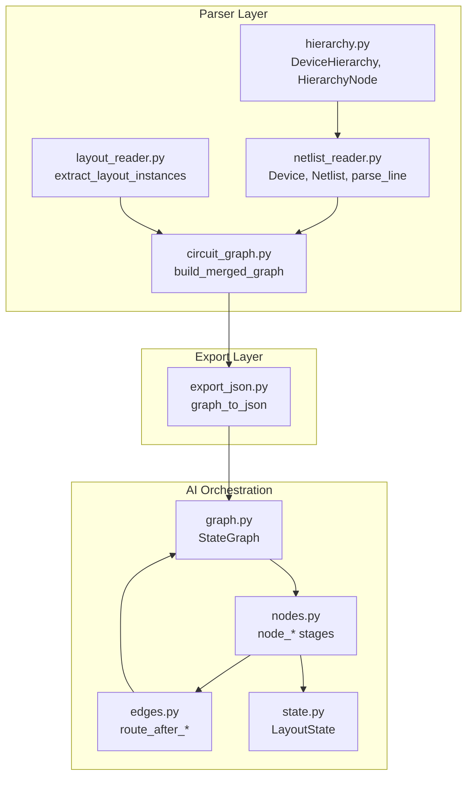
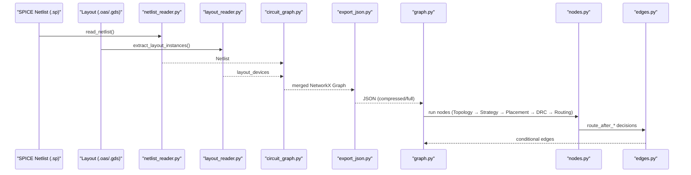
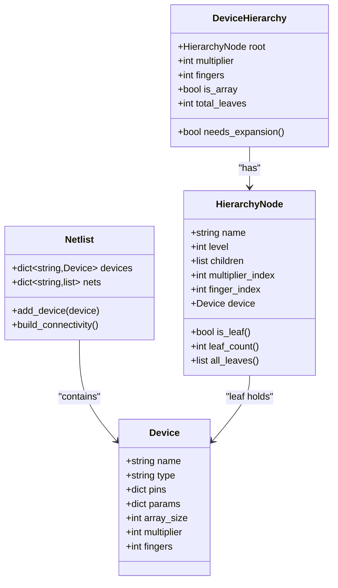
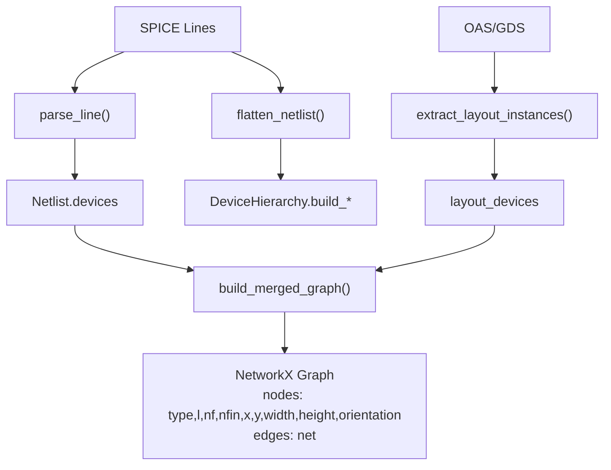
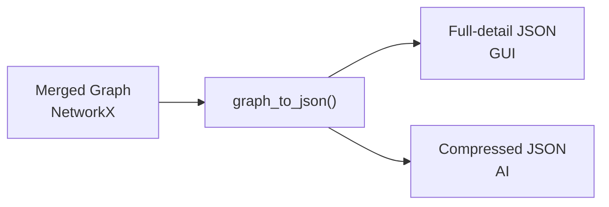
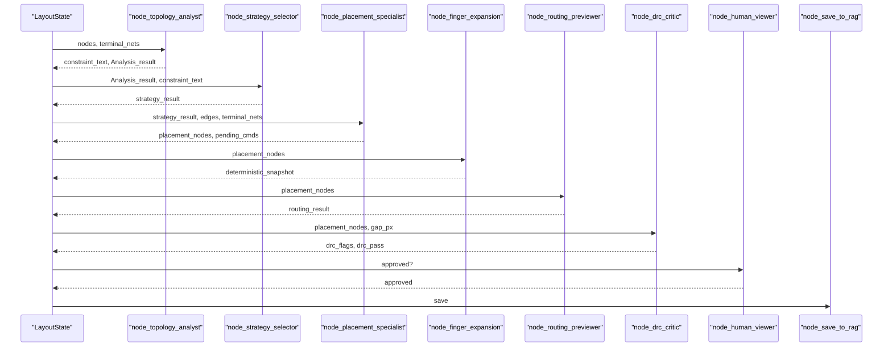
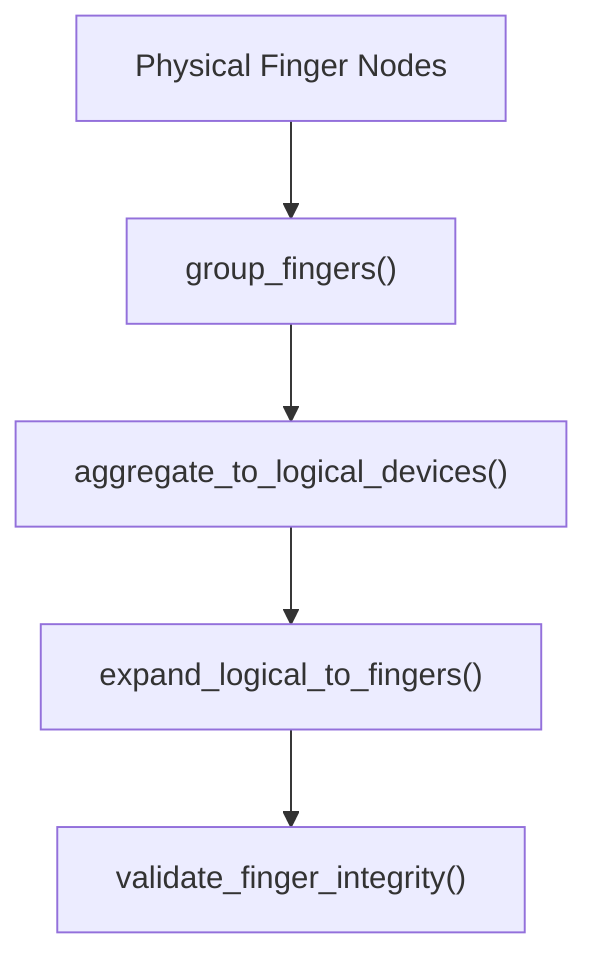
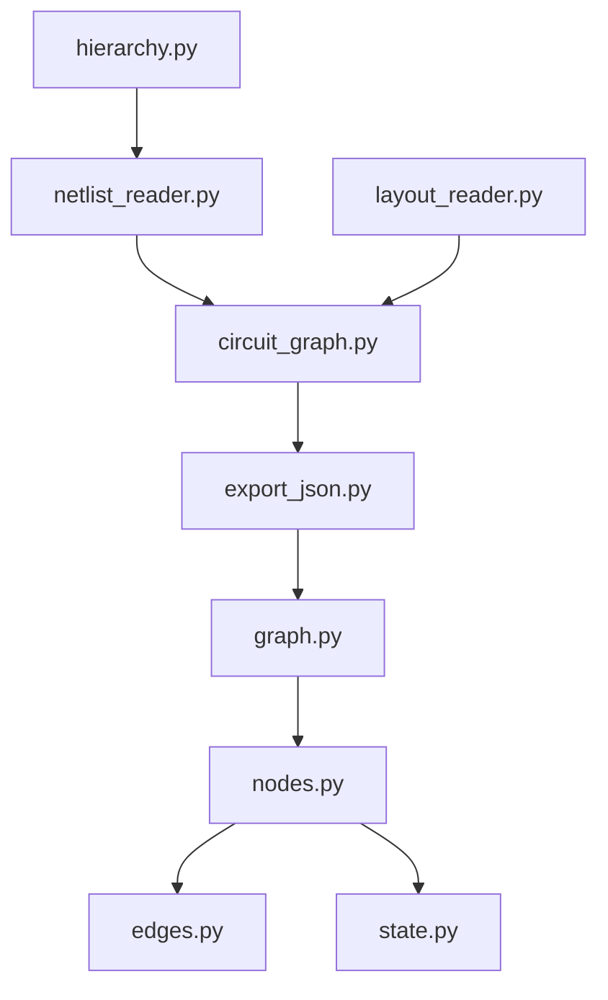

# Graph Format Handling and Data Transformation

<cite>
**Referenced Files in This Document**
- [graph.py](file://ai_agent/ai_chat_bot/graph.py)
- [nodes.py](file://ai_agent/ai_chat_bot/nodes.py)
- [edges.py](file://ai_agent/ai_chat_bot/edges.py)
- [state.py](file://ai_agent/ai_chat_bot/state.py)
- [export_json.py](file://export/export_json.py)
- [circuit_graph.py](file://parser/circuit_graph.py)
- [netlist_reader.py](file://parser/netlist_reader.py)
- [layout_reader.py](file://parser/layout_reader.py)
- [hierarchy.py](file://parser/hierarchy.py)
- [finger_grouping.py](file://ai_agent/ai_chat_bot/finger_grouping.py)
- [Miller_OTA_graph_compressed.json](file://examples/Miller_OTA/Miller_OTA_graph_compressed.json)
- [Current_Mirror_CM_graph_compressed.json](file://examples/current_mirror/Current_Mirror_CM_graph_compressed.json)
- [Layout_RTL.json](file://examples/Layout_RTL.json)
- [run_parser_example.py](file://parser/run_parser_example.py)
- [JSON_OPTIMIZATION_SUMMARY.md](file://docs/JSON_OPTIMIZATION_SUMMARY.md)
</cite>

## Table of Contents
1. [Introduction](#introduction)
2. [Project Structure](#project-structure)
3. [Core Components](#core-components)
4. [Architecture Overview](#architecture-overview)
5. [Detailed Component Analysis](#detailed-component-analysis)
6. [Dependency Analysis](#dependency-analysis)
7. [Performance Considerations](#performance-considerations)
8. [Troubleshooting Guide](#troubleshooting-guide)
9. [Conclusion](#conclusion)

## Introduction
This document explains the graph format handling system that converts between compressed and full graph representations for analog layout automation. It covers:
- How SPICE netlists and layout geometry are parsed and merged into a NetworkX graph
- How the merged graph is exported to JSON for AI prompts (compressed) and GUI display (full detail)
- Data structures for nodes, edges, and electrical properties
- Hierarchical block information and device inventory management
- Examples of format transformations and preservation of critical layout information

## Project Structure
The system spans parsing, graph construction, export, and AI orchestration:
- Parser layer: netlist parsing, layout extraction, hierarchy handling, and merged graph building
- Export layer: JSON serialization for AI and GUI consumption
- AI orchestration: LangGraph pipeline that consumes compressed JSON and produces placement commands

**Diagram sources**
- [netlist_reader.py:13-761](file://parser/netlist_reader.py#L13-L761)
- [layout_reader.py:153-441](file://parser/layout_reader.py#L153-L441)
- [circuit_graph.py:142-190](file://parser/circuit_graph.py#L142-L190)
- [export_json.py:4-57](file://export/export_json.py#L4-L57)
- [graph.py:1-52](file://ai_agent/ai_chat_bot/graph.py#L1-L52)
- [nodes.py:325-634](file://ai_agent/ai_chat_bot/nodes.py#L325-L634)
- [edges.py:6-24](file://ai_agent/ai_chat_bot/edges.py#L6-L24)
- [state.py:3-37](file://ai_agent/ai_chat_bot/state.py#L3-L37)

**Section sources**
- [run_parser_example.py:13-61](file://parser/run_parser_example.py#L13-L61)
- [JSON_OPTIMIZATION_SUMMARY.md:275-312](file://docs/JSON_OPTIMIZATION_SUMMARY.md#L275-L312)

## Core Components
- Data structures
  - Device: device-level metadata (type, pins, parameters)
  - Netlist: collection of devices and connectivity mapping
  - HierarchyNode and DeviceHierarchy: hierarchical device expansion (multipliers, fingers, arrays)
  - Layout device entries: geometry and orientation extracted from layout files
  - Merged graph: NetworkX graph with electrical and geometric attributes
- Graph formats
  - Full-detail JSON: GUI-friendly with per-finger geometry and verbose edges
  - Compressed JSON: AI-friendly with parent devices, net-centric views, and device type defaults

**Section sources**
- [netlist_reader.py:13-761](file://parser/netlist_reader.py#L13-L761)
- [hierarchy.py:133-475](file://parser/hierarchy.py#L133-L475)
- [layout_reader.py:153-441](file://parser/layout_reader.py#L153-L441)
- [circuit_graph.py:142-190](file://parser/circuit_graph.py#L142-L190)
- [export_json.py:4-57](file://export/export_json.py#L4-L57)
- [Miller_OTA_graph_compressed.json:1-186](file://examples/Miller_OTA/Miller_OTA_graph_compressed.json#L1-L186)
- [Current_Mirror_CM_graph_compressed.json:1-126](file://examples/current_mirror/Current_Mirror_CM_graph_compressed.json#L1-L126)
- [Layout_RTL.json:1-152](file://examples/Layout_RTL.json#L1-L152)

## Architecture Overview
The pipeline transforms SPICE and layout into a merged graph, exports it to JSON, and feeds it to an AI orchestration graph. The AI stages consume compressed JSON and produce placement commands, later expanded to physical finger positions.

**Diagram sources**
- [run_parser_example.py:13-61](file://parser/run_parser_example.py#L13-L61)
- [graph.py:1-52](file://ai_agent/ai_chat_bot/graph.py#L1-L52)
- [nodes.py:325-634](file://ai_agent/ai_chat_bot/nodes.py#L325-L634)
- [edges.py:6-24](file://ai_agent/ai_chat_bot/edges.py#L6-L24)
- [export_json.py:4-57](file://export/export_json.py#L4-L57)

## Detailed Component Analysis

### Data Structures for Nodes, Edges, and Electrical Properties
- Node attributes in merged graph:
  - type: device type (nmos, pmos, res, cap)
  - electrical: l, nf, nfin
  - geometry: x, y, width, height, orientation
- Edge attributes:
  - net: connecting net name
- Device inventory:
  - Netlist.devices: keyed by device name
  - Netlist.nets: net-to-(device,pin) mapping
- Hierarchical expansion:
  - DeviceHierarchy and HierarchyNode capture m, nf, array expansions
  - Effective counts and leaf enumeration support inventory checks

**Diagram sources**
- [netlist_reader.py:13-761](file://parser/netlist_reader.py#L13-L761)
- [hierarchy.py:133-475](file://parser/hierarchy.py#L133-L475)

**Section sources**
- [circuit_graph.py:18-32](file://parser/circuit_graph.py#L18-L32)
- [circuit_graph.py:152-169](file://parser/circuit_graph.py#L152-L169)
- [netlist_reader.py:51-72](file://parser/netlist_reader.py#L51-L72)

### Graph Construction and Merging
- Netlist parsing builds Device objects and connectivity
- Layout extraction yields geometry and orientation per device instance
- Merged graph adds geometry to device nodes and connects devices by shared nets

**Diagram sources**
- [netlist_reader.py:726-761](file://parser/netlist_reader.py#L726-L761)
- [layout_reader.py:357-441](file://parser/layout_reader.py#L357-L441)
- [circuit_graph.py:142-190](file://parser/circuit_graph.py#L142-L190)

**Section sources**
- [run_parser_example.py:13-61](file://parser/run_parser_example.py#L13-L61)
- [circuit_graph.py:142-190](file://parser/circuit_graph.py#L142-L190)

### JSON Export Formats: Full Detail vs Compressed
- Full-detail JSON (GUI):
  - Per-device geometry and electrical parameters
  - Verbose edges with net names
  - Example: [Layout_RTL.json:1-152](file://examples/Layout_RTL.json#L1-L152)
- Compressed JSON (AI prompts):
  - Parent devices only, with device type defaults
  - Net-centric connectivity
  - Example: [Miller_OTA_graph_compressed.json:1-186](file://examples/Miller_OTA/Miller_OTA_graph_compressed.json#L1-L186), [Current_Mirror_CM_graph_compressed.json:1-126](file://examples/current_mirror/Current_Mirror_CM_graph_compressed.json#L1-L126)
- Export routine:
  - Converts merged NetworkX graph to JSON for AI consumption

**Diagram sources**
- [export_json.py:4-57](file://export/export_json.py#L4-L57)
- [Miller_OTA_graph_compressed.json:1-186](file://examples/Miller_OTA/Miller_OTA_graph_compressed.json#L1-L186)
- [Current_Mirror_CM_graph_compressed.json:1-126](file://examples/current_mirror/Current_Mirror_CM_graph_compressed.json#L1-L126)
- [Layout_RTL.json:1-152](file://examples/Layout_RTL.json#L1-L152)

**Section sources**
- [export_json.py:4-57](file://export/export_json.py#L4-L57)

### AI Orchestration and State Management
- LangGraph defines a linear pipeline with conditional edges for retries and human approval
- State carries nodes, edges, terminal nets, placement results, DRC flags, and pending commands
- Nodes implement topology analysis, strategy selection, placement, DRC critique, and routing preview

**Diagram sources**
- [graph.py:1-52](file://ai_agent/ai_chat_bot/graph.py#L1-L52)
- [nodes.py:325-800](file://ai_agent/ai_chat_bot/nodes.py#L325-L800)
- [edges.py:6-24](file://ai_agent/ai_chat_bot/edges.py#L6-L24)
- [state.py:3-37](file://ai_agent/ai_chat_bot/state.py#L3-L37)

**Section sources**
- [graph.py:1-52](file://ai_agent/ai_chat_bot/graph.py#L1-L52)
- [nodes.py:325-800](file://ai_agent/ai_chat_bot/nodes.py#L325-L800)
- [edges.py:6-24](file://ai_agent/ai_chat_bot/edges.py#L6-L24)
- [state.py:3-37](file://ai_agent/ai_chat_bot/state.py#L3-L37)

### Hierarchical Block Information and Device Inventory Management
- Hierarchical expansion supports:
  - Multipliers (m)
  - Fingers (nf)
  - Arrays (array_count, array_index)
- Device inventory checks:
  - Logical device aggregation reduces multi-finger devices to a single logical node
  - Expansion restores per-finger positions deterministically
  - Integrity validation ensures no loss or duplication of physical devices

**Diagram sources**
- [hierarchy.py:219-475](file://parser/hierarchy.py#L219-L475)
- [finger_grouping.py:198-354](file://ai_agent/ai_chat_bot/finger_grouping.py#L198-L354)
- [finger_grouping.py:462-512](file://ai_agent/ai_chat_bot/finger_grouping.py#L462-L512)

**Section sources**
- [hierarchy.py:219-475](file://parser/hierarchy.py#L219-L475)
- [finger_grouping.py:198-354](file://ai_agent/ai_chat_bot/finger_grouping.py#L198-L354)
- [finger_grouping.py:462-512](file://ai_agent/ai_chat_bot/finger_grouping.py#L462-L512)

### Examples of Format Transformations
- From SPICE and layout to merged graph:
  - See the walkthrough in [run_parser_example.py:13-61](file://parser/run_parser_example.py#L13-L61)
- From merged graph to JSON:
  - Use [export_json.py:4-57](file://export/export_json.py#L4-L57) to serialize the graph
- From compressed JSON to GUI:
  - Load [Miller_OTA_graph_compressed.json:1-186](file://examples/Miller_OTA/Miller_OTA_graph_compressed.json#L1-L186) or [Current_Mirror_CM_graph_compressed.json:1-126](file://examples/current_mirror/Current_Mirror_CM_graph_compressed.json#L1-L126) into the GUI
- From full-detail JSON to GUI:
  - Use [Layout_RTL.json:1-152](file://examples/Layout_RTL.json#L1-L152) for GUI display

**Section sources**
- [run_parser_example.py:13-61](file://parser/run_parser_example.py#L13-L61)
- [export_json.py:4-57](file://export/export_json.py#L4-L57)
- [Miller_OTA_graph_compressed.json:1-186](file://examples/Miller_OTA/Miller_OTA_graph_compressed.json#L1-L186)
- [Current_Mirror_CM_graph_compressed.json:1-126](file://examples/current_mirror/Current_Mirror_CM_graph_compressed.json#L1-L126)
- [Layout_RTL.json:1-152](file://examples/Layout_RTL.json#L1-L152)

## Dependency Analysis
Key dependencies and relationships:
- Parser depends on hierarchy for expansion and netlist/layout readers for geometry
- Merged graph depends on both netlist and layout mappings
- Export depends on merged graph structure
- AI orchestration depends on exported JSON and state transitions

**Diagram sources**
- [netlist_reader.py:1-800](file://parser/netlist_reader.py#L1-L800)
- [layout_reader.py:1-442](file://parser/layout_reader.py#L1-L442)
- [circuit_graph.py:1-191](file://parser/circuit_graph.py#L1-L191)
- [export_json.py:1-58](file://export/export_json.py#L1-L58)
- [graph.py:1-52](file://ai_agent/ai_chat_bot/graph.py#L1-L52)
- [nodes.py:1-1016](file://ai_agent/ai_chat_bot/nodes.py#L1-L1016)
- [edges.py:1-24](file://ai_agent/ai_chat_bot/edges.py#L1-L24)
- [state.py:1-37](file://ai_agent/ai_chat_bot/state.py#L1-L37)

**Section sources**
- [netlist_reader.py:1-800](file://parser/netlist_reader.py#L1-L800)
- [layout_reader.py:1-442](file://parser/layout_reader.py#L1-L442)
- [circuit_graph.py:1-191](file://parser/circuit_graph.py#L1-L191)
- [export_json.py:1-58](file://export/export_json.py#L1-L58)
- [graph.py:1-52](file://ai_agent/ai_chat_bot/graph.py#L1-L52)
- [nodes.py:1-1016](file://ai_agent/ai_chat_bot/nodes.py#L1-L1016)
- [edges.py:1-24](file://ai_agent/ai_chat_bot/edges.py#L1-L24)
- [state.py:1-37](file://ai_agent/ai_chat_bot/state.py#L1-L37)

## Performance Considerations
- Compressed JSON reduces token usage for LLM prompts by ~95%, fitting within context limits
- Hierarchical expansion avoids redundant per-finger processing during AI reasoning
- Deterministic finger expansion preserves layout integrity without recomputation

[No sources needed since this section provides general guidance]

## Troubleshooting Guide
- Missing or extra devices after expansion:
  - Use integrity validation to detect discrepancies
  - Ensure original and processed sets are compared and logged
- DRC violations:
  - Review structured flags and apply LLM-prescriptive fixes
  - Re-run DRC after applying corrections
- Chat history trimming:
  - Excessive chat history can cause memory pressure; ensure it is trimmed appropriately

**Section sources**
- [finger_grouping.py:462-512](file://ai_agent/ai_chat_bot/finger_grouping.py#L462-L512)
- [nodes.py:637-800](file://ai_agent/ai_chat_bot/nodes.py#L637-L800)
- [nodes.py:187-208](file://ai_agent/ai_chat_bot/nodes.py#L187-L208)

## Conclusion
The graph format handling system integrates SPICE parsing, layout geometry extraction, and hierarchical device modeling into a unified merged graph. It exports both full-detail and compressed JSON formats tailored for GUI display and AI prompts, respectively. The LangGraph pipeline orchestrates topology analysis, strategy selection, placement, DRC critique, and routing preview, ensuring device inventory integrity and preserving critical layout information throughout transformations.