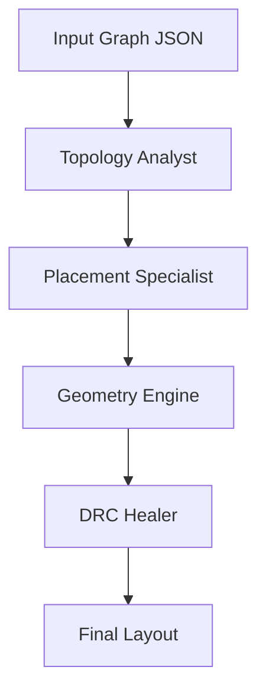
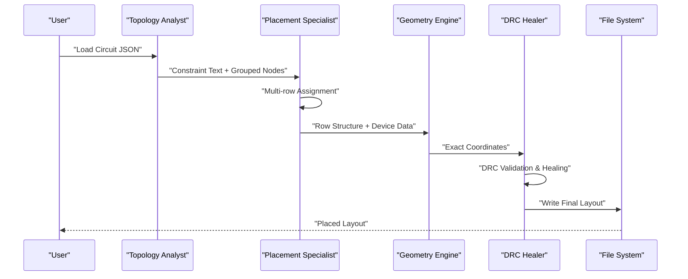
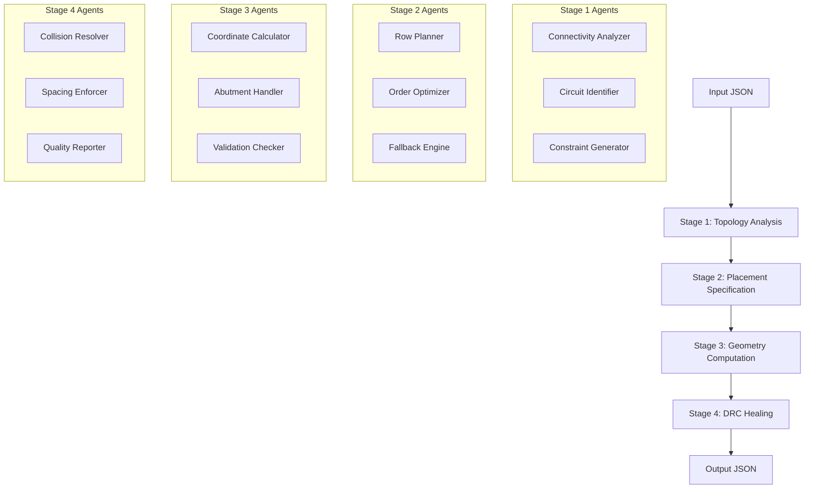
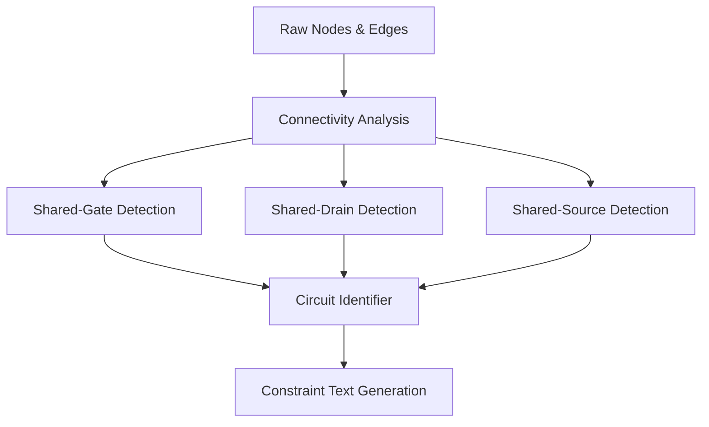
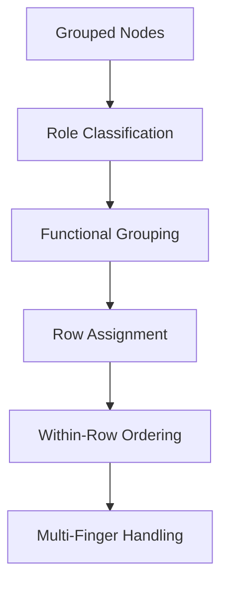
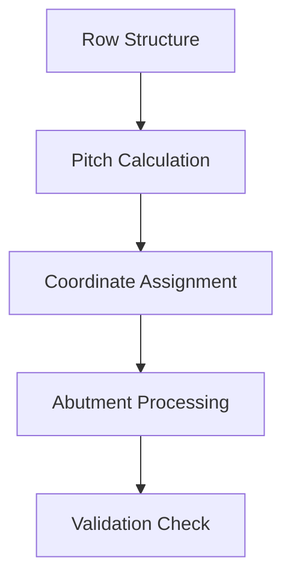
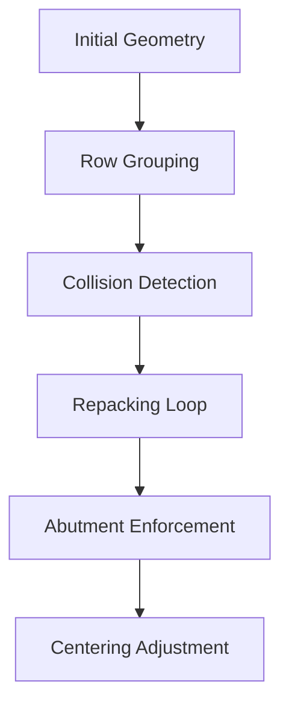
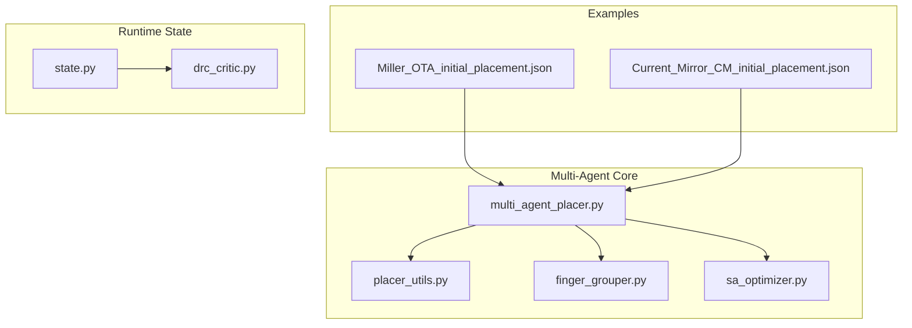

# LLM-Based Placement Algorithm

<cite>
**Referenced Files in This Document**
- [multi_agent_placer.py](file://ai_agent/ai_initial_placement/multi_agent_placer.py)
- [placer_utils.py](file://ai_agent/ai_initial_placement/placer_utils.py)
- [finger_grouper.py](file://ai_agent/ai_initial_placement/finger_grouper.py)
- [README.md](file://ai_agent/ai_initial_placement/README.md)
- [Miller_OTA_initial_placement.json](file://examples/Miller_OTA/Miller_OTA_initial_placement.json)
- [Current_Mirror_CM_initial_placement.json](file://examples/current_mirror/Current_Mirror_CM_initial_placement.json)
- [state.py](file://ai_agent/ai_chat_bot/state.py)
- [drc_critic.py](file://ai_agent/ai_chat_bot/agents/drc_critic.py)
- [README.md](file://README.md)
</cite>

## Update Summary
**Changes Made**
- Completely revised the system architecture to reflect the new multi-agent pipeline
- Removed references to legacy single-model placement files (alibaba_placer.py, claude_vertex_placer.py, gemini_placer.py, vertex_gemini_placer.py)
- Updated all architectural diagrams to show the new 4-stage pipeline
- Revised core components section to reflect the new deterministic multi-agent approach
- Updated examples and troubleshooting sections to match the current implementation

## Table of Contents
1. [Introduction](#introduction)
2. [System Architecture](#system-architecture)
3. [Core Components](#core-components)
4. [Architecture Overview](#architecture-overview)
5. [Detailed Component Analysis](#detailed-component-analysis)
6. [Dependency Analysis](#dependency-analysis)
7. [Performance Considerations](#performance-considerations)
8. [Troubleshooting Guide](#troubleshooting-guide)
9. [Conclusion](#conclusion)

## Introduction
This document explains the LLM-based placement algorithm that generates initial transistor layouts using a comprehensive multi-agent pipeline. The system combines structured prompt engineering with deterministic post-processing to ensure DRC compliance, collision-free placement, and type preservation across multiple rows. The new architecture features a 4-stage pipeline with specialized agents for topology analysis, placement specification, geometry computation, and DRC healing.

## System Architecture
The placement pipeline now operates as a sophisticated 4-stage multi-agent system:
- Topology Analyst: Pure-Python circuit analysis + LLM circuit identification
- Placement Specialist: LLM assigns devices to functional rows with left-to-right ordering
- Geometry Engine: Deterministic math converts row assignments to exact coordinates
- DRC Healer: Per-row repacking and abutment enforcement

**Diagram sources**
- [multi_agent_placer.py:1783-1983](file://ai_agent/ai_initial_placement/multi_agent_placer.py#L1783-L1983)

## Core Components
The new multi-agent pipeline consists of specialized components that handle different aspects of the placement process:

### Stage 1: Topology Analyst
- Pure-Python connectivity analysis for shared-gate, shared-drain, and shared-source relationships
- LLM circuit identification and functional block extraction
- Constraint text generation for downstream stages

### Stage 2: Placement Specialist  
- Multi-row placement with functional row assignment
- Left-to-right ordering within each row for minimum wire length
- Deterministic fallback for connectivity-aware placement
- Multi-finger device grouping and matching enforcement

### Stage 3: Geometry Engine
- Deterministic conversion from row assignments to exact micron coordinates
- Row pitch calculation based on device height and routing gaps
- PMOS/NMOS separation with guaranteed minimum spacing
- Abutment pair handling with 0.070µm spacing enforcement

### Stage 4: DRC Healer
- Per-row repacking to eliminate x-collision violations
- Exact abutment spacing enforcement (0.070µm)
- Row centering for symmetric layout
- Final validation and quality reporting

**Section sources**
- [multi_agent_placer.py:268-1741](file://ai_agent/ai_initial_placement/multi_agent_placer.py#L268-L1741)

## Architecture Overview
The multi-agent pipeline creates a tight feedback loop between specialized agents while maintaining deterministic guarantees:

**Diagram sources**
- [multi_agent_placer.py:1783-1983](file://ai_agent/ai_initial_placement/multi_agent_placer.py#L1783-L1983)

## Detailed Component Analysis

### Multi-Agent Pipeline Architecture
The new system replaces the single-model approach with a coordinated multi-agent design:

**Diagram sources**
- [multi_agent_placer.py:1783-1983](file://ai_agent/ai_initial_placement/multi_agent_placer.py#L1783-L1983)

### Topology Analysis and Circuit Identification
The Topology Analyst performs comprehensive circuit analysis:

- **Connectivity Groups**: Identifies shared-gate (differential pairs), shared-drain (cascode), and shared-source (current mirrors)
- **Device Classification**: Categorizes devices by functional role (tail, diff-pair, cascode, latch, switch)
- **Matching Detection**: Identifies matched pairs requiring symmetric placement
- **Functional Block Extraction**: Determines recommended row structure based on circuit topology

**Diagram sources**
- [multi_agent_placer.py:268-423](file://ai_agent/ai_initial_placement/multi_agent_placer.py#L268-L423)

**Section sources**
- [multi_agent_placer.py:268-423](file://ai_agent/ai_initial_placement/multi_agent_placer.py#L268-L423)

### Multi-Row Placement Strategy
The Placement Specialist handles complex multi-row assignments:

- **Row Planning**: Determines optimal number of NMOS and PMOS rows based on circuit complexity
- **Functional Grouping**: Places devices according to their functional roles (tail, input pair, cascode)
- **Symmetric Ordering**: Implements ABBA patterns for matched pairs and centroid arrangements
- **Fallback Logic**: Connectivity-aware deterministic placement when LLM fails

**Diagram sources**
- [multi_agent_placer.py:604-822](file://ai_agent/ai_initial_placement/multi_agent_placer.py#L604-L822)

**Section sources**
- [multi_agent_placer.py:604-822](file://ai_agent/ai_initial_placement/multi_agent_placer.py#L604-L822)

### Deterministic Geometry Engine
The Geometry Engine provides exact coordinate computation:

- **Row Pitch Calculation**: Dynamic row spacing based on device height and routing requirements
- **PMOS/NMOS Separation**: Guaranteed minimum spacing between device types
- **Abutment Enforcement**: Exact 0.070µm spacing for abutted pairs
- **Width-Based Spacing**: Uses actual device widths rather than fixed pitches

**Diagram sources**
- [multi_agent_placer.py:1096-1278](file://ai_agent/ai_initial_placement/multi_agent_placer.py#L1096-L1278)

**Section sources**
- [multi_agent_placer.py:1096-1278](file://ai_agent/ai_initial_placement/multi_agent_placer.py#L1096-L1278)

### DRC Healing and Validation
The DRC Healer ensures manufacturing compliance:

- **Per-Row Repacking**: Eliminates x-collision violations within each row
- **Abutment Correction**: Forces exact 0.070µm spacing for abutted pairs
- **Centering Algorithm**: Aligns all rows to the maximum row width for symmetry
- **Quality Metrics**: Aspect ratio calculation and shape assessment

**Diagram sources**
- [multi_agent_placer.py:1657-1741](file://ai_agent/ai_initial_placement/multi_agent_placer.py#L1657-L1741)

**Section sources**
- [multi_agent_placer.py:1657-1741](file://ai_agent/ai_initial_placement/multi_agent_placer.py#L1657-L1741)

### Retry Mechanism and Error Recovery
The system includes robust error recovery:

- **Multi-Attempt LLM Processing**: Up to 3 attempts with progressive error hints
- **Deterministic Fallback**: Connectivity-aware placement when AI fails
- **Validation Feedback**: Detailed error reporting with specific fix suggestions
- **Graceful Degradation**: Maintains functionality even with partial AI failures

**Section sources**
- [multi_agent_placer.py:1409-1522](file://ai_agent/ai_initial_placement/multi_agent_placer.py#L1409-L1522)

## Dependency Analysis
The multi-agent pipeline exhibits enhanced modularity with clear agent specialization:

**Diagram sources**
- [multi_agent_placer.py:1783-1983](file://ai_agent/ai_initial_placement/multi_agent_placer.py#L1783-L1983)

**Section sources**
- [README.md:131-191](file://README.md#L131-L191)

## Performance Considerations
- **Model Specialization**: Different LLM models optimized for each pipeline stage
- **Finger Grouping**: Multi-finger devices collapsed to reduce complexity
- **Deterministic Guarantees**: Mathematical computation eliminates AI hallucinations
- **Early Validation**: Fail-fast validation prevents wasted compute cycles
- **Quality Reporting**: Built-in metrics for layout assessment and improvement

## Troubleshooting Guide
Common issues and resolutions in the multi-agent system:

### LLM-Related Issues
- **Empty or malformed responses**: Multi-attempt retry with progressive error hints
- **Type contamination**: PMOS in NMOS rows or vice versa triggers immediate rejection
- **Missing devices**: Automatic appending of missing devices to appropriate rows
- **Model failures**: Deterministic fallback engine provides connectivity-aware placement

### Geometry and DRC Issues
- **Row overlap violations**: Per-row repacking eliminates collisions
- **Abutment spacing errors**: Exact 0.070µm enforcement with correction
- **Aspect ratio problems**: Automatic row splitting for near-square layouts
- **Type separation violations**: Guaranteed PMOS/NMOS separation maintained

### Fallback and Recovery
- **LLM attempts exhausted**: Deterministic connectivity-aware placement
- **SA optimization failures**: Graceful degradation to basic placement
- **Model switching**: Support for multiple providers (Gemini, VertexGemini, Alibaba, VertexClaude)

**Section sources**
- [multi_agent_placer.py:1409-1522](file://ai_agent/ai_initial_placement/multi_agent_placer.py#L1409-L1522)
- [multi_agent_placer.py:1657-1741](file://ai_agent/ai_initial_placement/multi_agent_placer.py#L1657-L1741)

## Conclusion
The multi-agent pipeline represents a fundamental advancement in LLM-based analog placement. By replacing the single-model approach with specialized agents, the system achieves superior reliability, DRC compliance, and placement quality. The combination of topology-aware analysis, multi-row placement, deterministic geometry computation, and comprehensive DRC healing produces high-quality initial layouts suitable for downstream optimization and routing. The modular design enables easy extension to new models and algorithms while maintaining strict geometric guarantees.