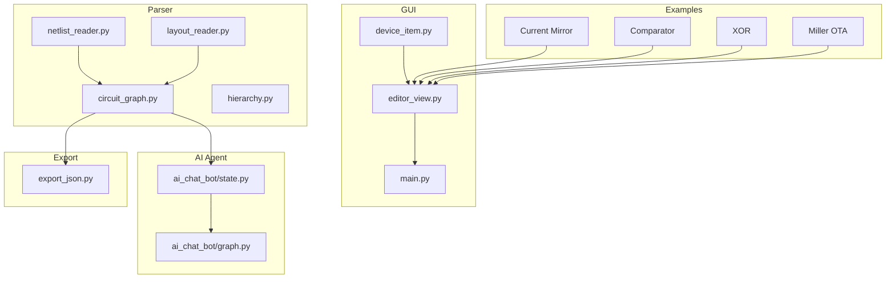
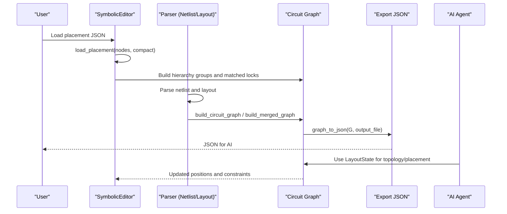
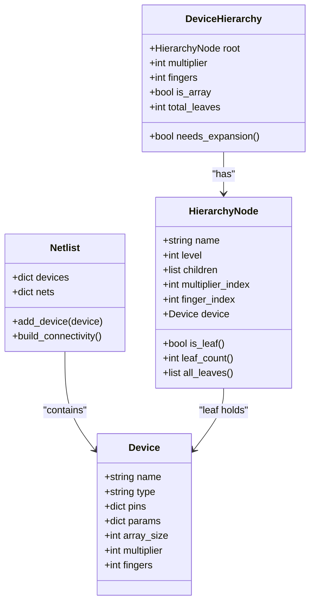
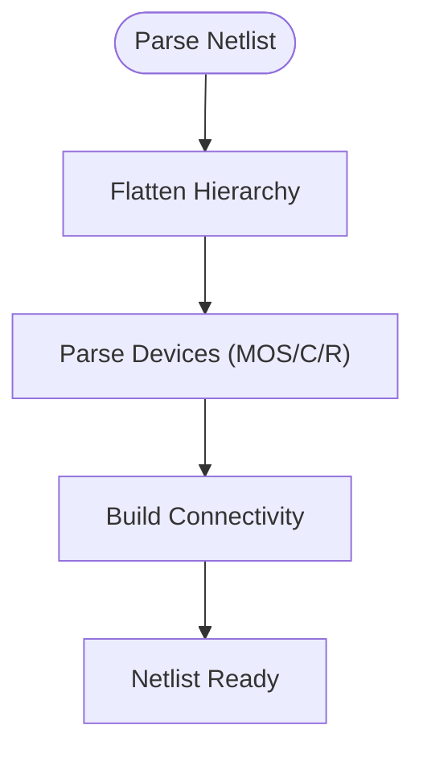
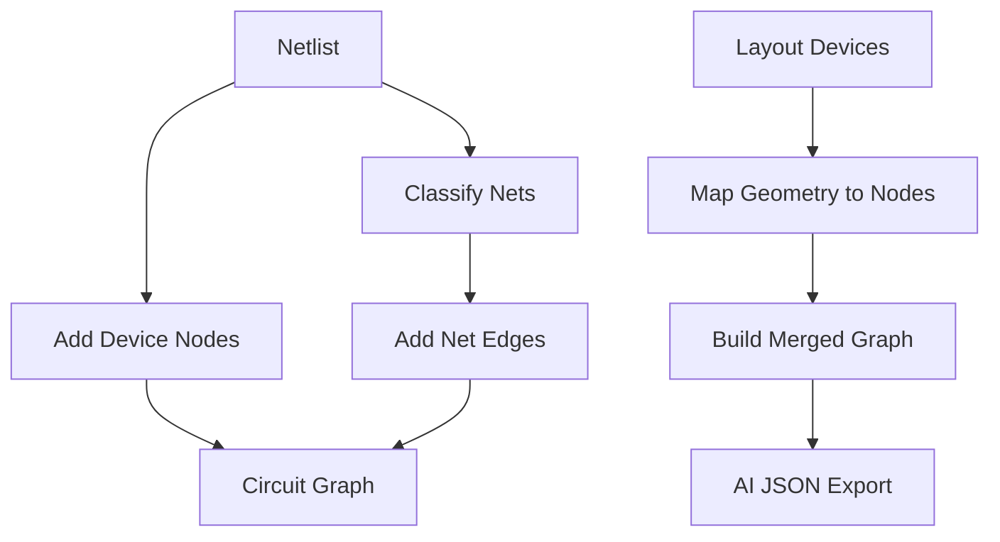
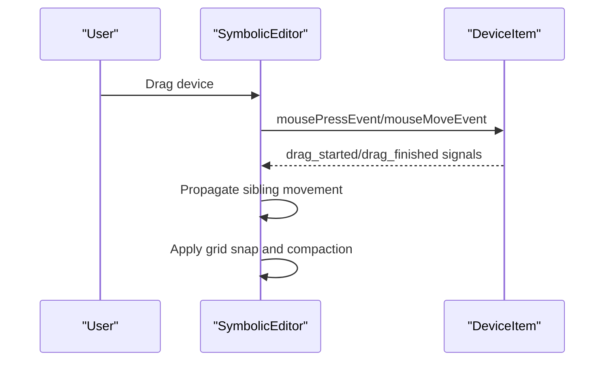
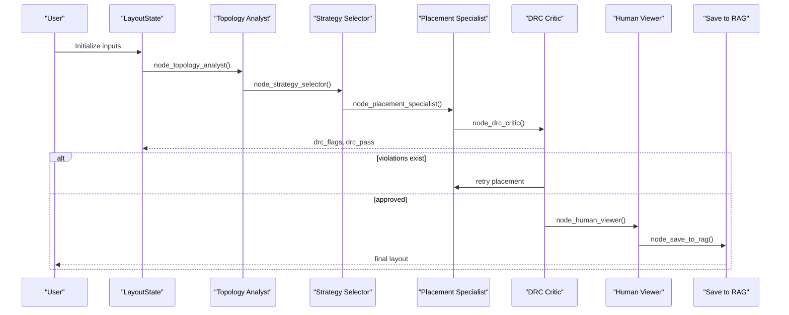
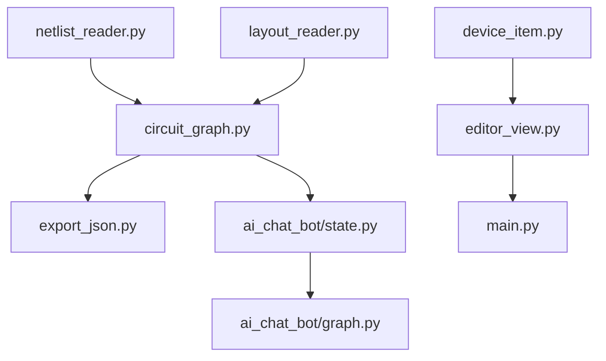

# API Reference

<cite>
**Referenced Files in This Document**
- [README.md](file://README.md)
- [parser/netlist_reader.py](file://parser/netlist_reader.py)
- [parser/circuit_graph.py](file://parser/circuit_graph.py)
- [parser/layout_reader.py](file://parser/layout_reader.py)
- [parser/hierarchy.py](file://parser/hierarchy.py)
- [export/export_json.py](file://export/export_json.py)
- [symbolic_editor/device_item.py](file://symbolic_editor/device_item.py)
- [symbolic_editor/editor_view.py](file://symbolic_editor/editor_view.py)
- [symbolic_editor/main.py](file://symbolic_editor/main.py)
- [ai_agent/ai_chat_bot/state.py](file://ai_agent/ai_chat_bot/state.py)
- [ai_agent/ai_chat_bot/graph.py](file://ai_agent/ai_chat_bot/graph.py)
- [examples/current_mirror/Current_Mirror_CM_graph_compressed.json](file://examples/current_mirror/Current_Mirror_CM_graph_compressed.json)
- [examples/comparator/comparator_graph_compressed.json](file://examples/comparator/comparator_graph_compressed.json)
- [examples/xor/Xor_Automation_graph_compressed.json](file://examples/xor/Xor_Automation_graph_compressed.json)
- [examples/Miller_OTA/Miller_OTA_graph_compressed.json](file://examples/Miller_OTA/Miller_OTA_graph_compressed.json)
</cite>

## Table of Contents
1. [Introduction](#introduction)
2. [Project Structure](#project-structure)
3. [Core Components](#core-components)
4. [Architecture Overview](#architecture-overview)
5. [Detailed Component Analysis](#detailed-component-analysis)
6. [Dependency Analysis](#dependency-analysis)
7. [Performance Considerations](#performance-considerations)
8. [Troubleshooting Guide](#troubleshooting-guide)
9. [Conclusion](#conclusion)
10. [Appendices](#appendices)

## Introduction
This API reference documents the core modules and data models that power the AI-based analog layout automation system. It covers:
- Device data model for PMOS/NMOS transistors and passive devices, including terminals and geometric parameters
- Netlist data model with connectivity and hierarchical organization
- Circuit graph API for device connectivity analysis and layout optimization
- GUI component APIs for device items, canvas operations, and event handling
- State management APIs used for AI agent coordination and layout tracking
- Detailed parameter specifications, return value documentation, usage examples, and error handling patterns

## Project Structure
The repository is organized into modules supporting parsing, GUI editing, AI orchestration, and export:
- parser: netlist and layout readers, hierarchy modeling, circuit graph construction
- symbolic_editor: PySide6-based GUI with device items, canvas, and editor controls
- ai_agent: multi-agent pipeline orchestrating topology, placement, DRC, and routing
- export: JSON and OAS export utilities
- examples: ready-to-load placement JSONs demonstrating device-level graphs

**Diagram sources**
- [parser/netlist_reader.py](file://parser/netlist_reader.py)
- [parser/circuit_graph.py](file://parser/circuit_graph.py)
- [parser/layout_reader.py](file://parser/layout_reader.py)
- [parser/hierarchy.py](file://parser/hierarchy.py)
- [export/export_json.py](file://export/export_json.py)
- [symbolic_editor/device_item.py](file://symbolic_editor/device_item.py)
- [symbolic_editor/editor_view.py](file://symbolic_editor/editor_view.py)
- [symbolic_editor/main.py](file://symbolic_editor/main.py)
- [ai_agent/ai_chat_bot/state.py](file://ai_agent/ai_chat_bot/state.py)
- [ai_agent/ai_chat_bot/graph.py](file://ai_agent/ai_chat_bot/graph.py)
- [examples/current_mirror/Current_Mirror_CM_graph_compressed.json](file://examples/current_mirror/Current_Mirror_CM_graph_compressed.json)
- [examples/comparator/comparator_graph_compressed.json](file://examples/comparator/comparator_graph_compressed.json)
- [examples/xor/Xor_Automation_graph_compressed.json](file://examples/xor/Xor_Automation_graph_compressed.json)
- [examples/Miller_OTA/Miller_OTA_graph_compressed.json](file://examples/Miller_OTA/Miller_OTA_graph_compressed.json)

**Section sources**
- [README.md](file://README.md)

## Core Components
This section documents the primary data models and APIs used across the system.

### Device Data Model
Devices represent transistors, resistors, and capacitors with electrical and geometric attributes. PMOS/NMOS devices include terminals and multi-finger parameters.

- Device class
  - Purpose: Encapsulates a single circuit device with name, type, pin-to-net mapping, and parameters
  - Key attributes:
    - name: Instance identifier (e.g., "MM1")
    - type: Device category ("nmos", "pmos", "res", "cap")
    - pins: Dictionary mapping pin names to net names (e.g., {"D": "net1", "G": "net2", "S": "net3"})
    - params: Dictionary of device parameters (e.g., {"l": 1.4e-08, "nf": 4, "m": 1})
  - Properties:
    - array_size: Integer array suffix index extracted from device name
    - multiplier: Integer multiplier "m" value
    - fingers: Integer finger count "nf"
  - Usage examples:
    - Create a device with pins and parameters
    - Access hierarchical metadata via properties
  - Error handling:
    - Non-integer multipliers/fingers are rounded to integers
    - Missing or invalid parameters default sensibly

- Terminal definitions
  - Standard terminals: "D" (drain), "G" (gate), "S" (source), "B" (bulk)
  - Normalization: Pin names are normalized to canonical roles (e.g., "1" -> "drain", "2" -> "drain")

- Geometric parameters
  - Width and height are derived from layout geometry
  - Orientation includes rotations and flips (e.g., "R0", "R180", "MX", "R0_FH_FV")
  - Abutment flags indicate diffusion sharing preferences per edge

**Section sources**
- [parser/netlist_reader.py](file://parser/netlist_reader.py)
- [parser/circuit_graph.py](file://parser/circuit_graph.py)
- [parser/layout_reader.py](file://parser/layout_reader.py)
- [symbolic_editor/device_item.py](file://symbolic_editor/device_item.py)

### Netlist Data Model
The netlist model captures devices and connectivity, enabling circuit graph construction and hierarchical expansion.

- Netlist class
  - Purpose: Holds device dictionary and net-to-device-pin mapping
  - Methods:
    - add_device(device): Adds a Device to the netlist
    - build_connectivity(): Builds the net mapping from device pins
  - Usage examples:
    - Populate from parsed SPICE/CDL lines
    - Generate connectivity for graph building

- Hierarchy modeling
  - Array suffix parsing: Extracts 0-based array index from device names
  - Device hierarchy: Supports three expansion modes:
    - Array-only: Copies indexed by array_count
    - Multiplier-only: m-level children
    - Fingers-only: nf-level children
    - Combined: Two-level expansion (m × nf)
  - Expansion utilities:
    - Build hierarchy for a single device
    - Reconstruct hierarchies from expanded devices
    - Generate leaf Device objects with resolved pins and indices

- Parsing utilities
  - parse_value(value): Converts SPICE numeric strings (e.g., "1u", "60n") to floats
  - parse_mos(tokens): Parses MOS devices with nf, m, and array expansions
  - parse_cap(tokens), parse_res(tokens): Parses passive devices

**Section sources**
- [parser/netlist_reader.py](file://parser/netlist_reader.py)
- [parser/hierarchy.py](file://parser/hierarchy.py)

### Circuit Graph API
NetworkX-based graph construction enables connectivity analysis and layout optimization.

- Graph construction
  - build_circuit_graph(netlist): Creates a graph with device nodes and net edges
  - build_merged_graph(netlist, layout_devices, mapping): Merges electrical connectivity with geometry
- Edge classification
  - classify_net(net, connections): Determines net role (bias, signal, gate)
  - normalize_pin(pin): Maps pin names to canonical roles
- Usage examples:
  - Build a connectivity graph from a Netlist
  - Merge with layout geometry for AI-ready JSON export

**Section sources**
- [parser/circuit_graph.py](file://parser/circuit_graph.py)

### GUI Component APIs
PySide6-based GUI provides interactive device manipulation, rendering, and canvas operations.

- DeviceItem
  - Purpose: QGraphicsRectItem subclass representing a device with multi-finger visualization
  - Key methods:
    - set_snap_grid(grid_x, grid_y): Enable grid snapping
    - set_candidate_highlight(left_net=None, right_net=None): Highlight abutment candidates
    - toggle_abut_left()/toggle_abut_right(): Toggle manual abutment flags
    - set_match_highlight(color)/clear_match_highlight(): Visual lock for matched groups
    - flip_horizontal()/flip_vertical(): Mirror device orientation
    - set_render_mode(mode): Switch between detailed and outline render modes
    - terminal_anchors(): Returns scene positions for S, G, D anchors
    - Signals: drag_started, drag_finished
  - Usage examples:
    - Render multi-finger transistors with accurate terminal labeling
    - Respond to drag events and propagate movements to sibling devices

- SymbolicEditor (QGraphicsView)
  - Purpose: Central canvas for device placement and routing visualization
  - Key methods:
    - load_placement(nodes, compact=False): Load devices from placement JSON
    - set_device_render_mode(mode): Apply render mode to all devices
    - set_dummy_mode(enabled)/set_dummy_place_callback(callback): Enable dummy placement
    - get_updated_positions(): Retrieve device positions in original coordinate system
    - _build_hierarchy_groups(nodes): Build hierarchical groups for arrays/multipliers/fingers
    - _wire_matched_group_locking(parent_groups, raw_nodes): Auto-detect matched groups and lock movement
  - Usage examples:
    - Load AI-generated placements and enable grid-snap compaction
    - Manage dummy device previews and commit placements

- MainWindow (QMainWindow)
  - Purpose: Application shell hosting tabs, menus, toolbars, and status bars
  - Key methods:
    - _new_tab(placement_file): Create a new editor tab
    - _on_import(): Trigger import pipeline
    - _on_load_example(sp_path, oas_path): Load example circuits
    - _fwd(method_name, *args), _fwd_editor(method_name, *args): Forward actions to active tab/editor
  - Usage examples:
    - Open example circuits and manage multiple tabs

**Section sources**
- [symbolic_editor/device_item.py](file://symbolic_editor/device_item.py)
- [symbolic_editor/editor_view.py](file://symbolic_editor/editor_view.py)
- [symbolic_editor/main.py](file://symbolic_editor/main.py)

### State Management APIs
Typed state dictionaries coordinate AI agent workflows and layout updates.

- LayoutState (TypedDict)
  - Inputs:
    - user_message: str
    - chat_history: List[Dict[str, str]]
    - nodes: List[Dict[str, Any]]
    - sp_file_path: str
    - selected_model: str
  - Topology:
    - constraint_text: str
    - edges: List[Dict]
    - terminal_nets: Dict[str, Dict[str, Any]]
  - Strategy:
    - Analysis_result: str
    - strategy_result: str
  - Placement:
    - placement_nodes: List[Dict]
    - deterministic_snapshot: List[Dict]
  - DRC:
    - drc_flags: List[Dict]
    - drc_pass: bool
    - drc_retry_count: int
    - gap_px: float
  - Routing:
    - routing_pass_count: int
    - routing_result: Dict[str, Any]
  - Pending updates:
    - pending_cmds: List[Dict]
  - Human approval:
    - approved: bool
  - Usage examples:
    - Pass state through LangGraph nodes
    - Persist and resume agent sessions

- LangGraph workflow
  - Builder registers nodes for topology analysis, strategy selection, placement, DRC critique, routing preview, human viewer, and RAG storage
  - Edges define linear and conditional flows, including retries and human-in-the-loop
  - Compilation with MemorySaver checkpointing supports interruptions and resumption

**Section sources**
- [ai_agent/ai_chat_bot/state.py](file://ai_agent/ai_chat_bot/state.py)
- [ai_agent/ai_chat_bot/graph.py](file://ai_agent/ai_chat_bot/graph.py)

## Architecture Overview
The system integrates parsing, GUI editing, and AI orchestration to produce optimized layouts.

**Diagram sources**
- [symbolic_editor/editor_view.py](file://symbolic_editor/editor_view.py)
- [parser/netlist_reader.py](file://parser/netlist_reader.py)
- [parser/layout_reader.py](file://parser/layout_reader.py)
- [parser/circuit_graph.py](file://parser/circuit_graph.py)
- [export/export_json.py](file://export/export_json.py)
- [ai_agent/ai_chat_bot/state.py](file://ai_agent/ai_chat_bot/state.py)
- [ai_agent/ai_chat_bot/graph.py](file://ai_agent/ai_chat_bot/graph.py)

## Detailed Component Analysis

### Device Data Model Analysis
- Device class encapsulation
  - Name/type/pins/params provide a unified representation for all device types
  - Hierarchical metadata exposed via properties simplifies downstream logic
- Terminal normalization
  - Ensures consistent interpretation of pin roles across diverse netlist formats
- Geometric integration
  - Orientation and abutment flags bridge layout geometry with device semantics

**Diagram sources**
- [parser/netlist_reader.py](file://parser/netlist_reader.py)
- [parser/hierarchy.py](file://parser/hierarchy.py)

**Section sources**
- [parser/netlist_reader.py](file://parser/netlist_reader.py)
- [parser/hierarchy.py](file://parser/hierarchy.py)

### Netlist Data Model Analysis
- Connectivity mapping
  - Net-to-device-pin mapping enables robust graph construction and analysis
- Hierarchical flattening
  - Supports multi-level subcircuits with recursive expansion and prefixing
- Parameter parsing
  - Robust conversion of SPICE units and model parameters

**Diagram sources**
- [parser/netlist_reader.py](file://parser/netlist_reader.py)

**Section sources**
- [parser/netlist_reader.py](file://parser/netlist_reader.py)

### Circuit Graph API Analysis
- Graph construction
  - Device nodes capture type and dimensions
  - Net edges capture relations (shared bias, shared gate, shared source/drains)
- Merging layout and electrical graphs
  - Integrates geometry (x, y, width, height, orientation) with connectivity for AI-ready JSON

**Diagram sources**
- [parser/circuit_graph.py](file://parser/circuit_graph.py)
- [export/export_json.py](file://export/export_json.py)

**Section sources**
- [parser/circuit_graph.py](file://parser/circuit_graph.py)
- [export/export_json.py](file://export/export_json.py)

### GUI Component APIs Analysis
- DeviceItem rendering
  - Multi-finger visualization with source/drain/gate coloring and terminal labels
  - Flip and abutment state reflected in visual styling
- SymbolicEditor operations
  - Grid-snap compaction, dummy placement preview, and matched group locking
  - Hierarchical group management for arrays/multipliers/fingers

**Diagram sources**
- [symbolic_editor/editor_view.py](file://symbolic_editor/editor_view.py)
- [symbolic_editor/device_item.py](file://symbolic_editor/device_item.py)

**Section sources**
- [symbolic_editor/device_item.py](file://symbolic_editor/device_item.py)
- [symbolic_editor/editor_view.py](file://symbolic_editor/editor_view.py)

### State Management APIs Analysis
- Typed state for AI coordination
  - Structured fields for inputs, topology, strategy, placement, DRC, routing, and pending updates
- LangGraph workflow
  - Linear pipeline from topology to placement, with DRC critique and routing preview
  - Conditional edges support retries and human-in-the-loop approvals

**Diagram sources**
- [ai_agent/ai_chat_bot/state.py](file://ai_agent/ai_chat_bot/state.py)
- [ai_agent/ai_chat_bot/graph.py](file://ai_agent/ai_chat_bot/graph.py)

**Section sources**
- [ai_agent/ai_chat_bot/state.py](file://ai_agent/ai_chat_bot/state.py)
- [ai_agent/ai_chat_bot/graph.py](file://ai_agent/ai_chat_bot/graph.py)

## Dependency Analysis
The following diagram shows key dependencies among modules:

**Diagram sources**
- [parser/netlist_reader.py](file://parser/netlist_reader.py)
- [parser/circuit_graph.py](file://parser/circuit_graph.py)
- [parser/layout_reader.py](file://parser/layout_reader.py)
- [export/export_json.py](file://export/export_json.py)
- [symbolic_editor/device_item.py](file://symbolic_editor/device_item.py)
- [symbolic_editor/editor_view.py](file://symbolic_editor/editor_view.py)
- [symbolic_editor/main.py](file://symbolic_editor/main.py)
- [ai_agent/ai_chat_bot/state.py](file://ai_agent/ai_chat_bot/state.py)
- [ai_agent/ai_chat_bot/graph.py](file://ai_agent/ai_chat_bot/graph.py)

**Section sources**
- [parser/netlist_reader.py](file://parser/netlist_reader.py)
- [parser/circuit_graph.py](file://parser/circuit_graph.py)
- [parser/layout_reader.py](file://parser/layout_reader.py)
- [export/export_json.py](file://export/export_json.py)
- [symbolic_editor/device_item.py](file://symbolic_editor/device_item.py)
- [symbolic_editor/editor_view.py](file://symbolic_editor/editor_view.py)
- [symbolic_editor/main.py](file://symbolic_editor/main.py)
- [ai_agent/ai_chat_bot/state.py](file://ai_agent/ai_chat_bot/state.py)
- [ai_agent/ai_chat_bot/graph.py](file://ai_agent/ai_chat_bot/graph.py)

## Performance Considerations
- Graph construction
  - Net classification and pairwise comparisons scale with device count; consider filtering global supplies to reduce edge density
- Rendering
  - Multi-finger rendering computes per-column segments; outline mode reduces rendering cost
- Grid snapping and compaction
  - Enabling grid snapping improves alignment but adds minor overhead during drag operations
- AI pipeline
  - JSON export size impacts LLM prompt latency; compressed graph format reduces payload while preserving connectivity

## Troubleshooting Guide
- Netlist parsing
  - Non-integer multipliers/fingers are rounded; verify parameter values if unexpected expansions occur
  - Array suffix parsing requires "<N>" syntax; missing brackets return None
- Layout import
  - Unsupported layout formats raise explicit errors; ensure .gds or .oas inputs
  - Hierarchical layouts require traversal of subcells; confirm top-level cell presence
- GUI interactions
  - Dummy placement preview clears on row boundary crossing; reinitialize preview if type changes
  - Matched group locking merges sibling lists; ensure terminal nets are correctly mapped to avoid false positives
- AI state
  - Missing keys in LayoutState may cause runtime errors; initialize all required fields before graph compilation
  - Conditional edges depend on flags like drc_pass and approved; ensure proper transitions to avoid deadlocks

**Section sources**
- [parser/netlist_reader.py](file://parser/netlist_reader.py)
- [parser/layout_reader.py](file://parser/layout_reader.py)
- [symbolic_editor/editor_view.py](file://symbolic_editor/editor_view.py)
- [ai_agent/ai_chat_bot/state.py](file://ai_agent/ai_chat_bot/state.py)
- [ai_agent/ai_chat_bot/graph.py](file://ai_agent/ai_chat_bot/graph.py)

## Conclusion
This API reference outlines the device and netlist data models, circuit graph construction, GUI component interfaces, and state management used by the AI-based analog layout automation system. By leveraging structured data models, robust parsing utilities, and a modular GUI and AI pipeline, the system supports efficient device-level floorplanning and AI-assisted layout optimization.

## Appendices

### Example Graph Formats
- Compressed graph JSON demonstrates device types, default dimensions, and per-device parameters for PMOS/NMOS/res/cap
- Typical fields include device type, multi-finger count, length, and terminal-to-net mappings

**Section sources**
- [examples/current_mirror/Current_Mirror_CM_graph_compressed.json](file://examples/current_mirror/Current_Mirror_CM_graph_compressed.json)
- [examples/comparator/comparator_graph_compressed.json](file://examples/comparator/comparator_graph_compressed.json)
- [examples/xor/Xor_Automation_graph_compressed.json](file://examples/xor/Xor_Automation_graph_compressed.json)
- [examples/Miller_OTA/Miller_OTA_graph_compressed.json](file://examples/Miller_OTA/Miller_OTA_graph_compressed.json)