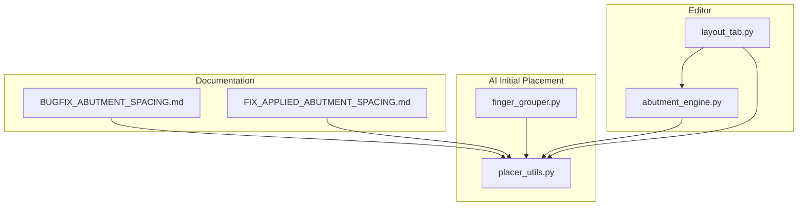
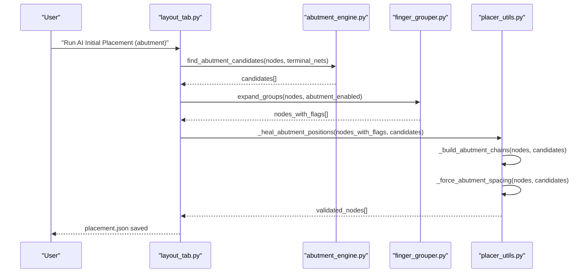
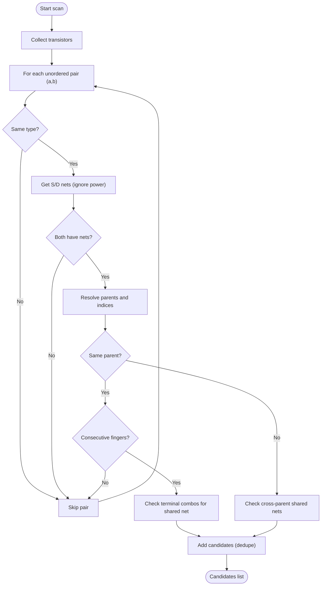
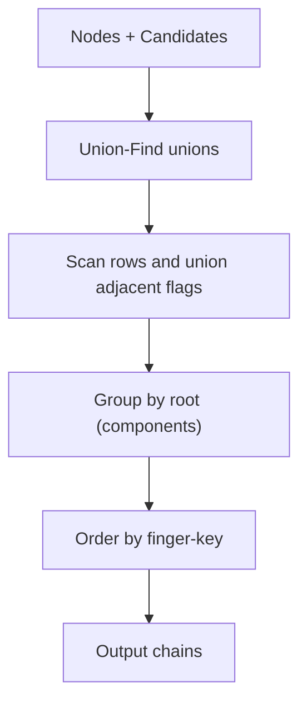
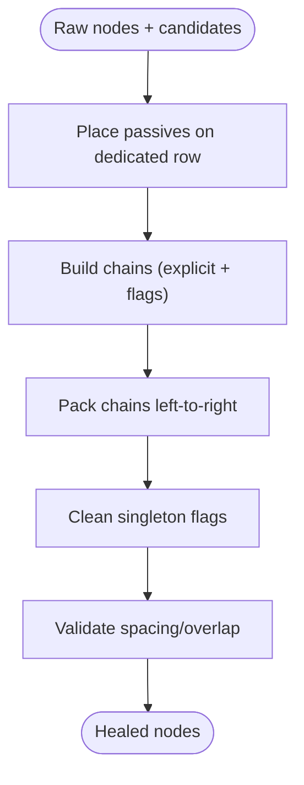
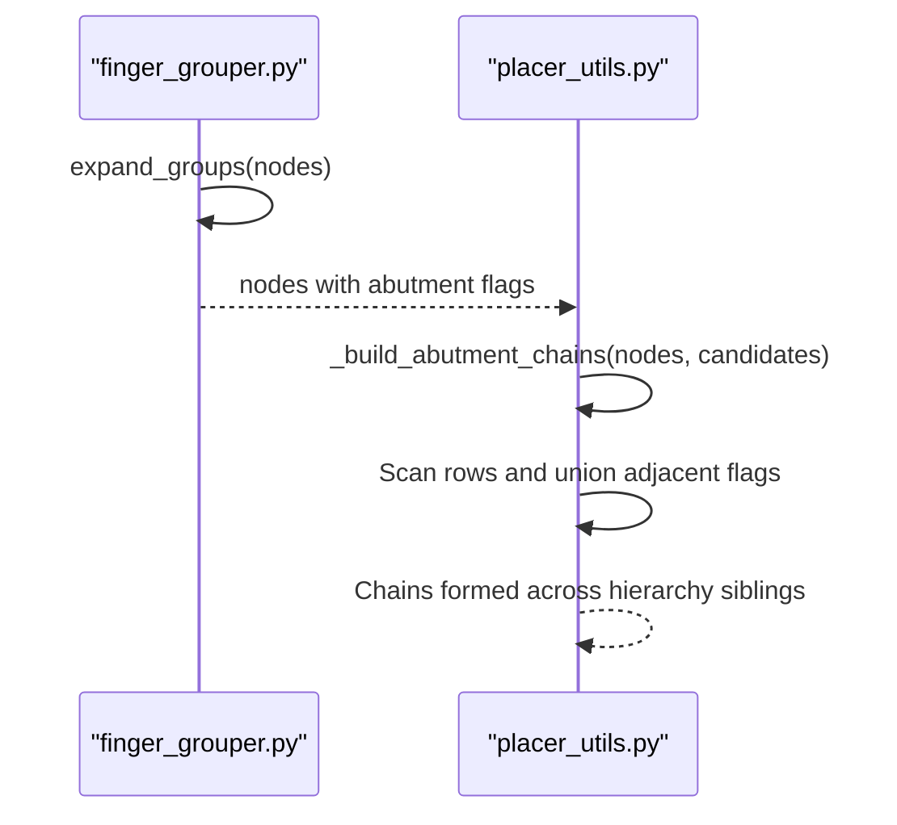
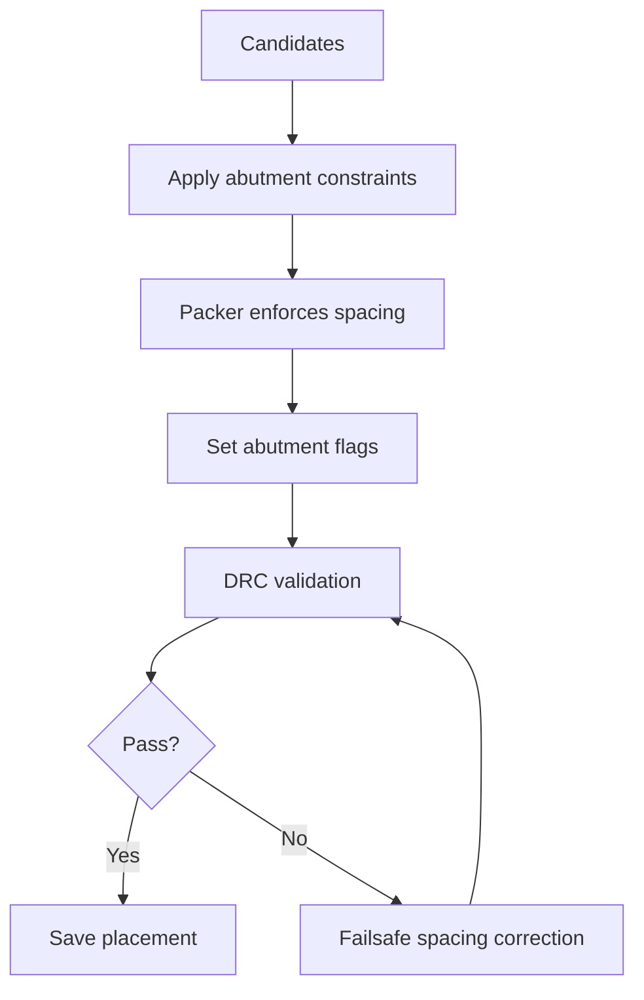
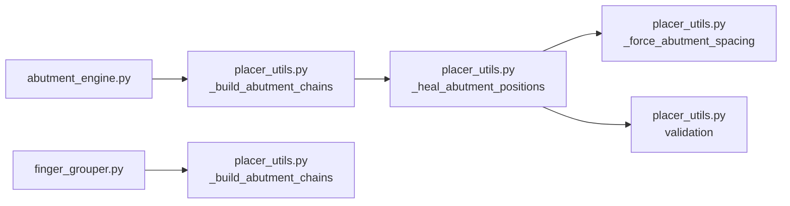

# Abutment Analysis Engine

<cite>
**Referenced Files in This Document**
- [abutment_engine.py](file://symbolic_editor/abutment_engine.py)
- [placer_utils.py](file://ai_agent/ai_initial_placement/placer_utils.py)
- [finger_grouper.py](file://ai_agent/ai_initial_placement/finger_grouper.py)
- [layout_tab.py](file://symbolic_editor/layout_tab.py)
- [BUGFIX_ABUTMENT_SPACING.md](file://docs/BUGFIX_ABUTMENT_SPACING.md)
- [FIX_APPLIED_ABUTMENT_SPACING.md](file://docs/FIX_APPLIED_ABUTMENT_SPACING.md)
- [Current_Mirror_CM.json](file://examples/current_mirror/Current_Mirror_CM.json)
- [analog_kb.py](file://ai_agent/ai_chat_bot/analog_kb.py)
- [prompts.py](file://ai_agent/ai_chat_bot/prompts.py)
</cite>

## Table of Contents
1. [Introduction](#introduction)
2. [Project Structure](#project-structure)
3. [Core Components](#core-components)
4. [Architecture Overview](#architecture-overview)
5. [Detailed Component Analysis](#detailed-component-analysis)
6. [Dependency Analysis](#dependency-analysis)
7. [Performance Considerations](#performance-considerations)
8. [Troubleshooting Guide](#troubleshooting-guide)
9. [Conclusion](#conclusion)
10. [Appendices](#appendices)

## Introduction
This document describes the abutment analysis engine responsible for detecting and optimizing transistor abutment to minimize layout area and improve electrical performance. Abutment enables adjacent same-type transistors to share diffusion terminals, reducing parasitic capacitance and shortening interconnect length. The engine identifies candidates based on shared Source/Drain nets, computes proper spacing and orientation constraints, and integrates with the AI-driven placement pipeline to enforce deterministic abutment chains during post-placement healing.

## Project Structure
The abutment system spans three primary areas:
- Candidate detection: identifies pairs of transistors that can share a diffusion terminal.
- Chain construction: builds connected abutment chains using Union-Find and embedded flags.
- Post-placement enforcement: snaps and validates positions, enforces precise spacing, and cleans flags.

**Diagram sources**
- [abutment_engine.py:65-180](file://symbolic_editor/abutment_engine.py#L65-L180)
- [placer_utils.py:602-799](file://ai_agent/ai_initial_placement/placer_utils.py#L602-L799)
- [finger_grouper.py:1517-1532](file://ai_agent/ai_initial_placement/finger_grouper.py#L1517-L1532)
- [layout_tab.py:1146-1220](file://symbolic_editor/layout_tab.py#L1146-L1220)
- [BUGFIX_ABUTMENT_SPACING.md:1-246](file://docs/BUGFIX_ABUTMENT_SPACING.md#L1-L246)
- [FIX_APPLIED_ABUTMENT_SPACING.md:1-155](file://docs/FIX_APPLIED_ABUTMENT_SPACING.md#L1-L155)

**Section sources**
- [abutment_engine.py:1-225](file://symbolic_editor/abutment_engine.py#L1-L225)
- [placer_utils.py:600-1087](file://ai_agent/ai_initial_placement/placer_utils.py#L600-L1087)
- [finger_grouper.py:1-200](file://ai_agent/ai_initial_placement/finger_grouper.py#L1-L200)

## Core Components
- Abutment Candidate Finder: Scans transistors for shared Source/Drain nets, filters power nets, and generates candidate pairs with required orientation flips.
- Chain Builder: Uses Union-Find to connect abutment pairs and embeds multi-finger sibling chains via abutment flags.
- Post-placement Healer: Reconstructs deterministic positions per row, enforces abutment spacing, and validates against DRC rules.
- Failsafe Spacing Enforcer: Scans rows and forces correct spacing for adjacent devices with matching flags.
- Editor Integration: Exposes candidates to the AI prompt and highlights edges for user feedback.

**Section sources**
- [abutment_engine.py:65-180](file://symbolic_editor/abutment_engine.py#L65-L180)
- [placer_utils.py:602-799](file://ai_agent/ai_initial_placement/placer_utils.py#L602-L799)
- [placer_utils.py:888-950](file://ai_agent/ai_initial_placement/placer_utils.py#L888-L950)

## Architecture Overview
The abutment pipeline operates in stages:
1. Candidate generation from netlist terminals.
2. Expansion of multi-finger devices with abutment flags.
3. Chain construction using explicit candidates and embedded flags.
4. Post-placement healing with deterministic packing and validation.
5. Optional failsafe correction of residual spacing errors.

**Diagram sources**
- [layout_tab.py:1146-1220](file://symbolic_editor/layout_tab.py#L1146-L1220)
- [abutment_engine.py:65-180](file://symbolic_editor/abutment_engine.py#L65-L180)
- [finger_grouper.py:1517-1532](file://ai_agent/ai_initial_placement/finger_grouper.py#L1517-L1532)
- [placer_utils.py:699-799](file://ai_agent/ai_initial_placement/placer_utils.py#L699-L799)
- [placer_utils.py:888-950](file://ai_agent/ai_initial_placement/placer_utils.py#L888-L950)

## Detailed Component Analysis

### Abutment Candidate Detection
The detector scans all transistors, filters power nets, and identifies pairs sharing a Source or Drain net. It distinguishes same-type pairs (NMOS-NMOS or PMOS-PMOS) and determines whether the right device must be horizontally flipped to align terminals for abutment. It also handles multi-finger sequential chains and cross-parent connections with deduplication and careful ordering.

Key behaviors:
- Filters power nets from terminal comparisons.
- Builds candidate entries with device IDs, shared terminals, shared net, type, and flip requirement.
- Enforces strict consecutive-finger abutment for same-parent multi-finger devices.
- Applies cross-parent linking with safeguards to avoid combinatorial explosion.

**Diagram sources**
- [abutment_engine.py:65-180](file://symbolic_editor/abutment_engine.py#L65-L180)

**Section sources**
- [abutment_engine.py:48-180](file://symbolic_editor/abutment_engine.py#L48-L180)

### Chain Construction and Multi-Finger Integration
The chain builder constructs connected components of abutment pairs using Union-Find. It processes:
- Explicit candidates from the detector.
- Embedded abutment flags from multi-finger expansions to ensure hierarchy siblings are chained together.

It sorts chains by finger index when present and ensures deterministic ordering.

**Diagram sources**
- [placer_utils.py:602-695](file://ai_agent/ai_initial_placement/placer_utils.py#L602-L695)

**Section sources**
- [placer_utils.py:602-695](file://ai_agent/ai_initial_placement/placer_utils.py#L602-L695)

### Post-Placement Healing and Spacing Enforcement
The healer:
- Places passive devices on a dedicated row.
- Builds chains across all nodes (not per-row).
- Packs each chain with abutment spacing (0.070 µm) and standard spacing otherwise.
- Clears abutment flags for singletons and maintains orientation constraints.
- Validates spacing and overlap, reporting errors.

A failsafe function scans rows and forces correct spacing for adjacent devices with matching flags, correcting residual errors.

**Diagram sources**
- [placer_utils.py:699-799](file://ai_agent/ai_initial_placement/placer_utils.py#L699-L799)
- [placer_utils.py:888-950](file://ai_agent/ai_initial_placement/placer_utils.py#L888-L950)

**Section sources**
- [placer_utils.py:735-778](file://ai_agent/ai_initial_placement/placer_utils.py#L735-L778)
- [placer_utils.py:888-950](file://ai_agent/ai_initial_placement/placer_utils.py#L888-L950)

### Multi-Finger Expansion and Abutment Flags
During expansion:
- Each finger receives abutment flags to indicate left/right adjacency.
- First finger has abut_right; last has abut_left; middle fingers have both.
- The chain builder uses these flags to unite hierarchy siblings even when not present in explicit candidates.

**Diagram sources**
- [finger_grouper.py:1517-1532](file://ai_agent/ai_initial_placement/finger_grouper.py#L1517-L1532)
- [placer_utils.py:650-671](file://ai_agent/ai_initial_placement/placer_utils.py#L650-L671)

**Section sources**
- [finger_grouper.py:1517-1532](file://ai_agent/ai_initial_placement/finger_grouper.py#L1517-L1532)
- [placer_utils.py:650-671](file://ai_agent/ai_initial_placement/placer_utils.py#L650-L671)

### Abutment Application Process
The application process modifies device positions and flags to achieve optimal abutment configurations:
- Explicit candidates drive cross-device abutment.
- Embedded flags ensure intra-device multi-finger chaining.
- Post-placement packing enforces 0.070 µm spacing between abutted devices.
- Validation ensures no overlaps and correct spacing.

**Diagram sources**
- [placer_utils.py:888-950](file://ai_agent/ai_initial_placement/placer_utils.py#L888-L950)
- [placer_utils.py:362-388](file://ai_agent/ai_initial_placement/placer_utils.py#L362-L388)

**Section sources**
- [placer_utils.py:362-388](file://ai_agent/ai_initial_placement/placer_utils.py#L362-L388)

### Examples: Abutment Scenarios
Common analog circuits and their abutment strategies:
- Differential Pairs: Must be symmetric about the row center; abutment reduces parasitics and improves matching.
- Current Mirrors: Mirror devices should be adjacent and share the same orientation; abutment minimizes gate resistance mismatch.
- Interdigitated Matching: Advanced pattern for high-precision mirrors and current sources.

These scenarios rely on abutment to reduce diffusion breaks and improve matching accuracy.

**Section sources**
- [analog_kb.py:171-219](file://ai_agent/ai_chat_bot/analog_kb.py#L171-L219)
- [prompts.py:28-50](file://ai_agent/ai_chat_bot/prompts.py#L28-L50)

### Relationship Between Abutment Optimization and Layout Density, Parasitics, and Manufacturing
- Layout density: Abutment reduces total area by eliminating diffusion breaks between adjacent same-type transistors.
- Parasitic effects: Shared diffusion terminals reduce parasitic capacitance and improve signal integrity.
- Manufacturing considerations: Proper abutment spacing and orientation ensure mask features align correctly and avoid etch asymmetries.

**Section sources**
- [analog_kb.py:171-219](file://ai_agent/ai_chat_bot/analog_kb.py#L171-L219)
- [prompts.py:28-50](file://ai_agent/ai_chat_bot/prompts.py#L28-L50)

### Abutment Validation and Error Handling
Validation checks:
- Abutment spacing correctness between adjacent devices with matching flags.
- Non-abutted devices must not overlap and must maintain minimum spacing.
- Device types must remain unchanged after placement.

Error handling:
- Failsafe spacing correction adjusts positions to meet 0.070 µm spacing.
- Debug logs assist in diagnosing chain formation and overlap resolution.

**Section sources**
- [placer_utils.py:362-388](file://ai_agent/ai_initial_placement/placer_utils.py#L362-L388)
- [placer_utils.py:888-950](file://ai_agent/ai_initial_placement/placer_utils.py#L888-L950)
- [BUGFIX_ABUTMENT_SPACING.md:1-246](file://docs/BUGFIX_ABUTMENT_SPACING.md#L1-L246)
- [FIX_APPLIED_ABUTMENT_SPACING.md:1-155](file://docs/FIX_APPLIED_ABUTMENT_SPACING.md#L1-L155)

## Dependency Analysis
The abutment engine integrates with the placement pipeline through explicit candidates and embedded flags. The key dependencies are:
- Detector → Chain Builder: candidates feed Union-Find unions.
- Expander → Chain Builder: embedded flags ensure multi-finger chaining.
- Chain Builder → Healer: chains drive deterministic packing.
- Healer → Validator: spacing and overlap checks ensure DRC compliance.

**Diagram sources**
- [abutment_engine.py:65-180](file://symbolic_editor/abutment_engine.py#L65-L180)
- [placer_utils.py:602-799](file://ai_agent/ai_initial_placement/placer_utils.py#L602-L799)
- [placer_utils.py:888-950](file://ai_agent/ai_initial_placement/placer_utils.py#L888-L950)
- [finger_grouper.py:1517-1532](file://ai_agent/ai_initial_placement/finger_grouper.py#L1517-L1532)

**Section sources**
- [placer_utils.py:602-799](file://ai_agent/ai_initial_placement/placer_utils.py#L602-L799)

## Performance Considerations
- Candidate generation uses pairwise combinations; filtering by type and power nets reduces search space.
- Union-Find with path compression ensures efficient chain construction.
- Sorting by finger index guarantees deterministic ordering for multi-finger chains.
- Failsafe spacing correction runs in linear time per row, minimizing overhead.

## Troubleshooting Guide
Common issues and resolutions:
- Multi-finger abutment spacing errors: Ensure embedded flags are processed even when explicit candidates exist. The fix applies both sources of abutment information.
- Validation failures: Use the failsafe spacing enforcer to correct residual errors and verify logs for chain formation.
- Cross-parent linking conflicts: Deduplication and safeguards prevent excessive permutations and conflicting links.

**Section sources**
- [BUGFIX_ABUTMENT_SPACING.md:1-246](file://docs/BUGFIX_ABUTMENT_SPACING.md#L1-L246)
- [FIX_APPLIED_ABUTMENT_SPACING.md:1-155](file://docs/FIX_APPLIED_ABUTMENT_SPACING.md#L1-L155)
- [placer_utils.py:888-950](file://ai_agent/ai_initial_placement/placer_utils.py#L888-L950)

## Conclusion
The abutment analysis engine provides a robust framework for identifying and enforcing abutment constraints. By combining explicit candidates with embedded flags, it ensures multi-finger devices are properly chained and spaced, leading to compact layouts with improved electrical performance. The integration with the AI placement pipeline and validation mechanisms guarantees reliable outcomes across complex analog designs.

## Appendices

### Example: Multi-Finger Abutment in Practice
The example dataset demonstrates multi-finger devices with abutment flags and precise spacing. The placement respects 0.070 µm spacing between adjacent fingers and preserves orientation and row assignments.

**Section sources**
- [Current_Mirror_CM.json:1-800](file://examples/current_mirror/Current_Mirror_CM.json#L1-L800)