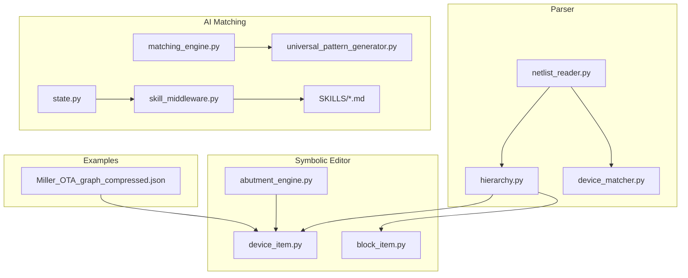
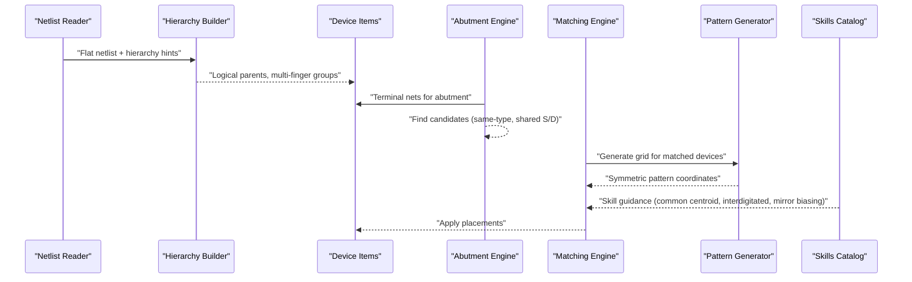
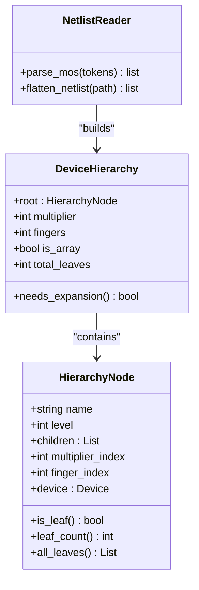
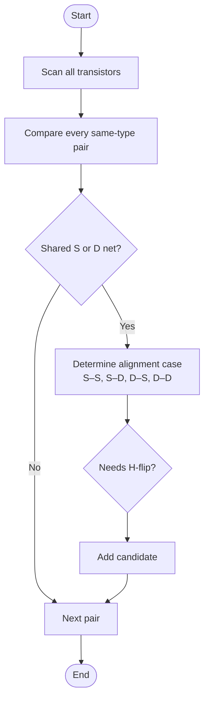
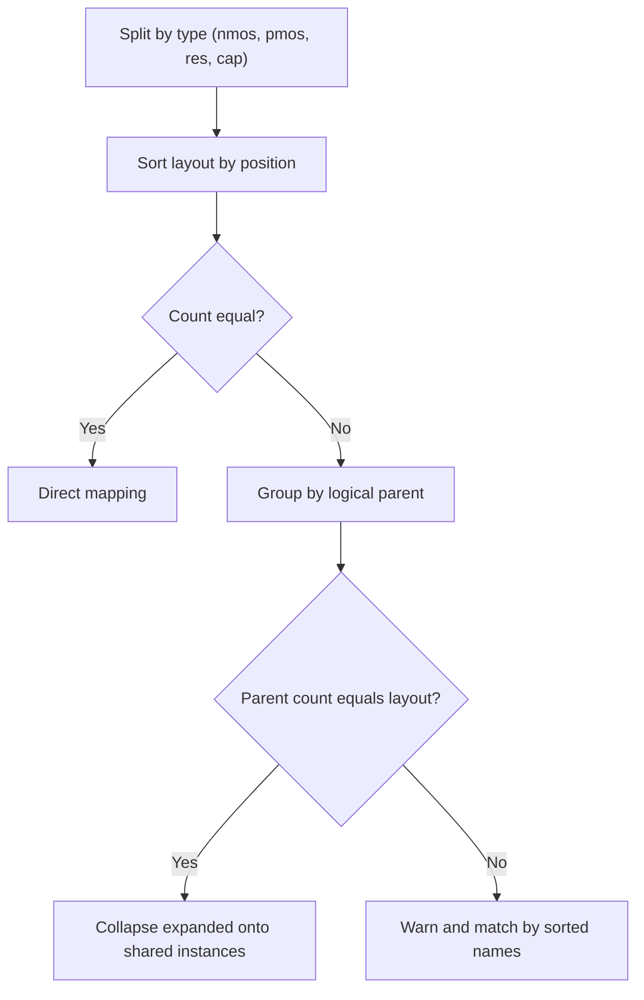
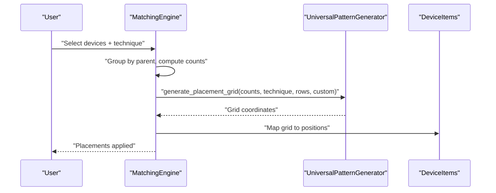
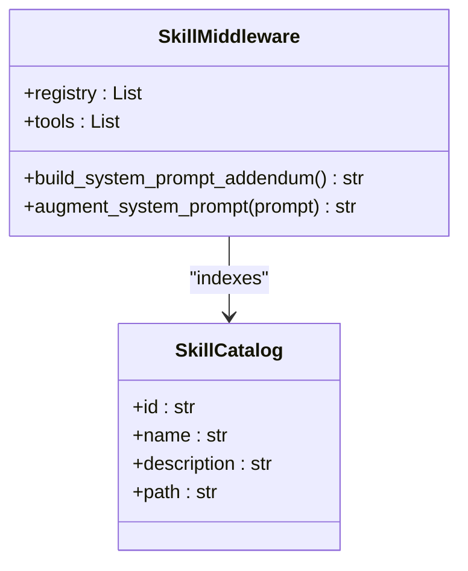
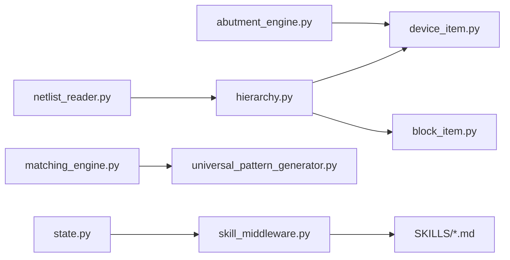

# Advanced Features

<cite>
**Referenced Files in This Document**
- [hierarchy.py](file://parser/hierarchy.py)
- [netlist_reader.py](file://parser/netlist_reader.py)
- [abutment_engine.py](file://symbolic_editor/abutment_engine.py)
- [device_item.py](file://symbolic_editor/device_item.py)
- [block_item.py](file://symbolic_editor/block_item.py)
- [device_matcher.py](file://parser/device_matcher.py)
- [matching_engine.py](file://ai_agent/matching/matching_engine.py)
- [universal_pattern_generator.py](file://ai_agent/matching/universal_pattern_generator.py)
- [common-centroid-matching.md](file://ai_agent/SKILLS/common-centroid-matching.md)
- [interdigitated-matching.md](file://ai_agent/SKILLS/interdigitated-matching.md)
- [mirror-biasing-sequencing.md](file://ai_agent/SKILLS/mirror-biasing-sequencing.md)
- [skill_middleware.py](file://ai_agent/ai_chat_bot/skill_middleware.py)
- [state.py](file://ai_agent/ai_chat_bot/state.py)
- [Miller_OTA_graph_compressed.json](file://examples/Miller_OTA/Miller_OTA_graph_compressed.json)
</cite>

## Table of Contents
1. [Introduction](#introduction)
2. [Project Structure](#project-structure)
3. [Core Components](#core-components)
4. [Architecture Overview](#architecture-overview)
5. [Detailed Component Analysis](#detailed-component-analysis)
6. [Dependency Analysis](#dependency-analysis)
7. [Performance Considerations](#performance-considerations)
8. [Troubleshooting Guide](#troubleshooting-guide)
9. [Conclusion](#conclusion)
10. [Appendices](#appendices)

## Introduction
This document explains the advanced features supporting complex analog IC layout automation: hierarchical design modeling, abutment analysis, and device matching systems. It covers:
- Hierarchical design for multi-level analog circuits with block-level organization
- Abutment analysis for diffusion sharing and minimum-area placement
- Device matching with skill-based techniques (common centroid, interdigitated, mirror biasing)
- Practical workflows and best practices for large-scale layouts

## Project Structure
The advanced features span parser modules (hierarchy, netlist parsing), symbolic editor components (device/block items, abutment engine), and AI agent matching subsystems (pattern generation, skills, and orchestration).

**Diagram sources**
- [hierarchy.py:1-475](file://parser/hierarchy.py#L1-L475)
- [netlist_reader.py:1-855](file://parser/netlist_reader.py#L1-L855)
- [abutment_engine.py:1-225](file://symbolic_editor/abutment_engine.py#L1-L225)
- [device_item.py:1-508](file://symbolic_editor/device_item.py#L1-L508)
- [block_item.py:1-144](file://symbolic_editor/block_item.py#L1-L144)
- [device_matcher.py:1-151](file://parser/device_matcher.py#L1-L151)
- [matching_engine.py:1-95](file://ai_agent/matching/matching_engine.py#L1-L95)
- [universal_pattern_generator.py:1-167](file://ai_agent/matching/universal_pattern_generator.py#L1-L167)
- [skill_middleware.py:1-278](file://ai_agent/ai_chat_bot/skill_middleware.py#L1-L278)
- [state.py:1-37](file://ai_agent/ai_chat_bot/state.py#L1-L37)
- [Miller_OTA_graph_compressed.json:1-186](file://examples/Miller_OTA/Miller_OTA_graph_compressed.json#L1-L186)

**Section sources**
- [hierarchy.py:1-475](file://parser/hierarchy.py#L1-L475)
- [netlist_reader.py:1-855](file://parser/netlist_reader.py#L1-L855)
- [abutment_engine.py:1-225](file://symbolic_editor/abutment_engine.py#L1-L225)
- [device_item.py:1-508](file://symbolic_editor/device_item.py#L1-L508)
- [block_item.py:1-144](file://symbolic_editor/block_item.py#L1-L144)
- [device_matcher.py:1-151](file://parser/device_matcher.py#L1-L151)
- [matching_engine.py:1-95](file://ai_agent/matching/matching_engine.py#L1-L95)
- [universal_pattern_generator.py:1-167](file://ai_agent/matching/universal_pattern_generator.py#L1-L167)
- [skill_middleware.py:1-278](file://ai_agent/ai_chat_bot/skill_middleware.py#L1-L278)
- [state.py:1-37](file://ai_agent/ai_chat_bot/state.py#L1-L37)
- [Miller_OTA_graph_compressed.json:1-186](file://examples/Miller_OTA/Miller_OTA_graph_compressed.json#L1-L186)

## Core Components
- Hierarchical design: Parses multi-level device expansions (multiplier, fingers, arrays) and reconstructs logical parent-child relationships for block-level organization.
- Abutment analysis: Scans transistors to detect compatible pairs sharing a terminal net, enabling diffusion sharing and reduced layout area.
- Device matching: Matches netlist devices to layout instances and applies skill-based placement patterns (common centroid, interdigitated, mirror biasing).
- Skill-based matching: Uses a pattern generator enforcing symmetry and proportionality, integrated with a skill catalog for expert guidance.

**Section sources**
- [hierarchy.py:219-475](file://parser/hierarchy.py#L219-L475)
- [abutment_engine.py:65-225](file://symbolic_editor/abutment_engine.py#L65-L225)
- [device_matcher.py:85-151](file://parser/device_matcher.py#L85-L151)
- [matching_engine.py:13-95](file://ai_agent/matching/matching_engine.py#L13-L95)
- [universal_pattern_generator.py:9-167](file://ai_agent/matching/universal_pattern_generator.py#L9-L167)

## Architecture Overview
The advanced features integrate across parser, editor, and AI agent layers. The netlist reader builds hierarchical structures and device metadata. The symbolic editor exposes device/block items and abutment analysis. The AI matching engine coordinates pattern generation and skill-based placement.

**Diagram sources**
- [netlist_reader.py:726-797](file://parser/netlist_reader.py#L726-L797)
- [hierarchy.py:219-475](file://parser/hierarchy.py#L219-L475)
- [device_item.py:17-508](file://symbolic_editor/device_item.py#L17-L508)
- [abutment_engine.py:65-225](file://symbolic_editor/abutment_engine.py#L65-L225)
- [matching_engine.py:13-95](file://ai_agent/matching/matching_engine.py#L13-L95)
- [universal_pattern_generator.py:9-167](file://ai_agent/matching/universal_pattern_generator.py#L9-L167)
- [common-centroid-matching.md:1-26](file://ai_agent/SKILLS/common-centroid-matching.md#L1-L26)
- [interdigitated-matching.md:1-29](file://ai_agent/SKILLS/interdigitated-matching.md#L1-L29)
- [mirror-biasing-sequencing.md:1-29](file://ai_agent/SKILLS/mirror-biasing-sequencing.md#L1-L29)

## Detailed Component Analysis

### Hierarchical Design Support
Hierarchical design models multi-level device expansions:
- Multiplier (m): Replicates devices along a multiplier axis
- Fingers (nf): Splits a device into multiple fingers
- Arrays (<N>): Indexes copies of a device by 0-based array index

Key capabilities:
- Parse array suffixes and reconstruct hierarchy from expanded devices
- Build DeviceHierarchy trees with levels for multiplier and finger
- Expand hierarchies into leaf Device objects with resolved pin nets and parent pointers

**Diagram sources**
- [hierarchy.py:133-310](file://parser/hierarchy.py#L133-L310)
- [hierarchy.py:183-217](file://parser/hierarchy.py#L183-L217)
- [netlist_reader.py:478-620](file://parser/netlist_reader.py#L478-L620)

**Section sources**
- [hierarchy.py:44-92](file://parser/hierarchy.py#L44-L92)
- [hierarchy.py:219-310](file://parser/hierarchy.py#L219-L310)
- [hierarchy.py:316-418](file://parser/hierarchy.py#L316-L418)
- [hierarchy.py:434-475](file://parser/hierarchy.py#L434-L475)
- [netlist_reader.py:478-620](file://parser/netlist_reader.py#L478-L620)

### Abutment Analysis Engine
The abutment engine identifies compatible transistor pairs for diffusion sharing:
- Filters transistors by type (nmos/pmos)
- Compares shared Source/Drain nets across pairs
- Determines required horizontal flips to align terminals
- Produces candidate lists with shared net and flip flags
- Formats candidates for AI prompts and highlights edges for visualization

**Diagram sources**
- [abutment_engine.py:65-180](file://symbolic_editor/abutment_engine.py#L65-L180)

**Section sources**
- [abutment_engine.py:65-180](file://symbolic_editor/abutment_engine.py#L65-L180)
- [abutment_engine.py:183-225](file://symbolic_editor/abutment_engine.py#L183-L225)

### Device Matching Systems
Device matching aligns netlist devices to layout instances:
- Groups devices by type and sorts by natural order
- Matches by exact count, then by logical parent groups for expanded multi-finger netlists
- Applies spatial sorting for partial matches with warnings
- Supports collapsing expanded logical devices onto shared layout instances

**Diagram sources**
- [device_matcher.py:25-151](file://parser/device_matcher.py#L25-L151)

**Section sources**
- [device_matcher.py:25-151](file://parser/device_matcher.py#L25-L151)

### Skill-Based Matching System
The matching engine coordinates pattern generation and skill-based placement:
- Groups selected devices by logical parent and counts fingers
- Generates placement grids using the universal pattern generator
- Maps grid coordinates to physical positions using device bounding rectangles
- Integrates with skills for common centroid, interdigitated, and mirror biasing

**Diagram sources**
- [matching_engine.py:13-95](file://ai_agent/matching/matching_engine.py#L13-L95)
- [universal_pattern_generator.py:9-167](file://ai_agent/matching/universal_pattern_generator.py#L9-L167)

**Section sources**
- [matching_engine.py:13-95](file://ai_agent/matching/matching_engine.py#L13-L95)
- [universal_pattern_generator.py:9-167](file://ai_agent/matching/universal_pattern_generator.py#L9-L167)

### Skill Catalog and Guidance
The skill middleware discovers markdown-based skills and augments prompts:
- Scans skills directory for frontmatter-only metadata
- Builds a catalog and provides a tool to load full skill content
- Supplies guidance for common centroid, interdigitated, and mirror biasing sequences

**Diagram sources**
- [skill_middleware.py:19-278](file://ai_agent/ai_chat_bot/skill_middleware.py#L19-L278)

**Section sources**
- [skill_middleware.py:19-278](file://ai_agent/ai_chat_bot/skill_middleware.py#L19-L278)
- [common-centroid-matching.md:1-26](file://ai_agent/SKILLS/common-centroid-matching.md#L1-L26)
- [interdigitated-matching.md:1-29](file://ai_agent/SKILLS/interdigitated-matching.md#L1-L29)
- [mirror-biasing-sequencing.md:1-29](file://ai_agent/SKILLS/mirror-biasing-sequencing.md#L1-L29)

## Dependency Analysis
The advanced features exhibit clear separation of concerns:
- Parser modules depend on hierarchy utilities and produce structured device metadata
- Symbolic editor depends on device/block items and abutment engine for visualization and constraints
- AI matching depends on pattern generation and skill catalogs for deterministic placement

**Diagram sources**
- [netlist_reader.py:1-855](file://parser/netlist_reader.py#L1-L855)
- [hierarchy.py:1-475](file://parser/hierarchy.py#L1-L475)
- [device_item.py:1-508](file://symbolic_editor/device_item.py#L1-L508)
- [block_item.py:1-144](file://symbolic_editor/block_item.py#L1-L144)
- [abutment_engine.py:1-225](file://symbolic_editor/abutment_engine.py#L1-L225)
- [matching_engine.py:1-95](file://ai_agent/matching/matching_engine.py#L1-L95)
- [universal_pattern_generator.py:1-167](file://ai_agent/matching/universal_pattern_generator.py#L1-L167)
- [skill_middleware.py:1-278](file://ai_agent/ai_chat_bot/skill_middleware.py#L1-L278)
- [state.py:1-37](file://ai_agent/ai_chat_bot/state.py#L1-L37)

**Section sources**
- [netlist_reader.py:1-855](file://parser/netlist_reader.py#L1-L855)
- [hierarchy.py:1-475](file://parser/hierarchy.py#L1-L475)
- [abutment_engine.py:1-225](file://symbolic_editor/abutment_engine.py#L1-L225)
- [matching_engine.py:1-95](file://ai_agent/matching/matching_engine.py#L1-L95)
- [universal_pattern_generator.py:1-167](file://ai_agent/matching/universal_pattern_generator.py#L1-L167)
- [skill_middleware.py:1-278](file://ai_agent/ai_chat_bot/skill_middleware.py#L1-L278)
- [state.py:1-37](file://ai_agent/ai_chat_bot/state.py#L1-L37)

## Performance Considerations
- Hierarchical expansion: Limit unnecessary expansions by leveraging logical parent grouping and collapsing expanded devices onto shared instances when counts match.
- Abutment scanning: Use targeted checks for same-type pairs and consecutive fingers within the same parent to reduce combinatorial cost.
- Matching: Prefer exact-count matches and logical parent grouping to minimize partial fallbacks and warnings.
- Pattern generation: Ensure device counts satisfy symmetry factors and row constraints to avoid retries and audits.
- Rendering: DeviceItem painting scales with finger count; large multi-finger devices increase rendering cost—use outline mode for large layouts.

[No sources needed since this section provides general guidance]

## Troubleshooting Guide
Common issues and resolutions:
- Abutment candidates not appearing:
  - Verify transistors are same-type and share a non-power Source or Drain net.
  - Confirm array-indexed devices are properly grouped by logical parent.
- Matching mismatches:
  - Check device counts and ensure logical parent grouping aligns with expanded netlist.
  - Use spatial sorting fallback only when necessary.
- Pattern symmetry errors:
  - Ensure even finger counts per device for common centroid 2D.
  - Validate custom pattern counts do not exceed available devices.
- Skill guidance not loaded:
  - Confirm skill files are in the expected directory and have proper frontmatter.
  - Use the load_skill tool to retrieve full skill content.

**Section sources**
- [abutment_engine.py:65-180](file://symbolic_editor/abutment_engine.py#L65-L180)
- [device_matcher.py:111-136](file://parser/device_matcher.py#L111-L136)
- [universal_pattern_generator.py:46-104](file://ai_agent/matching/universal_pattern_generator.py#L46-L104)
- [skill_middleware.py:37-61](file://ai_agent/ai_chat_bot/skill_middleware.py#L37-L61)

## Conclusion
The advanced features provide a robust foundation for complex analog layout automation:
- Hierarchical design enables scalable block-level organization
- Abutment analysis reduces layout area and improves performance
- Device matching integrates deterministic patterns with skill-based guidance
Adhering to best practices and understanding the workflows ensures reliable, high-performance layouts for large-scale designs.

[No sources needed since this section summarizes without analyzing specific files]

## Appendices

### Advanced Workflow Examples and Best Practices
- Hierarchical design:
  - Use array suffixes and multiplier/finger parameters to define multi-level devices.
  - Reconstruct hierarchies from expanded devices to maintain logical parent relationships.
- Abutment analysis:
  - Run abutment analysis after initial placement to identify compatible pairs.
  - Apply manual abutment flags for user overrides and visualize highlighted edges.
- Device matching:
  - Select devices by logical parent groups and choose appropriate techniques (common centroid, interdigitated, mirror biasing).
  - Validate pattern symmetry and adjust custom patterns as needed.
- Large-scale layouts:
  - Prefer exact-count matches and logical parent grouping to minimize partial fallbacks.
  - Use outline rendering mode for improved performance with dense multi-finger devices.
  - Example layout data is available for reference and testing.

**Section sources**
- [Miller_OTA_graph_compressed.json:1-186](file://examples/Miller_OTA/Miller_OTA_graph_compressed.json#L1-L186)
- [device_item.py:247-508](file://symbolic_editor/device_item.py#L247-L508)
- [abutment_engine.py:183-225](file://symbolic_editor/abutment_engine.py#L183-L225)
- [matching_engine.py:13-95](file://ai_agent/matching/matching_engine.py#L13-L95)
- [universal_pattern_generator.py:9-167](file://ai_agent/matching/universal_pattern_generator.py#L9-L167)