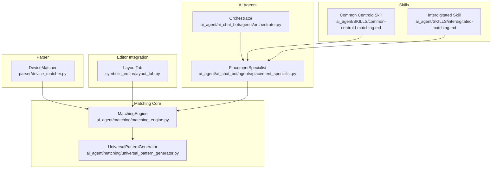
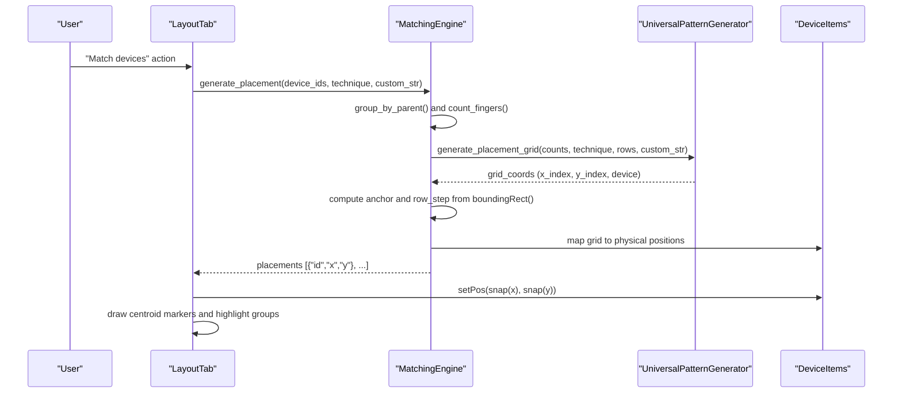
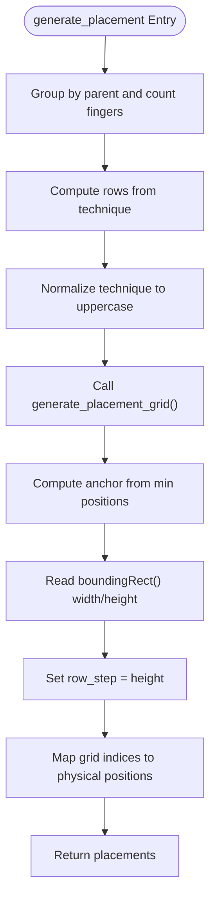
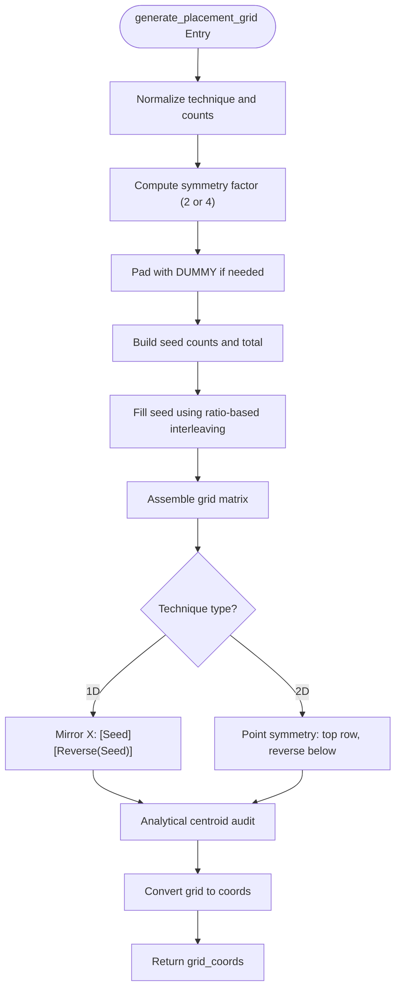
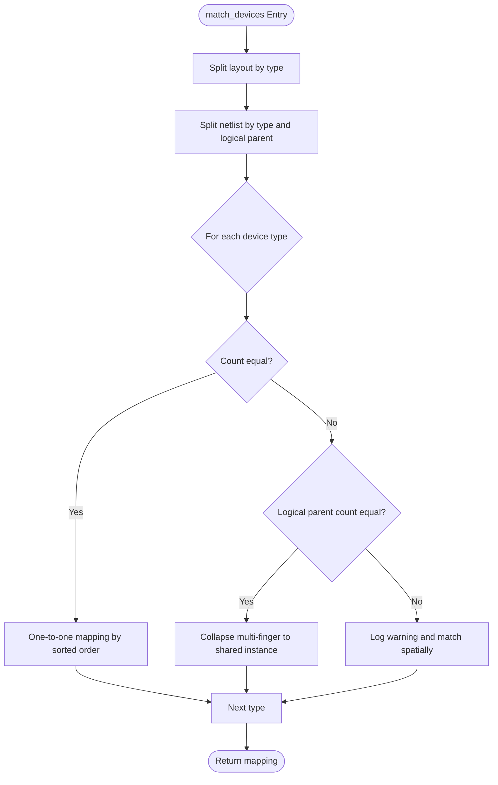
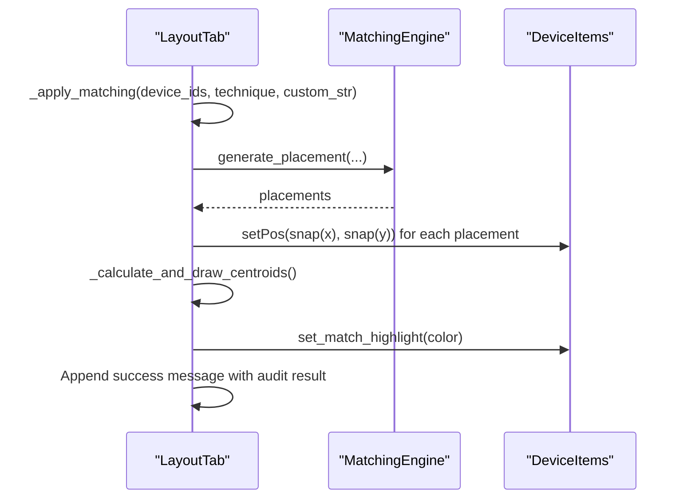
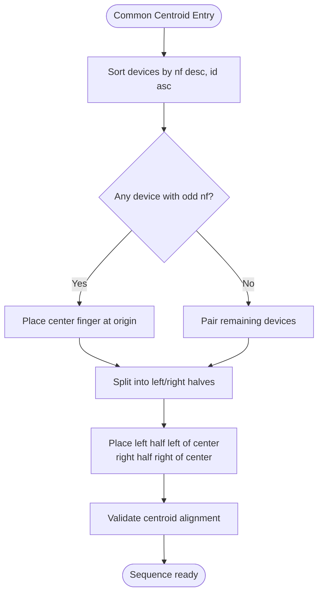
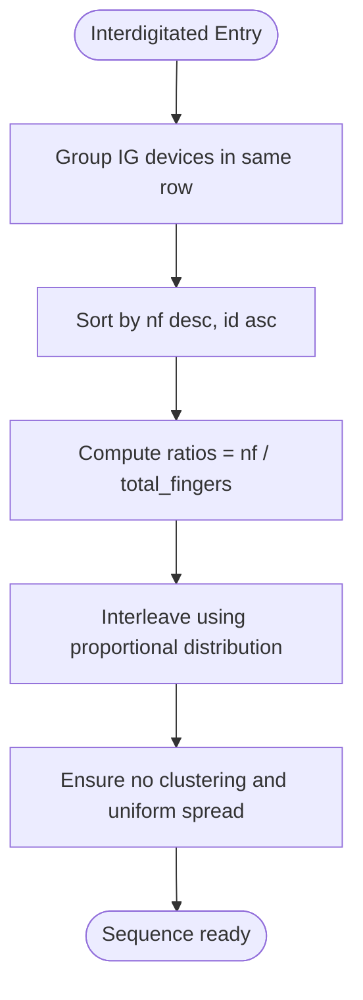
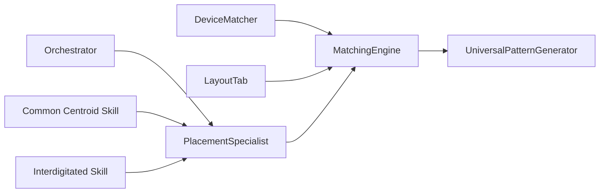

# Device Matching System

<cite>
**Referenced Files in This Document**
- [matching_engine.py](file://ai_agent/matching/matching_engine.py)
- [universal_pattern_generator.py](file://ai_agent/matching/universal_pattern_generator.py)
- [device_matcher.py](file://parser/device_matcher.py)
- [layout_tab.py](file://symbolic_editor/layout_tab.py)
- [placement_specialist.py](file://ai_agent/ai_chat_bot/agents/placement_specialist.py)
- [orchestrator.py](file://ai_agent/ai_chat_bot/agents/orchestrator.py)
- [common-centroid-matching.md](file://ai_agent/SKILLS/common-centroid-matching.md)
- [interdigitated-matching.md](file://ai_agent/SKILLS/interdigitated-matching.md)
- [Current_Mirror_CM.json](file://examples/current_mirror/Current_Mirror_CM.json)
</cite>

## Table of Contents
1. [Introduction](#introduction)
2. [Project Structure](#project-structure)
3. [Core Components](#core-components)
4. [Architecture Overview](#architecture-overview)
5. [Detailed Component Analysis](#detailed-component-analysis)
6. [Dependency Analysis](#dependency-analysis)
7. [Performance Considerations](#performance-considerations)
8. [Troubleshooting Guide](#troubleshooting-guide)
9. [Conclusion](#conclusion)
10. [Appendices](#appendices)

## Introduction
This document describes the device matching system that coordinates geometric layout patterns for optimal analog performance. The system integrates a matching engine with a universal pattern generator to produce mathematically symmetric and deterministic device arrangements. It supports common centroid matching for improved matching accuracy and interdigitated matching for reduced parasitic effects. The system also includes pattern recognition and validation mechanisms to ensure geometric constraints are met and provides practical examples for current mirrors, differential pairs, and active loads.

## Project Structure
The device matching system spans several modules:
- Matching engine: orchestrates device grouping, technique selection, and coordinate mapping.
- Universal pattern generator: computes symmetric placement grids and validates analytical centroids.
- Parser utilities: match netlist devices to layout instances for accurate device identification.
- Symbolic editor integration: applies matching results to the layout and highlights outcomes.
- AI agent skills and specialists: define best practices and enforce deterministic sequencing for matching techniques.
- Examples: demonstrate real-world matching scenarios such as current mirrors.

**Diagram sources**
- [matching_engine.py:5-95](file://ai_agent/matching/matching_engine.py#L5-L95)
- [universal_pattern_generator.py:9-167](file://ai_agent/matching/universal_pattern_generator.py#L9-L167)
- [device_matcher.py:85-151](file://parser/device_matcher.py#L85-L151)
- [layout_tab.py:849-883](file://symbolic_editor/layout_tab.py#L849-L883)
- [placement_specialist.py:1-200](file://ai_agent/ai_chat_bot/agents/placement_specialist.py#L1-L200)
- [orchestrator.py:23-226](file://ai_agent/ai_chat_bot/agents/orchestrator.py#L23-L226)
- [common-centroid-matching.md:1-26](file://ai_agent/SKILLS/common-centroid-matching.md#L1-L26)
- [interdigitated-matching.md:1-29](file://ai_agent/SKILLS/interdigitated-matching.md#L1-L29)

**Section sources**
- [matching_engine.py:5-95](file://ai_agent/matching/matching_engine.py#L5-L95)
- [universal_pattern_generator.py:9-167](file://ai_agent/matching/universal_pattern_generator.py#L9-L167)
- [device_matcher.py:85-151](file://parser/device_matcher.py#L85-L151)
- [layout_tab.py:849-883](file://symbolic_editor/layout_tab.py#L849-L883)
- [placement_specialist.py:1-200](file://ai_agent/ai_chat_bot/agents/placement_specialist.py#L1-L200)
- [orchestrator.py:23-226](file://ai_agent/ai_chat_bot/agents/orchestrator.py#L23-L226)
- [common-centroid-matching.md:1-26](file://ai_agent/SKILLS/common-centroid-matching.md#L1-L26)
- [interdigitated-matching.md:1-29](file://ai_agent/SKILLS/interdigitated-matching.md#L1-L29)

## Core Components
- MatchingEngine: Groups devices by logical parent, selects matching technique, and maps grid coordinates to physical positions using device bounding rectangles and anchor points.
- UniversalPatternGenerator: Generates symmetric placement grids using ratio-based interleaving, enforces symmetry factors, and performs analytical audits to validate centroid alignment.
- DeviceMatcher: Matches netlist devices to layout instances by type, logical parent, and spatial sorting to ensure deterministic mapping.
- LayoutTab integration: Applies generated placements to the editor, snaps positions, draws centroid markers, and highlights matched groups.
- PlacementSpecialist and Orchestrator: Define and enforce deterministic sequencing rules for common centroid, interdigitated, and mirror biasing techniques, and orchestrate multi-agent workflows.

**Section sources**
- [matching_engine.py:13-84](file://ai_agent/matching/matching_engine.py#L13-L84)
- [universal_pattern_generator.py:9-104](file://ai_agent/matching/universal_pattern_generator.py#L9-L104)
- [device_matcher.py:85-151](file://parser/device_matcher.py#L85-L151)
- [layout_tab.py:849-883](file://symbolic_editor/layout_tab.py#L849-L883)
- [placement_specialist.py:15-210](file://ai_agent/ai_chat_bot/agents/placement_specialist.py#L15-L210)
- [orchestrator.py:23-226](file://ai_agent/ai_chat_bot/agents/orchestrator.py#L23-L226)

## Architecture Overview
The matching system follows a layered architecture:
- Input: Selected device IDs and technique selection (common centroid, interdigitated, custom).
- Processing: Grouping by parent, counting fingers, generating a symmetric grid, and mapping to physical coordinates.
- Output: Position updates for layout items and visual feedback via centroid markers and highlights.

**Diagram sources**
- [layout_tab.py:849-883](file://symbolic_editor/layout_tab.py#L849-L883)
- [matching_engine.py:13-84](file://ai_agent/matching/matching_engine.py#L13-L84)
- [universal_pattern_generator.py:9-104](file://ai_agent/matching/universal_pattern_generator.py#L9-L104)

## Detailed Component Analysis

### MatchingEngine
Responsibilities:
- Group devices by logical parent and count fingers per parent.
- Determine row count based on technique (common centroid 2D vs interdigitated).
- Invoke the universal pattern generator to produce grid coordinates.
- Convert grid indices to physical coordinates using device dimensions and anchor positions.
- Map grid devices to available IDs and produce placement results.

Key behaviors:
- Parent grouping ensures multi-finger devices are treated as a unit for matching.
- Row step calculation uses device bounding height to stack rows without gaps.
- Sorting keys support deterministic ordering for device IDs.

**Diagram sources**
- [matching_engine.py:13-84](file://ai_agent/matching/matching_engine.py#L13-L84)

**Section sources**
- [matching_engine.py:13-95](file://ai_agent/matching/matching_engine.py#L13-L95)

### UniversalPatternGenerator
Responsibilities:
- Generate symmetric placement grids for 1D common centroid, 2D common centroid, and interdigitated patterns.
- Enforce symmetry factors: 2 for 1D, 4 for 2D common centroid.
- Use ratio-based interleaving to distribute fingers proportionally.
- Validate centroid alignment analytically and reject asymmetric layouts.

Core logic:
- Padding with dummy devices to meet symmetry requirements.
- Building a seed list from ratio targets and interleaving to fill the grid.
- Mirroring for 1D and point symmetry for 2D.
- Analytical audit to ensure centroids align with grid center.

**Diagram sources**
- [universal_pattern_generator.py:9-104](file://ai_agent/matching/universal_pattern_generator.py#L9-L104)
- [universal_pattern_generator.py:106-131](file://ai_agent/matching/universal_pattern_generator.py#L106-L131)
- [universal_pattern_generator.py:148-154](file://ai_agent/matching/universal_pattern_generator.py#L148-L154)

**Section sources**
- [universal_pattern_generator.py:9-167](file://ai_agent/matching/universal_pattern_generator.py#L9-L167)

### DeviceMatcher
Responsibilities:
- Split layout devices by type (NMOS, PMOS, resistors, capacitors).
- Split netlist devices by type and logical parent.
- Match layout instances to netlist devices deterministically:
  - Prefer exact leaf-device count match.
  - Fall back to collapsing multi-finger logical parents onto shared instances.
  - Warn on partial matches and sort spatially otherwise.

**Diagram sources**
- [device_matcher.py:85-151](file://parser/device_matcher.py#L85-L151)

**Section sources**
- [device_matcher.py:85-151](file://parser/device_matcher.py#L85-L151)

### LayoutTab Integration
Responsibilities:
- Trigger matching workflow, synchronize positions, and push undo snapshots.
- Apply generated placements to device items with snapping.
- Calculate and draw centroid markers per parent group.
- Highlight matched groups with distinct colors and report audit results.

**Diagram sources**
- [layout_tab.py:849-883](file://symbolic_editor/layout_tab.py#L849-L883)

**Section sources**
- [layout_tab.py:849-905](file://symbolic_editor/layout_tab.py#L849-L905)

### Specialized Matching Techniques

#### Common Centroid Matching
Guidance:
- Build a centroid-safe sequence for all devices in the same row group.
- Preserve device IDs and finger counts exactly.
- Enforce symmetry during construction and reject layouts that break centroid balance.

**Diagram sources**
- [placement_specialist.py:111-130](file://ai_agent/ai_chat_bot/agents/placement_specialist.py#L111-L130)
- [common-centroid-matching.md:13-26](file://ai_agent/SKILLS/common-centroid-matching.md#L13-L26)

**Section sources**
- [placement_specialist.py:111-130](file://ai_agent/ai_chat_bot/agents/placement_specialist.py#L111-L130)
- [common-centroid-matching.md:13-26](file://ai_agent/SKILLS/common-centroid-matching.md#L13-L26)

#### Interdigitated Matching
Guidance:
- Process all interdigitated devices in the same row as one unified group.
- Distribute fingers proportionally using ratio-based interleaving.
- Avoid terminal clustering and maintain spread across the row.

**Diagram sources**
- [placement_specialist.py:132-196](file://ai_agent/ai_chat_bot/agents/placement_specialist.py#L132-L196)
- [interdigitated-matching.md:16-29](file://ai_agent/SKILLS/interdigitated-matching.md#L16-L29)

**Section sources**
- [placement_specialist.py:132-196](file://ai_agent/ai_chat_bot/agents/placement_specialist.py#L132-L196)
- [interdigitated-matching.md:16-29](file://ai_agent/SKILLS/interdigitated-matching.md#L16-L29)

### Practical Applications

#### Current Mirrors
Current mirrors benefit from mirror biasing and common centroid matching to achieve matched pairs with balanced centroids. The system supports:
- Deterministic sequencing for matched pairs.
- Symmetric mirror interdigitation to preserve ratios and minimize mismatches.

Example reference:
- [Current_Mirror_CM.json:1-200](file://examples/current_mirror/Current_Mirror_CM.json#L1-L200)

**Section sources**
- [Current_Mirror_CM.json:1-200](file://examples/current_mirror/Current_Mirror_CM.json#L1-L200)

#### Differential Pairs
Differential pairs commonly use common centroid matching to improve device matching accuracy and reduce process-gradient mismatch. The system’s analytical audit ensures centroid alignment across the grid.

#### Active Loads
Active loads often employ interdigitated matching to reduce parasitic effects and improve routing regularity. Ratio-based interleaving distributes fingers evenly across the row.

### Pattern Recognition and Validation
Pattern recognition:
- DeviceMatcher identifies device types and logical parents to ensure correct mapping.
- MatchingEngine groups devices by parent and sorts IDs for deterministic ordering.

Validation:
- UniversalPatternGenerator performs analytical centroid audits to reject asymmetric layouts.
- LayoutTab highlights matched groups and reports audit results.

**Section sources**
- [device_matcher.py:85-151](file://parser/device_matcher.py#L85-L151)
- [universal_pattern_generator.py:106-131](file://ai_agent/matching/universal_pattern_generator.py#L106-L131)
- [layout_tab.py:869-873](file://symbolic_editor/layout_tab.py#L869-L873)

## Dependency Analysis
The matching system exhibits clear separation of concerns:
- MatchingEngine depends on UniversalPatternGenerator for grid computation.
- LayoutTab integrates MatchingEngine and updates device positions.
- DeviceMatcher provides device mapping for matching operations.
- PlacementSpecialist and Orchestrator define and enforce deterministic sequencing rules.

**Diagram sources**
- [device_matcher.py:85-151](file://parser/device_matcher.py#L85-L151)
- [matching_engine.py:13-40](file://ai_agent/matching/matching_engine.py#L13-L40)
- [universal_pattern_generator.py:9-104](file://ai_agent/matching/universal_pattern_generator.py#L9-L104)
- [layout_tab.py:849-883](file://symbolic_editor/layout_tab.py#L849-L883)
- [placement_specialist.py:1-200](file://ai_agent/ai_chat_bot/agents/placement_specialist.py#L1-L200)
- [orchestrator.py:23-226](file://ai_agent/ai_chat_bot/agents/orchestrator.py#L23-L226)
- [common-centroid-matching.md:1-26](file://ai_agent/SKILLS/common-centroid-matching.md#L1-L26)
- [interdigitated-matching.md:1-29](file://ai_agent/SKILLS/interdigitated-matching.md#L1-L29)

**Section sources**
- [device_matcher.py:85-151](file://parser/device_matcher.py#L85-L151)
- [matching_engine.py:13-40](file://ai_agent/matching/matching_engine.py#L13-L40)
- [universal_pattern_generator.py:9-104](file://ai_agent/matching/universal_pattern_generator.py#L9-L104)
- [layout_tab.py:849-883](file://symbolic_editor/layout_tab.py#L849-L883)
- [placement_specialist.py:1-200](file://ai_agent/ai_chat_bot/agents/placement_specialist.py#L1-L200)
- [orchestrator.py:23-226](file://ai_agent/ai_chat_bot/agents/orchestrator.py#L23-L226)
- [common-centroid-matching.md:1-26](file://ai_agent/SKILLS/common-centroid-matching.md#L1-L26)
- [interdigitated-matching.md:1-29](file://ai_agent/SKILLS/interdigitated-matching.md#L1-L29)

## Performance Considerations
- Complexity:
  - MatchingEngine: O(P + G) where P is the number of parents and G is the number of grid coordinates.
  - UniversalPatternGenerator: O(F) for interleaving where F is the total number of fingers; matrix assembly is O(R×C).
- Large-scale operations:
  - Minimize repeated bounding rectangle queries by caching device dimensions.
  - Batch device updates in LayoutTab to reduce UI refresh overhead.
  - Use deterministic sorting to avoid re-computation on identical inputs.
- Symmetry enforcement:
  - Early padding with dummy devices prevents repeated retries due to symmetry violations.
  - Analytical audit occurs once per generation to catch invalid patterns immediately.

[No sources needed since this section provides general guidance]

## Troubleshooting Guide
Common issues and resolutions:
- Centroid misalignment:
  - Symptom: Failure message indicating centroids misaligned.
  - Cause: Analytical audit rejects layouts that do not satisfy centroid equality.
  - Resolution: Adjust device counts to meet symmetry factors or switch to a compatible technique.
- Device count mismatch:
  - Symptom: Warning about partial matching due to count mismatch.
  - Cause: Netlist and layout counts differ or logical parent collapse is needed.
  - Resolution: Ensure multi-finger devices are collapsed onto shared instances or adjust netlist.
- Terminal clustering in interdigitated patterns:
  - Symptom: Clustering at ends of the row.
  - Cause: Proportional interleaving not properly enforced.
  - Resolution: Re-run with ratio-based interleaving and verify uniform spread.

**Section sources**
- [layout_tab.py:875-882](file://symbolic_editor/layout_tab.py#L875-L882)
- [universal_pattern_generator.py:106-131](file://ai_agent/matching/universal_pattern_generator.py#L106-L131)
- [device_matcher.py:116-136](file://parser/device_matcher.py#L116-L136)

## Conclusion
The device matching system combines deterministic pattern generation with analytical validation to achieve optimal analog performance. By coordinating device grouping, symmetric grid generation, and precise coordinate mapping, it supports advanced techniques such as common centroid and interdigitated matching. The system’s pattern recognition and validation mechanisms ensure geometric constraints are met, while practical examples demonstrate its applicability to current mirrors, differential pairs, and active loads.

[No sources needed since this section summarizes without analyzing specific files]

## Appendices

### Best Practices for Optimal Matching Results
- Prefer common centroid matching for matched pairs requiring balanced centroids.
- Use interdigitated matching for routing-friendly mixing and reduced parasitics.
- Ensure device counts meet symmetry factors to avoid dummy padding and rejections.
- Validate centroid alignment post-placement and adjust techniques as needed.
- Collapse multi-finger logical parents to shared instances for accurate mapping.

[No sources needed since this section provides general guidance]