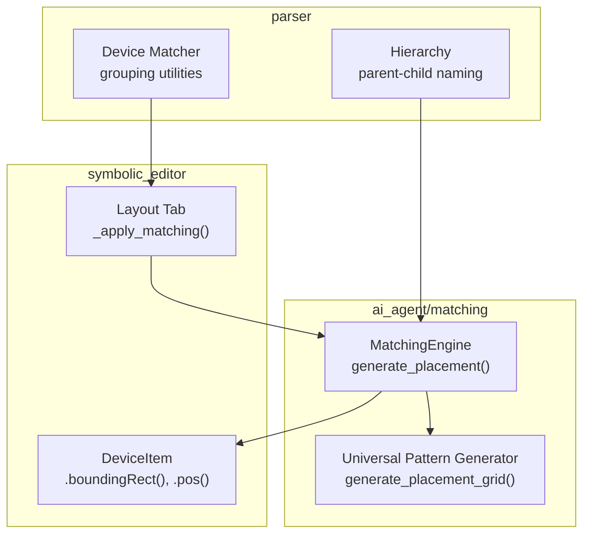
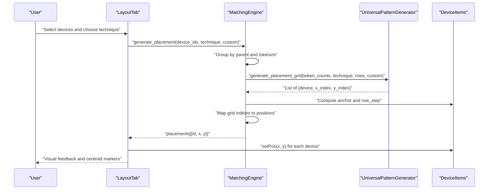
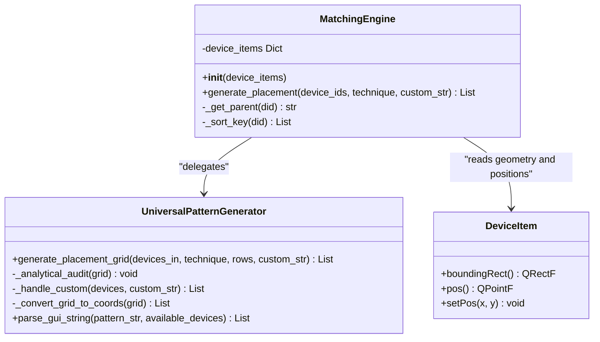
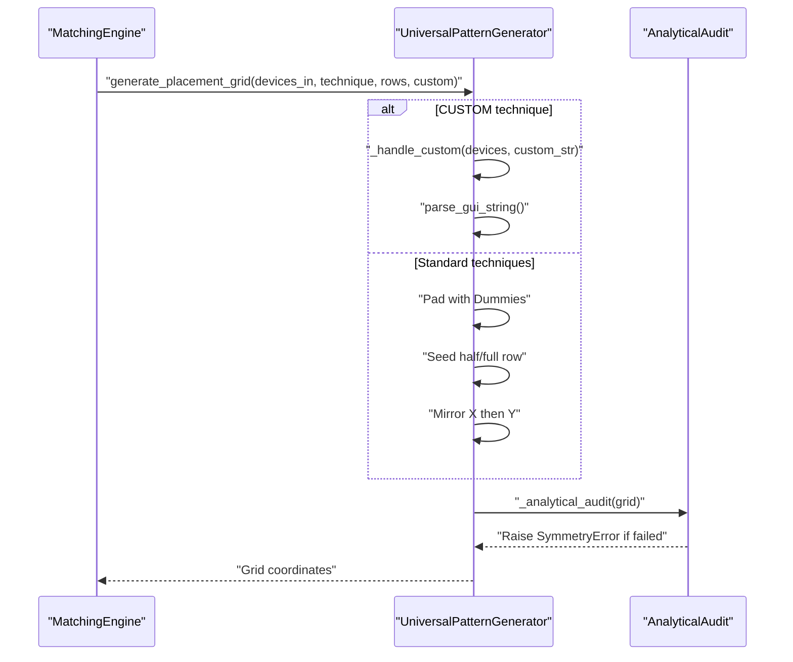
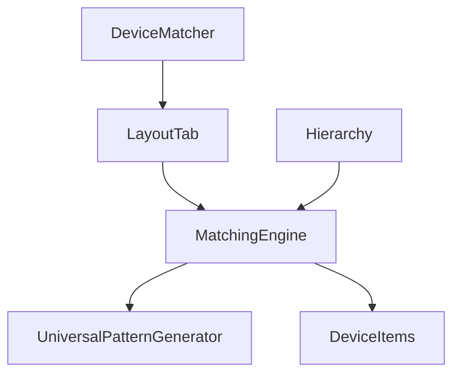

# Matching Engine Core

<cite>
**Referenced Files in This Document**
- [matching_engine.py](file://ai_agent/matching/matching_engine.py)
- [universal_pattern_generator.py](file://ai_agent/matching/universal_pattern_generator.py)
- [layout_tab.py](file://symbolic_editor/layout_tab.py)
- [device_item.py](file://symbolic_editor/device_item.py)
- [hierarchy.py](file://parser/hierarchy.py)
- [device_matcher.py](file://parser/device_matcher.py)
- [test_match3.py](file://tests/test_match3.py)
</cite>

## Table of Contents
1. [Introduction](#introduction)
2. [Project Structure](#project-structure)
3. [Core Components](#core-components)
4. [Architecture Overview](#architecture-overview)
5. [Detailed Component Analysis](#detailed-component-analysis)
6. [Dependency Analysis](#dependency-analysis)
7. [Performance Considerations](#performance-considerations)
8. [Troubleshooting Guide](#troubleshooting-guide)
9. [Conclusion](#conclusion)

## Introduction
This document explains the Matching Engine core component that orchestrates device matching operations in the analog layout automation system. The MatchingEngine class is the central coordinator for applying matching techniques such as interdigitated, common centroid (1D and 2D), and custom patterns. It groups devices by their logical parents, generates an abstract grid pattern using the universal pattern generator, and maps the resulting grid coordinates to physical device positions on the layout canvas.

## Project Structure
The matching engine resides in the ai_agent/matching package and integrates with the symbolic editor’s layout tab and device items. The universal pattern generator encapsulates the symmetry-aware pattern synthesis logic. Device grouping and parent-child relationships are derived from the hierarchy model and device matcher utilities.

**Diagram sources**
- [matching_engine.py:13-84](file://ai_agent/matching/matching_engine.py#L13-L84)
- [universal_pattern_generator.py:9-104](file://ai_agent/matching/universal_pattern_generator.py#L9-L104)
- [layout_tab.py:849-883](file://symbolic_editor/layout_tab.py#L849-L883)
- [device_item.py:17-508](file://symbolic_editor/device_item.py#L17-L508)
- [hierarchy.py:129-310](file://parser/hierarchy.py#L129-L310)
- [device_matcher.py:25-77](file://parser/device_matcher.py#L25-L77)

**Section sources**
- [matching_engine.py:1-95](file://ai_agent/matching/matching_engine.py#L1-L95)
- [universal_pattern_generator.py:1-167](file://ai_agent/matching/universal_pattern_generator.py#L1-L167)
- [layout_tab.py:849-883](file://symbolic_editor/layout_tab.py#L849-L883)
- [device_item.py:17-508](file://symbolic_editor/device_item.py#L17-L508)
- [hierarchy.py:129-310](file://parser/hierarchy.py#L129-L310)
- [device_matcher.py:25-77](file://parser/device_matcher.py#L25-L77)

## Core Components
- MatchingEngine: Central coordinator that groups devices by parent, selects matching technique, delegates pattern generation to the universal pattern generator, and transforms abstract grid coordinates into physical device positions.
- Universal Pattern Generator: Implements symmetry-aware pattern synthesis for interdigitated and common centroid configurations, including 2D point symmetry and analytical audit.
- Layout Tab Integration: Provides the UI workflow to select devices, choose a technique, and apply matching with visual feedback.
- Device Items: Provide geometry and position APIs used by the MatchingEngine to compute anchors and row steps.
- Hierarchy Utilities: Define parent-child naming conventions and assist in grouping devices by logical parents.
- Device Matcher: Offers grouping utilities for device types and logical parents used during matching.

**Section sources**
- [matching_engine.py:5-95](file://ai_agent/matching/matching_engine.py#L5-L95)
- [universal_pattern_generator.py:9-167](file://ai_agent/matching/universal_pattern_generator.py#L9-L167)
- [layout_tab.py:849-883](file://symbolic_editor/layout_tab.py#L849-L883)
- [device_item.py:17-508](file://symbolic_editor/device_item.py#L17-L508)
- [hierarchy.py:129-310](file://parser/hierarchy.py#L129-L310)
- [device_matcher.py:25-77](file://parser/device_matcher.py#L25-L77)

## Architecture Overview
The MatchingEngine orchestrates a pipeline:
1. Device grouping by parent using regex-based parent detection.
2. Tokenization of parents into tokens (M0, M1, ...) for pattern generation.
3. Delegation to the universal pattern generator to produce grid coordinates.
4. Coordinate transformation from abstract grid indices to physical positions using device dimensions and anchor positioning.
5. Application of positions to DeviceItems and visual feedback in the layout tab.

**Diagram sources**
- [layout_tab.py:849-883](file://symbolic_editor/layout_tab.py#L849-L883)
- [matching_engine.py:13-84](file://ai_agent/matching/matching_engine.py#L13-L84)
- [universal_pattern_generator.py:9-104](file://ai_agent/matching/universal_pattern_generator.py#L9-L104)

## Detailed Component Analysis

### MatchingEngine Class
The MatchingEngine class encapsulates the orchestration of matching operations. Its primary responsibilities include:
- Grouping devices by parent using a regex-based parent detection method.
- Tokenizing parents into tokens (M0, M1, ...) for pattern generation.
- Determining the number of rows for 2D common centroid matching.
- Delegating pattern generation to the universal pattern generator.
- Transforming abstract grid coordinates into physical positions using device dimensions and anchor positioning.
- Sorting child devices by numeric suffix to ensure deterministic ordering.

Key methods and behaviors:
- generate_placement(device_ids, technique, custom_str): Main entry point that orchestrates grouping, pattern generation, and coordinate mapping.
- _get_parent(did): Extracts the logical parent prefix from a device ID using a regex pattern.
- _sort_key(did): Provides a numeric sort key for device IDs to ensure deterministic ordering within a parent group.

Coordinate mapping specifics:
- Anchor position is computed as the minimum x and y among selected devices.
- Row step equals the device height to achieve tight vertical stacking without gaps.
- Width-based horizontal spacing uses the device width as the step.

Token-based device identification:
- Parents are mapped to tokens M0, M1, M2, ... based on sorted parent order.
- Counts per token reflect the number of child devices per parent.

Integration with the universal pattern generator:
- The technique is normalized to uppercase and rows are determined based on technique and custom string.
- For 2D common centroid, exactly two rows are enforced.

Practical examples:
- Interdigitated matching: Uses 1D mirroring with half-row seeding and symmetric reflection.
- Common centroid 2D: Enforces even finger counts per device and mirrors the top row onto the bottom row.
- Custom pattern: Accepts a GUI-style string with rows separated by “/” and character-based tokens mapped to available devices.

**Section sources**
- [matching_engine.py:5-95](file://ai_agent/matching/matching_engine.py#L5-L95)

#### Class Diagram

**Diagram sources**
- [matching_engine.py:5-95](file://ai_agent/matching/matching_engine.py#L5-L95)
- [universal_pattern_generator.py:9-167](file://ai_agent/matching/universal_pattern_generator.py#L9-L167)
- [device_item.py:17-508](file://symbolic_editor/device_item.py#L17-L508)

### Universal Pattern Generator
The universal pattern generator implements symmetry-aware pattern synthesis:
- Technique normalization and row determination.
- Dummy padding to satisfy symmetry factors (factor of 2 for 1D CC, 4 for 2D CC).
- Half-row seeding for 1D and full-row seeding for 2D.
- Mirroring strategies: 1D mirrored halves, 2D mirrored top/bottom rows.
- Analytical audit to verify centroid alignment within tolerance.
- Custom pattern support via GUI string parsing and validation.

Symmetry enforcement:
- For 2D common centroid, even finger counts per device are required.
- The audit ensures that each device’s centroid aligns with the grid center within a small tolerance.

Custom pattern parsing:
- Rows are separated by “/”.
- Character tokens are mapped to available devices (uppercase for top row, lowercase for bottom row).
- Count validation prevents exceeding available devices.

**Section sources**
- [universal_pattern_generator.py:9-167](file://ai_agent/matching/universal_pattern_generator.py#L9-L167)

#### Sequence Diagram: Pattern Generation

**Diagram sources**
- [universal_pattern_generator.py:9-104](file://ai_agent/matching/universal_pattern_generator.py#L9-L104)
- [universal_pattern_generator.py:106-131](file://ai_agent/matching/universal_pattern_generator.py#L106-L131)
- [universal_pattern_generator.py:132-146](file://ai_agent/matching/universal_pattern_generator.py#L132-L146)
- [universal_pattern_generator.py:156-166](file://ai_agent/matching/universal_pattern_generator.py#L156-L166)

### Parent-Child Relationship Detection and Tokenization
Parent-child relationships are inferred from device naming conventions:
- Parent detection uses a regex that captures the base prefix before suffixes like “_m” or “_f”.
- Sorting keys extract numeric suffixes to ensure deterministic ordering within a parent group.
- Tokenization maps sorted parents to tokens M0, M1, M2, ... for pattern generation.

Integration with hierarchy utilities:
- The hierarchy module defines naming conventions for arrays, multipliers, and fingers.
- These conventions inform the MatchingEngine’s parent detection and sorting logic.

**Section sources**
- [matching_engine.py:86-95](file://ai_agent/matching/matching_engine.py#L86-L95)
- [hierarchy.py:129-310](file://parser/hierarchy.py#L129-L310)

### Coordinate Mapping and Anchor Positioning
The MatchingEngine maps abstract grid coordinates to physical positions:
- Anchor position is the top-left of the selected device group.
- Row step equals the device height to stack devices tightly.
- Horizontal step equals the device width to space devices evenly.
- Positions are snapped to the editor’s snap value before applying.

Visual feedback:
- The layout tab computes and displays centroid markers per parent group.
- Highlights indicate success or failure of matching.

**Section sources**
- [matching_engine.py:42-84](file://ai_agent/matching/matching_engine.py#L42-L84)
- [layout_tab.py:885-905](file://symbolic_editor/layout_tab.py#L885-L905)

### Practical Examples of Matching Operations
- Interdigitated matching: Select two or more devices of the same type; the engine produces a symmetric interdigitated pattern with 1D mirroring.
- Common centroid 2D: Select devices requiring 2D common centroid; the engine enforces even finger counts and mirrors the top row onto the bottom row.
- Custom pattern: Provide a GUI-style pattern string with rows separated by “/”; the engine parses and validates the pattern against available devices.

Integration with the layout tab:
- The layout tab triggers MatchingEngine, applies positions to DeviceItems, and updates visual feedback and centroid markers.

Validation and error handling:
- Symmetry errors are raised when patterns fail the analytical audit.
- The layout tab catches exceptions and provides user feedback.

**Section sources**
- [layout_tab.py:849-883](file://symbolic_editor/layout_tab.py#L849-L883)
- [universal_pattern_generator.py:106-131](file://ai_agent/matching/universal_pattern_generator.py#L106-L131)
- [test_match3.py:13-35](file://tests/test_match3.py#L13-L35)

## Dependency Analysis
The MatchingEngine depends on:
- Universal Pattern Generator for symmetry-aware pattern synthesis.
- DeviceItems for geometry and position APIs.
- Layout tab for UI orchestration and visual feedback.
- Hierarchy utilities for parent-child naming conventions.
- Device matcher for grouping utilities.

**Diagram sources**
- [matching_engine.py:13-84](file://ai_agent/matching/matching_engine.py#L13-L84)
- [universal_pattern_generator.py:9-104](file://ai_agent/matching/universal_pattern_generator.py#L9-L104)
- [layout_tab.py:849-883](file://symbolic_editor/layout_tab.py#L849-L883)
- [hierarchy.py:129-310](file://parser/hierarchy.py#L129-L310)
- [device_matcher.py:25-77](file://parser/device_matcher.py#L25-L77)

**Section sources**
- [matching_engine.py:13-84](file://ai_agent/matching/matching_engine.py#L13-L84)
- [universal_pattern_generator.py:9-104](file://ai_agent/matching/universal_pattern_generator.py#L9-L104)
- [layout_tab.py:849-883](file://symbolic_editor/layout_tab.py#L849-L883)
- [hierarchy.py:129-310](file://parser/hierarchy.py#L129-L310)
- [device_matcher.py:25-77](file://parser/device_matcher.py#L25-L77)

## Performance Considerations
- Complexity of pattern generation: The universal pattern generator uses ratio-based interleaving to seed rows, which scales with the total number of fingers. For large groups, consider batching or limiting the number of devices per operation.
- Coordinate mapping: The mapping stage iterates over grid coordinates and assigns positions to available devices. For very large grids, ensure device availability lists are efficiently maintained.
- Sorting overhead: Parent and child sorting rely on regex-based numeric keys. For extremely large datasets, precompute and cache sort keys if repeated operations are performed.
- UI updates: Applying positions and updating visuals can be frequent. Batch updates and minimize redundant repaints in the layout tab for smoother performance.

[No sources needed since this section provides general guidance]

## Troubleshooting Guide
Common issues and resolutions:
- Symmetry errors: Occur when the analytical audit fails. Verify that 2D common centroid constraints are met (even finger counts per device) and that the pattern satisfies grid symmetry.
- Parent detection mismatches: Ensure device IDs follow expected naming conventions (e.g., base prefix before “_m” or “_f”). Adjust IDs or update parent detection logic if needed.
- Position conflicts: Confirm that the anchor position and row step calculations align with device dimensions. Snap values and grid constraints should be consistent.
- Custom pattern validation: Ensure the custom pattern string uses valid tokens and does not exceed available device counts.

**Section sources**
- [universal_pattern_generator.py:106-131](file://ai_agent/matching/universal_pattern_generator.py#L106-L131)
- [universal_pattern_generator.py:132-146](file://ai_agent/matching/universal_pattern_generator.py#L132-L146)
- [layout_tab.py:875-882](file://symbolic_editor/layout_tab.py#L875-L882)

## Conclusion
The MatchingEngine serves as the central coordinator for analog device matching, integrating parent-child grouping, symmetry-aware pattern generation, and precise coordinate mapping. By leveraging the universal pattern generator and DeviceItems’ geometry APIs, it enables robust and repeatable matching across interdigitated, common centroid, and custom configurations. Proper adherence to naming conventions, symmetry constraints, and coordinate mapping ensures optimal matching results at scale.