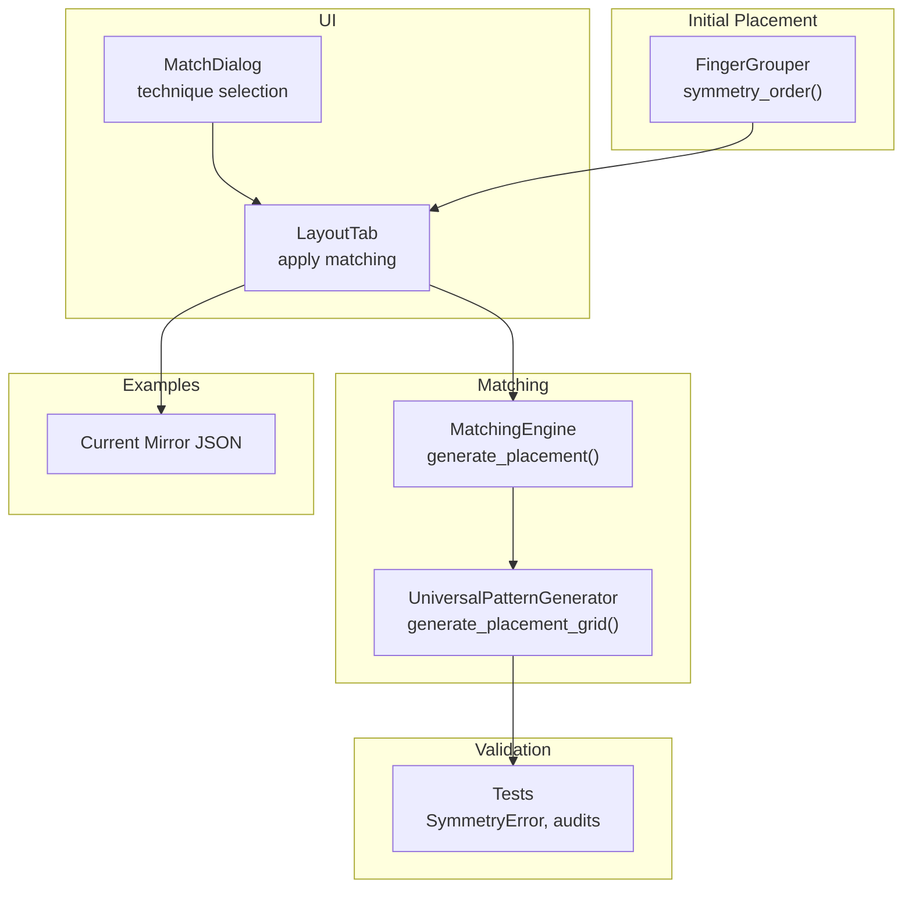
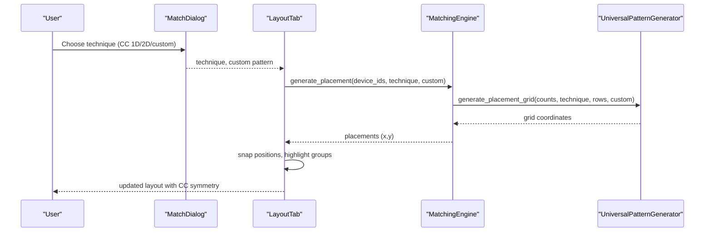
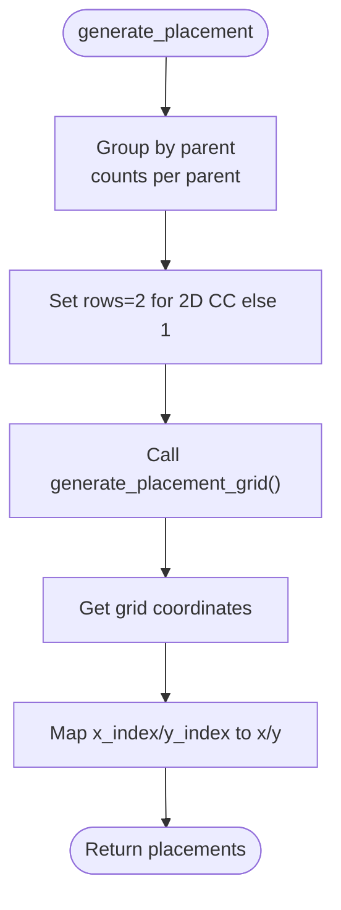
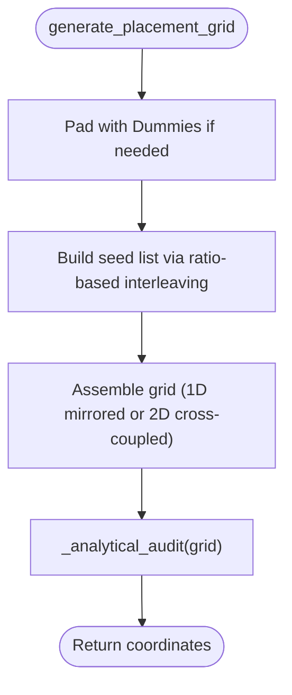
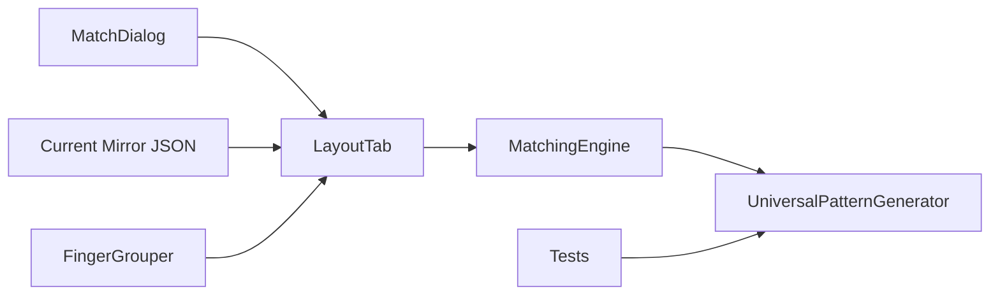

# Common Centroid Matching

<cite>
**Referenced Files in This Document**
- [matching_engine.py](file://ai_agent/matching/matching_engine.py)
- [universal_pattern_generator.py](file://ai_agent/matching/universal_pattern_generator.py)
- [common-centroid-matching.md](file://ai_agent/SKILLS/common-centroid-matching.md)
- [match_dialog.py](file://symbolic_editor/dialogs/match_dialog.py)
- [layout_tab.py](file://symbolic_editor/layout_tab.py)
- [test_review_fixes.py](file://tests/test_review_fixes.py)
- [Current_Mirror_CM.json](file://examples/current_mirror/Current_Mirror_CM.json)
- [Current_Mirror_CM_initial_placement.json](file://examples/current_mirror/Current_Mirror_CM_initial_placement.json)
- [device_matcher.py](file://parser/device_matcher.py)
- [finger_grouper.py](file://ai_agent/ai_initial_placement/finger_grouper.py)
- [placement_specialist.py](file://ai_agent/ai_chat_bot/agents/placement_specialist.py)
</cite>

## Table of Contents
1. [Introduction](#introduction)
2. [Project Structure](#project-structure)
3. [Core Components](#core-components)
4. [Architecture Overview](#architecture-overview)
5. [Detailed Component Analysis](#detailed-component-analysis)
6. [Dependency Analysis](#dependency-analysis)
7. [Performance Considerations](#performance-considerations)
8. [Troubleshooting Guide](#troubleshooting-guide)
9. [Conclusion](#conclusion)
10. [Appendices](#appendices)

## Introduction
This document explains the common centroid (CC) matching technique used in analog layout automation. CC matching reduces process-induced mismatches by enforcing geometric symmetry around a central axis or point, canceling out linear and higher-order gradients across the chip. The repository implements a robust, deterministic pipeline that:
- Groups matched devices by logical parent
- Builds a centroid-safe pattern using ratio-based interleaving
- Enforces symmetry via mirroring (1D or 2D)
- Audits centroid equality analytically
- Maps grid coordinates to physical layout positions

Practical examples in the repository demonstrate CC matching in current mirrors and differential pairs, along with guidance for device grouping, centroid calculation, and layout optimization.

## Project Structure
The CC matching capability spans several modules:
- Matching engine: orchestrates device grouping and placement generation
- Pattern generator: builds symmetric grids and validates centroid balance
- UI dialog: exposes CC techniques to users
- Tests: validate symmetry and error conditions
- Examples: show CC layouts for current mirrors
- Initial placement: integrates symmetry-aware row assignment and grouping

**Diagram sources**
- [matching_engine.py:13-84](file://ai_agent/matching/matching_engine.py#L13-L84)
- [universal_pattern_generator.py:9-104](file://ai_agent/matching/universal_pattern_generator.py#L9-L104)
- [match_dialog.py:160-168](file://symbolic_editor/dialogs/match_dialog.py#L160-L168)
- [layout_tab.py:849-872](file://symbolic_editor/layout_tab.py#L849-L872)
- [test_review_fixes.py:47-64](file://tests/test_review_fixes.py#L47-L64)
- [Current_Mirror_CM.json:1-200](file://examples/current_mirror/Current_Mirror_CM.json#L1-L200)
- [finger_grouper.py:1076-1156](file://ai_agent/ai_initial_placement/finger_grouper.py#L1076-L1156)

**Section sources**
- [matching_engine.py:1-95](file://ai_agent/matching/matching_engine.py#L1-L95)
- [universal_pattern_generator.py:1-167](file://ai_agent/matching/universal_pattern_generator.py#L1-L167)
- [match_dialog.py:1-172](file://symbolic_editor/dialogs/match_dialog.py#L1-L172)
- [layout_tab.py:849-872](file://symbolic_editor/layout_tab.py#L849-L872)
- [test_review_fixes.py:47-64](file://tests/test_review_fixes.py#L47-L64)
- [Current_Mirror_CM.json:1-200](file://examples/current_mirror/Current_Mirror_CM.json#L1-L200)
- [finger_grouper.py:1076-1156](file://ai_agent/ai_initial_placement/finger_grouper.py#L1076-L1156)

## Core Components
- MatchingEngine: groups devices by parent, selects technique, generates grid coordinates, and maps to physical positions.
- UniversalPatternGenerator: constructs symmetric patterns (1D or 2D), enforces even-count constraints for 2D, and audits centroid equality.
- MatchDialog: presents CC options to users (1D CC, 2D CC, custom).
- LayoutTab: applies placement, snaps positions, and highlights matched groups.
- Tests: verify correct symmetry and rejection of invalid configurations.
- Examples: CC layouts for current mirrors illustrate device grouping and spacing.

Key implementation references:
- Parent grouping and sorting: [matching_engine.py:17-26](file://ai_agent/matching/matching_engine.py#L17-L26), [matching_engine.py:86-95](file://ai_agent/matching/matching_engine.py#L86-L95)
- Grid generation and symmetry: [universal_pattern_generator.py:9-104](file://ai_agent/matching/universal_pattern_generator.py#L9-L104)
- Centroid audit: [universal_pattern_generator.py:106-131](file://ai_agent/matching/universal_pattern_generator.py#L106-L131)
- UI technique selection: [match_dialog.py:160-168](file://symbolic_editor/dialogs/match_dialog.py#L160-L168)
- Applying placement: [layout_tab.py:849-872](file://symbolic_editor/layout_tab.py#L849-L872)
- Example layouts: [Current_Mirror_CM.json:1-200](file://examples/current_mirror/Current_Mirror_CM.json#L1-L200), [Current_Mirror_CM_initial_placement.json:1-200](file://examples/current_mirror/Current_Mirror_CM_initial_placement.json#L1-L200)

**Section sources**
- [matching_engine.py:13-84](file://ai_agent/matching/matching_engine.py#L13-L84)
- [universal_pattern_generator.py:9-131](file://ai_agent/matching/universal_pattern_generator.py#L9-L131)
- [match_dialog.py:160-168](file://symbolic_editor/dialogs/match_dialog.py#L160-L168)
- [layout_tab.py:849-872](file://symbolic_editor/layout_tab.py#L849-L872)
- [test_review_fixes.py:47-64](file://tests/test_review_fixes.py#L47-L64)
- [Current_Mirror_CM.json:1-200](file://examples/current_mirror/Current_Mirror_CM.json#L1-L200)
- [Current_Mirror_CM_initial_placement.json:1-200](file://examples/current_mirror/Current_Mirror_CM_initial_placement.json#L1-L200)

## Architecture Overview
The CC matching pipeline follows a deterministic, symmetry-driven workflow:
1. User selects a matching technique (1D CC, 2D CC, or custom).
2. MatchingEngine groups devices by parent and prepares counts.
3. UniversalPatternGenerator builds a symmetric grid (mirrored or cross-coupled).
4. MatchingEngine maps grid indices to physical coordinates using device dimensions and row pitch.
5. LayoutTab applies snapped positions and highlights matched groups.
6. Tests validate symmetry and reject invalid patterns.

**Diagram sources**
- [match_dialog.py:160-168](file://symbolic_editor/dialogs/match_dialog.py#L160-L168)
- [layout_tab.py:849-872](file://symbolic_editor/layout_tab.py#L849-L872)
- [matching_engine.py:13-84](file://ai_agent/matching/matching_engine.py#L13-L84)
- [universal_pattern_generator.py:9-104](file://ai_agent/matching/universal_pattern_generator.py#L9-L104)

## Detailed Component Analysis

### MatchingEngine
Responsibilities:
- Group devices by parent to preserve logical device identity
- Determine rows based on technique (2 for 2D CC)
- Generate grid coordinates via the pattern generator
- Convert grid indices to physical positions using device bounding rectangles and row step

Implementation highlights:
- Parent grouping and sorting keys: [matching_engine.py:17-26](file://ai_agent/matching/matching_engine.py#L17-L26), [matching_engine.py:86-95](file://ai_agent/matching/matching_engine.py#L86-L95)
- Grid generation call: [matching_engine.py](file://ai_agent/matching/matching_engine.py#L40)
- Coordinate mapping: [matching_engine.py:67-82](file://ai_agent/matching/matching_engine.py#L67-L82)

**Diagram sources**
- [matching_engine.py:13-84](file://ai_agent/matching/matching_engine.py#L13-L84)

**Section sources**
- [matching_engine.py:13-84](file://ai_agent/matching/matching_engine.py#L13-L84)

### UniversalPatternGenerator
Responsibilities:
- Build symmetric patterns for 1D or 2D CC
- Enforce even finger counts for 2D CC
- Pad with dummy devices to achieve symmetry
- Audit centroid equality and raise errors on failure

Key logic:
- Even-count enforcement for 2D CC: [universal_pattern_generator.py:47-59](file://ai_agent/matching/universal_pattern_generator.py#L47-L59)
- Ratio-based interleaving for seed lists: [universal_pattern_generator.py:69-86](file://ai_agent/matching/universal_pattern_generator.py#L69-L86)
- Mirrored assembly (1D/2D): [universal_pattern_generator.py:91-99](file://ai_agent/matching/universal_pattern_generator.py#L91-L99)
- Centroid audit: [universal_pattern_generator.py:106-131](file://ai_agent/matching/universal_pattern_generator.py#L106-L131)

**Diagram sources**
- [universal_pattern_generator.py:9-104](file://ai_agent/matching/universal_pattern_generator.py#L9-L104)
- [universal_pattern_generator.py:106-131](file://ai_agent/matching/universal_pattern_generator.py#L106-L131)

**Section sources**
- [universal_pattern_generator.py:9-131](file://ai_agent/matching/universal_pattern_generator.py#L9-L131)

### UI and Application Integration
- MatchDialog exposes CC techniques and custom patterns: [match_dialog.py:160-168](file://symbolic_editor/dialogs/match_dialog.py#L160-L168)
- LayoutTab applies placement and highlights matched groups: [layout_tab.py:849-872](file://symbolic_editor/layout_tab.py#L849-L872)
- Skill definition documents intent and guidance: [common-centroid-matching.md:13-25](file://ai_agent/SKILLS/common-centroid-matching.md#L13-L25)

**Section sources**
- [match_dialog.py:160-168](file://symbolic_editor/dialogs/match_dialog.py#L160-L168)
- [layout_tab.py:849-872](file://symbolic_editor/layout_tab.py#L849-L872)
- [common-centroid-matching.md:13-25](file://ai_agent/SKILLS/common-centroid-matching.md#L13-L25)

### Practical Examples: Current Mirrors and Differential Pairs
- Current mirror examples show grouped devices with explicit parent and finger indices, demonstrating how CC patterns align devices across rows: [Current_Mirror_CM.json:1-200](file://examples/current_mirror/Current_Mirror_CM.json#L1-L200), [Current_Mirror_CM_initial_placement.json:1-200](file://examples/current_mirror/Current_Mirror_CM_initial_placement.json#L1-L200)
- These examples illustrate:
  - Device grouping by parent (e.g., MM0, MM1, MM2)
  - Finger-level placement within each device
  - Row-wise arrangement with consistent row pitch

**Section sources**
- [Current_Mirror_CM.json:1-200](file://examples/current_mirror/Current_Mirror_CM.json#L1-L200)
- [Current_Mirror_CM_initial_placement.json:1-200](file://examples/current_mirror/Current_Mirror_CM_initial_placement.json#L1-L200)

### Implementation Guidelines and Best Practices
- Device grouping:
  - Group by logical parent to maintain device identity: [matching_engine.py:17-26](file://ai_agent/matching/matching_engine.py#L17-L26)
  - Collapse expanded children onto shared layout instances when counts match: [device_matcher.py:116-127](file://parser/device_matcher.py#L116-L127)
- Centroid calculation:
  - Compute per-device centroid from grid indices and verify equality to global center: [universal_pattern_generator.py:106-131](file://ai_agent/matching/universal_pattern_generator.py#L106-L131)
- Layout optimization:
  - Use row snapping and symmetry-aware ordering to minimize routing congestion: [layout_tab.py:849-872](file://symbolic_editor/layout_tab.py#L849-L872), [finger_grouper.py:1076-1156](file://ai_agent/ai_initial_placement/finger_grouper.py#L1076-L1156)
- 2D CC specifics:
  - Requires even finger counts per device and exactly 2 rows: [universal_pattern_generator.py:47-59](file://ai_agent/matching/universal_pattern_generator.py#L47-L59)

**Section sources**
- [matching_engine.py:17-26](file://ai_agent/matching/matching_engine.py#L17-L26)
- [device_matcher.py:116-127](file://parser/device_matcher.py#L116-L127)
- [universal_pattern_generator.py:106-131](file://ai_agent/matching/universal_pattern_generator.py#L106-L131)
- [layout_tab.py:849-872](file://symbolic_editor/layout_tab.py#L849-L872)
- [finger_grouper.py:1076-1156](file://ai_agent/ai_initial_placement/finger_grouper.py#L1076-L1156)

### Mathematical Foundations and Quantitative Analysis
- Principle: Shared centroid placement balances positive and negative process gradients around the geometric center, canceling first- and higher-order terms across the layout.
- Symmetry factor:
  - 1D CC: factor of 2 (mirrored around center)
  - 2D CC: factor of 4 (point symmetry across quadrants)
- Even-count requirement for 2D CC ensures balanced pairing across rows.
- Audit tolerance: Centroid equality checked within a small epsilon to ensure numerical stability.

References:
- Symmetry factor and padding: [universal_pattern_generator.py:33-44](file://ai_agent/matching/universal_pattern_generator.py#L33-L44)
- Even-count enforcement: [universal_pattern_generator.py:47-59](file://ai_agent/matching/universal_pattern_generator.py#L47-L59)
- Centroid audit threshold: [universal_pattern_generator.py:128-130](file://ai_agent/matching/universal_pattern_generator.py#L128-L130)

**Section sources**
- [universal_pattern_generator.py:33-59](file://ai_agent/matching/universal_pattern_generator.py#L33-L59)
- [universal_pattern_generator.py:128-130](file://ai_agent/matching/universal_pattern_generator.py#L128-L130)

## Dependency Analysis
The CC matching pipeline exhibits clear module boundaries:
- UI depends on MatchingEngine
- MatchingEngine depends on UniversalPatternGenerator
- Tests depend on UniversalPatternGenerator
- Examples depend on layout JSONs produced by the pipeline
- Initial placement integrates symmetry-aware grouping

**Diagram sources**
- [match_dialog.py:160-168](file://symbolic_editor/dialogs/match_dialog.py#L160-L168)
- [layout_tab.py:849-872](file://symbolic_editor/layout_tab.py#L849-L872)
- [matching_engine.py:13-84](file://ai_agent/matching/matching_engine.py#L13-L84)
- [universal_pattern_generator.py:9-104](file://ai_agent/matching/universal_pattern_generator.py#L9-L104)
- [test_review_fixes.py:47-64](file://tests/test_review_fixes.py#L47-L64)
- [Current_Mirror_CM.json:1-200](file://examples/current_mirror/Current_Mirror_CM.json#L1-L200)
- [finger_grouper.py:1076-1156](file://ai_agent/ai_initial_placement/finger_grouper.py#L1076-L1156)

**Section sources**
- [match_dialog.py:160-168](file://symbolic_editor/dialogs/match_dialog.py#L160-L168)
- [layout_tab.py:849-872](file://symbolic_editor/layout_tab.py#L849-L872)
- [matching_engine.py:13-84](file://ai_agent/matching/matching_engine.py#L13-L84)
- [universal_pattern_generator.py:9-104](file://ai_agent/matching/universal_pattern_generator.py#L9-L104)
- [test_review_fixes.py:47-64](file://tests/test_review_fixes.py#L47-L64)
- [Current_Mirror_CM.json:1-200](file://examples/current_mirror/Current_Mirror_CM.json#L1-L200)
- [finger_grouper.py:1076-1156](file://ai_agent/ai_initial_placement/finger_grouper.py#L1076-L1156)

## Performance Considerations
- Computational complexity:
  - Grid construction: O(total_fingers) for interleaving plus O(rows×cols) for matrix assembly
  - Centroid audit: O(rows×cols) per device type
- Memory:
  - Grid storage proportional to rows×cols; minimal overhead for stats aggregation
- Practical tips:
  - Prefer 2D CC for differential pairs with small even finger counts to maximize symmetry
  - Use 1D CC for larger sets of matched devices to reduce area while maintaining symmetry
  - Ensure even finger counts for 2D CC to avoid dummy padding overhead

[No sources needed since this section provides general guidance]

## Troubleshooting Guide
Common issues and resolutions:
- Odd finger counts in 2D CC:
  - SymmetryError raised when any device has an odd finger count
  - Resolution: adjust device counts to even numbers per device
  - Reference: [universal_pattern_generator.py:55-59](file://ai_agent/matching/universal_pattern_generator.py#L55-L59)
- Centroid misalignment:
  - SymmetryError raised if any device’s centroid differs from grid center beyond tolerance
  - Resolution: verify counts and pattern; re-run audit
  - Reference: [universal_pattern_generator.py:128-130](file://ai_agent/matching/universal_pattern_generator.py#L128-L130)
- Device grouping mismatches:
  - Use device matcher to collapse expanded children onto shared instances when counts match
  - Reference: [device_matcher.py:116-127](file://parser/device_matcher.py#L116-L127)
- UI technique selection:
  - Confirm technique choice (1D CC, 2D CC, or custom) before applying
  - Reference: [match_dialog.py:160-168](file://symbolic_editor/dialogs/match_dialog.py#L160-L168)

**Section sources**
- [universal_pattern_generator.py:55-59](file://ai_agent/matching/universal_pattern_generator.py#L55-L59)
- [universal_pattern_generator.py:128-130](file://ai_agent/matching/universal_pattern_generator.py#L128-L130)
- [device_matcher.py:116-127](file://parser/device_matcher.py#L116-L127)
- [match_dialog.py:160-168](file://symbolic_editor/dialogs/match_dialog.py#L160-L168)

## Conclusion
The repository provides a complete, deterministic implementation of common centroid matching for analog circuits. By enforcing symmetry via mirrored or cross-coupled patterns, auditing centroid equality, and integrating with UI and initial placement, it enables accurate device matching in current mirrors and differential pairs. Adhering to even-count requirements for 2D CC and leveraging ratio-based interleaving yields robust, manufacturable layouts with improved matching performance.

[No sources needed since this section summarizes without analyzing specific files]

## Appendices

### Geometric Requirements and Layout Guidelines
- Centroid alignment:
  - Ensure per-device centroid equals the grid center within tolerance
  - Reference: [universal_pattern_generator.py:120-130](file://ai_agent/matching/universal_pattern_generator.py#L120-L130)
- Device spacing:
  - Use row pitch and finger pitch appropriate for abutment or spacing modes
  - Reference: [layout_tab.py:849-872](file://symbolic_editor/layout_tab.py#L849-L872)
- Layout symmetry considerations:
  - 1D CC: mirror around center in a single row
  - 2D CC: cross-coupled across two rows with even finger counts
  - Reference: [universal_pattern_generator.py:91-99](file://ai_agent/matching/universal_pattern_generator.py#L91-L99)

**Section sources**
- [universal_pattern_generator.py:120-130](file://ai_agent/matching/universal_pattern_generator.py#L120-L130)
- [layout_tab.py:849-872](file://symbolic_editor/layout_tab.py#L849-L872)
- [universal_pattern_generator.py:91-99](file://ai_agent/matching/universal_pattern_generator.py#L91-L99)

### Additional References
- Example current mirror layouts: [Current_Mirror_CM.json:1-200](file://examples/current_mirror/Current_Mirror_CM.json#L1-L200), [Current_Mirror_CM_initial_placement.json:1-200](file://examples/current_mirror/Current_Mirror_CM_initial_placement.json#L1-L200)
- Symmetry-aware row assignment: [finger_grouper.py:1076-1156](file://ai_agent/ai_initial_placement/finger_grouper.py#L1076-L1156)
- Placement specialist notes on CC patterns: [placement_specialist.py:351-374](file://ai_agent/ai_chat_bot/agents/placement_specialist.py#L351-L374)

**Section sources**
- [Current_Mirror_CM.json:1-200](file://examples/current_mirror/Current_Mirror_CM.json#L1-L200)
- [Current_Mirror_CM_initial_placement.json:1-200](file://examples/current_mirror/Current_Mirror_CM_initial_placement.json#L1-L200)
- [finger_grouper.py:1076-1156](file://ai_agent/ai_initial_placement/finger_grouper.py#L1076-L1156)
- [placement_specialist.py:351-374](file://ai_agent/ai_chat_bot/agents/placement_specialist.py#L351-L374)