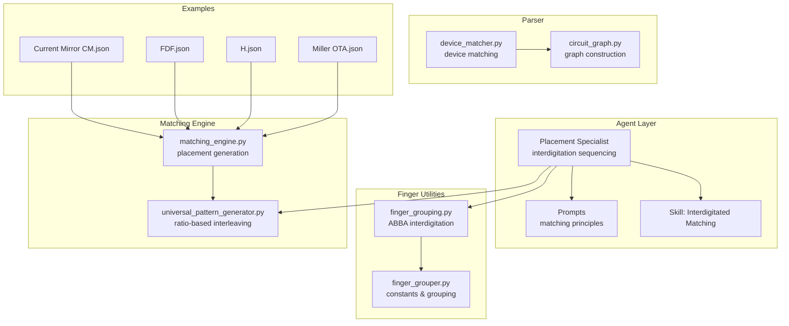
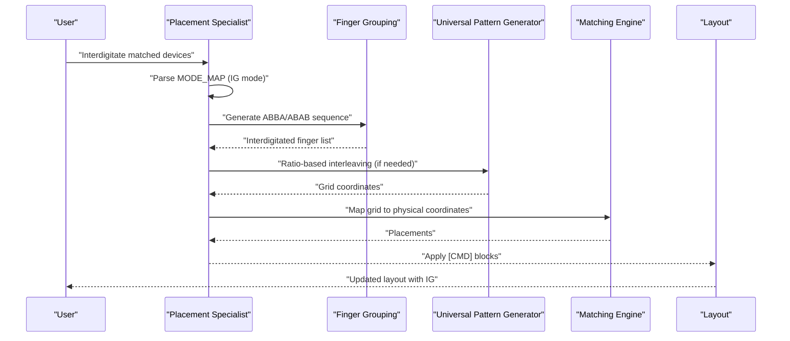
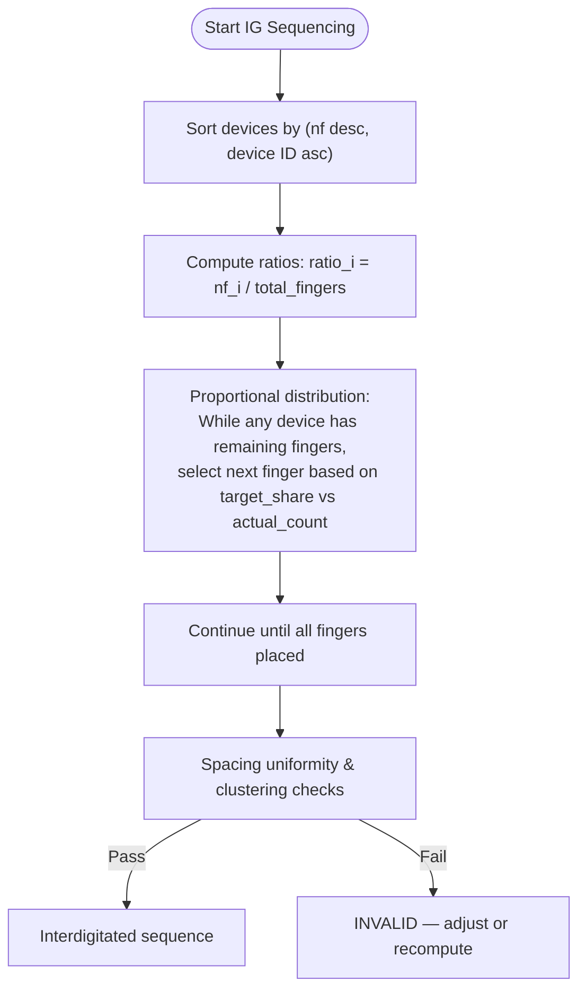
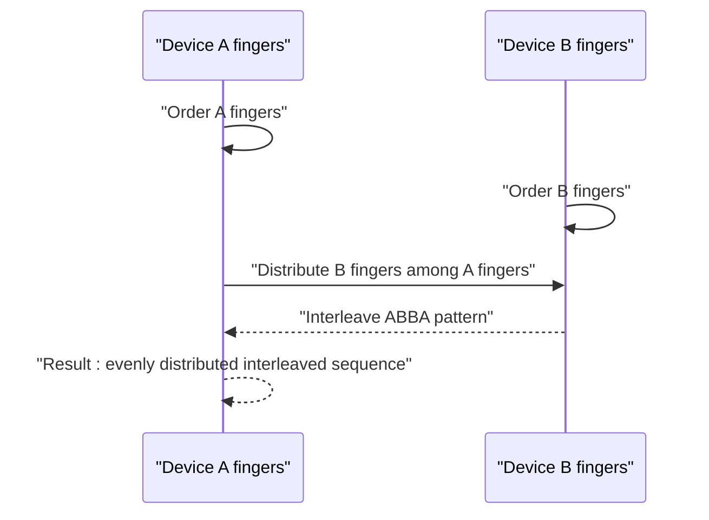
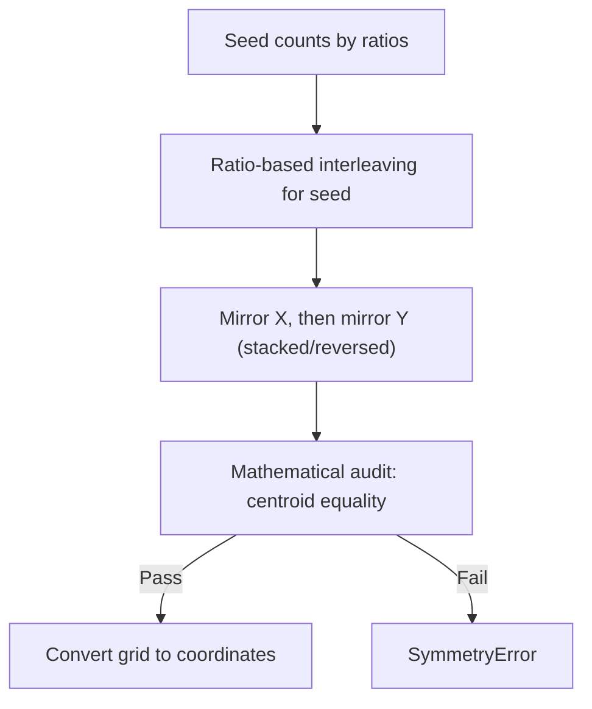
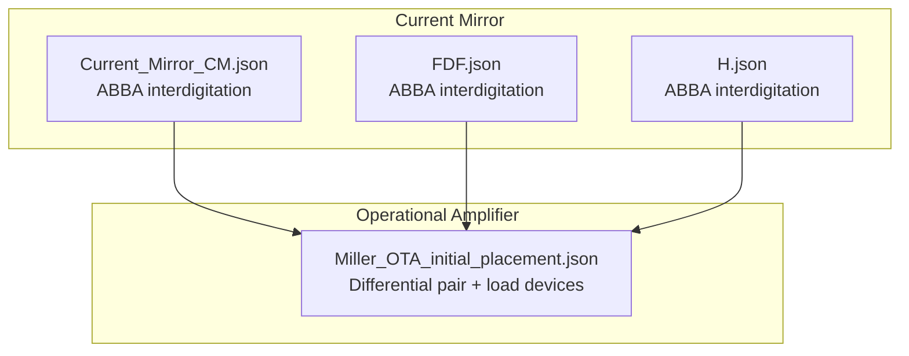
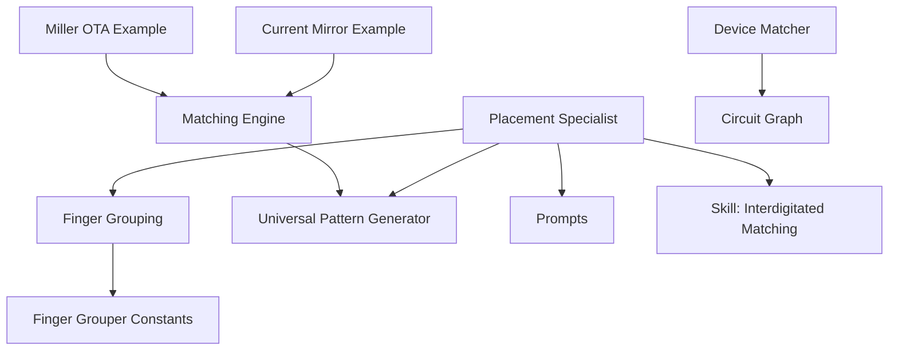

# Interdigitated Matching

<cite>
**Referenced Files in This Document**
- [interdigitated-matching.md](file://ai_agent/SKILLS/interdigitated-matching.md)
- [placement_specialist.py](file://ai_agent/ai_chat_bot/agents/placement_specialist.py)
- [prompts.py](file://ai_agent/ai_chat_bot/agents/prompts.py)
- [finger_grouping.py](file://ai_agent/ai_chat_bot/finger_grouping.py)
- [finger_grouper.py](file://ai_agent/ai_initial_placement/finger_grouper.py)
- [universal_pattern_generator.py](file://ai_agent/matching/universal_pattern_generator.py)
- [matching_engine.py](file://ai_agent/matching/matching_engine.py)
- [device_matcher.py](file://parser/device_matcher.py)
- [circuit_graph.py](file://parser/circuit_graph.py)
- [Current_Mirror_CM.json](file://examples/current_mirror/Current_Mirror_CM.json)
- [FDF.json](file://examples/current_mirror/FDF.json)
- [H.json](file://examples/current_mirror/H.json)
- [Miller_OTA_initial_placement.json](file://examples/Miller_OTA/Miller_OTA_initial_placement.json)
</cite>

## Table of Contents
1. [Introduction](#introduction)
2. [Project Structure](#project-structure)
3. [Core Components](#core-components)
4. [Architecture Overview](#architecture-overview)
5. [Detailed Component Analysis](#detailed-component-analysis)
6. [Dependency Analysis](#dependency-analysis)
7. [Performance Considerations](#performance-considerations)
8. [Troubleshooting Guide](#troubleshooting-guide)
9. [Conclusion](#conclusion)
10. [Appendices](#appendices)

## Introduction
This document explains the interdigitated matching technique used to reduce parasitic effects and achieve superior electrical characteristics through interleaved finger structures. It covers the finger interdigitation concept, overlap calculations, finger width optimization, geometric constraints, practical examples in operational amplifiers and current mirrors, guidelines for finger count calculations and layout efficiency, thermal coupling considerations, and manufacturing constraints. The content synthesizes the repository's AI agents, matching engines, and example layouts to provide a comprehensive guide for implementing interdigitated matching in analog IC layout automation.

## Project Structure
The interdigitated matching implementation spans several modules:
- Skill definition and guidance for interdigitated matching
- Placement specialist agent that constructs deterministic interdigitated sequences
- Finger grouping utilities for ABBA interdigitation and ratio-based distribution
- Matching engine and pattern generator for common-centroid and interdigitated layouts
- Parser utilities for device matching and circuit graph construction
- Example layouts demonstrating interdigitated matching in practice

**Diagram sources**
- [placement_specialist.py:132-196](file://ai_agent/ai_chat_bot/agents/placement_specialist.py#L132-L196)
- [prompts.py:33-48](file://ai_agent/ai_chat_bot/agents/prompts.py#L33-L48)
- [interdigitated-matching.md:16-28](file://ai_agent/SKILLS/interdigitated-matching.md#L16-L28)
- [finger_grouping.py:361-418](file://ai_agent/ai_chat_bot/finger_grouping.py#L361-L418)
- [finger_grouper.py:32-47](file://ai_agent/ai_initial_placement/finger_grouper.py#L32-L47)
- [matching_engine.py:13-84](file://ai_agent/matching/matching_engine.py#L13-L84)
- [universal_pattern_generator.py:9-104](file://ai_agent/matching/universal_pattern_generator.py#L9-L104)
- [device_matcher.py:85-150](file://parser/device_matcher.py#L85-L150)
- [circuit_graph.py:131-190](file://parser/circuit_graph.py#L131-L190)

**Section sources**
- [interdigitated-matching.md:1-29](file://ai_agent/SKILLS/interdigitated-matching.md#L1-L29)
- [placement_specialist.py:132-196](file://ai_agent/ai_chat_bot/agents/placement_specialist.py#L132-L196)
- [prompts.py:33-48](file://ai_agent/ai_chat_bot/agents/prompts.py#L33-L48)
- [finger_grouping.py:361-418](file://ai_agent/ai_chat_bot/finger_grouping.py#L361-L418)
- [finger_grouper.py:32-47](file://ai_agent/ai_initial_placement/finger_grouper.py#L32-L47)
- [matching_engine.py:13-84](file://ai_agent/matching/matching_engine.py#L13-L84)
- [universal_pattern_generator.py:9-104](file://ai_agent/matching/universal_pattern_generator.py#L9-L104)
- [device_matcher.py:85-150](file://parser/device_matcher.py#L85-L150)
- [circuit_graph.py:131-190](file://parser/circuit_graph.py#L131-L190)

## Core Components
- Interdigitated Matching Skill: Defines when to apply interdigitated matching and core guidance for deterministic proportional distribution and routing regularity.
- Placement Specialist Agent: Implements ratio-based interdigitation sequencing, enforces row-level grouping, and validates spacing uniformity and clustering prevention.
- Finger Grouping Utilities: Provide ABBA interdigitation patterns and ratio-based interleaving for matched devices.
- Matching Engine and Pattern Generator: Generate placement grids using ratio-based interleaving and enforce symmetry audits for common-centroid and interdigitated layouts.
- Parser Utilities: Match netlist devices to layout instances and construct circuit graphs for topology-aware placement.
- Example Layouts: Demonstrate interdigitated matching in current mirrors and operational transconductance amplifiers.

**Section sources**
- [interdigitated-matching.md:16-28](file://ai_agent/SKILLS/interdigitated-matching.md#L16-L28)
- [placement_specialist.py:132-196](file://ai_agent/ai_chat_bot/agents/placement_specialist.py#L132-L196)
- [finger_grouping.py:361-418](file://ai_agent/ai_chat_bot/finger_grouping.py#L361-L418)
- [matching_engine.py:13-84](file://ai_agent/matching/matching_engine.py#L13-L84)
- [universal_pattern_generator.py:9-104](file://ai_agent/matching/universal_pattern_generator.py#L9-L104)
- [device_matcher.py:85-150](file://parser/device_matcher.py#L85-L150)
- [circuit_graph.py:131-190](file://parser/circuit_graph.py#L131-L190)

## Architecture Overview
The interdigitated matching pipeline integrates skill definitions, agent-based sequencing, and layout utilities to produce deterministic, routing-friendly interdigitated sequences.

**Diagram sources**
- [placement_specialist.py:377-521](file://ai_agent/ai_chat_bot/agents/placement_specialist.py#L377-L521)
- [finger_grouping.py:361-418](file://ai_agent/ai_chat_bot/finger_grouping.py#L361-L418)
- [universal_pattern_generator.py:9-104](file://ai_agent/matching/universal_pattern_generator.py#L9-L104)
- [matching_engine.py:13-84](file://ai_agent/matching/matching_engine.py#L13-L84)

**Section sources**
- [placement_specialist.py:377-521](file://ai_agent/ai_chat_bot/agents/placement_specialist.py#L377-L521)
- [finger_grouping.py:361-418](file://ai_agent/ai_chat_bot/finger_grouping.py#L361-L418)
- [universal_pattern_generator.py:9-104](file://ai_agent/matching/universal_pattern_generator.py#L9-L104)
- [matching_engine.py:13-84](file://ai_agent/matching/matching_engine.py#L13-L84)

## Detailed Component Analysis

### Interdigitated Matching Skill
- Purpose: Deterministic proportional distribution of fingers to improve matching and routing regularity.
- Guidance: Process all IG devices in the same row as one unified group, distribute fingers by ratio targets, avoid terminal clustering, enforce one-slot-per-device-instance, and preserve all IDs/fingers.

**Section sources**
- [interdigitated-matching.md:16-28](file://ai_agent/SKILLS/interdigitated-matching.md#L16-L28)

### Ratio-Based Interdigitation Sequencing
- Objective: Distribute devices proportionally across the row to minimize gradient-induced mismatch and avoid clustering.
- Scope: All IG devices in the same row must be processed together as one group; do not interdigitate per device or per subgroup.
- Algorithm: Sort by nf descending, compute ratios, and build a sequence using proportional distribution to maintain uniform spatial density.

**Diagram sources**
- [placement_specialist.py:145-196](file://ai_agent/ai_chat_bot/agents/placement_specialist.py#L145-L196)

**Section sources**
- [placement_specialist.py:145-196](file://ai_agent/ai_chat_bot/agents/placement_specialist.py#L145-L196)

### ABBA Interdigitation Pattern
- Pattern: Alternating A and B fingers with symmetric distribution; for unequal lengths, distribute B fingers evenly among A fingers.
- Usage: Preferred for differential pairs and current mirrors to cancel linear process gradients and improve matching.

**Diagram sources**
- [finger_grouping.py:361-418](file://ai_agent/ai_chat_bot/finger_grouping.py#L361-L418)
- [finger_grouper.py:647-735](file://ai_agent/ai_initial_placement/finger_grouper.py#L647-L735)

**Section sources**
- [finger_grouping.py:361-418](file://ai_agent/ai_chat_bot/finger_grouping.py#L361-L418)
- [finger_grouper.py:647-735](file://ai_agent/ai_initial_placement/finger_grouper.py#L647-L735)

### Ratio-Based Interleaving (Common-Centroid 2D)
- Technique: Uses ratio-based interleaving to seed the first quadrant/half, then mirrors for symmetry.
- Constraints: Even finger counts per device required for 2D common-centroid; symmetry factor 4 for cross-quadrant mirroring.

**Diagram sources**
- [universal_pattern_generator.py:9-104](file://ai_agent/matching/universal_pattern_generator.py#L9-L104)

**Section sources**
- [universal_pattern_generator.py:9-104](file://ai_agent/matching/universal_pattern_generator.py#L9-L104)

### Matching Engine and Grid Generation
- Functionality: Groups matched devices by parent, generates placement grids using ratio-based interleaving, and maps grid coordinates to physical positions.
- Integration: Uses device dimensions and row heights to ensure precise stacking without overlap or gaps.

**Section sources**
- [matching_engine.py:13-84](file://ai_agent/matching/matching_engine.py#L13-L84)

### Practical Examples: Interdigitated Matching in Practice
- Current Mirror: Demonstrates ABBA interdigitation for matched pairs sharing gate nets and drain-source connections.
- Miller OTA: Shows interdigitated matching in operational amplifier stages with differential pairs and cascode configurations.

**Diagram sources**
- [Current_Mirror_CM.json:1-800](file://examples/current_mirror/Current_Mirror_CM.json#L1-L800)
- [FDF.json:1-800](file://examples/current_mirror/FDF.json#L1-L800)
- [H.json:1-800](file://examples/current_mirror/H.json#L1-L800)
- [Miller_OTA_initial_placement.json:1-800](file://examples/Miller_OTA/Miller_OTA_initial_placement.json#L1-L800)

**Section sources**
- [Current_Mirror_CM.json:1-800](file://examples/current_mirror/Current_Mirror_CM.json#L1-L800)
- [FDF.json:1-800](file://examples/current_mirror/FDF.json#L1-L800)
- [H.json:1-800](file://examples/current_mirror/H.json#L1-L800)
- [Miller_OTA_initial_placement.json:1-800](file://examples/Miller_OTA/Miller_OTA_initial_placement.json#L1-L800)

## Dependency Analysis
The interdigitated matching pipeline depends on:
- Agent-based sequencing and validation rules
- Finger grouping utilities for ABBA patterns
- Pattern generators for ratio-based interleaving
- Parser utilities for device matching and circuit graph construction

**Diagram sources**
- [placement_specialist.py:132-196](file://ai_agent/ai_chat_bot/agents/placement_specialist.py#L132-L196)
- [finger_grouping.py:361-418](file://ai_agent/ai_chat_bot/finger_grouping.py#L361-L418)
- [finger_grouper.py:32-47](file://ai_agent/ai_initial_placement/finger_grouper.py#L32-L47)
- [matching_engine.py:13-84](file://ai_agent/matching/matching_engine.py#L13-L84)
- [universal_pattern_generator.py:9-104](file://ai_agent/matching/universal_pattern_generator.py#L9-L104)
- [device_matcher.py:85-150](file://parser/device_matcher.py#L85-L150)
- [circuit_graph.py:131-190](file://parser/circuit_graph.py#L131-L190)

**Section sources**
- [placement_specialist.py:132-196](file://ai_agent/ai_chat_bot/agents/placement_specialist.py#L132-L196)
- [finger_grouping.py:361-418](file://ai_agent/ai_chat_bot/finger_grouping.py#L361-L418)
- [finger_grouper.py:32-47](file://ai_agent/ai_initial_placement/finger_grouper.py#L32-L47)
- [matching_engine.py:13-84](file://ai_agent/matching/matching_engine.py#L13-L84)
- [universal_pattern_generator.py:9-104](file://ai_agent/matching/universal_pattern_generator.py#L9-L104)
- [device_matcher.py:85-150](file://parser/device_matcher.py#L85-L150)
- [circuit_graph.py:131-190](file://parser/circuit_graph.py#L131-L190)

## Performance Considerations
- Gradient Cancellation: Interdigitated matching cancels linear process gradients, improving matching accuracy for differential pairs and current mirrors.
- Routing Regularity: Ratio-based interleaving maintains uniform spatial density, minimizing clustering and improving routing efficiency.
- Thermal Coupling: ABBA patterns ensure symmetric thermal coupling across matched devices, reducing mismatch due to temperature gradients.
- Layout Efficiency: Interdigitated structures fit compactly in a single row, optimizing area utilization compared to separated parallel devices.

[No sources needed since this section provides general guidance]

## Troubleshooting Guide
Common issues and resolutions:
- Overlaps: Ensure slot indices are unique per row; mechanical coordinate derivation x = slot_index × 0.294 prevents overlaps.
- Clustering: Validate spacing uniformity and tail clustering detection; interdigitated sequences must avoid placing all remaining fingers of one device at the end.
- Mode Conflicts: Do not mix modes within the same group; interdigitation requires all IG devices in the same row to be processed together.
- Symmetry Violations: For mirror biasing, enforce strict mirror symmetry and dummy placement at both ends.

**Section sources**
- [placement_specialist.py:524-594](file://ai_agent/ai_chat_bot/agents/placement_specialist.py#L524-L594)
- [prompts.py:33-48](file://ai_agent/ai_chat_bot/agents/prompts.py#L33-L48)

## Conclusion
Interdigitated matching leverages deterministic proportional distribution and ABBA patterns to reduce parasitic effects, cancel process gradients, and improve matching performance. The repository’s agents, utilities, and examples demonstrate robust implementation for differential pairs, current mirrors, and operational amplifiers. By adhering to geometric constraints, validating spacing and symmetry, and integrating with layout automation, interdigitated matching delivers superior electrical characteristics and routing regularity.

[No sources needed since this section summarizes without analyzing specific files]

## Appendices

### Geometric Constraints and Calculations
- Pitch and Spacing:
  - Device width (X pitch) = 0.294 µm
  - Abutted finger-to-finger pitch = 0.070 µm
  - Row pitch = 0.668 µm
- Overlap Ratios:
  - Interdigitated structures require alternating A and B fingers to balance parasitics and thermal coupling.
- Total Device Dimensions:
  - Footprint = total_fingers × 0.294 µm (non-abutted layout footprint)
  - Width per finger = 0.294 µm; abutment spacing = 0.070 µm

**Section sources**
- [finger_grouper.py:32-47](file://ai_agent/ai_initial_placement/finger_grouper.py#L32-L47)
- [prompts.py:25-26](file://ai_agent/ai_chat_bot/agents/prompts.py#L25-L26)

### Guidelines for Finger Count Calculations and Layout Efficiency
- Finger Count Distribution:
  - Sort devices by nf descending, device ID ascending
  - Compute ratio_i = nf_i / total_fingers
  - Build sequence using proportional distribution to avoid clustering
- Layout Efficiency:
  - Interdigitated structures minimize area compared to parallel devices
  - Maintain uniform spacing to reduce routing congestion

**Section sources**
- [placement_specialist.py:145-196](file://ai_agent/ai_chat_bot/agents/placement_specialist.py#L145-L196)

### Thermal Coupling Considerations
- ABBA Pattern Benefits:
  - Ensures symmetric thermal coupling across matched devices
  - Reduces mismatch due to temperature gradients
- Implementation:
  - Use ABBA interdigitation for differential pairs and current mirrors
  - Maintain mirror symmetry and dummy placement at both ends for MB mode

**Section sources**
- [prompts.py:33-48](file://ai_agent/ai_chat_bot/agents/prompts.py#L33-L48)
- [placement_specialist.py:199-260](file://ai_agent/ai_chat_bot/agents/placement_specialist.py#L199-L260)

### Manufacturing Constraints
- Minimum Feature Sizes:
  - Device width (X pitch) = 0.294 µm
  - Abutted pitch = 0.070 µm
- Etching Uniformity:
  - Interdigitated structures rely on precise etching to maintain alternating A/B profiles
- Process Variations:
  - Ratio-based interleaving mitigates linear and quadratic process gradients
  - Symmetry audits ensure centroid equality for common-centroid layouts

**Section sources**
- [finger_grouper.py:32-47](file://ai_agent/ai_initial_placement/finger_grouper.py#L32-L47)
- [universal_pattern_generator.py:106-131](file://ai_agent/matching/universal_pattern_generator.py#L106-L131)

### Performance Analysis: Interdigitated Matching vs Conventional Parallel Layouts
- Parasitic Reduction:
  - Interdigitated matching reduces effective gate resistance and minimizes gradient-induced mismatch
- Matching Accuracy:
  - ABBA patterns cancel linear process gradients; common-centroid layouts cancel both linear and quadratic gradients
- Routing Efficiency:
  - Interdigitated structures provide routing-friendly mixing and compact footprint compared to separated parallel devices

**Section sources**
- [prompts.py:33-48](file://ai_agent/ai_chat_bot/agents/prompts.py#L33-L48)
- [placement_specialist.py:111-130](file://ai_agent/ai_chat_bot/agents/placement_specialist.py#L111-L130)