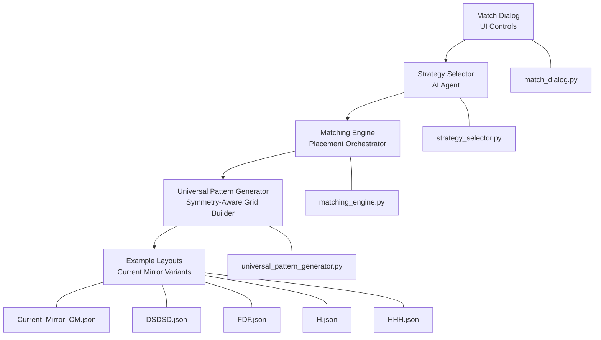
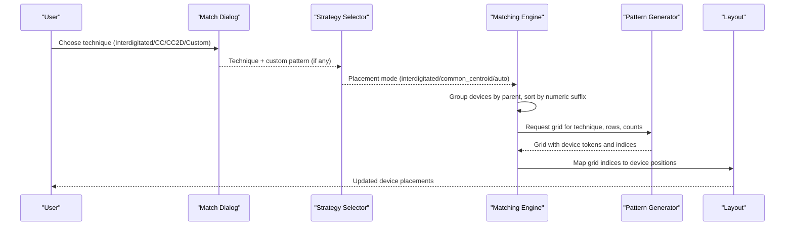
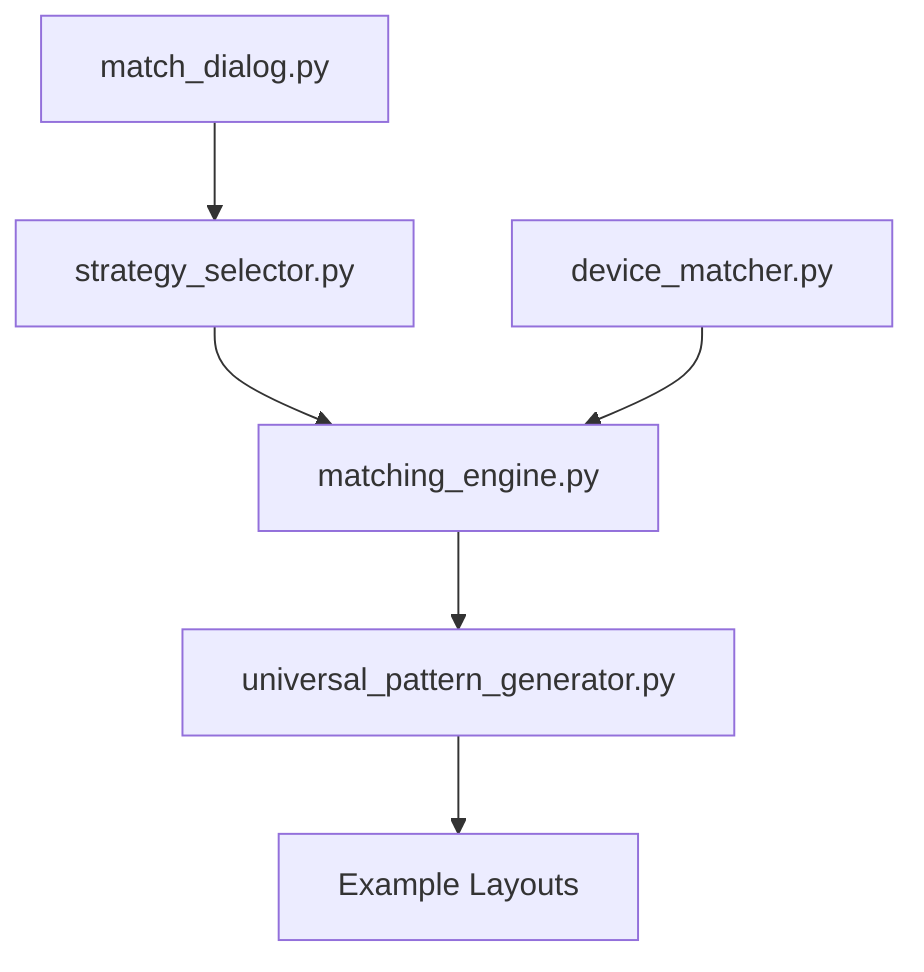

# Matching Techniques

<cite>
**Referenced Files in This Document**
- [matching_engine.py](file://ai_agent/matching/matching_engine.py)
- [universal_pattern_generator.py](file://ai_agent/matching/universal_pattern_generator.py)
- [match_dialog.py](file://symbolic_editor/dialogs/match_dialog.py)
- [strategy_selector.py](file://ai_agent/ai_chat_bot/agents/strategy_selector.py)
- [common-centroid-matching.md](file://ai_agent/SKILLS/common-centroid-matching.md)
- [interdigitated-matching.md](file://ai_agent/SKILLS/interdigitated-matching.md)
- [mirror-biasing-sequencing.md](file://ai_agent/SKILLS/mirror-biasing-sequencing.md)
- [device_matcher.py](file://parser/device_matcher.py)
- [README.md](file://README.md)
- [Current_Mirror_CM.json](file://examples/current_mirror/Current_Mirror_CM.json)
- [DSDSD.json](file://examples/current_mirror/DSDSD.json)
- [FDF.json](file://examples/current_mirror/FDF.json)
- [H.json](file://examples/current_mirror/H.json)
- [HHH.json](file://examples/current_mirror/HHH.json)
</cite>

## Table of Contents
1. [Introduction](#introduction)
2. [Project Structure](#project-structure)
3. [Core Components](#core-components)
4. [Architecture Overview](#architecture-overview)
5. [Detailed Component Analysis](#detailed-component-analysis)
6. [Dependency Analysis](#dependency-analysis)
7. [Performance Considerations](#performance-considerations)
8. [Troubleshooting Guide](#troubleshooting-guide)
9. [Conclusion](#conclusion)

## Introduction
This document explains the specialized matching techniques implemented in the device matching system for analog IC layout automation. It covers:
- Common-centroid matching for improved accuracy via shared centroids and reduced process variations
- Interdigitated matching for reduced parasitic effects and better electrical characteristics through interleaved finger structures
- Mirror biasing sequencing for creating matched pairs with identical bias conditions and thermal coupling

It also provides practical examples applied to real analog circuits (current mirrors, differential pairs, active loads), outlines geometric requirements and layout constraints, and offers guidelines for selecting appropriate matching techniques based on circuit requirements and device specifications.

## Project Structure
The matching system integrates user interface controls, AI-driven strategy selection, and a placement engine that generates deterministic, symmetry-aware patterns. Supporting skills documents define best practices for each technique.

**Diagram sources**
- [match_dialog.py:1-172](file://symbolic_editor/dialogs/match_dialog.py#L1-L172)
- [strategy_selector.py:170-219](file://ai_agent/ai_chat_bot/agents/strategy_selector.py#L170-L219)
- [matching_engine.py:1-95](file://ai_agent/matching/matching_engine.py#L1-L95)
- [universal_pattern_generator.py:1-167](file://ai_agent/matching/universal_pattern_generator.py#L1-L167)
- [Current_Mirror_CM.json:1-800](file://examples/current_mirror/Current_Mirror_CM.json#L1-L800)
- [DSDSD.json:1-800](file://examples/current_mirror/DSDSD.json#L1-L800)
- [FDF.json:1-800](file://examples/current_mirror/FDF.json#L1-L800)
- [H.json:1-800](file://examples/current_mirror/H.json#L1-L800)
- [HHH.json:1-800](file://examples/current_mirror/HHH.json#L1-L800)

**Section sources**
- [README.md:131-191](file://README.md#L131-L191)

## Core Components
- Matching Engine: Groups devices by logical parents, determines technique and rows, and maps the generated grid to physical coordinates.
- Universal Pattern Generator: Builds symmetry-aware grids using ratio-based interleaving, enforces centroid equality, and supports custom patterns.
- UI Dialog: Provides user controls for selecting interdigitated, common-centroid (1D/2D), or custom patterns.
- Strategy Selector: Generates high-level strategies and interprets user intent for matching techniques.
- Skills Documents: Define when and how to apply each technique with practical guidance.

Key responsibilities:
- Device grouping and sorting by parent and numeric order
- Grid generation with symmetry constraints (1D mirror or 2D cross-coupled)
- Coordinate mapping from grid indices to device positions
- Validation of centroid equality and device conservation

**Section sources**
- [matching_engine.py:13-84](file://ai_agent/matching/matching_engine.py#L13-L84)
- [universal_pattern_generator.py:9-104](file://ai_agent/matching/universal_pattern_generator.py#L9-L104)
- [match_dialog.py:94-171](file://symbolic_editor/dialogs/match_dialog.py#L94-L171)
- [strategy_selector.py:186-219](file://ai_agent/ai_chat_bot/agents/strategy_selector.py#L186-L219)
- [common-centroid-matching.md:13-26](file://ai_agent/SKILLS/common-centroid-matching.md#L13-L26)
- [interdigitated-matching.md:16-29](file://ai_agent/SKILLS/interdigitated-matching.md#L16-L29)
- [mirror-biasing-sequencing.md:16-29](file://ai_agent/SKILLS/mirror-biasing-sequencing.md#L16-L29)

## Architecture Overview
The matching pipeline transforms user intent and device sets into physically realizable layouts with precise symmetry and centroid balance.

**Diagram sources**
- [match_dialog.py:160-171](file://symbolic_editor/dialogs/match_dialog.py#L160-L171)
- [strategy_selector.py:186-219](file://ai_agent/ai_chat_bot/agents/strategy_selector.py#L186-L219)
- [matching_engine.py:13-84](file://ai_agent/matching/matching_engine.py#L13-L84)
- [universal_pattern_generator.py:9-104](file://ai_agent/matching/universal_pattern_generator.py#L9-L104)

## Detailed Component Analysis

### Common-Centroid Matching
Common-centroid matching arranges matched devices so that each device’s centroid aligns with the global grid center, canceling linear process gradients and improving matching accuracy. The 2D variant extends this across multiple rows for enhanced cancellation.

Implementation highlights:
- 1D common centroid uses a half-seed mirrored to the opposite side in a single row
- 2D common centroid builds the top row and mirrors it to the bottom row, enforcing point symmetry
- Even finger counts per device are required for 2D CC; otherwise, a symmetry error is raised
- Centroid audit ensures global center alignment within a small tolerance

Practical applications:
- Differential pairs with four devices (two fingers each) benefit from 2D CC
- Multi-device matched sets requiring strong gradient cancellation

Geometric requirements:
- Even total fingers per device for 2D CC
- Balanced row heights equal to device height for tight stacking
- Grid dimensions divisible by the symmetry factor (2 for 1D, 4 for 2D)

Performance benefits:
- Reduced linear and quadratic process-gradient mismatch
- Improved long-term stability under thermal and supply variations

**Section sources**
- [common-centroid-matching.md:13-26](file://ai_agent/SKILLS/common-centroid-matching.md#L13-L26)
- [universal_pattern_generator.py:46-104](file://ai_agent/matching/universal_pattern_generator.py#L46-L104)
- [universal_pattern_generator.py:106-131](file://ai_agent/matching/universal_pattern_generator.py#L106-L131)
- [matching_engine.py:28-57](file://ai_agent/matching/matching_engine.py#L28-L57)

### Interdigitated Matching
Interdigitated matching interleaves fingers from matched devices in a deterministic, ratio-based pattern to improve matching and routing regularity without changing device inventory. This reduces parasitic effects and achieves better electrical characteristics.

Implementation highlights:
- Ratio-based interleaving seeds a half-row pattern, then mirrors it to form a symmetric layout
- Finger distribution respects target ratios while avoiding terminal clustering
- One-slot-per-device-instance is enforced, preserving all IDs and finger counts

Practical applications:
- Differential pairs and current mirrors
- Scattered matched sets where compactness and uniformity are desired

Geometric requirements:
- Devices grouped into the same row as one unified group
- Spread across the row to avoid clustering
- Device counts preserved exactly

Performance benefits:
- Better matching due to gradient cancellation along the row
- Improved routing regularity and reduced parasitics

**Section sources**
- [interdigitated-matching.md:16-29](file://ai_agent/SKILLS/interdigitated-matching.md#L16-L29)
- [universal_pattern_generator.py:69-86](file://ai_agent/matching/universal_pattern_generator.py#L69-L86)
- [universal_pattern_generator.py:91-99](file://ai_agent/matching/universal_pattern_generator.py#L91-L99)

### Mirror Biasing Sequencing
Mirror biasing sequencing constructs mirror-safe, symmetric placement for bias/current-mirror groups, preserving ratios and left-right symmetry while keeping all devices and fingers present. This ensures identical bias conditions and thermal coupling.

Implementation highlights:
- Build half-sequence targets, then mirror deterministically
- Preserve exact device and finger counts in the final sequence
- Explicit symmetry in slot assignment and center handling
- Dummy devices placed only at row boundaries when required

Practical applications:
- Current mirrors with bias pairs
- Active loads requiring matched thermal behavior

Geometric requirements:
- Symmetric placement around a central axis
- Preserved ratios across matched groups
- Minimal dummy usage constrained to row boundaries

Performance benefits:
- Identical bias conditions across matched devices
- Thermal coupling reduces mismatch due to temperature drift

**Section sources**
- [mirror-biasing-sequencing.md:16-29](file://ai_agent/SKILLS/mirror-biasing-sequencing.md#L16-L29)
- [strategy_selector.py:170-184](file://ai_agent/ai_chat_bot/agents/strategy_selector.py#L170-L184)

### UI and Strategy Selection
The UI dialog exposes technique choices with tooltips guiding selection. The strategy selector interprets user intent and topology constraints to propose complementary strategies.

Selection logic:
- Interdigitated: Best for differential pairs and moderate matching needs
- Common Centroid (1D/2D): Best for strong matching and multi-row scenarios
- Custom: Allows manual specification of patterns with row separators

Integration points:
- Technique selection feeds into the matching engine
- Strategy selector provides high-level guidance aligned with matching constraints

**Section sources**
- [match_dialog.py:94-171](file://symbolic_editor/dialogs/match_dialog.py#L94-L171)
- [strategy_selector.py:186-219](file://ai_agent/ai_chat_bot/agents/strategy_selector.py#L186-L219)

### Practical Examples in Real Analog Circuits
The examples demonstrate how matching techniques are applied to current mirrors and related configurations:

- Current Mirror (CM): Shows matched NMOS devices arranged with interdigitated patterns and abutment constraints typical of current mirrors.
- DSDSD: Demonstrates interleaved arrangements with abutment metadata indicating shared diffusion regions.
- FDF: Another variant with interleaved fingers and abutment constraints.
- H and HHH: Additional configurations illustrating different matching strategies and abutment patterns.

These examples illustrate:
- Interdigitated patterns for matched devices
- Abutment constraints ensuring shared diffusion
- Multi-finger device representation and layout packing

**Section sources**
- [Current_Mirror_CM.json:1-800](file://examples/current_mirror/Current_Mirror_CM.json#L1-L800)
- [DSDSD.json:1-800](file://examples/current_mirror/DSDSD.json#L1-L800)
- [FDF.json:1-800](file://examples/current_mirror/FDF.json#L1-L800)
- [H.json:1-800](file://examples/current_mirror/H.json#L1-L800)
- [HHH.json:1-800](file://examples/current_mirror/HHH.json#L1-L800)

## Dependency Analysis
The matching system exhibits clear separation of concerns with minimal coupling:

- Matching Engine depends on Universal Pattern Generator for grid construction
- UI and Strategy Selector feed technique choices into Matching Engine
- Device Matcher supports device grouping and sorting used by Matching Engine

Potential circular dependencies: None observed among the focused modules.

**Diagram sources**
- [match_dialog.py:160-171](file://symbolic_editor/dialogs/match_dialog.py#L160-L171)
- [strategy_selector.py:186-219](file://ai_agent/ai_chat_bot/agents/strategy_selector.py#L186-L219)
- [matching_engine.py:13-84](file://ai_agent/matching/matching_engine.py#L13-L84)
- [universal_pattern_generator.py:9-104](file://ai_agent/matching/universal_pattern_generator.py#L9-L104)
- [device_matcher.py:85-151](file://parser/device_matcher.py#L85-L151)

**Section sources**
- [device_matcher.py:85-151](file://parser/device_matcher.py#L85-L151)

## Performance Considerations
- Symmetry enforcement: 2D common centroid requires even finger counts per device; otherwise, a symmetry error is raised. This prevents invalid layouts and ensures mathematical correctness.
- Centroid audit: Ensures global center alignment within a small tolerance, preventing systematic mismatches.
- Ratio-based interleaving: Improves matching and routing regularity by distributing fingers proportionally.
- Row height consistency: Using device height as row step ensures tight stacking without gaps or overlaps.
- Device conservation: All IDs and finger counts are preserved, maintaining netlist fidelity.

[No sources needed since this section provides general guidance]

## Troubleshooting Guide
Common issues and resolutions:
- Symmetry errors in 2D common centroid: Ensure even finger counts per device; the generator raises an error if counts are odd.
- Centroid mismatch: Verify that the grid satisfies centroid equality; the audit compares device centroids to the global grid center.
- Custom pattern misuse: Confirm counts do not exceed available devices; the generator validates counts against the provided pattern.
- Device grouping problems: Confirm device IDs are properly parsed and sorted; the engine groups by parent prefixes and sorts numerically.

Validation and error handling:
- SymmetryError exceptions are raised for invalid configurations
- Audit checks enforce centroid equality
- Count validation prevents over-allocation in custom patterns

**Section sources**
- [universal_pattern_generator.py:56-60](file://ai_agent/matching/universal_pattern_generator.py#L56-L60)
- [universal_pattern_generator.py:129-131](file://ai_agent/matching/universal_pattern_generator.py#L129-L131)
- [universal_pattern_generator.py:142-145](file://ai_agent/matching/universal_pattern_generator.py#L142-L145)
- [matching_engine.py:86-95](file://ai_agent/matching/matching_engine.py#L86-L95)

## Conclusion
The matching system combines deterministic pattern generation with symmetry enforcement to achieve high-quality device placement for analog circuits. By leveraging interdigitated and common-centroid techniques—and applying mirror biasing sequencing—designers can realize reduced parasitics, improved matching, and robust thermal coupling. The UI and AI-driven strategy selection provide intuitive control and context-aware recommendations, while the validation mechanisms ensure layout correctness and performance.