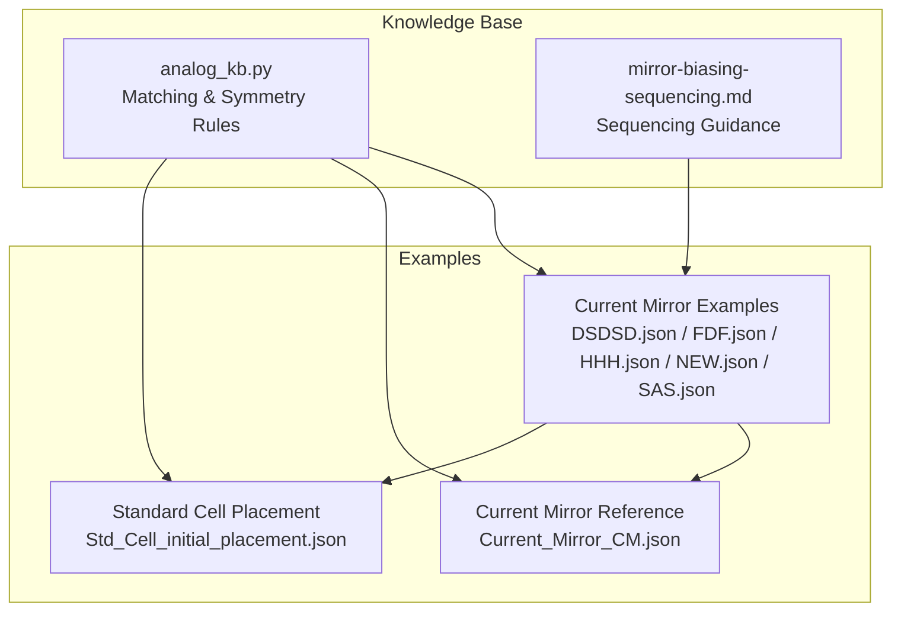
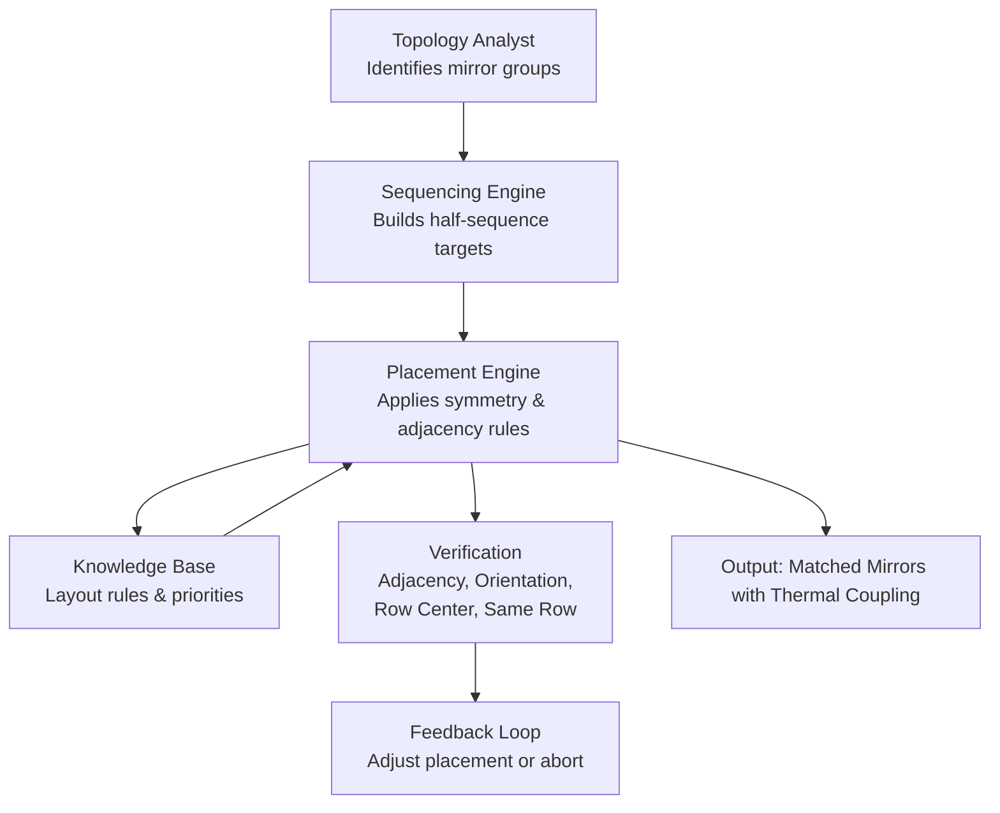
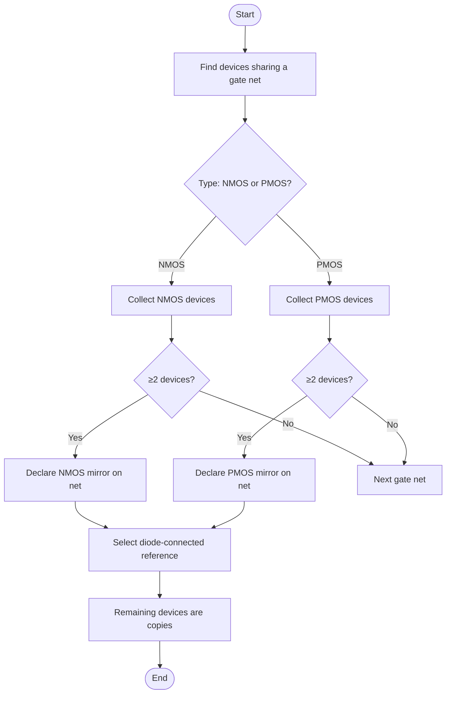
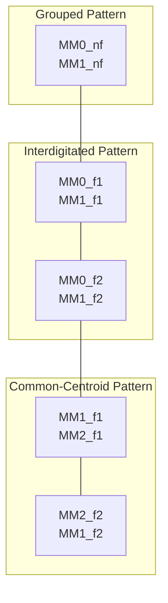
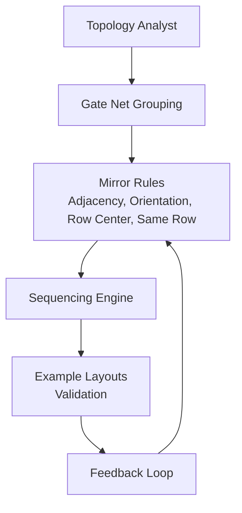

# Mirror Biasing Sequencing

<cite>
**Referenced Files in This Document**
- [mirror-biasing-sequencing.md](file://ai_agent/SKILLS/mirror-biasing-sequencing.md)
- [analog_kb.py](file://ai_agent/ai_chat_bot/analog_kb.py)
- [Current_Mirror_CM.json](file://examples/current_mirror/Current_Mirror_CM.json)
- [DSDSD.json](file://examples/current_mirror/DSDSD.json)
- [FDF.json](file://examples/current_mirror/FDF.json)
- [HHH.json](file://examples/current_mirror/HHH.json)
- [NEW.json](file://examples/current_mirror/NEW.json)
- [SAS.json](file://examples/current_mirror/SAS.json)
- [Std_Cell_initial_placement.json](file://examples/std_cell/Std_Cell_initial_placement.json)
</cite>

## Table of Contents
1. [Introduction](#introduction)
2. [Project Structure](#project-structure)
3. [Core Components](#core-components)
4. [Architecture Overview](#architecture-overview)
5. [Detailed Component Analysis](#detailed-component-analysis)
6. [Dependency Analysis](#dependency-analysis)
7. [Performance Considerations](#performance-considerations)
8. [Troubleshooting Guide](#troubleshooting-guide)
9. [Conclusion](#conclusion)

## Introduction
This document explains the mirror biasing sequencing technique used to create matched current mirrors with identical bias conditions and thermal coupling. It covers the sequential biasing approach for establishing matched current sources, the requirements for biasing sequences, voltage reference generation, and feedback mechanisms that maintain matched operation. Practical examples demonstrate mirror biasing in current mirrors, voltage references, and bias generation circuits. Guidelines address bias voltage calculation, thermal coupling optimization, load regulation considerations, power supply rejection ratio (PSRR) improvements, and temperature coefficient reduction. Trade-offs among bias accuracy, power consumption, and circuit complexity are discussed, along with the impact on overall circuit performance metrics.

## Project Structure
The repository organizes mirror biasing knowledge and examples across:
- Skill documentation for mirror biasing sequencing
- Analog layout knowledge base with matching and symmetry rules
- Example layouts for current mirrors under various configurations
- Standard cell placement examples that illustrate bias net routing and device placement

**Diagram sources**
- [analog_kb.py:171-283](file://ai_agent/ai_chat_bot/analog_kb.py#L171-L283)
- [mirror-biasing-sequencing.md:1-29](file://ai_agent/SKILLS/mirror-biasing-sequencing.md#L1-L29)
- [Current_Mirror_CM.json:128-147](file://examples/current_mirror/Current_Mirror_CM.json#L128-L147)
- [DSDSD.json:1-800](file://examples/current_mirror/DSDSD.json#L1-L800)
- [FDF.json:1-800](file://examples/current_mirror/FDF.json#L1-L800)
- [HHH.json:1-800](file://examples/current_mirror/HHH.json#L1-L800)
- [NEW.json:1-800](file://examples/current_mirror/NEW.json#L1-L800)
- [SAS.json:1-800](file://examples/current_mirror/SAS.json#L1-L800)
- [Std_Cell_initial_placement.json:1929-3988](file://examples/std_cell/Std_Cell_initial_placement.json#L1929-L3988)

**Section sources**
- [mirror-biasing-sequencing.md:1-29](file://ai_agent/SKILLS/mirror-biasing-sequencing.md#L1-L29)
- [analog_kb.py:171-283](file://ai_agent/ai_chat_bot/analog_kb.py#L171-L283)

## Core Components
- Mirror biasing sequencing guidance defines deterministic, mirror-safe placement for bias/current-mirror groups while preserving ratios and left-right symmetry.
- Layout rules emphasize adjacency, orientation matching, row-center placement, same-row requirement, and reference device placement.
- Interdigitation and common-centroid patterns enable advanced matching for high-precision applications.
- Priority rules define when mirror matching takes precedence over routing convenience and differential symmetry.

Key implementation anchors:
- Mirror biasing sequencing guidance: [mirror-biasing-sequencing.md:20-28](file://ai_agent/SKILLS/mirror-biasing-sequencing.md#L20-L28)
- Current mirror layout rules and detection algorithm: [analog_kb.py:171-283](file://ai_agent/ai_chat_bot/analog_kb.py#L171-L283)
- Priority in placement and error symptoms from poor layout: [analog_kb.py:258-278](file://ai_agent/ai_chat_bot/analog_kb.py#L258-L278)

**Section sources**
- [mirror-biasing-sequencing.md:20-28](file://ai_agent/SKILLS/mirror-biasing-sequencing.md#L20-L28)
- [analog_kb.py:171-283](file://ai_agent/ai_chat_bot/analog_kb.py#L171-L283)
- [analog_kb.py:258-278](file://ai_agent/ai_chat_bot/analog_kb.py#L258-L278)

## Architecture Overview
The mirror biasing sequencing architecture integrates:
- Topology identification and grouping of mirror pairs
- Deterministic placement of reference and copy devices with symmetry
- Thermal coupling via shared placement and routing of bias nets
- Feedback loops through layout rules ensuring adjacency, orientation, and row constraints

[No sources needed since this diagram shows conceptual workflow, not actual code structure]

## Detailed Component Analysis

### Mirror Biasing Sequencing Guidance
- Build half-sequence targets and mirror deterministically to preserve ratios and symmetry.
- Preserve exact device and finger counts in the final sequence.
- Explicitly handle slot assignment and center handling.
- Place dummy devices only at row boundaries when required.

Practical implications:
- Ensures matched current mirrors maintain identical bias conditions.
- Reduces process and layout mismatches by enforcing symmetric placement.

**Section sources**
- [mirror-biasing-sequencing.md:24-28](file://ai_agent/SKILLS/mirror-biasing-sequencing.md#L24-L28)

### Current Mirror Layout Rules and Detection
- Adjacency is mandatory for mirror devices; they must be placed in consecutive x-slots.
- Orientation must be identical for all devices in a mirror group.
- Place mirrors near the center of the row to minimize edge effects.
- Same-row requirement ensures consistent process gradients.
- Reference device placement: center for multi-device mirrors or at an end for two-device mirrors.
- Interdigitation pattern ABAB for highest accuracy; common-centroid ABBA or ABCCBA for ultra-precision.
- Detection algorithm identifies mirrors by gate nets and diode-connected reference devices.

**Diagram sources**
- [analog_kb.py:242-250](file://ai_agent/ai_chat_bot/analog_kb.py#L242-L250)

**Section sources**
- [analog_kb.py:196-250](file://ai_agent/ai_chat_bot/analog_kb.py#L196-L250)
- [analog_kb.py:229-239](file://ai_agent/ai_chat_bot/analog_kb.py#L229-L239)

### Thermal Coupling and Bias Voltage Calculation
- Thermal coupling is achieved by placing matched devices close together and aligning their bias nets.
- Bias voltage generation relies on the reference device’s gate voltage setting the shared bias net.
- Maintaining identical gate voltage across mirror copies ensures matched current copying.

Guidelines:
- Minimize gate resistance mismatch by keeping devices adjacent.
- Use row-center placement to reduce etch and process gradient effects.
- For multi-finger devices, interdigitate or use common-centroid patterns to average systematic gradients.

**Section sources**
- [analog_kb.py:190-195](file://ai_agent/ai_chat_bot/analog_kb.py#L190-L195)
- [analog_kb.py:211-216](file://ai_agent/ai_chat_bot/analog_kb.py#L211-L216)
- [analog_kb.py:229-239](file://ai_agent/ai_chat_bot/analog_kb.py#L229-L239)

### Practical Examples: Mirror Biasing in Current Mirrors
Example layouts demonstrate:
- Grouped, interdigitated, and common-centroid patterns for matching.
- Adjacent placement and consistent orientation across devices.
- Reference device placement at center or end depending on the number of devices.

Representative examples:
- Grouped layout: [Current_Mirror_CM.json:1-800](file://examples/current_mirror/Current_Mirror_CM.json#L1-L800)
- Interdigitated layout: [DSDSD.json:1-800](file://examples/current_mirror/DSDSD.json#L1-L800)
- Common-centroid layout: [HHH.json:1-800](file://examples/current_mirror/HHH.json#L1-L800)
- Adjacent and row-centered placement: [FDF.json:1-800](file://examples/current_mirror/FDF.json#L1-L800), [NEW.json:1-800](file://examples/current_mirror/NEW.json#L1-L800), [SAS.json:1-800](file://examples/current_mirror/SAS.json#L1-L800)

**Diagram sources**
- [Current_Mirror_CM.json:1-800](file://examples/current_mirror/Current_Mirror_CM.json#L1-L800)
- [DSDSD.json:1-800](file://examples/current_mirror/DSDSD.json#L1-L800)
- [HHH.json:1-800](file://examples/current_mirror/HHH.json#L1-L800)

**Section sources**
- [Current_Mirror_CM.json:1-800](file://examples/current_mirror/Current_Mirror_CM.json#L1-L800)
- [DSDSD.json:1-800](file://examples/current_mirror/DSDSD.json#L1-L800)
- [HHH.json:1-800](file://examples/current_mirror/HHH.json#L1-L800)
- [FDF.json:1-800](file://examples/current_mirror/FDF.json#L1-L800)
- [NEW.json:1-800](file://examples/current_mirror/NEW.json#L1-L800)
- [SAS.json:1-800](file://examples/current_mirror/SAS.json#L1-L800)

### Bias Net Routing and Thermal Coupling
- Bias nets (e.g., NBIAS, PBIAS, VTAIL, VCMFB) are routed with lower priority than critical nets.
- Power rails (VDD, GND) run along row edges; devices connecting to rails are kept at row periphery.
- Standard cell examples show bias net connections and routing paths for current mirrors.

**Section sources**
- [analog_kb.py:318-323](file://ai_agent/ai_chat_bot/analog_kb.py#L318-L323)
- [Std_Cell_initial_placement.json:1929-3988](file://examples/std_cell/Std_Cell_initial_placement.json#L1929-L3988)

### Feedback Mechanisms and Error Mitigation
- Priority rules: mirror matching takes precedence over routing convenience and differential symmetry.
- Error symptoms from poor mirror layout include gate resistance mismatch, Vth mismatch from poly-edge effects, etch variation, and process gradient mismatch.
- Dummy devices must be placed at row ends to maintain etch uniformity.

**Section sources**
- [analog_kb.py:258-267](file://ai_agent/ai_chat_bot/analog_kb.py#L258-L267)
- [analog_kb.py:268-278](file://ai_agent/ai_chat_bot/analog_kb.py#L268-L278)
- [analog_kb.py:297-302](file://ai_agent/ai_chat_bot/analog_kb.py#L297-L302)

## Dependency Analysis
Mirror biasing sequencing depends on:
- Topology identification to group mirrors and reference devices
- Layout rules to enforce adjacency, orientation, row center, and same-row constraints
- Example layouts to validate sequencing and thermal coupling

[No sources needed since this diagram shows conceptual workflow, not actual code structure]

## Performance Considerations
- Matching accuracy improves with interdigitation and common-centroid patterns, reducing systematic gradients.
- Thermal coupling reduces temperature coefficient drift by sharing bias conditions across matched devices.
- PSRR can be improved by minimizing bias voltage variations through tight layout control and proper dummy placement.
- Load regulation considerations: keep bias nets low-resistance and adjacent to load devices to reduce IR drop effects.

[No sources needed since this section provides general guidance]

## Troubleshooting Guide
Common issues and remedies:
- Separated mirrors (>2 slots apart): causes gate resistance mismatch and temperature drift; re-align devices to adjacent or 1-slot interdigitation.
- Different orientations: causes Vth mismatch from poly-edge effects; ensure identical orientation for all devices in a mirror group.
- Edge placement: causes etch variation; place mirrors near row center and use dummies at row ends.
- Different rows: causes process gradient mismatch; ensure all devices in a mirror group are in the same row.

Mitigation steps:
- Re-run sequencing with enforced adjacency and row-center placement.
- Verify same-row constraint and dummy placement at row boundaries.
- Apply interdigitation or common-centroid patterns for high-accuracy mirrors.

**Section sources**
- [analog_kb.py:268-278](file://ai_agent/ai_chat_bot/analog_kb.py#L268-L278)
- [analog_kb.py:297-302](file://ai_agent/ai_chat_bot/analog_kb.py#L297-L302)

## Conclusion
Mirror biasing sequencing establishes matched current mirrors with identical bias conditions and robust thermal coupling. By enforcing adjacency, orientation matching, row-center placement, and same-row constraints, and by leveraging interdigitation and common-centroid patterns, designers achieve high matching accuracy, reduced temperature coefficients, and improved PSRR. Practical examples across grouped, interdigitated, and common-centroid configurations demonstrate the technique’s applicability. Adhering to layout rules and feedback mechanisms ensures reliable performance and mitigates common errors.