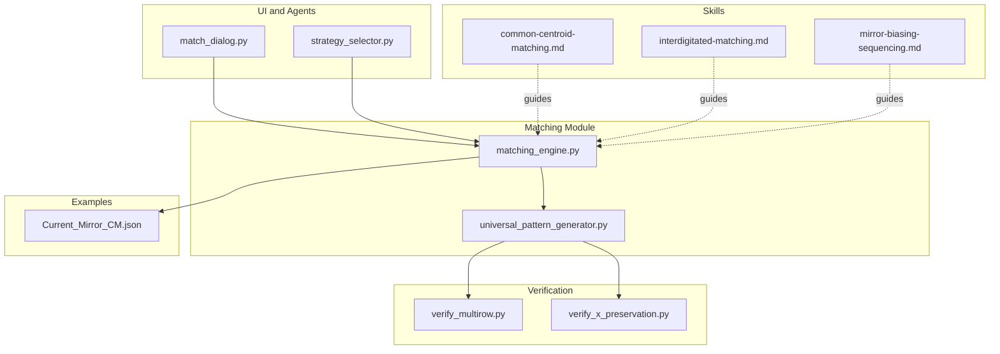
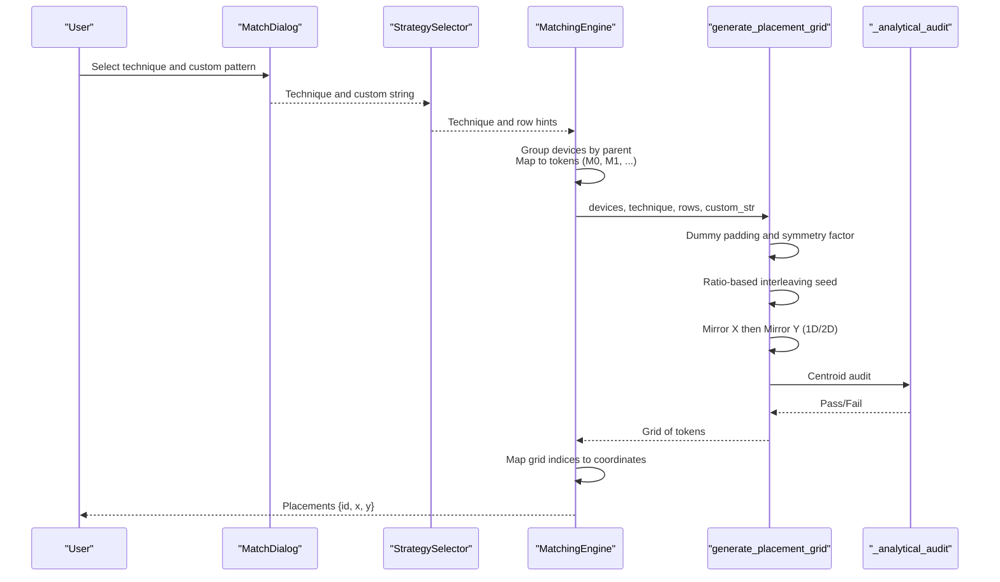
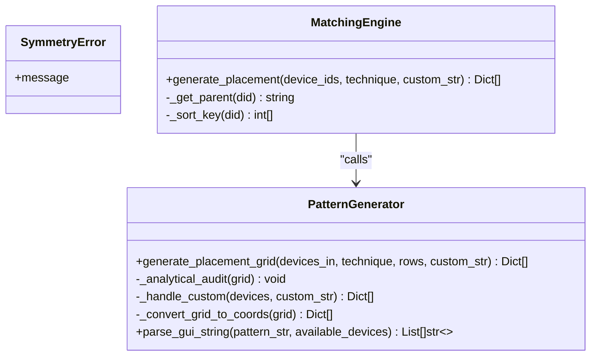
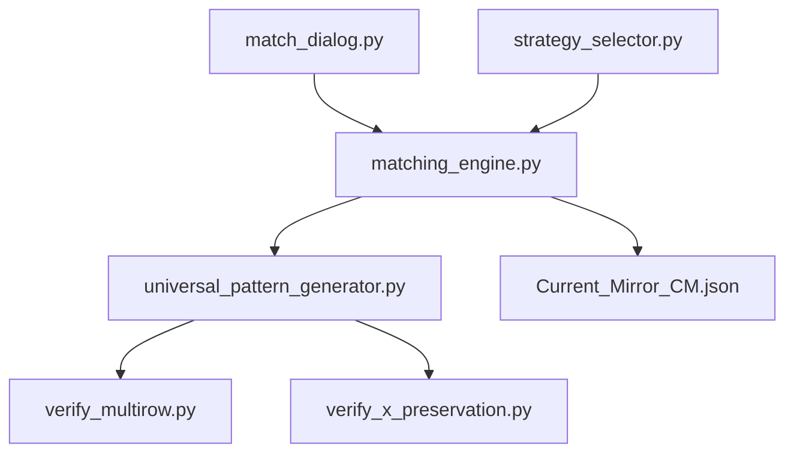

# Universal Pattern Generator

<cite>
**Referenced Files in This Document**
- [universal_pattern_generator.py](file://ai_agent/matching/universal_pattern_generator.py)
- [matching_engine.py](file://ai_agent/matching/matching_engine.py)
- [common-centroid-matching.md](file://ai_agent/SKILLS/common-centroid-matching.md)
- [interdigitated-matching.md](file://ai_agent/SKILLS/interdigitated-matching.md)
- [mirror-biasing-sequencing.md](file://ai_agent/SKILLS/mirror-biasing-sequencing.md)
- [match_dialog.py](file://symbolic_editor/dialogs/match_dialog.py)
- [strategy_selector.py](file://ai_agent/ai_chat_bot/agents/strategy_selector.py)
- [verify_multirow.py](file://brain/67cae616-b8e9-48be-9a93-6ac3dd676254/scratch/verify_multirow.py)
- [verify_x_preservation.py](file://brain/67cae616-b8e9-48be-9a93-6ac3dd676254/scratch/verify_x_preservation.py)
- [Current_Mirror_CM.json](file://examples/current_mirror/Current_Mirror_CM.json)
</cite>

## Table of Contents
1. [Introduction](#introduction)
2. [Project Structure](#project-structure)
3. [Core Components](#core-components)
4. [Architecture Overview](#architecture-overview)
5. [Detailed Component Analysis](#detailed-component-analysis)
6. [Dependency Analysis](#dependency-analysis)
7. [Performance Considerations](#performance-considerations)
8. [Troubleshooting Guide](#troubleshooting-guide)
9. [Conclusion](#conclusion)
10. [Appendices](#appendices)

## Introduction
This document explains the universal pattern generator responsible for creating standardized layout patterns for device matching. It focuses on the generate_placement_grid function and its role in producing optimal placement coordinates for different matching techniques. The document covers pattern generation algorithms for single-row and multi-row arrangements, the coordinate system used for device positioning, the relationship between token identifiers (M0, M1, M2) and physical device groups, handling of custom patterns via slash-separated row specifications, and adaptive row calculation logic. It also provides examples for common centroid matching, interdigitated matching, and mirror biasing configurations, along with the mathematical foundations and guidelines for creating custom matching patterns.

## Project Structure
The universal pattern generator resides in the matching module alongside a matching engine that orchestrates pattern generation and coordinate mapping. Supporting skills documents define matching techniques, while UI dialog and agent components surface user choices and strategy selection. Verification scripts demonstrate row stacking and X-coordinate preservation behavior.

**Diagram sources**
- [universal_pattern_generator.py:1-167](file://ai_agent/matching/universal_pattern_generator.py#L1-L167)
- [matching_engine.py:1-95](file://ai_agent/matching/matching_engine.py#L1-L95)
- [common-centroid-matching.md:1-26](file://ai_agent/SKILLS/common-centroid-matching.md#L1-L26)
- [interdigitated-matching.md:1-29](file://ai_agent/SKILLS/interdigitated-matching.md#L1-L29)
- [mirror-biasing-sequencing.md:1-29](file://ai_agent/SKILLS/mirror-biasing-sequencing.md#L1-L29)
- [match_dialog.py:80-171](file://symbolic_editor/dialogs/match_dialog.py#L80-L171)
- [strategy_selector.py:172-218](file://ai_agent/ai_chat_bot/agents/strategy_selector.py#L172-L218)
- [verify_multirow.py:1-55](file://brain/67cae616-b8e9-48be-9a93-6ac3dd676254/scratch/verify_multirow.py#L1-L55)
- [verify_x_preservation.py:1-52](file://brain/67cae616-b8e9-48be-9a93-6ac3dd676254/scratch/verify_x_preservation.py#L1-L52)
- [Current_Mirror_CM.json:1-5018](file://examples/current_mirror/Current_Mirror_CM.json#L1-L5018)

**Section sources**
- [universal_pattern_generator.py:1-167](file://ai_agent/matching/universal_pattern_generator.py#L1-L167)
- [matching_engine.py:1-95](file://ai_agent/matching/matching_engine.py#L1-L95)

## Core Components
- Universal Pattern Generator: Implements the generate_placement_grid function that produces a grid of device tokens respecting symmetry and centroid balance. It supports custom patterns, ratio-based interleaving, mirroring, and mathematical audit.
- Matching Engine: Orchestrates matching by grouping devices by parent, mapping parents to token identifiers (M0, M1, M2), determining row count, invoking the generator, and converting grid indices to physical coordinates.

Key responsibilities:
- Tokenization: Maps logical parents to tokens (M0, M1, M2...) and counts.
- Row determination: Chooses 2D common centroid for “common_centroid_2d” or single-row otherwise; custom patterns can imply multiple rows.
- Grid assembly: Builds a matrix of device tokens and validates symmetry.
- Coordinate mapping: Converts grid indices to absolute positions using device dimensions and anchor.

**Section sources**
- [universal_pattern_generator.py:9-104](file://ai_agent/matching/universal_pattern_generator.py#L9-L104)
- [matching_engine.py:13-84](file://ai_agent/matching/matching_engine.py#L13-L84)

## Architecture Overview
The pattern generation pipeline integrates user intent, device grouping, and grid construction with a final coordinate mapping stage.

**Diagram sources**
- [match_dialog.py:160-171](file://symbolic_editor/dialogs/match_dialog.py#L160-L171)
- [strategy_selector.py:186-218](file://ai_agent/ai_chat_bot/agents/strategy_selector.py#L186-L218)
- [matching_engine.py:13-84](file://ai_agent/matching/matching_engine.py#L13-L84)
- [universal_pattern_generator.py:9-104](file://ai_agent/matching/universal_pattern_generator.py#L9-L104)

## Detailed Component Analysis

### generate_placement_grid Function
Purpose:
- Produces a rectangular grid of device tokens for matched devices.
- Ensures symmetry and centroid balance using mirroring and ratio-based interleaving.
- Supports custom patterns via slash-separated rows.

Core steps:
1. Custom Pattern Bypass: If technique is CUSTOM and a custom string is provided, parse and validate the pattern against available devices.
2. Grid Initialization: Determine 2D vs 1D based on rows; compute symmetry factor (2 for 1D, 4 for 2D); pad total fingers to be divisible by the symmetry factor using dummy devices.
3. Seed Generation: 
   - 1D: Half-row seed using ratio-based interleaving.
   - 2D: Exactly 2 rows; enforce even finger counts per device; build top row seed and mirror to bottom.
4. Matrix Assembly: Fill grid rows; 1D mirrors seed to both halves; 2D mirrors top row to bottom.
5. Mathematical Audit: Compute per-device centroids and assert equality with global grid center within tolerance.

Coordinate system:
- Grid indices (x_index, y_index) correspond to column and row respectively.
- Final coordinates are derived by the matching engine using device width/height and anchor position.

Relationship to token identifiers (M0, M1, M2):
- Parents are mapped to tokens M0, M1, M2... based on sorted parent order.
- The generator operates on token counts; downstream mapping assigns physical IDs to token positions.

Adaptive row calculation:
- 2D common centroid requires exactly 2 rows.
- Custom patterns with slash-separated rows imply multiple rows; the engine counts slashes plus one.

Error handling:
- SymmetryError raised when symmetry or centroid constraints are violated.

**Section sources**
- [universal_pattern_generator.py:9-104](file://ai_agent/matching/universal_pattern_generator.py#L9-L104)
- [universal_pattern_generator.py:106-131](file://ai_agent/matching/universal_pattern_generator.py#L106-L131)
- [universal_pattern_generator.py:132-146](file://ai_agent/matching/universal_pattern_generator.py#L132-L146)
- [universal_pattern_generator.py:148-154](file://ai_agent/matching/universal_pattern_generator.py#L148-L154)
- [universal_pattern_generator.py:156-167](file://ai_agent/matching/universal_pattern_generator.py#L156-L167)

#### Class and Method Relationships

**Diagram sources**
- [universal_pattern_generator.py:5-7](file://ai_agent/matching/universal_pattern_generator.py#L5-L7)
- [universal_pattern_generator.py:9-104](file://ai_agent/matching/universal_pattern_generator.py#L9-L104)
- [universal_pattern_generator.py:132-167](file://ai_agent/matching/universal_pattern_generator.py#L132-L167)
- [matching_engine.py:5-95](file://ai_agent/matching/matching_engine.py#L5-L95)

### Pattern Generation Algorithms

#### Single-Row Arrangements
- Interdigitated Matching: Ratio-based interleaving distributes fingers proportionally to maintain deterministic interleaving without terminal clustering.
- Common Centroid (1D): Mirrors a half-sequence around the center to cancel linear process gradients.

Mathematical foundation:
- Ratio-based interleaving maximizes the current-to-initial ratio for the remaining count to select the next device token.
- Centroid audit computes per-token centroid and compares to the global grid center.

**Section sources**
- [interdigitated-matching.md:16-29](file://ai_agent/SKILLS/interdigitated-matching.md#L16-L29)
- [common-centroid-matching.md:13-26](file://ai_agent/SKILLS/common-centroid-matching.md#L13-L26)
- [universal_pattern_generator.py:69-86](file://ai_agent/matching/universal_pattern_generator.py#L69-L86)
- [universal_pattern_generator.py:106-131](file://ai_agent/matching/universal_pattern_generator.py#L106-L131)

#### Multi-Row Arrangements
- Common Centroid (2D Multi-Row): Requires exactly 2 rows; enforces even finger counts per device; builds the top row and mirrors it to the bottom to achieve point symmetry.
- Adaptive row calculation: The engine detects custom patterns with slashes and sets rows accordingly.

Verification behavior:
- Row stacking tests confirm correct vertical alignment between PMOS/NMOS rows.
- X-coordinate preservation tests ensure horizontal positions remain unchanged during row correction.

**Section sources**
- [universal_pattern_generator.py:47-49](file://ai_agent/matching/universal_pattern_generator.py#L47-L49)
- [matching_engine.py:29-32](file://ai_agent/matching/matching_engine.py#L29-L32)
- [verify_multirow.py:24-54](file://brain/67cae616-b8e9-48be-9a93-6ac3dd676254/scratch/verify_multirow.py#L24-L54)
- [verify_x_preservation.py:5-44](file://brain/67cae616-b8e9-48be-9a93-6ac3dd676254/scratch/verify_x_preservation.py#L5-L44)

### Coordinate System and Mapping
- Grid indices: x_index (column), y_index (row).
- Physical coordinates: Derived by multiplying indices by device width/height and adding anchor offsets.
- Row height: Set to device height to stack devices without gaps or overlaps.
- Anchor: Top-left of the selected device set; used to translate grid-relative positions to absolute coordinates.

Mapping flow:
- The matching engine computes representative device dimensions and anchor position.
- For each grid cell with a token, pop the next available physical device ID for that parent and assign computed x/y.

**Section sources**
- [matching_engine.py:42-84](file://ai_agent/matching/matching_engine.py#L42-L84)

### Custom Patterns via Slash-Separated Rows
- Format: Use slash (/) to separate rows; each token corresponds to a device or dummy.
- Parsing: Characters A–Z/a–z map to available device tokens; unknown tokens treated as dummy.
- Validation: Total count per device token must not exceed available instances.

Adaptive row calculation:
- Count slashes plus one to determine rows for custom patterns.

**Section sources**
- [universal_pattern_generator.py:132-146](file://ai_agent/matching/universal_pattern_generator.py#L132-L146)
- [universal_pattern_generator.py:156-167](file://ai_agent/matching/universal_pattern_generator.py#L156-L167)
- [matching_engine.py:30-32](file://ai_agent/matching/matching_engine.py#L30-L32)

### Examples of Pattern Generation

#### Common Centroid Matching (1D)
- Scenario: Multiple matched devices in a single row.
- Pattern: Half-sequence mirrored around center.
- Outcome: Balanced centroids and reduced linear gradient sensitivity.

**Section sources**
- [common-centroid-matching.md:13-26](file://ai_agent/SKILLS/common-centroid-matching.md#L13-L26)
- [universal_pattern_generator.py:91-94](file://ai_agent/matching/universal_pattern_generator.py#L91-L94)

#### Interdigitated Matching
- Scenario: Alternating fingers from matched devices in a single row.
- Pattern: Deterministic interleaving based on ratios.
- Outcome: Improved matching and routing regularity.

**Section sources**
- [interdigitated-matching.md:16-29](file://ai_agent/SKILLS/interdigitated-matching.md#L16-L29)
- [universal_pattern_generator.py:69-86](file://ai_agent/matching/universal_pattern_generator.py#L69-L86)

#### Mirror Biasing Sequencing
- Scenario: Symmetric placement for bias/current-mirror groups.
- Pattern: Build half-sequence and mirror deterministically; preserve ratios and symmetry.
- Outcome: Left-right symmetry and explicit center handling.

**Section sources**
- [mirror-biasing-sequencing.md:16-29](file://ai_agent/SKILLS/mirror-biasing-sequencing.md#L16-L29)
- [universal_pattern_generator.py:91-94](file://ai_agent/matching/universal_pattern_generator.py#L91-L94)

#### Multi-Row Common Centroid (2D)
- Scenario: Differential pairs with 4 devices arranged across two rows.
- Pattern: Top row built, bottom row is reversed version of top.
- Outcome: Cancels gradients in both X and Y directions.

**Section sources**
- [universal_pattern_generator.py:95-99](file://ai_agent/matching/universal_pattern_generator.py#L95-L99)
- [verify_multirow.py:24-54](file://brain/67cae616-b8e9-48be-9a93-6ac3dd676254/scratch/verify_multirow.py#L24-L54)

#### Example Layout Reference
- Current Mirror layout demonstrates multi-finger devices and tokenized parent IDs (e.g., MM0, MM1, MM2).
- Useful for validating that generated patterns map correctly to physical devices.

**Section sources**
- [Current_Mirror_CM.json:1-5018](file://examples/current_mirror/Current_Mirror_CM.json#L1-L5018)

## Dependency Analysis
The matching engine depends on the universal pattern generator for grid construction. The UI and agent components influence technique selection and row hints. Verification scripts validate row stacking and X-coordinate preservation.

**Diagram sources**
- [matching_engine.py:1-95](file://ai_agent/matching/matching_engine.py#L1-L95)
- [universal_pattern_generator.py:1-167](file://ai_agent/matching/universal_pattern_generator.py#L1-L167)
- [match_dialog.py:160-171](file://symbolic_editor/dialogs/match_dialog.py#L160-L171)
- [strategy_selector.py:186-218](file://ai_agent/ai_chat_bot/agents/strategy_selector.py#L186-L218)
- [verify_multirow.py:1-55](file://brain/67cae616-b8e9-48be-9a93-6ac3dd676254/scratch/verify_multirow.py#L1-L55)
- [verify_x_preservation.py:1-52](file://brain/67cae616-b8e9-48be-9a93-6ac3dd676254/scratch/verify_x_preservation.py#L1-L52)
- [Current_Mirror_CM.json:1-5018](file://examples/current_mirror/Current_Mirror_CM.json#L1-L5018)

**Section sources**
- [matching_engine.py:1-95](file://ai_agent/matching/matching_engine.py#L1-L95)
- [universal_pattern_generator.py:1-167](file://ai_agent/matching/universal_pattern_generator.py#L1-L167)

## Performance Considerations
- Complexity: Grid assembly and ratio-based interleaving are linear in the number of tokens; centroid audit is O(R*C) where R and C are rows and columns.
- Memory: Grid storage scales with R*C; intermediate lists for seeds and counts are bounded by the number of device types.
- Practical tips:
  - Prefer deterministic patterns to avoid retries.
  - Ensure even finger counts for 2D common centroid to prevent symmetry errors.
  - Limit custom pattern complexity to reduce parsing overhead.

[No sources needed since this section provides general guidance]

## Troubleshooting Guide
Common issues and resolutions:
- SymmetryError: Indicates centroid mismatch or invalid constraints (e.g., 2D requiring exactly 2 rows, even finger counts).
  - Verify technique and row count; ensure device counts support symmetry factor.
- Custom pattern violations: Pattern uses more instances than available or introduces invalid tokens.
  - Check token mapping and counts; adjust pattern or device inventory.
- Row stacking anomalies: Confirm PMOS/NMOS vertical alignment and row order.
  - Review verification outputs and adjust device heights or anchors if needed.
- X-coordinate drift: Ensure device widths and anchors are consistent; avoid unintended transformations.

**Section sources**
- [universal_pattern_generator.py:47-49](file://ai_agent/matching/universal_pattern_generator.py#L47-L49)
- [universal_pattern_generator.py:129-131](file://ai_agent/matching/universal_pattern_generator.py#L129-L131)
- [universal_pattern_generator.py:142-144](file://ai_agent/matching/universal_pattern_generator.py#L142-L144)
- [verify_multirow.py:42-54](file://brain/67cae616-b8e9-48be-9a93-6ac3dd676254/scratch/verify_multirow.py#L42-L54)
- [verify_x_preservation.py:35-44](file://brain/67cae616-b8e9-48be-9a93-6ac3dd676254/scratch/verify_x_preservation.py#L35-L44)

## Conclusion
The universal pattern generator provides a robust, mathematically grounded method for creating symmetric and balanced device placement patterns. By combining ratio-based interleaving, mirroring, and centroid auditing, it supports single-row and multi-row configurations, integrates with UI and agent-driven strategy selection, and maps cleanly to physical coordinates. Custom patterns enable flexible layouts while maintaining symmetry and count conservation.

[No sources needed since this section summarizes without analyzing specific files]

## Appendices

### Mathematical Foundations
- Symmetry factor: 2 for 1D common centroid, 4 for 2D common centroid.
- Ratio-based interleaving: Selects the next token by maximizing current_count / initial_count.
- Centroid audit: Compares per-token centroid to global center; rejects deviations beyond tolerance.

**Section sources**
- [universal_pattern_generator.py:33-34](file://ai_agent/matching/universal_pattern_generator.py#L33-L34)
- [universal_pattern_generator.py:69-86](file://ai_agent/matching/universal_pattern_generator.py#L69-L86)
- [universal_pattern_generator.py:120-131](file://ai_agent/matching/universal_pattern_generator.py#L120-L131)

### Guidelines for Creating Custom Matching Patterns
- Use uppercase/lowercase letters A–Z/a–z to represent device tokens; unknown tokens treated as dummy.
- Separate rows with a slash (/); each row defines a horizontal sequence.
- Ensure total token counts do not exceed available device instances.
- For 2D common centroid, keep exactly 2 rows and even finger counts per device.
- Validate the pattern by running the generator; address symmetry errors by adjusting counts or rows.

**Section sources**
- [universal_pattern_generator.py:132-146](file://ai_agent/matching/universal_pattern_generator.py#L132-L146)
- [universal_pattern_generator.py:156-167](file://ai_agent/matching/universal_pattern_generator.py#L156-L167)
- [matching_engine.py:29-32](file://ai_agent/matching/matching_engine.py#L29-L32)