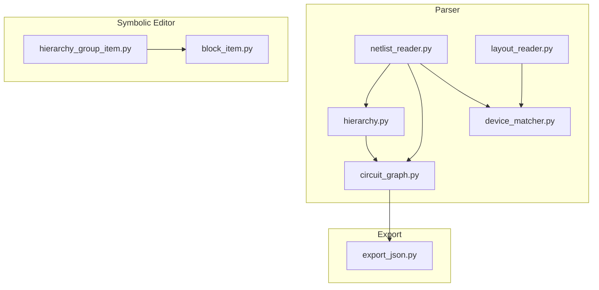
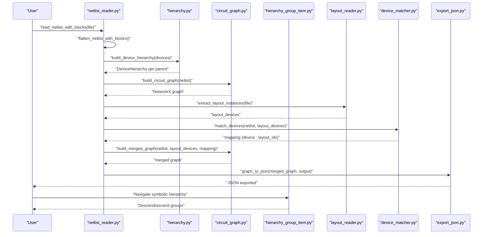
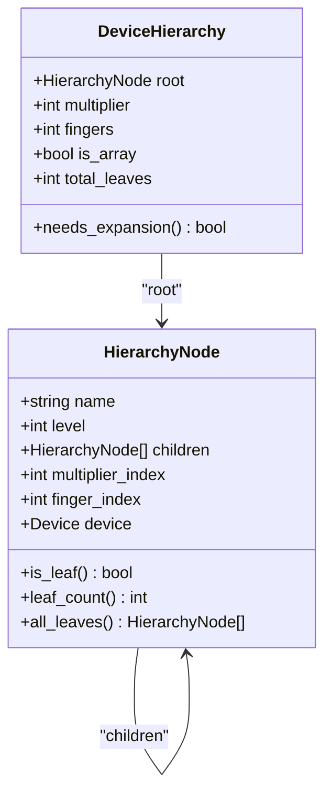
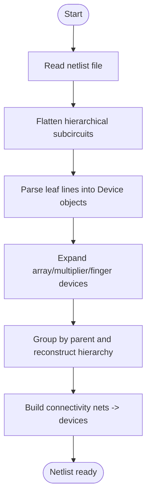
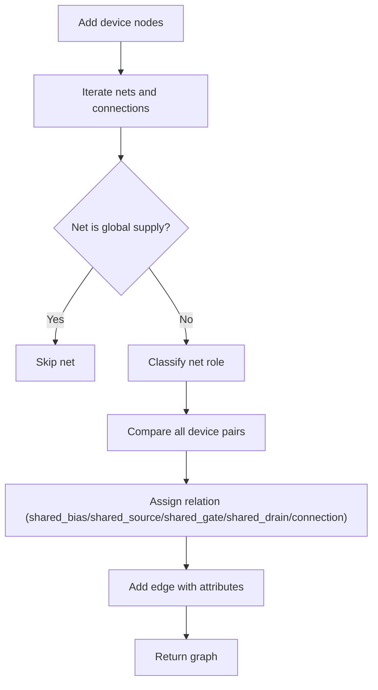
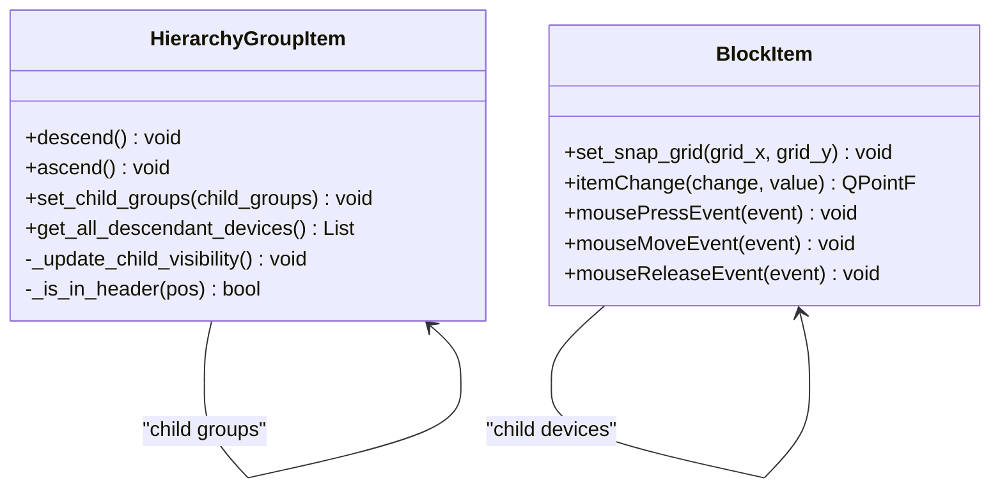
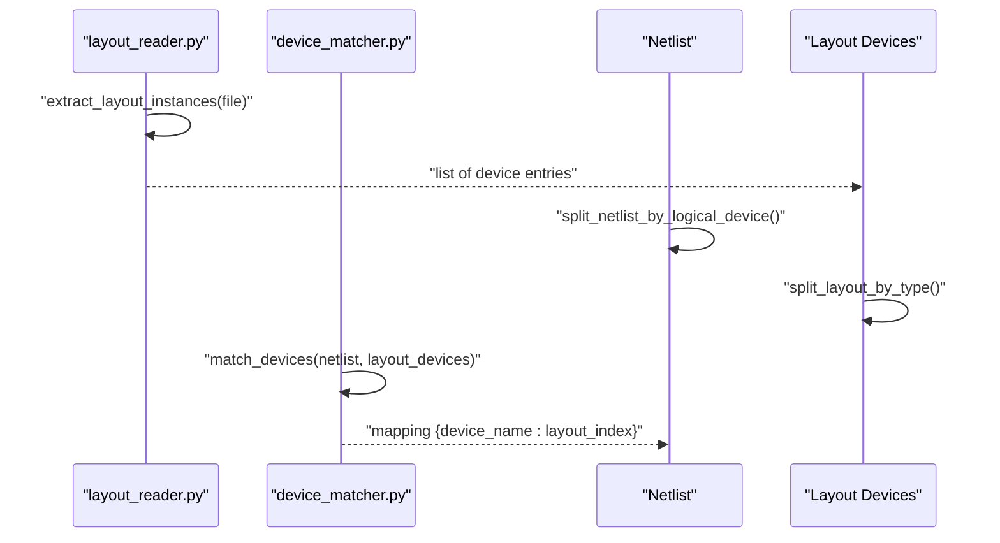
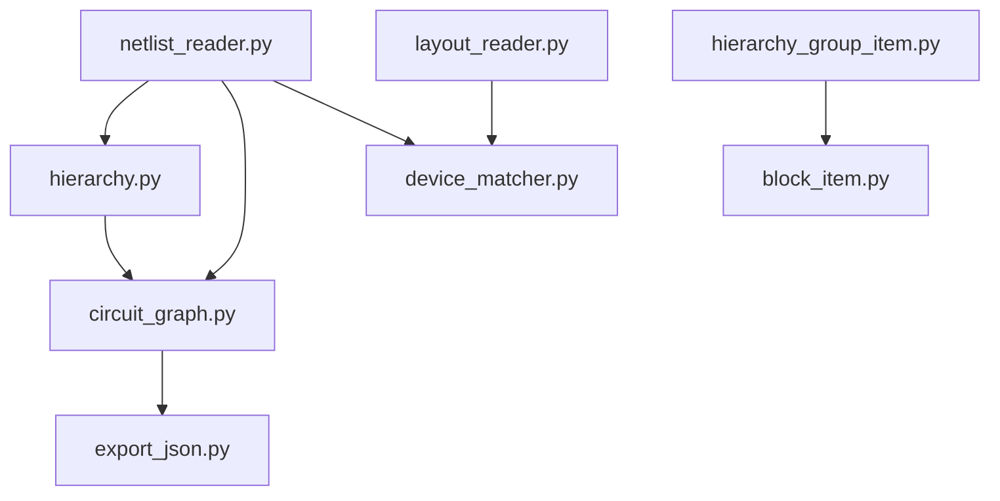

# Hierarchical Design Support

<cite>
**Referenced Files in This Document**
- [hierarchy.py](file://parser/hierarchy.py)
- [netlist_reader.py](file://parser/netlist_reader.py)
- [circuit_graph.py](file://parser/circuit_graph.py)
- [hierarchy_group_item.py](file://symbolic_editor/hierarchy_group_item.py)
- [block_item.py](file://symbolic_editor/block_item.py)
- [layout_reader.py](file://parser/layout_reader.py)
- [device_matcher.py](file://parser/device_matcher.py)
- [export_json.py](file://export/export_json.py)
- [SYMBOLIC_HIERARCHY.md](file://docs/SYMBOLIC_HIERARCHY.md)
- [Miller_OTA_graph_compressed.json](file://examples/Miller_OTA/Miller_OTA_graph_compressed.json)
- [Current_Mirror_CM.json](file://examples/current_mirror/Current_Mirror_CM.json)
</cite>

## Table of Contents
1. [Introduction](#introduction)
2. [Project Structure](#project-structure)
3. [Core Components](#core-components)
4. [Architecture Overview](#architecture-overview)
5. [Detailed Component Analysis](#detailed-component-analysis)
6. [Dependency Analysis](#dependency-analysis)
7. [Performance Considerations](#performance-considerations)
8. [Troubleshooting Guide](#troubleshooting-guide)
9. [Conclusion](#conclusion)
10. [Appendices](#appendices)

## Introduction
This document explains the hierarchical design support system that enables complex multi-level analog circuits with block-level management. It covers:
- Hierarchical device organization via array, multiplier (m), and finger (nf) parameters
- Visual hierarchical grouping for symbolic editing and navigation
- Hierarchical netlist parsing and circuit graph construction that preserves parent-child relationships
- Practical examples for operational amplifiers and current mirrors
- Benefits for reusability, modularity, and maintainability
- Performance considerations and best practices for deep hierarchies

## Project Structure
The hierarchical design system spans parsing, visualization, and export layers:
- Parser: netlist parsing, hierarchy reconstruction, circuit graph construction, layout extraction
- Symbolic Editor: visual grouping and navigation of hierarchical devices
- Examples and Docs: representative designs and documentation for symbolic hierarchy

**Diagram sources**
- [netlist_reader.py](file://parser/netlist_reader.py)
- [hierarchy.py](file://parser/hierarchy.py)
- [circuit_graph.py](file://parser/circuit_graph.py)
- [layout_reader.py](file://parser/layout_reader.py)
- [device_matcher.py](file://parser/device_matcher.py)
- [hierarchy_group_item.py](file://symbolic_editor/hierarchy_group_item.py)
- [block_item.py](file://symbolic_editor/block_item.py)
- [export_json.py](file://export/export_json.py)

**Section sources**
- [netlist_reader.py](file://parser/netlist_reader.py)
- [hierarchy.py](file://parser/hierarchy.py)
- [circuit_graph.py](file://parser/circuit_graph.py)
- [layout_reader.py](file://parser/layout_reader.py)
- [device_matcher.py](file://parser/device_matcher.py)
- [hierarchy_group_item.py](file://symbolic_editor/hierarchy_group_item.py)
- [block_item.py](file://symbolic_editor/block_item.py)
- [export_json.py](file://export/export_json.py)

## Core Components
- Device hierarchy modeling and expansion: array/multiplier/finger parameters are parsed and expanded into a tree of nodes with parent-child relationships.
- Netlist parsing and flattening: hierarchical SPICE/CDL subcircuits are flattened into leaf device statements with hierarchical prefixes and block membership tracking.
- Circuit graph construction: electrical connectivity is transformed into a NetworkX graph with behavioral edge classification and optional geometry merging.
- Visual hierarchical grouping: symbolic rectangles represent parent devices and can be navigated to reveal children (multipliers or fingers).
- Layout extraction and device matching: hierarchical layout instances are extracted and mapped to netlist devices, collapsing expanded multi-finger devices onto shared layout instances.

**Section sources**
- [hierarchy.py](file://parser/hierarchy.py)
- [netlist_reader.py](file://parser/netlist_reader.py)
- [circuit_graph.py](file://parser/circuit_graph.py)
- [hierarchy_group_item.py](file://symbolic_editor/hierarchy_group_item.py)
- [layout_reader.py](file://parser/layout_reader.py)
- [device_matcher.py](file://parser/device_matcher.py)

## Architecture Overview
The system integrates parsing, visualization, and export to support hierarchical analog design:
- Parsing phase: flatten hierarchical netlists, expand array/multiplier/finger devices, and reconstruct hierarchy from expanded devices
- Graph phase: build electrical connectivity graph and optionally merge with layout geometry
- Visualization phase: present hierarchical groups as symbolic rectangles with navigation controls
- Matching phase: map netlist devices to layout instances, collapsing multi-finger expansions onto shared layout instances
- Export phase: produce JSON consumable by AI placement agents

**Diagram sources**
- [netlist_reader.py](file://parser/netlist_reader.py)
- [hierarchy.py](file://parser/hierarchy.py)
- [circuit_graph.py](file://parser/circuit_graph.py)
- [layout_reader.py](file://parser/layout_reader.py)
- [device_matcher.py](file://parser/device_matcher.py)
- [export_json.py](file://export/export_json.py)
- [hierarchy_group_item.py](file://symbolic_editor/hierarchy_group_item.py)

## Detailed Component Analysis

### Hierarchical Device Expansion and Grouping
The hierarchy module defines:
- Array suffix parsing for devices and nets
- Integer parameter extraction with robust defaults and clamping
- HierarchyNode and DeviceHierarchy data structures
- Functions to build DeviceHierarchy from parameters and to reconstruct hierarchies from expanded devices
- Generation of leaf Device objects with parent-child metadata

Key behaviors:
- Effective multiplier computation considers array_count and m/nf combinations
- Two-level hierarchies (multiplier + fingers) and single-level expansions are supported
- Expanded devices are attached to leaf nodes with parent pointers and index metadata

**Diagram sources**
- [hierarchy.py](file://parser/hierarchy.py)

**Section sources**
- [hierarchy.py](file://parser/hierarchy.py)

### Netlist Parsing and Hierarchical Flattening
The netlist reader:
- Parses SPICE/CDL lines into Device objects with type, pins, and parameters
- Supports array suffixes (<N>) and expands m/nf into child devices
- Flattens hierarchical subcircuits (X-instances) with hierarchical prefixes
- Tracks block membership for top-level instances and subckt types
- Builds connectivity mapping from nets to devices and pins

**Diagram sources**
- [netlist_reader.py](file://parser/netlist_reader.py)

**Section sources**
- [netlist_reader.py](file://parser/netlist_reader.py)

### Circuit Graph Construction and Merging
The circuit graph module:
- Adds device nodes with type, width, length, and nf
- Classifies nets by electrical role (bias, signal, gate) and adds edges accordingly
- Builds a merged graph by incorporating layout geometry (x, y, width, height, orientation)
- Excludes global supplies to preserve meaningful connectivity

**Diagram sources**
- [circuit_graph.py](file://parser/circuit_graph.py)

**Section sources**
- [circuit_graph.py](file://parser/circuit_graph.py)

### Visual Hierarchical Grouping
The symbolic editor provides:
- HierarchyGroupItem: a draggable bounding rectangle representing a parent device
- BlockItem: a movable block grouping multiple devices at the block level
- Navigation: double-click header to descend/ascend; drag to move children together
- Visibility management: when not descended, shows the group; when descended, shows children

**Diagram sources**
- [hierarchy_group_item.py](file://symbolic_editor/hierarchy_group_item.py)
- [block_item.py](file://symbolic_editor/block_item.py)

**Section sources**
- [hierarchy_group_item.py](file://symbolic_editor/hierarchy_group_item.py)
- [block_item.py](file://symbolic_editor/block_item.py)
- [SYMBOLIC_HIERARCHY.md](file://docs/SYMBOLIC_HIERARCHY.md)

### Layout Extraction and Device Matching
The layout reader:
- Extracts device instances from OAS/GDS libraries, handling both flat and hierarchical layouts
- Recursively walks references to find leaf transistor instances and passive devices
- Preserves hierarchical prefixes and orientation information

The device matcher:
- Splits layout and netlist devices by type and logical parents
- Matches devices deterministically, collapsing expanded multi-finger netlists onto shared layout instances when counts differ

**Diagram sources**
- [layout_reader.py](file://parser/layout_reader.py)
- [device_matcher.py](file://parser/device_matcher.py)

**Section sources**
- [layout_reader.py](file://parser/layout_reader.py)
- [device_matcher.py](file://parser/device_matcher.py)

### Practical Examples: Operational Amplifiers and Current Mirrors
- Miller OTA: demonstrates multi-stage amplifier with differential input, cascode load, and compensation capacitor; includes device types, terminal nets, and connectivity
- Current mirror: shows multi-finger NMOS/PMOS devices grouped under logical parents with geometry and electrical parameters

These examples illustrate:
- Multi-level hierarchies (multipliers and fingers) represented in JSON
- Terminal nets and connectivity for graph construction
- Geometry and orientation for merged graph building

**Section sources**
- [Miller_OTA_graph_compressed.json](file://examples/Miller_OTA/Miller_OTA_graph_compressed.json)
- [Current_Mirror_CM.json](file://examples/current_mirror/Current_Mirror_CM.json)

## Dependency Analysis
The system exhibits layered dependencies:
- Parser depends on hierarchy for device expansion and on netlist_reader for flattening and connectivity
- Symbolic editor depends on hierarchy_group_item for visualization and block_item for block-level grouping
- Layout extraction feeds into device matching, which informs merged graph construction
- Export consumes merged graphs for downstream AI placement

**Diagram sources**
- [netlist_reader.py](file://parser/netlist_reader.py)
- [hierarchy.py](file://parser/hierarchy.py)
- [circuit_graph.py](file://parser/circuit_graph.py)
- [layout_reader.py](file://parser/layout_reader.py)
- [device_matcher.py](file://parser/device_matcher.py)
- [export_json.py](file://export/export_json.py)
- [hierarchy_group_item.py](file://symbolic_editor/hierarchy_group_item.py)
- [block_item.py](file://symbolic_editor/block_item.py)

**Section sources**
- [netlist_reader.py](file://parser/netlist_reader.py)
- [hierarchy.py](file://parser/hierarchy.py)
- [circuit_graph.py](file://parser/circuit_graph.py)
- [layout_reader.py](file://parser/layout_reader.py)
- [device_matcher.py](file://parser/device_matcher.py)
- [export_json.py](file://export/export_json.py)
- [hierarchy_group_item.py](file://symbolic_editor/hierarchy_group_item.py)
- [block_item.py](file://symbolic_editor/block_item.py)

## Performance Considerations
- Hierarchical visualization: symbolic view reduces visible items, improving rendering performance at higher zoom levels
- Graph construction: excluding global supplies avoids dense edges and improves traversal speed
- Matching collapse: collapsing expanded multi-finger devices onto shared layout instances reduces mapping complexity
- Deep hierarchies: prefer descending only when needed; avoid unnecessary traversal of hidden children
- Layout extraction: recursive traversal is efficient but should be scoped to known device types to minimize overhead

[No sources needed since this section provides general guidance]

## Troubleshooting Guide
Common issues and resolutions:
- Devices visible when parent not descended: ensure child groups are set and visibility is updated
- Cannot descend into hierarchy: verify child groups or devices are added to the parent
- Selection not blocked for hidden devices: confirm the editor uses the hierarchy-aware scene
- Count mismatches in matching: the matcher collapses expanded multi-finger devices onto shared instances with warnings
- Global supplies affecting graph: ensure global nets are excluded from edge classification

**Section sources**
- [SYMBOLIC_HIERARCHY.md](file://docs/SYMBOLIC_HIERARCHY.md)
- [device_matcher.py](file://parser/device_matcher.py)
- [circuit_graph.py](file://parser/circuit_graph.py)

## Conclusion
The hierarchical design support system provides a robust framework for managing complex analog circuits:
- Hierarchical organization enables modular, reusable blocks with clear parent-child relationships
- Visual grouping and navigation improve usability and reduce cognitive load
- Hierarchical netlist parsing and circuit graph construction preserve design semantics
- Practical examples demonstrate real-world applicability for operational amplifiers and current mirrors
- Performance and best practices ensure scalability with deep hierarchies

[No sources needed since this section summarizes without analyzing specific files]

## Appendices

### Best Practices for Deeply Nested Hierarchies
- Prefer symbolic view for high-level navigation; descend only when interacting with specific levels
- Use block-level grouping for functional regions (e.g., input stages, load networks)
- Maintain consistent naming conventions for parent, multiplier, and finger indices
- Collapse multi-finger expansions during matching to reduce mapping complexity
- Validate connectivity and geometry before exporting for AI placement

[No sources needed since this section provides general guidance]