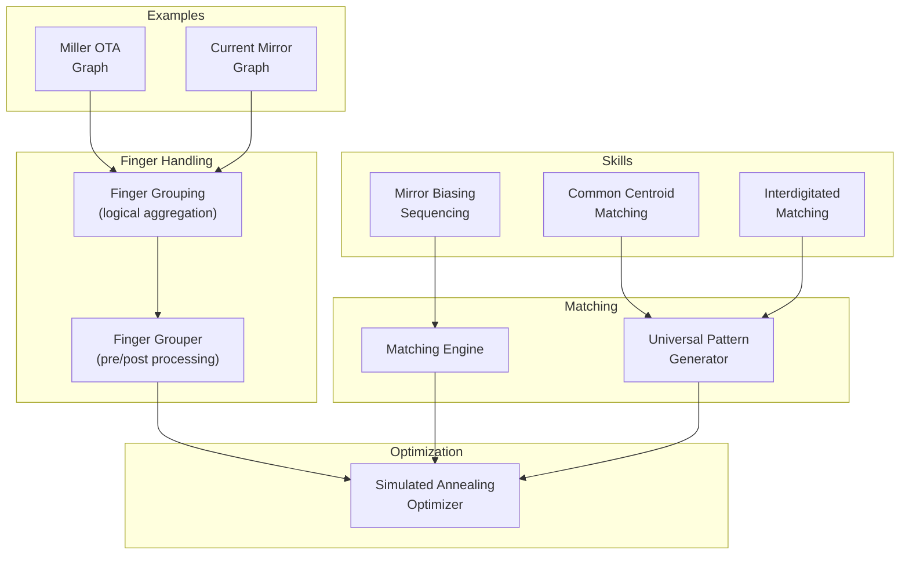
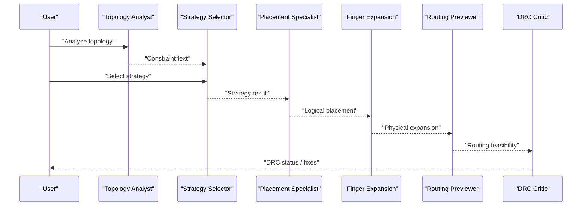
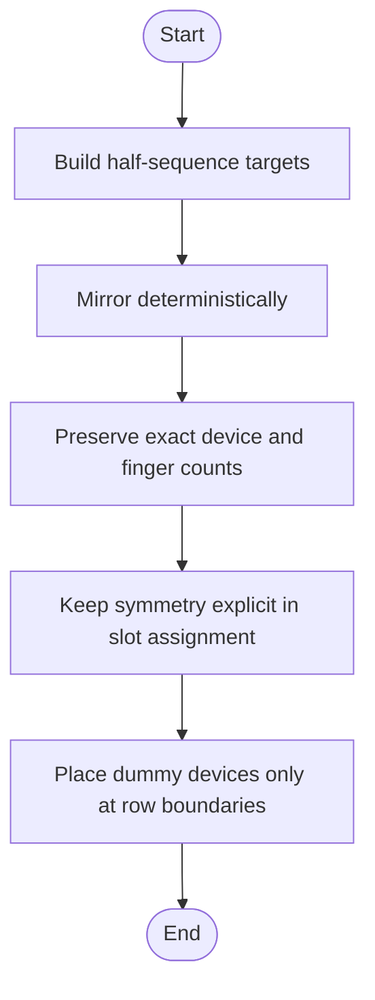
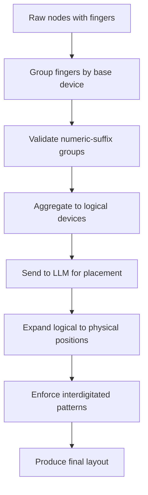
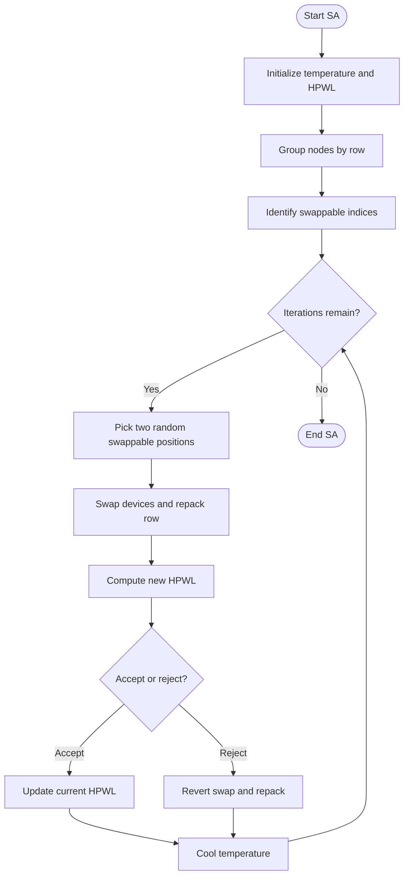
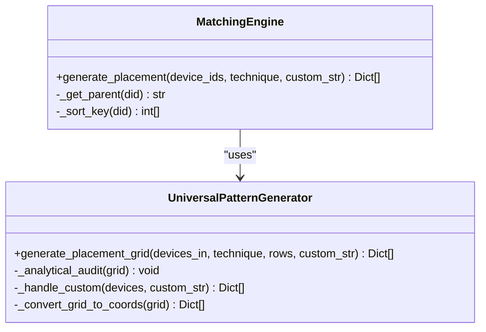
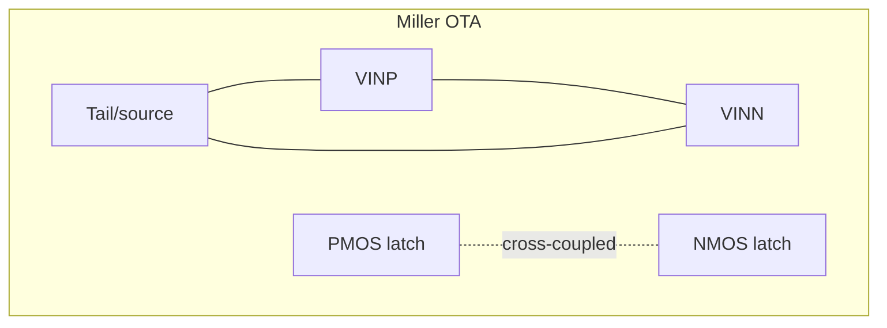
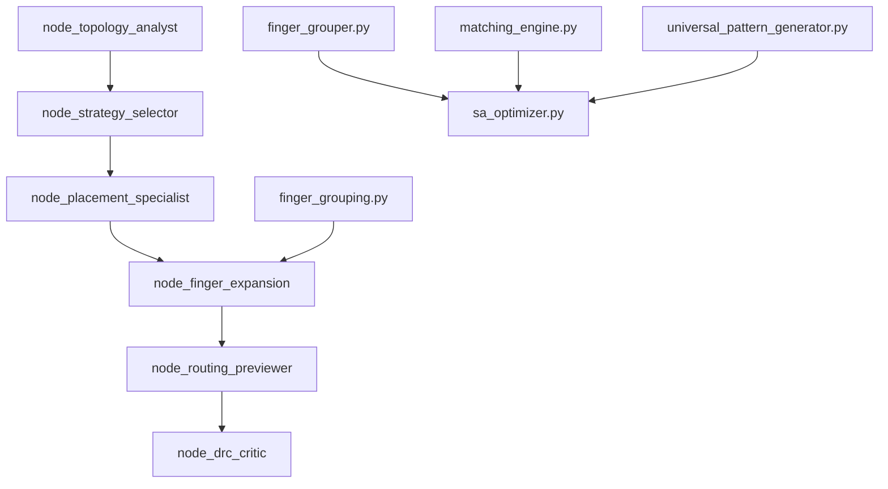

# Specialized Layout Techniques

<cite>
**Referenced Files in This Document**
- [mirror-biasing-sequencing.md](file://ai_agent/SKILLS/mirror-biasing-sequencing.md)
- [common-centroid-matching.md](file://ai_agent/SKILLS/common-centroid-matching.md)
- [interdigitated-matching.md](file://ai_agent/SKILLS/interdigitated-matching.md)
- [finger_grouping.py](file://ai_agent/ai_chat_bot/finger_grouping.py)
- [sa_optimizer.py](file://ai_agent/ai_initial_placement/sa_optimizer.py)
- [finger_grouper.py](file://ai_agent/ai_initial_placement/finger_grouper.py)
- [matching_engine.py](file://ai_agent/matching/matching_engine.py)
- [universal_pattern_generator.py](file://ai_agent/matching/universal_pattern_generator.py)
- [Miller_OTA_graph_compressed.json](file://examples/Miller_OTA/Miller_OTA_graph_compressed.json)
- [Current_Mirror_CM_graph_compressed.json](file://examples/current_mirror/Current_Mirror_CM_graph_compressed.json)
- [README.md](file://README.md)
- [placer_utils.py](file://ai_agent/ai_initial_placement/placer_utils.py)
- [nodes.py](file://ai_agent/ai_chat_bot/nodes.py)
- [graph.py](file://ai_agent/ai_chat_bot/graph.py)
</cite>

## Table of Contents
1. [Introduction](#introduction)
2. [Project Structure](#project-structure)
3. [Core Components](#core-components)
4. [Architecture Overview](#architecture-overview)
5. [Detailed Component Analysis](#detailed-component-analysis)
6. [Dependency Analysis](#dependency-analysis)
7. [Performance Considerations](#performance-considerations)
8. [Troubleshooting Guide](#troubleshooting-guide)
9. [Conclusion](#conclusion)
10. [Appendices](#appendices)

## Introduction
This document explains specialized layout techniques that enhance analog circuit performance through advanced placement and optimization strategies. It focuses on three pillars:
- Mirror biasing sequencing for improved device matching in biasing networks
- The finger grouper algorithm for optimizing multi-finger device arrangements for uniform current distribution and thermal stability
- A simulated annealing optimizer that iteratively improves device configurations to minimize wirelength and improve performance

We also provide practical examples from complex analog circuits (operational amplifiers and bandgap references) and offer guidelines for trade-offs and technique selection.

## Project Structure
The repository integrates layout automation with AI agents that analyze topology, select strategies, and execute deterministic placement with post-processing and validation. Key modules include:
- Skills catalog for layout techniques (mirror biasing, common centroid, interdigitated matching)
- Finger grouping utilities for multi-finger device handling
- Simulated annealing optimizer for post-placement refinement
- Matching engines and pattern generators for symmetry-aware placement
- Example circuits and compressed graph formats for AI prompts

**Diagram sources**
- [mirror-biasing-sequencing.md:1-29](file://ai_agent/SKILLS/mirror-biasing-sequencing.md#L1-L29)
- [common-centroid-matching.md:1-26](file://ai_agent/SKILLS/common-centroid-matching.md#L1-L26)
- [interdigitated-matching.md:1-29](file://ai_agent/SKILLS/interdigitated-matching.md#L1-L29)
- [finger_grouping.py:1-512](file://ai_agent/ai_chat_bot/finger_grouping.py#L1-L512)
- [finger_grouper.py:1-800](file://ai_agent/ai_initial_placement/finger_grouper.py#L1-L800)
- [sa_optimizer.py:1-256](file://ai_agent/ai_initial_placement/sa_optimizer.py#L1-L256)
- [matching_engine.py:1-95](file://ai_agent/matching/matching_engine.py#L1-L95)
- [universal_pattern_generator.py:1-167](file://ai_agent/matching/universal_pattern_generator.py#L1-L167)
- [Miller_OTA_graph_compressed.json:1-186](file://examples/Miller_OTA/Miller_OTA_graph_compressed.json#L1-L186)
- [Current_Mirror_CM_graph_compressed.json:1-126](file://examples/current_mirror/Current_Mirror_CM_graph_compressed.json#L1-L126)

**Section sources**
- [README.md:131-191](file://README.md#L131-L191)

## Core Components
- Mirror Biasing Sequencing: Ensures symmetric, mirror-safe placement of bias/current-mirror groups while preserving ratios and left-right symmetry.
- Finger Grouping: Aggregates multi-finger devices into logical units for AI placement, then deterministically expands them back to physical finger positions with precise spacing.
- Simulated Annealing Optimizer: Minimizes total Half-Perimeter Wire Length (HPWL) within rows while respecting abutment chains and device conservation.
- Matching Engines and Pattern Generators: Provide common-centroid and interdigitated matching strategies with centroid balance and proportional distribution.

**Section sources**
- [mirror-biasing-sequencing.md:16-29](file://ai_agent/SKILLS/mirror-biasing-sequencing.md#L16-L29)
- [finger_grouping.py:116-191](file://ai_agent/ai_chat_bot/finger_grouping.py#L116-L191)
- [sa_optimizer.py:130-256](file://ai_agent/ai_initial_placement/sa_optimizer.py#L130-L256)
- [matching_engine.py:13-84](file://ai_agent/matching/matching_engine.py#L13-L84)
- [universal_pattern_generator.py:9-104](file://ai_agent/matching/universal_pattern_generator.py#L9-L104)

## Architecture Overview
The layout automation pipeline integrates skills, matching, finger handling, and optimization into a cohesive workflow. The AI chatbot orchestrates stages: topology analysis, strategy selection, placement, finger expansion, routing preview, and DRC critique. The pipeline preserves device inventory and enforces symmetry constraints.

**Diagram sources**
- [graph.py:1-52](file://ai_agent/ai_chat_bot/graph.py#L1-L52)
- [nodes.py:325-634](file://ai_agent/ai_chat_bot/nodes.py#L325-L634)

**Section sources**
- [graph.py:1-52](file://ai_agent/ai_chat_bot/graph.py#L1-L52)
- [nodes.py:325-634](file://ai_agent/ai_chat_bot/nodes.py#L325-L634)

## Detailed Component Analysis

### Mirror Biasing Sequencing
Mirror biasing ensures that bias/current-mirror pairs are arranged symmetrically to preserve ratios and left-right symmetry. The guidance emphasizes building half-sequences and mirroring deterministically, preserving device and finger counts, and placing dummy devices only at row boundaries when required.

**Diagram sources**
- [mirror-biasing-sequencing.md:20-29](file://ai_agent/SKILLS/mirror-biasing-sequencing.md#L20-L29)

**Section sources**
- [mirror-biasing-sequencing.md:16-29](file://ai_agent/SKILLS/mirror-biasing-sequencing.md#L16-L29)

### Finger Grouper Algorithm
The finger grouper collapses individual finger/multiplier nodes into compact transistor-level representations before LLM placement and expands them back afterward. It:
- Groups fingers by base device and validates numeric suffix groups
- Aggregates to logical devices with nf and effective nf
- Expands logical devices back to physical finger positions with deterministic spacing
- Supports interdigitated patterns for matched pairs

**Diagram sources**
- [finger_grouper.py:116-232](file://ai_agent/ai_initial_placement/finger_grouper.py#L116-L232)
- [finger_grouping.py:116-191](file://ai_agent/ai_chat_bot/finger_grouping.py#L116-L191)
- [finger_grouping.py:308-354](file://ai_agent/ai_chat_bot/finger_grouping.py#L308-L354)

**Section sources**
- [finger_grouper.py:116-232](file://ai_agent/ai_initial_placement/finger_grouper.py#L116-L232)
- [finger_grouping.py:116-191](file://ai_agent/ai_chat_bot/finger_grouping.py#L116-L191)
- [finger_grouping.py:308-354](file://ai_agent/ai_chat_bot/finger_grouping.py#L308-L354)

### Simulated Annealing Optimizer
The SA optimizer minimizes total HPWL by swapping non-chain devices within rows and deterministically repacking rows to maintain correct spacing. It:
- Computes HPWL across signal nets
- Builds abutment sets and identifies swappable indices per row
- Performs iterative swaps with acceptance based on energy change and temperature
- Prints progress and improvement percentages

**Diagram sources**
- [sa_optimizer.py:130-256](file://ai_agent/ai_initial_placement/sa_optimizer.py#L130-L256)

**Section sources**
- [sa_optimizer.py:130-256](file://ai_agent/ai_initial_placement/sa_optimizer.py#L130-L256)

### Matching Techniques: Common Centroid and Interdigitated
- Common Centroid Matching: Balances centroid positions to reduce linear process-gradient mismatch while preserving device counts and conservation.
- Interdigitated Matching: Interleaves fingers from matched devices using deterministic proportional distribution to improve matching and routing regularity.

**Diagram sources**
- [matching_engine.py:5-95](file://ai_agent/matching/matching_engine.py#L5-L95)
- [universal_pattern_generator.py:9-104](file://ai_agent/matching/universal_pattern_generator.py#L9-L104)

**Section sources**
- [common-centroid-matching.md:13-26](file://ai_agent/SKILLS/common-centroid-matching.md#L13-L26)
- [interdigitated-matching.md:16-29](file://ai_agent/SKILLS/interdigitated-matching.md#L16-L29)
- [matching_engine.py:13-84](file://ai_agent/matching/matching_engine.py#L13-L84)
- [universal_pattern_generator.py:9-104](file://ai_agent/matching/universal_pattern_generator.py#L9-L104)

### Practical Examples: Operational Amplifiers and Bandgap References
- Miller OTA: Demonstrates differential pairs, cross-coupled latch, and tail current sources with row assignments and device parameters suitable for mirror biasing and interdigitated matching.
- Current Mirror: Shows matched pairs and biasing networks suitable for mirror biasing sequencing and common centroid matching.

**Diagram sources**
- [Miller_OTA_graph_compressed.json:25-144](file://examples/Miller_OTA/Miller_OTA_graph_compressed.json#L25-L144)

**Section sources**
- [Miller_OTA_graph_compressed.json:1-186](file://examples/Miller_OTA/Miller_OTA_graph_compressed.json#L1-L186)
- [Current_Mirror_CM_graph_compressed.json:1-126](file://examples/current_mirror/Current_Mirror_CM_graph_compressed.json#L1-L126)

## Dependency Analysis
The layout automation system connects skills, matching, finger handling, and optimization through a LangGraph pipeline. The nodes orchestrate topology analysis, strategy selection, placement, finger expansion, routing preview, and DRC critique. Validation utilities ensure device conservation and proper abutment spacing.

**Diagram sources**
- [graph.py:1-52](file://ai_agent/ai_chat_bot/graph.py#L1-L52)
- [nodes.py:325-634](file://ai_agent/ai_chat_bot/nodes.py#L325-L634)
- [finger_grouper.py:1-800](file://ai_agent/ai_initial_placement/finger_grouper.py#L1-L800)
- [sa_optimizer.py:1-256](file://ai_agent/ai_initial_placement/sa_optimizer.py#L1-L256)
- [matching_engine.py:1-95](file://ai_agent/matching/matching_engine.py#L1-L95)
- [universal_pattern_generator.py:1-167](file://ai_agent/matching/universal_pattern_generator.py#L1-L167)
- [finger_grouping.py:1-512](file://ai_agent/ai_chat_bot/finger_grouping.py#L1-L512)

**Section sources**
- [graph.py:1-52](file://ai_agent/ai_chat_bot/graph.py#L1-L52)
- [nodes.py:325-634](file://ai_agent/ai_chat_bot/nodes.py#L325-L634)

## Performance Considerations
- Thermal Stability: Interdigitated matching and common centroid matching reduce process gradients and improve thermal symmetry.
- Current Distribution: Proper finger grouping and interdigitation ensure uniform current sharing across matched devices.
- Wirelength Minimization: Simulated annealing reduces HPWL, improving signal integrity and reducing parasitic effects.
- Abutment Integrity: Maintaining abutment chains prevents layout fragmentation and ensures compact device footprints.
- Deterministic Expansion: Logical-to-physical expansion guarantees reproducible layouts with correct spacing.

[No sources needed since this section provides general guidance]

## Troubleshooting Guide
- Device Conservation Failures: Validate that no devices are dropped or duplicated during placement. The validation routine checks IDs and overlaps in rows.
- Abutment Spacing Errors: Ensure abutment spacing matches the target pitch and that non-abutted devices are spaced by device width.
- Symmetry Violations: Confirm that centroid and interdigitated patterns meet analytical audits and that dummy padding is applied when needed.
- LLM Output Sanitization: Use robust JSON sanitization to handle truncated or malformed outputs and normalize structure to a consistent nodes dictionary.

**Section sources**
- [placer_utils.py:297-388](file://ai_agent/ai_initial_placement/placer_utils.py#L297-L388)
- [placer_utils.py:60-131](file://ai_agent/ai_initial_placement/placer_utils.py#L60-L131)
- [universal_pattern_generator.py:106-131](file://ai_agent/matching/universal_pattern_generator.py#L106-L131)

## Conclusion
By combining mirror biasing sequencing, finger grouping, and simulated annealing optimization, this system achieves high-quality analog layouts with superior matching, thermal stability, and routing regularity. The LangGraph pipeline integrates these techniques seamlessly, enabling practical automation for complex analog circuits such as operational amplifiers and bandgap references.

[No sources needed since this section summarizes without analyzing specific files]

## Appendices

### Trade-offs and Technique Selection Guidelines
- Choose mirror biasing sequencing for bias/current-mirror groups requiring strict symmetry preservation.
- Use common centroid matching for differential pairs and matched networks to reduce process-gradient mismatch.
- Apply interdigitated matching for improved thermal symmetry and routing regularity in matched devices.
- Employ the finger grouper to manage multi-finger devices efficiently and maintain device conservation.
- Use simulated annealing for post-placement refinement to minimize HPWL while respecting abutment constraints.

[No sources needed since this section provides general guidance]