# Development and Extension Guide

<cite>
**Referenced Files in This Document**
- [README.md](file://README.md)
- [ai_agent/ai_chat_bot/llm_factory.py](file://ai_agent/ai_chat_bot/llm_factory.py)
- [ai_agent/ai_chat_bot/skill_middleware.py](file://ai_agent/ai_chat_bot/skill_middleware.py)
- [ai_agent/ai_chat_bot/run_llm.py](file://ai_agent/ai_chat_bot/run_llm.py)
- [ai_agent/ai_chat_bot/agents/orchestrator.py](file://ai_agent/ai_chat_bot/agents/orchestrator.py)
- [ai_agent/ai_chat_bot/agents/classifier.py](file://ai_agent/ai_chat_bot/agents/classifier.py)
- [ai_agent/ai_chat_bot/agents/prompts.py](file://ai_agent/ai_chat_bot/agents/prompts.py)
- [ai_agent/ai_chat_bot/agents/__init__.py](file://ai_agent/ai_chat_bot/agents/__init__.py)
- [ai_agent/ai_chat_bot/llm_worker.py](file://ai_agent/ai_chat_bot/llm_worker.py)
- [ai_agent/ai_chat_bot/state.py](file://ai_agent/ai_chat_bot/state.py)
- [ai_agent/ai_chat_bot/tools.py](file://ai_agent/ai_chat_bot/tools.py)
- [ai_agent/ai_chat_bot/cmd_utils.py](file://ai_agent/ai_chat_bot/cmd_utils.py)
- [ai_agent/ai_chat_bot/analog_kb.py](file://ai_agent/ai_chat_bot/analog_kb.py)
- [ai_agent/ai_chat_bot/graph.py](file://ai_agent/ai_chat_bot/graph.py)
- [ai_agent/ai_chat_bot/nodes.py](file://ai_agent/ai_chat_bot/nodes.py)
- [ai_agent/ai_chat_bot/edges.py](file://ai_agent/ai_chat_bot/edges.py)
- [ai_agent/ai_chat_bot/routing_utils.py](file://ai_agent/ai_chat_bot/routing_utils.py)
- [ai_agent/ai_chat_bot/finger_grouping.py](file://ai_agent/ai_chat_bot/finger_grouping.py)
- [ai_agent/ai_chat_bot/routing_previewer.py](file://ai_agent/ai_chat_bot/routing_previewer.py)
- [ai_agent/ai_chat_bot/topology_analyst.py](file://ai_agent/ai_chat_bot/topology_analyst.py)
- [ai_agent/ai_chat_bot/placement_specialist.py](file://ai_agent/ai_chat_bot/placement_specialist.py)
- [ai_agent/ai_chat_bot/drc_critic.py](file://ai_agent/ai_chat_bot/drc_critic.py)
- [ai_agent/ai_chat_bot/strategy_selector.py](file://ai_agent/ai_chat_bot/strategy_selector.py)
- [ai_agent/ai_chat_bot/analog_kb.py](file://ai_agent/ai_chat_bot/analog_kb.py)
- [ai_agent/ai_chat_bot/cmd_utils.py](file://ai_agent/ai_chat_bot/cmd_utils.py)
- [ai_agent/ai_chat_bot/tools.py](file://ai_agent/ai_chat_bot/tools.py)
- [ai_agent/ai_chat_bot/state.py](file://ai_agent/ai_chat_bot/state.py)
- [ai_agent/ai_chat_bot/graph.py](file://ai_agent/ai_chat_bot/graph.py)
- [ai_agent/ai_chat_bot/nodes.py](file://ai_agent/ai_chat_bot/nodes.py)
- [ai_agent/ai_chat_bot/edges.py](file://ai_agent/ai_chat_bot/edges.py)
- [ai_agent/ai_chat_bot/routing_utils.py](file://ai_agent/ai_chat_bot/routing_utils.py)
- [ai_agent/ai_chat_bot/finger_grouping.py](file://ai_agent/ai_chat_bot/finger_grouping.py)
- [ai_agent/ai_chat_bot/routing_previewer.py](file://ai_agent/ai_chat_bot/routing_previewer.py)
- [ai_agent/ai_chat_bot/topology_analyst.py](file://ai_agent/ai_chat_bot/topology_analyst.py)
- [ai_agent/ai_chat_bot/placement_specialist.py](file://ai_agent/ai_chat_bot/placement_specialist.py)
- [ai_agent/ai_chat_bot/drc_critic.py](file://ai_agent/ai_chat_bot/drc_critic.py)
- [ai_agent/ai_chat_bot/strategy_selector.py](file://ai_agent/ai_chat_bot/strategy_selector.py)
- [ai_agent/ai_chat_bot/analog_kb.py](file://ai_agent/ai_chat_bot/analog_kb.py)
- [ai_agent/ai_chat_bot/cmd_utils.py](file://ai_agent/ai_chat_bot/cmd_utils.py)
- [ai_agent/ai_chat_bot/tools.py](file://ai_agent/ai_chat_bot/tools.py)
- [ai_agent/ai_chat_bot/state.py](file://ai_agent/ai_chat_bot/state.py)
- [ai_agent/ai_chat_bot/graph.py](file://ai_agent/ai_chat_bot/graph.py)
- [ai_agent/ai_chat_bot/nodes.py](file://ai_agent/ai_chat_bot/nodes.py)
- [ai_agent/ai_chat_bot/edges.py](file://ai_agent/ai_chat_bot/edges.py)
- [ai_agent/ai_chat_bot/routing_utils.py](file://ai_agent/ai_chat_bot/routing_utils.py)
- [ai_agent/ai_chat_bot/finger_grouping.py](file://ai_agent/ai_chat_bot/finger_grouping.py)
- [ai_agent/ai_chat_bot/routing_previewer.py](file://ai_agent/ai_chat_bot/routing_previewer.py)
- [ai_agent/ai_chat_bot/topology_analyst.py](file://ai_agent/ai_chat_bot/topology_analyst.py)
- [ai_agent/ai_chat_bot/placement_specialist.py](file://ai_agent/ai_chat_bot/placement_specialist.py)
- [ai_agent/ai_chat_bot/drc_critic.py](file://ai_agent/ai_chat_bot/drc_critic.py)
- [ai_agent/ai_chat_bot/strategy_selector.py](file://ai_agent/ai_chat_bot/strategy_selector.py)
- [export/export_json.py](file://export/export_json.py)
- [export/oas_writer.py](file://export/oas_writer.py)
- [export/klayout_renderer.py](file://export/klayout_renderer.py)
- [parser/circuit_graph.py](file://parser/circuit_graph.py)
- [parser/layout_reader.py](file://parser/layout_reader.py)
- [parser/netlist_reader.py](file://parser/netlist_reader.py)
- [parser/hierarchy.py](file://parser/hierarchy.py)
- [parser/device_matcher.py](file://parser/device_matcher.py)
- [parser/rtl_abstractor.py](file://parser/rtl_abstractor.py)
- [parser/run_parser_example.py](file://parser/run_parser_example.py)
- [symbolic_editor/main.py](file://symbolic_editor/main.py)
- [symbolic_editor/dialogs/ai_model_dialog.py](file://symbolic_editor/dialogs/ai_model_dialog.py)
- [symbolic_editor/dialogs/import_dialog.py](file://symbolic_editor/dialogs/import_dialog.py)
- [symbolic_editor/dialogs/match_dialog.py](file://symbolic_editor/dialogs/match_dialog.py)
- [symbolic_editor/widgets/generic_worker.py](file://symbolic_editor/widgets/generic_worker.py)
- [symbolic_editor/widgets/loading_overlay.py](file://symbolic_editor/widgets/loading_overlay.py)
- [symbolic_editor/widgets/welcome_screen.py](file://symbolic_editor/widgets/welcome_screen.py)
- [symbolic_editor/abutment_engine.py](file://symbolic_editor/abutment_engine.py)
- [symbolic_editor/block_item.py](file://symbolic_editor/block_item.py)
- [symbolic_editor/chat_panel.py](file://symbolic_editor/chat_panel.py)
- [symbolic_editor/device_item.py](file://symbolic_editor/device_item.py)
- [symbolic_editor/device_tree.py](file://symbolic_editor/device_tree.py)
- [symbolic_editor/editor_view.py](file://symbolic_editor/editor_view.py)
- [symbolic_editor/hierarchy_group_item.py](file://symbolic_editor/hierarchy_group_item.py)
- [symbolic_editor/icons.py](file://symbolic_editor/icons.py)
- [symbolic_editor/klayout_panel.py](file://symbolic_editor/klayout_panel.py)
- [symbolic_editor/layout_tab.py](file://symbolic_editor/layout_tab.py)
- [symbolic_editor/passive_item.py](file://symbolic_editor/passive_item.py)
- [symbolic_editor/properties_panel.py](file://symbolic_editor/properties_panel.py)
- [symbolic_editor/view_toggle.py](file://symbolic_editor/view_toggle.py)
- [tests/validation_script.py](file://tests/validation_script.py)
- [pytest.ini](file://pytest.ini)
- [ai_agent/ai_initial_placement/alibaba_placer.py](file://ai_agent/ai_initial_placement/alibaba_placer.py)
- [ai_agent/ai_initial_placement/claudia_vertex_placer.py](file://ai_agent/ai_initial_placement/claudia_vertex_placer.py)
- [ai_agent/ai_initial_placement/gemini_placer.py](file://ai_agent/ai_initial_placement/gemini_placer.py)
- [ai_agent/ai_initial_placement/multi_agent_placer.py](file://ai_agent/ai_initial_placement/multi_agent_placer.py)
- [ai_agent/ai_initial_placement/placer_graph.py](file://ai_agent/ai_initial_placement/placer_graph.py)
- [ai_agent/ai_initial_placement/placer_graph_worker.py](file://ai_agent/ai_initial_placement/placer_graph_worker.py)
- [ai_agent/ai_initial_placement/placer_utils.py](file://ai_agent/ai_initial_placement/placer_utils.py)
- [ai_agent/ai_initial_placement/sa_optimizer.py](file://ai_agent/ai_initial_placement/sa_optimizer.py)
- [ai_agent/ai_initial_placement/vertex_gemini_placer.py](file://ai_agent/ai_initial_placement/vertex_gemini_placer.py)
- [ai_agent/matching/matching_engine.py](file://ai_agent/matching/matching_engine.py)
- [ai_agent/matching/universal_pattern_generator.py](file://ai_agent/matching/universal_pattern_generator.py)
- [config/design_rules.py](file://config/design_rules.py)
- [config/logging_config.py](file://config/logging_config.py)
- [tests/test_finger_grouper_pipeline.py](file://tests/test_finger_grouper_pipeline.py)
- [tests/test_group_movement.py](file://tests/test_group_movement.py)
- [tests/test_initial_placement_regressions.py](file://tests/test_initial_placement_regressions.py)
- [tests/test_match.py](file://tests/test_match.py)
- [tests/test_match2.py](file://tests/test_match2.py)
- [tests/test_match3.py](file://tests/test_match3.py)
- [tests/test_parse_value.py](file://tests/test_parse_value.py)
- [ai_agent/ai_chat_bot/pipeline_log.py](file://ai_agent/ai_chat_bot/pipeline_log.py)
</cite>

## Update Summary
**Changes Made**
- Added new configuration system with centralized design rules and logging configuration
- Enhanced testing infrastructure with comprehensive test suites for pipeline validation
- Improved development tools with LangGraph-based multi-agent pipeline architecture
- Updated multi-agent orchestrator with state management and human-in-the-loop capabilities
- Added pipeline logging and progress tracking utilities

## Table of Contents
1. [Introduction](#introduction)
2. [Project Structure](#project-structure)
3. [Core Components](#core-components)
4. [Architecture Overview](#architecture-overview)
5. [Detailed Component Analysis](#detailed-component-analysis)
6. [Dependency Analysis](#dependency-analysis)
7. [Performance Considerations](#performance-considerations)
8. [Troubleshooting Guide](#troubleshooting-guide)
9. [Conclusion](#conclusion)
10. [Appendices](#appendices)

## Introduction
This guide documents how to extend and modify the AI-Based Analog Layout Automation system. It focuses on:
- Plugin architecture for adding new LLM providers and custom agents
- The skill middleware system for extending AI capabilities with new layout operations
- Factory pattern implementation for LLM provider selection and configuration
- Modular architecture for adding new export formats and parser extensions
- Guidelines for developing custom agents, integrating new AI providers, and extending the GUI with new tools
- Enhanced testing framework and validation procedures for new components
- New configuration system and development tools for the Multi-Agent Pipeline architecture

## Project Structure
The system is organized into cohesive modules with enhanced configuration and testing infrastructure:
- ai_agent: AI orchestration, agents, prompts, skills, and LLM integration with LangGraph pipeline
- config: Centralized configuration management for design rules and logging
- export: Output writers and renderers (JSON, OAS/GDS, PNG previews)
- parser: Netlist parsing, hierarchy flattening, layout extraction, and device matching
- symbolic_editor: Qt-based GUI shell and interactive editing tools
- tests: Comprehensive validation scripts and pytest configuration
- examples: Sample netlists and placements for demonstration

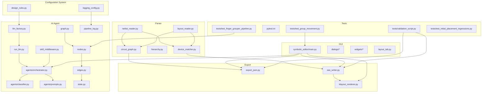

**Diagram sources**
- [config/design_rules.py:1-31](file://config/design_rules.py#L1-L31)
- [config/logging_config.py:1-65](file://config/logging_config.py#L1-L65)
- [ai_agent/ai_chat_bot/llm_factory.py:1-131](file://ai_agent/ai_chat_bot/llm_factory.py#L1-L131)
- [ai_agent/ai_chat_bot/run_llm.py:1-162](file://ai_agent/ai_chat_bot/run_llm.py#L1-L162)
- [ai_agent/ai_chat_bot/agents/orchestrator.py:1-226](file://ai_agent/ai_chat_bot/agents/orchestrator.py#L1-L226)
- [ai_agent/ai_chat_bot/agents/classifier.py:1-105](file://ai_agent/ai_chat_bot/agents/classifier.py#L1-L105)
- [ai_agent/ai_chat_bot/agents/prompts.py:1-383](file://ai_agent/ai_chat_bot/agents/prompts.py#L1-L383)
- [ai_agent/ai_chat_bot/skill_middleware.py:1-278](file://ai_agent/ai_chat_bot/skill_middleware.py#L1-L278)
- [ai_agent/ai_chat_bot/graph.py:1-34](file://ai_agent/ai_chat_bot/graph.py#L1-L34)
- [ai_agent/ai_chat_bot/nodes.py:1-800](file://ai_agent/ai_chat_bot/nodes.py#L1-L800)
- [ai_agent/ai_chat_bot/edges.py:1-34](file://ai_agent/ai_chat_bot/edges.py#L1-L34)
- [ai_agent/ai_chat_bot/state.py:1-42](file://ai_agent/ai_chat_bot/state.py#L1-L42)
- [ai_agent/ai_chat_bot/pipeline_log.py:1-157](file://ai_agent/ai_chat_bot/pipeline_log.py#L1-L157)
- [parser/netlist_reader.py:1-855](file://parser/netlist_reader.py#L1-L855)
- [parser/layout_reader.py:1-442](file://parser/layout_reader.py#L1-L442)
- [parser/circuit_graph.py:1-191](file://parser/circuit_graph.py#L1-L191)
- [parser/hierarchy.py:1-200](file://parser/hierarchy.py#L1-L200)
- [parser/device_matcher.py:1-200](file://parser/device_matcher.py#L1-L200)
- [export/export_json.py:1-58](file://export/export_json.py#L1-L58)
- [export/oas_writer.py:1-520](file://export/oas_writer.py#L1-L520)
- [export/klayout_renderer.py:1-74](file://export/klayout_renderer.py#L1-L74)
- [symbolic_editor/main.py:1-801](file://symbolic_editor/main.py#L1-L801)
- [tests/validation_script.py:1-31](file://tests/validation_script.py#L1-L31)
- [pytest.ini:1-200](file://pytest.ini#L1-L200)
- [tests/test_finger_grouper_pipeline.py:1-175](file://tests/test_finger_grouper_pipeline.py#L1-L175)
- [tests/test_group_movement.py:1-165](file://tests/test_group_movement.py#L1-L165)
- [tests/test_initial_placement_regressions.py:1-63](file://tests/test_initial_placement_regressions.py#L1-L63)

**Section sources**
- [README.md:1-200](file://README.md#L1-L200)

## Core Components
- **Configuration System**: Centralized design rules and logging configuration for consistent behavior across the system
- **LLM Factory**: Centralized provider selection and instantiation with dynamic timeout resolution and environment-based keys
- **LangGraph Pipeline**: Enhanced multi-agent orchestration with state management, human-in-the-loop capabilities, and progress tracking
- **Unified LLM Runner**: Delegating interface with retry/backoff for transient API errors
- **Skill Middleware**: Progressive disclosure of layout skills via markdown frontmatter and on-demand loading
- **Parser Pipeline**: Netlist flattening, hierarchy handling, device parsing, and layout extraction
- **Exporters**: JSON serialization, OAS/GDS writer with abutment support, and KLayout rendering
- **GUI Shell**: Qt-based main window, tabs, toolbars, and dialogs for user interaction
- **Testing Infrastructure**: Comprehensive test suites for pipeline validation and regression testing

**Section sources**
- [config/design_rules.py:1-31](file://config/design_rules.py#L1-L31)
- [config/logging_config.py:1-65](file://config/logging_config.py#L1-L65)
- [ai_agent/ai_chat_bot/llm_factory.py:1-131](file://ai_agent/ai_chat_bot/llm_factory.py#L1-L131)
- [ai_agent/ai_chat_bot/run_llm.py:1-162](file://ai_agent/ai_chat_bot/run_llm.py#L1-L162)
- [ai_agent/ai_chat_bot/graph.py:1-34](file://ai_agent/ai_chat_bot/graph.py#L1-L34)
- [ai_agent/ai_chat_bot/nodes.py:1-800](file://ai_agent/ai_chat_bot/nodes.py#L1-L800)
- [ai_agent/ai_chat_bot/agents/orchestrator.py:1-226](file://ai_agent/ai_chat_bot/agents/orchestrator.py#L1-L226)
- [ai_agent/ai_chat_bot/skill_middleware.py:1-278](file://ai_agent/ai_chat_bot/skill_middleware.py#L1-L278)
- [parser/netlist_reader.py:1-855](file://parser/netlist_reader.py#L1-L855)
- [parser/layout_reader.py:1-442](file://parser/layout_reader.py#L1-L442)
- [export/export_json.py:1-58](file://export/export_json.py#L1-L58)
- [export/oas_writer.py:1-520](file://export/oas_writer.py#L1-L520)
- [export/klayout_renderer.py:1-74](file://export/klayout_renderer.py#L1-L74)
- [symbolic_editor/main.py:1-801](file://symbolic_editor/main.py#L1-L801)

## Architecture Overview
The system follows an enhanced layered architecture with LangGraph-based pipeline orchestration:
- **Presentation Layer**: GUI shell and panels with enhanced tool integration
- **Configuration Layer**: Centralized design rules and logging configuration
- **Orchestration Layer**: LangGraph pipeline with state management and human-in-the-loop capabilities
- **Domain Layer**: Parser pipeline and matching logic with deterministic operations
- **Persistence/Output Layer**: Exporters and renderers with validation

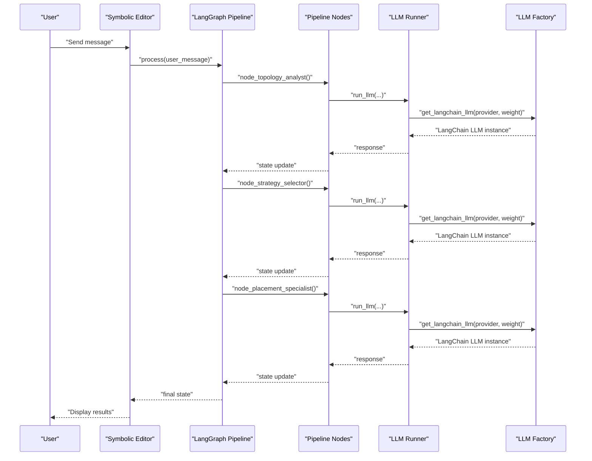

**Diagram sources**
- [ai_agent/ai_chat_bot/graph.py:1-34](file://ai_agent/ai_chat_bot/graph.py#L1-L34)
- [ai_agent/ai_chat_bot/nodes.py:1-800](file://ai_agent/ai_chat_bot/nodes.py#L1-L800)
- [ai_agent/ai_chat_bot/agents/orchestrator.py:1-226](file://ai_agent/ai_chat_bot/agents/orchestrator.py#L1-L226)
- [ai_agent/ai_chat_bot/agents/classifier.py:1-105](file://ai_agent/ai_chat_bot/agents/classifier.py#L1-L105)
- [ai_agent/ai_chat_bot/run_llm.py:1-162](file://ai_agent/ai_chat_bot/run_llm.py#L1-L162)
- [ai_agent/ai_chat_bot/llm_factory.py:1-131](file://ai_agent/ai_chat_bot/llm_factory.py#L1-L131)

## Detailed Component Analysis

### Configuration System
The new configuration system centralizes design rules and logging configuration for consistent behavior across the entire system.

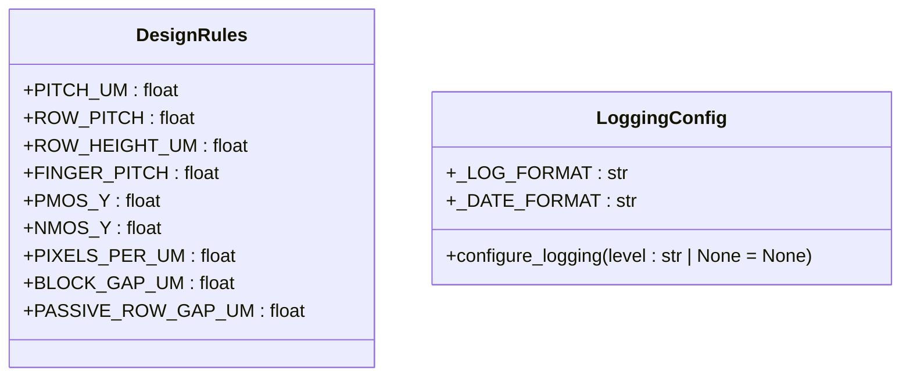

**Diagram sources**
- [config/design_rules.py:1-31](file://config/design_rules.py#L1-L31)
- [config/logging_config.py:1-65](file://config/logging_config.py#L1-L65)

**Section sources**
- [config/design_rules.py:1-31](file://config/design_rules.py#L1-L31)
- [config/logging_config.py:1-65](file://config/logging_config.py#L1-L65)

### Enhanced LLM Factory and Provider Selection
The LLM factory maintains its centralized provider selection and instantiation capabilities with enhanced error handling and environment-based configuration.

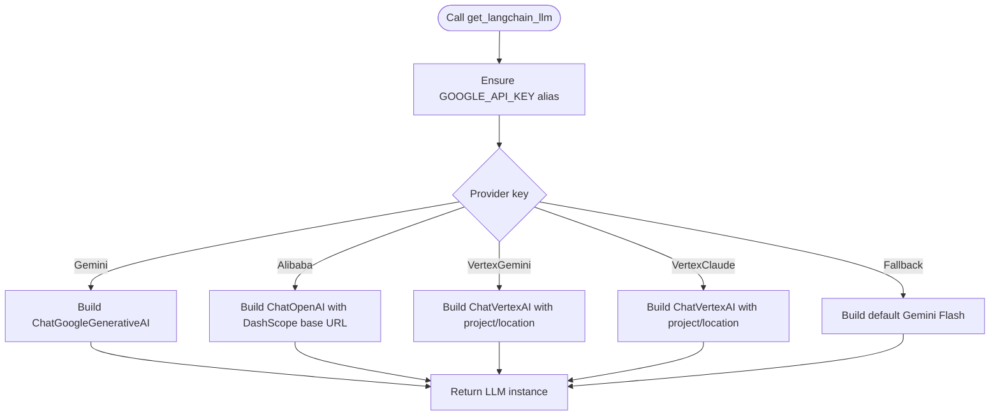

**Diagram sources**
- [ai_agent/ai_chat_bot/llm_factory.py:1-131](file://ai_agent/ai_chat_bot/llm_factory.py#L1-L131)

**Section sources**
- [ai_agent/ai_chat_bot/llm_factory.py:1-131](file://ai_agent/ai_chat_bot/llm_factory.py#L1-L131)

### LangGraph Pipeline Architecture
The new LangGraph-based pipeline provides enhanced orchestration with state management, human-in-the-loop capabilities, and progress tracking.

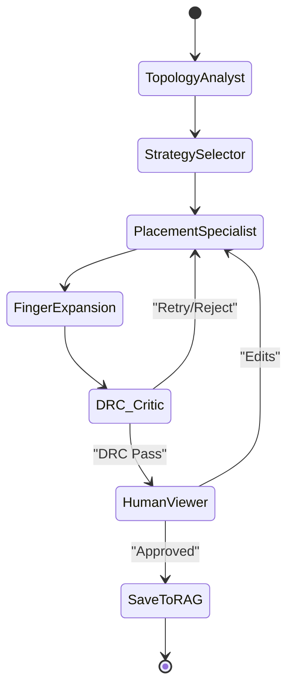

**Diagram sources**
- [ai_agent/ai_chat_bot/graph.py:1-34](file://ai_agent/ai_chat_bot/graph.py#L1-L34)
- [ai_agent/ai_chat_bot/edges.py:1-34](file://ai_agent/ai_chat_bot/edges.py#L1-L34)
- [ai_agent/ai_chat_bot/state.py:1-42](file://ai_agent/ai_chat_bot/state.py#L1-L42)

**Section sources**
- [ai_agent/ai_chat_bot/graph.py:1-34](file://ai_agent/ai_chat_bot/graph.py#L1-L34)
- [ai_agent/ai_chat_bot/edges.py:1-34](file://ai_agent/ai_chat_bot/edges.py#L1-L34)
- [ai_agent/ai_chat_bot/state.py:1-42](file://ai_agent/ai_chat_bot/state.py#L1-L42)

### Pipeline Nodes and State Management
The pipeline nodes implement specific stages with deterministic operations and state transitions.

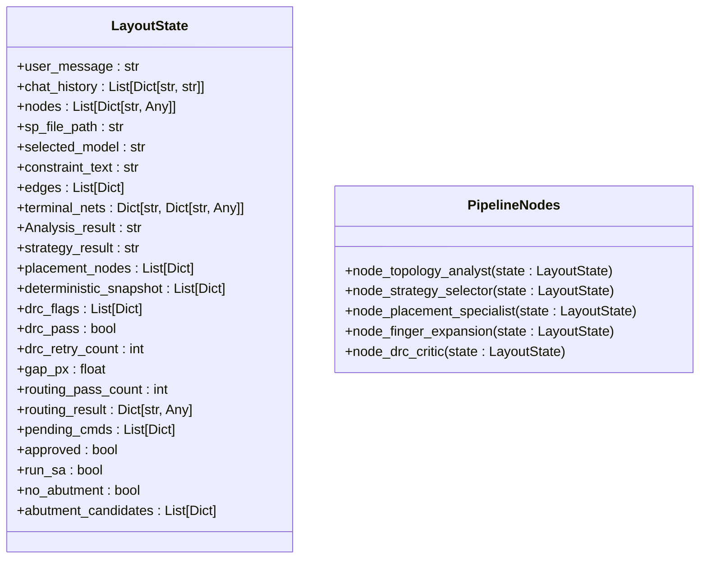

**Diagram sources**
- [ai_agent/ai_chat_bot/state.py:1-42](file://ai_agent/ai_chat_bot/state.py#L1-L42)
- [ai_agent/ai_chat_bot/nodes.py:1-800](file://ai_agent/ai_chat_bot/nodes.py#L1-L800)

**Section sources**
- [ai_agent/ai_chat_bot/state.py:1-42](file://ai_agent/ai_chat_bot/state.py#L1-L42)
- [ai_agent/ai_chat_bot/nodes.py:1-800](file://ai_agent/ai_chat_bot/nodes.py#L1-L800)

### Pipeline Logging and Progress Tracking
Enhanced logging system provides structured progress tracking and debugging capabilities.

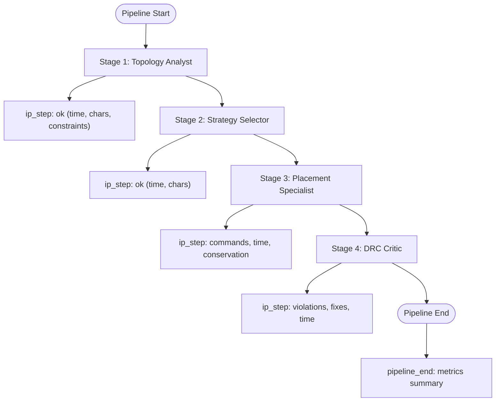

**Diagram sources**
- [ai_agent/ai_chat_bot/pipeline_log.py:1-157](file://ai_agent/ai_chat_bot/pipeline_log.py#L1-L157)

**Section sources**
- [ai_agent/ai_chat_bot/pipeline_log.py:1-157](file://ai_agent/ai_chat_bot/pipeline_log.py#L1-L157)

### Unified LLM Runner and Retry Logic
The runner maintains its core functionality with enhanced error handling and retry mechanisms.

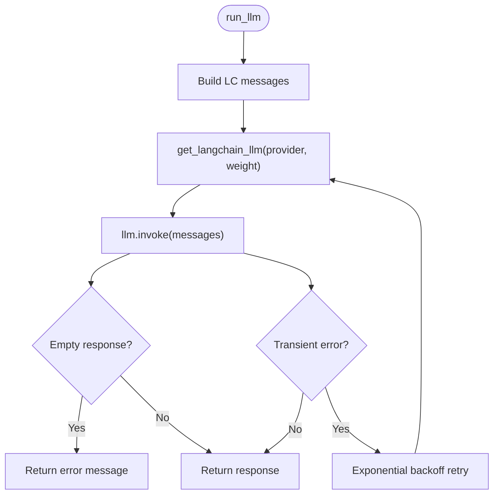

**Diagram sources**
- [ai_agent/ai_chat_bot/run_llm.py:1-162](file://ai_agent/ai_chat_bot/run_llm.py#L1-L162)
- [ai_agent/ai_chat_bot/llm_factory.py:1-131](file://ai_agent/ai_chat_bot/llm_factory.py#L1-L131)

**Section sources**
- [ai_agent/ai_chat_bot/run_llm.py:1-162](file://ai_agent/ai_chat_bot/run_llm.py#L1-L162)

### Enhanced Multi-Agent Orchestrator
The orchestrator now supports state management and human-in-the-loop interactions with improved pipeline control.

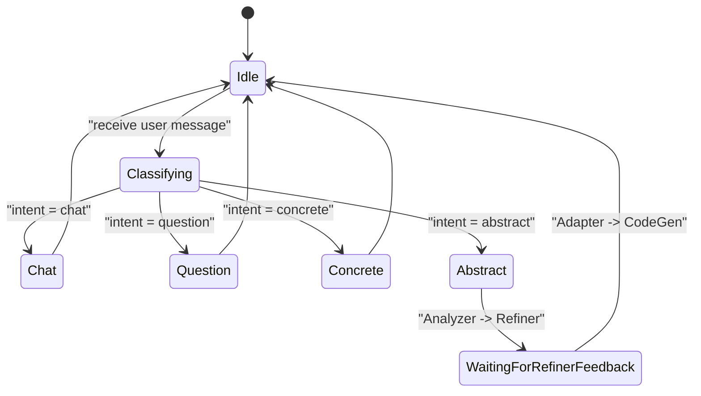

**Diagram sources**
- [ai_agent/ai_chat_bot/agents/orchestrator.py:1-226](file://ai_agent/ai_chat_bot/agents/orchestrator.py#L1-L226)

**Section sources**
- [ai_agent/ai_chat_bot/agents/orchestrator.py:1-226](file://ai_agent/ai_chat_bot/agents/orchestrator.py#L1-L226)

### Skill Middleware and Progressive Disclosure
Skills are discovered from markdown files with YAML frontmatter and can be loaded on demand to augment agent prompts.

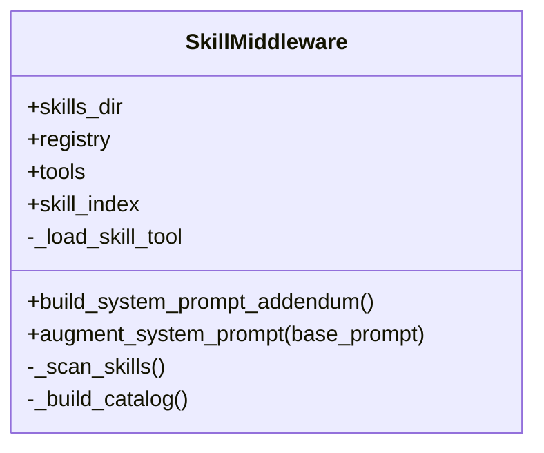

**Diagram sources**
- [ai_agent/ai_chat_bot/skill_middleware.py:1-278](file://ai_agent/ai_chat_bot/skill_middleware.py#L1-L278)

**Section sources**
- [ai_agent/ai_chat_bot/skill_middleware.py:1-278](file://ai_agent/ai_chat_bot/skill_middleware.py#L1-L278)

### Parser Pipeline: Netlist, Hierarchy, and Layout
The parser converts SPICE/CDL netlists into structured data, flattens hierarchies, and extracts layout instances for downstream AI and export steps.

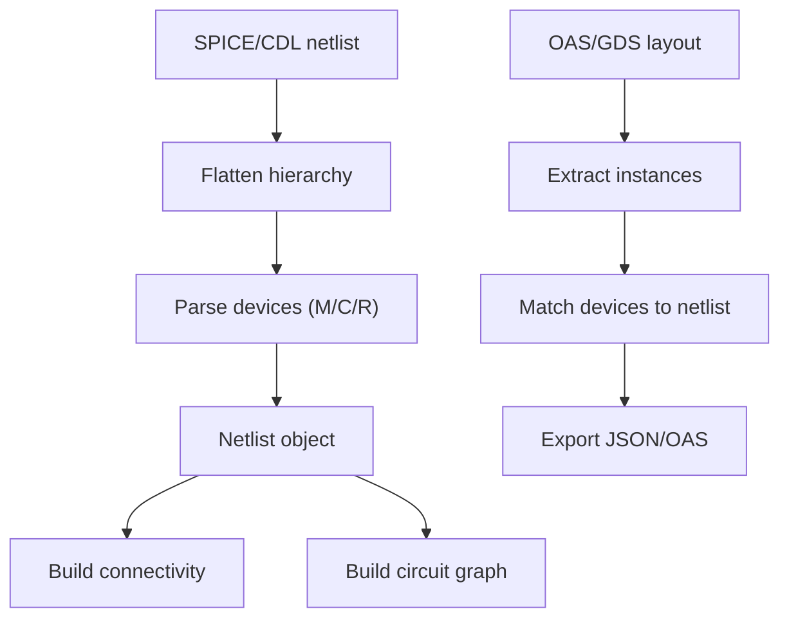

**Diagram sources**
- [parser/netlist_reader.py:1-855](file://parser/netlist_reader.py#L1-L855)
- [parser/layout_reader.py:1-442](file://parser/layout_reader.py#L1-L442)
- [parser/circuit_graph.py:1-191](file://parser/circuit_graph.py#L1-L191)

**Section sources**
- [parser/netlist_reader.py:1-855](file://parser/netlist_reader.py#L1-L855)
- [parser/layout_reader.py:1-442](file://parser/layout_reader.py#L1-L442)
- [parser/circuit_graph.py:1-191](file://parser/circuit_graph.py#L1-L191)

### Exporters: JSON, OAS/GDS, and Rendering
Exporters transform processed data into consumable formats and render previews.

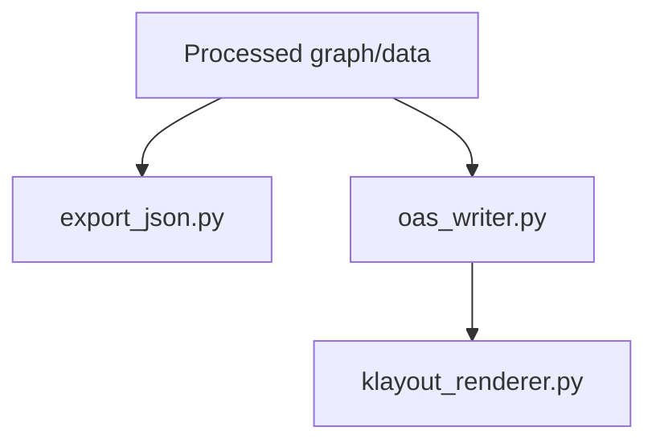

**Diagram sources**
- [export/export_json.py:1-58](file://export/export_json.py#L1-L58)
- [export/oas_writer.py:1-520](file://export/oas_writer.py#L1-L520)
- [export/klayout_renderer.py:1-74](file://export/klayout_renderer.py#L1-L74)

**Section sources**
- [export/export_json.py:1-58](file://export/export_json.py#L1-L58)
- [export/oas_writer.py:1-520](file://export/oas_writer.py#L1-L520)
- [export/klayout_renderer.py:1-74](file://export/klayout_renderer.py#L1-L74)

### GUI Shell and Tool Integration
The GUI provides menus, toolbars, and panels to orchestrate import, AI placement, export, and preview.

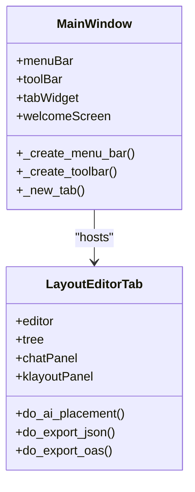

**Diagram sources**
- [symbolic_editor/main.py:1-801](file://symbolic_editor/main.py#L1-L801)

**Section sources**
- [symbolic_editor/main.py:1-801](file://symbolic_editor/main.py#L1-L801)

## Dependency Analysis
The system exhibits enhanced separation of concerns with new configuration and testing layers:
- **Configuration Layer**: design_rules.py and logging_config.py provide centralized settings
- **ai_agent** depends on configuration and parser outputs, with enhanced LangGraph pipeline
- **Parser** is independent and reusable
- **Export** depends on parser outputs and optional GUI
- **GUI** depends on ai_agent and export modules
- **Tests** provide comprehensive validation for new pipeline components

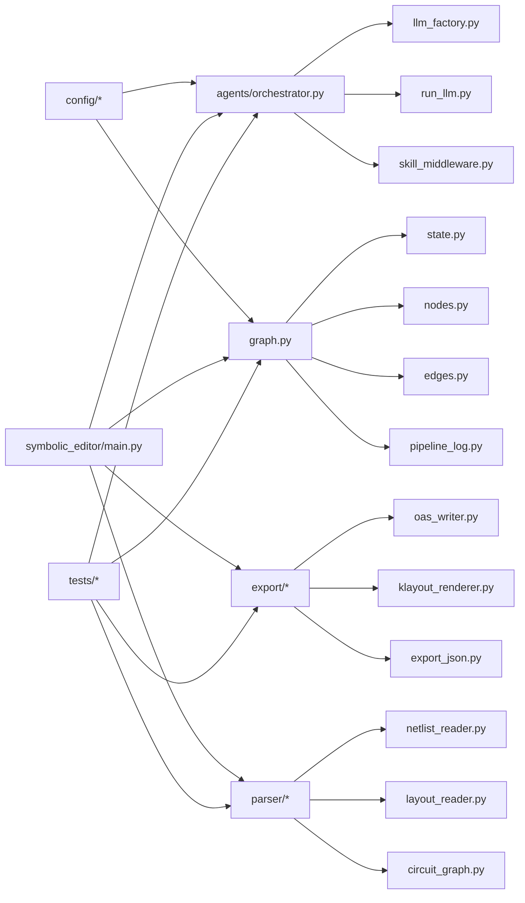

**Diagram sources**
- [config/design_rules.py:1-31](file://config/design_rules.py#L1-L31)
- [config/logging_config.py:1-65](file://config/logging_config.py#L1-L65)
- [symbolic_editor/main.py:1-801](file://symbolic_editor/main.py#L1-L801)
- [ai_agent/ai_chat_bot/agents/orchestrator.py:1-226](file://ai_agent/ai_chat_bot/agents/orchestrator.py#L1-L226)
- [ai_agent/ai_chat_bot/graph.py:1-34](file://ai_agent/ai_chat_bot/graph.py#L1-L34)
- [ai_agent/ai_chat_bot/state.py:1-42](file://ai_agent/ai_chat_bot/state.py#L1-L42)
- [ai_agent/ai_chat_bot/nodes.py:1-800](file://ai_agent/ai_chat_bot/nodes.py#L1-L800)
- [ai_agent/ai_chat_bot/edges.py:1-34](file://ai_agent/ai_chat_bot/edges.py#L1-L34)
- [ai_agent/ai_chat_bot/pipeline_log.py:1-157](file://ai_agent/ai_chat_bot/pipeline_log.py#L1-L157)
- [parser/netlist_reader.py:1-855](file://parser/netlist_reader.py#L1-L855)
- [parser/layout_reader.py:1-442](file://parser/layout_reader.py#L1-L442)
- [parser/circuit_graph.py:1-191](file://parser/circuit_graph.py#L1-L191)
- [export/oas_writer.py:1-520](file://export/oas_writer.py#L1-L520)
- [export/klayout_renderer.py:1-74](file://export/klayout_renderer.py#L1-L74)
- [export/export_json.py:1-58](file://export/export_json.py#L1-L58)

**Section sources**
- [symbolic_editor/main.py:1-801](file://symbolic_editor/main.py#L1-L801)
- [ai_agent/ai_chat_bot/agents/orchestrator.py:1-226](file://ai_agent/ai_chat_bot/agents/orchestrator.py#L1-L226)
- [ai_agent/ai_chat_bot/graph.py:1-34](file://ai_agent/ai_chat_bot/graph.py#L1-L34)
- [parser/netlist_reader.py:1-855](file://parser/netlist_reader.py#L1-L855)
- [export/oas_writer.py:1-520](file://export/oas_writer.py#L1-L520)

## Performance Considerations
- **Configuration System**: Centralized design rules eliminate redundant calculations and ensure consistency
- **LangGraph Pipeline**: Stateful processing with deterministic operations reduces memory overhead
- **Logging Configuration**: Environment-based logging levels optimize performance in production
- **LLM Factory**: Environment-based timeout tuning reduces stalls; provider-specific model selection balances latency and quality
- **Unified Runner**: Exponential backoff mitigates rate limits and transient failures
- **Parser**: Hierarchical flattening and device expansion are CPU-bound; caching and incremental updates can help
- **Exporters**: OAS writer performs geometric clipping and property patching; batching updates can reduce overhead
- **GUI**: Rendering previews should be asynchronous to avoid blocking the UI

## Troubleshooting Guide
Common issues and remedies with new configuration and testing infrastructure:
- **Configuration Issues**: Verify design rules and logging configuration are properly imported and initialized
- **Pipeline State Errors**: Check state transitions and ensure proper cleanup between pipeline runs
- **LLM API errors**: Verify provider keys and environment variables; check timeouts; leverage built-in retry logic
- **Missing skills**: Ensure markdown files are placed in the skills directory with proper frontmatter; confirm scan paths
- **Parsing failures**: Validate netlist syntax and hierarchy; confirm supported device types
- **Export mismatches**: Confirm device-to-reference mapping and abutment flags; verify coordinate grids
- **Test Failures**: Use comprehensive test suites to validate pipeline components and regression scenarios

**Section sources**
- [config/design_rules.py:1-31](file://config/design_rules.py#L1-L31)
- [config/logging_config.py:1-65](file://config/logging_config.py#L1-L65)
- [ai_agent/ai_chat_bot/run_llm.py:1-162](file://ai_agent/ai_chat_bot/run_llm.py#L1-L162)
- [ai_agent/ai_chat_bot/skill_middleware.py:1-278](file://ai_agent/ai_chat_bot/skill_middleware.py#L1-L278)
- [parser/netlist_reader.py:1-855](file://parser/netlist_reader.py#L1-L855)
- [export/oas_writer.py:1-520](file://export/oas_writer.py#L1-L520)

## Conclusion
The system's enhanced modular design enables straightforward extension with new configuration and testing infrastructure:
- **New LLM providers** via the factory with enhanced error handling
- **New agents** through the LangGraph pipeline with state management
- **New layout skills** via the middleware with progressive disclosure
- **New export formats** by implementing new exporters following established patterns
- **New parser stages** by extending the pipeline with deterministic operations
- **GUI enhancements** through dialogs and toolbars with improved tool integration
- **Comprehensive testing** through enhanced test suites and validation procedures

## Appendices

### Extension Scenarios and Patterns

#### Adding a new LLM provider
- Extend the provider switch in the factory with provider-specific initialization and environment checks
- Add timeout and key resolution logic consistent with existing providers
- Update the orchestrator and runner to accept the new provider key
- Ensure proper error handling and logging for the new provider

#### Creating a new agent for LangGraph pipeline
- Define a new node function in nodes.py with proper state management
- Integrate into the graph builder with appropriate edge connections
- Add routing logic in edges.py for conditional flow control
- Implement proper error handling and retry mechanisms

#### Extending the skill system
- Place a new markdown skill with frontmatter in the skills directory
- Optionally add supporting files referenced by the skill
- Use the load_skill tool to bring the skill into context
- Ensure proper tool registration and middleware integration

#### Adding a new export format
- Implement a new exporter module following the existing patterns
- Ensure it accepts the processed graph/data and writes to the desired format
- Wire it into the GUI and CLI as needed
- Add proper error handling and validation

#### Integrating new parser stages
- Add a new stage to the pipeline that transforms the Netlist or extracted layout data
- Maintain compatibility with downstream consumers (AI agents, exporters)
- Implement proper state transitions and error handling
- Add validation and logging for the new stage

#### Extending the GUI with new tools
- Add actions to the main window and toolbar
- Implement handlers that trigger parser, AI, or export steps
- Provide feedback via status bars and panels
- Integrate with the new LangGraph pipeline for enhanced functionality

#### Implementing new configuration options
- Add new constants to design_rules.py for PDK-specific parameters
- Configure logging levels and handlers in logging_config.py
- Ensure backward compatibility with existing configurations
- Add proper documentation and validation for new settings

#### Enhancing testing infrastructure
- Add unit tests for new components using pytest configuration
- Implement integration tests for pipeline stages
- Create regression tests for critical functionality
- Use comprehensive test suites to validate end-to-end workflows

### Testing and Validation
- **Pipeline Testing**: Use comprehensive test suites to validate LangGraph pipeline stages and state transitions
- **Regression Testing**: Leverage existing validation scripts to compare geometry changes between old and new JSON outputs
- **Unit Testing**: Add unit tests for new components using pytest configuration with enhanced test coverage
- **Integration Testing**: Validate end-to-end flows with example netlists and layouts through comprehensive test suites
- **Configuration Testing**: Test new configuration options and logging setups across different environments

**Section sources**
- [tests/validation_script.py:1-31](file://tests/validation_script.py#L1-L31)
- [pytest.ini:1-200](file://pytest.ini#L1-L200)
- [tests/test_finger_grouper_pipeline.py:1-175](file://tests/test_finger_grouper_pipeline.py#L1-L175)
- [tests/test_group_movement.py:1-165](file://tests/test_group_movement.py#L1-L165)
- [tests/test_initial_placement_regressions.py:1-63](file://tests/test_initial_placement_regressions.py#L1-L63)
- [tests/test_match.py:1-25](file://tests/test_match.py#L1-L25)
- [tests/test_match2.py:1-25](file://tests/test_match2.py#L1-L25)
- [tests/test_match3.py:1-45](file://tests/test_match3.py#L1-L45)
- [tests/test_parse_value.py:41-72](file://tests/test_parse_value.py#L41-L72)