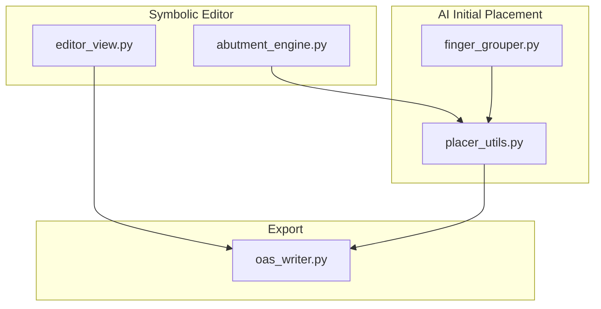
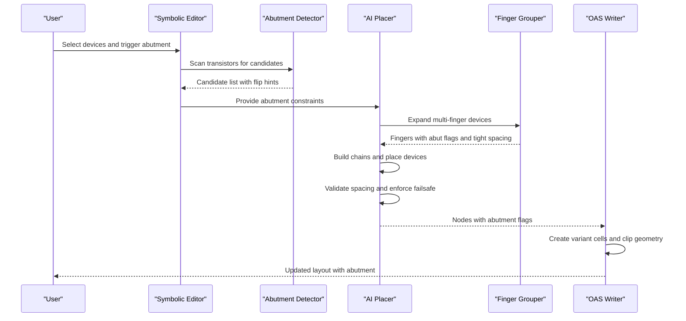
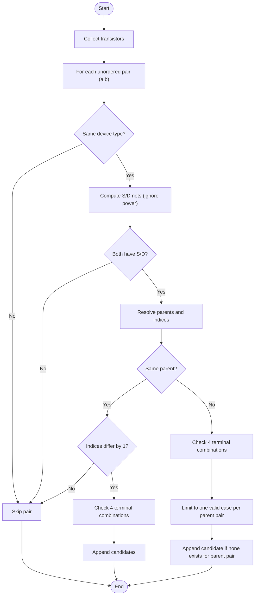
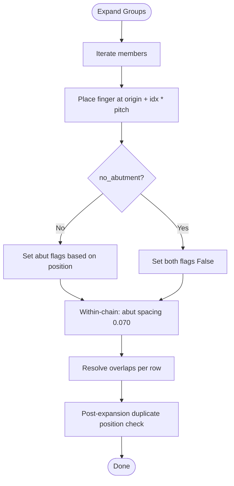
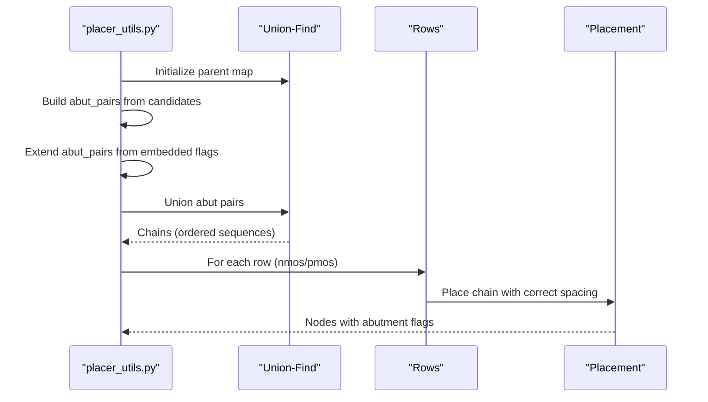
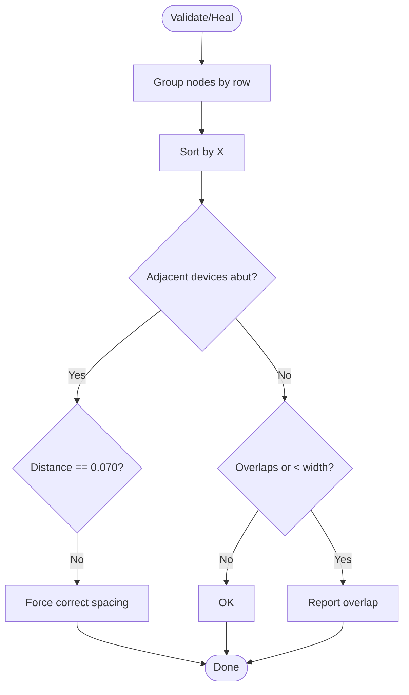
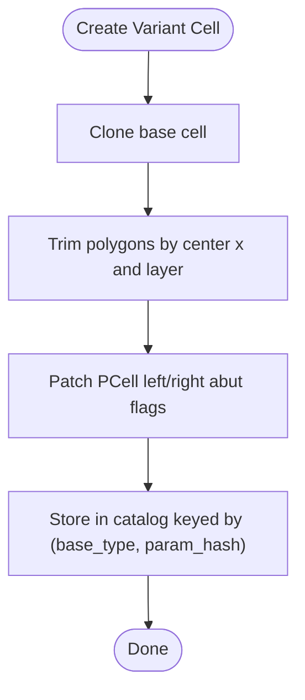
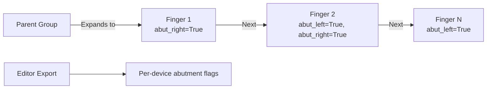
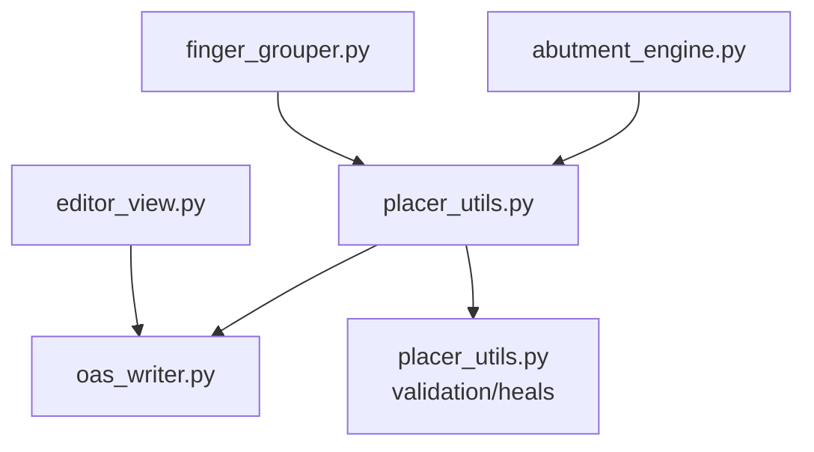

# Abutment Engine

<cite>
**Referenced Files in This Document**
- [abutment_engine.py](file://symbolic_editor/abutment_engine.py)
- [placer_utils.py](file://ai_agent/ai_initial_placement/placer_utils.py)
- [finger_grouper.py](file://ai_agent/ai_initial_placement/finger_grouper.py)
- [oas_writer.py](file://export/oas_writer.py)
- [BUGFIX_ABUTMENT_SPACING.md](file://docs/BUGFIX_ABUTMENT_SPACING.md)
- [FIX_APPLIED_ABUTMENT_SPACING.md](file://docs/FIX_APPLIED_ABUTMENT_SPACING.md)
- [HIERARCHY_SELECTION_UPDATE.md](file://docs/HIERARCHY_SELECTION_UPDATE.md)
- [editor_view.py](file://symbolic_editor/editor_view.py)
- [H.json](file://examples/current_mirror/H.json)
</cite>

## Table of Contents
1. [Introduction](#introduction)
2. [Project Structure](#project-structure)
3. [Core Components](#core-components)
4. [Architecture Overview](#architecture-overview)
5. [Detailed Component Analysis](#detailed-component-analysis)
6. [Dependency Analysis](#dependency-analysis)
7. [Performance Considerations](#performance-considerations)
8. [Troubleshooting Guide](#troubleshooting-guide)
9. [Conclusion](#conclusion)
10. [Appendices](#appendices)

## Introduction
This document describes the abutment engine responsible for device spacing and alignment in analog layouts. Abutment enables PMOS/NMOS devices to share a diffusion region along their common terminal edge, reducing layout area and parasitic capacitance. The engine comprises three pillars:
- Abutment detection: Identifies transistor pairs that can share a Source or Drain net.
- Abutment application: Enforces precise spacing and flags during placement and export.
- Geometric clipping: Physically trims device geometry to realize shared diffusion in the layout database.

The documentation explains the detection and application algorithms, technology-specific geometric clipping rules, variant cell creation and parameter hashing for catalog management, flag propagation through hierarchical designs, and validation/DRC compliance.

## Project Structure
The abutment pipeline spans the symbolic editor, AI placement, and export stages:
- Symbolic Editor: Detects abutment candidates and highlights edges for user feedback.
- AI Initial Placement: Builds abutment chains, places devices, and validates spacing.
- Export: Creates variant cells and clips geometry to encode abutment.

**Diagram sources**
- [abutment_engine.py:1-225](file://symbolic_editor/abutment_engine.py#L1-L225)
- [placer_utils.py:602-1313](file://ai_agent/ai_initial_placement/placer_utils.py#L602-L1313)
- [finger_grouper.py:1494-1690](file://ai_agent/ai_initial_placement/finger_grouper.py#L1494-L1690)
- [oas_writer.py:129-220](file://export/oas_writer.py#L129-L220)
- [editor_view.py:2062-2077](file://symbolic_editor/editor_view.py#L2062-L2077)

**Section sources**
- [abutment_engine.py:1-225](file://symbolic_editor/abutment_engine.py#L1-L225)
- [placer_utils.py:602-1313](file://ai_agent/ai_initial_placement/placer_utils.py#L602-L1313)
- [finger_grouper.py:1494-1690](file://ai_agent/ai_initial_placement/finger_grouper.py#L1494-L1690)
- [oas_writer.py:129-220](file://export/oas_writer.py#L129-L220)
- [editor_view.py:2062-2077](file://symbolic_editor/editor_view.py#L2062-L2077)

## Core Components
- Abutment Candidate Finder: Scans transistors for same-type pairs sharing a Source or Drain net, reporting whether mirroring is needed and which edges should abut.
- Multi-Finger Expansion: Generates individual fingers with abutment flags and enforces tight spacing between adjacent fingers.
- Abutment Chain Builder: Uses Union-Find to assemble abutment chains and propagate flags consistently.
- Spacing Validator and Failsafe: Validates spacing and enforces correct distances post-placement.
- Variant Cell Creation and Catalog: Clones base cells, patches PCell properties, and trims geometry to realize abutment.
- Geometric Clipping Rules: Applies layer-aware trimming thresholds to implement shared diffusion.

**Section sources**
- [abutment_engine.py:65-180](file://symbolic_editor/abutment_engine.py#L65-L180)
- [finger_grouper.py:1494-1690](file://ai_agent/ai_initial_placement/finger_grouper.py#L1494-L1690)
- [placer_utils.py:602-1313](file://ai_agent/ai_initial_placement/placer_utils.py#L602-L1313)
- [oas_writer.py:129-220](file://export/oas_writer.py#L129-L220)

## Architecture Overview
The abutment engine integrates detection, placement, and export:

**Diagram sources**
- [abutment_engine.py:65-180](file://symbolic_editor/abutment_engine.py#L65-L180)
- [placer_utils.py:602-1313](file://ai_agent/ai_initial_placement/placer_utils.py#L602-L1313)
- [finger_grouper.py:1494-1690](file://ai_agent/ai_initial_placement/finger_grouper.py#L1494-L1690)
- [oas_writer.py:129-220](file://export/oas_writer.py#L129-L220)

## Detailed Component Analysis

### Abutment Detection and Candidate Generation
The detector identifies same-type transistor pairs sharing a Source or Drain net and reports:
- Which terminals abut on each device
- Whether the right device needs to be horizontally flipped to align terminals
- The shared net name

Detection logic:
- Filters out power nets when computing Source/Drain nets.
- Handles same-parent multi-finger sequences by requiring consecutive indices.
- Handles cross-parent connections by limiting to a single valid combination per parent pair to avoid combinatorial explosion.
- Deduplicates candidates to avoid repeated pairs.

**Diagram sources**
- [abutment_engine.py:65-180](file://symbolic_editor/abutment_engine.py#L65-L180)

**Section sources**
- [abutment_engine.py:46-58](file://symbolic_editor/abutment_engine.py#L46-L58)
- [abutment_engine.py:65-180](file://symbolic_editor/abutment_engine.py#L65-L180)

### Multi-Finger Expansion and Abutment Flags
Multi-finger devices are expanded into individual fingers with abutment flags:
- First finger: abut_right flag
- Middle fingers: abut_left and abut_right flags
- Last finger: abut_left flag

The expansion also enforces tight spacing (0.070 µm) between adjacent fingers within a chain and performs overlap resolution per row.

**Diagram sources**
- [finger_grouper.py:1494-1690](file://ai_agent/ai_initial_placement/finger_grouper.py#L1494-L1690)

**Section sources**
- [finger_grouper.py:1494-1690](file://ai_agent/ai_initial_placement/finger_grouper.py#L1494-L1690)

### Abutment Chain Building and Placement
The chain builder:
- Uses Union-Find to connect abutment pairs into ordered chains.
- Always considers both explicit candidates and embedded flags to ensure multi-finger chains are merged even when explicit candidates exist.
- Places chains with correct spacing (0.070 µm for abutted pairs, 0.294 µm standard otherwise) and propagates abutment flags.

**Diagram sources**
- [placer_utils.py:602-1313](file://ai_agent/ai_initial_placement/placer_utils.py#L602-L1313)

**Section sources**
- [placer_utils.py:602-1313](file://ai_agent/ai_initial_placement/placer_utils.py#L602-L1313)

### Spacing Validation and Failsafe Enforcement
Validation checks:
- Abutted adjacent devices must be exactly 0.070 µm apart.
- Non-abutted devices must not overlap and must maintain minimal spacing.

A failsafe scans rows and forces abutment spacing when flags indicate abutment but physical positions do not match.

**Diagram sources**
- [placer_utils.py:362-388](file://ai_agent/ai_initial_placement/placer_utils.py#L362-L388)
- [placer_utils.py:888-950](file://ai_agent/ai_initial_placement/placer_utils.py#L888-L950)

**Section sources**
- [placer_utils.py:362-388](file://ai_agent/ai_initial_placement/placer_utils.py#L362-L388)
- [placer_utils.py:888-950](file://ai_agent/ai_initial_placement/placer_utils.py#L888-L950)

### Geometric Clipping Rules and Variant Cell Creation
Variant cells are created per base device and parameter hash. The clipping engine trims geometry based on layer type and center position:
- Left abutment trims polygons with center x < -0.01 on basic and aggressive layers.
- Right abutment trims polygons with center x > 0.05 on basic layers only.
- Aggressive layers (19, 81, 17) are not trimmed by right abutment.

Parameter hashing excludes abutment flags to group devices with identical non-abutment parameters.

**Diagram sources**
- [oas_writer.py:129-220](file://export/oas_writer.py#L129-L220)
- [oas_writer.py:122-126](file://export/oas_writer.py#L122-L126)

**Section sources**
- [oas_writer.py:129-220](file://export/oas_writer.py#L129-L220)
- [oas_writer.py:122-126](file://export/oas_writer.py#L122-L126)

### Abutment Flag Propagation Through Hierarchies
Hierarchical designs require consistent abutment flags across parent and child devices:
- During expansion, sibling fingers receive abutment flags to form continuous chains.
- The editor exports abutment states per device for downstream tools.
- Tests demonstrate blocking of selection until hierarchy is descended, ensuring correct device ownership and flag propagation.

**Diagram sources**
- [finger_grouper.py:1494-1690](file://ai_agent/ai_initial_placement/finger_grouper.py#L1494-L1690)
- [editor_view.py:2062-2077](file://symbolic_editor/editor_view.py#L2062-L2077)

**Section sources**
- [finger_grouper.py:1494-1690](file://ai_agent/ai_initial_placement/finger_grouper.py#L1494-L1690)
- [editor_view.py:2062-2077](file://symbolic_editor/editor_view.py#L2062-L2077)

### Examples of Abutment Effects on Density and Performance
- Layout density: Shared diffusion reduces total area and metal routing overhead.
- Parasitics: Reduced shared diffusion area lowers coupling capacitance between devices.
- Performance: Improved matching and symmetry for differential pairs when abutment is applied consistently.

[No sources needed since this section provides general guidance]

### Abutment Validation and DRC Compliance
- Validation enforces 0.070 µm spacing for abutted devices and 0.294 µm spacing for non-abutted devices.
- Failsafe correction ensures flags and geometry are reconciled post-placement.
- Export trims geometry and patches PCell flags to reflect abutment in the layout database.

**Section sources**
- [placer_utils.py:362-388](file://ai_agent/ai_initial_placement/placer_utils.py#L362-L388)
- [placer_utils.py:888-950](file://ai_agent/ai_initial_placement/placer_utils.py#L888-L950)
- [oas_writer.py:129-220](file://export/oas_writer.py#L129-L220)

## Dependency Analysis
The abutment engine components depend on each other as follows:

**Diagram sources**
- [abutment_engine.py:65-180](file://symbolic_editor/abutment_engine.py#L65-L180)
- [placer_utils.py:602-1313](file://ai_agent/ai_initial_placement/placer_utils.py#L602-L1313)
- [finger_grouper.py:1494-1690](file://ai_agent/ai_initial_placement/finger_grouper.py#L1494-L1690)
- [oas_writer.py:129-220](file://export/oas_writer.py#L129-L220)
- [editor_view.py:2062-2077](file://symbolic_editor/editor_view.py#L2062-L2077)

**Section sources**
- [abutment_engine.py:65-180](file://symbolic_editor/abutment_engine.py#L65-L180)
- [placer_utils.py:602-1313](file://ai_agent/ai_initial_placement/placer_utils.py#L602-L1313)
- [finger_grouper.py:1494-1690](file://ai_agent/ai_initial_placement/finger_grouper.py#L1494-L1690)
- [oas_writer.py:129-220](file://export/oas_writer.py#L129-L220)
- [editor_view.py:2062-2077](file://symbolic_editor/editor_view.py#L2062-L2077)

## Performance Considerations
- Candidate generation uses pairwise combinations; filtering by same-type and power nets reduces search space.
- Multi-finger cross-parent checks are limited to one valid case per parent pair to avoid combinatorial explosion.
- Union-Find with path compression efficiently builds abutment chains.
- Failsafe scanning is linear per row and only activates when flags indicate abutment.

[No sources needed since this section provides general guidance]

## Troubleshooting Guide
Common issues and resolutions:
- Multi-finger abutment spacing errors: Ensure both explicit candidates and embedded flags are considered when building chains. A failsafe scans and corrects spacing post-placement.
- Duplicate positions after expansion: The grouper validates and logs duplicate positions.
- Selection blocking in hierarchies: Use the 'D' key to descend into hierarchy groups; selection is blocked until descent.

**Section sources**
- [BUGFIX_ABUTMENT_SPACING.md:1-246](file://docs/BUGFIX_ABUTMENT_SPACING.md#L1-L246)
- [FIX_APPLIED_ABUTMENT_SPACING.md:1-155](file://docs/FIX_APPLIED_ABUTMENT_SPACING.md#L1-L155)
- [finger_grouper.py:1541-1554](file://ai_agent/ai_initial_placement/finger_grouper.py#L1541-L1554)
- [HIERARCHY_SELECTION_UPDATE.md:1-251](file://docs/HIERARCHY_SELECTION_UPDATE.md#L1-L251)

## Conclusion
The abutment engine integrates detection, placement, and export to achieve precise device spacing and shared diffusion. By combining explicit candidates with embedded flags, enforcing tight spacing for multi-fingers, and trimming geometry according to technology rules, the system ensures layout density, performance, and DRC compliance. Robust validation and failsafes guarantee correctness across hierarchical designs.

[No sources needed since this section summarizes without analyzing specific files]

## Appendices

### Technology-Specific Geometric Clipping Rules
- Left abutment trims polygons with center x < -0.01 on basic and aggressive layers.
- Right abutment trims polygons with center x > 0.05 on basic layers only.
- Aggressive layers (19, 81, 17) are not trimmed by right abutment.

**Section sources**
- [oas_writer.py:145-184](file://export/oas_writer.py#L145-L184)

### Parameter Hashing for Catalog Management
- Parameter hash excludes abutment flags to group devices with identical non-abutment parameters.
- Catalog keys are (base_type, param_hash), mapping to (leftAbut, rightAbut) variants.

**Section sources**
- [oas_writer.py:122-126](file://export/oas_writer.py#L122-L126)
- [oas_writer.py:303-318](file://export/oas_writer.py#L303-L318)

### Example: Abutment Flags in Output JSON
Example multi-finger PMOS devices with abutment flags:
- First finger: abut_right = true
- Middle fingers: abut_left = true, abut_right = true
- Last finger: abut_left = true

**Section sources**
- [H.json:826-1212](file://examples/current_mirror/H.json#L826-L1212)