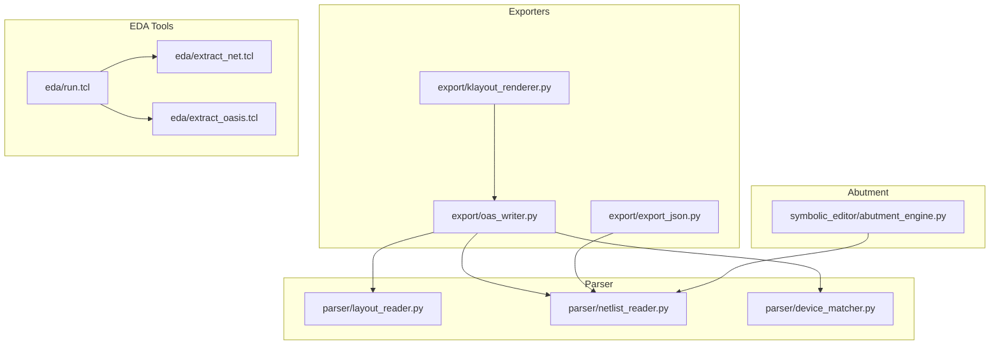
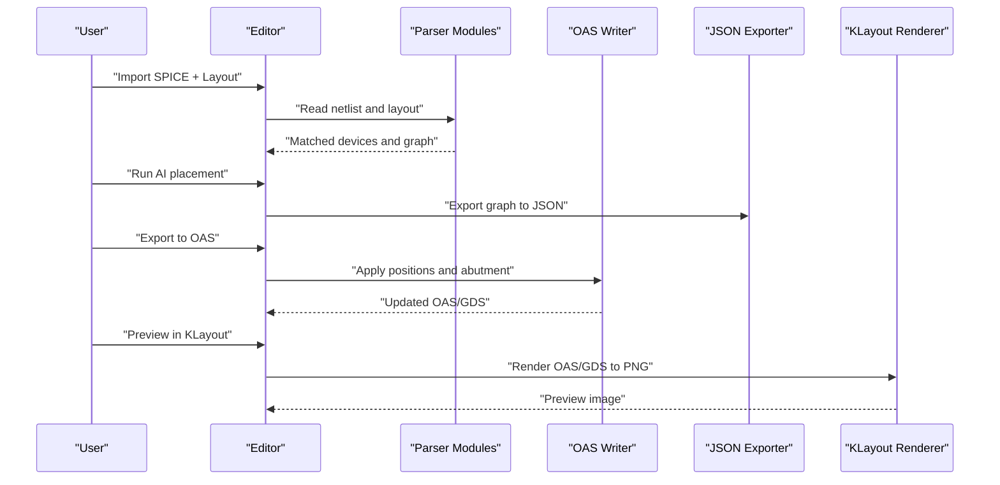
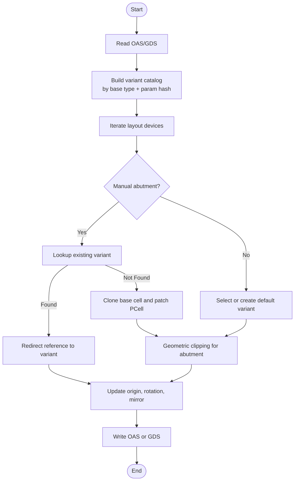
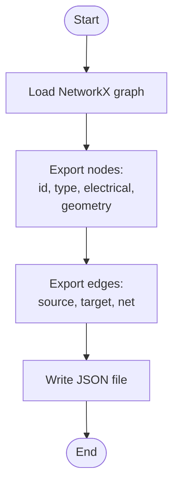
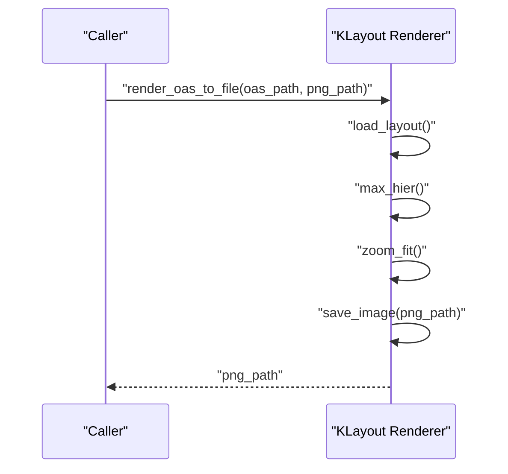
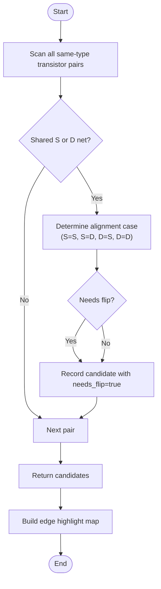
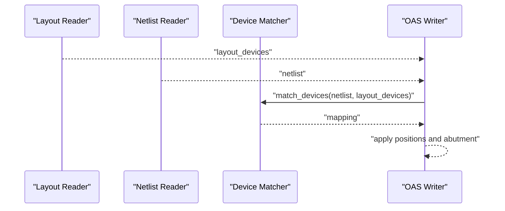
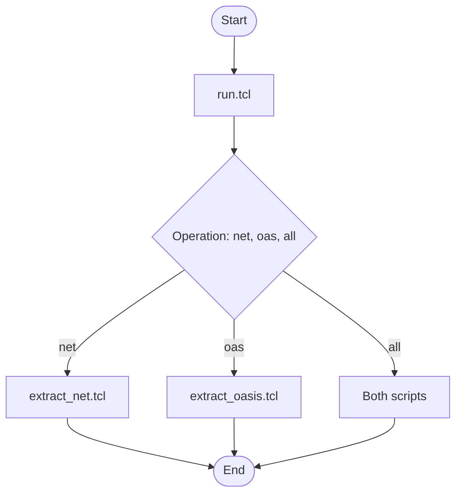
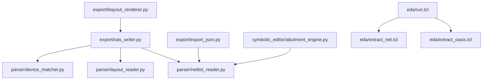

# Export and Integration System

<cite>
**Referenced Files in This Document**
- [oas_writer.py](file://export/oas_writer.py)
- [export_json.py](file://export/export_json.py)
- [klayout_renderer.py](file://export/klayout_renderer.py)
- [abutment_engine.py](file://symbolic_editor/abutment_engine.py)
- [layout_reader.py](file://parser/layout_reader.py)
- [netlist_reader.py](file://parser/netlist_reader.py)
- [device_matcher.py](file://parser/device_matcher.py)
- [extract_oasis.tcl](file://eda/extract_oasis.tcl)
- [extract_net.tcl](file://eda/extract_net.tcl)
- [run.tcl](file://eda/run.tcl)
- [README.md](file://README.md)
- [USER_GUIDE.md](file://docs/USER_GUIDE.md)
- [Layout_RTL.json](file://examples/Layout_RTL.json)
- [Layout_RTL_CM.json](file://examples/Layout_RTL_CM.json)
</cite>

## Table of Contents
1. [Introduction](#introduction)
2. [Project Structure](#project-structure)
3. [Core Components](#core-components)
4. [Architecture Overview](#architecture-overview)
5. [Detailed Component Analysis](#detailed-component-analysis)
6. [Dependency Analysis](#dependency-analysis)
7. [Performance Considerations](#performance-considerations)
8. [Troubleshooting Guide](#troubleshooting-guide)
9. [Conclusion](#conclusion)
10. [Appendices](#appendices)

## Introduction
This document describes the export and EDA tool integration system that powers device-level analog layout automation. It covers:
- OASIS file generation with abutment support and variant cell handling
- JSON export for analysis and AI integration
- KLayout integration for real-time preview and visualization
- File format compatibility and conversion processes
- Abutment application ensuring proper device spacing and alignment
- Examples of exported files and their intended use cases
- Integration with external EDA tools and workflow compatibility
- Guidance on export settings and quality considerations

## Project Structure
The export and integration system spans three primary areas:
- Exporters: OASIS writer, JSON exporter, and KLayout renderer
- Abutment engine: Candidate discovery and edge-highlight mapping
- EDA tool integration: Tcl-based extraction flows for netlist and OASIS

**Diagram sources**
- [oas_writer.py:269-520](file://export/oas_writer.py#L269-L520)
- [export_json.py:4-58](file://export/export_json.py#L4-L58)
- [klayout_renderer.py:16-74](file://export/klayout_renderer.py#L16-L74)
- [abutment_engine.py:65-225](file://symbolic_editor/abutment_engine.py#L65-L225)
- [layout_reader.py:232-442](file://parser/layout_reader.py#L232-L442)
- [netlist_reader.py:726-762](file://parser/netlist_reader.py#L726-L762)
- [device_matcher.py:85-151](file://parser/device_matcher.py#L85-L151)
- [run.tcl:14-86](file://eda/run.tcl#L14-L86)
- [extract_net.tcl:1-15](file://eda/extract_net.tcl#L1-L15)
- [extract_oasis.tcl:1-31](file://eda/extract_oasis.tcl#L1-L31)

**Section sources**
- [README.md:131-191](file://README.md#L131-L191)
- [USER_GUIDE.md:13-22](file://docs/USER_GUIDE.md#L13-L22)

## Core Components
- OASIS writer: Reads an OAS/GDS layout, applies placement from a JSON graph, creates abutment variants, and writes the updated layout.
- JSON exporter: Converts a NetworkX graph to a JSON file suitable for AI placement agents.
- KLayout renderer: Renders OAS/GDS files to PNG images or QPixmap objects for real-time preview.
- Abutment engine: Identifies transistor pairs eligible for abutment and prepares candidate data for AI constraints.
- Parser modules: Extract layout instances, read netlists, and match devices to enable accurate placement updates.
- EDA tool integration: Tcl scripts orchestrate netlist and OASIS extraction for downstream tools.

**Section sources**
- [oas_writer.py:269-520](file://export/oas_writer.py#L269-L520)
- [export_json.py:4-58](file://export/export_json.py#L4-L58)
- [klayout_renderer.py:16-74](file://export/klayout_renderer.py#L16-L74)
- [abutment_engine.py:65-225](file://symbolic_editor/abutment_engine.py#L65-L225)
- [layout_reader.py:232-442](file://parser/layout_reader.py#L232-L442)
- [netlist_reader.py:726-762](file://parser/netlist_reader.py#L726-L762)
- [device_matcher.py:85-151](file://parser/device_matcher.py#L85-L151)
- [extract_oasis.tcl:1-31](file://eda/extract_oasis.tcl#L1-L31)
- [extract_net.tcl:1-15](file://eda/extract_net.tcl#L1-L15)
- [run.tcl:14-86](file://eda/run.tcl#L14-L86)

## Architecture Overview
The export pipeline integrates parser outputs with exporters and EDA tooling. The OASIS writer consumes a placement JSON and layout file, applies device positions and abutment variants, and writes a new OAS/GDS. The JSON exporter produces AI-ready artifacts. KLayout rendering enables live previews.

**Diagram sources**
- [oas_writer.py:269-520](file://export/oas_writer.py#L269-L520)
- [export_json.py:4-58](file://export/export_json.py#L4-L58)
- [klayout_renderer.py:16-74](file://export/klayout_renderer.py#L16-L74)
- [layout_reader.py:232-442](file://parser/layout_reader.py#L232-L442)
- [netlist_reader.py:726-762](file://parser/netlist_reader.py#L726-L762)
- [device_matcher.py:85-151](file://parser/device_matcher.py#L85-L151)

## Detailed Component Analysis

### OASIS Writer: Abutment and Variant Cell Handling
The OASIS writer updates device positions and applies abutment variants. It:
- Reads the original OAS/GDS layout
- Builds a catalog of existing abutment variants keyed by base device type and parameter hash
- For each device with manual abutment annotations, either reuses an existing variant or creates a new one by cloning the base cell and patching PCell properties
- Applies geometric clipping to enforce asymmetric abutment rules for SAED 14nm
- Updates reference origins, rotations, and mirroring
- Writes the final OAS or GDS

**Diagram sources**
- [oas_writer.py:129-221](file://export/oas_writer.py#L129-L221)
- [oas_writer.py:303-417](file://export/oas_writer.py#L303-L417)
- [oas_writer.py:419-520](file://export/oas_writer.py#L419-L520)

Key implementation notes:
- PCell property parsing and encoding/decoding
- Parameter hashing excluding abutment flags
- Geometric clipping rules for basic and aggressive layers
- Orientation and mirror handling mapped to GDSTK conventions

**Section sources**
- [oas_writer.py:1-24](file://export/oas_writer.py#L1-L24)
- [oas_writer.py:48-68](file://export/oas_writer.py#L48-L68)
- [oas_writer.py:86-127](file://export/oas_writer.py#L86-L127)
- [oas_writer.py:129-221](file://export/oas_writer.py#L129-L221)
- [oas_writer.py:269-520](file://export/oas_writer.py#L269-L520)

### JSON Export: AI and Analysis Ready Format
The JSON exporter converts a NetworkX graph into a compact JSON structure for AI placement agents and analysis. It exports:
- Nodes: device ID, type, electrical parameters, and geometry
- Edges: source-target pairs with net names
- Output file is written with indentation for readability

**Diagram sources**
- [export_json.py:4-58](file://export/export_json.py#L4-L58)

**Section sources**
- [export_json.py:4-58](file://export/export_json.py#L4-L58)

### KLayout Renderer: Real-Time Preview
The KLayout renderer supports headless rendering of OAS/GDS files to PNG images or QPixmap objects. It:
- Loads the layout file
- Zooms to max hierarchy and fits the view
- Saves an image to disk or returns a QPixmap for embedding

**Diagram sources**
- [klayout_renderer.py:16-36](file://export/klayout_renderer.py#L16-L36)
- [klayout_renderer.py:39-74](file://export/klayout_renderer.py#L39-L74)

**Section sources**
- [klayout_renderer.py:16-74](file://export/klayout_renderer.py#L16-L74)

### Abutment Engine: Candidate Discovery and Highlight Mapping
The abutment engine scans transistor pairs to identify candidates for diffusion sharing:
- Filters pairs by same-type (NMOS/NMOS or PMOS/PMOS)
- Checks shared Source or Drain nets
- Determines whether horizontal flipping is needed for alignment
- Produces a candidate list and a highlight map for UI feedback

**Diagram sources**
- [abutment_engine.py:65-181](file://symbolic_editor/abutment_engine.py#L65-L181)
- [abutment_engine.py:198-225](file://symbolic_editor/abutment_engine.py#L198-L225)

**Section sources**
- [abutment_engine.py:65-225](file://symbolic_editor/abutment_engine.py#L65-L225)

### Parser Integration: Layout Instances, Netlists, and Matching
To update OASIS files accurately, the system relies on:
- Layout reader: extracts device instances from OAS/GDS, handling flat and hierarchical structures
- Netlist reader: flattens hierarchical SPICE/CDL netlists and parses device parameters
- Device matcher: maps netlist devices to layout instances, accounting for multi-finger expansions

**Diagram sources**
- [layout_reader.py:232-442](file://parser/layout_reader.py#L232-L442)
- [netlist_reader.py:726-762](file://parser/netlist_reader.py#L726-L762)
- [device_matcher.py:85-151](file://parser/device_matcher.py#L85-L151)
- [oas_writer.py:319-417](file://export/oas_writer.py#L319-L417)

**Section sources**
- [layout_reader.py:232-442](file://parser/layout_reader.py#L232-L442)
- [netlist_reader.py:726-762](file://parser/netlist_reader.py#L726-L762)
- [device_matcher.py:85-151](file://parser/device_matcher.py#L85-L151)

### EDA Tool Integration: Extraction Flows
The EDA tool integration provides Tcl scripts to automate extraction:
- run.tcl: Orchestrates extraction operations for netlist and OASIS
- extract_net.tcl: Runs the netlister and writes the SPICE file
- extract_oasis.tcl: Exports OASIS layout with configured dialog settings

**Diagram sources**
- [run.tcl:14-86](file://eda/run.tcl#L14-L86)
- [extract_net.tcl:1-15](file://eda/extract_net.tcl#L1-L15)
- [extract_oasis.tcl:1-31](file://eda/extract_oasis.tcl#L1-L31)

**Section sources**
- [run.tcl:14-86](file://eda/run.tcl#L14-L86)
- [extract_net.tcl:1-15](file://eda/extract_net.tcl#L1-L15)
- [extract_oasis.tcl:1-31](file://eda/extract_oasis.tcl#L1-L31)

## Dependency Analysis
The export system exhibits clear separation of concerns:
- Exporters depend on parser outputs for device matching and layout metadata
- Abutment engine depends on netlist topology to propose candidates
- EDA tool integration is independent and external to the core Python modules

**Diagram sources**
- [oas_writer.py:40-46](file://export/oas_writer.py#L40-L46)
- [layout_reader.py:232-442](file://parser/layout_reader.py#L232-L442)
- [netlist_reader.py:726-762](file://parser/netlist_reader.py#L726-L762)
- [device_matcher.py:85-151](file://parser/device_matcher.py#L85-L151)
- [export_json.py:4-58](file://export/export_json.py#L4-L58)
- [klayout_renderer.py:16-74](file://export/klayout_renderer.py#L16-L74)
- [abutment_engine.py:65-225](file://symbolic_editor/abutment_engine.py#L65-L225)
- [run.tcl:14-86](file://eda/run.tcl#L14-L86)
- [extract_net.tcl:1-15](file://eda/extract_net.tcl#L1-L15)
- [extract_oasis.tcl:1-31](file://eda/extract_oasis.tcl#L1-L31)

**Section sources**
- [oas_writer.py:40-46](file://export/oas_writer.py#L40-L46)
- [layout_reader.py:232-442](file://parser/layout_reader.py#L232-L442)
- [netlist_reader.py:726-762](file://parser/netlist_reader.py#L726-L762)
- [device_matcher.py:85-151](file://parser/device_matcher.py#L85-L151)
- [export_json.py:4-58](file://export/export_json.py#L4-L58)
- [klayout_renderer.py:16-74](file://export/klayout_renderer.py#L16-L74)
- [abutment_engine.py:65-225](file://symbolic_editor/abutment_engine.py#L65-L225)
- [run.tcl:14-86](file://eda/run.tcl#L14-L86)
- [extract_net.tcl:1-15](file://eda/extract_net.tcl#L1-L15)
- [extract_oasis.tcl:1-31](file://eda/extract_oasis.tcl#L1-L31)

## Performance Considerations
- OASIS writer: Variant catalogization avoids repeated cloning; geometric clipping is bounded by polygon counts; writing a fresh library reduces reference overhead.
- JSON exporter: Single-pass serialization with indentation; suitable for AI prompts and analysis.
- KLayout renderer: Headless rendering minimizes UI overhead; temporary files are cleaned up after use.
- Abutment engine: Pairwise combination is O(N^2); cross-parent deduplication prevents combinatorial explosion.

[No sources needed since this section provides general guidance]

## Troubleshooting Guide
Common issues and resolutions:
- OASIS writer errors
  - Missing OAS/GDS or SPICE files: ensure paths exist before invoking the writer.
  - No top-level cells: verify the layout file contains a valid top cell.
  - Device count mismatch: confirm netlist and layout have matching device counts for deterministic matching.
- JSON export
  - Ensure the graph contains nodes and edges before exporting.
- KLayout renderer
  - Missing layout file raises an error; verify the path and permissions.
  - Temporary file cleanup failures are handled gracefully.
- Abutment engine
  - Candidates require shared nets and same-type devices; verify netlist connectivity.
- EDA tool integration
  - Tcl scripts require correct library and cell names; ensure directories exist and dialogs are configured.

**Section sources**
- [oas_writer.py:272-285](file://export/oas_writer.py#L272-L285)
- [export_json.py:4-58](file://export/export_json.py#L4-L58)
- [klayout_renderer.py:28-36](file://export/klayout_renderer.py#L28-L36)
- [klayout_renderer.py:65-74](file://export/klayout_renderer.py#L65-L74)
- [abutment_engine.py:65-181](file://symbolic_editor/abutment_engine.py#L65-L181)
- [run.tcl:14-86](file://eda/run.tcl#L14-L86)
- [extract_net.tcl:1-15](file://eda/extract_net.tcl#L1-L15)
- [extract_oasis.tcl:1-31](file://eda/extract_oasis.tcl#L1-L31)

## Conclusion
The export and integration system provides a robust pipeline for analog layout automation:
- Accurate OASIS updates with abutment variants tailored to SAED 14nm rules
- AI-ready JSON exports for placement and analysis
- Real-time KLayout preview for validation
- Seamless EDA tool integration via Tcl flows
- Clear abutment application ensuring proper device spacing and alignment

[No sources needed since this section summarizes without analyzing specific files]

## Appendices

### File Format Compatibility and Conversion
- Input formats
  - SPICE netlist (.sp): parsed by the netlist reader
  - Layout file (.oas/.gds): parsed by the layout reader
- Output formats
  - OASIS (.oas) and GDS (.gds): generated by the OASIS writer
  - JSON: placement exports for AI and analysis
  - PNG: rendered previews via KLayout renderer

**Section sources**
- [layout_reader.py:363-369](file://parser/layout_reader.py#L363-L369)
- [oas_writer.py:420-423](file://export/oas_writer.py#L420-L423)
- [klayout_renderer.py:16-36](file://export/klayout_renderer.py#L16-L36)

### Examples of Exported Files and Use Cases
- Layout_RTL.json
  - Purpose: Device-level placement with geometry and orientation
  - Use cases: AI placement, topology analysis, and layout inspection
- Layout_RTL_CM.json
  - Purpose: Compact device-level placement for AI prompts
  - Use cases: Reduced-size JSON for LLM interactions

**Section sources**
- [Layout_RTL.json:1-152](file://examples/Layout_RTL.json#L1-L152)
- [Layout_RTL_CM.json:1-123](file://examples/Layout_RTL_CM.json#L1-L123)

### Integration with External EDA Tools and Workflow Compatibility
- Netlist extraction: run.tcl orchestrates extract_net.tcl to produce SPICE netlists
- OASIS extraction: run.tcl orchestrates extract_oasis.tcl to export OASIS layouts
- Workflow compatibility: scripts accept library and cell arguments and manage dialog configurations

**Section sources**
- [run.tcl:14-86](file://eda/run.tcl#L14-L86)
- [extract_net.tcl:1-15](file://eda/extract_net.tcl#L1-L15)
- [extract_oasis.tcl:1-31](file://eda/extract_oasis.tcl#L1-L31)

### Export Settings and Quality Considerations
- OASIS writer
  - Output format selection: defaults to .gds if output ends with .gds, otherwise .oas
  - Abutment flags: leftAbut/rightAbut encoded in PCell properties
  - Geometric clipping: enforced per layer categories for SAED 14nm
- JSON exporter
  - Indented output for readability
  - Minimal fields for AI efficiency
- KLayout renderer
  - Configurable image dimensions
  - Temporary file cleanup to prevent clutter

**Section sources**
- [oas_writer.py:420-423](file://export/oas_writer.py#L420-L423)
- [oas_writer.py:145-171](file://export/oas_writer.py#L145-L171)
- [export_json.py:55-57](file://export/export_json.py#L55-L57)
- [klayout_renderer.py:16-36](file://export/klayout_renderer.py#L16-L36)
- [klayout_renderer.py:65-74](file://export/klayout_renderer.py#L65-L74)