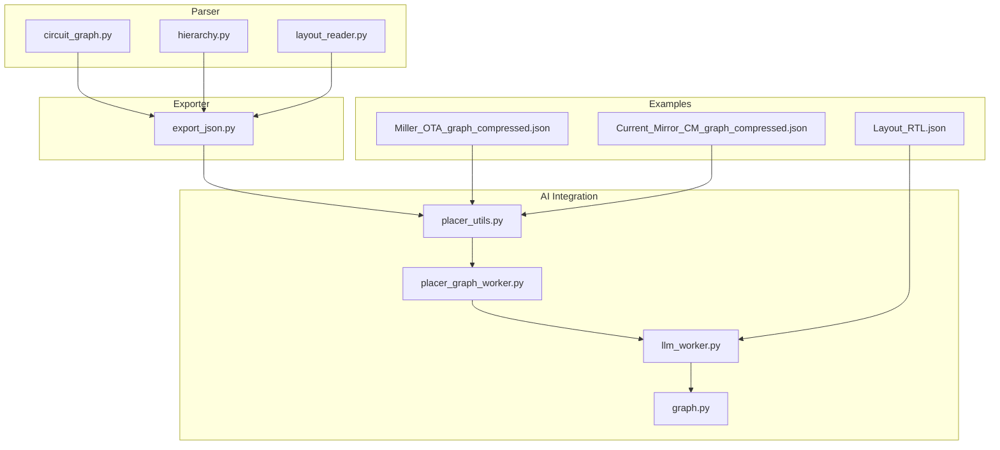
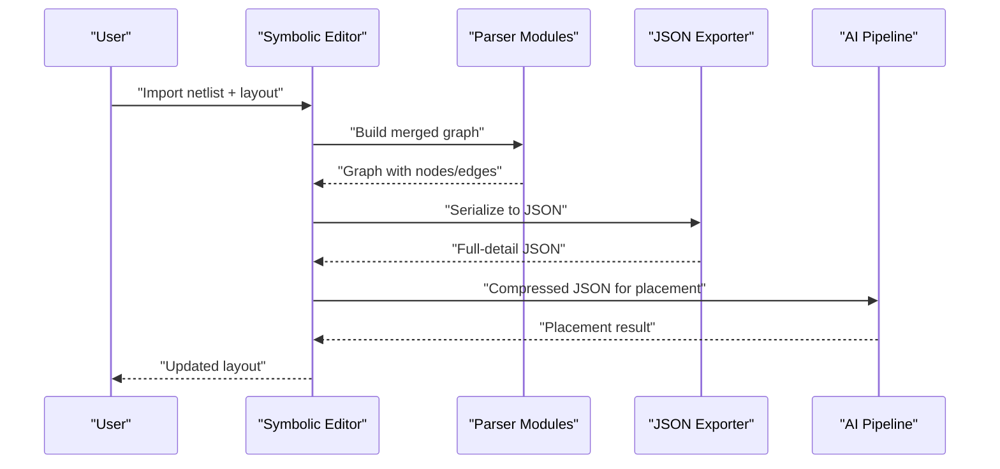
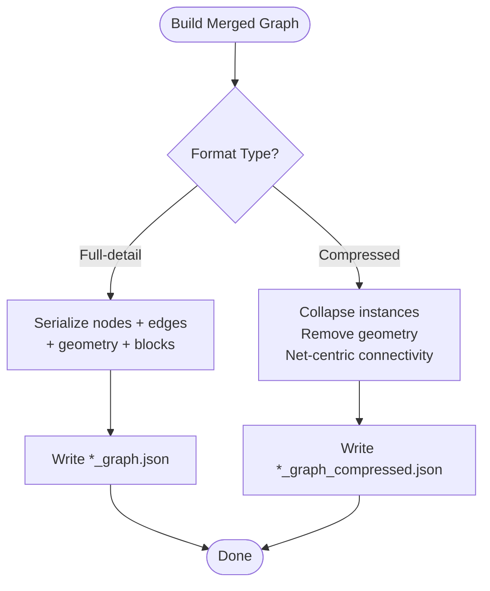
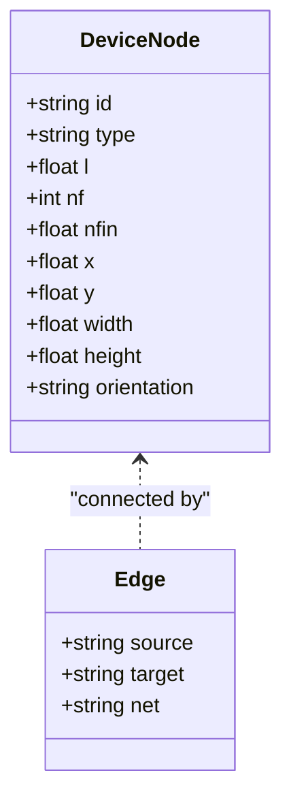
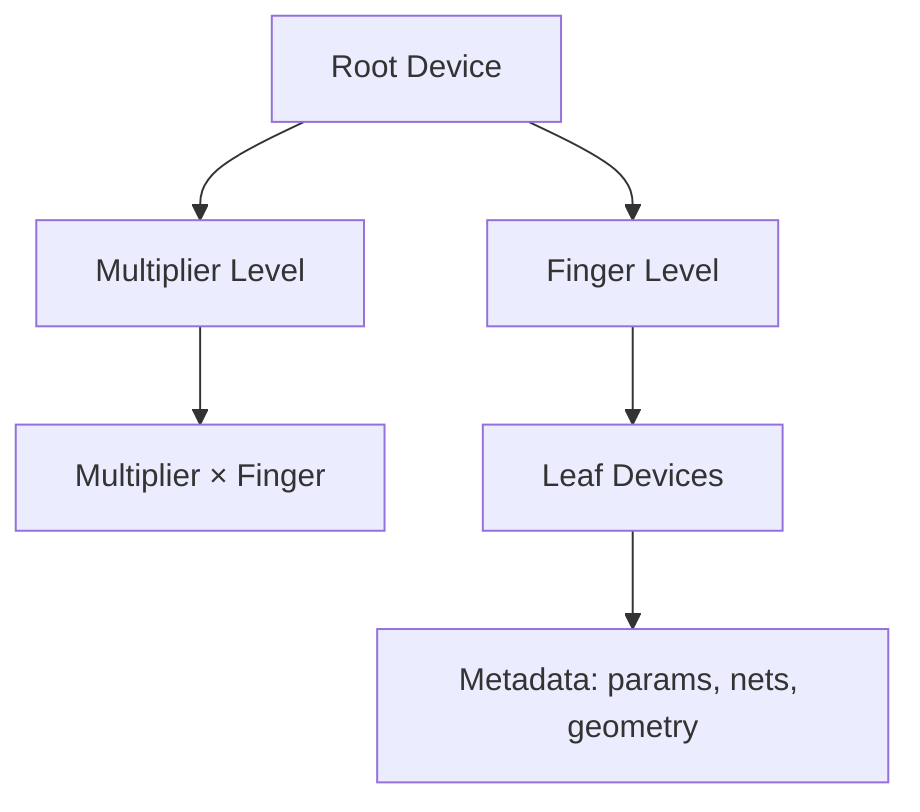
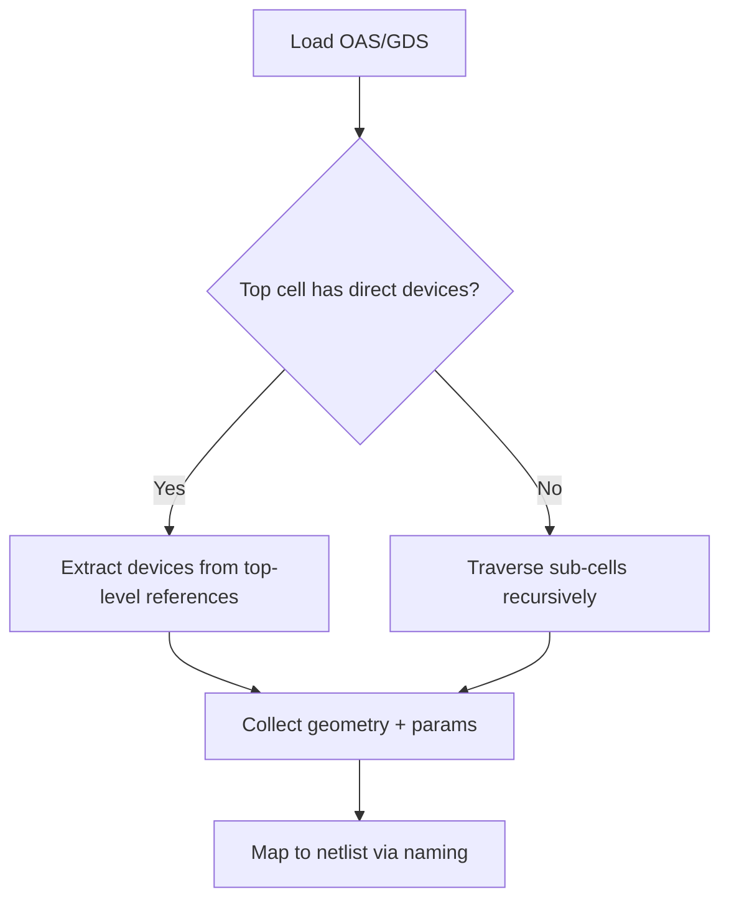
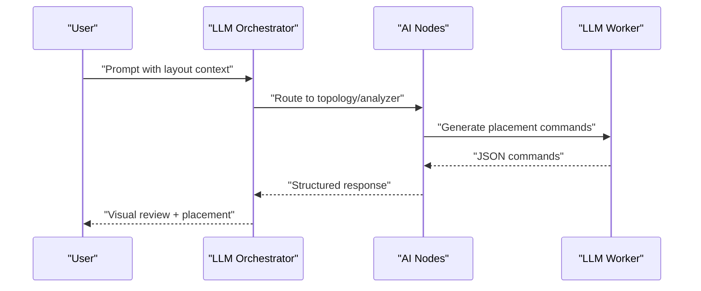

# JSON Export System

<cite>
**Referenced Files in This Document**
- [export_json.py](file://export/export_json.py)
- [circuit_graph.py](file://parser/circuit_graph.py)
- [hierarchy.py](file://parser/hierarchy.py)
- [layout_reader.py](file://parser/layout_reader.py)
- [placer_utils.py](file://ai_agent/ai_initial_placement/placer_utils.py)
- [placer_graph_worker.py](file://ai_agent/ai_initial_placement/placer_graph_worker.py)
- [llm_worker.py](file://ai_agent/ai_chat_bot/llm_worker.py)
- [graph.py](file://ai_agent/ai_chat_bot/graph.py)
- [Miller_OTA_graph_compressed.json](file://examples/Miller_OTA/Miller_OTA_graph_compressed.json)
- [Current_Mirror_CM_graph_compressed.json](file://examples/current_mirror/Current_Mirror_CM_graph_compressed.json)
- [Layout_RTL.json](file://examples/Layout_RTL.json)
- [JSON_OPTIMIZATION_README.md](file://docs/JSON_OPTIMIZATION_README.md)
- [JSON_OPTIMIZATION_SUMMARY.md](file://docs/JSON_OPTIMIZATION_SUMMARY.md)
- [layout_tab.py](file://symbolic_editor/layout_tab.py)
</cite>

## Table of Contents
1. [Introduction](#introduction)
2. [Project Structure](#project-structure)
3. [Core Components](#core-components)
4. [Architecture Overview](#architecture-overview)
5. [Detailed Component Analysis](#detailed-component-analysis)
6. [Dependency Analysis](#dependency-analysis)
7. [Performance Considerations](#performance-considerations)
8. [Troubleshooting Guide](#troubleshooting-guide)
9. [Conclusion](#conclusion)
10. [Appendices](#appendices)

## Introduction
This document explains the JSON export system used for layout analysis and AI integration. It covers:
- The dual JSON format generation (full-detail and compressed)
- Circuit graph serialization and device property preservation
- Hierarchical structure preservation and metadata inclusion
- Example JSON outputs and typical downstream use cases
- The relationship between JSON exports and the AI chat bot pipeline for design analysis

## Project Structure
The JSON export system spans parsing, graph construction, compression, and AI integration:
- Parser modules convert SPICE netlists and layout geometry into structured graphs
- Export utilities serialize graphs to JSON
- AI modules consume compressed JSON for initial placement and analysis
- Example designs demonstrate both full-detail and compressed formats

**Diagram sources**
- [circuit_graph.py:131-191](file://parser/circuit_graph.py#L131-L191)
- [hierarchy.py:142-191](file://parser/hierarchy.py#L142-L191)
- [layout_reader.py:357-442](file://parser/layout_reader.py#L357-L442)
- [export_json.py:4-58](file://export/export_json.py#L4-L58)
- [placer_utils.py:469-501](file://ai_agent/ai_initial_placement/placer_utils.py#L469-L501)
- [placer_graph_worker.py:44-76](file://ai_agent/ai_initial_placement/placer_graph_worker.py#L44-L76)
- [llm_worker.py:253-302](file://ai_agent/ai_chat_bot/llm_worker.py#L253-L302)
- [graph.py:1-52](file://ai_agent/ai_chat_bot/graph.py#L1-L52)
- [Miller_OTA_graph_compressed.json:1-186](file://examples/Miller_OTA/Miller_OTA_graph_compressed.json#L1-L186)
- [Current_Mirror_CM_graph_compressed.json:1-126](file://examples/current_mirror/Current_Mirror_CM_graph_compressed.json#L1-L126)
- [Layout_RTL.json:1-152](file://examples/Layout_RTL.json#L1-L152)

**Section sources**
- [circuit_graph.py:1-191](file://parser/circuit_graph.py#L1-L191)
- [hierarchy.py:1-475](file://parser/hierarchy.py#L1-L475)
- [layout_reader.py:1-442](file://parser/layout_reader.py#L1-L442)
- [export_json.py:1-58](file://export/export_json.py#L1-L58)
- [placer_utils.py:469-501](file://ai_agent/ai_initial_placement/placer_utils.py#L469-L501)
- [placer_graph_worker.py:44-76](file://ai_agent/ai_initial_placement/placer_graph_worker.py#L44-L76)
- [llm_worker.py:253-302](file://ai_agent/ai_chat_bot/llm_worker.py#L253-L302)
- [graph.py:1-52](file://ai_agent/ai_chat_bot/graph.py#L1-L52)
- [Miller_OTA_graph_compressed.json:1-186](file://examples/Miller_OTA/Miller_OTA_graph_compressed.json#L1-L186)
- [Current_Mirror_CM_graph_compressed.json:1-126](file://examples/current_mirror/Current_Mirror_CM_graph_compressed.json#L1-L126)
- [Layout_RTL.json:1-152](file://examples/Layout_RTL.json#L1-L152)

## Core Components
- Graph builder: constructs electrical graphs from netlists and merges with layout geometry
- Hierarchical model: captures device arrays, multipliers, and fingers
- Layout reader: extracts device instances and geometry from layout files
- JSON exporter: serializes graphs to both full-detail and compressed formats
- AI compression: reduces JSON size for LLM prompts while preserving semantics
- Chat bot pipeline: orchestrates analysis and placement using exported JSON

**Section sources**
- [circuit_graph.py:131-191](file://parser/circuit_graph.py#L131-L191)
- [hierarchy.py:142-191](file://parser/hierarchy.py#L142-L191)
- [layout_reader.py:357-442](file://parser/layout_reader.py#L357-L442)
- [export_json.py:4-58](file://export/export_json.py#L4-L58)
- [placer_utils.py:469-501](file://ai_agent/ai_initial_placement/placer_utils.py#L469-L501)
- [graph.py:1-52](file://ai_agent/ai_chat_bot/graph.py#L1-L52)

## Architecture Overview
The system builds a merged graph from SPICE and layout data, exports it to JSON, and feeds compressed JSON to the AI pipeline for placement and analysis.

**Diagram sources**
- [circuit_graph.py:142-191](file://parser/circuit_graph.py#L142-L191)
- [layout_reader.py:357-442](file://parser/layout_reader.py#L357-L442)
- [export_json.py:4-58](file://export/export_json.py#L4-L58)
- [placer_utils.py:469-501](file://ai_agent/ai_initial_placement/placer_utils.py#L469-L501)
- [llm_worker.py:253-302](file://ai_agent/ai_chat_bot/llm_worker.py#L253-L302)

## Detailed Component Analysis

### Graph Serialization and Dual Format Generation
- Full-detail JSON: includes nodes with electrical and geometry attributes, edges with net labels, and optional blocks/matching constraints
- Compressed JSON: collapses finger/multiplier instances into parent devices, removes geometry, and uses net-centric connectivity

**Diagram sources**
- [export_json.py:4-58](file://export/export_json.py#L4-L58)
- [placer_utils.py:469-501](file://ai_agent/ai_initial_placement/placer_utils.py#L469-L501)

**Section sources**
- [export_json.py:4-58](file://export/export_json.py#L4-L58)
- [placer_utils.py:469-501](file://ai_agent/ai_initial_placement/placer_utils.py#L469-L501)
- [JSON_OPTIMIZATION_README.md:110-173](file://docs/JSON_OPTIMIZATION_README.md#L110-L173)
- [JSON_OPTIMIZATION_SUMMARY.md:208-312](file://docs/JSON_OPTIMIZATION_SUMMARY.md#L208-L312)

### Circuit Graph Construction and Device Property Preservation
- Electrical nodes capture device type, length, finger count, and multi-finger scaling
- Edges encode net names and behavioral relations inferred from pin roles
- Merged graph augments nodes with layout geometry (x, y, width, height, orientation)

**Diagram sources**
- [circuit_graph.py:142-191](file://parser/circuit_graph.py#L142-L191)
- [export_json.py:18-50](file://export/export_json.py#L18-L50)

**Section sources**
- [circuit_graph.py:131-191](file://parser/circuit_graph.py#L131-L191)
- [export_json.py:18-50](file://export/export_json.py#L18-L50)

### Hierarchical Structure Preservation and Metadata Inclusion
- Hierarchical model supports arrays, multipliers, and fingers with explicit naming conventions
- Metadata includes device-level parameters, terminal nets, and block definitions
- Example compressed outputs demonstrate device types, rows, default dimensions, and DRC rules

**Diagram sources**
- [hierarchy.py:183-310](file://parser/hierarchy.py#L183-L310)
- [Miller_OTA_graph_compressed.json:25-186](file://examples/Miller_OTA/Miller_OTA_graph_compressed.json#L25-L186)
- [Current_Mirror_CM_graph_compressed.json:25-126](file://examples/current_mirror/Current_Mirror_CM_graph_compressed.json#L25-L126)

**Section sources**
- [hierarchy.py:183-310](file://parser/hierarchy.py#L183-L310)
- [Miller_OTA_graph_compressed.json:1-186](file://examples/Miller_OTA/Miller_OTA_graph_compressed.json#L1-L186)
- [Current_Mirror_CM_graph_compressed.json:1-126](file://examples/current_mirror/Current_Mirror_CM_graph_compressed.json#L1-L126)

### Layout Geometry Extraction and Device Matching
- Layout reader identifies transistors, resistors, capacitors, and passive devices
- Extracts absolute positions, bounding boxes, orientation, and PCell parameters
- Supports both flat and hierarchical layouts with recursive traversal

**Diagram sources**
- [layout_reader.py:357-442](file://parser/layout_reader.py#L357-L442)

**Section sources**
- [layout_reader.py:1-442](file://parser/layout_reader.py#L1-L442)

### AI Chat Bot Integration and Prompt Compression
- The AI pipeline consumes compressed JSON to reduce token usage and improve performance
- Initial state is built from exported JSON, including nodes, edges, terminal nets, and placement hints
- The chat bot orchestrator routes intents to specialized nodes and compiles a LangGraph workflow

**Diagram sources**
- [placer_graph_worker.py:44-76](file://ai_agent/ai_initial_placement/placer_graph_worker.py#L44-L76)
- [llm_worker.py:253-302](file://ai_agent/ai_chat_bot/llm_worker.py#L253-L302)
- [graph.py:1-52](file://ai_agent/ai_chat_bot/graph.py#L1-L52)

**Section sources**
- [placer_utils.py:469-501](file://ai_agent/ai_initial_placement/placer_utils.py#L469-L501)
- [placer_graph_worker.py:44-76](file://ai_agent/ai_initial_placement/placer_graph_worker.py#L44-L76)
- [llm_worker.py:253-302](file://ai_agent/ai_chat_bot/llm_worker.py#L253-L302)
- [graph.py:1-52](file://ai_agent/ai_chat_bot/graph.py#L1-L52)

## Dependency Analysis
The JSON export system integrates parser, exporter, and AI modules. The primary dependencies are:
- Parser modules depend on NetworkX and internal data structures
- Exporter depends on parser outputs
- AI modules depend on exporter outputs and compression utilities

**Diagram sources**
- [circuit_graph.py:131-191](file://parser/circuit_graph.py#L131-L191)
- [export_json.py:4-58](file://export/export_json.py#L4-L58)
- [placer_utils.py:469-501](file://ai_agent/ai_initial_placement/placer_utils.py#L469-L501)
- [graph.py:1-52](file://ai_agent/ai_chat_bot/graph.py#L1-L52)

**Section sources**
- [circuit_graph.py:131-191](file://parser/circuit_graph.py#L131-L191)
- [export_json.py:4-58](file://export/export_json.py#L4-L58)
- [placer_utils.py:469-501](file://ai_agent/ai_initial_placement/placer_utils.py#L469-L501)
- [graph.py:1-52](file://ai_agent/ai_chat_bot/graph.py#L1-L52)

## Performance Considerations
- Compressed JSON reduces token counts by 85–97%, enabling larger designs to fit LLM prompts
- Net-centric connectivity and collapsed instances minimize redundant data
- Automatic migration scripts preserve backward compatibility

**Section sources**
- [JSON_OPTIMIZATION_README.md:110-173](file://docs/JSON_OPTIMIZATION_README.md#L110-L173)
- [JSON_OPTIMIZATION_SUMMARY.md:110-156](file://docs/JSON_OPTIMIZATION_SUMMARY.md#L110-L156)

## Troubleshooting Guide
Common issues and resolutions:
- Missing layout or netlist files: ensure both .oas/.gds and .sp are present before export
- Incompatible JSON structure: use compression utilities to normalize AI-ready JSON
- Token limit exceeded: rely on automatic compression for AI prompts
- Export failures: verify hierarchy state restoration and device abutment settings

**Section sources**
- [layout_tab.py:1621-1664](file://symbolic_editor/layout_tab.py#L1621-L1664)
- [placer_utils.py:132-167](file://ai_agent/ai_initial_placement/placer_utils.py#L132-L167)

## Conclusion
The JSON export system provides a robust foundation for layout analysis and AI-driven placement. By generating both full-detail and compressed JSON, it balances human readability and AI efficiency. Hierarchical modeling and metadata preservation ensure accurate device representation, while the AI pipeline leverages compressed JSON to scale to large designs.

## Appendices

### Example JSON Files and Use Cases
- Compressed device-centric JSON for AI placement and topology analysis
- Full-detail JSON for GUI visualization and debugging
- RTL-style JSON for higher-level abstraction and decision caching

Typical downstream use cases:
- Initial placement suggestions and iterative refinement
- DRC checking and routing preview
- Human-in-the-loop review and approval
- Decision caching for repeatable design iterations

**Section sources**
- [Miller_OTA_graph_compressed.json:1-186](file://examples/Miller_OTA/Miller_OTA_graph_compressed.json#L1-L186)
- [Current_Mirror_CM_graph_compressed.json:1-126](file://examples/current_mirror/Current_Mirror_CM_graph_compressed.json#L1-L126)
- [Layout_RTL.json:1-152](file://examples/Layout_RTL.json#L1-L152)