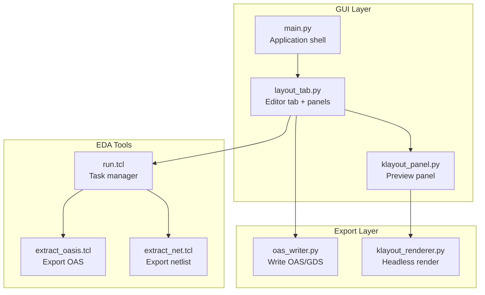
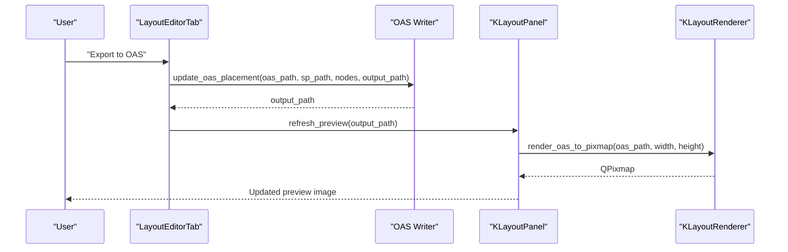
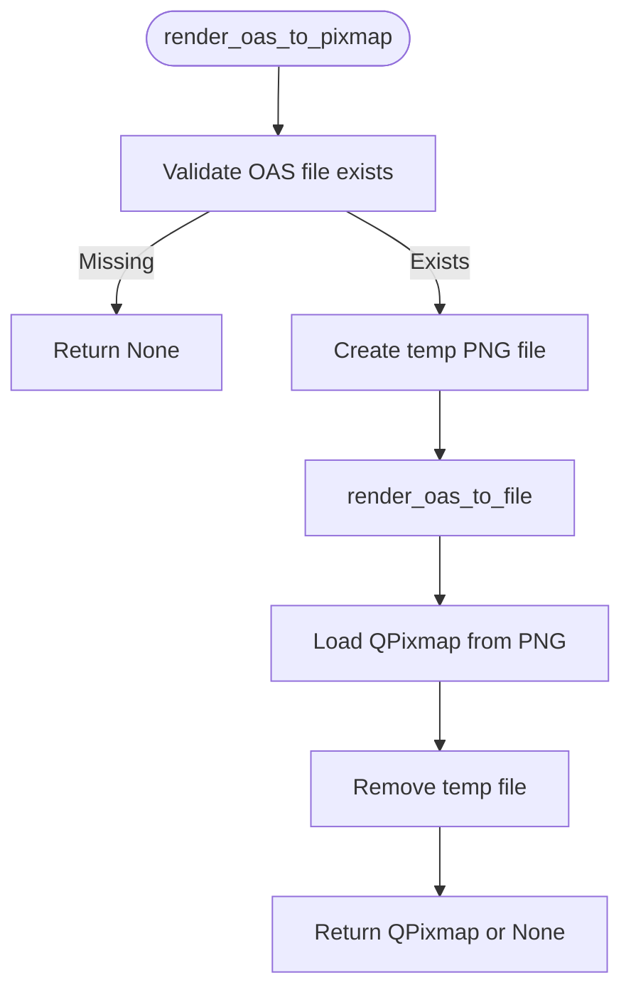
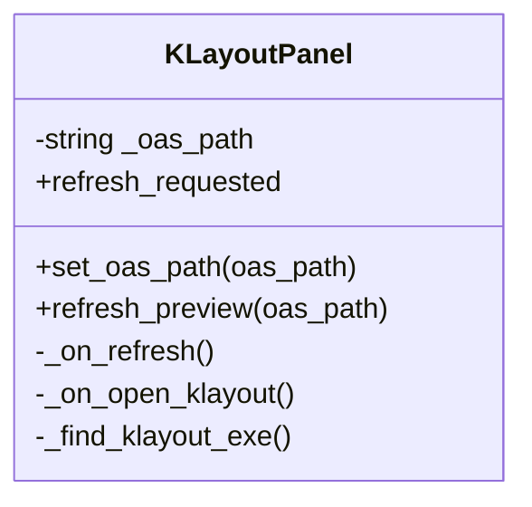
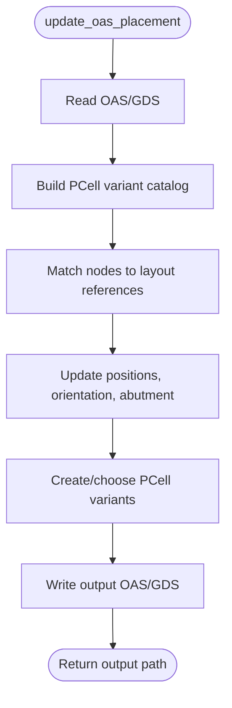
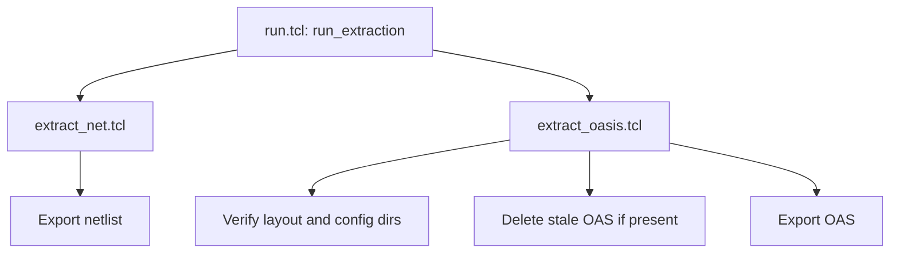
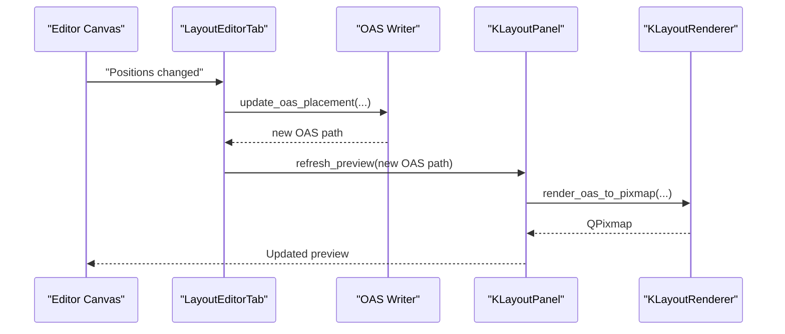
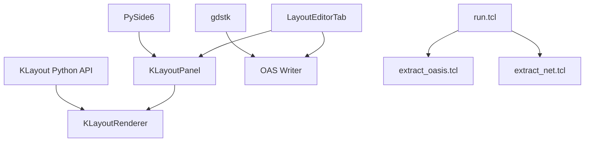

# KLayout Integration

<cite>
**Referenced Files in This Document**
- [klayout_renderer.py](file://export/klayout_renderer.py)
- [klayout_panel.py](file://symbolic_editor/klayout_panel.py)
- [layout_tab.py](file://symbolic_editor/layout_tab.py)
- [main.py](file://symbolic_editor/main.py)
- [oas_writer.py](file://export/oas_writer.py)
- [extract_oasis.tcl](file://eda/extract_oasis.tcl)
- [extract_net.tcl](file://eda/extract_net.tcl)
- [run.tcl](file://eda/run.tcl)
- [README.md](file://README.md)
</cite>

## Table of Contents
1. [Introduction](#introduction)
2. [Project Structure](#project-structure)
3. [Core Components](#core-components)
4. [Architecture Overview](#architecture-overview)
5. [Detailed Component Analysis](#detailed-component-analysis)
6. [Dependency Analysis](#dependency-analysis)
7. [Performance Considerations](#performance-considerations)
8. [Troubleshooting Guide](#troubleshooting-guide)
9. [Conclusion](#conclusion)
10. [Appendices](#appendices)

## Introduction
This document explains the KLayout integration system that enables real-time layout preview and visualization within the Symbolic Layout Editor. It covers:
- How the application integrates with KLayout’s Python API to render OAS/GDS previews
- The custom KLayout preview panel implementation in the GUI
- The TCL-based extraction pipeline for automated layout and netlist generation
- The real-time rendering pipeline and update mechanisms
- File format compatibility and workflow from layout modification to visual feedback
- Configuration options for different KLayout environments and installation requirements
- Troubleshooting common integration issues and performance optimization tips

## Project Structure
The KLayout integration spans several modules:
- export/klayout_renderer.py: Headless rendering of OAS/GDS to images using KLayout’s Python API
- symbolic_editor/klayout_panel.py: A Qt widget that hosts the preview, refresh controls, and “Open in KLayout” launcher
- symbolic_editor/layout_tab.py: Orchestrates preview updates, export to OAS, and integration with the editor canvas
- export/oas_writer.py: Writes updated placement data back to OAS/GDS with abutment-aware PCell variants
- eda/*.tcl: TCL scripts for automated extraction of OAS and netlist files
- symbolic_editor/main.py: Application entry point and menu/toolbars that trigger KLayout actions
- README.md: High-level overview and quick start

**Diagram sources**
- [main.py:1-120](file://symbolic_editor/main.py#L1-L120)
- [layout_tab.py:100-170](file://symbolic_editor/layout_tab.py#L100-L170)
- [klayout_panel.py:30-120](file://symbolic_editor/klayout_panel.py#L30-L120)
- [klayout_renderer.py:16-74](file://export/klayout_renderer.py#L16-L74)
- [oas_writer.py:269-520](file://export/oas_writer.py#L269-L520)
- [run.tcl:14-86](file://eda/run.tcl#L14-L86)
- [extract_oasis.tcl:1-31](file://eda/extract_oasis.tcl#L1-L31)
- [extract_net.tcl:1-15](file://eda/extract_net.tcl#L1-L15)

**Section sources**
- [README.md:131-191](file://README.md#L131-L191)

## Core Components
- KLayoutRenderer: Provides headless rendering of OAS/GDS files to PNG images or QPixmap objects for preview display.
- KLayoutPanel: A Qt widget that renders the preview, exposes refresh and open-in-KLayout actions, and maintains the current OAS path.
- OAS Writer: Applies updated device positions and abutment flags to an OAS/GDS file, generating a new OAS/GDS suitable for preview.
- EDA TCL Scripts: Automate extraction of OAS and netlist files from a design, enabling the editor to source layout data.
- Layout Editor Tab: Integrates the preview panel, triggers exports, and manages the real-time update loop between the symbolic canvas and the preview.

**Section sources**
- [klayout_renderer.py:16-74](file://export/klayout_renderer.py#L16-L74)
- [klayout_panel.py:30-273](file://symbolic_editor/klayout_panel.py#L30-L273)
- [oas_writer.py:269-520](file://export/oas_writer.py#L269-L520)
- [layout_tab.py:1621-1664](file://symbolic_editor/layout_tab.py#L1621-L1664)
- [extract_oasis.tcl:1-31](file://eda/extract_oasis.tcl#L1-L31)
- [extract_net.tcl:1-15](file://eda/extract_net.tcl#L1-L15)

## Architecture Overview
The integration architecture connects the GUI, export pipeline, and EDA tools to deliver a real-time preview loop:
- The editor canvas updates device positions and abutment states.
- On export, the OAS writer writes a new OAS/GDS with updated placements and abutment variants.
- The preview panel refreshes the rendered image from the updated OAS file.
- Alternatively, the TCL pipeline can generate OAS and netlist files for import into the editor.

**Diagram sources**
- [layout_tab.py:1648-1659](file://symbolic_editor/layout_tab.py#L1648-L1659)
- [klayout_panel.py:171-222](file://symbolic_editor/klayout_panel.py#L171-L222)
- [klayout_renderer.py:39-74](file://export/klayout_renderer.py#L39-L74)

## Detailed Component Analysis

### KLayoutRenderer: Headless Rendering
- Purpose: Convert OAS/GDS files to images for preview.
- Key capabilities:
  - Render to PNG file
  - Render to QPixmap via an internal temporary PNG
  - Robust error handling and cleanup of temporary files
- Parameters: Input OAS path, output PNG path, and desired image width/height.
- Dependencies: KLayout Python API (klayout.db, klayout.lay) and PySide6 for QPixmap.

**Diagram sources**
- [klayout_renderer.py:39-74](file://export/klayout_renderer.py#L39-L74)

**Section sources**
- [klayout_renderer.py:16-74](file://export/klayout_renderer.py#L16-L74)

### KLayoutPanel: Preview Panel Widget
- Purpose: Host the KLayout preview inside the editor UI.
- Features:
  - Header with title, refresh button, and “Open in KLayout”
  - Scrollable image area with placeholder text
  - Status bar showing file and image dimensions
  - Signals for refresh events
- Behavior:
  - Refresh reads the current OAS path and renders a QPixmap at the current viewport size
  - “Open in KLayout” attempts to locate the KLayout executable and launches it with the OAS file

**Diagram sources**
- [klayout_panel.py:30-273](file://symbolic_editor/klayout_panel.py#L30-L273)

**Section sources**
- [klayout_panel.py:30-273](file://symbolic_editor/klayout_panel.py#L30-L273)

### OAS Writer: Placement and Abutment Updates
- Purpose: Update device positions and abutment flags in an OAS/GDS file and write a new OAS/GDS.
- Key steps:
  - Read original OAS/GDS using gdstk
  - Build a catalog of existing PCell variants keyed by base device type and parameter hash
  - For each device, compute new origin, rotation, and abutment flags
  - Create new PCell variants when needed (trimming geometry to enforce abutment)
  - Write output OAS/GDS with updated references and properties
- Output format selection based on extension (.oas or .gds)

**Diagram sources**
- [oas_writer.py:269-520](file://export/oas_writer.py#L269-L520)

**Section sources**
- [oas_writer.py:269-520](file://export/oas_writer.py#L269-L520)

### EDA TCL Scripts: Automated Extraction
- run.tcl: Central task manager that validates operations and dispatches to extraction scripts.
- extract_oasis.tcl: Generates OAS files for a given library/cell, ensuring directories exist and deleting stale files.
- extract_net.tcl: Generates netlist files for a given library/cell.
- These scripts enable automated layout and netlist generation for import into the editor.

**Diagram sources**
- [run.tcl:14-86](file://eda/run.tcl#L14-L86)
- [extract_oasis.tcl:12-31](file://eda/extract_oasis.tcl#L12-L31)
- [extract_net.tcl:1-15](file://eda/extract_net.tcl#L1-L15)

**Section sources**
- [run.tcl:14-86](file://eda/run.tcl#L14-L86)
- [extract_oasis.tcl:1-31](file://eda/extract_oasis.tcl#L1-L31)
- [extract_net.tcl:1-15](file://eda/extract_net.tcl#L1-L15)

### Real-Time Preview Workflow
- The editor canvas drives device positions and abutment states.
- Export to OAS triggers the OAS writer to produce a new OAS/GDS.
- The preview panel refreshes the image from the updated OAS file.
- Users can also open the OAS directly in KLayout via the panel’s “Open in KLayout” action.

**Diagram sources**
- [layout_tab.py:1648-1659](file://symbolic_editor/layout_tab.py#L1648-L1659)
- [klayout_panel.py:171-222](file://symbolic_editor/klayout_panel.py#L171-L222)
- [klayout_renderer.py:39-74](file://export/klayout_renderer.py#L39-L74)

**Section sources**
- [layout_tab.py:1621-1664](file://symbolic_editor/layout_tab.py#L1621-L1664)
- [klayout_panel.py:171-222](file://symbolic_editor/klayout_panel.py#L171-L222)

## Dependency Analysis
- GUI depends on Qt (PySide6) for the preview panel and editor canvas.
- KLayoutRenderer depends on KLayout Python bindings and PySide6 for QPixmap.
- OAS Writer depends on gdstk for reading/writing OAS/GDS and for geometric clipping.
- LayoutEditorTab orchestrates the preview refresh and export, connecting the editor, writer, and panel.
- EDA TCL scripts depend on KLayout’s TCL API for automation.

**Diagram sources**
- [klayout_renderer.py:12-13](file://export/klayout_renderer.py#L12-L13)
- [oas_writer.py:38-45](file://export/oas_writer.py#L38-L45)
- [klayout_panel.py:10-20](file://symbolic_editor/klayout_panel.py#L10-L20)
- [layout_tab.py:106-107](file://symbolic_editor/layout_tab.py#L106-L107)
- [run.tcl:14-86](file://eda/run.tcl#L14-L86)

**Section sources**
- [klayout_renderer.py:12-13](file://export/klayout_renderer.py#L12-L13)
- [oas_writer.py:38-45](file://export/oas_writer.py#L38-L45)
- [klayout_panel.py:10-20](file://symbolic_editor/klayout_panel.py#L10-L20)
- [layout_tab.py:106-107](file://symbolic_editor/layout_tab.py#L106-L107)
- [run.tcl:14-86](file://eda/run.tcl#L14-L86)

## Performance Considerations
- Rendering resolution: The preview resolution scales with the panel’s viewport size. Larger viewports increase render time and memory usage.
- Temporary file handling: The renderer creates a temporary PNG during QPixmap conversion; ensure sufficient disk space and fast I/O for large layouts.
- Large layout optimization:
  - Prefer exporting only when necessary (after significant changes).
  - Use zoom-fit and appropriate viewport sizing to balance quality and speed.
  - For very large designs, consider reducing the preview resolution or disabling automatic refresh during heavy editing sessions.
- Abutment computation: Creating new PCell variants involves geometric clipping; this can be expensive for complex layouts. Batch updates and minimize repeated exports.

[No sources needed since this section provides general guidance]

## Troubleshooting Guide
Common integration issues and resolutions:
- KLayout executable not found:
  - The preview panel attempts to locate the KLayout executable via PATH and common Windows install locations. If not found, it falls back to the platform’s default handler. Ensure KLayout is installed and accessible in PATH or adjust the executable path.
- Render failures:
  - Verify the OAS file exists and is readable. The renderer raises exceptions on missing files and logs errors; check the status label and error messages in the preview panel.
- Preview not updating:
  - Trigger a refresh from the panel or export again to regenerate the OAS file. Confirm the OAS writer completed successfully and the panel received the new path.
- TCL extraction errors:
  - Ensure the required directories exist and the library/cell names are correct. The TCL scripts validate inputs and report errors if directories are missing or invalid.

**Section sources**
- [klayout_panel.py:228-273](file://symbolic_editor/klayout_panel.py#L228-L273)
- [klayout_renderer.py:28-36](file://export/klayout_renderer.py#L28-L36)
- [extract_oasis.tcl:12-31](file://eda/extract_oasis.tcl#L12-L31)

## Conclusion
The KLayout integration provides a seamless bridge between the Symbolic Layout Editor and KLayout, enabling real-time preview and visualization. The system combines a Qt-based preview panel, a headless renderer, an OAS writer for placement updates, and automated TCL extraction scripts. By understanding the rendering pipeline, update mechanisms, and configuration options, users can efficiently iterate on analog layouts and receive immediate visual feedback.

[No sources needed since this section summarizes without analyzing specific files]

## Appendices

### Configuration Options and Installation Requirements
- KLayout Python API:
  - Ensure KLayout is installed and the Python bindings are available. The renderer imports KLayout modules and uses them for headless rendering.
- PySide6:
  - Required for the preview panel and QPixmap handling.
- gdstk:
  - Required for reading/writing OAS/GDS and for geometric operations in the OAS writer.
- TCL-based extraction:
  - The TCL scripts require KLayout’s TCL environment to be available. Ensure the KLayout installation includes the TCL API.

**Section sources**
- [klayout_renderer.py:12-13](file://export/klayout_renderer.py#L12-L13)
- [oas_writer.py:38-45](file://export/oas_writer.py#L38-L45)
- [README.md:111-129](file://README.md#L111-L129)

### File Format Compatibility
- Input formats:
  - OASIS (.oas) and GDS (.gds) for layout data
  - SPICE (.sp) for netlist data
- Output formats:
  - OASIS (.oas) and GDS (.gds) for exported layouts
- The OAS writer supports both formats and writes based on the requested output extension.

**Section sources**
- [oas_writer.py:420-423](file://export/oas_writer.py#L420-L423)
- [layout_tab.py:1639-1642](file://symbolic_editor/layout_tab.py#L1639-L1642)