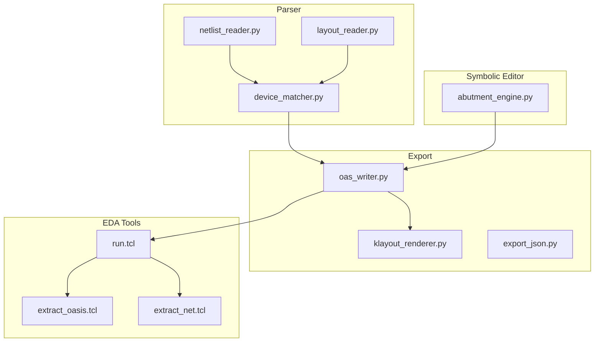
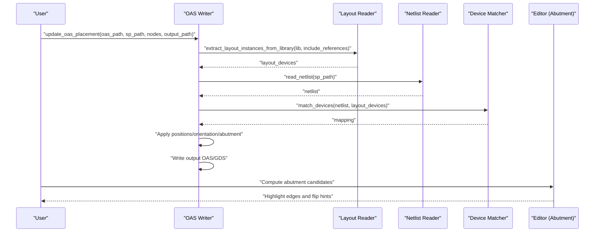
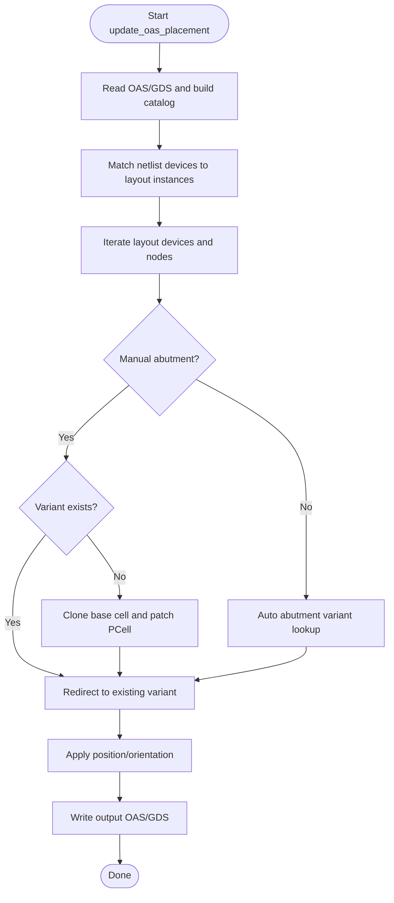
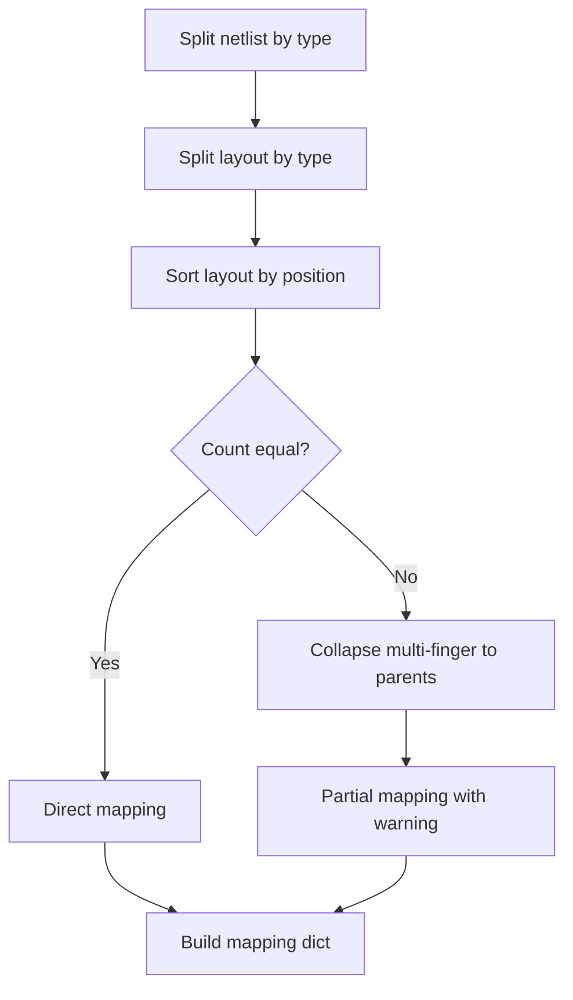
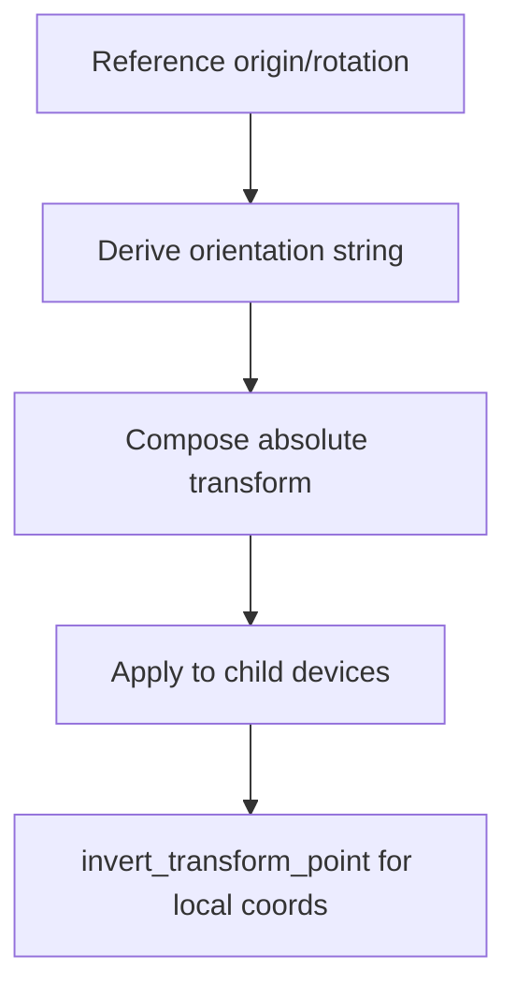
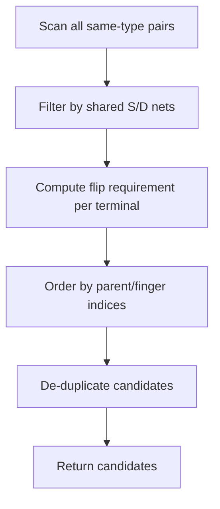
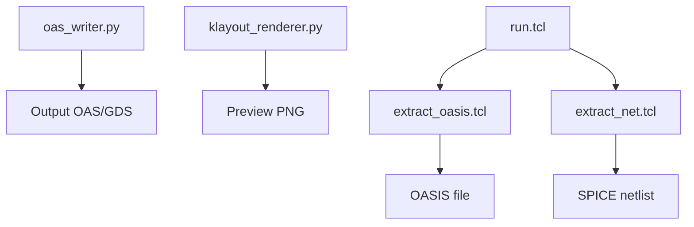
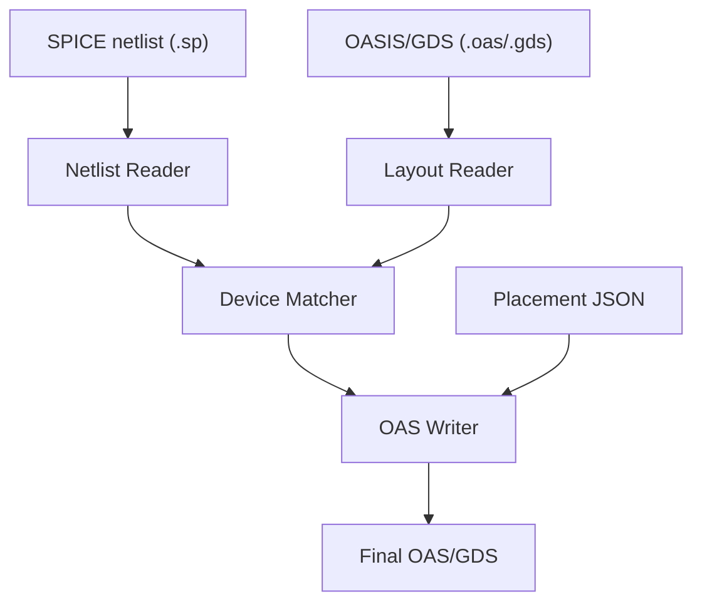
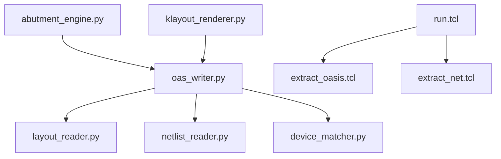

# OASIS/GDS File Generation

<cite>
**Referenced Files in This Document**
- [oas_writer.py](file://export/oas_writer.py)
- [klayout_renderer.py](file://export/klayout_renderer.py)
- [export_json.py](file://export/export_json.py)
- [layout_reader.py](file://parser/layout_reader.py)
- [netlist_reader.py](file://parser/netlist_reader.py)
- [device_matcher.py](file://parser/device_matcher.py)
- [abutment_engine.py](file://symbolic_editor/abutment_engine.py)
- [run.tcl](file://eda/run.tcl)
- [extract_oasis.tcl](file://eda/extract_oasis.tcl)
- [extract_net.tcl](file://eda/extract_net.tcl)
- [USER_GUIDE.md](file://docs/USER_GUIDE.md)
- [README.md](file://README.md)
- [Layout_RTL.json](file://examples/Layout_RTL.json)
</cite>

## Table of Contents
1. [Introduction](#introduction)
2. [Project Structure](#project-structure)
3. [Core Components](#core-components)
4. [Architecture Overview](#architecture-overview)
5. [Detailed Component Analysis](#detailed-component-analysis)
6. [Dependency Analysis](#dependency-analysis)
7. [Performance Considerations](#performance-considerations)
8. [Troubleshooting Guide](#troubleshooting-guide)
9. [Conclusion](#conclusion)
10. [Appendices](#appendices)

## Introduction
This document explains the end-to-end OASIS/GDS file generation workflow used in the project. It covers how symbolic editor placement data is transformed into finalized OASIS/GDS output, including the abutment strategy for SAED14nm technology rules, device matching between netlist and layout, coordinate transformation and orientation handling, file format conversion, and quality assurance measures. It also documents input/output formats and their roles in EDA workflows, along with performance considerations for large layouts.

## Project Structure
The OASIS/GDS generation pipeline spans several modules:
- Parser modules extract and interpret netlist and layout data.
- The symbolic editor computes abutment candidates and placement.
- Export modules write OASIS/GDS files and render previews.

**Diagram sources**
- [oas_writer.py:1-520](file://export/oas_writer.py#L1-L520)
- [layout_reader.py:1-442](file://parser/layout_reader.py#L1-L442)
- [netlist_reader.py:1-855](file://parser/netlist_reader.py#L1-L855)
- [device_matcher.py:1-151](file://parser/device_matcher.py#L1-L151)
- [abutment_engine.py:1-225](file://symbolic_editor/abutment_engine.py#L1-L225)
- [klayout_renderer.py:1-74](file://export/klayout_renderer.py#L1-L74)
- [export_json.py:1-58](file://export/export_json.py#L1-L58)
- [run.tcl:1-200](file://eda/run.tcl#L1-L200)
- [extract_oasis.tcl:1-31](file://eda/extract_oasis.tcl#L1-L31)
- [extract_net.tcl:1-15](file://eda/extract_net.tcl#L1-L15)

**Section sources**
- [README.md:131-191](file://README.md#L131-L191)
- [USER_GUIDE.md:198-224](file://docs/USER_GUIDE.md#L198-L224)

## Core Components
- OASIS/GDS Writer: Applies placement and abutment to an existing OAS/GDS, writes the updated file, and ensures property consistency.
- Layout Reader: Extracts device instances from OAS/GDS, including hierarchical traversal and parameter parsing.
- Netlist Reader: Flattens hierarchical SPICE/CDL netlists and builds device connectivity.
- Device Matcher: Aligns netlist devices to layout instances deterministically.
- Abutment Engine: Computes abutment candidates and highlights edges for user guidance.
- KLayout Renderer: Renders OAS/GDS previews for the GUI.
- EDA TCL Scripts: Automates extraction of netlists and OASIS files from EDA tools.

**Section sources**
- [oas_writer.py:269-520](file://export/oas_writer.py#L269-L520)
- [layout_reader.py:232-442](file://parser/layout_reader.py#L232-L442)
- [netlist_reader.py:726-761](file://parser/netlist_reader.py#L726-L761)
- [device_matcher.py:85-151](file://parser/device_matcher.py#L85-L151)
- [abutment_engine.py:65-225](file://symbolic_editor/abutment_engine.py#L65-L225)
- [klayout_renderer.py:16-74](file://export/klayout_renderer.py#L16-L74)
- [run.tcl:14-86](file://eda/run.tcl#L14-L86)

## Architecture Overview
The OASIS/GDS generation architecture integrates parsing, matching, and writing with explicit handling of abutment and orientation.

**Diagram sources**
- [oas_writer.py:269-417](file://export/oas_writer.py#L269-L417)
- [layout_reader.py:232-241](file://parser/layout_reader.py#L232-L241)
- [netlist_reader.py:726-761](file://parser/netlist_reader.py#L726-L761)
- [device_matcher.py:85-151](file://parser/device_matcher.py#L85-L151)
- [abutment_engine.py:65-225](file://symbolic_editor/abutment_engine.py#L65-L225)

## Detailed Component Analysis

### OASIS/GDS Writer: Abutment Strategy and Geometry Clipping
The writer updates placements and applies abutment variants for SAED14nm asymmetric rules:
- Reads the original OAS/GDS and identifies existing abutment variants.
- For each device with manual abutment annotations, either reuses an existing variant or creates a new one by cloning and patching the PCell properties.
- Applies geometric clipping to shared edges to ensure diffusion continuity.
- Updates reference origins, rotations, and mirror flags.
- Writes a fresh library to avoid stale references.

**Diagram sources**
- [oas_writer.py:269-417](file://export/oas_writer.py#L269-L417)
- [oas_writer.py:129-221](file://export/oas_writer.py#L129-L221)

Key implementation aspects:
- Orientation mapping converts symbolic orientations to radians and mirror flags for gdstk.
- PCell property parsing decodes SAED14nm-encoded parameters and patches abutment flags.
- Geometric clipping trims polygons/paths/labels near edges to enforce abutment spacing rules.
- Catalog-based reuse avoids redundant cell duplication.

**Section sources**
- [oas_writer.py:48-68](file://export/oas_writer.py#L48-L68)
- [oas_writer.py:86-127](file://export/oas_writer.py#L86-L127)
- [oas_writer.py:129-221](file://export/oas_writer.py#L129-L221)
- [oas_writer.py:303-417](file://export/oas_writer.py#L303-L417)

### Device Matching: Netlist-to-Layout Alignment
The matcher aligns devices by type and spatial order, collapsing multi-finger expansions onto shared layout instances when counts differ.

**Diagram sources**
- [device_matcher.py:25-83](file://parser/device_matcher.py#L25-L83)
- [device_matcher.py:85-151](file://parser/device_matcher.py#L85-L151)

Behavior:
- Groups devices by type (nmos, pmos, res, cap).
- Sorts layout instances left-to-right, bottom-to-top.
- Uses logical parent grouping for expanded multi-finger netlists.
- Logs warnings for mismatches and falls back to spatial sorting.

**Section sources**
- [device_matcher.py:85-151](file://parser/device_matcher.py#L85-L151)

### Coordinate Transformation and Orientation Handling
The layout reader and writer handle transformations and orientations consistently:
- Extracts absolute positions and orientations from nested references.
- Supports mirror flags and rotation degrees.
- Converts between root and local coordinate spaces for accurate placement updates.

**Diagram sources**
- [layout_reader.py:86-136](file://parser/layout_reader.py#L86-L136)
- [layout_reader.py:153-229](file://parser/layout_reader.py#L153-L229)
- [oas_writer.py:358-371](file://export/oas_writer.py#L358-L371)

Orientation mapping:
- Maps symbolic orientations (e.g., R0, MX, MY, R90) to gdstk rotation and mirror flags.

**Section sources**
- [layout_reader.py:86-151](file://parser/layout_reader.py#L86-L151)
- [oas_writer.py:48-68](file://export/oas_writer.py#L48-L68)

### Abutment Candidate Finder (SAED14nm)
The symbolic editor computes abutment candidates across same-type transistors sharing a source or drain net, including flip decisions for proper alignment.

**Diagram sources**
- [abutment_engine.py:65-181](file://symbolic_editor/abutment_engine.py#L65-L181)

Highlights:
- Filters out power nets when computing shared terminals.
- Enforces consecutive-finger constraints for same-parent pairs.
- Limits cross-parent links to prevent combinatorial explosion.
- Produces a human-readable summary and per-device edge highlights.

**Section sources**
- [abutment_engine.py:65-225](file://symbolic_editor/abutment_engine.py#L65-L225)

### File Format Conversion and EDA Integration
- OASIS/GDS Writer: Reads OAS or GDS, updates references, and writes the output format.
- KLayout Renderer: Renders OAS/GDS to PNG for GUI preview.
- EDA TCL Scripts: Automate extraction of netlists and OASIS files from EDA tools.

**Diagram sources**
- [oas_writer.py:419-518](file://export/oas_writer.py#L419-L518)
- [klayout_renderer.py:16-74](file://export/klayout_renderer.py#L16-L74)
- [run.tcl:14-86](file://eda/run.tcl#L14-L86)
- [extract_oasis.tcl:1-31](file://eda/extract_oasis.tcl#L1-31)
- [extract_net.tcl:1-15](file://eda/extract_net.tcl#L1-15)

**Section sources**
- [oas_writer.py:419-518](file://export/oas_writer.py#L419-L518)
- [klayout_renderer.py:16-74](file://export/klayout_renderer.py#L16-L74)
- [run.tcl:14-86](file://eda/run.tcl#L14-L86)

### Input/Output Formats and EDA Workflow Roles
- Placement JSON: Contains device nodes with geometry and electrical parameters; used for AI placement and export.
- SPICE Netlist (.sp): Circuit connectivity and device parameters; used for device matching and topology analysis.
- OASIS/GDS (.oas/.gds): Final layout geometry; generated from placement JSON and used in downstream EDA steps.

**Diagram sources**
- [netlist_reader.py:726-761](file://parser/netlist_reader.py#L726-L761)
- [layout_reader.py:232-241](file://parser/layout_reader.py#L232-L241)
- [device_matcher.py:85-151](file://parser/device_matcher.py#L85-L151)
- [oas_writer.py:269-417](file://export/oas_writer.py#L269-L417)

**Section sources**
- [Layout_RTL.json:1-152](file://examples/Layout_RTL.json#L1-L152)
- [USER_GUIDE.md:414-461](file://docs/USER_GUIDE.md#L414-L461)

## Dependency Analysis
The OASIS/GDS writer depends on parser modules for device data and on the symbolic editor for abutment decisions. The EDA TCL scripts depend on the run manager to orchestrate extraction.

**Diagram sources**
- [oas_writer.py:40-46](file://export/oas_writer.py#L40-L46)
- [layout_reader.py:1-12](file://parser/layout_reader.py#L1-L12)
- [netlist_reader.py:1-12](file://parser/netlist_reader.py#L1-L12)
- [device_matcher.py:1-16](file://parser/device_matcher.py#L1-L16)
- [abutment_engine.py:1-36](file://symbolic_editor/abutment_engine.py#L1-L36)
- [klayout_renderer.py:1-14](file://export/klayout_renderer.py#L1-L14)
- [run.tcl:14-86](file://eda/run.tcl#L14-L86)

**Section sources**
- [oas_writer.py:40-46](file://export/oas_writer.py#L40-L46)
- [layout_reader.py:1-12](file://parser/layout_reader.py#L1-L12)
- [netlist_reader.py:1-12](file://parser/netlist_reader.py#L1-L12)
- [device_matcher.py:1-16](file://parser/device_matcher.py#L1-L16)
- [abutment_engine.py:1-36](file://symbolic_editor/abutment_engine.py#L1-L36)
- [klayout_renderer.py:1-14](file://export/klayout_renderer.py#L1-L14)
- [run.tcl:14-86](file://eda/run.tcl#L14-L86)

## Performance Considerations
- Catalog-based variant reuse minimizes cell duplication and speeds up write operations.
- Fresh library rebuild avoids stale references and reduces memory overhead.
- Hierarchical layout traversal is bounded by the number of leaf devices; limit unnecessary sub-cells.
- Geometric clipping is selective and operates on bounding boxes; keep polygon counts reasonable.
- For large layouts, prefer batch operations and avoid repeated property scans by caching parsed parameters.

[No sources needed since this section provides general guidance]

## Troubleshooting Guide
Common issues and resolutions:
- Missing or invalid API keys cause AI features to fail; configure at least one key in the environment.
- Device matching failures occur when netlist and layout counts differ; verify device counts and types.
- Orientation and mirroring produce unexpected flips; confirm orientation strings and mirror flags.
- Abutment candidates not appearing; ensure devices share non-power nets and are same-type.
- EDA extraction errors; verify directory paths and that required dialogs exist.

**Section sources**
- [USER_GUIDE.md:653-711](file://docs/USER_GUIDE.md#L653-L711)
- [device_matcher.py:116-149](file://parser/device_matcher.py#L116-L149)
- [abutment_engine.py:46-58](file://symbolic_editor/abutment_engine.py#L46-L58)

## Conclusion
The OASIS/GDS generation system integrates parsing, matching, and writing with robust abutment handling for SAED14nm. It supports both manual and AI-assisted workflows, ensuring geometric correctness and orientation fidelity. The modular design enables scalable processing of large layouts and seamless integration with EDA tools.

[No sources needed since this section summarizes without analyzing specific files]

## Appendices

### Quality Assurance Measures
- Device matching logs warnings for mismatches and falls back to spatial sorting.
- Abutment variants are cached and reused to maintain consistency.
- Orientation mapping validates and converts symbolic orientations to gdstk-compatible forms.
- Preview rendering uses KLayout to validate layout appearance.

**Section sources**
- [device_matcher.py:116-149](file://parser/device_matcher.py#L116-L149)
- [oas_writer.py:48-68](file://export/oas_writer.py#L48-L68)
- [klayout_renderer.py:16-74](file://export/klayout_renderer.py#L16-L74)