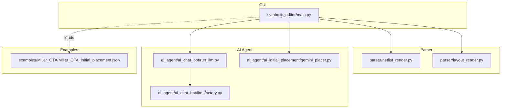
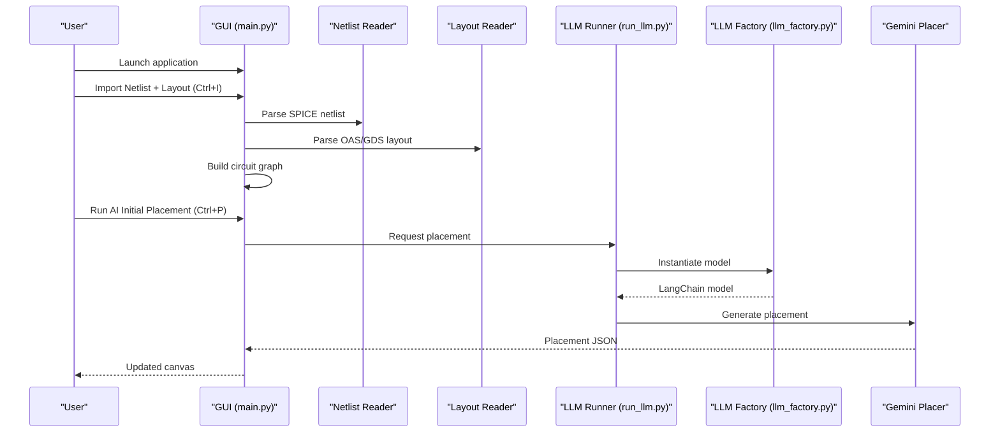
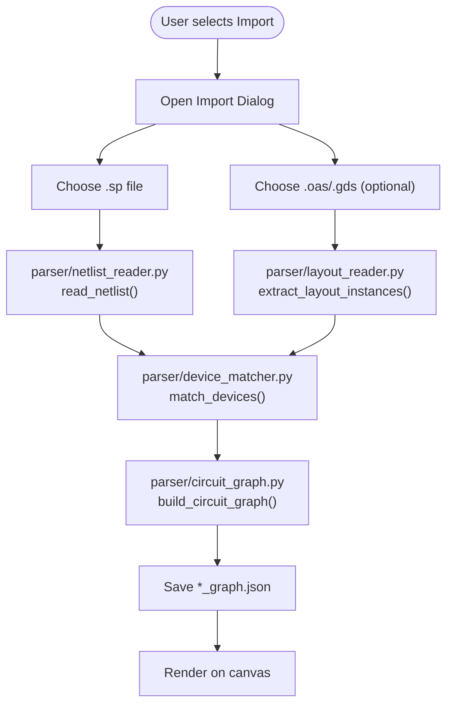
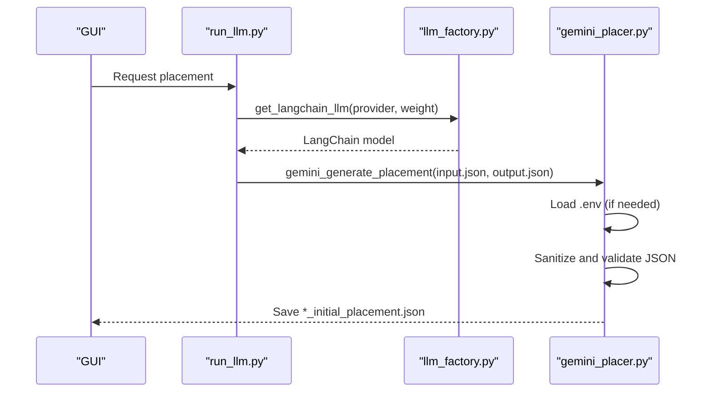
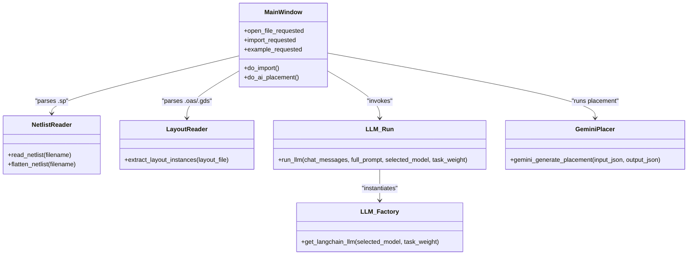
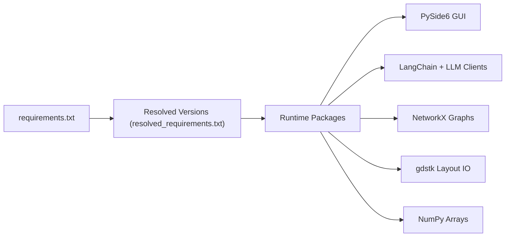

# Getting Started

<cite>
**Referenced Files in This Document**
- [README.md](file://README.md)
- [USER_GUIDE.md](file://docs/USER_GUIDE.md)
- [requirements.txt](file://requirements.txt)
- [resolved_requirements.txt](file://packages/resolved_requirements.txt)
- [main.py](file://symbolic_editor/main.py)
- [netlist_reader.py](file://parser/netlist_reader.py)
- [layout_reader.py](file://parser/layout_reader.py)
- [gemini_placer.py](file://ai_agent/ai_initial_placement/gemini_placer.py)
- [llm_factory.py](file://ai_agent/ai_chat_bot/llm_factory.py)
- [run_llm.py](file://ai_agent/ai_chat_bot/run_llm.py)
- [Miller_OTA_initial_placement.json](file://examples/Miller_OTA/Miller_OTA_initial_placement.json)
</cite>

## Table of Contents
1. [Introduction](#introduction)
2. [Project Structure](#project-structure)
3. [Core Components](#core-components)
4. [Architecture Overview](#architecture-overview)
5. [Detailed Component Analysis](#detailed-component-analysis)
6. [Dependency Analysis](#dependency-analysis)
7. [Performance Considerations](#performance-considerations)
8. [Troubleshooting Guide](#troubleshooting-guide)
9. [Conclusion](#conclusion)
10. [Appendices](#appendices)

## Introduction
This guide helps you install, configure, and run the AI-Based Analog Layout Automation project. You will:
- Set up a Python virtual environment and install dependencies
- Configure API keys for AI providers
- Import a netlist and layout, run AI initial placement, and export results
- Verify your setup and troubleshoot common issues

## Project Structure
At a high level, the project consists of:
- A PySide6 GUI application for importing, placing, editing, and exporting layouts
- A parser that reads SPICE netlists and OASIS/GDS layouts
- An AI agent that provides chat assistance and initial placement via LLMs
- Example circuits to quickly get started

**Diagram sources**
- [main.py:1-801](file://symbolic_editor/main.py#L1-L801)
- [netlist_reader.py:1-855](file://parser/netlist_reader.py#L1-L855)
- [layout_reader.py:1-442](file://parser/layout_reader.py#L1-L442)
- [llm_factory.py:1-131](file://ai_agent/ai_chat_bot/llm_factory.py#L1-L131)
- [run_llm.py:1-162](file://ai_agent/ai_chat_bot/run_llm.py#L1-L162)
- [gemini_placer.py:1-597](file://ai_agent/ai_initial_placement/gemini_placer.py#L1-L597)
- [Miller_OTA_initial_placement.json:1-1066](file://examples/Miller_OTA/Miller_OTA_initial_placement.json#L1-L1066)

**Section sources**
- [README.md:131-191](file://README.md#L131-L191)
- [USER_GUIDE.md:713-779](file://docs/USER_GUIDE.md#L713-L779)

## Core Components
- GUI launcher and main window: [main.py:1-801](file://symbolic_editor/main.py#L1-L801)
- Netlist parser: [netlist_reader.py:1-855](file://parser/netlist_reader.py#L1-L855)
- Layout reader: [layout_reader.py:1-442](file://parser/layout_reader.py#L1-L442)
- AI chat LLM factory: [llm_factory.py:1-131](file://ai_agent/ai_chat_bot/llm_factory.py#L1-L131)
- LLM runner with retries: [run_llm.py:1-162](file://ai_agent/ai_chat_bot/run_llm.py#L1-L162)
- Gemini-based initial placement: [gemini_placer.py:1-597](file://ai_agent/ai_initial_placement/gemini_placer.py#L1-L597)

**Section sources**
- [main.py:1-801](file://symbolic_editor/main.py#L1-L801)
- [netlist_reader.py:1-855](file://parser/netlist_reader.py#L1-L855)
- [layout_reader.py:1-442](file://parser/layout_reader.py#L1-L442)
- [llm_factory.py:1-131](file://ai_agent/ai_chat_bot/llm_factory.py#L1-L131)
- [run_llm.py:1-162](file://ai_agent/ai_chat_bot/run_llm.py#L1-L162)
- [gemini_placer.py:1-597](file://ai_agent/ai_initial_placement/gemini_placer.py#L1-L597)

## Architecture Overview
The end-to-end workflow integrates GUI operations, parsing, and AI placement:

**Diagram sources**
- [main.py:251-362](file://symbolic_editor/main.py#L251-L362)
- [netlist_reader.py:726-761](file://parser/netlist_reader.py#L726-L761)
- [layout_reader.py:357-442](file://parser/layout_reader.py#L357-L442)
- [run_llm.py:76-124](file://ai_agent/ai_chat_bot/run_llm.py#L76-L124)
- [llm_factory.py:29-131](file://ai_agent/ai_chat_bot/llm_factory.py#L29-L131)
- [gemini_placer.py:422-597](file://ai_agent/ai_initial_placement/gemini_placer.py#L422-L597)

## Detailed Component Analysis

### Installation and Setup
Follow these steps to prepare your environment:

- Clone the repository and navigate to the project root
- Create a Python virtual environment
- Activate the environment
- Install dependencies from requirements.txt
- Copy .env.example to .env and add your API keys

Verification steps:
- Launch the GUI with python symbolic_editor/main.py
- Confirm the main window opens without import errors
- Check that the menu items for Import and Run AI Initial Placement are present

**Section sources**
- [README.md:11-56](file://README.md#L11-L56)
- [USER_GUIDE.md:51-109](file://docs/USER_GUIDE.md#L51-L109)
- [main.py:755-800](file://symbolic_editor/main.py#L755-L800)

### Minimum System Requirements
- Python: 3.10 or newer
- Operating Systems: Windows 10/11 (primary), macOS, Linux
- RAM: 4 GB minimum, 8 GB recommended
- Display: 1280×720 minimum
- Internet access: Required for AI features (LLM API calls)

**Section sources**
- [USER_GUIDE.md:39-48](file://docs/USER_GUIDE.md#L39-L48)

### API Key Configuration
Set at least one API key in .env. Providers supported by the LLM factory include:
- Google Gemini (recommended)
- Groq
- Alibaba DashScope (via OpenAI-compatible endpoint)
- Vertex AI (Google Cloud)

Free tier availability:
- Gemini: Free
- Groq: Free
- OpenAI: Paid
- DeepSeek: Paid

Configuration tips:
- Copy .env.example to .env in the project root
- Paste your API key(s) into .env
- Restart the application after editing .env

**Section sources**
- [README.md:111-129](file://README.md#L111-L129)
- [USER_GUIDE.md:82-109](file://docs/USER_GUIDE.md#L82-L109)
- [llm_factory.py:29-131](file://ai_agent/ai_chat_bot/llm_factory.py#L29-L131)

### Quick Start Examples
Two quick ways to begin:

- Import a new circuit:
  - Launch the GUI
  - Use File > Import from Netlist + Layout (Ctrl+I)
  - Select your .sp and .oas files
  - Run Design > Run AI Initial Placement (Ctrl+P)
  - Edit, save, and export

- Load an existing example:
  - python symbolic_editor/main.py examples/current_mirror/CM_initial_placement.json
  - python symbolic_editor/main.py examples/xor/Xor_Automation_initial_placement.json
  - python symbolic_editor/main.py examples/std_cell/Std_Cell_initial_placement.json

**Section sources**
- [README.md:37-56](file://README.md#L37-L56)
- [USER_GUIDE.md:198-382](file://docs/USER_GUIDE.md#L198-L382)

### Parsing and Import Pipeline
The GUI triggers parsers to convert design files into a circuit graph:

**Diagram sources**
- [main.py:251-362](file://symbolic_editor/main.py#L251-L362)
- [netlist_reader.py:726-761](file://parser/netlist_reader.py#L726-L761)
- [layout_reader.py:357-442](file://parser/layout_reader.py#L357-L442)

**Section sources**
- [USER_GUIDE.md:228-285](file://docs/USER_GUIDE.md#L228-L285)
- [netlist_reader.py:1-855](file://parser/netlist_reader.py#L1-L855)
- [layout_reader.py:1-442](file://parser/layout_reader.py#L1-L442)

### AI Initial Placement
The AI placement process uses the Gemini LLM:

**Diagram sources**
- [run_llm.py:76-124](file://ai_agent/ai_chat_bot/run_llm.py#L76-L124)
- [llm_factory.py:29-131](file://ai_agent/ai_chat_bot/llm_factory.py#L29-L131)
- [gemini_placer.py:422-597](file://ai_agent/ai_initial_placement/gemini_placer.py#L422-L597)

**Section sources**
- [USER_GUIDE.md:288-316](file://docs/USER_GUIDE.md#L288-L316)
- [gemini_placer.py:1-597](file://ai_agent/ai_initial_placement/gemini_placer.py#L1-L597)

### Class Relationships (Code-Level)

**Diagram sources**
- [main.py:80-148](file://symbolic_editor/main.py#L80-L148)
- [netlist_reader.py:726-761](file://parser/netlist_reader.py#L726-L761)
- [layout_reader.py:357-442](file://parser/layout_reader.py#L357-L442)
- [run_llm.py:76-124](file://ai_agent/ai_chat_bot/run_llm.py#L76-L124)
- [llm_factory.py:29-131](file://ai_agent/ai_chat_bot/llm_factory.py#L29-L131)
- [gemini_placer.py:422-597](file://ai_agent/ai_initial_placement/gemini_placer.py#L422-L597)

## Dependency Analysis
The project uses a curated set of Python packages. The requirements.txt file lists the primary dependencies, while resolved_requirements.txt shows the exact versions resolved by the packaging tool.

**Diagram sources**
- [requirements.txt:1-157](file://requirements.txt#L1-L157)
- [resolved_requirements.txt:1-749](file://packages/resolved_requirements.txt#L1-L749)

**Section sources**
- [requirements.txt:1-157](file://requirements.txt#L1-L157)
- [resolved_requirements.txt:1-749](file://packages/resolved_requirements.txt#L1-L749)

## Performance Considerations
- AI placement latency can vary by provider and model; Gemini free tier may have rate limits
- Large circuits (many devices) increase parsing and placement time
- Keep the virtual environment isolated to avoid conflicts with other projects

## Troubleshooting Guide
Common issues and resolutions:
- “All AI models failed”: Ensure at least one API key is set in .env and restart the app
- “ModuleNotFoundError: No module named 'PySide6'”: Activate your virtual environment and run pip install -r requirements.txt
- Devices not appearing: Press F to fit view; confirm nodes array format in JSON
- Slow AI responses: Rate limiting may apply; wait and retry
- Blank canvas after loading: Press F to auto-zoom
- Wrong positions after import: Verify netlist and layout device counts match
- AI placement does nothing: Set GEMINI_API_KEY in .env and restart

**Section sources**
- [USER_GUIDE.md:653-711](file://docs/USER_GUIDE.md#L653-L711)

## Conclusion
You now have the essentials to install the project, configure API keys, import designs, run AI initial placement, and export results. Use the examples to validate your setup, and consult the User Guide for advanced workflows and troubleshooting.

## Appendices

### Appendix A: End-to-End Workflow Checklist
- [ ] Clone repository and create virtual environment
- [ ] Install dependencies
- [ ] Configure .env with at least one API key
- [ ] Launch GUI and import a netlist + layout
- [ ] Run AI initial placement
- [ ] Review and refine layout
- [ ] Export JSON and/or OAS

**Section sources**
- [README.md:11-56](file://README.md#L11-L56)
- [USER_GUIDE.md:198-382](file://docs/USER_GUIDE.md#L198-L382)