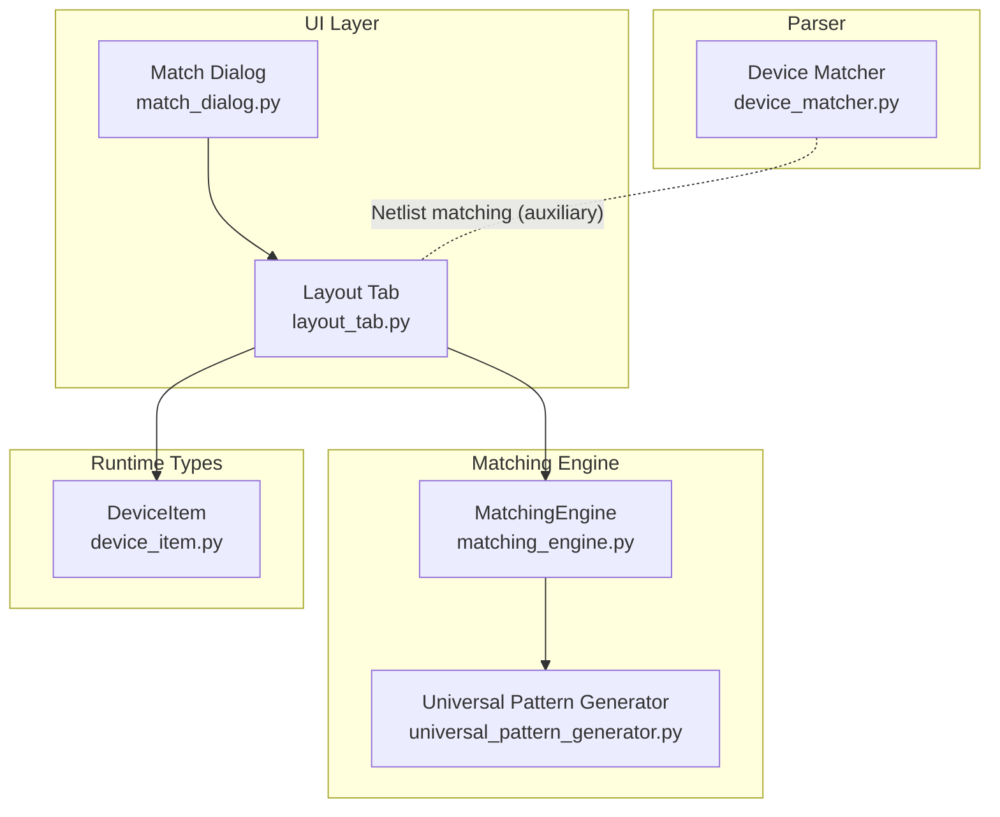
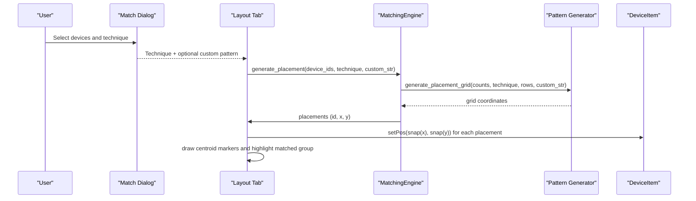
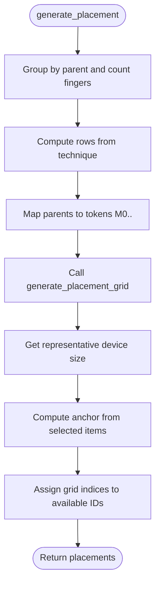
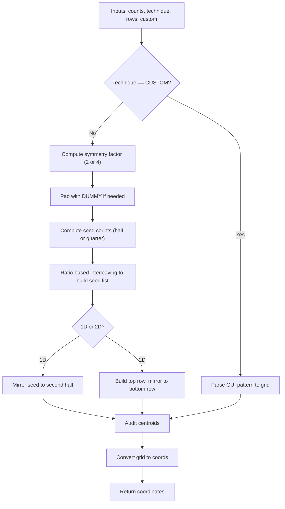
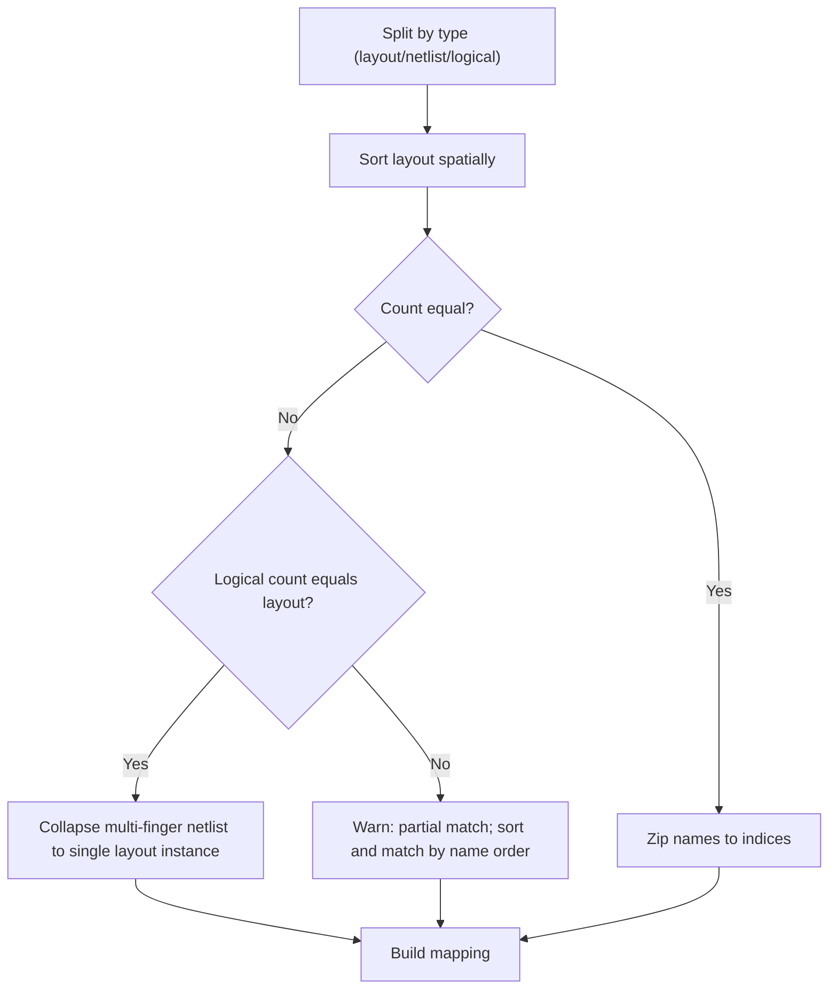
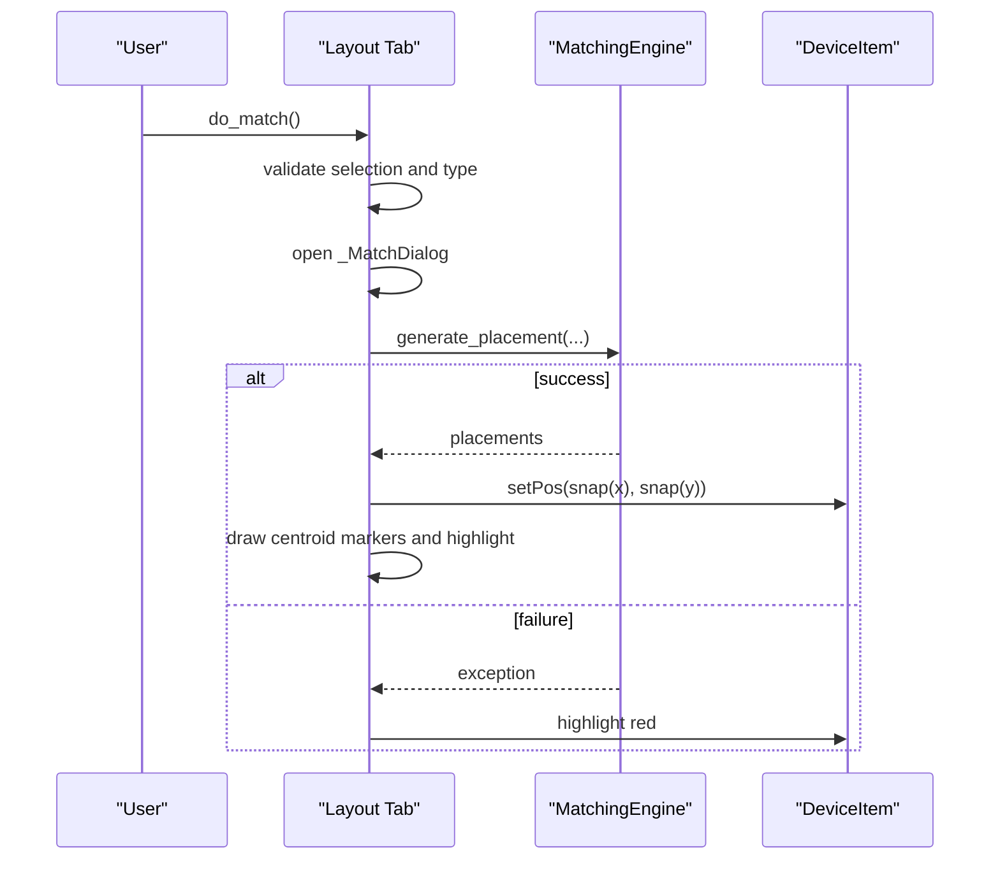
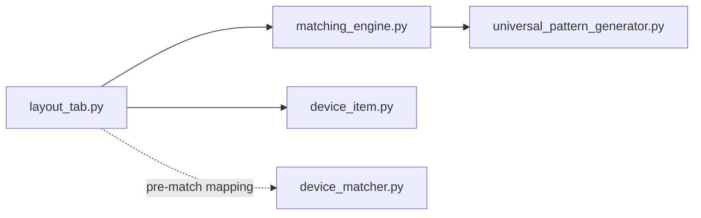

# Device Matching Engine

<cite>
**Referenced Files in This Document**
- [matching_engine.py](file://ai_agent/matching/matching_engine.py)
- [universal_pattern_generator.py](file://ai_agent/matching/universal_pattern_generator.py)
- [device_matcher.py](file://parser/device_matcher.py)
- [layout_tab.py](file://symbolic_editor/layout_tab.py)
- [match_dialog.py](file://symbolic_editor/dialogs/match_dialog.py)
- [device_item.py](file://symbolic_editor/device_item.py)
- [validation_script.py](file://tests/validation_script.py)
- [test_match.py](file://tests/test_match.py)
- [test_match2.py](file://tests/test_match2.py)
- [common-centroid-matching.md](file://ai_agent/SKILLS/common-centroid-matching.md)
- [interdigitated-matching.md](file://ai_agent/SKILLS/interdigitated-matching.md)
</cite>

## Table of Contents
1. [Introduction](#introduction)
2. [Project Structure](#project-structure)
3. [Core Components](#core-components)
4. [Architecture Overview](#architecture-overview)
5. [Detailed Component Analysis](#detailed-component-analysis)
6. [Dependency Analysis](#dependency-analysis)
7. [Performance Considerations](#performance-considerations)
8. [Troubleshooting Guide](#troubleshooting-guide)
9. [Conclusion](#conclusion)
10. [Appendices](#appendices)

## Introduction
This document describes the device matching engine that automatically associates schematic devices with layout instances. It explains the matching algorithms used to connect parsed netlist devices with extracted layout geometries, documents geometric matching criteria, and details the pattern recognition system that identifies device types and extracts parameters. It also covers the analytical audit mechanism that validates matches and handles ambiguous cases, and provides examples of successful and failed matches along with troubleshooting steps for complex layout scenarios.

## Project Structure
The matching pipeline spans three major areas:
- Pattern generation and placement: generates symmetric, centroid-balanced patterns for matched devices.
- Netlist-to-layout matching: maps netlist devices to layout instances based on type, count, and logical grouping.
- UI orchestration: exposes matching techniques via a dialog, applies placements, and highlights results.

**Diagram sources**
- [match_dialog.py:1-172](file://symbolic_editor/dialogs/match_dialog.py#L1-L172)
- [layout_tab.py:824-883](file://symbolic_editor/layout_tab.py#L824-L883)
- [matching_engine.py:1-95](file://ai_agent/matching/matching_engine.py#L1-L95)
- [universal_pattern_generator.py:1-167](file://ai_agent/matching/universal_pattern_generator.py#L1-L167)
- [device_matcher.py:1-151](file://parser/device_matcher.py#L1-L151)
- [device_item.py:17-200](file://symbolic_editor/device_item.py#L17-L200)

**Section sources**
- [layout_tab.py:824-883](file://symbolic_editor/layout_tab.py#L824-L883)
- [match_dialog.py:1-172](file://symbolic_editor/dialogs/match_dialog.py#L1-L172)
- [matching_engine.py:1-95](file://ai_agent/matching/matching_engine.py#L1-L95)
- [universal_pattern_generator.py:1-167](file://ai_agent/matching/universal_pattern_generator.py#L1-L167)
- [device_matcher.py:1-151](file://parser/device_matcher.py#L1-L151)
- [device_item.py:17-200](file://symbolic_editor/device_item.py#L17-L200)

## Core Components
- MatchingEngine: Groups selected devices by logical parent, computes finger counts, delegates pattern generation, and maps grid coordinates to physical positions using device bounding rectangles.
- Universal Pattern Generator: Implements ratio-based interleaving, symmetry enforcement, and a mathematical audit to ensure centroid alignment.
- Device Matcher (parser): Provides deterministic matching between netlist devices and layout instances by type, exact count, and logical parent collapse for multi-finger devices.
- UI Orchestration: Dialog selects technique, applies placement, snaps positions, draws centroid markers, and highlights matched groups.

**Section sources**
- [matching_engine.py:5-95](file://ai_agent/matching/matching_engine.py#L5-L95)
- [universal_pattern_generator.py:9-167](file://ai_agent/matching/universal_pattern_generator.py#L9-L167)
- [device_matcher.py:85-151](file://parser/device_matcher.py#L85-L151)
- [layout_tab.py:824-905](file://symbolic_editor/layout_tab.py#L824-L905)
- [match_dialog.py:160-172](file://symbolic_editor/dialogs/match_dialog.py#L160-L172)

## Architecture Overview
The matching engine integrates UI-driven selection, pattern generation, and placement application. The UI invokes MatchingEngine with a chosen technique and optional custom pattern string. MatchingEngine builds a placement grid via Universal Pattern Generator, then assigns positions to DeviceItem instances and highlights results.

**Diagram sources**
- [layout_tab.py:824-883](file://symbolic_editor/layout_tab.py#L824-L883)
- [matching_engine.py:13-84](file://ai_agent/matching/matching_engine.py#L13-L84)
- [universal_pattern_generator.py:9-104](file://ai_agent/matching/universal_pattern_generator.py#L9-L104)
- [device_item.py:179-200](file://symbolic_editor/device_item.py#L179-L200)

## Detailed Component Analysis

### MatchingEngine
Responsibilities:
- Group selected device IDs by logical parent using a prefix rule.
- Count fingers per parent and map to tokenized identifiers (M0, M1, ...).
- Determine rows based on technique (2 for common-centroid 2D).
- Delegate grid generation to Universal Pattern Generator.
- Convert grid coordinates to physical positions using device bounding rectangles and anchor positions.
- Sort available IDs deterministically for stable mapping.

**Diagram sources**
- [matching_engine.py:13-84](file://ai_agent/matching/matching_engine.py#L13-L84)

**Section sources**
- [matching_engine.py:5-95](file://ai_agent/matching/matching_engine.py#L5-L95)

### Universal Pattern Generator
Responsibilities:
- Accept device counts per parent and a technique string.
- Support CUSTOM technique with GUI-style pattern strings separated by "/" for multi-row patterns.
- Enforce symmetry: pad with dummy devices to achieve divisibility by 2 (1D) or 4 (2D).
- Build a seed list using ratio-based interleaving to distribute fingers proportionally.
- Assemble a grid (1D mirrored or 2D cross-quadrant) and perform an analytical audit to validate centroid alignment.
- Convert grid cells to coordinate tuples for downstream placement.

**Diagram sources**
- [universal_pattern_generator.py:9-104](file://ai_agent/matching/universal_pattern_generator.py#L9-L104)
- [universal_pattern_generator.py:106-131](file://ai_agent/matching/universal_pattern_generator.py#L106-L131)
- [universal_pattern_generator.py:132-167](file://ai_agent/matching/universal_pattern_generator.py#L132-L167)

**Section sources**
- [universal_pattern_generator.py:9-167](file://ai_agent/matching/universal_pattern_generator.py#L9-L167)

### Device Matcher (Netlist-to-Layout)
Responsibilities:
- Separate layout instances and netlist devices by type (nmos, pmos, res, cap).
- Sort layout instances spatially (left-to-right, bottom-to-top).
- Prefer exact count matches; otherwise collapse logical multi-finger netlists onto shared layout instances; log warnings for partial matches.
- Return a deterministic mapping from netlist device names to layout indices.

**Diagram sources**
- [device_matcher.py:25-151](file://parser/device_matcher.py#L25-L151)

**Section sources**
- [device_matcher.py:85-151](file://parser/device_matcher.py#L85-L151)

### UI Orchestration and Highlighting
Responsibilities:
- Validate selection: require at least two devices of the same type.
- Open the match dialog to choose technique and optional custom pattern.
- Apply placement: compute placements, snap positions, update device locations, draw centroid markers, and highlight matched groups.
- On failure, highlight in red and post a message indicating centroid misalignment.

**Diagram sources**
- [layout_tab.py:824-883](file://symbolic_editor/layout_tab.py#L824-L883)
- [match_dialog.py:160-172](file://symbolic_editor/dialogs/match_dialog.py#L160-L172)
- [device_item.py:141-153](file://symbolic_editor/device_item.py#L141-L153)

**Section sources**
- [layout_tab.py:824-905](file://symbolic_editor/layout_tab.py#L824-L905)
- [match_dialog.py:1-172](file://symbolic_editor/dialogs/match_dialog.py#L1-L172)
- [device_item.py:141-153](file://symbolic_editor/device_item.py#L141-L153)

## Dependency Analysis
- MatchingEngine depends on Universal Pattern Generator for grid construction.
- Layout Tab orchestrates MatchingEngine and applies resulting placements to DeviceItem instances.
- Device Matcher operates independently to align netlist and layout structures prior to placement.
- Pattern Generator raises a dedicated exception when symmetry/audit fails.

**Diagram sources**
- [layout_tab.py:849-883](file://symbolic_editor/layout_tab.py#L849-L883)
- [matching_engine.py:3](file://ai_agent/matching/matching_engine.py#L3)
- [universal_pattern_generator.py:5-7](file://ai_agent/matching/universal_pattern_generator.py#L5-L7)
- [device_item.py:17-200](file://symbolic_editor/device_item.py#L17-L200)
- [device_matcher.py:1-151](file://parser/device_matcher.py#L1-L151)

**Section sources**
- [layout_tab.py:849-883](file://symbolic_editor/layout_tab.py#L849-L883)
- [matching_engine.py:3](file://ai_agent/matching/matching_engine.py#L3)
- [universal_pattern_generator.py:5-7](file://ai_agent/matching/universal_pattern_generator.py#L5-L7)
- [device_item.py:17-200](file://symbolic_editor/device_item.py#L17-L200)
- [device_matcher.py:1-151](file://parser/device_matcher.py#L1-L151)

## Performance Considerations
- Complexity of pattern generation is dominated by grid assembly and ratio-based interleaving; overall complexity is near linear in the number of fingers due to greedy selection and fixed symmetry checks.
- Spatial sorting of layout instances is O(N log N) per type; netlist sorting is O(M log M) for M devices.
- Placement application is O(F) for F total fingers, plus O(G) for centroid marker computation where G is the number of grouped parents.

[No sources needed since this section provides general guidance]

## Troubleshooting Guide
Common issues and resolutions:
- Centroid misalignment failures: The analytical audit enforces strict centroid equality within a tolerance; ensure even finger counts per device for 2D common centroid and that the total number of fingers is divisible by the symmetry factor.
- Selection constraints: The UI requires at least two devices of the same type; selecting mixed types will be rejected.
- Partial matches: When counts differ, the system logs warnings and falls back to name-sorted matching; verify netlist expansion and logical grouping.
- Orientation and snapping: DeviceItem supports flipping and orientation tokens; ensure consistent orientation before matching to avoid unexpected rotations.
- Testing and validation: Use the provided test harness to exercise matching and the validation script to compare widths across devices.

**Section sources**
- [universal_pattern_generator.py:106-131](file://ai_agent/matching/universal_pattern_generator.py#L106-L131)
- [layout_tab.py:824-883](file://symbolic_editor/layout_tab.py#L824-L883)
- [validation_script.py:1-31](file://tests/validation_script.py#L1-L31)
- [test_match.py:1-25](file://tests/test_match.py#L1-L25)
- [test_match2.py:1-25](file://tests/test_match2.py#L1-L25)

## Conclusion
The device matching engine combines deterministic pattern generation with robust geometric and logical constraints to reliably associate schematic devices with layout instances. By enforcing symmetry and centroid alignment, and by providing clear feedback on failures, it improves matching accuracy and simplifies complex layout scenarios. The modular design allows easy extension for new techniques and validation rules.

[No sources needed since this section summarizes without analyzing specific files]

## Appendices

### Geometric Matching Criteria
- Device dimensions: Derived from DeviceItem bounding rectangles; used to compute row heights and snap positions.
- Orientation: Supported via horizontal/vertical flips and orientation tokens; restored during rendering.
- Spatial relationships: Layout instances are sorted spatially to ensure deterministic matching; centroids are drawn to visualize balance.

**Section sources**
- [matching_engine.py:44-57](file://ai_agent/matching/matching_engine.py#L44-L57)
- [device_item.py:155-189](file://symbolic_editor/device_item.py#L155-L189)
- [layout_tab.py:885-905](file://symbolic_editor/layout_tab.py#L885-L905)

### Pattern Recognition and Techniques
- Interdigitated: Ratio-based interleaving to alternate fingers across devices.
- Common Centroid (1D): Mirror pattern within a single row.
- Common Centroid (2D): Cross-quadrant symmetry across two rows.
- Custom: GUI-style pattern string with “/” separating rows.

**Section sources**
- [interdigitated-matching.md:1-29](file://ai_agent/SKILLS/interdigitated-matching.md#L1-L29)
- [common-centroid-matching.md:1-26](file://ai_agent/SKILLS/common-centroid-matching.md#L1-L26)
- [match_dialog.py:94-130](file://symbolic_editor/dialogs/match_dialog.py#L94-L130)
- [universal_pattern_generator.py:132-167](file://ai_agent/matching/universal_pattern_generator.py#L132-L167)

### Confidence Scoring Mechanism
- Deterministic matching: Prioritizes exact type and count matches; collapses logical multi-finger groups when counts align with layout instances; logs warnings for partial matches.
- Analytical audit: Enforces symmetry and centroid alignment; raises exceptions on failure, preventing invalid placements.

**Section sources**
- [device_matcher.py:85-151](file://parser/device_matcher.py#L85-L151)
- [universal_pattern_generator.py:106-131](file://ai_agent/matching/universal_pattern_generator.py#L106-L131)

### Examples and Test Cases
- Successful matches: Exercise the matching workflow via the test harness to confirm successful application and highlighting.
- Failed matches: Trigger failures by violating symmetry constraints (e.g., odd finger counts in 2D common centroid) or by selecting mixed device types.

**Section sources**
- [test_match.py:1-25](file://tests/test_match.py#L1-L25)
- [test_match2.py:1-25](file://tests/test_match2.py#L1-L25)
- [layout_tab.py:875-883](file://symbolic_editor/layout_tab.py#L875-L883)