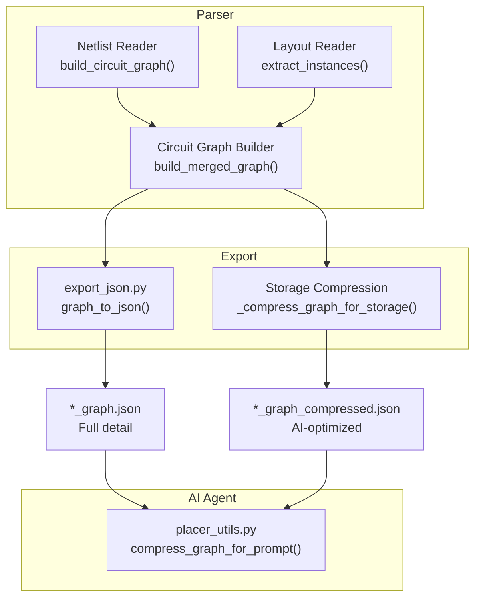
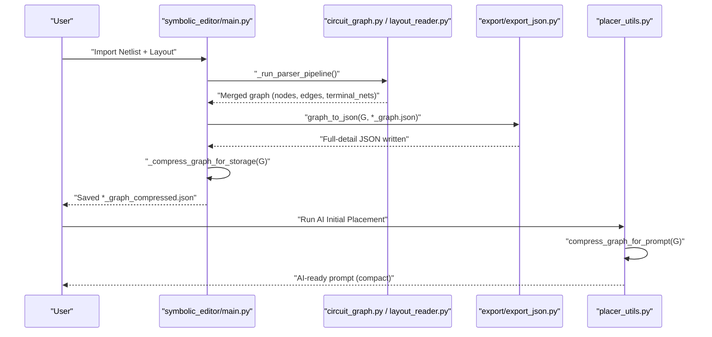
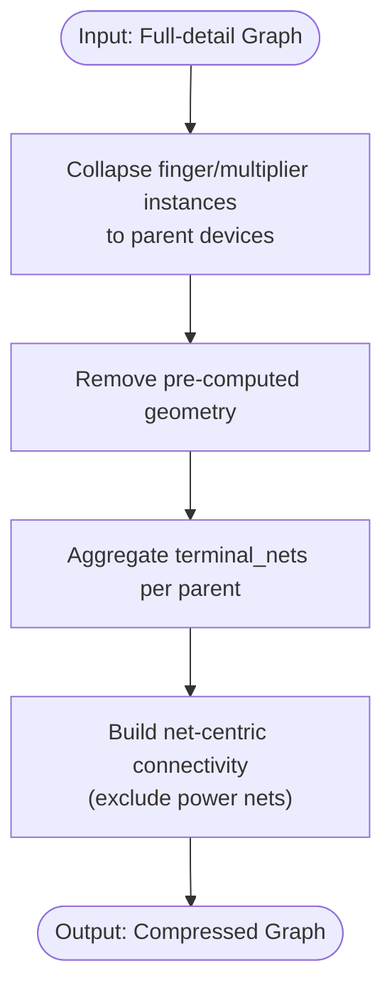
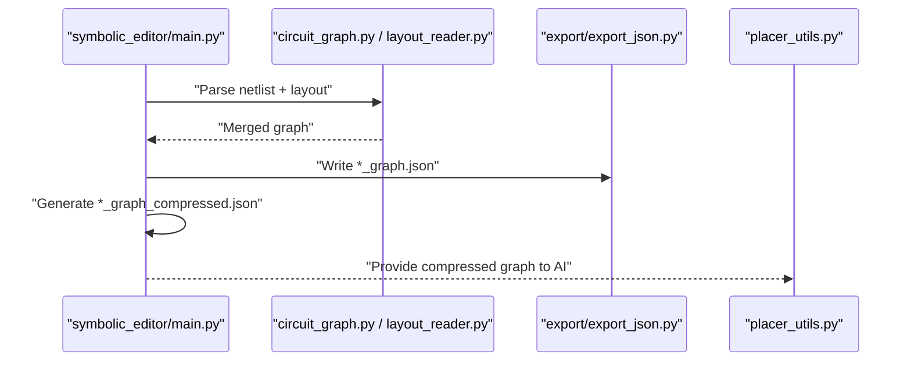
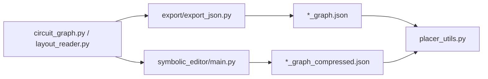

# Dual JSON Format System

<cite>
**Referenced Files in This Document**
- [README.md](file://README.md)
- [JSON_OPTIMIZATION_README.md](file://docs/JSON_OPTIMIZATION_README.md)
- [JSON_OPTIMIZATION_SUMMARY.md](file://docs/JSON_OPTIMIZATION_SUMMARY.md)
- [export_json.py](file://export/export_json.py)
- [placer_utils.py](file://ai_agent/ai_initial_placement/placer_utils.py)
- [main.py](file://symbolic_editor/main.py)
- [comparator_graph.json](file://examples/comparator/comparator_graph.json)
- [comparator_graph_compressed.json](file://examples/comparator/comparator_graph_compressed.json)
- [circuit_graph.py](file://parser/circuit_graph.py)
- [layout_reader.py](file://parser/layout_reader.py)
</cite>

## Table of Contents
1. [Introduction](#introduction)
2. [Project Structure](#project-structure)
3. [Core Components](#core-components)
4. [Architecture Overview](#architecture-overview)
5. [Detailed Component Analysis](#detailed-component-analysis)
6. [Dependency Analysis](#dependency-analysis)
7. [Performance Considerations](#performance-considerations)
8. [Troubleshooting Guide](#troubleshooting-guide)
9. [Conclusion](#conclusion)

## Introduction
This document explains the dual JSON format generation system that produces two complementary graph representations:
- Full detail format (_graph.json): intended for GUI rendering and manual inspection, containing complete device instances, geometry, and layout metadata.
- Compressed format (_graph_compressed.json): optimized for AI prompts, with parent-level device representations, simplified connectivity, and removed pre-computed geometry.

The system automatically generates both formats during import and export operations, enabling:
- GUI applications to render precise device-level geometry.
- AI initial placement agents to operate efficiently within token limits by consuming a compact representation.

## Project Structure
The dual JSON system spans three primary areas:
- Parser pipeline: builds merged graphs from netlist and layout data.
- Export pipeline: writes the full-detail graph to _graph.json and triggers compression for the AI-ready _graph_compressed.json.
- AI placement pipeline: consumes the compressed graph to generate initial placements.

**Diagram sources**
- [circuit_graph.py:131-191](file://parser/circuit_graph.py#L131-L191)
- [layout_reader.py:153-200](file://parser/layout_reader.py#L153-L200)
- [export_json.py:4-58](file://export/export_json.py#L4-L58)
- [placer_utils.py:469-568](file://ai_agent/ai_initial_placement/placer_utils.py#L469-L568)
- [main.py:602-801](file://symbolic_editor/main.py#L602-L801)

**Section sources**
- [README.md:37-55](file://README.md#L37-L55)
- [JSON_OPTIMIZATION_README.md:17-47](file://docs/JSON_OPTIMIZATION_README.md#L17-L47)
- [JSON_OPTIMIZATION_SUMMARY.md:158-173](file://docs/JSON_OPTIMIZATION_SUMMARY.md#L158-L173)

## Core Components
- Full-detail graph exporter: serializes nodes with per-instance geometry and edges with per-finger connectivity.
- Compressed graph generator: collapses multi-finger/multiplier instances into parent devices, removes geometry, and aggregates connectivity by net.
- Automatic generation: invoked during import/export to produce both formats.

Key responsibilities:
- Exporter: constructs node and edge arrays suitable for GUI rendering.
- Compressor: transforms the full graph into a compact device-centric representation for AI prompts.
- Integration: the GUI triggers both exports upon completion of the import pipeline.

**Section sources**
- [export_json.py:4-58](file://export/export_json.py#L4-L58)
- [placer_utils.py:469-568](file://ai_agent/ai_initial_placement/placer_utils.py#L469-L568)
- [main.py:602-801](file://symbolic_editor/main.py#L602-L801)

## Architecture Overview
The dual JSON system integrates with the parser and GUI to produce both formats automatically. The flow is:

**Diagram sources**
- [circuit_graph.py:131-191](file://parser/circuit_graph.py#L131-L191)
- [layout_reader.py:153-200](file://parser/layout_reader.py#L153-L200)
- [export_json.py:4-58](file://export/export_json.py#L4-L58)
- [placer_utils.py:469-568](file://ai_agent/ai_initial_placement/placer_utils.py#L469-L568)
- [main.py:602-801](file://symbolic_editor/main.py#L602-L801)

## Detailed Component Analysis

### Full-detail Graph Format (_graph.json)
Purpose:
- Preserve complete device instances, geometry, and layout metadata for GUI rendering and manual inspection.

Structure highlights:
- nodes: per-instance entries with type, electrical parameters, geometry, and abutment flags.
- edges: per-finger connectivity annotated with net names.
- terminal_nets: per-instance mapping of terminals to nets.

Example characteristics:
- Many finger instances duplicated with identical electrical parameters.
- Pre-computed geometry included for each instance.
- Verbose edge lists enumerate every finger connection.

Representative example references:
- [comparator_graph.json:1-200](file://examples/comparator/comparator_graph.json#L1-L200)

**Section sources**
- [export_json.py:4-58](file://export/export_json.py#L4-L58)
- [comparator_graph.json:1-200](file://examples/comparator/comparator_graph.json#L1-L200)

### Compressed Graph Format (_graph_compressed.json)
Purpose:
- Provide a compact representation for AI prompts, reducing token usage and focusing on parent-level topology.

Structure highlights:
- version: format version identifier.
- device_types: default rows and dimensions per device type.
- devices: parent device entries with type, multi-finger counts, length, and terminal_nets.
- connectivity.nets: net-to-parent-devices mapping, collapsing per-instance edges.
- Optional blocks and matching constraints preserved.

Representative example references:
- [comparator_graph_compressed.json:1-200](file://examples/comparator/comparator_graph_compressed.json#L1-L200)

**Section sources**
- [placer_utils.py:469-568](file://ai_agent/ai_initial_placement/placer_utils.py#L469-L568)
- [comparator_graph_compressed.json:1-200](file://examples/comparator/comparator_graph_compressed.json#L1-L200)

### Data Transformation Process
Transformation steps performed by the compressor:
1. Collapse per-instance devices into parent devices by stripping suffixes and aggregating electrical parameters.
2. Remove pre-computed geometry from the compressed output.
3. Aggregate terminal_nets per parent device using the first instance’s mapping.
4. Replace verbose edge lists with net-centric connectivity, excluding power nets.

**Diagram sources**
- [placer_utils.py:469-568](file://ai_agent/ai_initial_placement/placer_utils.py#L469-L568)

**Section sources**
- [placer_utils.py:469-568](file://ai_agent/ai_initial_placement/placer_utils.py#L469-L568)

### Automatic Generation Workflow
Trigger points:
- Import pipeline completion: both _graph.json and _graph_compressed.json are saved automatically.
- Export pipeline: full-detail JSON is written; compressed variant is produced alongside.

Integration points:
- GUI import handler invokes the parser and saves both formats.
- AI placement pipeline consumes the compressed format.

**Diagram sources**
- [circuit_graph.py:131-191](file://parser/circuit_graph.py#L131-L191)
- [layout_reader.py:153-200](file://parser/layout_reader.py#L153-L200)
- [export_json.py:4-58](file://export/export_json.py#L4-L58)
- [placer_utils.py:469-568](file://ai_agent/ai_initial_placement/placer_utils.py#L469-L568)
- [main.py:602-801](file://symbolic_editor/main.py#L602-L801)

**Section sources**
- [README.md:37-55](file://README.md#L37-L55)
- [JSON_OPTIMIZATION_README.md:17-47](file://docs/JSON_OPTIMIZATION_README.md#L17-L47)
- [JSON_OPTIMIZATION_SUMMARY.md:158-173](file://docs/JSON_OPTIMIZATION_SUMMARY.md#L158-L173)

## Dependency Analysis
Relationships:
- Parser modules construct merged graphs with nodes, edges, and terminal_nets.
- Exporter writes the full-detail JSON.
- GUI integrates compression into the storage workflow.
- AI placement consumes the compressed graph.

**Diagram sources**
- [circuit_graph.py:131-191](file://parser/circuit_graph.py#L131-L191)
- [layout_reader.py:153-200](file://parser/layout_reader.py#L153-L200)
- [export_json.py:4-58](file://export/export_json.py#L4-L58)
- [placer_utils.py:469-568](file://ai_agent/ai_initial_placement/placer_utils.py#L469-L568)
- [main.py:602-801](file://symbolic_editor/main.py#L602-L801)

**Section sources**
- [circuit_graph.py:131-191](file://parser/circuit_graph.py#L131-L191)
- [layout_reader.py:153-200](file://parser/layout_reader.py#L153-L200)
- [export_json.py:4-58](file://export/export_json.py#L4-L58)
- [placer_utils.py:469-568](file://ai_agent/ai_initial_placement/placer_utils.py#L469-L568)
- [main.py:602-801](file://symbolic_editor/main.py#L602-L801)

## Performance Considerations
- Token efficiency: The compressed format reduces prompt size by 85–97%, enabling AI placement on larger designs.
- Reduced I/O: Smaller files improve load times and version control diffs.
- AI accuracy: Parent-level topology remains intact, ensuring meaningful placements without per-finger noise.

[No sources needed since this section provides general guidance]

## Troubleshooting Guide
Common issues and resolutions:
- AI placement fails with “device not found”: verify all parent devices are present in the compressed output using the provided test suite.
- Compressed file still too large: review finger counts and consider consolidating multipliers at the design level.
- Migration script failures: validate JSON syntax before conversion.

**Section sources**
- [JSON_OPTIMIZATION_SUMMARY.md:331-351](file://docs/JSON_OPTIMIZATION_SUMMARY.md#L331-L351)

## Conclusion
The dual JSON format system enables efficient GUI rendering and AI-friendly prompts by maintaining a full-detail format for visualization and a compressed format for inference. The automatic generation workflow ensures both outputs are produced seamlessly during import/export, while the compression algorithm preserves critical topology and connectivity information with significant size reductions.

[No sources needed since this section summarizes without analyzing specific files]