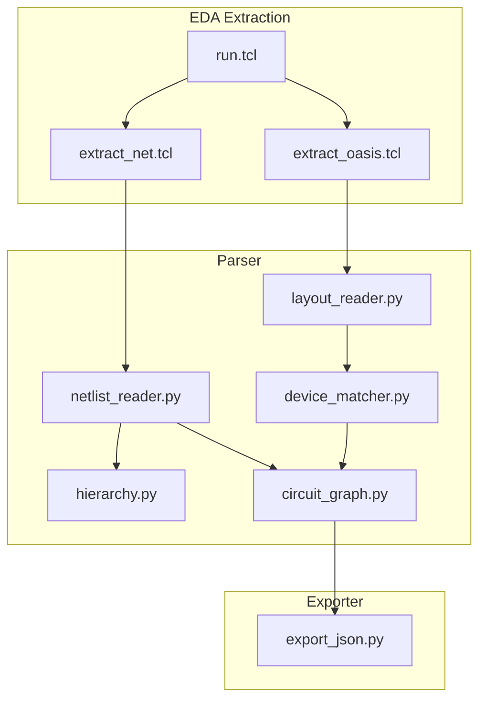
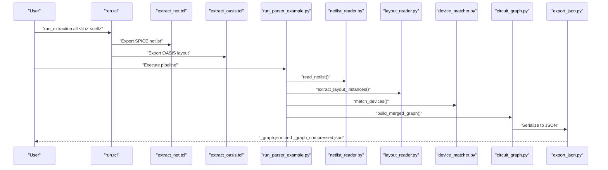
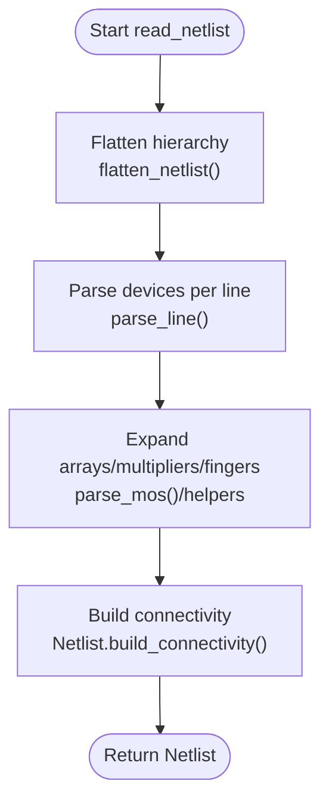
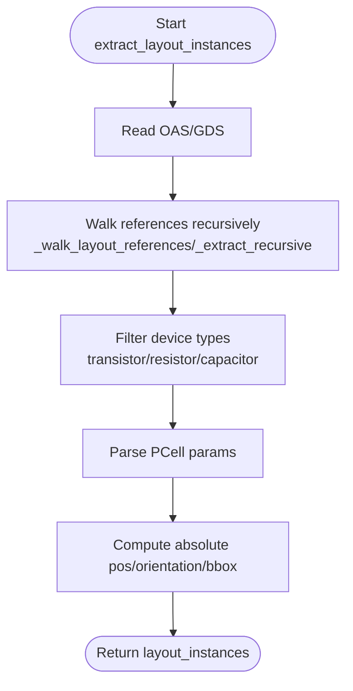
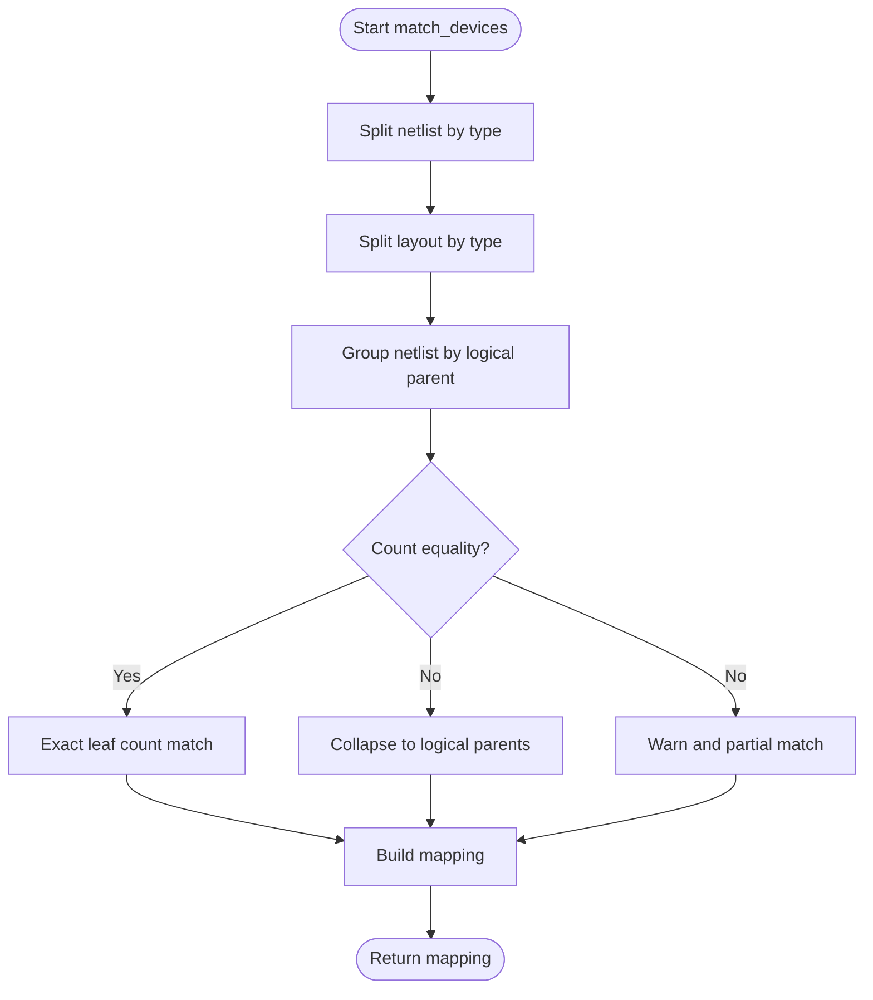
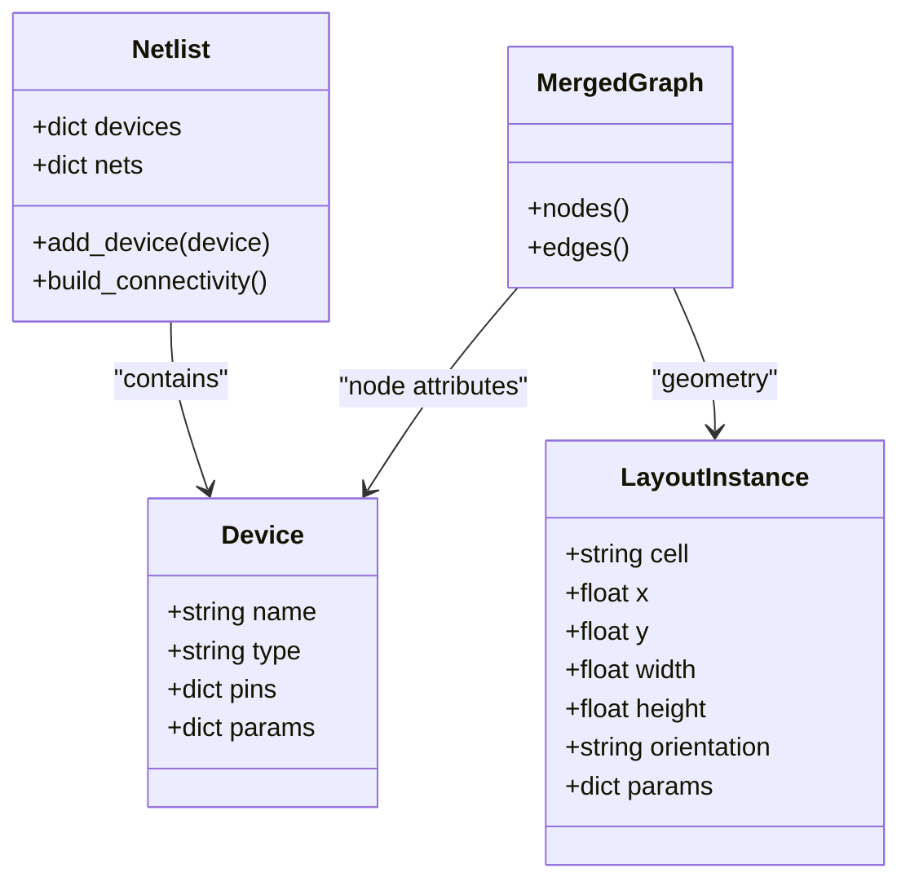
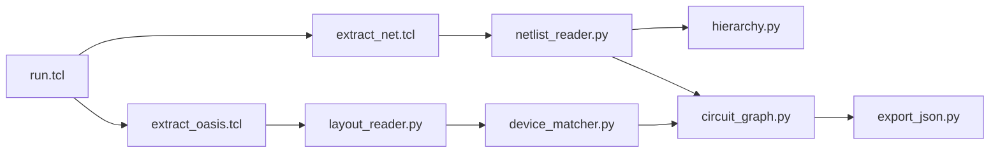

# Import Pipeline Integration

<cite>
**Referenced Files in This Document**
- [README.md](file://README.md)
- [run.tcl](file://eda/run.tcl)
- [extract_net.tcl](file://eda/extract_net.tcl)
- [extract_oasis.tcl](file://eda/extract_oasis.tcl)
- [run_parser_example.py](file://parser/run_parser_example.py)
- [netlist_reader.py](file://parser/netlist_reader.py)
- [hierarchy.py](file://parser/hierarchy.py)
- [layout_reader.py](file://parser/layout_reader.py)
- [device_matcher.py](file://parser/device_matcher.py)
- [circuit_graph.py](file://parser/circuit_graph.py)
- [export_json.py](file://export/export_json.py)
- [Miller_OTA_graph_compressed.json](file://examples/Miller_OTA/Miller_OTA_graph_compressed.json)
- [Nand_graph_compressed.json](file://examples/Nand/Nand_graph_compressed.json)
- [Current_Mirror_CM_graph_compressed.json](file://examples/current_mirror/Current_Mirror_CM_graph_compressed.json)
</cite>

## Table of Contents
1. [Introduction](#introduction)
2. [Project Structure](#project-structure)
3. [Core Components](#core-components)
4. [Architecture Overview](#architecture-overview)
5. [Detailed Component Analysis](#detailed-component-analysis)
6. [Dependency Analysis](#dependency-analysis)
7. [Performance Considerations](#performance-considerations)
8. [Troubleshooting Guide](#troubleshooting-guide)
9. [Conclusion](#conclusion)
10. [Appendices](#appendices)

## Introduction
This document explains the import pipeline that integrates SPICE/CDL netlist data with OASIS/GDS layout geometry. It covers:
- Dual JSON format generation: full format for GUI (_graph.json) and compressed format for AI prompts (_graph_compressed.json)
- Netlist parsing with hierarchical support and device parameter expansion
- Layout reading for OASIS/GDS with geometry extraction
- Automatic device-to-layout matching connecting schematic devices with physical instances
- Hierarchy flattening and block-level organization
- Supported formats, compatibility notes, and troubleshooting guidance

## Project Structure
The import pipeline spans EDA extraction scripts, parser modules, and exporters:
- EDA extraction: Tcl scripts to export netlists and OASIS layouts from the CAD environment
- Parser: Python modules to parse SPICE/CDL, flatten hierarchy, read layout, and match devices
- Exporters: JSON serializers for GUI and AI-ready formats

**Diagram sources**
- [run.tcl:1-200](file://eda/run.tcl#L1-L200)
- [extract_net.tcl:1-15](file://eda/extract_net.tcl#L1-L15)
- [extract_oasis.tcl:1-31](file://eda/extract_oasis.tcl#L1-L31)
- [netlist_reader.py:1-855](file://parser/netlist_reader.py#L1-L855)
- [hierarchy.py:1-475](file://parser/hierarchy.py#L1-L475)
- [layout_reader.py:1-442](file://parser/layout_reader.py#L1-L442)
- [device_matcher.py:1-151](file://parser/device_matcher.py#L1-L151)
- [circuit_graph.py:1-191](file://parser/circuit_graph.py#L1-L191)
- [export_json.py:1-58](file://export/export_json.py#L1-L58)

**Section sources**
- [README.md:37-56](file://README.md#L37-L56)
- [run.tcl:14-86](file://eda/run.tcl#L14-L86)

## Core Components
- Netlist reader: parses SPICE/CDL, flattens hierarchy, detects arrays/multipliers/fingers, builds connectivity
- Hierarchy manager: reconstructs logical device hierarchies and resolves multi-finger expansions
- Layout reader: reads OASIS/GDS, walks references, extracts device instances and geometry
- Matcher: aligns netlist devices to layout instances by type and count
- Circuit graph builder: merges electrical and geometric views into a NetworkX graph
- Exporter: serializes graphs to JSON for GUI and AI consumption

**Section sources**
- [netlist_reader.py:51-761](file://parser/netlist_reader.py#L51-L761)
- [hierarchy.py:44-475](file://parser/hierarchy.py#L44-L475)
- [layout_reader.py:14-442](file://parser/layout_reader.py#L14-L442)
- [device_matcher.py:85-151](file://parser/device_matcher.py#L85-L151)
- [circuit_graph.py:18-191](file://parser/circuit_graph.py#L18-L191)
- [export_json.py:4-58](file://export/export_json.py#L4-L58)

## Architecture Overview
The pipeline orchestrates EDA exports, parsing, matching, and graph construction. The example runner demonstrates the end-to-end flow.

**Diagram sources**
- [run.tcl:14-86](file://eda/run.tcl#L14-L86)
- [extract_net.tcl:1-15](file://eda/extract_net.tcl#L1-L15)
- [extract_oasis.tcl:1-31](file://eda/extract_oasis.tcl#L1-L31)
- [run_parser_example.py:13-62](file://parser/run_parser_example.py#L13-L62)
- [netlist_reader.py:726-797](file://parser/netlist_reader.py#L726-L797)
- [layout_reader.py:357-442](file://parser/layout_reader.py#L357-L442)
- [device_matcher.py:85-151](file://parser/device_matcher.py#L85-L151)
- [circuit_graph.py:142-191](file://parser/circuit_graph.py#L142-L191)
- [export_json.py:4-58](file://export/export_json.py#L4-L58)

## Detailed Component Analysis

### Netlist Parsing and Hierarchy Flattening
- Parses SPICE/CDL lines into Device objects with type, pins, and parameters
- Supports hierarchical subcircuits (.SUBCKT/.ENDS), flattening X-instances recursively
- Detects and expands arrays (<N>), multipliers (m=N), and fingers (nf=N)
- Builds connectivity mapping from nets to devices and pins

**Diagram sources**
- [netlist_reader.py:260-318](file://parser/netlist_reader.py#L260-L318)
- [netlist_reader.py:478-620](file://parser/netlist_reader.py#L478-L620)
- [netlist_reader.py:699-761](file://parser/netlist_reader.py#L699-L761)

**Section sources**
- [netlist_reader.py:13-761](file://parser/netlist_reader.py#L13-L761)
- [hierarchy.py:44-475](file://parser/hierarchy.py#L44-L475)

### Layout Reading and Geometry Extraction
- Reads OASIS or GDS via gdstk
- Traverses hierarchical references, computes absolute transforms
- Identifies transistors (NFET/PFET), resistors, capacitors by cell naming conventions
- Extracts bounding boxes, orientation, and PCell parameters

**Diagram sources**
- [layout_reader.py:357-442](file://parser/layout_reader.py#L357-L442)
- [layout_reader.py:153-229](file://parser/layout_reader.py#L153-L229)
- [layout_reader.py:244-354](file://parser/layout_reader.py#L244-L354)

**Section sources**
- [layout_reader.py:14-442](file://parser/layout_reader.py#L14-L442)

### Automatic Device-to-Layout Matching
- Groups netlist devices and layout instances by type (nmos, pmos, res, cap)
- Sorts layout instances spatially and matches to netlist names
- Collapses expanded multi-finger devices onto shared layout instances when counts match logical parents
- Logs warnings for partial matches

**Diagram sources**
- [device_matcher.py:85-151](file://parser/device_matcher.py#L85-L151)
- [device_matcher.py:25-77](file://parser/device_matcher.py#L25-L77)

**Section sources**
- [device_matcher.py:85-151](file://parser/device_matcher.py#L85-L151)

### Circuit Graph Construction and Merging
- Builds electrical graph from netlist: nodes are devices with W/L/nf; edges reflect pin roles and net classification
- Merges with layout geometry: attaches x/y/width/height/orientation to nodes
- Preserves net names on edges for downstream AI/visualizers

**Diagram sources**
- [netlist_reader.py:51-72](file://parser/netlist_reader.py#L51-L72)
- [circuit_graph.py:18-191](file://parser/circuit_graph.py#L18-L191)

**Section sources**
- [circuit_graph.py:18-191](file://parser/circuit_graph.py#L18-L191)

### Dual JSON Format Generation
- Full format (_graph.json): GUI-friendly representation with detailed node and edge attributes
- Compressed format (_graph_compressed.json): AI-ready compact structure for prompts
- The GUI documents both formats and their intended consumers

Examples of compressed JSON formats are included in the repository under examples.

**Section sources**
- [README.md:41-44](file://README.md#L41-L44)
- [Miller_OTA_graph_compressed.json:1-186](file://examples/Miller_OTA/Miller_OTA_graph_compressed.json#L1-L186)
- [Nand_graph_compressed.json:1-103](file://examples/Nand/Nand_graph_compressed.json#L1-L103)
- [Current_Mirror_CM_graph_compressed.json:1-126](file://examples/current_mirror/Current_Mirror_CM_graph_compressed.json#L1-L126)

## Dependency Analysis
The pipeline exhibits clear module boundaries and minimal coupling:
- EDA scripts are independent of Python modules
- Parser modules depend on each other in a linear pipeline
- Exporters depend on the merged graph produced by the parser

**Diagram sources**
- [run.tcl:14-86](file://eda/run.tcl#L14-L86)
- [extract_net.tcl:1-15](file://eda/extract_net.tcl#L1-L15)
- [extract_oasis.tcl:1-31](file://eda/extract_oasis.tcl#L1-L31)
- [netlist_reader.py:726-797](file://parser/netlist_reader.py#L726-L797)
- [layout_reader.py:357-442](file://parser/layout_reader.py#L357-L442)
- [device_matcher.py:85-151](file://parser/device_matcher.py#L85-L151)
- [circuit_graph.py:142-191](file://parser/circuit_graph.py#L142-L191)
- [export_json.py:4-58](file://export/export_json.py#L4-L58)

**Section sources**
- [run_parser_example.py:8-11](file://parser/run_parser_example.py#L8-L11)

## Performance Considerations
- Netlist flattening and device parsing scale with number of devices and hierarchy depth; prefer flat netlists when feasible
- Layout traversal is proportional to number of references; hierarchical layouts require recursion
- Matching relies on sorting and equality checks; ensure consistent naming conventions to minimize mismatches
- JSON serialization is lightweight; avoid redundant attributes in custom exporters

## Troubleshooting Guide
Common issues and resolutions:
- Unsupported layout format: ensure .oas or .gds extension; otherwise, the layout reader raises an error
- Unknown subcircuit during flattening: verify .SUBCKT definitions and instance names; the flattener warns and skips missing subcircuits
- Device count mismatch: the matcher logs warnings and performs partial matching; align netlist and layout counts or rely on logical collapsing
- PCell parameter decoding: parameters encoded as bytes are decoded with UTF-8; malformed entries are ignored
- Supply nets: global supplies are ignored in electrical edge classification to preserve meaningful graph structure

**Section sources**
- [layout_reader.py:363-368](file://parser/layout_reader.py#L363-L368)
- [netlist_reader.py:163-167](file://parser/netlist_reader.py#L163-L167)
- [device_matcher.py:117-136](file://parser/device_matcher.py#L117-L136)
- [circuit_graph.py:65-77](file://parser/circuit_graph.py#L65-L77)

## Conclusion
The import pipeline seamlessly integrates SPICE/CDL netlists with OASIS/GDS layouts, enabling both GUI visualization and AI-driven placement. Its modular design supports hierarchical netlists, multi-finger devices, and robust matching strategies, while dual JSON outputs serve distinct audiences—interactive editing and AI prompting.

## Appendices

### Supported Netlist Formats and Compatibility Notes
- SPICE/CDL netlists with .SUBCKT/.ENDS blocks and X-instances
- Hierarchical support: flattens nested subcircuits into leaf devices
- Device formats: MOS (nmos/pm), resistors, capacitors with parameter parsing

**Section sources**
- [netlist_reader.py:121-318](file://parser/netlist_reader.py#L121-L318)
- [netlist_reader.py:478-693](file://parser/netlist_reader.py#L478-L693)

### Supported Layout File Compatibility
- OASIS (.oas) and GDS (.gds) via gdstk
- Recognizes device cell names for NFET/PFET, resistors, capacitors
- Handles hierarchical layouts by recursing into sub-cells

**Section sources**
- [layout_reader.py:363-368](file://parser/layout_reader.py#L363-L368)
- [layout_reader.py:14-42](file://parser/layout_reader.py#L14-L42)

### Example Workflows
- End-to-end walkthrough using example files:
  - Netlist: examples/xor/Xor_Automation.sp
  - Layout: examples/xor/Xor_Automation.oas
- Executes parsing, matching, and graph building, printing intermediate results

**Section sources**
- [run_parser_example.py:13-62](file://parser/run_parser_example.py#L13-L62)