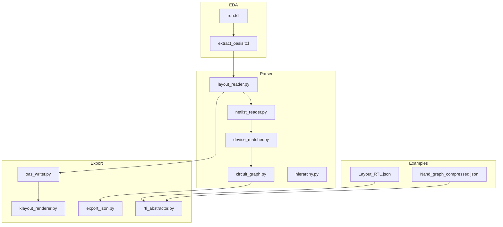
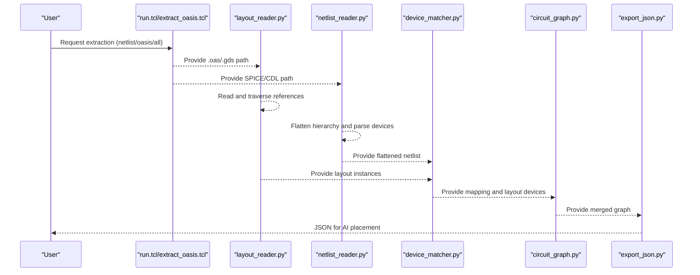
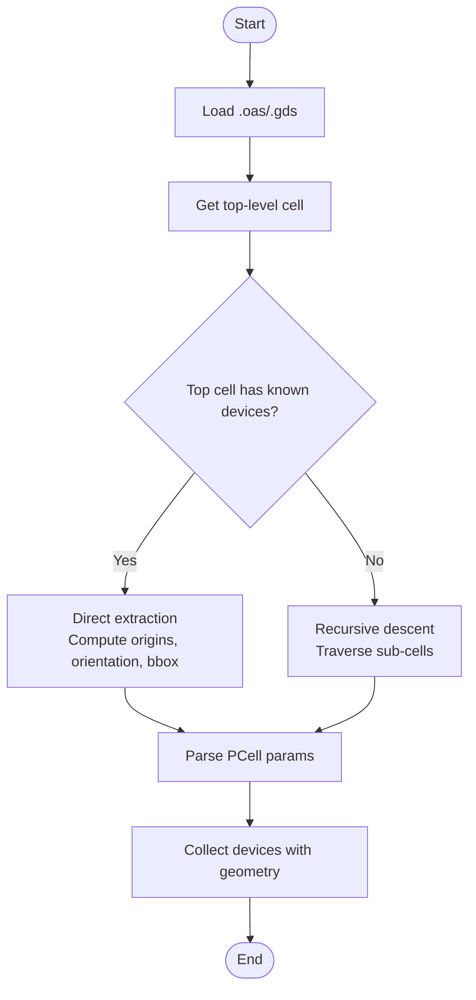
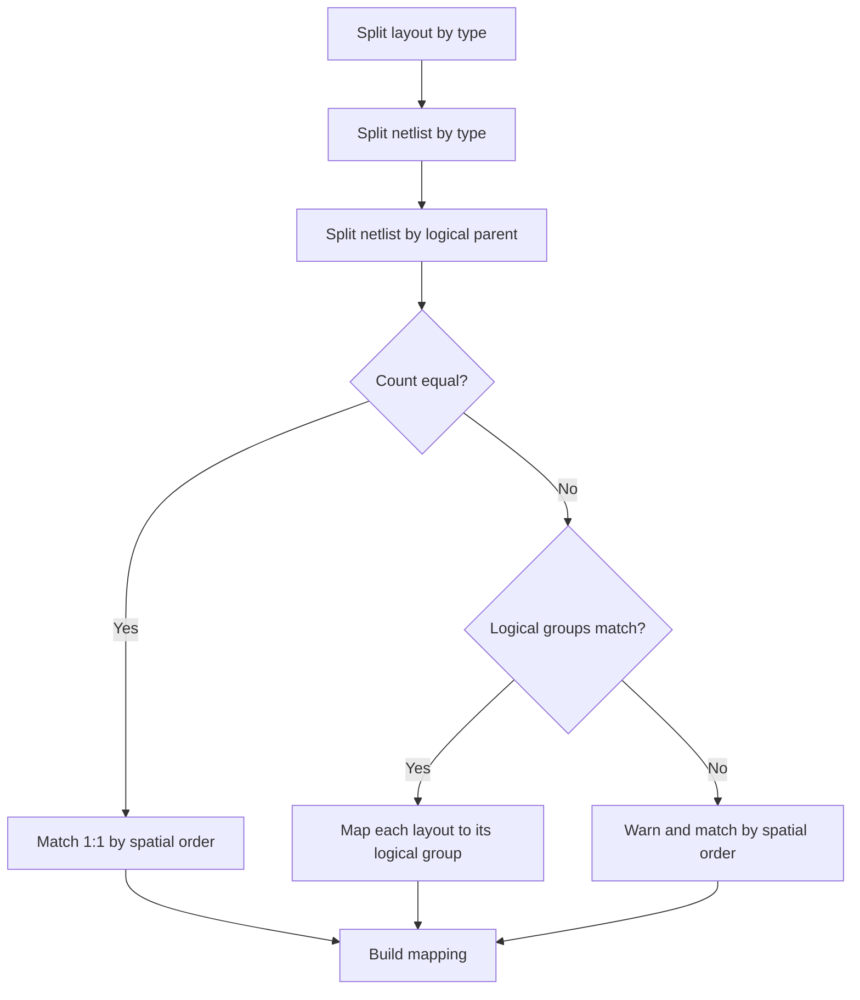
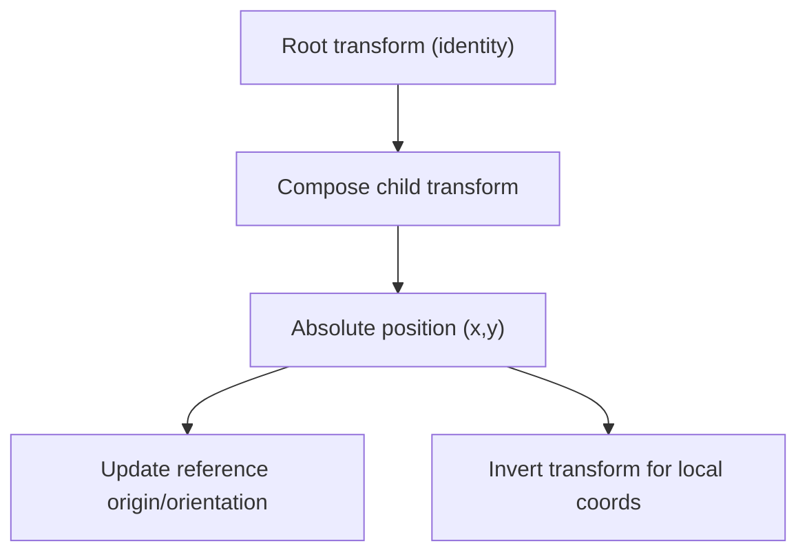
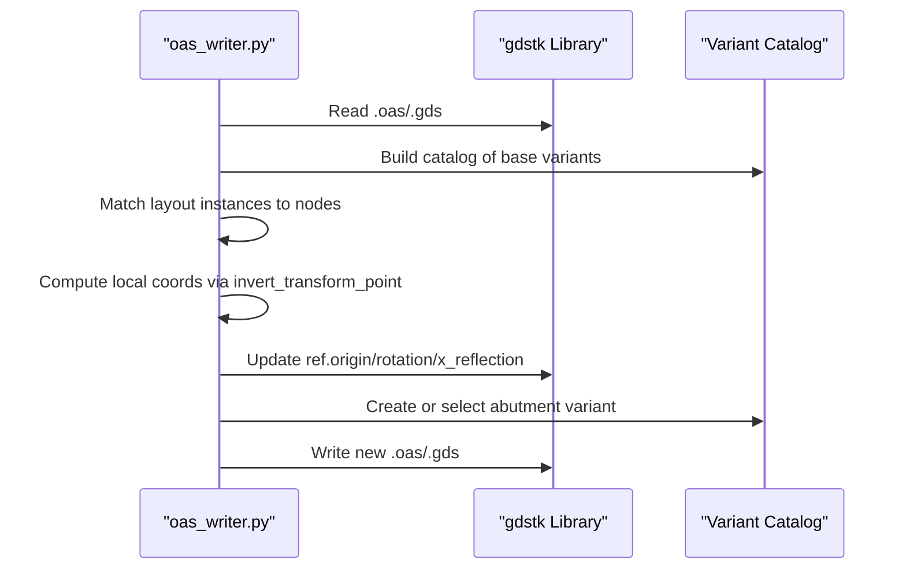
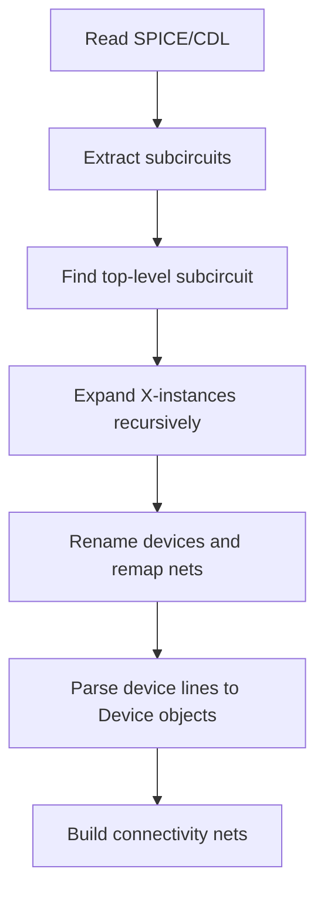
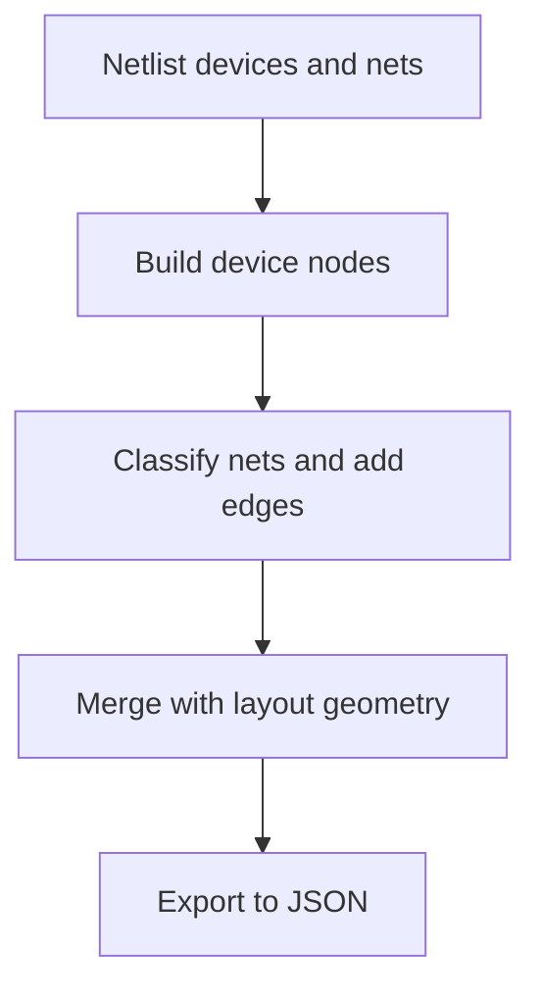
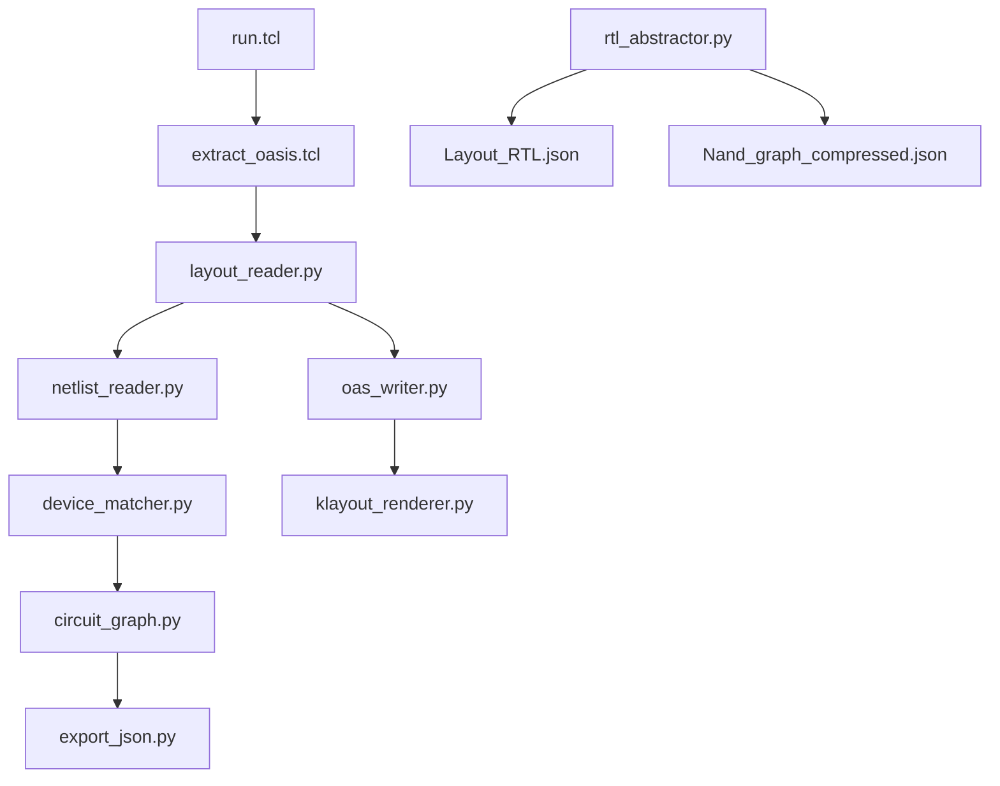

# Layout File Processing

<cite>
**Referenced Files in This Document**
- [layout_reader.py](file://parser/layout_reader.py)
- [device_matcher.py](file://parser/device_matcher.py)
- [oas_writer.py](file://export/oas_writer.py)
- [klayout_renderer.py](file://export/klayout_renderer.py)
- [netlist_reader.py](file://parser/netlist_reader.py)
- [circuit_graph.py](file://parser/circuit_graph.py)
- [export_json.py](file://export/export_json.py)
- [extract_oasis.tcl](file://eda/extract_oasis.tcl)
- [run.tcl](file://eda/run.tcl)
- [hierarchy.py](file://parser/hierarchy.py)
- [rtl_abstractor.py](file://parser/rtl_abstractor.py)
- [Layout_RTL.json](file://examples/Layout_RTL.json)
- [Nand_graph_compressed.json](file://examples/Nand/Nand_graph_compressed.json)
</cite>

## Table of Contents
1. [Introduction](#introduction)
2. [Project Structure](#project-structure)
3. [Core Components](#core-components)
4. [Architecture Overview](#architecture-overview)
5. [Detailed Component Analysis](#detailed-component-analysis)
6. [Dependency Analysis](#dependency-analysis)
7. [Performance Considerations](#performance-considerations)
8. [Troubleshooting Guide](#troubleshooting-guide)
9. [Conclusion](#conclusion)
10. [Appendices](#appendices)

## Introduction
This document describes the layout file processing system that reads OASIS (.oas) and GDS (.gds) layout files to extract device geometries, dimensions, and placement coordinates. It explains how polygon shapes and complex layout features are parsed, how devices are matched to schematic representations, and how coordinate transformations and scaling are handled between layout units and schematic coordinates. It also covers supported layout file formats, geometry extraction patterns, and common compatibility issues.

## Project Structure
The layout processing pipeline spans several modules:
- Parser: layout reading, device matching, netlist parsing, and graph building
- Exporters: OAS writer for updating placements and abutment variants, KLayout renderer for previews
- EDA integration: TCL scripts to automate extraction of OASIS and netlist data
- Examples: JSON artifacts demonstrating RTL-level device geometry and connectivity

**Diagram sources**
- [layout_reader.py](file://parser/layout_reader.py)
- [device_matcher.py](file://parser/device_matcher.py)
- [netlist_reader.py](file://parser/netlist_reader.py)
- [circuit_graph.py](file://parser/circuit_graph.py)
- [export_json.py](file://export/export_json.py)
- [oas_writer.py](file://export/oas_writer.py)
- [klayout_renderer.py](file://export/klayout_renderer.py)
- [extract_oasis.tcl](file://eda/extract_oasis.tcl)
- [run.tcl](file://eda/run.tcl)
- [rtl_abstractor.py](file://parser/rtl_abstractor.py)
- [Layout_RTL.json](file://examples/Layout_RTL.json)
- [Nand_graph_compressed.json](file://examples/Nand/Nand_graph_compressed.json)

**Section sources**
- [layout_reader.py](file://parser/layout_reader.py)
- [device_matcher.py](file://parser/device_matcher.py)
- [netlist_reader.py](file://parser/netlist_reader.py)
- [circuit_graph.py](file://parser/circuit_graph.py)
- [export_json.py](file://export/export_json.py)
- [oas_writer.py](file://export/oas_writer.py)
- [klayout_renderer.py](file://export/klayout_renderer.py)
- [extract_oasis.tcl](file://eda/extract_oasis.tcl)
- [run.tcl](file://eda/run.tcl)
- [rtl_abstractor.py](file://parser/rtl_abstractor.py)
- [Layout_RTL.json](file://examples/Layout_RTL.json)
- [Nand_graph_compressed.json](file://examples/Nand/Nand_graph_compressed.json)

## Core Components
- Layout reader: Loads .oas/.gds via gdstk, detects transistor/resistor/capacitor PCells, computes absolute positions and orientations, and extracts bounding boxes for dimensions.
- Device matcher: Matches netlist devices to layout instances by type and spatial sorting, handling multi-finger and hierarchical expansions.
- Netlist reader: Flattens hierarchical SPICE/CDL netlists, parses device parameters (including m, nf, array indices), and builds connectivity.
- Graph builder: Converts netlist connectivity into a NetworkX graph and merges with layout geometry for downstream AI placement.
- OAS writer: Updates placements and abutment variants in OAS/GDS, writes new libraries, and preserves references.
- KLayout renderer: Renders OAS/GDS previews to images for the symbolic editor.
- EDA TCL: Automates extraction of OASIS and netlist files from Virtuoso/OpenAccess environments.
- RTL abstraction: Produces hierarchical block-level JSON from device-level geometry for AI agents.

**Section sources**
- [layout_reader.py](file://parser/layout_reader.py)
- [device_matcher.py](file://parser/device_matcher.py)
- [netlist_reader.py](file://parser/netlist_reader.py)
- [circuit_graph.py](file://parser/circuit_graph.py)
- [export_json.py](file://export/export_json.py)
- [oas_writer.py](file://export/oas_writer.py)
- [klayout_renderer.py](file://export/klayout_renderer.py)
- [extract_oasis.tcl](file://eda/extract_oasis.tcl)
- [run.tcl](file://eda/run.tcl)
- [rtl_abstractor.py](file://parser/rtl_abstractor.py)

## Architecture Overview
The system follows a staged pipeline:
- Input: OAS/GDS layout and SPICE/CDL netlist
- Stage 1: Layout parsing and geometry extraction
- Stage 2: Netlist flattening and parameter parsing
- Stage 3: Device matching and spatial graph construction
- Stage 4: Export to JSON for AI agents and optional OAS update

**Diagram sources**
- [run.tcl](file://eda/run.tcl)
- [extract_oasis.tcl](file://eda/extract_oasis.tcl)
- [layout_reader.py](file://parser/layout_reader.py)
- [netlist_reader.py](file://parser/netlist_reader.py)
- [device_matcher.py](file://parser/device_matcher.py)
- [circuit_graph.py](file://parser/circuit_graph.py)
- [export_json.py](file://export/export_json.py)

## Detailed Component Analysis

### Layout Reading Workflow
The layout reader supports both flat and hierarchical layouts:
- Flat: top cell directly references PCell instances (transistors and/or passives)
- Hierarchical: sub-cells contain PCell instances; the reader recurses to leaf instances

Key steps:
- Load .oas or .gds using gdstk
- Detect device-like cell names (transistor, resistor, capacitor, via/utility)
- Parse PCell parameters from cell and reference properties
- Compute absolute positions and orientations via transform composition
- Extract bounding boxes for width/height

**Diagram sources**
- [layout_reader.py](file://parser/layout_reader.py)

**Section sources**
- [layout_reader.py](file://parser/layout_reader.py)

### Geometry Parsing and Shape Handling
- Polygon shapes: The reader accesses polygon and path collections from PCell cells to compute bounding boxes for width/height.
- Rectangles and complex features: Bounding boxes are derived from cell-level bounding boxes; clipping logic in the OAS writer demonstrates trimming polygons near abutment boundaries for asymmetric rules.
- Dimensions: Width and height are extracted from bounding boxes; orientation is computed from rotation and mirror flags.

**Section sources**
- [layout_reader.py](file://parser/layout_reader.py)
- [oas_writer.py](file://export/oas_writer.py)

### Device Matching Algorithm
The matcher aligns netlist devices with layout instances:
- Group by device type (nmos, pmos, res, cap)
- Sort layout instances spatially (by x, then y)
- Prefer exact count matches; otherwise collapse expanded multi-finger devices onto shared layout instances
- Log warnings for partial matches

**Diagram sources**
- [device_matcher.py](file://parser/device_matcher.py)

**Section sources**
- [device_matcher.py](file://parser/device_matcher.py)

### Coordinate Transformation and Scaling
- Transform composition: The reader composes affine transforms along the hierarchy to compute absolute positions.
- Inverse transform: Used by the OAS writer to convert global coordinates back into local reference coordinates when updating placements.
- Orientation mapping: String orientations (e.g., R0, MX) are mapped to numeric degrees and mirror flags for gdstk references.

**Diagram sources**
- [layout_reader.py](file://parser/layout_reader.py)
- [oas_writer.py](file://export/oas_writer.py)

**Section sources**
- [layout_reader.py](file://parser/layout_reader.py)
- [oas_writer.py](file://export/oas_writer.py)

### OAS Writer and Abutment Strategy
- Reads original OAS/GDS, rebuilds a clean library, and updates reference origins/orientations.
- Maintains a catalog of abutment variants keyed by base device type and parameter hash.
- Applies clipping rules to trim polygons at abutment boundaries for SAED 14nm asymmetric rules.
- Writes output OAS/GDS with updated references and properties.

**Diagram sources**
- [oas_writer.py](file://export/oas_writer.py)

**Section sources**
- [oas_writer.py](file://export/oas_writer.py)

### Netlist Flattening and Hierarchy Expansion
- Flattens hierarchical SPICE/CDL by expanding X-instances and renaming with hierarchical prefixes.
- Parses device parameters (m, nf, array indices) and constructs connectivity mappings.
- Supports block-aware flattening to track top-level instance membership.

**Diagram sources**
- [netlist_reader.py](file://parser/netlist_reader.py)
- [hierarchy.py](file://parser/hierarchy.py)

**Section sources**
- [netlist_reader.py](file://parser/netlist_reader.py)
- [hierarchy.py](file://parser/hierarchy.py)

### Graph Construction and JSON Export
- Builds a NetworkX graph from netlist connectivity and merges with layout geometry.
- Exports merged graph to JSON for AI placement agents, including device electrical parameters and geometry.

**Diagram sources**
- [circuit_graph.py](file://parser/circuit_graph.py)
- [export_json.py](file://export/export_json.py)

**Section sources**
- [circuit_graph.py](file://parser/circuit_graph.py)
- [export_json.py](file://export/export_json.py)

### Rendering and EDA Integration
- KLayout renderer produces PNG previews for the symbolic editor.
- EDA TCL scripts automate OASIS and netlist extraction from Virtuoso/OpenAccess environments.

**Section sources**
- [klayout_renderer.py](file://export/klayout_renderer.py)
- [extract_oasis.tcl](file://eda/extract_oasis.tcl)
- [run.tcl](file://eda/run.tcl)

### RTL-Level Abstraction
- Converts device-level JSON into hierarchical block-level JSON for AI agents.
- Groups multi-finger devices into rigid blocks and infers topologies (e.g., current mirrors).

**Section sources**
- [rtl_abstractor.py](file://parser/rtl_abstractor.py)
- [Layout_RTL.json](file://examples/Layout_RTL.json)
- [Nand_graph_compressed.json](file://examples/Nand/Nand_graph_compressed.json)

## Dependency Analysis
The following diagram shows key dependencies among modules involved in layout processing:

**Diagram sources**
- [layout_reader.py](file://parser/layout_reader.py)
- [oas_writer.py](file://export/oas_writer.py)
- [netlist_reader.py](file://parser/netlist_reader.py)
- [device_matcher.py](file://parser/device_matcher.py)
- [circuit_graph.py](file://parser/circuit_graph.py)
- [export_json.py](file://export/export_json.py)
- [klayout_renderer.py](file://export/klayout_renderer.py)
- [extract_oasis.tcl](file://eda/extract_oasis.tcl)
- [run.tcl](file://eda/run.tcl)
- [rtl_abstractor.py](file://parser/rtl_abstractor.py)
- [Layout_RTL.json](file://examples/Layout_RTL.json)
- [Nand_graph_compressed.json](file://examples/Nand/Nand_graph_compressed.json)

**Section sources**
- [layout_reader.py](file://parser/layout_reader.py)
- [oas_writer.py](file://export/oas_writer.py)
- [netlist_reader.py](file://parser/netlist_reader.py)
- [device_matcher.py](file://parser/device_matcher.py)
- [circuit_graph.py](file://parser/circuit_graph.py)
- [export_json.py](file://export/export_json.py)
- [klayout_renderer.py](file://export/klayout_renderer.py)
- [extract_oasis.tcl](file://eda/extract_oasis.tcl)
- [run.tcl](file://eda/run.tcl)
- [rtl_abstractor.py](file://parser/rtl_abstractor.py)
- [Layout_RTL.json](file://examples/Layout_RTL.json)
- [Nand_graph_compressed.json](file://examples/Nand/Nand_graph_compressed.json)

## Performance Considerations
- Hierarchical traversal: For deeply nested layouts, recursion depth and transform composition cost can increase; consider iterative traversal if performance becomes critical.
- Bounding box computation: Accessing polygon collections and computing bounding boxes scales with the number of polygons; caching or lazy evaluation may help.
- Matching: Spatial sorting and mapping are O(n log n) dominated; ensure layout and netlist counts are balanced to minimize mismatches.
- OAS writing: Rebuilding a fresh library and copying references is memory-intensive; stream or batch operations if working with very large layouts.

## Troubleshooting Guide
Common issues and resolutions:
- Unsupported layout format: Only .oas and .gds are supported; ensure correct file extensions.
- No top-level cells: The loader requires at least one top-level cell; verify the layout file integrity.
- Non-invertible transforms: Invert operations require non-singular matrices; check for degenerate transforms.
- Orientation mismatches: Verify orientation strings and mapping to radians/mirror flags.
- Abutment variant creation: If manual abutment flags differ, new variants are created; ensure parameter hashes match expected base variants.
- EDA extraction paths: Confirm EDA tool directories and permissions; validate script paths and arguments.

**Section sources**
- [layout_reader.py](file://parser/layout_reader.py)
- [oas_writer.py](file://export/oas_writer.py)
- [extract_oasis.tcl](file://eda/extract_oasis.tcl)
- [run.tcl](file://eda/run.tcl)

## Conclusion
The layout file processing system integrates OASIS/GDS reading, netlist flattening, device matching, and graph construction to enable AI-driven placement and DRC-compliant layout updates. It supports both flat and hierarchical layouts, robustly handles multi-finger devices, and provides mechanisms for coordinate transformation, abutment variants, and rendering previews.

## Appendices

### Supported Layout File Formats
- OASIS (.oas)
- GDS II (.gds)

**Section sources**
- [layout_reader.py](file://parser/layout_reader.py)
- [oas_writer.py](file://export/oas_writer.py)

### Geometry Extraction Patterns
- Transistor PCells: Identified by names containing nfet/pfet/nmos/pmos; bounding boxes provide width/height; PCell parameters include abutment flags.
- Resistor PCells: Identified by names containing rppoly/rnwell/rpoly or res_ prefixes; dimensions derived from bounding boxes.
- Capacitor PCells: Identified by names containing ccap/mimcap/mim/vncap or cap_ prefixes; dimensions derived similarly.
- Via/utility cells: Skipped during device extraction.

**Section sources**
- [layout_reader.py](file://parser/layout_reader.py)

### Coordinate System Conversions
- Absolute positions: Derived by composing parent and child transforms; origin and rotation are applied hierarchically.
- Local-to-root conversion: Invert transform converts global coordinates into a child’s local reference frame.
- Orientation encoding: String forms (e.g., R0, MX) mapped to numeric degrees and mirror flags for gdstk.

**Section sources**
- [layout_reader.py](file://parser/layout_reader.py)
- [oas_writer.py](file://export/oas_writer.py)