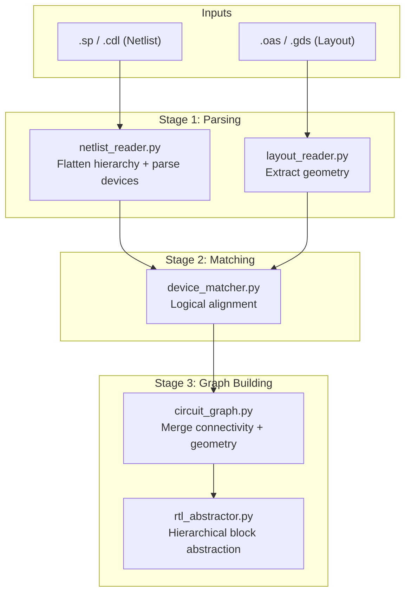
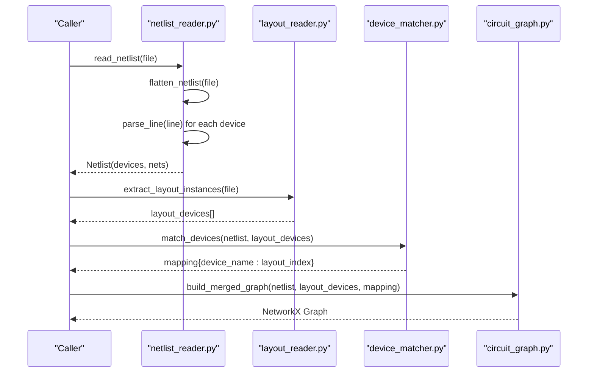
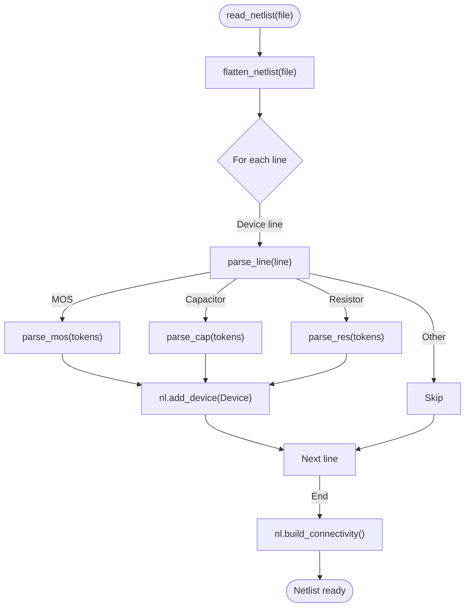
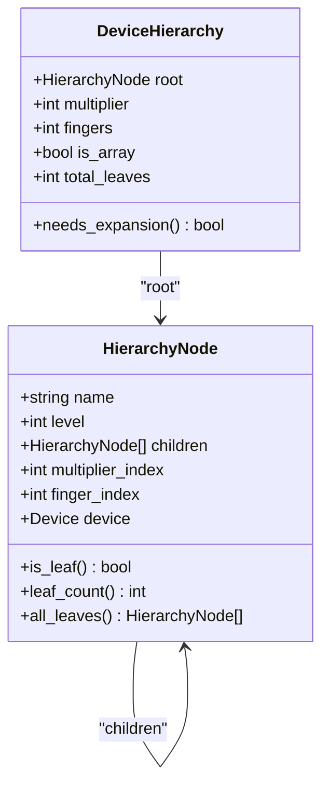
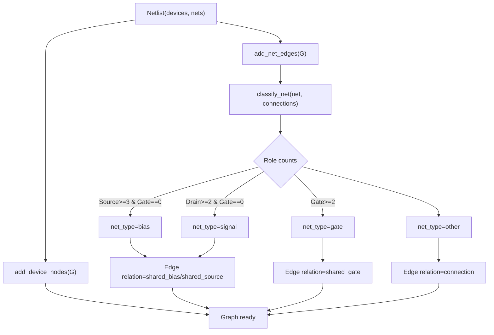
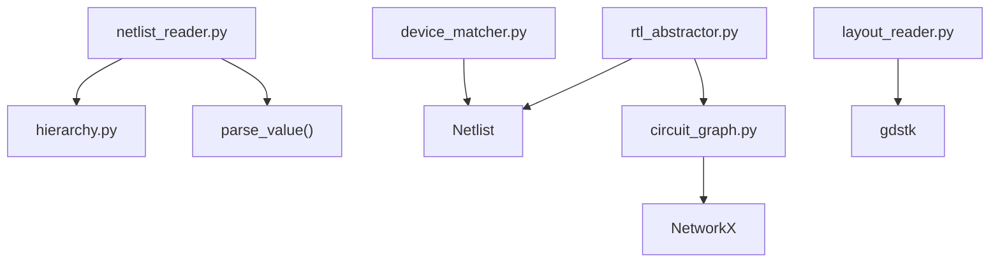

# Netlist Parsing System

<cite>
**Referenced Files in This Document**
- [netlist_reader.py](file://parser/netlist_reader.py)
- [hierarchy.py](file://parser/hierarchy.py)
- [circuit_graph.py](file://parser/circuit_graph.py)
- [device_matcher.py](file://parser/device_matcher.py)
- [layout_reader.py](file://parser/layout_reader.py)
- [rtl_abstractor.py](file://parser/rtl_abstractor.py)
- [run_parser_example.py](file://parser/run_parser_example.py)
- [README.md](file://parser/README.md)
- [Xor_Automation.sp](file://examples/xor/Xor_Automation.sp)
- [Current_Mirror_CM.sp](file://examples/current_mirror/Current_Mirror_CM.sp)
- [RC.sp](file://examples/rc/RC.sp)
- [Miller_OTA.sp](file://examples/Miller_OTA/Miller_OTA.sp)
</cite>

## Table of Contents
1. [Introduction](#introduction)
2. [Project Structure](#project-structure)
3. [Core Components](#core-components)
4. [Architecture Overview](#architecture-overview)
5. [Detailed Component Analysis](#detailed-component-analysis)
6. [Dependency Analysis](#dependency-analysis)
7. [Performance Considerations](#performance-considerations)
8. [Troubleshooting Guide](#troubleshooting-guide)
9. [Conclusion](#conclusion)
10. [Appendices](#appendices)

## Introduction
This document explains the netlist parsing system that processes SPICE/CDL format netlists for analog circuits. It covers the hierarchical flattening of nested subcircuits, device extraction and parameter parsing (including PMOS/NMOS, resistors, capacitors), connectivity mapping into a netlist graph, and the construction of a merged circuit graph that integrates electrical connectivity with layout geometry. It also documents supported syntax patterns, limitations, and practical troubleshooting steps for malformed input files.

## Project Structure
The parser subsystem resides under parser/ and orchestrates four stages:
- Hierarchical flattening and device parsing
- Layout geometry extraction
- Logical device matching
- Merged circuit graph construction

**Diagram sources**
- [README.md:9-40](file://parser/README.md#L9-L40)

**Section sources**
- [README.md:1-48](file://parser/README.md#L1-L48)

## Core Components
- Netlist reader: Flattens hierarchical SPICE/CDL netlists, parses leaf devices (MOS, R, C), and builds connectivity.
- Hierarchy manager: Supports array suffixes, multipliers (m), and fingers (nf) with robust reconstruction and expansion.
- Circuit graph builder: Translates netlist connectivity into a NetworkX graph and merges with layout geometry.
- Device matcher: Aligns netlist devices to layout instances with deterministic fallbacks.
- Layout reader: Extracts device instances from OAS/GDS with hierarchical traversal and parameter parsing.
- RTL abstractor: Produces a hierarchical block schema suitable for AI/GUI interaction.

**Section sources**
- [netlist_reader.py:51-101](file://parser/netlist_reader.py#L51-L101)
- [hierarchy.py:133-310](file://parser/hierarchy.py#L133-L310)
- [circuit_graph.py:18-191](file://parser/circuit_graph.py#L18-L191)
- [device_matcher.py:85-151](file://parser/device_matcher.py#L85-L151)
- [layout_reader.py:357-442](file://parser/layout_reader.py#L357-L442)
- [rtl_abstractor.py:18-274](file://parser/rtl_abstractor.py#L18-L274)

## Architecture Overview
The system follows a 4-stage pipeline:
1. Flatten and parse netlist
2. Extract layout geometry
3. Match devices
4. Build merged circuit graph

**Diagram sources**
- [run_parser_example.py:13-62](file://parser/run_parser_example.py#L13-L62)
- [netlist_reader.py:726-797](file://parser/netlist_reader.py#L726-L797)
- [layout_reader.py:357-442](file://parser/layout_reader.py#L357-L442)
- [device_matcher.py:85-151](file://parser/device_matcher.py#L85-L151)
- [circuit_graph.py:142-191](file://parser/circuit_graph.py#L142-L191)

## Detailed Component Analysis

### Netlist Reader: Device Extraction and Connectivity
- Device models:
  - Device: stores name, type, pin-to-net mapping, and parameters.
  - Netlist: holds devices and a reverse mapping from nets to connected (device, pin) tuples.
- Value parsing: Converts SPICE numeric suffixes (f, p, n, u, m, k, meg, g) to floats.
- Hierarchical flattening:
  - Extracts .subckt/.ends blocks and identifies the top-level subcircuit.
  - Expands X-instances recursively, remapping ports and internal nets with hierarchical prefixes.
  - Supports block-aware flattening to track which top-level instance and subcircuit each leaf device belongs to.
- Device parsers:
  - NMOS/PMOS: parses model prefix to infer type, collects parameters (e.g., l, w, nf, m, nfin), and supports array suffixes.
  - Capacitors: accepts both simple and CDL-style formats with cval and geometric parameters.
  - Resistors: accepts both simple and CDL-style formats with geometric parameters.
- Dispatch: parse_line detects device type by token count and model signature.

**Diagram sources**
- [netlist_reader.py:726-761](file://parser/netlist_reader.py#L726-L761)
- [netlist_reader.py:700-720](file://parser/netlist_reader.py#L700-L720)
- [netlist_reader.py:478-620](file://parser/netlist_reader.py#L478-L620)
- [netlist_reader.py:623-692](file://parser/netlist_reader.py#L623-L692)
- [netlist_reader.py:623-692](file://parser/netlist_reader.py#L623-L692)

**Section sources**
- [netlist_reader.py:13-72](file://parser/netlist_reader.py#L13-L72)
- [netlist_reader.py:74-101](file://parser/netlist_reader.py#L74-L101)
- [netlist_reader.py:121-149](file://parser/netlist_reader.py#L121-L149)
- [netlist_reader.py:152-221](file://parser/netlist_reader.py#L152-L221)
- [netlist_reader.py:224-257](file://parser/netlist_reader.py#L224-L257)
- [netlist_reader.py:260-318](file://parser/netlist_reader.py#L260-L318)
- [netlist_reader.py:325-394](file://parser/netlist_reader.py#L325-L394)
- [netlist_reader.py:397-457](file://parser/netlist_reader.py#L397-L457)
- [netlist_reader.py:478-620](file://parser/netlist_reader.py#L478-L620)
- [netlist_reader.py:623-692](file://parser/netlist_reader.py#L623-L692)
- [netlist_reader.py:700-720](file://parser/netlist_reader.py#L700-L720)
- [netlist_reader.py:726-797](file://parser/netlist_reader.py#L726-L797)

### Hierarchy Manager: Array, Multiplier, and Fingers
- Array suffix parsing: Extracts 0-based indices from names like MM9<7>.
- Hierarchy nodes: Tree nodes with levels for parent, multiplier/array children, and finger grandchildren.
- Device hierarchy builder: Reconstructs logical parents from expanded children, infers effective m-level counts, recovers nf, and attaches leaf Device objects.
- Expansion: Generates leaf Device objects with normalized parameters and parent pointers.

**Diagram sources**
- [hierarchy.py:133-177](file://parser/hierarchy.py#L133-L177)
- [hierarchy.py:183-217](file://parser/hierarchy.py#L183-L217)

**Section sources**
- [hierarchy.py:44-74](file://parser/hierarchy.py#L44-L74)
- [hierarchy.py:133-177](file://parser/hierarchy.py#L133-L177)
- [hierarchy.py:219-310](file://parser/hierarchy.py#L219-L310)
- [hierarchy.py:316-418](file://parser/hierarchy.py#L316-L418)
- [hierarchy.py:434-475](file://parser/hierarchy.py#L434-L475)

### Circuit Graph Builder: Connectivity and Geometry
- Adds device nodes with type, width, length, and nf.
- Classifies nets by the roles of connected devices (bias, signal, gate).
- Builds edges between devices based on shared nets and pin roles, labeling edges accordingly.
- Merges electrical graph with layout geometry to produce a unified NetworkX graph.

**Diagram sources**
- [circuit_graph.py:18-128](file://parser/circuit_graph.py#L18-L128)
- [circuit_graph.py:131-139](file://parser/circuit_graph.py#L131-L139)
- [circuit_graph.py:142-191](file://parser/circuit_graph.py#L142-L191)

**Section sources**
- [circuit_graph.py:9-16](file://parser/circuit_graph.py#L9-L16)
- [circuit_graph.py:36-59](file://parser/circuit_graph.py#L36-L59)
- [circuit_graph.py:68-128](file://parser/circuit_graph.py#L68-L128)
- [circuit_graph.py:131-191](file://parser/circuit_graph.py#L131-L191)

### Device Matcher: Logical Alignment
- Groups layout and netlist devices by type (nmos, pmos, res, cap).
- Sorts names naturally to ensure deterministic matching.
- Matches by exact count, then by collapsing expanded logical devices onto shared layout instances, with warnings for mismatches.
- Produces a mapping from device names to layout indices.

**Section sources**
- [device_matcher.py:25-56](file://parser/device_matcher.py#L25-L56)
- [device_matcher.py:59-77](file://parser/device_matcher.py#L59-L77)
- [device_matcher.py:85-151](file://parser/device_matcher.py#L85-L151)

### Layout Reader: Geometry Extraction
- Supports flat and hierarchical layouts.
- Traverses references recursively, computing absolute positions and orientations.
- Parses PCell parameters from GDS/OAS to extract device geometry and behavioral flags (e.g., abutment).
- Tags passives and transistors distinctly and preserves hierarchical prefixes.

**Section sources**
- [layout_reader.py:14-42](file://parser/layout_reader.py#L14-L42)
- [layout_reader.py:44-83](file://parser/layout_reader.py#L44-L83)
- [layout_reader.py:86-136](file://parser/layout_reader.py#L86-L136)
- [layout_reader.py:153-229](file://parser/layout_reader.py#L153-L229)
- [layout_reader.py:232-242](file://parser/layout_reader.py#L232-L242)
- [layout_reader.py:244-354](file://parser/layout_reader.py#L244-L354)
- [layout_reader.py:357-442](file://parser/layout_reader.py#L357-L442)

### RTL Abstractor: Hierarchical Block Schema
- Aggregates finger-level nodes into parent devices and computes bounding boxes.
- Infers terminal nets per parent device and builds relative offsets for fingers.
- Detects common topologies (e.g., current mirrors) and groups members into locked, rigid blocks.
- Outputs a hierarchical JSON with blocks, free-floating devices, and topology metadata.

**Section sources**
- [rtl_abstractor.py:18-274](file://parser/rtl_abstractor.py#L18-L274)

## Dependency Analysis
- netlist_reader.py depends on hierarchy.py for array suffix parsing and on built-in utilities for value parsing.
- circuit_graph.py depends on NetworkX and operates purely on Netlist structures.
- device_matcher.py depends on natural sorting and grouping utilities.
- layout_reader.py depends on gdstk for geometry extraction.
- rtl_abstractor.py consumes the output of earlier stages to produce hierarchical blocks.

**Diagram sources**
- [netlist_reader.py:466-471](file://parser/netlist_reader.py#L466-L471)
- [circuit_graph.py:7](file://parser/circuit_graph.py#L7)
- [layout_reader.py:10](file://parser/layout_reader.py#L10)
- [rtl_abstractor.py:13](file://parser/rtl_abstractor.py#L13)

**Section sources**
- [netlist_reader.py:466-471](file://parser/netlist_reader.py#L466-L471)
- [circuit_graph.py:7](file://parser/circuit_graph.py#L7)
- [layout_reader.py:10](file://parser/layout_reader.py#L10)
- [rtl_abstractor.py:13](file://parser/rtl_abstractor.py#L13)

## Performance Considerations
- Hierarchical flattening: Recursive expansion of X-instances scales with the depth of hierarchy and the number of internal devices. Prefer compact subcircuit definitions to reduce expansion overhead.
- Device parsing: Tokenization and parameter scanning are linear in the number of tokens per device line. Large nf or m values increase the number of generated leaf devices.
- Graph building: Edge creation is quadratic in the number of connections per net. Supply nets are pruned to reduce density.
- Matching: Sorting and grouping are O(N log N) per type; mismatches trigger warnings and partial matching.

[No sources needed since this section provides general guidance]

## Troubleshooting Guide
Common issues and resolutions:
- Unknown subcircuit in X-instance: The flattener warns and skips the instance. Verify the subcircuit name exists in .subckt/.ends blocks.
- Malformed device lines: Lines with insufficient tokens or unexpected formats are skipped. Ensure SPICE syntax conforms to supported patterns (e.g., MOS model starts with n/p).
- Non-integer m or nf: Values are rounded to integers; verify parameter correctness to avoid unexpected expansions.
- Missing .ends: Ensure every .subckt has a matching .ends; otherwise, the subcircuit body may not be captured.
- Supply nets flooding edges: Bias and signal nets are classified heuristically; very dense nets may still produce many edges. Consider filtering or block abstraction.
- Layout format unsupported: Only .gds and .oas are supported; ensure the layout file extension is correct.
- Count mismatches: When the number of netlist devices does not match layout instances, the matcher collapses expanded logical devices and logs warnings. Adjust netlist or layout accordingly.

**Section sources**
- [netlist_reader.py:163-167](file://parser/netlist_reader.py#L163-L167)
- [netlist_reader.py:700-720](file://parser/netlist_reader.py#L700-L720)
- [hierarchy.py:116-126](file://parser/hierarchy.py#L116-L126)
- [circuit_graph.py:65-77](file://parser/circuit_graph.py#L65-L77)
- [layout_reader.py:363-368](file://parser/layout_reader.py#L363-L368)
- [device_matcher.py:117-136](file://parser/device_matcher.py#L117-L136)

## Conclusion
The netlist parsing system provides a robust pipeline for transforming SPICE/CDL netlists into structured connectivity and geometry-aware graphs. It supports hierarchical flattening, comprehensive device parsing (NMOS/PMOS, R, C), and advanced hierarchy modeling with arrays, multipliers, and fingers. The resulting merged graph enables downstream AI agents to reason about layout automation tasks effectively.

[No sources needed since this section summarizes without analyzing specific files]

## Appendices

### Supported SPICE Syntax Patterns
- NMOS/PMOS:
  - Model prefix determines type; parameters include l, w, nf, m, nfin, and others.
  - Example patterns: [Xor_Automation.sp:16-28](file://examples/xor/Xor_Automation.sp#L16-L28), [Miller_OTA.sp:16-26](file://examples/Miller_OTA/Miller_OTA.sp#L16-L26)
- Capacitors:
  - Simple: Cname n+ n- value
  - CDL: Cname n+ n- model cval=X w=X l=X nf=X ...
  - Example: [RC.sp:17](file://examples/rc/RC.sp#L17)
- Resistors:
  - Simple: Rname n+ n- value
  - CDL: Rname n+ n- model w=X l=X m=X ...
  - Example: [RC.sp:16](file://examples/rc/RC.sp#L16)
- Hierarchical subcircuits:
  - .subckt ... .ends blocks with X-instance instantiation.
  - Example: [Xor_Automation.sp:14-28](file://examples/xor/Xor_Automation.sp#L14-L28), [Miller_OTA.sp:14-26](file://examples/Miller_OTA/Miller_OTA.sp#L14-L26)

**Section sources**
- [netlist_reader.py:478-620](file://parser/netlist_reader.py#L478-L620)
- [netlist_reader.py:623-692](file://parser/netlist_reader.py#L623-L692)
- [netlist_reader.py:121-149](file://parser/netlist_reader.py#L121-L149)
- [Xor_Automation.sp:14-28](file://examples/xor/Xor_Automation.sp#L14-L28)
- [Miller_OTA.sp:14-26](file://examples/Miller_OTA/Miller_OTA.sp#L14-L26)
- [RC.sp:16-17](file://examples/rc/RC.sp#L16-L17)

### Example Workflows
- End-to-end pipeline walkthrough:
  - Read netlist, extract layout, match devices, build merged graph.
  - See: [run_parser_example.py:13-62](file://parser/run_parser_example.py#L13-L62)

**Section sources**
- [run_parser_example.py:13-62](file://parser/run_parser_example.py#L13-L62)