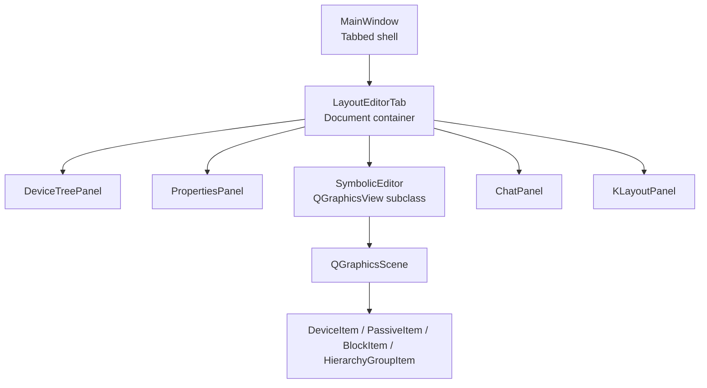
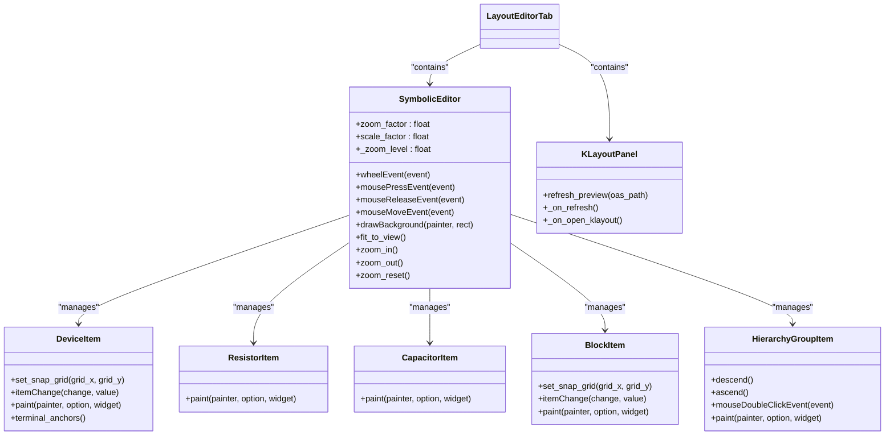
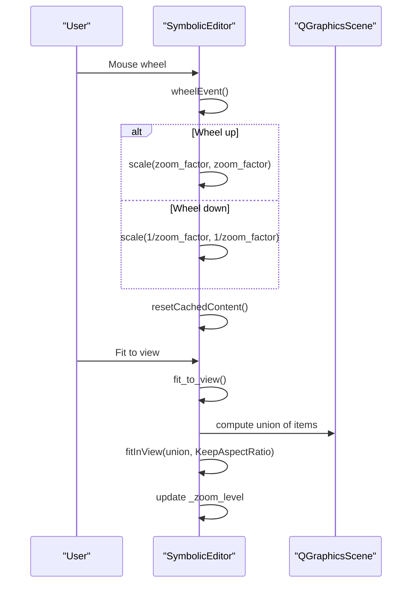
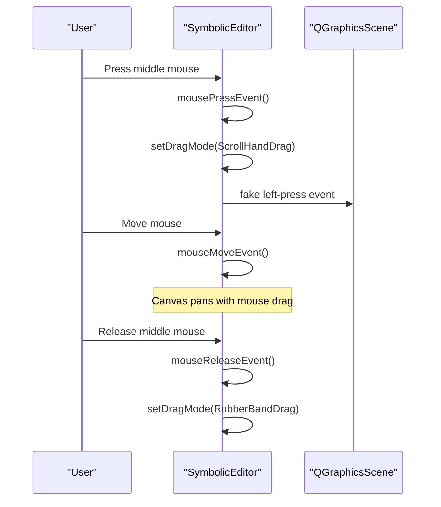
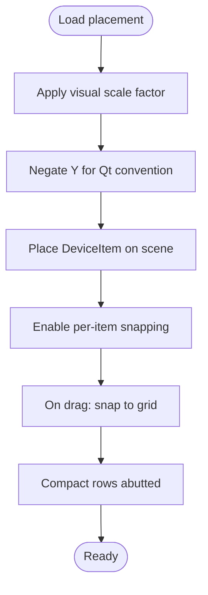
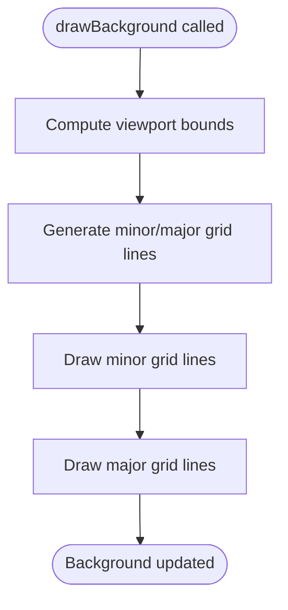
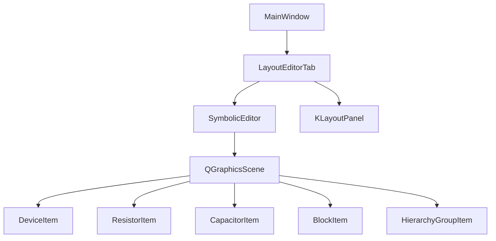

# Canvas Navigation and View Controls

<cite>
**Referenced Files in This Document**
- [editor_view.py](file://symbolic_editor/editor_view.py)
- [device_item.py](file://symbolic_editor/device_item.py)
- [passive_item.py](file://symbolic_editor/passive_item.py)
- [block_item.py](file://symbolic_editor/block_item.py)
- [hierarchy_group_item.py](file://symbolic_editor/hierarchy_group_item.py)
- [klayout_panel.py](file://symbolic_editor/klayout_panel.py)
- [main.py](file://symbolic_editor/main.py)
- [layout_tab.py](file://symbolic_editor/layout_tab.py)
- [view_toggle.py](file://symbolic_editor/view_toggle.py)
- [properties_panel.py](file://symbolic_editor/properties_panel.py)
- [chat_panel.py](file://symbolic_editor/chat_panel.py)
</cite>

## Table of Contents
1. [Introduction](#introduction)
2. [Project Structure](#project-structure)
3. [Core Components](#core-components)
4. [Architecture Overview](#architecture-overview)
5. [Detailed Component Analysis](#detailed-component-analysis)
6. [Dependency Analysis](#dependency-analysis)
7. [Performance Considerations](#performance-considerations)
8. [Troubleshooting Guide](#troubleshooting-guide)
9. [Conclusion](#conclusion)

## Introduction
This document explains the canvas navigation and view control systems used in the symbolic editor. It covers zoom functionality with configurable zoom factors, pan operations via middle mouse button, viewport management, coordinate transformations between scene and device positions, the grid rendering system, viewport scrolling behavior, cache mode optimization, and rendering performance considerations. Practical navigation workflows, keyboard shortcuts, and troubleshooting common issues are also included.

## Project Structure
The symbolic editor is organized as a tabbed application where each tab hosts an independent editor canvas, device tree, properties panel, chat panel, and optional KLayout preview. The canvas is implemented as a custom QGraphicsView subclass with specialized grid rendering, caching, and interaction behaviors.

**Diagram sources**
- [main.py:80-148](file://symbolic_editor/main.py#L80-L148)
- [layout_tab.py:64-200](file://symbolic_editor/layout_tab.py#L64-L200)
- [editor_view.py:81-120](file://symbolic_editor/editor_view.py#L81-L120)

**Section sources**
- [main.py:80-148](file://symbolic_editor/main.py#L80-L148)
- [layout_tab.py:64-200](file://symbolic_editor/layout_tab.py#L64-L200)

## Core Components
- SymbolicEditor: Custom QGraphicsView implementing zoom, pan, grid rendering, caching, and device interaction.
- DeviceItem, ResistorItem, CapacitorItem: Visual items representing devices with snapping, selection, and painting logic.
- BlockItem: Hierarchical grouping item for symbol view with block overlays.
- HierarchyGroupItem: Visual wrapper for arrays/multipliers/fingers with descent/ascend behavior.
- KLayoutPanel: KLayout preview panel with scrollbars and refresh/open actions.
- LayoutEditorTab: Document container integrating editor, panels, and workspace modes.
- MainWindow: Application shell managing menus, toolbars, and keyboard shortcuts.

**Section sources**
- [editor_view.py:81-120](file://symbolic_editor/editor_view.py#L81-L120)
- [device_item.py:17-50](file://symbolic_editor/device_item.py#L17-L50)
- [passive_item.py:24-60](file://symbolic_editor/passive_item.py#L24-L60)
- [block_item.py:11-50](file://symbolic_editor/block_item.py#L11-L50)
- [hierarchy_group_item.py:28-90](file://symbolic_editor/hierarchy_group_item.py#L28-L90)
- [klayout_panel.py:30-90](file://symbolic_editor/klayout_panel.py#L30-L90)
- [layout_tab.py:64-120](file://symbolic_editor/layout_tab.py#L64-L120)
- [main.py:80-120](file://symbolic_editor/main.py#L80-L120)

## Architecture Overview
The canvas integrates Qt’s graphics framework with custom rendering and interaction logic. Zoom and pan are handled through QGraphicsView transforms, while grid rendering is implemented in the canvas background. Caching is enabled to optimize grid drawing. Device items implement snapping and selection behaviors, and the scene manages selection rules and hierarchy-aware visibility.

**Diagram sources**
- [editor_view.py:81-200](file://symbolic_editor/editor_view.py#L81-L200)
- [device_item.py:17-120](file://symbolic_editor/device_item.py#L17-L120)
- [passive_item.py:134-227](file://symbolic_editor/passive_item.py#L134-L227)
- [block_item.py:11-75](file://symbolic_editor/block_item.py#L11-L75)
- [hierarchy_group_item.py:28-120](file://symbolic_editor/hierarchy_group_item.py#L28-L120)
- [klayout_panel.py:30-120](file://symbolic_editor/klayout_panel.py#L30-L120)
- [layout_tab.py:64-120](file://symbolic_editor/layout_tab.py#L64-L120)

## Detailed Component Analysis

### Zoom Functionality and Viewport Management
- Zoom factors and levels:
  - Configurable zoom factor determines per-wheel zoom increment.
  - Zoom level is tracked from the current transform matrix.
- Zoom controls:
  - Mouse wheel zooms in/out using the configured factor.
  - Explicit zoom methods adjust the transform and reset cached content.
  - Fit-to-view computes a union of device and group bounding boxes and scales to fit with margins.
- Viewport management:
  - Scrollbars are disabled to rely on pan and fit-to-view.
  - Cache mode is enabled to improve grid rendering performance.

**Diagram sources**
- [editor_view.py:1879-1895](file://symbolic_editor/editor_view.py#L1879-L1895)
- [editor_view.py:1547-1571](file://symbolic_editor/editor_view.py#L1547-L1571)

**Section sources**
- [editor_view.py:109-113](file://symbolic_editor/editor_view.py#L109-L113)
- [editor_view.py:1879-1895](file://symbolic_editor/editor_view.py#L1879-L1895)
- [editor_view.py:1547-1571](file://symbolic_editor/editor_view.py#L1547-L1571)

### Pan Operations with Middle Mouse Button
- Pan is enabled by switching to hand drag mode on middle mouse press and reverting to rubber-band selection on release.
- Focus policy is set to ensure keyboard and mouse interactions work consistently.

**Diagram sources**
- [editor_view.py:1905-1931](file://symbolic_editor/editor_view.py#L1905-L1931)

**Section sources**
- [editor_view.py:104-107](file://symbolic_editor/editor_view.py#L104-L107)
- [editor_view.py:1905-1931](file://symbolic_editor/editor_view.py#L1905-L1931)

### Coordinate System Transformation and Snapping
- Layout JSON uses a mathematical coordinate system where Y increases upward. The canvas converts to Qt’s screen coordinate system where Y increases downward by negating Y during placement.
- Visual scaling factor maps logical units to scene pixels.
- Snapping:
  - Grid size defines minor grid spacing.
  - Row pitch defines vertical spacing between rows.
  - Per-item snapping aligns movements to grid increments.
  - Free-space finding algorithm locates the nearest available slot on a row without overlapping others.

**Diagram sources**
- [editor_view.py:365-454](file://symbolic_editor/editor_view.py#L365-L454)
- [device_item.py:86-104](file://symbolic_editor/device_item.py#L86-L104)

**Section sources**
- [editor_view.py:365-454](file://symbolic_editor/editor_view.py#L365-L454)
- [device_item.py:86-104](file://symbolic_editor/device_item.py#L86-L104)
- [editor_view.py:1085-1114](file://symbolic_editor/editor_view.py#L1085-L1114)

### Grid Rendering System
- Major and minor grid lines are drawn based on the current viewport rectangle.
- Minor grid lines are drawn every grid unit; major grid lines are drawn every fifth grid unit.
- Colors differentiate major and minor lines for improved readability.

**Diagram sources**
- [editor_view.py:1839-1875](file://symbolic_editor/editor_view.py#L1839-L1875)

**Section sources**
- [editor_view.py:139-144](file://symbolic_editor/editor_view.py#L139-L144)
- [editor_view.py:1839-1875](file://symbolic_editor/editor_view.py#L1839-L1875)

### Viewport Scrolling Behavior and Cache Mode
- Scrollbars are disabled to encourage pan/zoom navigation.
- Cache mode is enabled to cache the background (including grid), reducing redraw cost during zoom/pan.
- resetCachedContent is invoked after zoom/pan and major scene changes to keep visuals consistent.

**Section sources**
- [editor_view.py:182-190](file://symbolic_editor/editor_view.py#L182-L190)
- [editor_view.py:98-99](file://symbolic_editor/editor_view.py#L98-L99)
- [editor_view.py:1885-1895](file://symbolic_editor/editor_view.py#L1885-L1895)

### Keyboard Shortcuts for Navigation
- Fit to view: View menu and toolbar actions trigger fit_to_view.
- Zoom in/out/reset: View menu and toolbar actions call zoom_in, zoom_out, zoom_reset.
- Toggle device tree, chat panel, and KLayout preview: View menu actions.
- Toggle dummy placement mode: D key or toolbar action.
- Toggle abutment analysis: Toolbar action.
- Workspace mode switching: Ctrl+1, Ctrl+2, Ctrl+3 keys.

**Section sources**
- [main.py:329-346](file://symbolic_editor/main.py#L329-L346)
- [main.py:446-464](file://symbolic_editor/main.py#L446-L464)
- [main.py:642-658](file://symbolic_editor/main.py#L642-L658)
- [view_toggle.py:122-129](file://symbolic_editor/view_toggle.py#L122-L129)

### Practical Navigation Workflows
- Zoom and pan:
  - Use mouse wheel to zoom in/out; use middle mouse drag to pan; use fit-to-view to center the layout.
- Select and move devices:
  - Select devices; drag to move; snapping keeps devices aligned to grid.
- Switch views:
  - Toggle between symbolic and transistor view; switch workspace modes (symbolic, KLayout, both).
- Analyze connections:
  - Select a device to highlight net connections; use abutment analysis to visualize shared terminals.

**Section sources**
- [editor_view.py:1547-1571](file://symbolic_editor/editor_view.py#L1547-L1571)
- [editor_view.py:1582-1610](file://symbolic_editor/editor_view.py#L1582-L1610)
- [layout_tab.py:64-120](file://symbolic_editor/layout_tab.py#L64-L120)
- [main.py:329-346](file://symbolic_editor/main.py#L329-L346)

## Dependency Analysis
The canvas components depend on Qt’s graphics framework and each other through the scene. The editor depends on device items for rendering and interaction, and on hierarchy/block items for structural overlays. The KLayout panel is independent but integrated into the tabbed workspace.

**Diagram sources**
- [editor_view.py:81-120](file://symbolic_editor/editor_view.py#L81-L120)
- [layout_tab.py:64-120](file://symbolic_editor/layout_tab.py#L64-L120)
- [main.py:80-120](file://symbolic_editor/main.py#L80-L120)

**Section sources**
- [editor_view.py:81-120](file://symbolic_editor/editor_view.py#L81-L120)
- [layout_tab.py:64-120](file://symbolic_editor/layout_tab.py#L64-L120)
- [main.py:80-120](file://symbolic_editor/main.py#L80-L120)

## Performance Considerations
- Caching: Background caching reduces redraw overhead for grid rendering.
- Snapping: Per-item snapping minimizes floating positions and improves visual consistency.
- Compact packing: Edge-to-edge compaction reduces wasted space and improves layout density.
- Scroll areas: KLayout preview uses scroll areas to handle large images efficiently.
- Selection and changed signals: Scene signals trigger targeted updates to keep the UI responsive.

[No sources needed since this section provides general guidance]

## Troubleshooting Guide
- Grid not visible:
  - Ensure drawBackground is invoked and grid colors are set.
- Panning not working:
  - Verify middle mouse press/release events switch drag modes and focus is set.
- Zoom feels sluggish:
  - Confirm cache mode is enabled and resetCachedContent is called after major changes.
- Devices not snapping:
  - Check per-item snapping is enabled and grid values are set appropriately.
- Fit-to-view not centered:
  - Ensure union calculation includes all visible items and margins are applied.

**Section sources**
- [editor_view.py:1839-1875](file://symbolic_editor/editor_view.py#L1839-L1875)
- [editor_view.py:1905-1931](file://symbolic_editor/editor_view.py#L1905-L1931)
- [editor_view.py:98-99](file://symbolic_editor/editor_view.py#L98-L99)
- [device_item.py:86-104](file://symbolic_editor/device_item.py#L86-L104)
- [editor_view.py:1547-1571](file://symbolic_editor/editor_view.py#L1547-L1571)

## Conclusion
The canvas navigation and view control system combines Qt’s graphics framework with custom logic to deliver smooth zoom, pan, and grid rendering. Configurable zoom factors, middle mouse pan, and caching provide responsive interaction. Coordinate transformations and snapping ensure precise device placement, while the grid system enhances readability. The workspace modes and integrated panels support efficient layout editing and preview workflows.