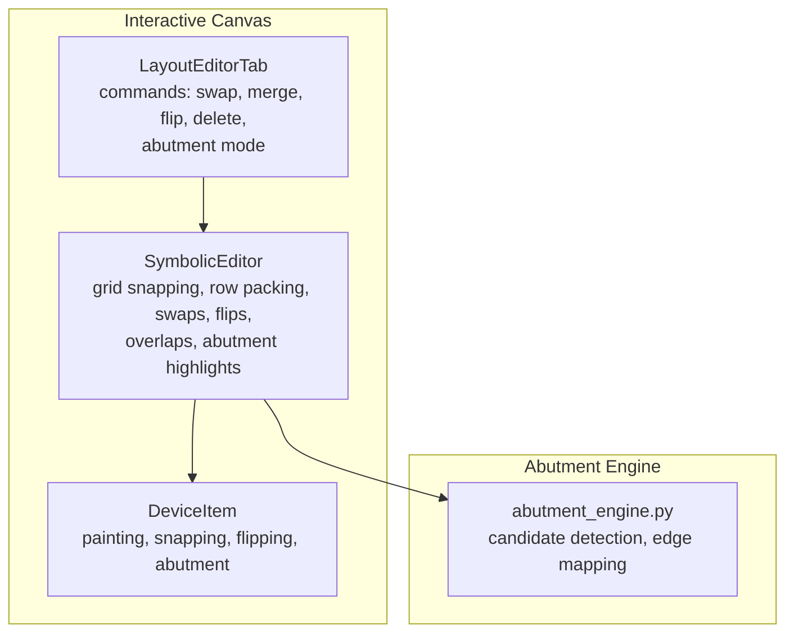
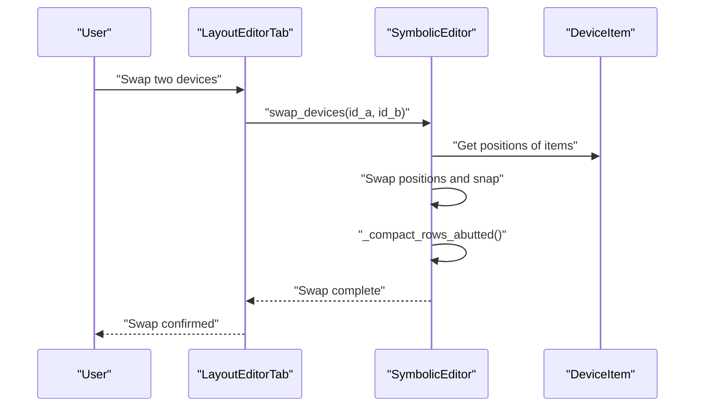
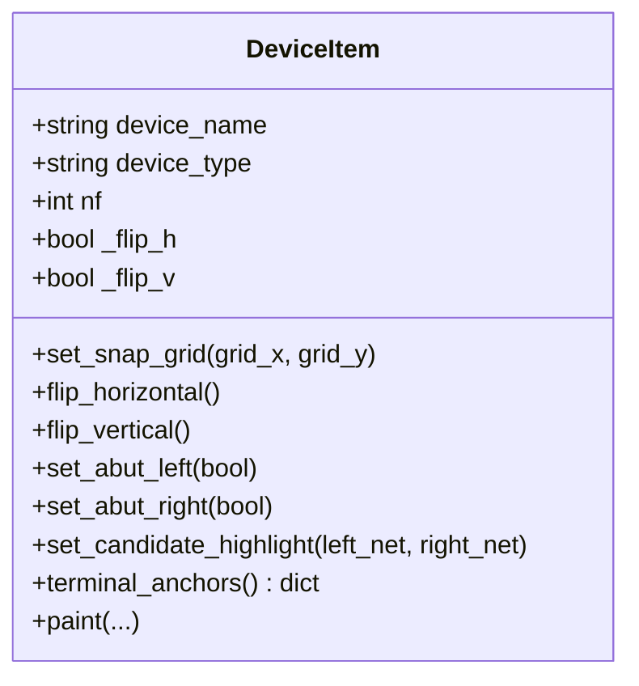
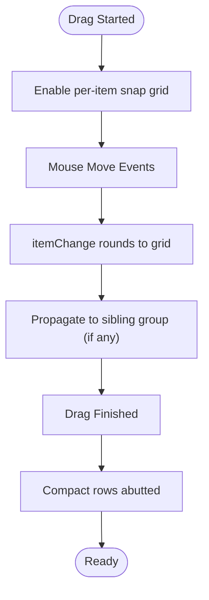
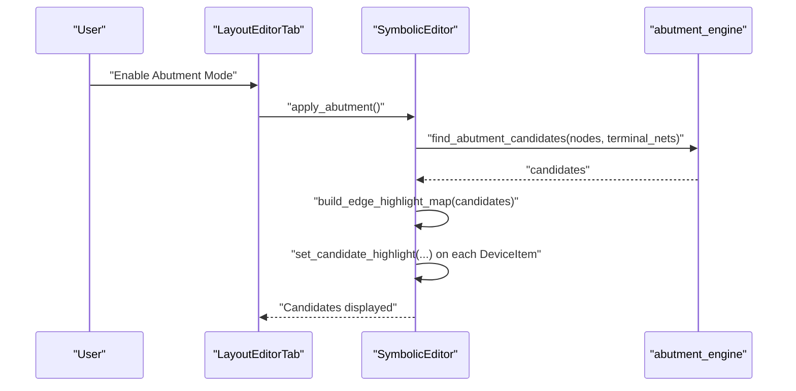
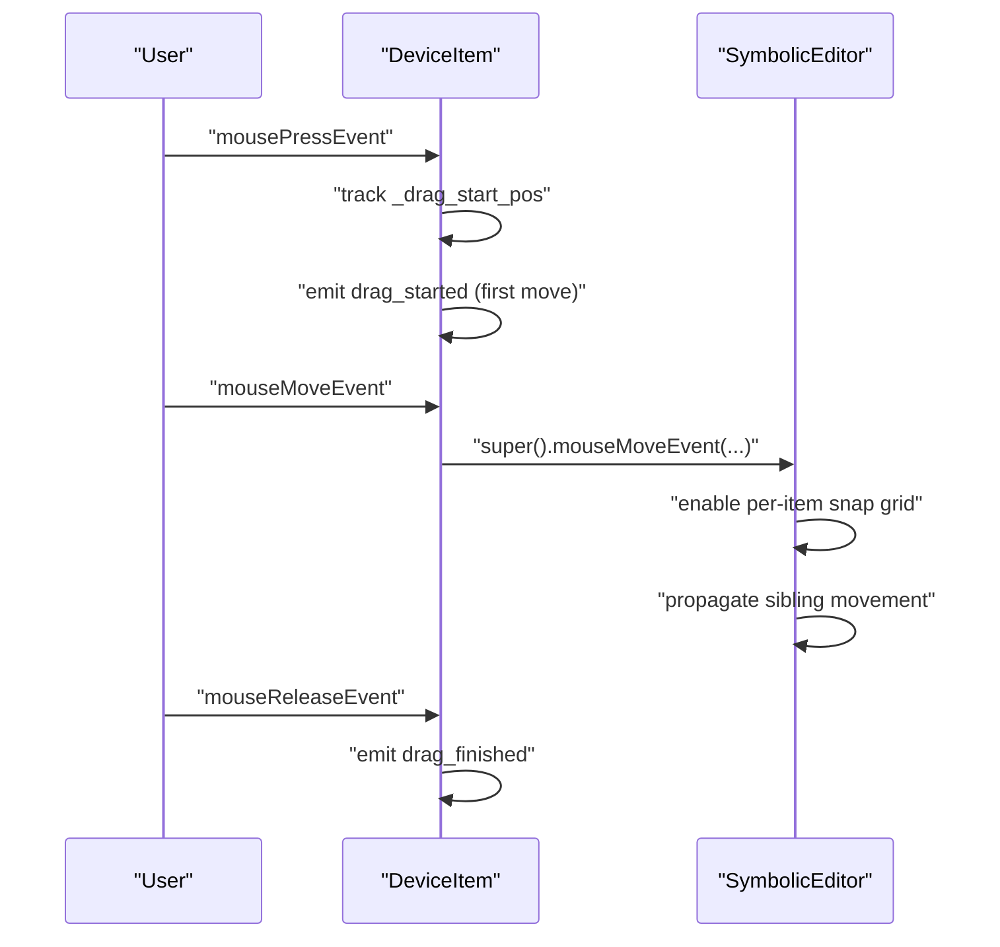
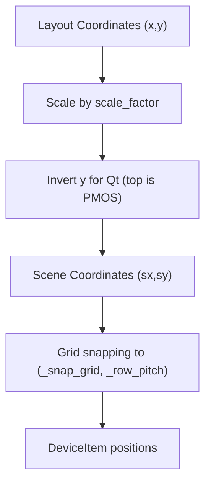
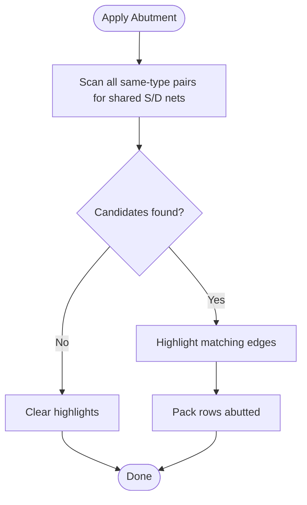
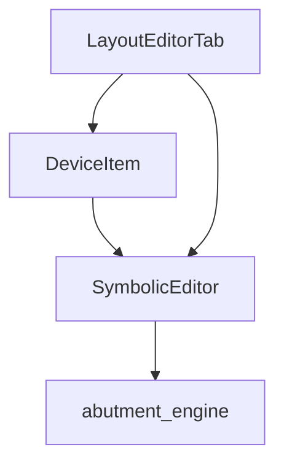

# Device Manipulation Operations

<cite>
**Referenced Files in This Document**
- [device_item.py](file://symbolic_editor/device_item.py)
- [editor_view.py](file://symbolic_editor/editor_view.py)
- [layout_tab.py](file://symbolic_editor/layout_tab.py)
- [abutment_engine.py](file://symbolic_editor/abutment_engine.py)
</cite>

## Table of Contents
1. [Introduction](#introduction)
2. [Project Structure](#project-structure)
3. [Core Components](#core-components)
4. [Architecture Overview](#architecture-overview)
5. [Detailed Component Analysis](#detailed-component-analysis)
6. [Dependency Analysis](#dependency-analysis)
7. [Performance Considerations](#performance-considerations)
8. [Troubleshooting Guide](#troubleshooting-guide)
9. [Conclusion](#conclusion)

## Introduction
This document explains device manipulation operations in the interactive canvas, focusing on move, swap, delete, flip (horizontal/vertical), and merge functions implemented through DeviceItem interactions. It also covers drag-and-drop mechanics, mouse event handling, keyboard shortcuts, coordinate transformation between scene coordinates and device positions, grid snapping and row-based placement constraints, and abutment functionality for PMOS/NMOS devices that pack edge-to-edge sharing Source/Drain diffusion. Practical workflows, error handling, and performance considerations for large layouts are included.

## Project Structure
The device manipulation system spans three primary modules:
- DeviceItem: a QGraphicsRectItem subclass representing transistors with painting, snapping, flipping, and abutment state.
- SymbolicEditor (editor_view): the interactive canvas managing grid snapping, row packing, device swapping, flipping, overlap resolution, and abutment candidate highlighting.
- LayoutEditorTab (layout_tab): orchestrates high-level commands (swap, merge, flip, delete) and integrates with the editor and abutment engine.

**Diagram sources**
- [device_item.py:17-508](file://symbolic_editor/device_item.py#L17-L508)
- [editor_view.py:81-2078](file://symbolic_editor/editor_view.py#L81-L2078)
- [layout_tab.py:64-2023](file://symbolic_editor/layout_tab.py#L64-L2023)
- [abutment_engine.py:1-225](file://symbolic_editor/abutment_engine.py#L1-L225)

**Section sources**
- [device_item.py:17-508](file://symbolic_editor/device_item.py#L17-L508)
- [editor_view.py:81-2078](file://symbolic_editor/editor_view.py#L81-L2078)
- [layout_tab.py:64-2023](file://symbolic_editor/layout_tab.py#L64-L2023)
- [abutment_engine.py:1-225](file://symbolic_editor/abutment_engine.py#L1-L225)

## Core Components
- DeviceItem: Implements visual rendering, grid snapping, flip transforms, abutment flags, and terminal anchors for routing.
- SymbolicEditor: Provides grid snapping, row-based placement, device swapping, flipping, overlap resolution, and abutment candidate highlighting.
- LayoutEditorTab: Exposes high-level commands (swap, merge, flip, delete) and integrates abutment mode with the editor.

Key responsibilities:
- Drag-and-drop: DeviceItem tracks drag state and emits signals; SymbolicEditor enables grid snapping during drag and triggers compaction.
- Keyboard shortcuts: Global shortcuts in SymbolicEditor and LayoutEditorTab toggle modes and invoke actions.
- Coordinate transformation: Scene coordinates are scaled and inverted for Qt’s screen convention; positions are converted back to layout coordinates for export.
- Abutment: Automatic candidate detection and manual overrides; PMOS/NMOS pack edge-to-edge with shared diffusion.

**Section sources**
- [device_item.py:17-508](file://symbolic_editor/device_item.py#L17-L508)
- [editor_view.py:81-2078](file://symbolic_editor/editor_view.py#L81-L2078)
- [layout_tab.py:64-2023](file://symbolic_editor/layout_tab.py#L64-L2023)

## Architecture Overview
The system uses a layered architecture:
- UI layer: DeviceItem and SymbolicEditor handle user interaction and rendering.
- Command layer: LayoutEditorTab translates user actions into editor operations.
- Analysis layer: Abutment engine computes candidates and edge maps.

**Diagram sources**
- [layout_tab.py:740-749](file://symbolic_editor/layout_tab.py#L740-L749)
- [editor_view.py:1034-1045](file://symbolic_editor/editor_view.py#L1034-L1045)

**Section sources**
- [layout_tab.py:740-749](file://symbolic_editor/layout_tab.py#L740-L749)
- [editor_view.py:1034-1045](file://symbolic_editor/editor_view.py#L1034-L1045)

## Detailed Component Analysis

### DeviceItem: Rendering, Snapping, Flipping, and Abutment
DeviceItem extends QGraphicsRectItem and manages:
- Visual rendering: multi-finger MOS layout with source/drain and gate regions, gradients, and labels.
- Grid snapping: rounds positions to a configurable grid during itemChange.
- Flipping: horizontal/vertical flip state tracked and reflected in rendering.
- Abutment: manual flags for left/right edges; candidate highlight state for auto-detected edges.
- Terminal anchors: returns scene positions for S/G/D terminals for routing.

**Diagram sources**
- [device_item.py:17-508](file://symbolic_editor/device_item.py#L17-L508)

**Section sources**
- [device_item.py:17-508](file://symbolic_editor/device_item.py#L17-L508)

### SymbolicEditor: Grid Snapping, Row Packing, Swaps, Flips, Overlaps, Abutment Highlights
SymbolicEditor manages:
- Grid snapping: per-item snapping via itemChange and global snap helpers.
- Row-based placement: row pitch and column grid; row packing compaction.
- Device operations: swap_devices, flip_devices_h/v, move_device, move_device_to_grid, resolve_overlaps.
- Abutment: apply_abutment detects candidates and highlights edges; clear_abutment removes highlights.
- Coordinate conversion: scale factor for layout↔scene; y-inversion for Qt convention.

**Diagram sources**
- [device_item.py:194-242](file://symbolic_editor/device_item.py#L194-L242)
- [editor_view.py:1003-1033](file://symbolic_editor/editor_view.py#L1003-L1033)

**Section sources**
- [editor_view.py:81-2078](file://symbolic_editor/editor_view.py#L81-L2078)

### LayoutEditorTab: Commands and Workflows
LayoutEditorTab exposes:
- Swap: swap_devices(id_a, id_b) with undo support.
- Merge: merge two devices by aligning positions and flipping one to achieve SS/DD alignment.
- Flip: flip_devices_h/v for selected devices.
- Delete: remove selected devices and update nodes.
- Abutment mode: compute and highlight candidates; clear highlights when disabled.

**Diagram sources**
- [layout_tab.py:978-1001](file://symbolic_editor/layout_tab.py#L978-L1001)
- [editor_view.py:1260-1299](file://symbolic_editor/editor_view.py#L1260-L1299)
- [abutment_engine.py:65-180](file://symbolic_editor/abutment_engine.py#L65-L180)

**Section sources**
- [layout_tab.py:736-820](file://symbolic_editor/layout_tab.py#L736-L820)
- [layout_tab.py:978-1001](file://symbolic_editor/layout_tab.py#L978-L1001)
- [editor_view.py:1260-1299](file://symbolic_editor/editor_view.py#L1260-L1299)
- [abutment_engine.py:65-180](file://symbolic_editor/abutment_engine.py#L65-L180)

### Drag-and-Drop Mechanics and Mouse Event Handling
- DeviceItem tracks drag state and emits drag_started/drag_finished signals on mouse press/move/release.
- SymbolicEditor enables per-item snapping when dragging and propagates movement to sibling groups.
- Middle mouse panning and dummy placement preview are supported in the canvas.

**Diagram sources**
- [device_item.py:209-242](file://symbolic_editor/device_item.py#L209-L242)
- [editor_view.py:700-712](file://symbolic_editor/editor_view.py#L700-L712)

**Section sources**
- [device_item.py:209-242](file://symbolic_editor/device_item.py#L209-L242)
- [editor_view.py:700-712](file://symbolic_editor/editor_view.py#L700-L712)

### Keyboard Shortcuts for Device Operations
- Global shortcuts in SymbolicEditor:
  - Select All: Select all devices.
  - D: Toggle dummy mode.
  - Escape: Ascend from hierarchy if applicable.
  - Ctrl+D: Descend into nearest hierarchy.
- LayoutEditorTab shortcuts:
  - M: Toggle move mode for a single device.
  - D: Toggle dummy mode.
  - Esc: Exit move mode and clear selection.

**Section sources**
- [editor_view.py:1582-1610](file://symbolic_editor/editor_view.py#L1582-L1610)
- [layout_tab.py:380-416](file://symbolic_editor/layout_tab.py#L380-L416)

### Coordinate Transformation and Grid Snapping
- Scene coordinates are scaled and y-inverted to match layout convention.
- Grid snapping:
  - Per-item snapping via itemChange with separate X/Y pitches.
  - Global snap helpers for row and column alignment.
  - Free-slot allocation ensures no overlaps on the same row.

**Diagram sources**
- [editor_view.py:372-377](file://symbolic_editor/editor_view.py#L372-L377)
- [editor_view.py:225-229](file://symbolic_editor/editor_view.py#L225-L229)
- [device_item.py:194-204](file://symbolic_editor/device_item.py#L194-L204)

**Section sources**
- [editor_view.py:372-377](file://symbolic_editor/editor_view.py#L372-L377)
- [editor_view.py:225-229](file://symbolic_editor/editor_view.py#L225-L229)
- [device_item.py:194-204](file://symbolic_editor/device_item.py#L194-L204)

### Abutment Functionality
- Automatic detection scans same-type transistors for shared Source/Drain nets and reports candidates with required flips.
- Edge highlighting: left/right glow on candidate terminals; manual overrides via right-click menu.
- Row compaction: devices are packed edge-to-edge; special spacing applied when both sides have abutment flags.

**Diagram sources**
- [abutment_engine.py:65-180](file://symbolic_editor/abutment_engine.py#L65-L180)
- [editor_view.py:1260-1299](file://symbolic_editor/editor_view.py#L1260-L1299)
- [editor_view.py:1003-1033](file://symbolic_editor/editor_view.py#L1003-L1033)

**Section sources**
- [abutment_engine.py:65-180](file://symbolic_editor/abutment_engine.py#L65-L180)
- [editor_view.py:1260-1299](file://symbolic_editor/editor_view.py#L1260-L1299)
- [editor_view.py:1003-1033](file://symbolic_editor/editor_view.py#L1003-L1033)

### Practical Workflows
- Move a single device:
  - Select one device, enter move mode, drag to new position, exit move mode to finalize.
- Swap two devices:
  - Select exactly two devices, invoke swap; positions exchange and rows are compacted.
- Merge two devices:
  - Select two devices of the same type; align centers, flip one to achieve SS or DD alignment, resolve overlaps.
- Flip devices:
  - Select one or more devices and flip horizontally or vertically.
- Delete devices:
  - Select devices and remove them; nodes are updated and scene refreshed.
- Abutment:
  - Enable abutment mode to highlight candidates; right-click on a device to toggle manual abutment flags.

**Section sources**
- [layout_tab.py:421-447](file://symbolic_editor/layout_tab.py#L421-L447)
- [layout_tab.py:740-749](file://symbolic_editor/layout_tab.py#L740-L749)
- [layout_tab.py:756-788](file://symbolic_editor/layout_tab.py#L756-L788)
- [layout_tab.py:789-803](file://symbolic_editor/layout_tab.py#L789-L803)
- [layout_tab.py:805-819](file://symbolic_editor/layout_tab.py#L805-L819)
- [layout_tab.py:978-1001](file://symbolic_editor/layout_tab.py#L978-L1001)
- [editor_view.py:1972-2058](file://symbolic_editor/editor_view.py#L1972-L2058)

## Dependency Analysis
- DeviceItem depends on Qt graphics primitives and emits signals for drag events.
- SymbolicEditor depends on DeviceItem for rendering and snapping, and on abutment_engine for candidate computation.
- LayoutEditorTab orchestrates SymbolicEditor operations and integrates abutment mode.

**Diagram sources**
- [device_item.py:17-508](file://symbolic_editor/device_item.py#L17-L508)
- [editor_view.py:81-2078](file://symbolic_editor/editor_view.py#L81-L2078)
- [layout_tab.py:64-2023](file://symbolic_editor/layout_tab.py#L64-L2023)
- [abutment_engine.py:1-225](file://symbolic_editor/abutment_engine.py#L1-L225)

**Section sources**
- [device_item.py:17-508](file://symbolic_editor/device_item.py#L17-L508)
- [editor_view.py:81-2078](file://symbolic_editor/editor_view.py#L81-L2078)
- [layout_tab.py:64-2023](file://symbolic_editor/layout_tab.py#L64-L2023)
- [abutment_engine.py:1-225](file://symbolic_editor/abutment_engine.py#L1-L225)

## Performance Considerations
- Grid snapping: per-item snapping in itemChange ensures devices remain on grid; disable snapping for exact-coordinate imports to avoid unnecessary rounding.
- Row compaction: _compact_rows_abutted packs devices efficiently; call selectively for affected rows to minimize work.
- Overlap resolution: resolve_overlaps uses BFS-like propagation to push neighbors; limit to anchor devices to reduce recomputation.
- Large layouts: virtual grid extents and cached content help maintain responsiveness; avoid frequent full-scene updates.

[No sources needed since this section provides general guidance]

## Troubleshooting Guide
Common issues and resolutions:
- Invalid swap: Ensure exactly two devices are selected; otherwise, an error message is shown.
- Merge constraints: Devices must be the same type; otherwise, an error message is shown.
- Flip errors: No selection yields no-op; ensure at least one device is selected.
- Delete errors: No selection yields no-op; selection is required.
- Abutment mode: If no candidates are found, the system clears highlights and informs the user.
- Drag snapping: If items drift between tracks, verify snap grid is enabled during drag.

**Section sources**
- [layout_tab.py:740-749](file://symbolic_editor/layout_tab.py#L740-L749)
- [layout_tab.py:756-788](file://symbolic_editor/layout_tab.py#L756-L788)
- [layout_tab.py:789-803](file://symbolic_editor/layout_tab.py#L789-L803)
- [layout_tab.py:805-819](file://symbolic_editor/layout_tab.py#L805-L819)
- [layout_tab.py:978-1001](file://symbolic_editor/layout_tab.py#L978-L1001)

## Conclusion
The device manipulation system combines DeviceItem rendering and snapping, SymbolicEditor grid and row management, and LayoutEditorTab command orchestration with abutment analysis. Users can move, swap, delete, flip, and merge devices with precise grid snapping and row-based constraints. Abutment detection and manual overrides enable efficient PMOS/NMOS packing. The architecture supports scalable workflows and performance-conscious operations for large layouts.