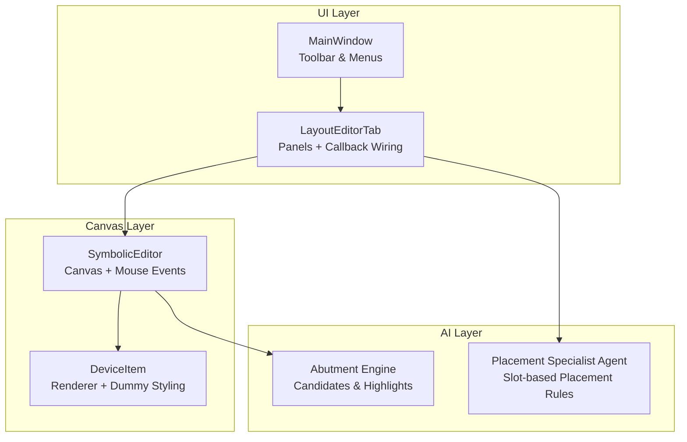
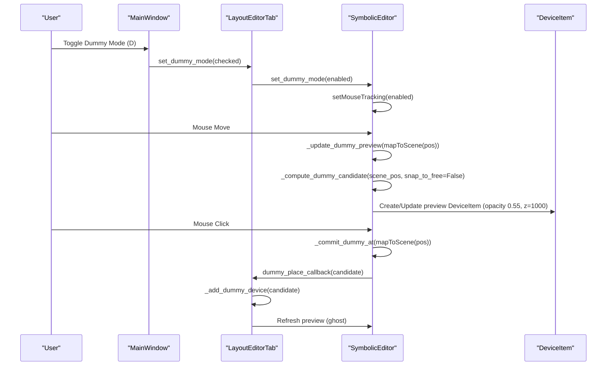
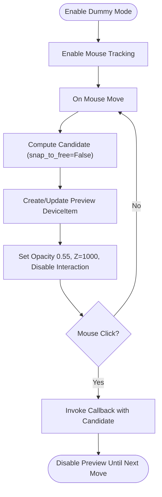
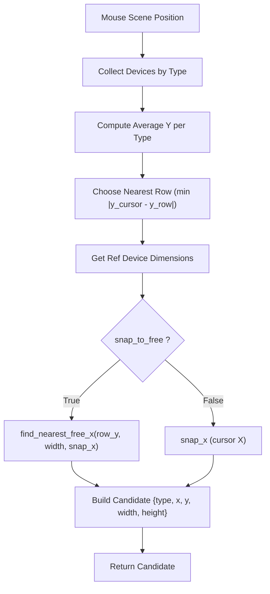
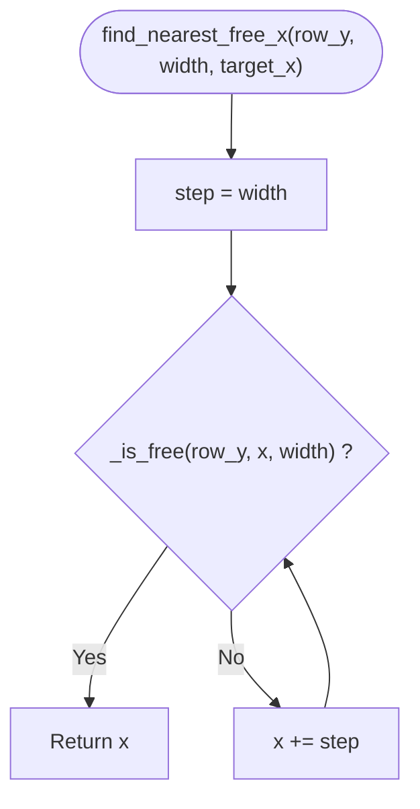
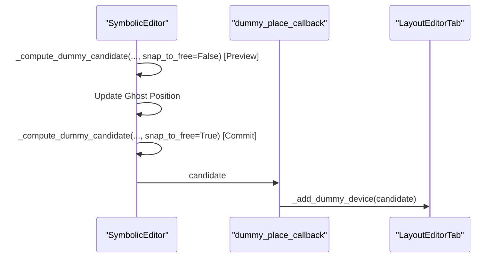
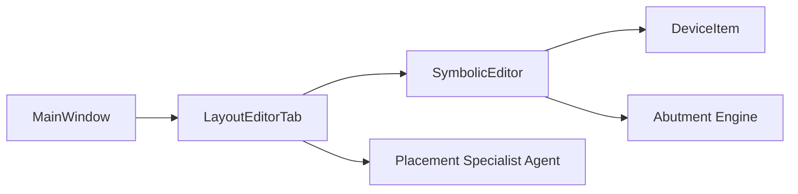

# Dummy Device Placement Workflow

<cite>
**Referenced Files in This Document**
- [README.md](file://README.md)
- [main.py](file://symbolic_editor/main.py)
- [layout_tab.py](file://symbolic_editor/layout_tab.py)
- [editor_view.py](file://symbolic_editor/editor_view.py)
- [device_item.py](file://symbolic_editor/device_item.py)
- [abutment_engine.py](file://symbolic_editor/abutment_engine.py)
- [placement_specialist.py](file://ai_agent/ai_chat_bot/agents/placement_specialist.py)
</cite>

## Table of Contents
1. [Introduction](#introduction)
2. [Project Structure](#project-structure)
3. [Core Components](#core-components)
4. [Architecture Overview](#architecture-overview)
5. [Detailed Component Analysis](#detailed-component-analysis)
6. [Dependency Analysis](#dependency-analysis)
7. [Performance Considerations](#performance-considerations)
8. [Troubleshooting Guide](#troubleshooting-guide)
9. [Conclusion](#conclusion)
10. [Appendices](#appendices)

## Introduction
This document explains the dummy device placement workflow used in the symbolic analog layout editor. It covers how to activate click-to-place dummy mode, how live ghost previews work, how grid-aligned placement constrains snap-to-free-slot behavior, and how the candidate computation algorithm detects nearby PMOS/NMOS rows and computes the nearest free slot. It also documents the visual feedback system (semi-transparent previews, opacity, and z-index), the distinction between preview and commit phases, practical workflows, integration with the AI chat system, and troubleshooting common placement issues.

## Project Structure
The dummy placement workflow spans several modules:
- Application shell and UI controls: main window, toolbar actions, and keyboard shortcuts
- Layout tab container: integrates editor, device tree, chat panel, and KLayout preview
- Editor canvas: handles mouse events, dummy mode lifecycle, preview updates, and commit callbacks
- Device item renderer: paints devices and supports dummy styling
- Abutment engine: computes abutment candidates (used by AI and layout logic)
- AI placement agent: enforces slot-based placement, row constraints, and dummy placement rules

**Diagram sources**
- [main.py:483-526](file://symbolic_editor/main.py#L483-L526)
- [layout_tab.py:220-237](file://symbolic_editor/layout_tab.py#L220-L237)
- [editor_view.py:1904-1936](file://symbolic_editor/editor_view.py#L1904-L1936)
- [device_item.py:59-81](file://symbolic_editor/device_item.py#L59-L81)
- [placement_specialist.py:306-313](file://ai_agent/ai_chat_bot/agents/placement_specialist.py#L306-L313)
- [abutment_engine.py:65-82](file://symbolic_editor/abutment_engine.py#L65-L82)

**Section sources**
- [README.md:75-85](file://README.md#L75-L85)
- [main.py:483-526](file://symbolic_editor/main.py#L483-L526)
- [layout_tab.py:220-237](file://symbolic_editor/layout_tab.py#L220-L237)
- [editor_view.py:1904-1936](file://symbolic_editor/editor_view.py#L1904-L1936)
- [device_item.py:59-81](file://symbolic_editor/device_item.py#L59-L81)
- [placement_specialist.py:306-313](file://ai_agent/ai_chat_bot/agents/placement_specialist.py#L306-L313)
- [abutment_engine.py:65-82](file://symbolic_editor/abutment_engine.py#L65-L82)

## Core Components
- Dummy mode activation: toggled via toolbar action or keyboard shortcut, enabling mouse tracking and preview rendering
- Live ghost preview: a semi-transparent DeviceItem follows the cursor at 55% opacity and z-value 1000
- Candidate computation: selects the nearest PMOS/NMOS row by Y proximity, snaps X to the nearest free slot, and returns a candidate dict
- Snap-to-free-slot: finds the closest free X slot along the target row, considering device width and exclusions
- Commit phase: invokes a callback with the computed candidate to finalize placement
- Visual feedback: dummy devices use a consistent pink color scheme; preview disables interaction and uses high z-index

**Section sources**
- [editor_view.py:192-203](file://symbolic_editor/editor_view.py#L192-L203)
- [editor_view.py:301-347](file://symbolic_editor/editor_view.py#L301-L347)
- [editor_view.py:246-290](file://symbolic_editor/editor_view.py#L246-L290)
- [editor_view.py:1084-1100](file://symbolic_editor/editor_view.py#L1084-L1100)
- [device_item.py:59-81](file://symbolic_editor/device_item.py#L59-L81)

## Architecture Overview
The dummy placement workflow is event-driven:
- User toggles dummy mode (toolbar/menu/shortcut)
- Mouse move updates the live preview (ghost) positioned at the nearest free slot
- Mouse click commits the placement by invoking a callback with the candidate
- The callback (registered in the layout tab) adds a new dummy device at the computed location

**Diagram sources**
- [main.py:642-653](file://symbolic_editor/main.py#L642-L653)
- [layout_tab.py:228-228](file://symbolic_editor/layout_tab.py#L228-L228)
- [editor_view.py:1904-1936](file://symbolic_editor/editor_view.py#L1904-L1936)
- [editor_view.py:301-347](file://symbolic_editor/editor_view.py#L301-L347)
- [device_item.py:311-330](file://symbolic_editor/device_item.py#L311-L330)

## Detailed Component Analysis

### Dummy Mode Lifecycle and Visual Feedback
- Activation: sets mouse tracking on canvas and viewport; clears preview when disabled
- Preview rendering: creates a DeviceItem configured as a dummy with semi-transparent fill and high z-index; disables movement and selection
- Opacity and z-index: preview uses 55% opacity and z=1000 to render above active devices
- Type switching: if the cursor crosses a row boundary, the preview type updates to match the target row’s device type

**Diagram sources**
- [editor_view.py:192-203](file://symbolic_editor/editor_view.py#L192-L203)
- [editor_view.py:301-347](file://symbolic_editor/editor_view.py#L301-L347)
- [device_item.py:311-330](file://symbolic_editor/device_item.py#L311-L330)

**Section sources**
- [editor_view.py:192-203](file://symbolic_editor/editor_view.py#L192-L203)
- [editor_view.py:301-347](file://symbolic_editor/editor_view.py#L301-L347)
- [device_item.py:311-330](file://symbolic_editor/device_item.py#L311-L330)

### Candidate Computation and Grid Alignment
The candidate computation algorithm:
- Groups existing devices by type (nmos, pmos)
- Computes average Y for each type to detect rows
- Selects the nearest row by Y distance to the cursor
- Snaps X to the nearest free slot along the target row using the snap-to-free-slot routine
- Returns a candidate dict with type, x, y, width, height

**Diagram sources**
- [editor_view.py:246-290](file://symbolic_editor/editor_view.py#L246-L290)
- [editor_view.py:1084-1100](file://symbolic_editor/editor_view.py#L1084-L1100)

**Section sources**
- [editor_view.py:246-290](file://symbolic_editor/editor_view.py#L246-L290)
- [editor_view.py:1084-1100](file://symbolic_editor/editor_view.py#L1084-L1100)

### Snap-to-Free-Slot Mechanism
The snap-to-free-slot routine:
- Determines the target row Y and device width
- Iteratively scans X positions at slot increments equal to device width
- Uses an occupancy map to check if a slot is free
- Returns the first free X encountered

**Diagram sources**
- [editor_view.py:1084-1100](file://symbolic_editor/editor_view.py#L1084-L1100)

**Section sources**
- [editor_view.py:1084-1100](file://symbolic_editor/editor_view.py#L1084-L1100)

### Preview vs Commit Phases
- Preview phase: snap_to_free=False; cursor-following ghost shows where the dummy would land without committing
- Commit phase: snap_to_free=True; the click triggers a commit with the nearest free slot; the callback finalizes placement

**Diagram sources**
- [editor_view.py:246-290](file://symbolic_editor/editor_view.py#L246-L290)
- [editor_view.py:340-347](file://symbolic_editor/editor_view.py#L340-L347)
- [layout_tab.py:228-228](file://symbolic_editor/layout_tab.py#L228-L228)

**Section sources**
- [editor_view.py:246-290](file://symbolic_editor/editor_view.py#L246-L290)
- [editor_view.py:340-347](file://symbolic_editor/editor_view.py#L340-L347)
- [layout_tab.py:228-228](file://symbolic_editor/layout_tab.py#L228-L228)

### Practical Dummy Placement Workflows
- Toggle dummy mode using the toolbar action or keyboard shortcut D
- Move the mouse to preview placement; the ghost shows the exact landing spot
- Click to place the dummy at the nearest free slot in the nearest row
- Use Fit View (F) to center the canvas and review placement
- Combine with AI placement: the AI placement agent enforces slot-based placement and dummy placement rules

**Section sources**
- [main.py:642-653](file://symbolic_editor/main.py#L642-L653)
- [layout_tab.py:380-416](file://symbolic_editor/layout_tab.py#L380-L416)
- [placement_specialist.py:306-313](file://ai_agent/ai_chat_bot/agents/placement_specialist.py#L306-L313)

### Integration with the AI Chat System
- The AI placement agent uses slot-based placement rules and enforces dummy placement at row extremes
- The editor’s dummy placement workflow complements AI placement by allowing interactive dummy insertion
- The AI can issue commands to add dummy devices; the editor’s dummy callback ensures consistent slot and row constraints

**Section sources**
- [placement_specialist.py:306-313](file://ai_agent/ai_chat_bot/agents/placement_specialist.py#L306-L313)
- [layout_tab.py:228-228](file://symbolic_editor/layout_tab.py#L228-L228)

## Dependency Analysis
The dummy placement workflow depends on:
- UI toggles and shortcuts routed through the main window and layout tab
- Canvas mouse event handling and preview management
- Device rendering and styling for dummy visuals
- Occupancy and slot computation for snap-to-free-slot
- AI placement rules for consistent dummy placement

**Diagram sources**
- [main.py:483-526](file://symbolic_editor/main.py#L483-L526)
- [layout_tab.py:220-237](file://symbolic_editor/layout_tab.py#L220-L237)
- [editor_view.py:1904-1936](file://symbolic_editor/editor_view.py#L1904-L1936)
- [device_item.py:59-81](file://symbolic_editor/device_item.py#L59-L81)
- [abutment_engine.py:65-82](file://symbolic_editor/abutment_engine.py#L65-L82)
- [placement_specialist.py:306-313](file://ai_agent/ai_chat_bot/agents/placement_specialist.py#L306-L313)

**Section sources**
- [main.py:483-526](file://symbolic_editor/main.py#L483-L526)
- [layout_tab.py:220-237](file://symbolic_editor/layout_tab.py#L220-L237)
- [editor_view.py:1904-1936](file://symbolic_editor/editor_view.py#L1904-L1936)
- [device_item.py:59-81](file://symbolic_editor/device_item.py#L59-L81)
- [abutment_engine.py:65-82](file://symbolic_editor/abutment_engine.py#L65-L82)
- [placement_specialist.py:306-313](file://ai_agent/ai_chat_bot/agents/placement_specialist.py#L306-L313)

## Performance Considerations
- Preview updates are lightweight since they reuse a DeviceItem and only update position and type when crossing row boundaries
- Candidate computation iterates over existing devices to detect rows; performance scales with device count
- Snap-to-free-slot uses incremental scanning; for dense rows, consider optimizing occupancy checks (already implemented via slot-based logic)

[No sources needed since this section provides general guidance]

## Troubleshooting Guide
Common issues and resolutions:
- No preview appears: ensure dummy mode is enabled and mouse tracking is active
- Ghost flickers or mismatches row type: occurs when crossing row boundaries; the preview recreates itself to match the new row’s device type
- Click does nothing: verify a valid candidate exists (devices of both types present) and the callback is wired
- Dummies overlap: confirm snap-to-free-slot is working; check that the row’s slots are properly occupied
- Visual overlap with active devices: ensure preview z-index is higher than active devices; verify opacity is set to 55%

**Section sources**
- [editor_view.py:192-203](file://symbolic_editor/editor_view.py#L192-L203)
- [editor_view.py:332-336](file://symbolic_editor/editor_view.py#L332-L336)
- [editor_view.py:340-347](file://symbolic_editor/editor_view.py#L340-L347)
- [device_item.py:311-330](file://symbolic_editor/device_item.py#L311-L330)

## Conclusion
The dummy device placement workflow combines a responsive preview system with precise grid-aligned placement. Users can toggle dummy mode, preview placements in real-time, and commit by clicking to place dummies at the nearest free slot in the nearest row. The system integrates with the broader layout and AI pipelines, ensuring consistent slot-based placement and visual clarity through semi-transparent previews and high z-index rendering.

[No sources needed since this section summarizes without analyzing specific files]

## Appendices

### Visual Feedback Reference
- Dummy preview: 55% opacity, z-index 1000, non-interactive
- Dummy styling: consistent pink color scheme for both PMOS/NMOS dummies

**Section sources**
- [editor_view.py:320-321](file://symbolic_editor/editor_view.py#L320-L321)
- [device_item.py:59-81](file://symbolic_editor/device_item.py#L59-L81)