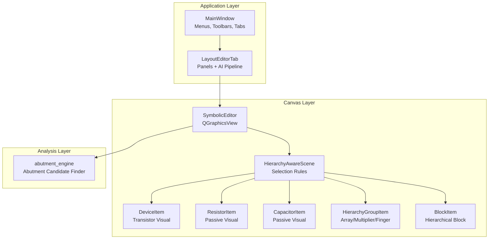
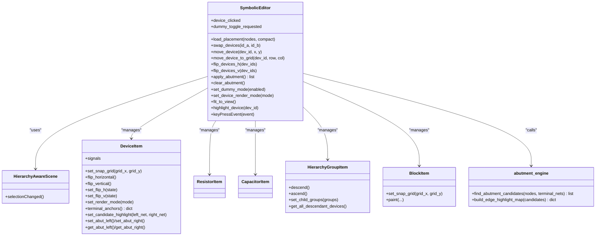
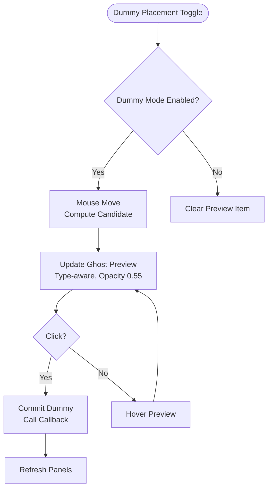
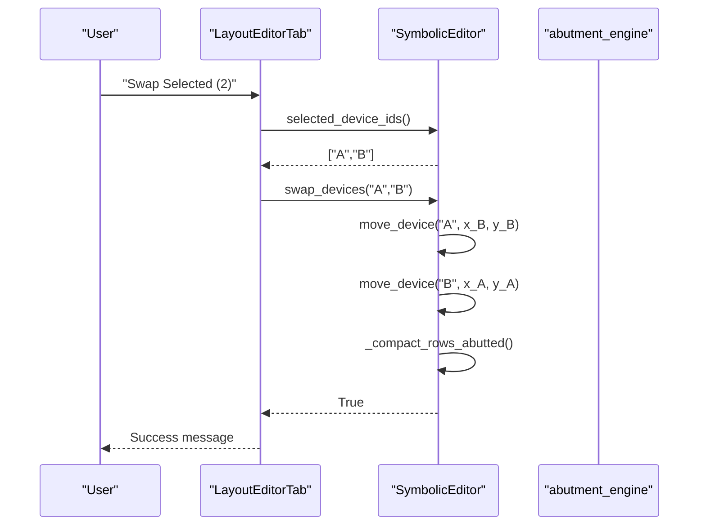
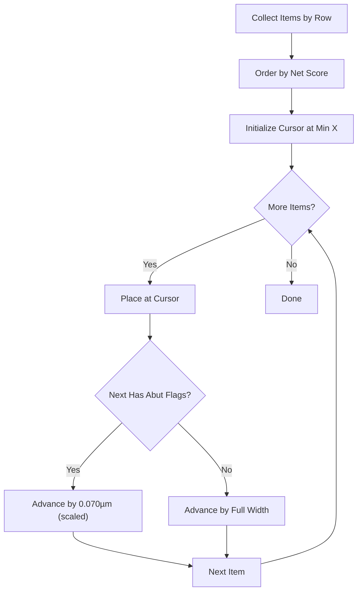
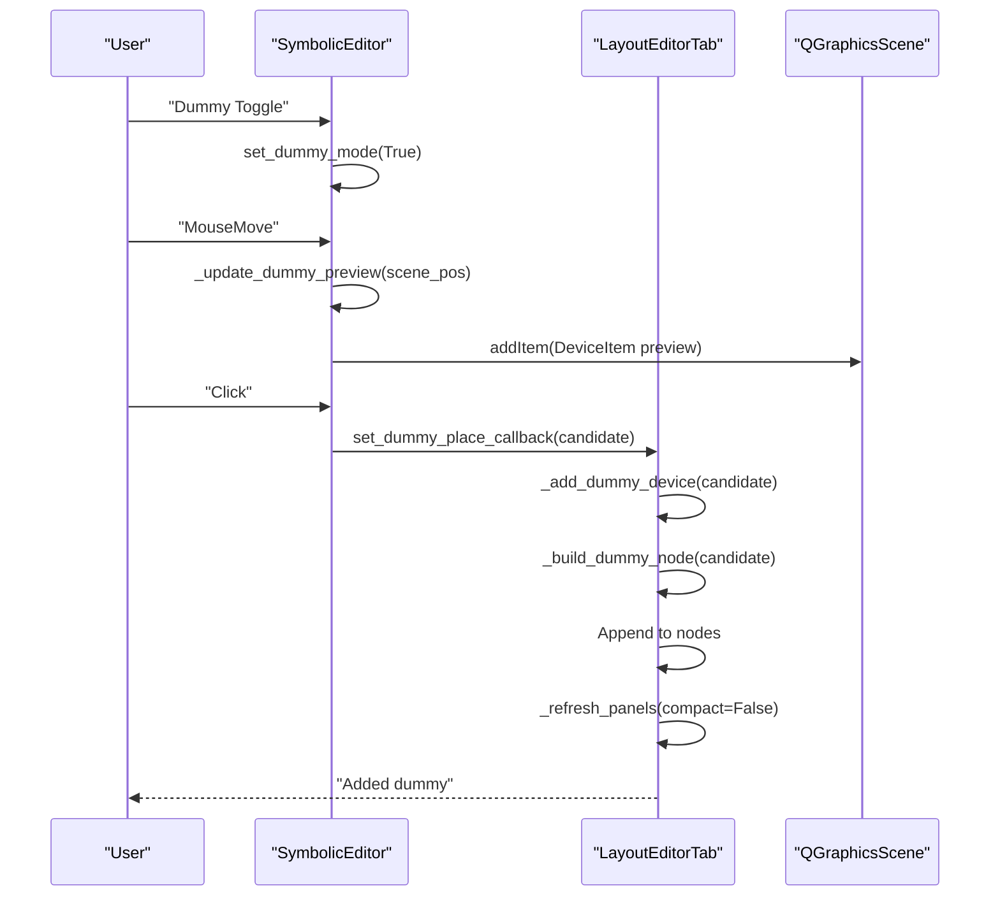
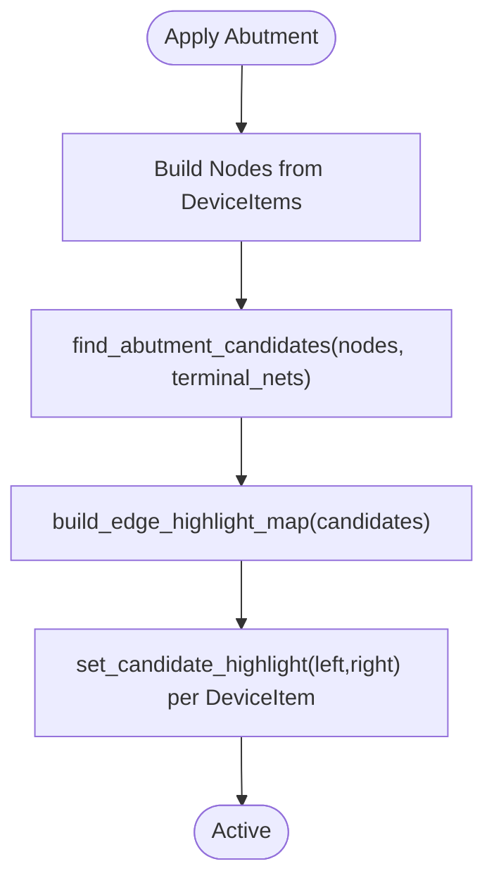
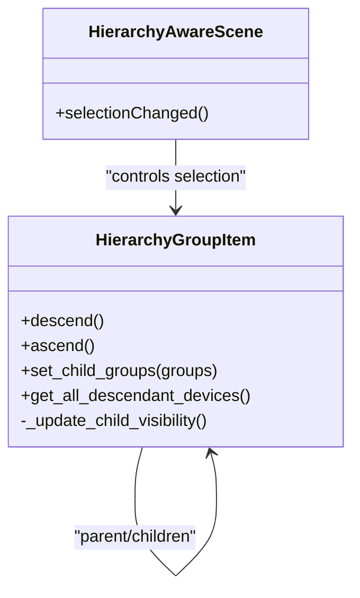
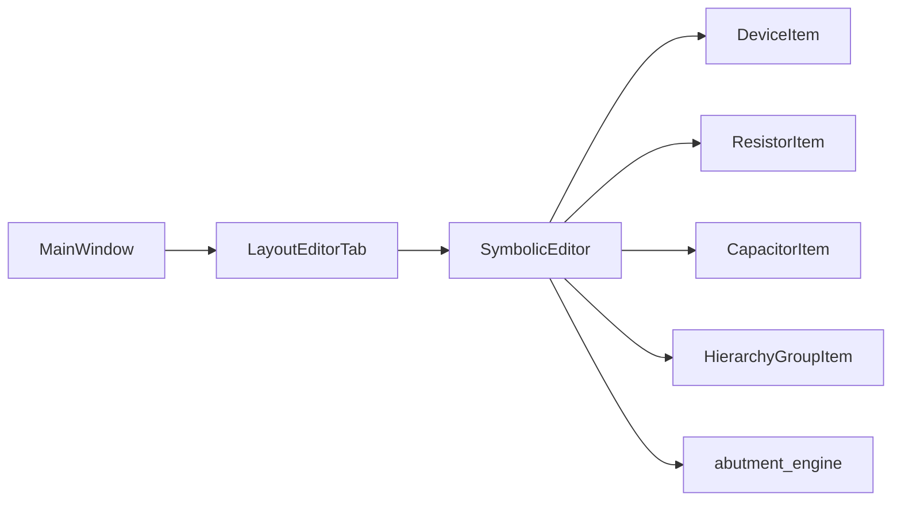

# Interactive Symbolic Canvas

<cite>
**Referenced Files in This Document**
- [editor_view.py](file://symbolic_editor/editor_view.py)
- [device_item.py](file://symbolic_editor/device_item.py)
- [passive_item.py](file://symbolic_editor/passive_item.py)
- [block_item.py](file://symbolic_editor/block_item.py)
- [hierarchy_group_item.py](file://symbolic_editor/hierarchy_group_item.py)
- [abutment_engine.py](file://symbolic_editor/abutment_engine.py)
- [layout_tab.py](file://symbolic_editor/layout_tab.py)
- [main.py](file://symbolic_editor/main.py)
</cite>

## Table of Contents
1. [Introduction](#introduction)
2. [Project Structure](#project-structure)
3. [Core Components](#core-components)
4. [Architecture Overview](#architecture-overview)
5. [Detailed Component Analysis](#detailed-component-analysis)
6. [Dependency Analysis](#dependency-analysis)
7. [Performance Considerations](#performance-considerations)
8. [Troubleshooting Guide](#troubleshooting-guide)
9. [Conclusion](#conclusion)
10. [Appendices](#appendices)

## Introduction
This document describes the interactive symbolic canvas system built on Qt's QGraphicsView/QGraphicsScene framework. The canvas renders device items as QGraphicsRectItem-based visuals, supports row-based abutted placement for PMOS/NMOS devices, and provides advanced editing features including dummy device placement with live ghost preview, batch selection, keyboard shortcuts, and undo/redo. It also integrates abutment analysis, hierarchical grouping, and connectivity visualization for net-aware routing.

## Project Structure
The symbolic editor is organized into modular components:
- Canvas and scene management: SymbolicEditor (QGraphicsView) with HierarchyAwareScene
- Device visuals: DeviceItem (transistors), ResistorItem/CapacitorItem (passives)
- Hierarchical grouping: HierarchyGroupItem for arrays/multipliers/fingers
- Abutment analysis: abutment_engine for detecting diffusion-sharing candidates
- Tab shell and orchestration: LayoutEditorTab coordinating editor, panels, and AI pipeline
- Application shell: MainWindow managing tabs, menus, and toolbar actions

**Diagram sources**
- [main.py:80-750](file://symbolic_editor/main.py#L80-L750)
- [layout_tab.py:64-238](file://symbolic_editor/layout_tab.py#L64-L238)
- [editor_view.py:81-200](file://symbolic_editor/editor_view.py#L81-L200)
- [device_item.py:17-85](file://symbolic_editor/device_item.py#L17-L85)
- [passive_item.py:24-110](file://symbolic_editor/passive_item.py#L24-L110)
- [hierarchy_group_item.py:28-90](file://symbolic_editor/hierarchy_group_item.py#L28-L90)
- [block_item.py:11-56](file://symbolic_editor/block_item.py#L11-L56)
- [abutment_engine.py:65-180](file://symbolic_editor/abutment_engine.py#L65-L180)

**Section sources**
- [main.py:80-750](file://symbolic_editor/main.py#L80-L750)
- [layout_tab.py:64-238](file://symbolic_editor/layout_tab.py#L64-L238)
- [editor_view.py:81-200](file://symbolic_editor/editor_view.py#L81-L200)

## Core Components
- SymbolicEditor: Central QGraphicsView canvas with grid snapping, row-based compaction, abutment highlighting, connectivity visualization, and device manipulation APIs (move, swap, flip, merge).
- DeviceItem: Visual representation of transistors with multi-finger rendering, terminal anchors, flip state, and abutment flags.
- Passive items: ResistorItem and CapacitorItem with terminal anchors and orientation support.
- HierarchyGroupItem: Bounding box grouping devices by arrays/multipliers/fingers; controls visibility and drag semantics.
- abutment_engine: Detects same-type transistor pairs sharing Source/Drain nets and computes highlight maps.
- LayoutEditorTab: Orchestrates the editor, panels, undo/redo stacks, and AI pipeline integration.
- MainWindow: Application shell with menus, toolbars, and tab management.

**Section sources**
- [editor_view.py:81-200](file://symbolic_editor/editor_view.py#L81-L200)
- [device_item.py:17-85](file://symbolic_editor/device_item.py#L17-L85)
- [passive_item.py:24-110](file://symbolic_editor/passive_item.py#L24-L110)
- [hierarchy_group_item.py:28-90](file://symbolic_editor/hierarchy_group_item.py#L28-L90)
- [abutment_engine.py:65-180](file://symbolic_editor/abutment_engine.py#L65-L180)
- [layout_tab.py:64-238](file://symbolic_editor/layout_tab.py#L64-L238)
- [main.py:80-750](file://symbolic_editor/main.py#L80-L750)

## Architecture Overview
The canvas architecture centers on SymbolicEditor, which extends QGraphicsView and manages:
- Scene creation with HierarchyAwareScene to enforce selection rules across hierarchy levels.
- Device items keyed by ID for fast lookup and manipulation.
- Grid and row systems for snapping and abutted packing.
- Abutment analysis integration and visual highlighting.
- Connectivity visualization for net-aware routing.
- Keyboard shortcuts and toolbar actions wired through MainWindow and LayoutEditorTab.

**Diagram sources**
- [editor_view.py:81-200](file://symbolic_editor/editor_view.py#L81-L200)
- [editor_view.py:1034-1083](file://symbolic_editor/editor_view.py#L1034-L1083)
- [editor_view.py:1260-1315](file://symbolic_editor/editor_view.py#L1260-L1315)
- [device_item.py:17-85](file://symbolic_editor/device_item.py#L17-L85)
- [passive_item.py:24-110](file://symbolic_editor/passive_item.py#L24-L110)
- [hierarchy_group_item.py:28-90](file://symbolic_editor/hierarchy_group_item.py#L28-L90)
- [block_item.py:11-56](file://symbolic_editor/block_item.py#L11-L56)
- [abutment_engine.py:65-180](file://symbolic_editor/abutment_engine.py#L65-L180)

**Section sources**
- [editor_view.py:81-200](file://symbolic_editor/editor_view.py#L81-L200)
- [device_item.py:17-85](file://symbolic_editor/device_item.py#L17-L85)
- [passive_item.py:24-110](file://symbolic_editor/passive_item.py#L24-L110)
- [hierarchy_group_item.py:28-90](file://symbolic_editor/hierarchy_group_item.py#L28-L90)
- [block_item.py:11-56](file://symbolic_editor/block_item.py#L11-L56)
- [abutment_engine.py:65-180](file://symbolic_editor/abutment_engine.py#L65-L180)

## Detailed Component Analysis

### Canvas and Scene Management
- Grid and row systems: Base grid spacing, row pitch, and snap grids enable precise placement and abutment.
- Dummy placement mode: Live ghost preview with opacity and non-interactive preview item; commit callback triggers node insertion.
- Viewport and zoom: Cache mode, antialiasing, and zoom factor; fit-to-view adjusts transform and maintains zoom level.
- Selection enforcement: HierarchyAwareScene blocks selection of devices in non-descended hierarchy groups.

**Diagram sources**
- [editor_view.py:192-220](file://symbolic_editor/editor_view.py#L192-L220)
- [editor_view.py:246-347](file://symbolic_editor/editor_view.py#L246-L347)
- [layout_tab.py:1035-1066](file://symbolic_editor/layout_tab.py#L1035-L1066)

**Section sources**
- [editor_view.py:192-220](file://symbolic_editor/editor_view.py#L192-L220)
- [editor_view.py:246-347](file://symbolic_editor/editor_view.py#L246-L347)
- [layout_tab.py:1035-1066](file://symbolic_editor/layout_tab.py#L1035-L1066)

### Device Manipulation Operations
- Move: Absolute position move with grid snapping and nearest-free-x resolution; triggers row compaction.
- Swap: Interchange positions of two devices and recompact rows.
- Flip: Horizontal/vertical mirroring with orientation string export.
- Merge: Align two devices for shared Source (SS) or Drain (DD) with proper orientation and overlap spacing.
- Delete: Remove selected devices from scene and node list.
- Batch selection: Select all devices; toolbar/menu actions operate on selected IDs.

**Diagram sources**
- [layout_tab.py:740-749](file://symbolic_editor/layout_tab.py#L740-L749)
- [editor_view.py:1034-1045](file://symbolic_editor/editor_view.py#L1034-L1045)

**Section sources**
- [layout_tab.py:736-820](file://symbolic_editor/layout_tab.py#L736-L820)
- [editor_view.py:1034-1083](file://symbolic_editor/editor_view.py#L1034-L1083)

### Row-Based Abutted Placement
- Row detection: Snapping to row pitch by device type and Y-coordinate.
- Slot allocation: Nearest free X-slot calculation considering device width and existing spans.
- Compaction: Edge-to-edge packing with optional 0.070µm overlap for shared diffusion when abutment flags are set.
- Net-aware ordering: Adjacency scoring favors common Drain/Source nets to maximize diffusion sharing.

**Diagram sources**
- [editor_view.py:1003-1033](file://symbolic_editor/editor_view.py#L1003-L1033)
- [editor_view.py:1085-1114](file://symbolic_editor/editor_view.py#L1085-L1114)
- [editor_view.py:933-1001](file://symbolic_editor/editor_view.py#L933-L1001)

**Section sources**
- [editor_view.py:1003-1033](file://symbolic_editor/editor_view.py#L1003-L1033)
- [editor_view.py:1085-1114](file://symbolic_editor/editor_view.py#L1085-L1114)
- [editor_view.py:933-1001](file://symbolic_editor/editor_view.py#L933-L1001)

### Dummy Device Placement Workflow
- Live ghost preview: Uses DeviceItem as preview with render mode matching current setting, opacity 0.55, and disabled interaction.
- Candidate computation: Snaps to nearest PMOS/NMOS row; determines type and dimensions; finds nearest free X-slot.
- Commit: Builds dummy node with geometry scaled back to layout coordinates, inserts into nodes, refreshes panels, and updates undo/redo.

**Diagram sources**
- [editor_view.py:192-220](file://symbolic_editor/editor_view.py#L192-L220)
- [editor_view.py:301-347](file://symbolic_editor/editor_view.py#L301-L347)
- [layout_tab.py:1035-1066](file://symbolic_editor/layout_tab.py#L1035-L1066)

**Section sources**
- [editor_view.py:192-220](file://symbolic_editor/editor_view.py#L192-L220)
- [editor_view.py:301-347](file://symbolic_editor/editor_view.py#L301-L347)
- [layout_tab.py:1035-1066](file://symbolic_editor/layout_tab.py#L1035-L1066)

### Abutment Analysis and Highlighting
- Candidate detection: Scans same-type transistor pairs for shared S/D nets; filters power nets; handles same-parent vs cross-parent cases.
- Highlight map: Maps each device to left/right edge net for visual glow; toggled via apply/clear.
- Integration: Called from LayoutEditorTab when toolbar toggled; messages summarize findings.

**Diagram sources**
- [editor_view.py:1260-1299](file://symbolic_editor/editor_view.py#L1260-L1299)
- [abutment_engine.py:65-180](file://symbolic_editor/abutment_engine.py#L65-L180)

**Section sources**
- [editor_view.py:1260-1299](file://symbolic_editor/editor_view.py#L1260-L1299)
- [abutment_engine.py:65-180](file://symbolic_editor/abutment_engine.py#L65-L180)

### Hierarchy Groups and Selection Rules
- Grouping: Devices grouped by parent with multi-level hierarchy (m, nf, arrays); child groups linked to parent.
- Visibility: Symbolic view hides child devices; descending shows children; ascending hides children.
- Selection enforcement: HierarchyAwareScene blocks selection of devices whose hierarchy is not descended.

**Diagram sources**
- [hierarchy_group_item.py:28-90](file://symbolic_editor/hierarchy_group_item.py#L28-L90)
- [hierarchy_group_item.py:128-141](file://symbolic_editor/hierarchy_group_item.py#L128-L141)
- [editor_view.py:46-78](file://symbolic_editor/editor_view.py#L46-L78)

**Section sources**
- [hierarchy_group_item.py:28-90](file://symbolic_editor/hierarchy_group_item.py#L28-L90)
- [hierarchy_group_item.py:128-141](file://symbolic_editor/hierarchy_group_item.py#L128-L141)
- [editor_view.py:46-78](file://symbolic_editor/editor_view.py#L46-L78)

### Coordinate System, Scaling, and Viewport Management
- Coordinate conventions: Layout JSON uses math convention (y increasing upward); Qt uses screen convention (y increasing downward). Canvas negates Y during load to align PMOS at top and NMOS below.
- Scaling: scale_factor converts µm to scene units; positions are scaled on load and unscaled on export.
- Viewport: Practically unlimited scene rect; fit-to-view unions device and group bounds with margins; zoom maintained via transform.

**Section sources**
- [editor_view.py:352-466](file://symbolic_editor/editor_view.py#L352-L466)
- [editor_view.py:1547-1571](file://symbolic_editor/editor_view.py#L1547-L1571)

### Practical Workflows and Best Practices
- Initial placement: Import netlist and layout; AI initial placement generates nodes with geometry; canvas loads with compact=false to preserve exact coordinates.
- Editing: Use row-based compaction after moves; leverage abutment analysis to align shared S/D nets; use dummy mode for quick placement previews.
- Best practices: Keep device types aligned within rows; use merge functions for SS/DD connections; avoid placing over occupied slots; utilize grid spinners to reserve virtual space.

**Section sources**
- [layout_tab.py:547-578](file://symbolic_editor/layout_tab.py#L547-578)
- [layout_tab.py:1132-1223](file://symbolic_editor/layout_tab.py#L1132-L1223)
- [editor_view.py:1003-1033](file://symbolic_editor/editor_view.py#L1003-L1033)

## Dependency Analysis
The canvas components exhibit clear separation of concerns:
- SymbolicEditor depends on DeviceItem/ResistorItem/CapacitorItem for visuals and abutment_engine for candidate detection.
- LayoutEditorTab orchestrates editor, panels, and AI pipeline; forwards actions to SymbolicEditor.
- MainWindow wires menus/toolbars to LayoutEditorTab actions.

**Diagram sources**
- [main.py:80-750](file://symbolic_editor/main.py#L80-L750)
- [layout_tab.py:64-238](file://symbolic_editor/layout_tab.py#L64-L238)
- [editor_view.py:81-200](file://symbolic_editor/editor_view.py#L81-L200)
- [abutment_engine.py:65-180](file://symbolic_editor/abutment_engine.py#L65-L180)

**Section sources**
- [main.py:80-750](file://symbolic_editor/main.py#L80-L750)
- [layout_tab.py:64-238](file://symbolic_editor/layout_tab.py#L64-L238)
- [editor_view.py:81-200](file://symbolic_editor/editor_view.py#L81-L200)
- [abutment_engine.py:65-180](file://symbolic_editor/abutment_engine.py#L65-L180)

## Performance Considerations
- Rendering: Antialiasing and background caching improve smoothness; avoid excessive repaints by batching updates (e.g., compact rows after multiple moves).
- Grid sizing: Dynamic snap grid derived from device widths; row pitch computed from max height and gap; reduces jitter and improves packing.
- Overlap resolution: Localized overlap resolution minimizes global recomputation; compaction triggered only for affected rows.
- Virtual extents: Scene rect expanded to accommodate virtual rows/columns without real devices.

[No sources needed since this section provides general guidance]

## Troubleshooting Guide
- Selection blocked: If a device cannot be selected, ensure its hierarchy group is descended; selection rules prevent selecting non-descended descendants.
- Abutment not highlighting: Verify terminal_nets are loaded and abutment mode is enabled; confirm devices share same-type S/D nets.
- Dummy preview flicker: Ensure dummy mode is enabled and mouse tracking is active; preview ghost is non-interactive and uses render mode.
- Undo/redo not updating: Confirm drag start/end emits push_undo; verify node synchronization before/after operations.

**Section sources**
- [editor_view.py:46-78](file://symbolic_editor/editor_view.py#L46-L78)
- [editor_view.py:1260-1299](file://symbolic_editor/editor_view.py#L1260-L1299)
- [layout_tab.py:700-731](file://symbolic_editor/layout_tab.py#L700-L731)

## Conclusion
The interactive symbolic canvas provides a robust, grid-aligned environment for analog layout editing with row-based abutted placement, live dummy previews, and powerful device manipulation. Its modular design integrates hierarchy management, abutment analysis, and connectivity visualization, enabling efficient and precise transistor-level layout work.

## Appendices

### Keyboard Shortcuts and Toolbar Actions
- Keyboard: Select All, Dummy Toggle (D), Descend Hierarchy (Ctrl+D), Escape clears selection/mode.
- Toolbar: Undo/Redo, Fit View, Zoom In/Out/Reset, Swap, Flip H/V, Dummy Placement toggle, Abutment Analysis, Run AI Placement, Select All, Delete.

**Section sources**
- [main.py:289-362](file://symbolic_editor/main.py#L289-L362)
- [main.py:414-511](file://symbolic_editor/main.py#L414-L511)
- [layout_tab.py:380-416](file://symbolic_editor/layout_tab.py#L380-L416)