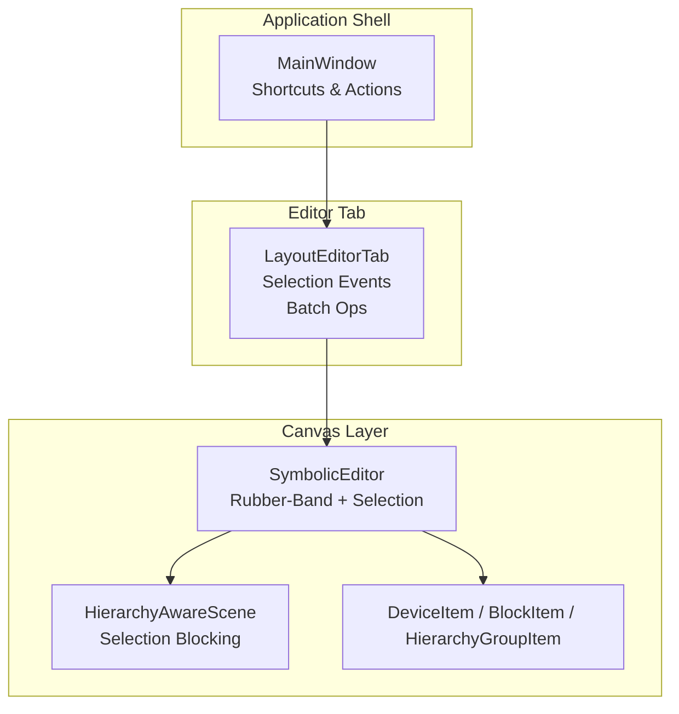
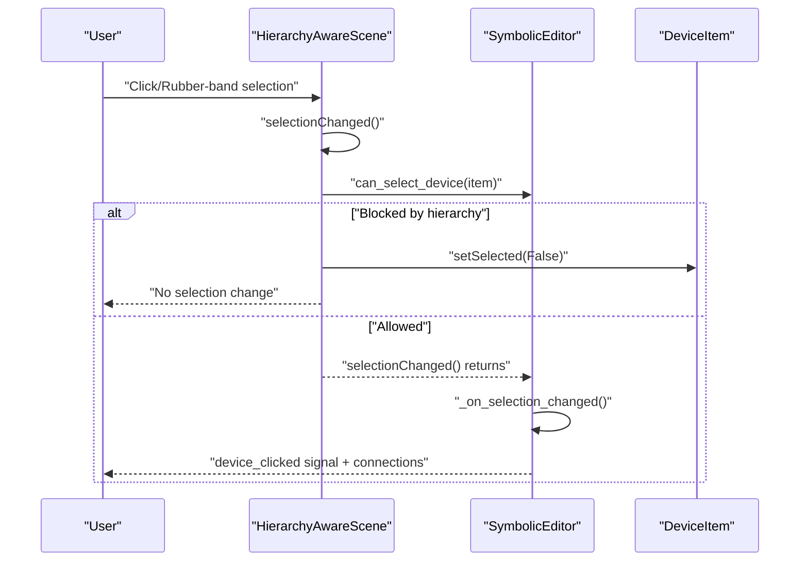
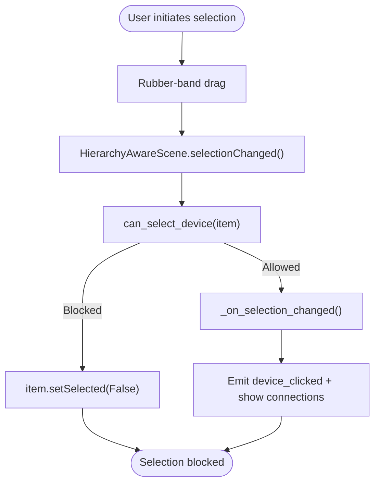
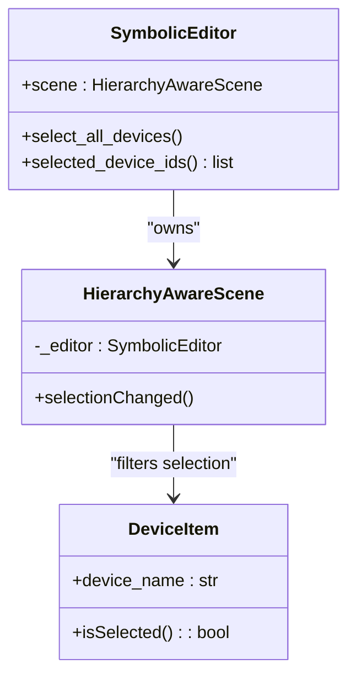
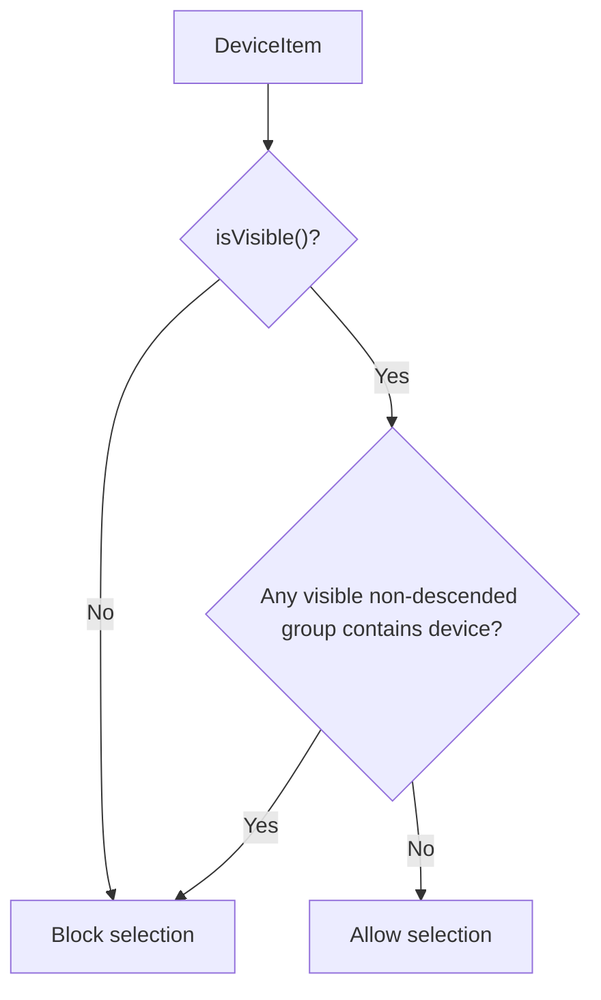
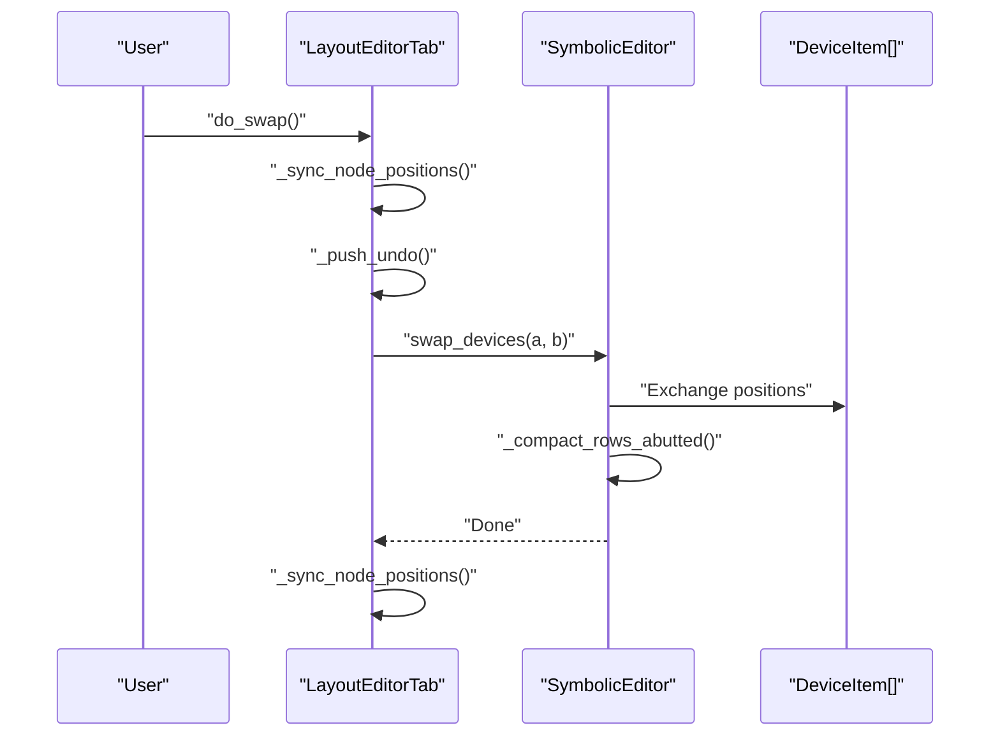
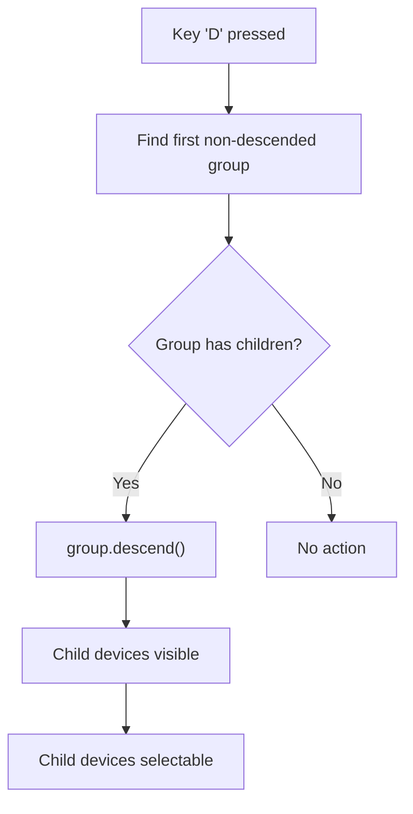
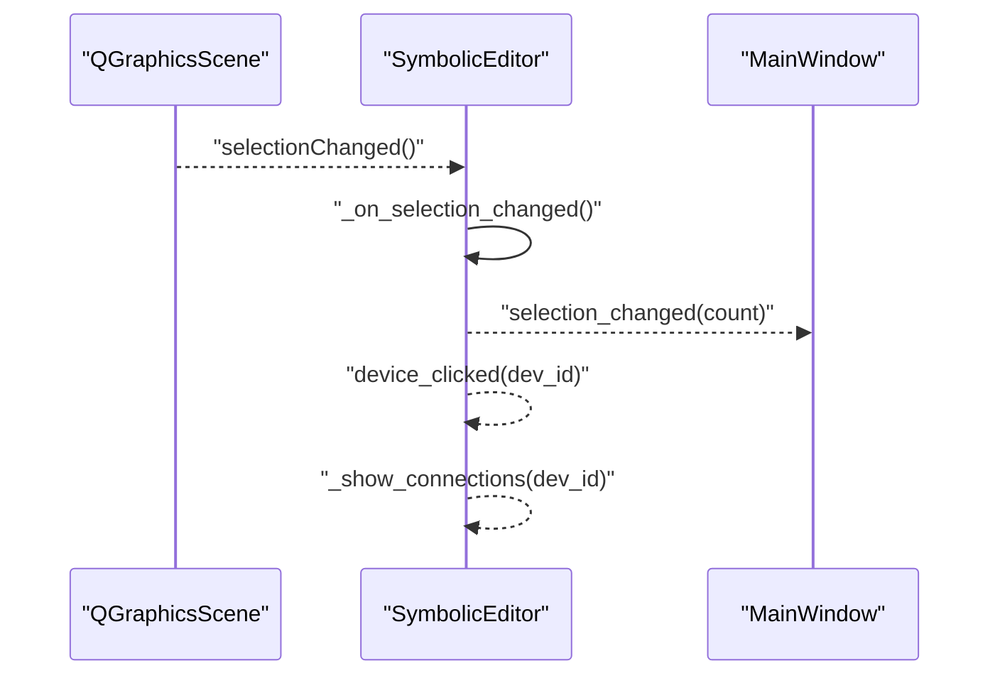
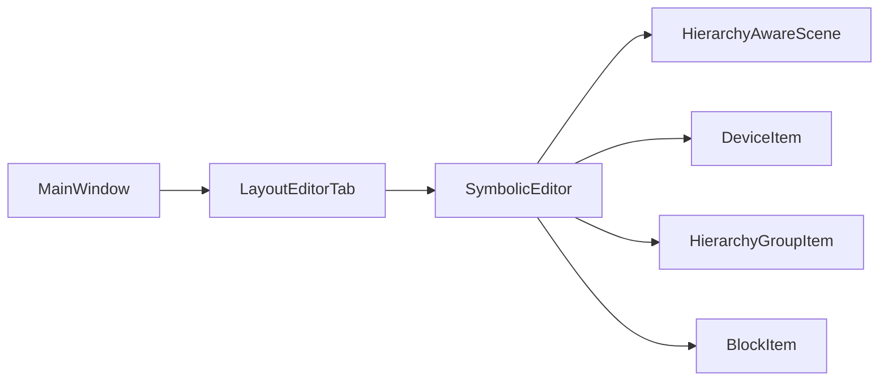

# Selection and Batch Operations

<cite>
**Referenced Files in This Document**
- [main.py](file://symbolic_editor/main.py)
- [editor_view.py](file://symbolic_editor/editor_view.py)
- [layout_tab.py](file://symbolic_editor/layout_tab.py)
- [device_item.py](file://symbolic_editor/device_item.py)
- [hierarchy_group_item.py](file://symbolic_editor/hierarchy_group_item.py)
- [block_item.py](file://symbolic_editor/block_item.py)
- [HIERARCHY_SELECTION_UPDATE.md](file://docs/HIERARCHY_SELECTION_UPDATE.md)
</cite>

## Table of Contents
1. [Introduction](#introduction)
2. [Project Structure](#project-structure)
3. [Core Components](#core-components)
4. [Architecture Overview](#architecture-overview)
5. [Detailed Component Analysis](#detailed-component-analysis)
6. [Dependency Analysis](#dependency-analysis)
7. [Performance Considerations](#performance-considerations)
8. [Troubleshooting Guide](#troubleshooting-guide)
9. [Conclusion](#conclusion)

## Introduction
This document explains the selection and batch operations in the canvas system, focusing on rubber-band selection, multi-device selection patterns, hierarchy-aware selection blocking, and batch manipulation workflows. It covers keyboard shortcuts, selection persistence across view changes, and integration with device manipulation operations. Practical examples demonstrate complex selection scenarios, and guidance is provided for performance optimization and state management.

## Project Structure
The selection and batch operation system spans several modules:
- Canvas and selection logic: SymbolicEditor and HierarchyAwareScene
- Device representation: DeviceItem, BlockItem, and HierarchyGroupItem
- Tab-level orchestration: LayoutEditorTab
- Application shell and shortcuts: main.py

**Diagram sources**
- [main.py:80-148](file://symbolic_editor/main.py#L80-L148)
- [layout_tab.py:64-229](file://symbolic_editor/layout_tab.py#L64-L229)
- [editor_view.py:81-108](file://symbolic_editor/editor_view.py#L81-L108)
- [device_item.py:17-52](file://symbolic_editor/device_item.py#L17-L52)
- [hierarchy_group_item.py:28-90](file://symbolic_editor/hierarchy_group_item.py#L28-L90)

**Section sources**
- [main.py:80-148](file://symbolic_editor/main.py#L80-L148)
- [layout_tab.py:64-229](file://symbolic_editor/layout_tab.py#L64-L229)
- [editor_view.py:81-108](file://symbolic_editor/editor_view.py#L81-L108)

## Core Components
- HierarchyAwareScene: Intercepts selection events at the Qt level and blocks selection of devices in non-descended hierarchies.
- SymbolicEditor: Manages rubber-band selection, hierarchy navigation, and emits selection-related signals.
- DeviceItem: Represents devices with selection, movement, and rendering capabilities.
- HierarchyGroupItem: Visual grouping for arrays/multipliers/fingers; controls visibility and selection rules.
- LayoutEditorTab: Coordinates batch operations (swap, flip, delete), selection synchronization, and undo/redo.

**Section sources**
- [editor_view.py:39-79](file://symbolic_editor/editor_view.py#L39-L79)
- [editor_view.py:81-108](file://symbolic_editor/editor_view.py#L81-L108)
- [device_item.py:17-52](file://symbolic_editor/device_item.py#L17-L52)
- [hierarchy_group_item.py:28-90](file://symbolic_editor/hierarchy_group_item.py#L28-L90)
- [layout_tab.py:736-820](file://symbolic_editor/layout_tab.py#L736-L820)

## Architecture Overview
The selection system enforces hierarchy-aware selection blocking through a layered approach:
1. Scene-level interception: HierarchyAwareScene.selectionChanged() blocks selection attempts for non-descended hierarchy groups.
2. Editor-level enforcement: _on_selection_changed() performs a secondary check and emits device selection signals.
3. Keyboard shortcuts: D and Escape keys control hierarchy descent/ascension.
4. Batch operations: LayoutEditorTab exposes batch actions (swap, flip, delete) that operate on selected devices.

**Diagram sources**
- [editor_view.py:39-79](file://symbolic_editor/editor_view.py#L39-L79)
- [editor_view.py:802-826](file://symbolic_editor/editor_view.py#L802-L826)
- [editor_view.py:1502-1546](file://symbolic_editor/editor_view.py#L1502-L1546)

**Section sources**
- [editor_view.py:39-79](file://symbolic_editor/editor_view.py#L39-L79)
- [editor_view.py:802-826](file://symbolic_editor/editor_view.py#L802-L826)
- [editor_view.py:1502-1546](file://symbolic_editor/editor_view.py#L1502-L1546)

## Detailed Component Analysis

### Rubber-Band Selection Mechanism
- Rubber-band selection is enabled via QGraphicsView.DragMode.RubberBandDrag.
- Selection filtering occurs at two levels:
  - Scene-level: HierarchyAwareScene intercepts selection events and deselects devices in non-descended hierarchies.
  - Editor-level: _on_selection_changed() re-validates selection and emits device_clicked.

**Diagram sources**
- [editor_view.py:39-79](file://symbolic_editor/editor_view.py#L39-L79)
- [editor_view.py:802-826](file://symbolic_editor/editor_view.py#L802-L826)
- [editor_view.py:1502-1546](file://symbolic_editor/editor_view.py#L1502-L1546)

**Section sources**
- [editor_view.py:101-102](file://symbolic_editor/editor_view.py#L101-L102)
- [editor_view.py:39-79](file://symbolic_editor/editor_view.py#L39-L79)
- [editor_view.py:1502-1546](file://symbolic_editor/editor_view.py#L1502-L1546)

### Multi-Device Selection Patterns
- Programmatic selection: select_all_devices() selects all DeviceItem instances.
- Batch selection: Ctrl+Click in the device tree or Shift+drag in the canvas selects multiple items.
- Selection retrieval: selected_device_ids() returns device identifiers for batch operations.

**Diagram sources**
- [editor_view.py:221-224](file://symbolic_editor/editor_view.py#L221-L224)
- [editor_view.py:1146-1154](file://symbolic_editor/editor_view.py#L1146-L1154)
- [device_item.py:24-26](file://symbolic_editor/device_item.py#L24-L26)

**Section sources**
- [editor_view.py:221-224](file://symbolic_editor/editor_view.py#L221-L224)
- [editor_view.py:1146-1154](file://symbolic_editor/editor_view.py#L1146-L1154)
- [layout_tab.py:736-739](file://symbolic_editor/layout_tab.py#L736-L739)

### Selection Filtering Based on Hierarchy Levels
- can_select_device(): Determines if a device can be selected based on its hierarchy group visibility and descent state.
- Hierarchy-aware visibility: HierarchyGroupItem controls visibility of child devices and groups depending on _is_descended.

**Diagram sources**
- [editor_view.py:802-826](file://symbolic_editor/editor_view.py#L802-L826)
- [hierarchy_group_item.py:102-124](file://symbolic_editor/hierarchy_group_item.py#L102-L124)

**Section sources**
- [editor_view.py:802-826](file://symbolic_editor/editor_view.py#L802-L826)
- [hierarchy_group_item.py:102-124](file://symbolic_editor/hierarchy_group_item.py#L102-L124)

### Batch Manipulation Operations
- Swap: do_swap() exchanges positions of exactly two devices and compacts rows afterward.
- Flip: do_flip_h() and do_flip_v() flip selected devices horizontally or vertically.
- Delete: do_delete() removes selected devices and updates the layout.
- Group selection: HierarchyGroupItem supports multi-device selection and movement as a unit.

**Diagram sources**
- [layout_tab.py:740-749](file://symbolic_editor/layout_tab.py#L740-L749)
- [editor_view.py:1034-1045](file://symbolic_editor/editor_view.py#L1034-L1045)

**Section sources**
- [layout_tab.py:740-803](file://symbolic_editor/layout_tab.py#L740-L803)
- [editor_view.py:1034-1045](file://symbolic_editor/editor_view.py#L1034-L1045)

### Hierarchy Selection Rules and Navigation
- Descend: keyPressEvent() handles 'D' to descend into the nearest non-descended hierarchy group.
- Ascend: Escape ascends from any descended hierarchy group.
- Utility methods: descend_nearest_hierarchy(), ascend_all_hierarchy(), descend_selected_hierarchy().

**Diagram sources**
- [editor_view.py:1582-1599](file://symbolic_editor/editor_view.py#L1582-L1599)
- [editor_view.py:878-896](file://symbolic_editor/editor_view.py#L878-L896)

**Section sources**
- [editor_view.py:1582-1599](file://symbolic_editor/editor_view.py#L1582-L1599)
- [editor_view.py:878-896](file://symbolic_editor/editor_view.py#L878-L896)

### Selection Change Event Handling
- _on_selection_changed(): Validates remaining selection, deselects invalid items, emits device_clicked, and draws connections.
- MainWindow synchronization: selection_changed signal updates toolbar and status indicators.

**Diagram sources**
- [editor_view.py:1502-1546](file://symbolic_editor/editor_view.py#L1502-L1546)
- [layout_tab.py:629-632](file://symbolic_editor/layout_tab.py#L629-L632)
- [main.py:209-210](file://symbolic_editor/main.py#L209-L210)

**Section sources**
- [editor_view.py:1502-1546](file://symbolic_editor/editor_view.py#L1502-L1546)
- [layout_tab.py:629-632](file://symbolic_editor/layout_tab.py#L629-L632)
- [main.py:209-210](file://symbolic_editor/main.py#L209-L210)

### Keyboard Shortcuts for Selection Operations
- Select All: Ctrl+A triggers select_all_devices().
- Swap: Ctrl+Shift+X triggers do_swap().
- Flip Horizontal/Vertical: Ctrl+H/Ctrl+J triggers do_flip_h()/do_flip_v().
- Delete: Delete triggers do_delete().
- Hierarchy navigation: D descends; Escape ascends.

**Section sources**
- [main.py:296-298](file://symbolic_editor/main.py#L296-L298)
- [main.py:467-480](file://symbolic_editor/main.py#L467-L480)
- [layout_tab.py:805-803](file://symbolic_editor/layout_tab.py#L805-L803)
- [editor_view.py:1582-1599](file://symbolic_editor/editor_view.py#L1582-L1599)

### Selection Persistence Across View Changes
- Selection state is maintained through device identifiers and can be synchronized across tabs.
- LayoutEditorTab.selection_count() and selection_changed signal keep UI counters updated.

**Section sources**
- [layout_tab.py:280-284](file://symbolic_editor/layout_tab.py#L280-L284)
- [layout_tab.py:629-632](file://symbolic_editor/layout_tab.py#L629-L632)
- [main.py:209-210](file://symbolic_editor/main.py#L209-L210)

### Practical Examples of Complex Selection Scenarios
- Large transistor array: Descend into hierarchy to select individual fingers; use Swap to exchange positions.
- Nested hierarchies: Press 'D' twice to reach finger-level selection; use Ascend to return.
- Mixed selection: Select multiple devices across hierarchy levels; perform batch flips or deletes.

**Section sources**
- [HIERARCHY_SELECTION_UPDATE.md:148-188](file://docs/HIERARCHY_SELECTION_UPDATE.md#L148-L188)
- [layout_tab.py:740-803](file://symbolic_editor/layout_tab.py#L740-L803)
- [editor_view.py:851-877](file://symbolic_editor/editor_view.py#L851-L877)

## Dependency Analysis
The selection and batch operation system exhibits clear separation of concerns:
- MainWindow delegates actions to LayoutEditorTab.
- LayoutEditorTab orchestrates SymbolicEditor and device items.
- SymbolicEditor composes HierarchyAwareScene and DeviceItem/HierarchyGroupItem.

**Diagram sources**
- [main.py:80-148](file://symbolic_editor/main.py#L80-L148)
- [layout_tab.py:64-229](file://symbolic_editor/layout_tab.py#L64-L229)
- [editor_view.py:81-108](file://symbolic_editor/editor_view.py#L81-L108)

**Section sources**
- [main.py:80-148](file://symbolic_editor/main.py#L80-L148)
- [layout_tab.py:64-229](file://symbolic_editor/layout_tab.py#L64-L229)
- [editor_view.py:81-108](file://symbolic_editor/editor_view.py#L81-L108)

## Performance Considerations
- Rubber-band selection is efficient due to Qt’s built-in drag mode.
- Hierarchy-aware selection blocking avoids expensive post-selection filtering by intercepting at the scene level.
- Batch operations compact rows after swaps or merges to minimize layout computation overhead.
- For very large layouts, consider disabling unnecessary visual updates (e.g., temporarily reducing connection line drawing) during bulk operations.

## Troubleshooting Guide
- Selection blocked unexpectedly: Verify hierarchy descent state; press 'D' to descend into the relevant group.
- No selection change after rubber-band: Confirm that devices belong to visible, descended hierarchy groups.
- Batch operations fail silently: Ensure exactly two devices are selected for Swap, and the same device type for Merge.
- Keyboard shortcuts not working: Confirm focus is on the editor canvas and shortcuts are not overridden by global actions.

**Section sources**
- [editor_view.py:802-826](file://symbolic_editor/editor_view.py#L802-L826)
- [layout_tab.py:740-788](file://symbolic_editor/layout_tab.py#L740-L788)
- [editor_view.py:1582-1599](file://symbolic_editor/editor_view.py#L1582-L1599)

## Conclusion
The selection and batch operation system integrates rubber-band selection, hierarchy-aware blocking, and keyboard-driven navigation to provide a robust and intuitive editing experience. By enforcing selection rules at the scene level and exposing powerful batch operations, the system supports complex layout manipulations while maintaining clarity and performance.