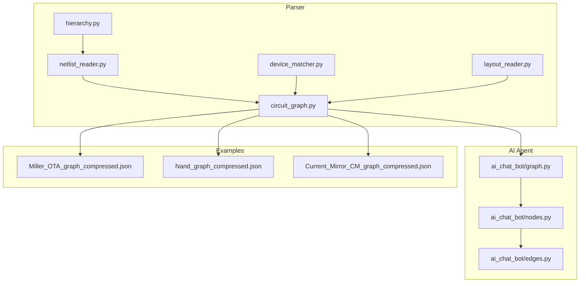
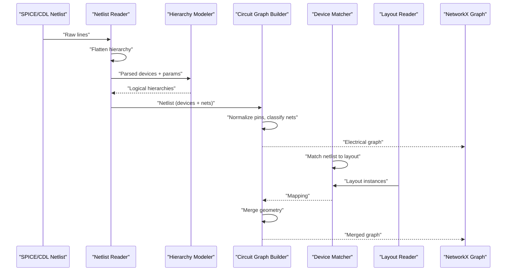
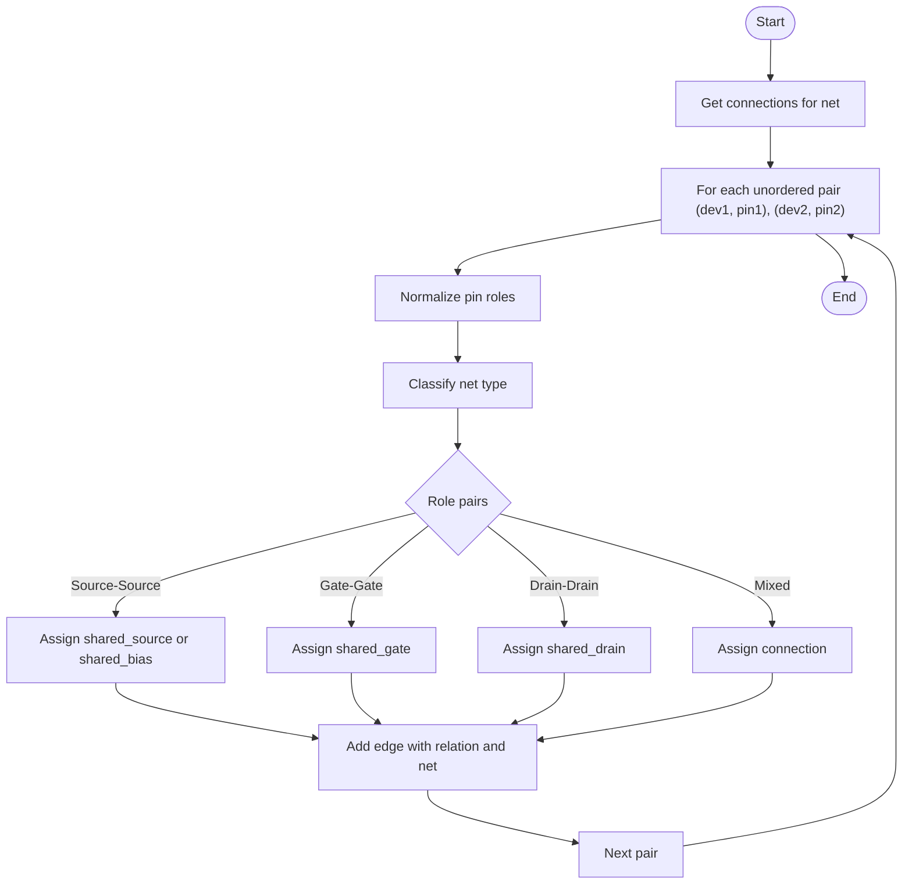
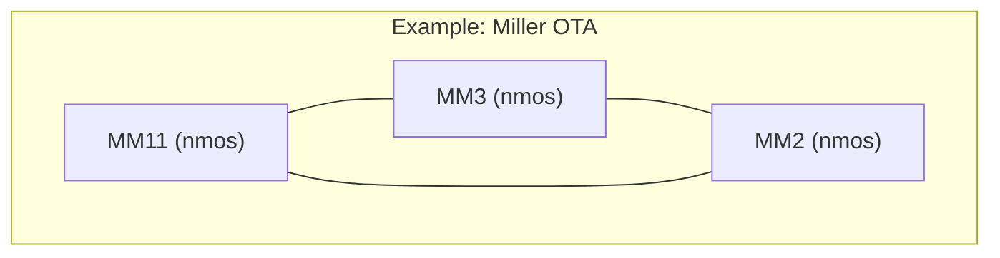
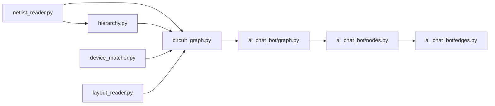
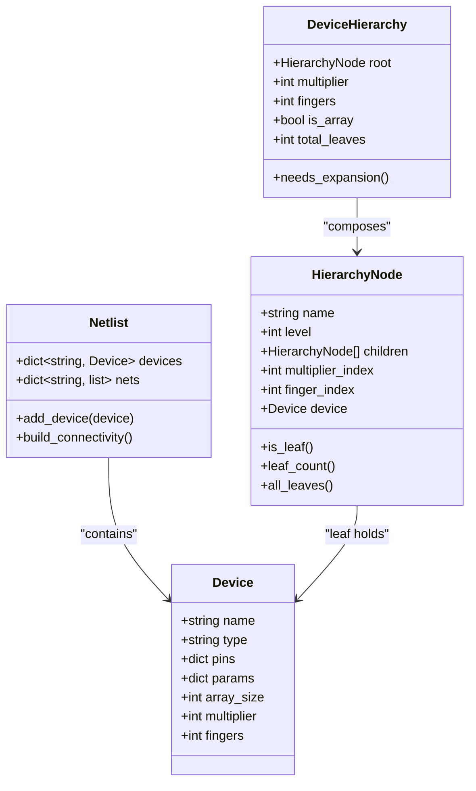

# Circuit Graph Construction

<cite>
**Referenced Files in This Document**
- [circuit_graph.py](file://parser/circuit_graph.py)
- [netlist_reader.py](file://parser/netlist_reader.py)
- [hierarchy.py](file://parser/hierarchy.py)
- [device_matcher.py](file://parser/device_matcher.py)
- [layout_reader.py](file://parser/layout_reader.py)
- [graph.py](file://ai_agent/ai_chat_bot/graph.py)
- [nodes.py](file://ai_agent/ai_chat_bot/nodes.py)
- [edges.py](file://ai_agent/ai_chat_bot/edges.py)
- [Miller_OTA_graph_compressed.json](file://examples/Miller_OTA/Miller_OTA_graph_compressed.json)
- [Nand_graph_compressed.json](file://examples/Nand/Nand_graph_compressed.json)
- [Current_Mirror_CM_graph_compressed.json](file://examples/current_mirror/Current_Mirror_CM_graph_compressed.json)
</cite>

## Table of Contents
1. [Introduction](#introduction)
2. [Project Structure](#project-structure)
3. [Core Components](#core-components)
4. [Architecture Overview](#architecture-overview)
5. [Detailed Component Analysis](#detailed-component-analysis)
6. [Dependency Analysis](#dependency-analysis)
7. [Performance Considerations](#performance-considerations)
8. [Troubleshooting Guide](#troubleshooting-guide)
9. [Conclusion](#conclusion)
10. [Appendices](#appendices)

## Introduction
This document explains the circuit graph construction system that transforms SPICE netlists into traversable NetworkX graphs for analog layout automation. It covers:
- How SPICE netlists are parsed and flattened (including hierarchical subcircuits and device expansions).
- How device nodes are created with transistor parameters (W/L/nf).
- How nets are classified and edges are annotated with behavioral relations (bias, signal, gate, shared).
- How pin naming conventions are normalized to standardized roles (drain, gate, source, bulk).
- How spatial layout geometry is merged with the electrical graph.
- Example graphs and traversal patterns used for layout optimization.

## Project Structure
The circuit graph pipeline spans several modules:
- Parser: netlist parsing, hierarchy modeling, and graph construction.
- AI Agent: orchestration of topology analysis, placement, and DRC/routing stages.
- Examples: pre-built compressed graphs for verification and layout reuse.

**Diagram sources**
- [netlist_reader.py:1-855](file://parser/netlist_reader.py#L1-L855)
- [circuit_graph.py:1-191](file://parser/circuit_graph.py#L1-L191)
- [hierarchy.py:1-475](file://parser/hierarchy.py#L1-L475)
- [device_matcher.py:1-151](file://parser/device_matcher.py#L1-L151)
- [layout_reader.py:1-442](file://parser/layout_reader.py#L1-L442)
- [graph.py:1-52](file://ai_agent/ai_chat_bot/graph.py#L1-L52)
- [nodes.py:1-1016](file://ai_agent/ai_chat_bot/nodes.py#L1-L1016)
- [edges.py:1-24](file://ai_agent/ai_chat_bot/edges.py#L1-L24)
- [Miller_OTA_graph_compressed.json:1-56](file://examples/Miller_OTA/Miller_OTA_graph_compressed.json#L1-L56)
- [Nand_graph_compressed.json:1-57](file://examples/Nand/Nand_graph_compressed.json#L1-L57)
- [Current_Mirror_CM_graph_compressed.json:1-57](file://examples/current_mirror/Current_Mirror_CM_graph_compressed.json#L1-L57)

**Section sources**
- [circuit_graph.py:1-191](file://parser/circuit_graph.py#L1-L191)
- [netlist_reader.py:1-855](file://parser/netlist_reader.py#L1-L855)
- [hierarchy.py:1-475](file://parser/hierarchy.py#L1-L475)
- [device_matcher.py:1-151](file://parser/device_matcher.py#L1-L151)
- [layout_reader.py:1-442](file://parser/layout_reader.py#L1-L442)
- [graph.py:1-52](file://ai_agent/ai_chat_bot/graph.py#L1-L52)
- [nodes.py:1-1016](file://ai_agent/ai_chat_bot/nodes.py#L1-L1016)
- [edges.py:1-24](file://ai_agent/ai_chat_bot/edges.py#L1-L24)

## Core Components
- Netlist reader: Parses SPICE/CDL lines, flattens hierarchical subcircuits, builds connectivity, and extracts device parameters (including m, nf, array indices).
- Hierarchy modeler: Constructs logical device hierarchies for arrays, multipliers (m), and fingers (nf), enabling deterministic expansion and grouping.
- Circuit graph builder: Creates NetworkX graphs from the netlist, normalizes pins, classifies nets, and annotates edges with behavioral relations.
- Device matcher: Aligns netlist devices to layout instances, collapsing expanded multi-finger devices onto shared layout instances.
- Layout reader: Extracts device instances from OAS/GDS layouts, including geometry and orientation.
- AI agent pipeline: Orchestrates topology analysis, placement, DRC/routing, and human-in-the-loop refinement.

**Section sources**
- [netlist_reader.py:13-761](file://parser/netlist_reader.py#L13-L761)
- [hierarchy.py:44-475](file://parser/hierarchy.py#L44-L475)
- [circuit_graph.py:9-191](file://parser/circuit_graph.py#L9-L191)
- [device_matcher.py:85-151](file://parser/device_matcher.py#L85-L151)
- [layout_reader.py:14-442](file://parser/layout_reader.py#L14-L442)
- [graph.py:1-52](file://ai_agent/ai_chat_bot/graph.py#L1-L52)
- [nodes.py:325-1016](file://ai_agent/ai_chat_bot/nodes.py#L325-L1016)
- [edges.py:1-24](file://ai_agent/ai_chat_bot/edges.py#L1-L24)

## Architecture Overview
The system transforms SPICE netlists into NetworkX graphs and merges them with layout geometry for automated placement and optimization.

**Diagram sources**
- [netlist_reader.py:260-761](file://parser/netlist_reader.py#L260-L761)
- [hierarchy.py:219-475](file://parser/hierarchy.py#L219-L475)
- [circuit_graph.py:131-191](file://parser/circuit_graph.py#L131-L191)
- [device_matcher.py:85-151](file://parser/device_matcher.py#L85-L151)
- [layout_reader.py:357-442](file://parser/layout_reader.py#L357-L442)

## Detailed Component Analysis

### Netlist Parsing and Flattening
- Device parsing supports MOS, capacitors, and resistors, extracting parameters and resolving CDL-style entries.
- Hierarchical flattening resolves subcircuits (.SUBCKT/.ENDS), recursively expanding X-instances and remapping nets.
- Connectivity is built by mapping each net to a list of (device, pin) pairs.

Key behaviors:
- Numeric value parsing with unit scaling (f/p/n/u/m/k/meg/g).
- Array suffix parsing (<N>) and multi-level hierarchy reconstruction.
- Block-aware flattening to track top-level instance and subcircuit types.

**Section sources**
- [netlist_reader.py:74-101](file://parser/netlist_reader.py#L74-L101)
- [netlist_reader.py:121-318](file://parser/netlist_reader.py#L121-L318)
- [netlist_reader.py:325-457](file://parser/netlist_reader.py#L325-L457)
- [netlist_reader.py:478-761](file://parser/netlist_reader.py#L478-L761)

### Hierarchy Modeling for Arrays, Multipliers, and Fingers
- Supports three expansion modes:
  - Array suffix <N>: multiple copies of a parent.
  - Multiplier (m): replicated copies.
  - Finger (nf): parallel fingers per instance.
- Builds a hierarchy tree per logical device and reconstructs it from expanded devices.
- Enables deterministic expansion and grouping for matching and layout.

**Section sources**
- [hierarchy.py:44-93](file://parser/hierarchy.py#L44-L93)
- [hierarchy.py:219-309](file://parser/hierarchy.py#L219-L309)
- [hierarchy.py:316-418](file://parser/hierarchy.py#L316-L418)
- [hierarchy.py:434-475](file://parser/hierarchy.py#L434-L475)

### Device Node Creation and Parameter Extraction
- Nodes represent devices with type and parameters (W/L/nf).
- For MOS devices, parameters include channel length (l), finger count (nf), and derived nfin when present.
- Multi-finger devices are represented as separate nodes with parent linkage.

**Section sources**
- [circuit_graph.py:18-33](file://parser/circuit_graph.py#L18-L33)
- [circuit_graph.py:152-169](file://parser/circuit_graph.py#L152-L169)
- [netlist_reader.py:478-620](file://parser/netlist_reader.py#L478-L620)

### Pin Normalization Logic
- Converts pin names to standardized roles:
  - Drain: "D" or "1"
  - Gate: "G"
  - Source: "S" or "2"
  - Bulk: "B"
  - Other: unrecognized pin forms
- Used consistently across net classification and edge assignment.

**Section sources**
- [circuit_graph.py:9-15](file://parser/circuit_graph.py#L9-L15)

### Net Edge Classification and Behavioral Relations
- Net classification heuristics:
  - Bias: multiple source connections with no gate connections.
  - Signal: multiple drain connections with no gate connections.
  - Gate: multiple gate connections.
  - Other: mixed or insufficient counts.
- Edge assignment based on pin roles and net type:
  - Source-Source: shared_bias (if bias) or shared_source (otherwise).
  - Gate-Gate: shared_gate.
  - Drain-Drain: shared_drain.
  - Mixed roles: connection.

Supply nets (e.g., VDD/VSS/GND) are ignored to preserve meaningful graph semantics.

**Section sources**
- [circuit_graph.py:36-59](file://parser/circuit_graph.py#L36-L59)
- [circuit_graph.py:68-128](file://parser/circuit_graph.py#L68-L128)
- [circuit_graph.py:65](file://parser/circuit_graph.py#L65)

### Relationship Assignment Algorithm
- For each net, iterate all unordered pairs of connected devices.
- Normalize pins and infer net type.
- Assign relation based on role pairs and net type.
- Store relation and net name as edge attributes.

**Diagram sources**
- [circuit_graph.py:68-128](file://parser/circuit_graph.py#L68-L128)

### Merging Electrical Graph with Layout Geometry
- Merge layout instances into the electrical graph by:
  - Attaching layout geometry (x, y, width, height, orientation) to device nodes.
  - Retaining electrical relations and adding spatial proximity edges as needed.
- Mapping is performed by aligning netlist device names to layout indices.

**Section sources**
- [circuit_graph.py:142-191](file://parser/circuit_graph.py#L142-L191)
- [device_matcher.py:85-151](file://parser/device_matcher.py#L85-L151)
- [layout_reader.py:357-442](file://parser/layout_reader.py#L357-L442)

### Example Graphs and Traversal Patterns
- Example graphs include device types, default dimensions, and per-device terminal nets.
- Typical traversal patterns for layout optimization:
  - BFS/DFS from bias nodes to propagate voltage levels.
  - Gate-sharing detection to identify mirror pairs.
  - Drain-sharing to identify load pairs and differential branches.
  - Supply net filtering to avoid trivial connectivity.

**Diagram sources**
- [Miller_OTA_graph_compressed.json:25-56](file://examples/Miller_OTA/Miller_OTA_graph_compressed.json#L25-L56)

**Section sources**
- [Miller_OTA_graph_compressed.json:1-56](file://examples/Miller_OTA/Miller_OTA_graph_compressed.json#L1-L56)
- [Nand_graph_compressed.json:1-57](file://examples/Nand/Nand_graph_compressed.json#L1-L57)
- [Current_Mirror_CM_graph_compressed.json:1-57](file://examples/current_mirror/Current_Mirror_CM_graph_compressed.json#L1-L57)

## Dependency Analysis
- Parser modules depend on each other to produce a validated netlist and hierarchy.
- Circuit graph builder depends on the netlist and pin normalization.
- Device matcher and layout reader provide spatial alignment for merged graphs.
- AI agent orchestrates topology analysis and placement using the constructed graphs.

**Diagram sources**
- [netlist_reader.py:1-855](file://parser/netlist_reader.py#L1-L855)
- [hierarchy.py:1-475](file://parser/hierarchy.py#L1-L475)
- [circuit_graph.py:1-191](file://parser/circuit_graph.py#L1-L191)
- [device_matcher.py:1-151](file://parser/device_matcher.py#L1-L151)
- [layout_reader.py:1-442](file://parser/layout_reader.py#L1-L442)
- [graph.py:1-52](file://ai_agent/ai_chat_bot/graph.py#L1-L52)
- [nodes.py:1-1016](file://ai_agent/ai_chat_bot/nodes.py#L1-L1016)
- [edges.py:1-24](file://ai_agent/ai_chat_bot/edges.py#L1-L24)

**Section sources**
- [circuit_graph.py:131-191](file://parser/circuit_graph.py#L131-L191)
- [device_matcher.py:85-151](file://parser/device_matcher.py#L85-L151)
- [layout_reader.py:357-442](file://parser/layout_reader.py#L357-L442)
- [graph.py:1-52](file://ai_agent/ai_chat_bot/graph.py#L1-L52)
- [nodes.py:325-1016](file://ai_agent/ai_chat_bot/nodes.py#L325-L1016)
- [edges.py:1-24](file://ai_agent/ai_chat_bot/edges.py#L1-L24)

## Performance Considerations
- Net classification and edge assignment are quadratic in the number of connections per net; typical nets have small fan-out, keeping costs manageable.
- Supply net filtering avoids dense connectivity that could distort graph semantics.
- Hierarchical flattening and parameter parsing are linear in the number of lines and devices.
- Matching collapses expanded multi-finger devices to reduce graph density and improve traversal efficiency.

## Troubleshooting Guide
Common issues and resolutions:
- Unexpected edge relations:
  - Verify pin normalization and ensure pin names match expected conventions.
  - Confirm net classification thresholds and supply net filtering.
- Mismatched device counts:
  - Use device matcher to collapse expanded multi-finger devices onto shared layout instances.
  - Validate hierarchical expansion and array/multiplier/finger parameters.
- Layout geometry misalignment:
  - Confirm mapping keys and layout instance extraction.
  - Check orientation and coordinate transforms when merging geometry.

**Section sources**
- [circuit_graph.py:36-59](file://parser/circuit_graph.py#L36-L59)
- [circuit_graph.py:68-128](file://parser/circuit_graph.py#L68-L128)
- [device_matcher.py:85-151](file://parser/device_matcher.py#L85-L151)
- [layout_reader.py:357-442](file://parser/layout_reader.py#L357-L442)

## Conclusion
The circuit graph construction system integrates SPICE parsing, hierarchy modeling, and graph building to support automated analog layout. By normalizing pins, classifying nets, and annotating edges with behavioral relations, it enables targeted traversal patterns for layout optimization. Merging with layout geometry and leveraging the AI agent pipeline completes the end-to-end workflow for modern analog synthesis.

## Appendices

### Class Diagram: Core Data Structures

**Diagram sources**
- [netlist_reader.py:13-72](file://parser/netlist_reader.py#L13-L72)
- [hierarchy.py:133-177](file://parser/hierarchy.py#L133-L177)
- [hierarchy.py:183-217](file://parser/hierarchy.py#L183-L217)