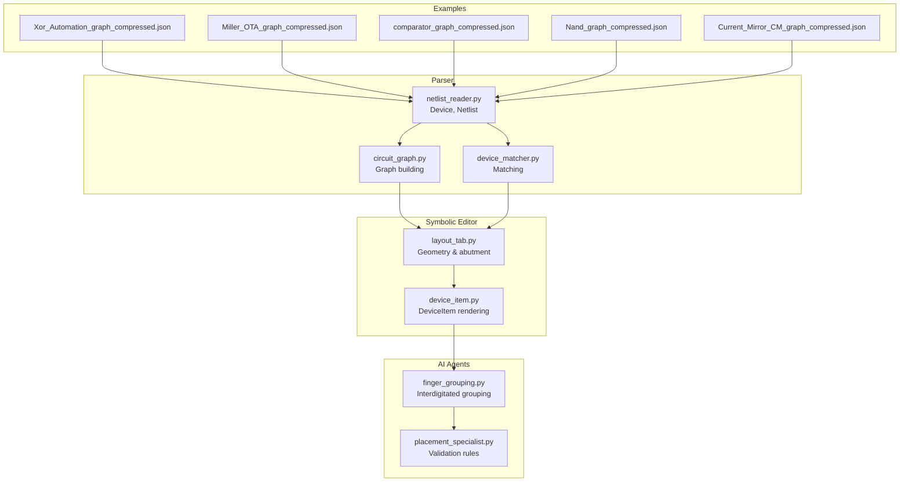
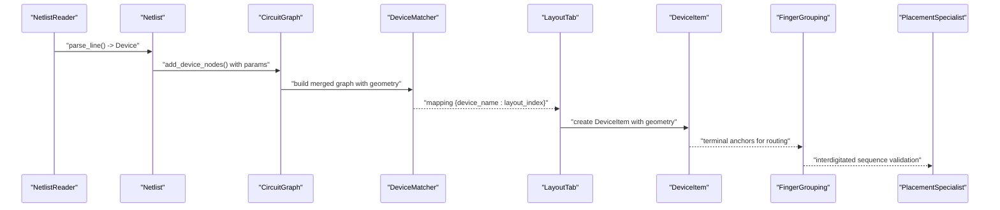
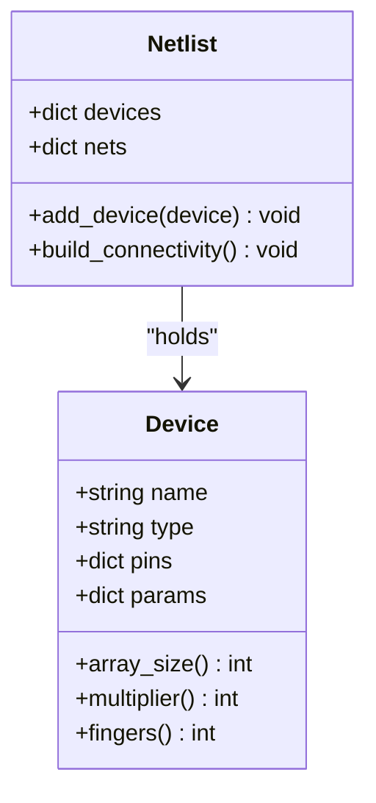
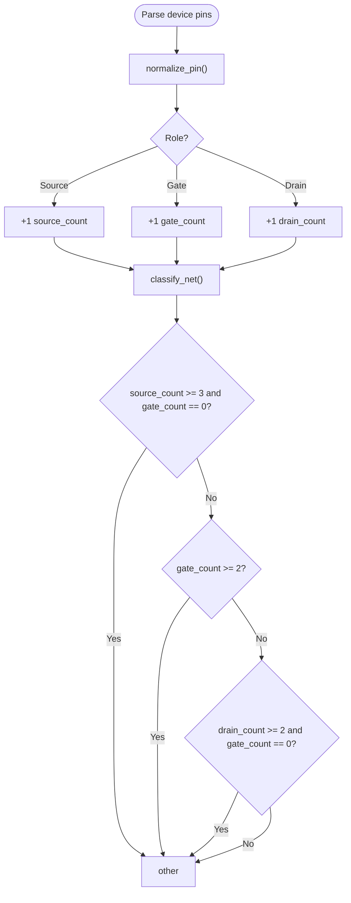
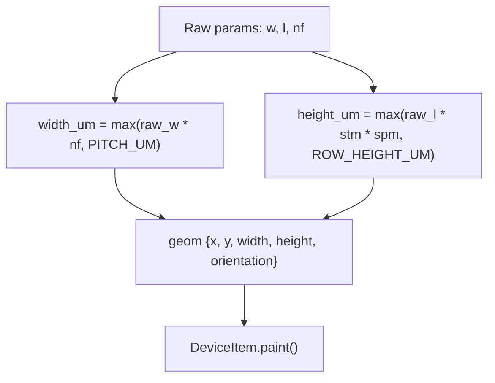
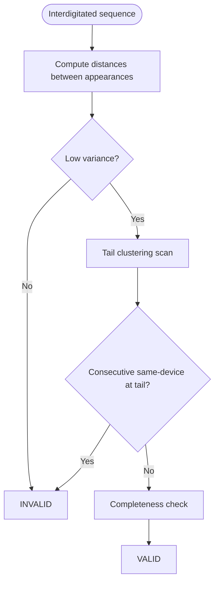
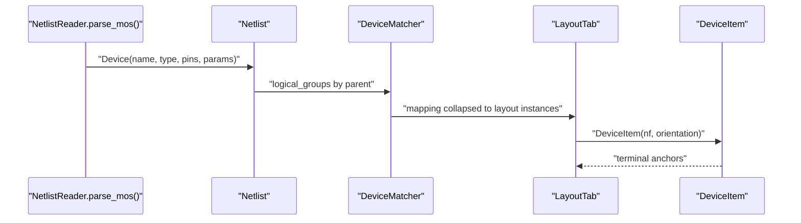
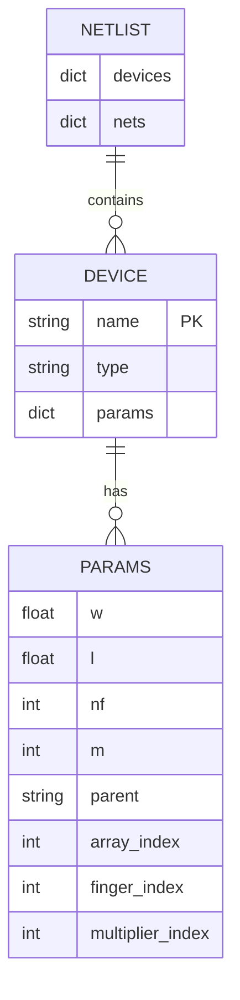
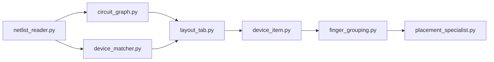

# Device Data Model

<cite>
**Referenced Files in This Document**
- [circuit_graph.py](file://parser/circuit_graph.py)
- [device_matcher.py](file://parser/device_matcher.py)
- [netlist_reader.py](file://parser/netlist_reader.py)
- [device_item.py](file://symbolic_editor/device_item.py)
- [layout_tab.py](file://symbolic_editor/layout_tab.py)
- [finger_grouping.py](file://ai_agent/ai_chat_bot/finger_grouping.py)
- [placement_specialist.py](file://ai_agent/ai_chat_bot/agents/placement_specialist.py)
- [Xor_Automation_graph_compressed.json](file://examples/xor/Xor_Automation_graph_compressed.json)
- [Miller_OTA_graph_compressed.json](file://examples/Miller_OTA/Miller_OTA_graph_compressed.json)
- [comparator_graph_compressed.json](file://examples/comparator/comparator_graph_compressed.json)
- [Nand_graph_compressed.json](file://examples/Nand/Nand_graph_compressed.json)
- [Current_Mirror_CM_graph_compressed.json](file://examples/current_mirror/Current_Mirror_CM_graph_compressed.json)
</cite>

## Table of Contents
1. [Introduction](#introduction)
2. [Project Structure](#project-structure)
3. [Core Components](#core-components)
4. [Architecture Overview](#architecture-overview)
5. [Detailed Component Analysis](#detailed-component-analysis)
6. [Dependency Analysis](#dependency-analysis)
7. [Performance Considerations](#performance-considerations)
8. [Troubleshooting Guide](#troubleshooting-guide)
9. [Conclusion](#conclusion)

## Introduction
This document describes the device data model used to represent PMOS/NMOS transistors in the circuit and layout automation pipeline. It covers device identification, type classification, parameter storage (including width, length, and finger count), terminal connection semantics, geometric parameter handling for layout integration, validation rules, and practical usage patterns across circuit analysis and layout generation. It also documents property inheritance and modification patterns for multi-finger and hierarchical devices.

## Project Structure
The device data model spans several modules:
- Parser: constructs device objects from netlists, extracts parameters, and builds connectivity graphs.
- Symbolic Editor: renders devices, exposes terminal anchors, and manages layout geometry.
- AI Agents: orchestrate matching, grouping, and placement of devices with validation rules.
- Examples: demonstrate device usage in real circuits with terminal nets and device parameters.

**Diagram sources**
- [netlist_reader.py:13-72](file://parser/netlist_reader.py#L13-L72)
- [circuit_graph.py:18-191](file://parser/circuit_graph.py#L18-L191)
- [device_matcher.py:85-151](file://parser/device_matcher.py#L85-L151)
- [device_item.py:17-508](file://symbolic_editor/device_item.py#L17-L508)
- [layout_tab.py:1272-1296](file://symbolic_editor/layout_tab.py#L1272-L1296)
- [finger_grouping.py:337-459](file://ai_agent/ai_chat_bot/finger_grouping.py#L337-L459)
- [placement_specialist.py:415-551](file://ai_agent/ai_chat_bot/agents/placement_specialist.py#L415-L551)
- [Xor_Automation_graph_compressed.json:1-57](file://examples/xor/Xor_Automation_graph_compressed.json#L1-L57)

**Section sources**
- [netlist_reader.py:13-72](file://parser/netlist_reader.py#L13-L72)
- [circuit_graph.py:18-191](file://parser/circuit_graph.py#L18-L191)
- [device_matcher.py:85-151](file://parser/device_matcher.py#L85-L151)
- [device_item.py:17-508](file://symbolic_editor/device_item.py#L17-L508)
- [layout_tab.py:1272-1296](file://symbolic_editor/layout_tab.py#L1272-L1296)
- [finger_grouping.py:337-459](file://ai_agent/ai_chat_bot/finger_grouping.py#L337-L459)
- [placement_specialist.py:415-551](file://ai_agent/ai_chat_bot/agents/placement_specialist.py#L415-L551)
- [Xor_Automation_graph_compressed.json:1-57](file://examples/xor/Xor_Automation_graph_compressed.json#L1-L57)

## Core Components
- Device class: encapsulates device identification, type, pins, and parameters. It exposes convenience properties for array/multiplier/finger metadata.
- Netlist: aggregates devices and builds connectivity mappings from nets to device pins.
- Circuit Graph: transforms netlist into a NetworkX graph with device nodes enriched with parameters and layout geometry.
- DeviceItem: renders multi-finger transistors, computes terminal anchors, and manages layout geometry and orientation.
- Device Matcher: maps netlist devices to layout instances, handling multi-finger and hierarchical expansions.
- Finger Grouping and Placement Specialist: validate and generate interdigitated layouts with spacing uniformity and completeness checks.

**Section sources**
- [netlist_reader.py:13-72](file://parser/netlist_reader.py#L13-L72)
- [circuit_graph.py:18-191](file://parser/circuit_graph.py#L18-L191)
- [device_item.py:17-508](file://symbolic_editor/device_item.py#L17-L508)
- [device_matcher.py:85-151](file://parser/device_matcher.py#L85-L151)
- [finger_grouping.py:337-459](file://ai_agent/ai_chat_bot/finger_grouping.py#L337-L459)
- [placement_specialist.py:415-551](file://ai_agent/ai_chat_bot/agents/placement_specialist.py#L415-L551)

## Architecture Overview
The device data model integrates parsing, graph construction, layout geometry, and validation:

**Diagram sources**
- [netlist_reader.py:700-762](file://parser/netlist_reader.py#L700-L762)
- [circuit_graph.py:142-191](file://parser/circuit_graph.py#L142-L191)
- [device_matcher.py:85-151](file://parser/device_matcher.py#L85-L151)
- [layout_tab.py:1272-1296](file://symbolic_editor/layout_tab.py#L1272-L1296)
- [device_item.py:453-508](file://symbolic_editor/device_item.py#L453-L508)
- [finger_grouping.py:337-459](file://ai_agent/ai_chat_bot/finger_grouping.py#L337-L459)
- [placement_specialist.py:415-551](file://ai_agent/ai_chat_bot/agents/placement_specialist.py#L415-L551)

## Detailed Component Analysis

### Device Class Structure
- Identification: name, type (nmos/pmos/cap/res), pins dictionary mapping pin names to nets.
- Parameters: stored in params dict; includes width (w), length (l), finger count (nf), multiplier (m), and hierarchy metadata (parent, array_index, finger_index, multiplier_index).
- Convenience properties: array_size, multiplier, fingers expose frequently accessed metadata.

**Diagram sources**
- [netlist_reader.py:13-72](file://parser/netlist_reader.py#L13-L72)

**Section sources**
- [netlist_reader.py:13-72](file://parser/netlist_reader.py#L13-L72)

### Terminal Connection System
- Pins are normalized to roles: drain, gate, source, bulk, other.
- Netlist connectivity maps nets to device-pin tuples.
- Terminal anchors are computed for routing and abutment decisions.

**Diagram sources**
- [circuit_graph.py:9-127](file://parser/circuit_graph.py#L9-L127)

**Section sources**
- [circuit_graph.py:9-127](file://parser/circuit_graph.py#L9-L127)

### Geometric Parameter Handling for Layout Integration
- Layout instances carry x, y, width, height, and orientation.
- DeviceItem renders multi-finger transistors with visual proportions and terminal labels.
- LayoutTab computes derived dimensions from raw parameters (w, l, nf) and enforces minimum sizes.

**Diagram sources**
- [layout_tab.py:1272-1296](file://symbolic_editor/layout_tab.py#L1272-L1296)
- [device_item.py:247-508](file://symbolic_editor/device_item.py#L247-L508)

**Section sources**
- [layout_tab.py:1272-1296](file://symbolic_editor/layout_tab.py#L1272-L1296)
- [device_item.py:247-508](file://symbolic_editor/device_item.py#L247-L508)

### Device Validation Rules and Parameter Constraints
- Interdigitated sequence validation includes:
  - Spacing uniformity: distances between consecutive appearances must be evenly distributed.
  - Tail clustering detection: avoid placing remaining fingers of one device at the tail while others remain unplaced.
  - Completeness verification: every finger appears exactly once and total length equals sum of nf_i.
- Universal constraints:
  - Slot assignment per row only.
  - Work at finger level (e.g., MM1_f1, MM1_f2).
  - Coordinate derivation: x = slot_index × 0.294.
  - Phases: Phase 1 slots → Phase 2 coordinates → Phase 3 validation.
  - If any phase fails → stop and output error.

**Diagram sources**
- [placement_specialist.py:519-551](file://ai_agent/ai_chat_bot/agents/placement_specialist.py#L519-L551)

**Section sources**
- [placement_specialist.py:415-551](file://ai_agent/ai_chat_bot/agents/placement_specialist.py#L415-L551)

### Property Inheritance and Modification Patterns
- Hierarchical expansion preserves parent-child relationships:
  - Multiplier + finger expansion: creates children with m and f indices, each with nf=1 and parent set.
  - Array-indexed devices: grouped under a parent with array_index and multiplier_index preserved.
- DeviceMatcher collapses expanded logical devices onto shared layout instances when counts match.
- DeviceItem supports flipping and orientation for layout variants.

**Diagram sources**
- [netlist_reader.py:478-621](file://parser/netlist_reader.py#L478-L621)
- [device_matcher.py:59-151](file://parser/device_matcher.py#L59-L151)
- [layout_tab.py:1272-1296](file://symbolic_editor/layout_tab.py#L1272-L1296)
- [device_item.py:453-508](file://symbolic_editor/device_item.py#L453-L508)

**Section sources**
- [netlist_reader.py:478-621](file://parser/netlist_reader.py#L478-L621)
- [device_matcher.py:59-151](file://parser/device_matcher.py#L59-L151)
- [layout_tab.py:1272-1296](file://symbolic_editor/layout_tab.py#L1272-L1296)
- [device_item.py:453-508](file://symbolic_editor/device_item.py#L453-L508)

### Examples of Device Objects and Usage
- Example device entries show type classification (nmos/pm), multipliers (m), finger counts (nf), fin count (nfin), length (l), and terminal nets (D, G, S).
- These entries are consumed by the parser and used to construct graphs and layout instances.

**Diagram sources**
- [netlist_reader.py:13-72](file://parser/netlist_reader.py#L13-L72)
- [Xor_Automation_graph_compressed.json:25-57](file://examples/xor/Xor_Automation_graph_compressed.json#L25-L57)
- [Miller_OTA_graph_compressed.json:25-56](file://examples/Miller_OTA/Miller_OTA_graph_compressed.json#L25-L56)
- [comparator_graph_compressed.json:25-56](file://examples/comparator/comparator_graph_compressed.json#L25-L56)
- [Nand_graph_compressed.json:25-57](file://examples/Nand/Nand_graph_compressed.json#L25-L57)
- [Current_Mirror_CM_graph_compressed.json:25-57](file://examples/current_mirror/Current_Mirror_CM_graph_compressed.json#L25-L57)

**Section sources**
- [Xor_Automation_graph_compressed.json:25-57](file://examples/xor/Xor_Automation_graph_compressed.json#L25-L57)
- [Miller_OTA_graph_compressed.json:25-56](file://examples/Miller_OTA/Miller_OTA_graph_compressed.json#L25-L56)
- [comparator_graph_compressed.json:25-56](file://examples/comparator/comparator_graph_compressed.json#L25-L56)
- [Nand_graph_compressed.json:25-57](file://examples/Nand/Nand_graph_compressed.json#L25-L57)
- [Current_Mirror_CM_graph_compressed.json:25-57](file://examples/current_mirror/Current_Mirror_CM_graph_compressed.json#L25-L57)

## Dependency Analysis
- Parser depends on Device and Netlist to represent and connect devices.
- CircuitGraph consumes Netlist to produce an electrical graph enriched with geometry.
- DeviceMatcher relies on Netlist and layout instances to establish deterministic mappings.
- Symbolic Editor renders DeviceItem with geometry and orientation.
- AI Agents coordinate finger grouping and placement validation.

**Diagram sources**
- [netlist_reader.py:700-762](file://parser/netlist_reader.py#L700-L762)
- [circuit_graph.py:142-191](file://parser/circuit_graph.py#L142-L191)
- [device_matcher.py:85-151](file://parser/device_matcher.py#L85-L151)
- [layout_tab.py:1272-1296](file://symbolic_editor/layout_tab.py#L1272-L1296)
- [device_item.py:17-508](file://symbolic_editor/device_item.py#L17-L508)
- [finger_grouping.py:337-459](file://ai_agent/ai_chat_bot/finger_grouping.py#L337-L459)
- [placement_specialist.py:415-551](file://ai_agent/ai_chat_bot/agents/placement_specialist.py#L415-L551)

**Section sources**
- [netlist_reader.py:700-762](file://parser/netlist_reader.py#L700-L762)
- [circuit_graph.py:142-191](file://parser/circuit_graph.py#L142-L191)
- [device_matcher.py:85-151](file://parser/device_matcher.py#L85-L151)
- [layout_tab.py:1272-1296](file://symbolic_editor/layout_tab.py#L1272-L1296)
- [device_item.py:17-508](file://symbolic_editor/device_item.py#L17-L508)
- [finger_grouping.py:337-459](file://ai_agent/ai_chat_bot/finger_grouping.py#L337-L459)
- [placement_specialist.py:415-551](file://ai_agent/ai_chat_bot/agents/placement_specialist.py#L415-L551)

## Performance Considerations
- Prefer collapsing expanded logical devices onto shared layout instances to reduce matching overhead.
- Use minimal geometry updates by leveraging DeviceItem’s snap grid and orientation helpers.
- Validate interdigitated sequences early to avoid expensive retries.

## Troubleshooting Guide
- Count mismatches: DeviceMatcher logs warnings when netlist and layout counts differ; use logical grouping to collapse multi-finger devices.
- Orientation and flips: Use DeviceItem’s flip and orientation helpers to resolve layout variants.
- Interdigitated validation failures: Ensure spacing uniformity, avoid tail clustering, and verify completeness.

**Section sources**
- [device_matcher.py:116-149](file://parser/device_matcher.py#L116-L149)
- [device_item.py:155-192](file://symbolic_editor/device_item.py#L155-L192)
- [placement_specialist.py:519-551](file://ai_agent/ai_chat_bot/agents/placement_specialist.py#L519-L551)

## Conclusion
The device data model provides a robust foundation for representing PMOS/NMOS transistors across parsing, graph construction, layout rendering, and validation. By leveraging hierarchical parameterization, terminal normalization, and interdigitated grouping rules, the system supports scalable circuit analysis and layout generation with strong validation guarantees.