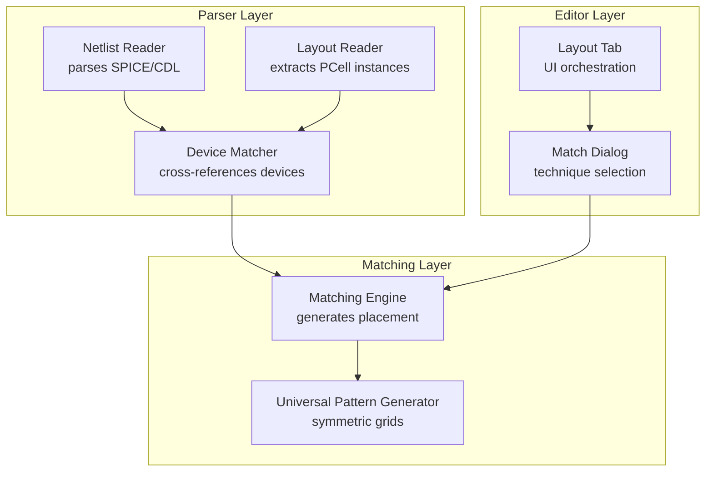
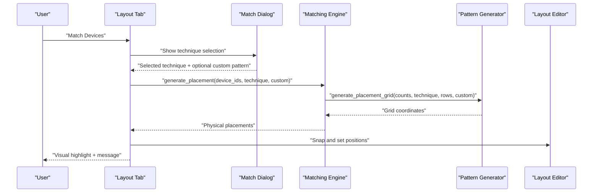
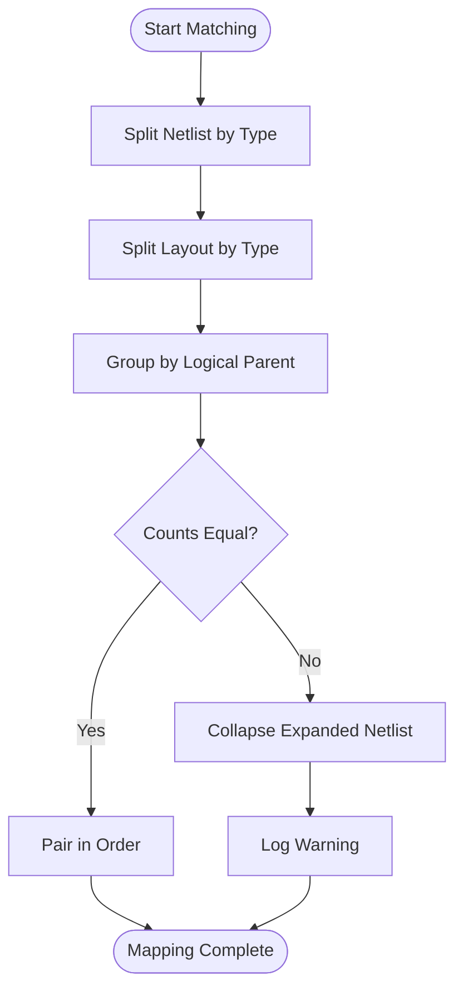
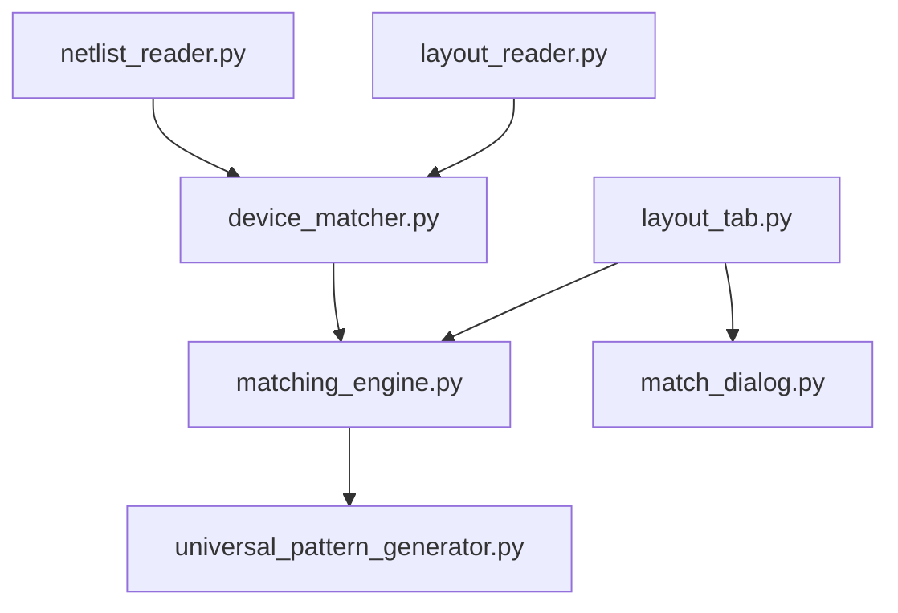

# Device Matching Algorithms

<cite>
**Referenced Files in This Document**
- [matching_engine.py](file://ai_agent/matching/matching_engine.py)
- [universal_pattern_generator.py](file://ai_agent/matching/universal_pattern_generator.py)
- [device_matcher.py](file://parser/device_matcher.py)
- [netlist_reader.py](file://parser/netlist_reader.py)
- [layout_reader.py](file://parser/layout_reader.py)
- [match_dialog.py](file://symbolic_editor/dialogs/match_dialog.py)
- [layout_tab.py](file://symbolic_editor/layout_tab.py)
- [validation_script.py](file://tests/validation_script.py)
- [test_match.py](file://tests/test_match.py)
- [test_match2.py](file://tests/test_match2.py)
- [test_match3.py](file://tests/test_match3.py)
</cite>

## Table of Contents
1. [Introduction](#introduction)
2. [Project Structure](#project-structure)
3. [Core Components](#core-components)
4. [Architecture Overview](#architecture-overview)
5. [Detailed Component Analysis](#detailed-component-analysis)
6. [Dependency Analysis](#dependency-analysis)
7. [Performance Considerations](#performance-considerations)
8. [Troubleshooting Guide](#troubleshooting-guide)
9. [Conclusion](#conclusion)
10. [Appendices](#appendices)

## Introduction
This document explains the device matching algorithms that connect schematic representations (netlist) with layout instances. It covers:
- Matching criteria: device type, multi-finger expansion, and geometric alignment
- Fuzzy matching logic: handling parameter variations and manufacturing tolerances
- Cross-reference mapping between netlist devices and layout geometries
- Validation to ensure matched devices maintain electrical equivalence
- Conflict resolution strategies for ambiguous matches and multiple candidates
- Examples of successful and failed matches with resolution strategies

## Project Structure
The matching pipeline spans three layers:
- Parser: parses netlist and layout to extract devices and parameters
- Matching Engine: generates placement patterns and applies them to layout instances
- Symbolic Editor: UI orchestration, dialog selection, and visual feedback

**Diagram sources**
- [netlist_reader.py:13-761](file://parser/netlist_reader.py#L13-L761)
- [layout_reader.py:14-441](file://parser/layout_reader.py#L14-L441)
- [device_matcher.py:85-150](file://parser/device_matcher.py#L85-L150)
- [matching_engine.py:5-84](file://ai_agent/matching/matching_engine.py#L5-L84)
- [universal_pattern_generator.py:9-104](file://ai_agent/matching/universal_pattern_generator.py#L9-L104)
- [layout_tab.py:824-847](file://symbolic_editor/layout_tab.py#L824-L847)
- [match_dialog.py:7-171](file://symbolic_editor/dialogs/match_dialog.py#L7-L171)

**Section sources**
- [netlist_reader.py:13-761](file://parser/netlist_reader.py#L13-L761)
- [layout_reader.py:14-441](file://parser/layout_reader.py#L14-L441)
- [device_matcher.py:85-150](file://parser/device_matcher.py#L85-L150)
- [matching_engine.py:5-84](file://ai_agent/matching/matching_engine.py#L5-L84)
- [universal_pattern_generator.py:9-104](file://ai_agent/matching/universal_pattern_generator.py#L9-L104)
- [layout_tab.py:824-847](file://symbolic_editor/layout_tab.py#L824-L847)
- [match_dialog.py:7-171](file://symbolic_editor/dialogs/match_dialog.py#L7-L171)

## Core Components
- Netlist Reader: constructs Device and Netlist objects, parses parameters (multiplier m, fingers nf), and flattens hierarchical netlists. See [Device:13-32](file://parser/netlist_reader.py#L13-L32) and [Netlist:51-72](file://parser/netlist_reader.py#L51-L72).
- Layout Reader: extracts device instances from OAS/GDS, including PCell parameters and bounding boxes. See [extract_layout_instances:357-441](file://parser/layout_reader.py#L357-L441).
- Device Matcher: splits netlist and layout by device type, sorts by natural keys, and performs deterministic matching with warnings for mismatches. See [match_devices:85-150](file://parser/device_matcher.py#L85-L150).
- Matching Engine: groups devices by logical parent, computes representative dimensions, and maps generated grid coordinates to physical positions. See [generate_placement:13-84](file://ai_agent/matching/matching_engine.py#L13-L84).
- Universal Pattern Generator: creates symmetric placement grids (interdigitated, common centroid, 2D cross-coupled, custom) with analytical audit. See [generate_placement_grid:9-104](file://ai_agent/matching/universal_pattern_generator.py#L9-L104).
- UI Orchestration: dialog selection and application of matching techniques. See [_MatchDialog:7-171](file://symbolic_editor/dialogs/match_dialog.py#L7-L171) and [do_match/_apply_matching:824-871](file://symbolic_editor/layout_tab.py#L824-L871).

**Section sources**
- [netlist_reader.py:13-761](file://parser/netlist_reader.py#L13-L761)
- [layout_reader.py:14-441](file://parser/layout_reader.py#L14-L441)
- [device_matcher.py:85-150](file://parser/device_matcher.py#L85-L150)
- [matching_engine.py:5-84](file://ai_agent/matching/matching_engine.py#L5-L84)
- [universal_pattern_generator.py:9-104](file://ai_agent/matching/universal_pattern_generator.py#L9-L104)
- [match_dialog.py:7-171](file://symbolic_editor/dialogs/match_dialog.py#L7-L171)
- [layout_tab.py:824-871](file://symbolic_editor/layout_tab.py#L824-L871)

## Architecture Overview
The matching pipeline proceeds as follows:
1. Parse netlist and layout to structured device lists.
2. Cross-reference devices by type and logical parent.
3. Generate a symmetric placement pattern.
4. Apply pattern to selected layout instances with snapping and visual feedback.

**Diagram sources**
- [layout_tab.py:824-871](file://symbolic_editor/layout_tab.py#L824-L871)
- [match_dialog.py:160-171](file://symbolic_editor/dialogs/match_dialog.py#L160-L171)
- [matching_engine.py:13-84](file://ai_agent/matching/matching_engine.py#L13-L84)
- [universal_pattern_generator.py:9-104](file://ai_agent/matching/universal_pattern_generator.py#L9-L104)

## Detailed Component Analysis

### Device Matching Criteria
- Device Type: NMOS/PMOS/resistor/capacitor classification is derived from netlist cell names and layout PCell names. See [split_layout_by_type:25-42](file://parser/device_matcher.py#L25-L42) and [extract_layout_instances:181-304](file://parser/layout_reader.py#L181-L304).
- Size Parameters: Multi-finger expansion is handled by flattening hierarchical netlists and tagging each child with parent, multiplier index, and finger index. See [parse_mos:478-620](file://parser/netlist_reader.py#L478-L620).
- Geometric Properties: Representative width and row height are computed from the first selected device’s bounding rectangle; row step equals height to ensure tight stacking. See [generate_placement:44-57](file://ai_agent/matching/matching_engine.py#L44-L57).

**Section sources**
- [device_matcher.py:25-42](file://parser/device_matcher.py#L25-L42)
- [layout_reader.py:181-304](file://parser/layout_reader.py#L181-L304)
- [netlist_reader.py:478-620](file://parser/netlist_reader.py#L478-L620)
- [matching_engine.py:44-57](file://ai_agent/matching/matching_engine.py#L44-L57)

### Fuzzy Matching Logic and Manufacturing Tolerances
- Count Mismatch Handling: When netlist and layout counts differ, the matcher attempts to collapse expanded multi-finger netlists onto shared layout instances and logs warnings. See [match_devices:111-136](file://parser/device_matcher.py#L111-L136).
- Spatial Sorting: Layout instances are sorted left-to-right, bottom-to-top to align with deterministic name ordering. See [sort_layout_by_position:80-82](file://parser/device_matcher.py#L80-L82).
- Parameter Variations: PCell parameters are parsed from layout references and merged into device entries for downstream use. See [_parse_pcell_params:44-83](file://parser/layout_reader.py#L44-L83).

**Section sources**
- [device_matcher.py:80-136](file://parser/device_matcher.py#L80-L136)
- [layout_reader.py:44-83](file://parser/layout_reader.py#L44-L83)

### Cross-Reference Mapping Between Netlist and Layout
- Grouping by Type and Parent: Netlist devices are grouped by type and logical parent; layout devices are grouped by cell type. See [split_netlist_by_type:45-56](file://parser/device_matcher.py#L45-L56) and [split_layout_by_type:25-42](file://parser/device_matcher.py#L25-L42).
- Deterministic Matching: When counts match, devices are paired in order; otherwise, collapsed multi-finger netlists are mapped to single layout instances with warnings. See [match_devices:111-136](file://parser/device_matcher.py#L111-L136).

**Diagram sources**
- [device_matcher.py:45-136](file://parser/device_matcher.py#L45-L136)

**Section sources**
- [device_matcher.py:45-136](file://parser/device_matcher.py#L45-L136)

### Validation for Electrical Equivalence
- Analytical Audit: The pattern generator enforces centroid equality within a tolerance to ensure symmetry and equivalence. See [_analytical_audit:106-130](file://ai_agent/matching/universal_pattern_generator.py#L106-L130).
- Geometry Validation Script: Compares total width of original fingers with AI-generated width to detect gross errors. See [verify_area:4-20](file://tests/validation_script.py#L4-L20).

**Section sources**
- [universal_pattern_generator.py:106-130](file://ai_agent/matching/universal_pattern_generator.py#L106-L130)
- [validation_script.py:4-20](file://tests/validation_script.py#L4-L20)

### Conflict Resolution Strategies
- Ambiguous Matches: When counts differ, the system collapses expanded multi-finger netlists onto shared layout instances and logs a warning. See [match_devices:116-136](file://parser/device_matcher.py#L116-L136).
- Multiple Candidates: The UI restricts selection to the same device type and applies the chosen technique uniformly. See [do_match:824-841](file://symbolic_editor/layout_tab.py#L824-L841).
- Symmetry Violations: The pattern generator raises exceptions for invalid configurations (e.g., COMMON_CENTROID_2D requiring even finger counts per device). See [SymmetryError:5-7](file://ai_agent/matching/universal_pattern_generator.py#L5-L7) and [generate_placement_grid:47-59](file://ai_agent/matching/universal_pattern_generator.py#L47-L59).

**Section sources**
- [device_matcher.py:116-136](file://parser/device_matcher.py#L116-L136)
- [layout_tab.py:824-841](file://symbolic_editor/layout_tab.py#L824-L841)
- [universal_pattern_generator.py:5-7](file://ai_agent/matching/universal_pattern_generator.py#L5-L7)
- [universal_pattern_generator.py:47-59](file://ai_agent/matching/universal_pattern_generator.py#L47-L59)

### Successful and Failed Match Examples
- Successful Match:
  - Scenario: Two NMOS devices with equal counts and matching logical parents; interdigitated pattern applied.
  - Outcome: Devices snapped to pattern, highlighted, and centroid audit passes.
  - References: [do_match:824-871](file://symbolic_editor/layout_tab.py#L824-L871), [generate_placement:13-84](file://ai_agent/matching/matching_engine.py#L13-L84), [generate_placement_grid:9-104](file://ai_agent/matching/universal_pattern_generator.py#L9-L104).
- Failed Match:
  - Scenario: COMMON_CENTROID_2D with odd finger counts per device.
  - Outcome: SymmetryError raised indicating invalid configuration.
  - References: [SymmetryError:5-7](file://ai_agent/matching/universal_pattern_generator.py#L5-L7), [generate_placement_grid:47-59](file://ai_agent/matching/universal_pattern_generator.py#L47-L59).
- Partial Match:
  - Scenario: Netlist has more devices than layout; collapsed mapping applied with warning.
  - Outcome: Devices mapped to shared instances; user notified.
  - References: [match_devices:116-136](file://parser/device_matcher.py#L116-L136).

**Section sources**
- [layout_tab.py:824-871](file://symbolic_editor/layout_tab.py#L824-L871)
- [matching_engine.py:13-84](file://ai_agent/matching/matching_engine.py#L13-L84)
- [universal_pattern_generator.py:5-7](file://ai_agent/matching/universal_pattern_generator.py#L5-L7)
- [universal_pattern_generator.py:47-104](file://ai_agent/matching/universal_pattern_generator.py#L47-L104)
- [device_matcher.py:116-136](file://parser/device_matcher.py#L116-L136)

## Dependency Analysis

**Diagram sources**
- [netlist_reader.py:13-761](file://parser/netlist_reader.py#L13-L761)
- [layout_reader.py:14-441](file://parser/layout_reader.py#L14-L441)
- [device_matcher.py:85-150](file://parser/device_matcher.py#L85-L150)
- [matching_engine.py:5-84](file://ai_agent/matching/matching_engine.py#L5-L84)
- [universal_pattern_generator.py:9-104](file://ai_agent/matching/universal_pattern_generator.py#L9-L104)
- [layout_tab.py:824-871](file://symbolic_editor/layout_tab.py#L824-L871)
- [match_dialog.py:7-171](file://symbolic_editor/dialogs/match_dialog.py#L7-L171)

**Section sources**
- [netlist_reader.py:13-761](file://parser/netlist_reader.py#L13-L761)
- [layout_reader.py:14-441](file://parser/layout_reader.py#L14-L441)
- [device_matcher.py:85-150](file://parser/device_matcher.py#L85-L150)
- [matching_engine.py:5-84](file://ai_agent/matching/matching_engine.py#L5-L84)
- [universal_pattern_generator.py:9-104](file://ai_agent/matching/universal_pattern_generator.py#L9-L104)
- [layout_tab.py:824-871](file://symbolic_editor/layout_tab.py#L824-L871)
- [match_dialog.py:7-171](file://symbolic_editor/dialogs/match_dialog.py#L7-L171)

## Performance Considerations
- Complexity:
  - Device splitting and sorting: O(N log N) per type due to natural sorting.
  - Spatial sorting of layout instances: O(M log M).
  - Pattern generation: O(F) for F total fingers across parents.
- Practical tips:
  - Prefer selecting devices of the same type to minimize warnings and rework.
  - Use interdigitated for differential pairs and common centroid for larger matched sets to reduce process variations.
  - Keep layout instances aligned to the editor’s snap grid to avoid post-placement adjustments.

[No sources needed since this section provides general guidance]

## Troubleshooting Guide
- SymmetryError during matching:
  - Cause: COMMON_CENTROID_2D requires even finger counts per device; insufficient padding or mismatched counts.
  - Resolution: Adjust netlist to ensure even counts or switch to 1D common centroid.
  - References: [SymmetryError:5-7](file://ai_agent/matching/universal_pattern_generator.py#L5-L7), [generate_placement_grid:47-59](file://ai_agent/matching/universal_pattern_generator.py#L47-L59).
- Partial matching with warnings:
  - Cause: Netlist vs. layout count mismatch; collapsed mapping applied.
  - Resolution: Verify logical parent grouping and adjust selection to match layout instances.
  - References: [match_devices:116-136](file://parser/device_matcher.py#L116-L136).
- Geometry mismatch:
  - Cause: Width differences between original and AI-generated layout.
  - Resolution: Use validation script to compare widths and refine parameters.
  - References: [verify_area:4-20](file://tests/validation_script.py#L4-L20).
- UI tests failing:
  - Cause: Selection or dialog interaction issues.
  - Resolution: Ensure at least two devices are selected and technique is accepted in dialog.
  - References: [test_match.py:8-24](file://tests/test_match.py#L8-L24), [test_match2.py:8-24](file://tests/test_match2.py#L8-L24), [test_match3.py:9-44](file://tests/test_match3.py#L9-L44).

**Section sources**
- [universal_pattern_generator.py:5-7](file://ai_agent/matching/universal_pattern_generator.py#L5-L7)
- [universal_pattern_generator.py:47-59](file://ai_agent/matching/universal_pattern_generator.py#L47-L59)
- [device_matcher.py:116-136](file://parser/device_matcher.py#L116-L136)
- [validation_script.py:4-20](file://tests/validation_script.py#L4-L20)
- [test_match.py:8-24](file://tests/test_match.py#L8-L24)
- [test_match2.py:8-24](file://tests/test_match2.py#L8-L24)
- [test_match3.py:9-44](file://tests/test_match3.py#L9-L44)

## Conclusion
The device matching system combines deterministic cross-referencing with symmetric placement patterns to ensure electrical equivalence and robustness against manufacturing tolerances. By enforcing analytical audits, handling count mismatches gracefully, and providing clear UI feedback, the pipeline supports reliable layout automation for analog circuits.

[No sources needed since this section summarizes without analyzing specific files]

## Appendices
- Example Workflows:
  - Netlist and layout import, device selection, technique choice, and placement application. See [do_match:824-847](file://symbolic_editor/layout_tab.py#L824-L847) and [Match Dialog:160-171](file://symbolic_editor/dialogs/match_dialog.py#L160-L171).
- Related Tests:
  - UI-driven matching tests validating success and exception handling. See [test_match.py:8-24](file://tests/test_match.py#L8-L24), [test_match2.py:8-24](file://tests/test_match2.py#L8-L24), [test_match3.py:9-44](file://tests/test_match3.py#L9-L44).

[No sources needed since this section aggregates previously cited material]