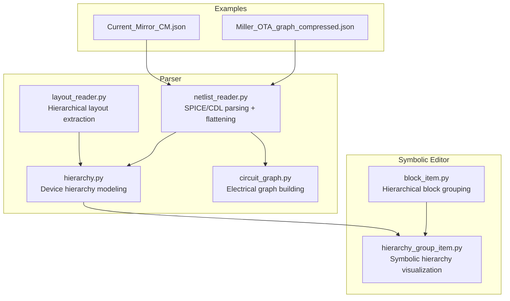
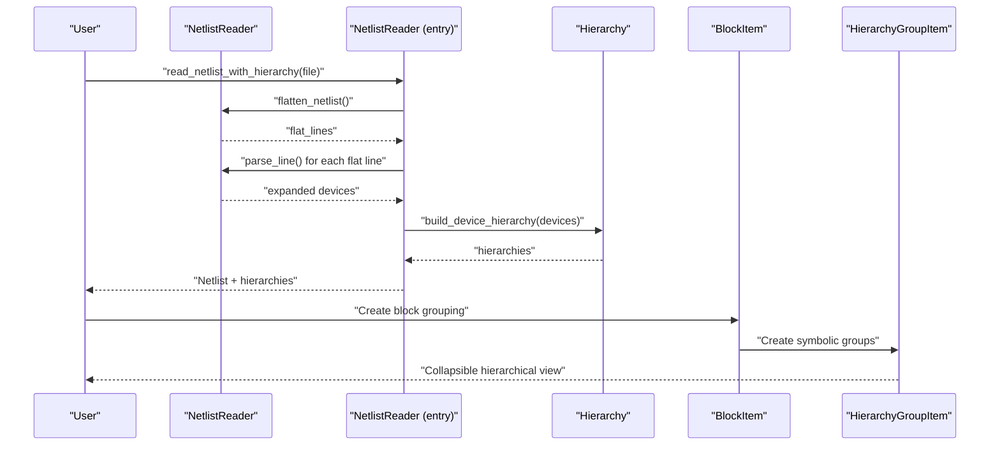
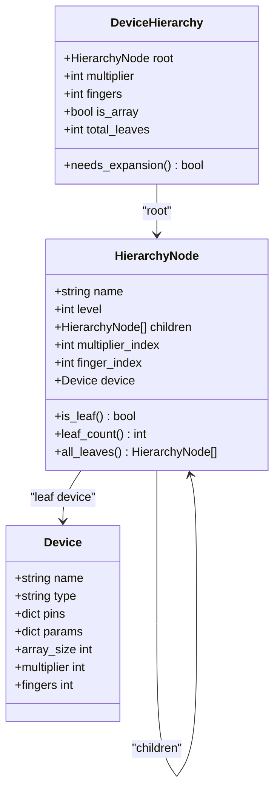
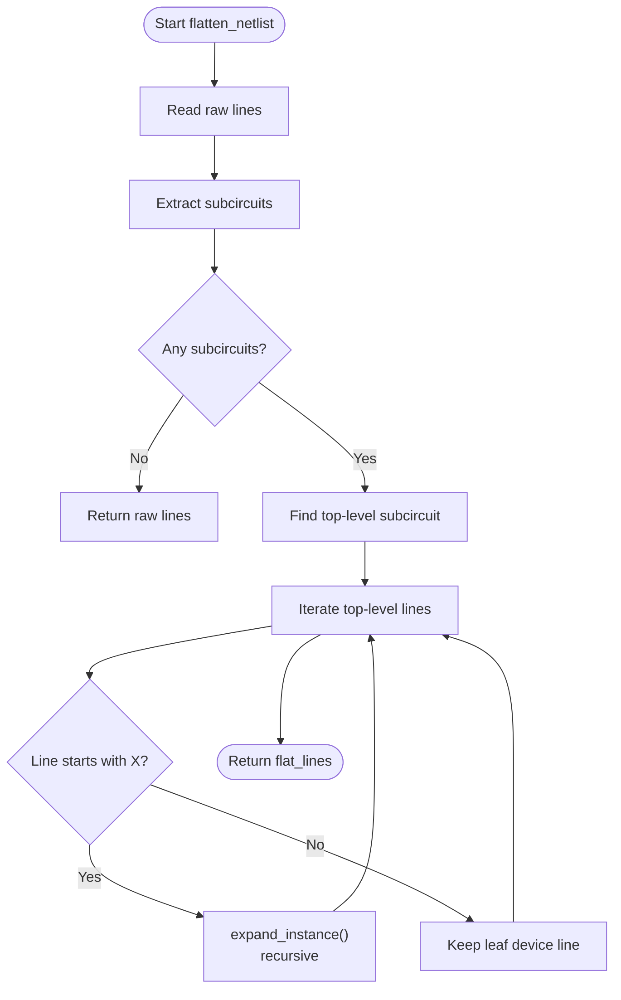
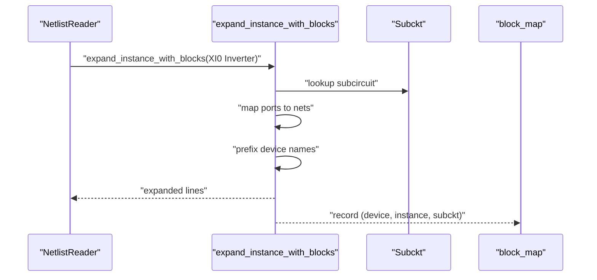
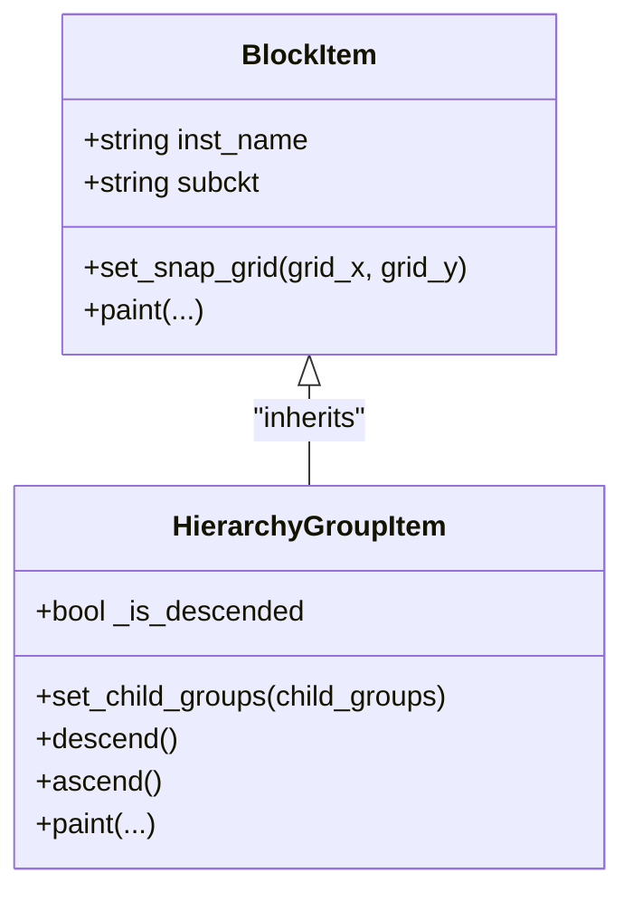
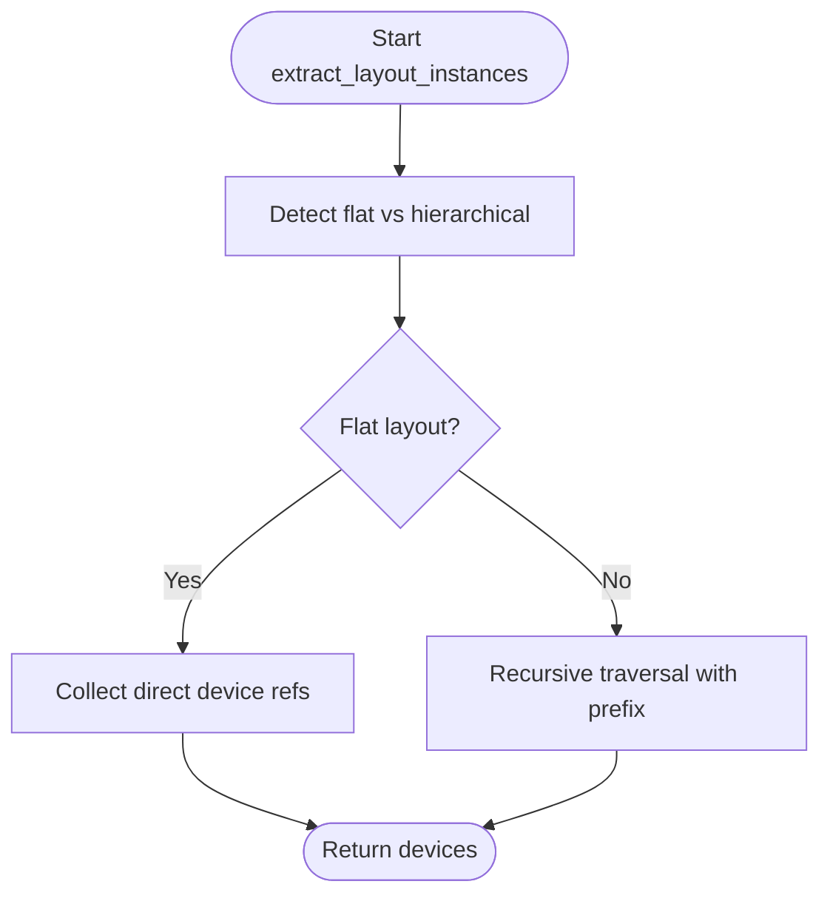
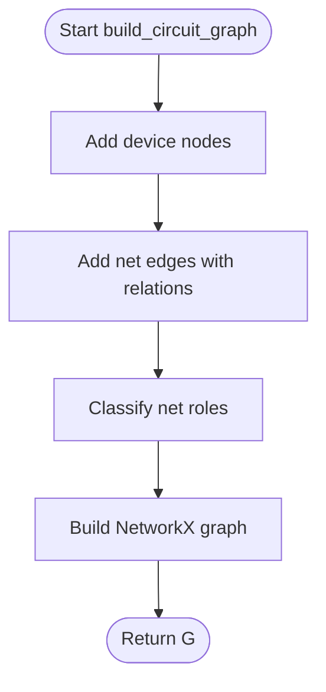
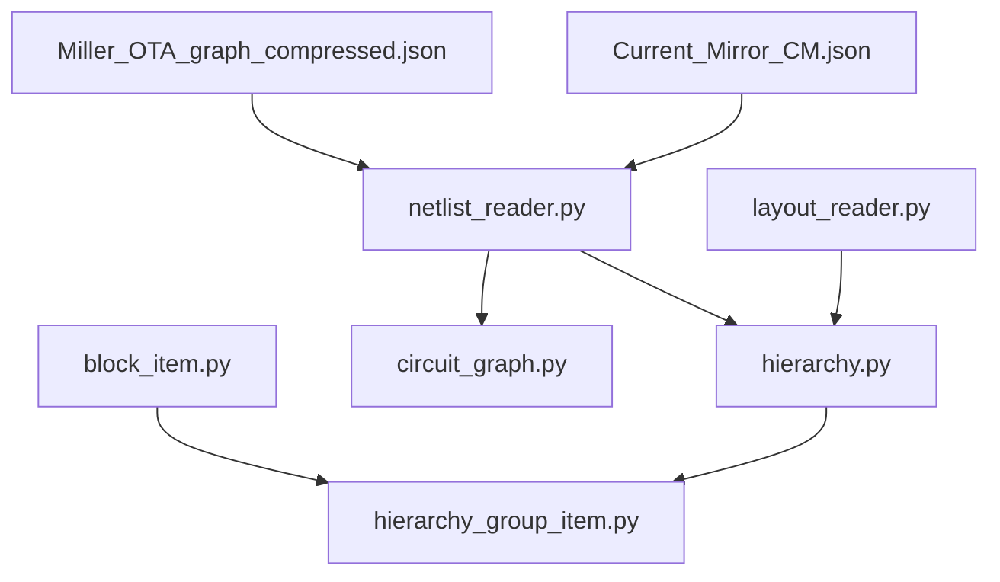

# Hierarchy Management

<cite>
**Referenced Files in This Document**
- [hierarchy.py](file://parser/hierarchy.py)
- [netlist_reader.py](file://parser/netlist_reader.py)
- [layout_reader.py](file://parser/layout_reader.py)
- [circuit_graph.py](file://parser/circuit_graph.py)
- [block_item.py](file://symbolic_editor/block_item.py)
- [hierarchy_group_item.py](file://symbolic_editor/hierarchy_group_item.py)
- [SYMBOLIC_HIERARCHY.md](file://docs/SYMBOLIC_HIERARCHY.md)
- [Miller_OTA_graph_compressed.json](file://examples/Miller_OTA/Miller_OTA_graph_compressed.json)
- [Current_Mirror_CM.json](file://examples/current_mirror/Current_Mirror_CM.json)
</cite>

## Table of Contents
1. [Introduction](#introduction)
2. [Project Structure](#project-structure)
3. [Core Components](#core-components)
4. [Architecture Overview](#architecture-overview)
5. [Detailed Component Analysis](#detailed-component-analysis)
6. [Dependency Analysis](#dependency-analysis)
7. [Performance Considerations](#performance-considerations)
8. [Troubleshooting Guide](#troubleshooting-guide)
9. [Conclusion](#conclusion)
10. [Appendices](#appendices)

## Introduction
This document explains the hierarchy management system that supports complex multi-level analog circuits. It covers:
- Hierarchical block organization and nested design representation
- Block-level device grouping and instance management
- Hierarchical netlist flattening and subcircuit integration
- Naming conventions for hierarchical references and instance identification
- Recursive design pattern handling and flattening for layout processing
- Examples of hierarchical netlists and their transformation to flat representations

## Project Structure
The hierarchy management spans parser modules for netlist parsing and layout extraction, and symbolic editor modules for visualizing hierarchical structures.

**Diagram sources**
- [hierarchy.py:1-475](file://parser/hierarchy.py#L1-L475)
- [netlist_reader.py:1-855](file://parser/netlist_reader.py#L1-L855)
- [layout_reader.py:1-442](file://parser/layout_reader.py#L1-L442)
- [circuit_graph.py:1-191](file://parser/circuit_graph.py#L1-L191)
- [block_item.py:1-144](file://symbolic_editor/block_item.py#L1-L144)
- [hierarchy_group_item.py:1-236](file://symbolic_editor/hierarchy_group_item.py#L1-L236)
- [Miller_OTA_graph_compressed.json:1-186](file://examples/Miller_OTA/Miller_OTA_graph_compressed.json#L1-L186)
- [Current_Mirror_CM.json:1-800](file://examples/current_mirror/Current_Mirror_CM.json#L1-L800)

**Section sources**
- [hierarchy.py:1-475](file://parser/hierarchy.py#L1-L475)
- [netlist_reader.py:1-855](file://parser/netlist_reader.py#L1-L855)
- [layout_reader.py:1-442](file://parser/layout_reader.py#L1-L442)
- [circuit_graph.py:1-191](file://parser/circuit_graph.py#L1-L191)
- [block_item.py:1-144](file://symbolic_editor/block_item.py#L1-L144)
- [hierarchy_group_item.py:1-236](file://symbolic_editor/hierarchy_group_item.py#L1-L236)
- [SYMBOLIC_HIERARCHY.md:1-234](file://docs/SYMBOLIC_HIERARCHY.md#L1-L234)

## Core Components
- Device hierarchy modeling: constructs and manipulates hierarchical trees for arrays, multipliers, and fingers.
- Netlist flattening: recursively expands subcircuits and resolves hierarchical names and nets.
- Instance and block management: tracks top-level instances and subcircuit types for each device.
- Symbolic visualization: presents hierarchical groups as abstract blocks with collapsible views.

Key capabilities:
- Parse array suffixes and reconstruct expanded device hierarchies
- Flatten hierarchical SPICE/CDL netlists with recursive subcircuit expansion
- Generate flat device lists with parent-child relationships for downstream processing
- Visualize hierarchical groups and navigate levels (symbolic → multipliers → fingers)

**Section sources**
- [hierarchy.py:133-475](file://parser/hierarchy.py#L133-L475)
- [netlist_reader.py:121-457](file://parser/netlist_reader.py#L121-L457)
- [netlist_reader.py:804-854](file://parser/netlist_reader.py#L804-L854)
- [hierarchy_group_item.py:28-236](file://symbolic_editor/hierarchy_group_item.py#L28-L236)

## Architecture Overview
The hierarchy management integrates parsing, flattening, and visualization:

**Diagram sources**
- [netlist_reader.py:260-318](file://parser/netlist_reader.py#L260-L318)
- [netlist_reader.py:726-761](file://parser/netlist_reader.py#L726-L761)
- [netlist_reader.py:804-854](file://parser/netlist_reader.py#L804-L854)
- [hierarchy.py:316-418](file://parser/hierarchy.py#L316-L418)
- [block_item.py:16-144](file://symbolic_editor/block_item.py#L16-L144)
- [hierarchy_group_item.py:28-236](file://symbolic_editor/hierarchy_group_item.py#L28-L236)

## Detailed Component Analysis

### Device Hierarchy Modeling
The hierarchy module defines:
- HierarchyNode: a node with name, level, children, and indices for multiplier and finger
- DeviceHierarchy: root node plus counts and flags for array/multiplier/finger expansion
- Helper functions to parse array suffixes and build/reconstruct hierarchies

Key behaviors:
- Effective multiplier calculation considers array_count and m
- Two-level expansions (multiplier + fingers) and single-level expansions (fingers or multipliers)
- Reconstruction from expanded devices determines presence of arrays, multipliers, and fingers
- Expansion back to leaf devices preserves pin mappings and parent-child relationships

**Diagram sources**
- [hierarchy.py:133-177](file://parser/hierarchy.py#L133-L177)
- [hierarchy.py:183-217](file://parser/hierarchy.py#L183-L217)
- [netlist_reader.py:13-50](file://parser/netlist_reader.py#L13-L50)

**Section sources**
- [hierarchy.py:44-92](file://parser/hierarchy.py#L44-L92)
- [hierarchy.py:219-310](file://parser/hierarchy.py#L219-L310)
- [hierarchy.py:316-418](file://parser/hierarchy.py#L316-L418)
- [hierarchy.py:434-475](file://parser/hierarchy.py#L434-L475)

### Hierarchical Netlist Flattening
The netlist reader performs:
- Extraction of subcircuit definitions (.SUBCKT/.ENDS)
- Identification of top-level subcircuit
- Recursive expansion of X-instances with hierarchical prefixing
- Remapping of ports and internal nets to avoid collisions
- Optional block-aware flattening to track instance and subcircuit types

**Diagram sources**
- [netlist_reader.py:121-318](file://parser/netlist_reader.py#L121-L318)
- [netlist_reader.py:152-221](file://parser/netlist_reader.py#L152-L221)
- [netlist_reader.py:224-257](file://parser/netlist_reader.py#L224-L257)

**Section sources**
- [netlist_reader.py:121-318](file://parser/netlist_reader.py#L121-L318)
- [netlist_reader.py:325-457](file://parser/netlist_reader.py#L325-L457)

### Instance and Block Management
The block-aware flattener records:
- Device name
- Top-level instance (e.g., XI0)
- Subcircuit type (e.g., Inverter)

This enables mapping leaf devices back to their originating block and subcircuit for visualization and editing.

**Diagram sources**
- [netlist_reader.py:325-394](file://parser/netlist_reader.py#L325-L394)
- [netlist_reader.py:397-457](file://parser/netlist_reader.py#L397-L457)

**Section sources**
- [netlist_reader.py:325-457](file://parser/netlist_reader.py#L325-L457)

### Symbolic Hierarchy Visualization
The symbolic editor provides:
- BlockItem: a movable, selectable block representing a hierarchical grouping
- HierarchyGroupItem: a draggable rectangle that hides/shows children and supports double-click navigation
- Visual states: symbolic view (rectangle) vs. detailed view (children visible)
- Signals for drag and hierarchy navigation

**Diagram sources**
- [block_item.py:16-144](file://symbolic_editor/block_item.py#L16-L144)
- [hierarchy_group_item.py:28-236](file://symbolic_editor/hierarchy_group_item.py#L28-L236)

**Section sources**
- [block_item.py:16-144](file://symbolic_editor/block_item.py#L16-L144)
- [hierarchy_group_item.py:28-236](file://symbolic_editor/hierarchy_group_item.py#L28-L236)
- [SYMBOLIC_HIERARCHY.md:1-234](file://docs/SYMBOLIC_HIERARCHY.md#L1-L234)

### Layout Hierarchical Extraction
The layout reader supports:
- Flat layouts: direct device references in top cell
- Hierarchical layouts: recursive traversal of sub-cells to find leaf transistors
- Prefix propagation for hierarchical naming
- Orientation and geometry extraction

**Diagram sources**
- [layout_reader.py:357-442](file://parser/layout_reader.py#L357-L442)
- [layout_reader.py:153-229](file://parser/layout_reader.py#L153-L229)
- [layout_reader.py:244-354](file://parser/layout_reader.py#L244-L354)

**Section sources**
- [layout_reader.py:14-442](file://parser/layout_reader.py#L14-L442)

### Electrical Graph Construction
The circuit graph module builds connectivity graphs from netlists:
- Adds device nodes with parameters
- Classifies nets by behavioral roles
- Builds edges between devices based on net and pin roles
- Supports merged graphs combining electrical and geometric features

**Diagram sources**
- [circuit_graph.py:131-191](file://parser/circuit_graph.py#L131-L191)
- [circuit_graph.py:36-128](file://parser/circuit_graph.py#L36-L128)

**Section sources**
- [circuit_graph.py:131-191](file://parser/circuit_graph.py#L131-L191)

## Dependency Analysis
The hierarchy system exhibits clear separation of concerns:
- Parser modules depend on each other for flattening and hierarchy reconstruction
- Symbolic editor depends on hierarchy data structures for visualization
- Examples demonstrate downstream consumption of flattened netlists

**Diagram sources**
- [netlist_reader.py:1-855](file://parser/netlist_reader.py#L1-L855)
- [hierarchy.py:1-475](file://parser/hierarchy.py#L1-L475)
- [layout_reader.py:1-442](file://parser/layout_reader.py#L1-L442)
- [circuit_graph.py:1-191](file://parser/circuit_graph.py#L1-L191)
- [block_item.py:1-144](file://symbolic_editor/block_item.py#L1-L144)
- [hierarchy_group_item.py:1-236](file://symbolic_editor/hierarchy_group_item.py#L1-L236)
- [Miller_OTA_graph_compressed.json:1-186](file://examples/Miller_OTA/Miller_OTA_graph_compressed.json#L1-L186)
- [Current_Mirror_CM.json:1-800](file://examples/current_mirror/Current_Mirror_CM.json#L1-L800)

**Section sources**
- [netlist_reader.py:1-855](file://parser/netlist_reader.py#L1-L855)
- [hierarchy.py:1-475](file://parser/hierarchy.py#L1-L475)
- [layout_reader.py:1-442](file://parser/layout_reader.py#L1-L442)
- [circuit_graph.py:1-191](file://parser/circuit_graph.py#L1-L191)
- [block_item.py:1-144](file://symbolic_editor/block_item.py#L1-L144)
- [hierarchy_group_item.py:1-236](file://symbolic_editor/hierarchy_group_item.py#L1-L236)

## Performance Considerations
- Flattening recursion: ensure termination by correctly identifying subcircuit boundaries and avoiding infinite loops
- Name collision avoidance: hierarchical prefixing and internal net prefixing prevent ambiguous references
- Memory footprint: storing expanded devices increases memory usage; consider streaming or lazy evaluation for very large designs
- Graph construction: classification and edge creation scales with device count and net degree; optimize by filtering global nets early

## Troubleshooting Guide
Common issues and resolutions:
- Subcircuit not found during flattening: verify .SUBCKT definitions and spelling; ensure top-level subcircuit is identifiable
- Incorrect hierarchical names: confirm prefix propagation and port remapping logic
- Missing parent-child relationships: ensure expanded devices carry parent parameters and reconstructed hierarchies attach leaf devices
- Symbolic view not updating: verify visibility updates and signals for hierarchy navigation

**Section sources**
- [netlist_reader.py:163-167](file://parser/netlist_reader.py#L163-L167)
- [netlist_reader.py:338-341](file://parser/netlist_reader.py#L338-L341)
- [hierarchy_group_item.py:102-141](file://symbolic_editor/hierarchy_group_item.py#L102-L141)

## Conclusion
The hierarchy management system provides robust support for complex multi-level analog circuits:
- Hierarchical device modeling with arrays, multipliers, and fingers
- Recursive flattening of SPICE/CDL netlists with instance and block tracking
- Visual symbolic hierarchy for intuitive navigation and manipulation
- Integration with electrical graph construction and layout extraction

These capabilities enable scalable design flows from schematic to layout, with clear naming conventions and structured data for downstream automation.

## Appendices

### Naming Conventions and Instance Identification
- Array suffix: device names may include <index> for array copies
- Multiplier/finger naming: {parent}_m{N} for multipliers, {parent}_f{N} for fingers, and mixed forms
- Hierarchical prefixes: X-instance names propagate as prefixes to all internal devices and nets
- Block mapping: each leaf device maps to an instance and subcircuit type for visualization and editing

**Section sources**
- [hierarchy.py:44-92](file://parser/hierarchy.py#L44-L92)
- [netlist_reader.py:152-221](file://parser/netlist_reader.py#L152-L221)
- [netlist_reader.py:325-394](file://parser/netlist_reader.py#L325-L394)

### Examples of Hierarchical Netlists and Transformations
- Miller OTA: demonstrates multi-device connectivity and parameterization suitable for hierarchical processing
- Current Mirror: shows expanded finger devices with parent relationships and geometry

These examples illustrate how hierarchical structures are represented post-flattening and how parent-child relationships are preserved for downstream tasks.

**Section sources**
- [Miller_OTA_graph_compressed.json:1-186](file://examples/Miller_OTA/Miller_OTA_graph_compressed.json#L1-L186)
- [Current_Mirror_CM.json:1-800](file://examples/current_mirror/Current_Mirror_CM.json#L1-L800)