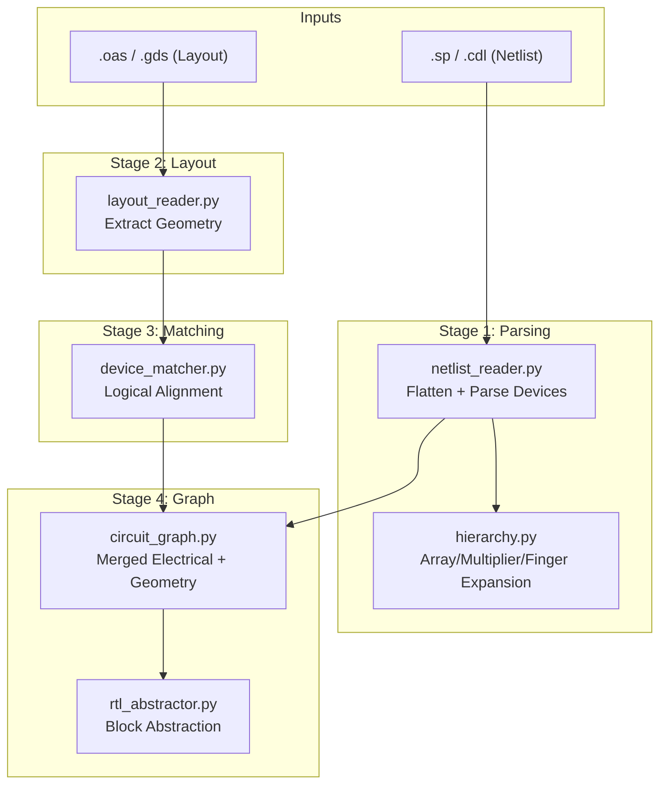
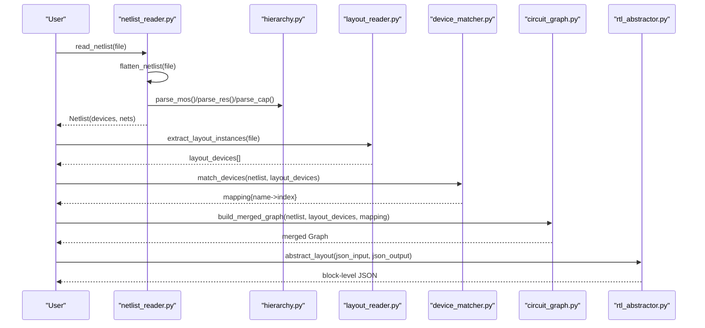
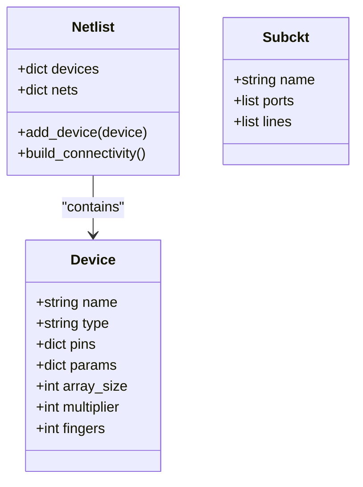
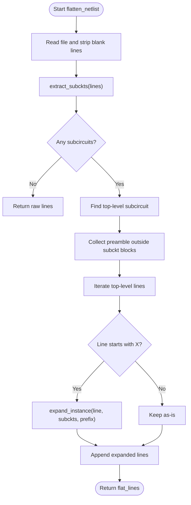
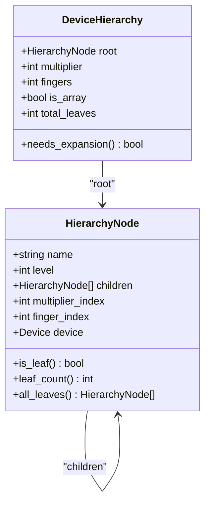
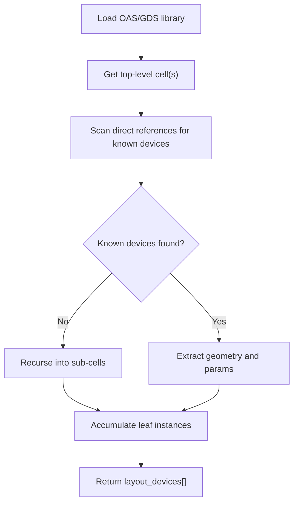
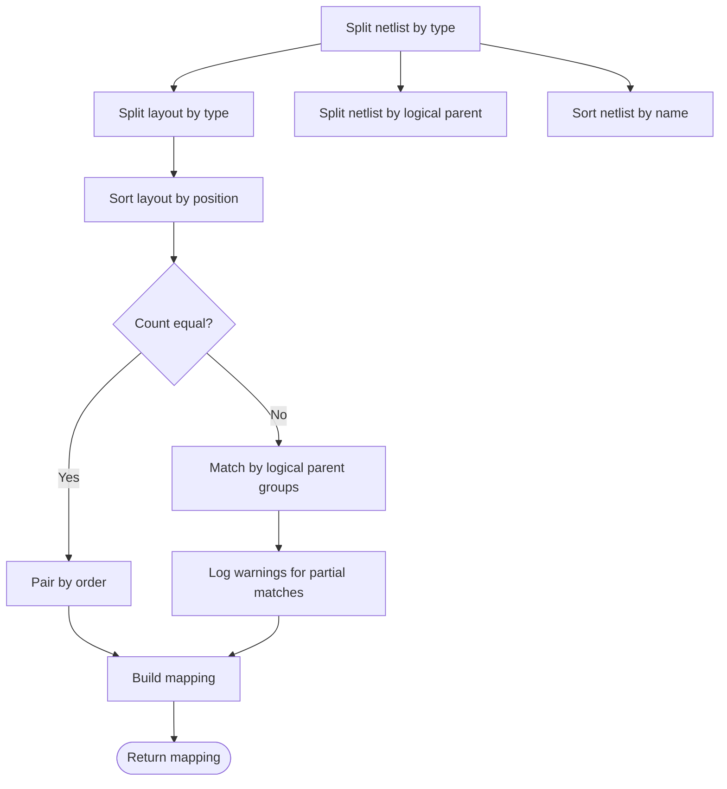
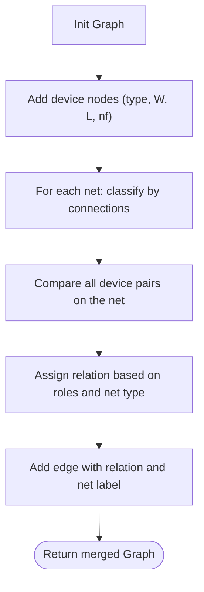
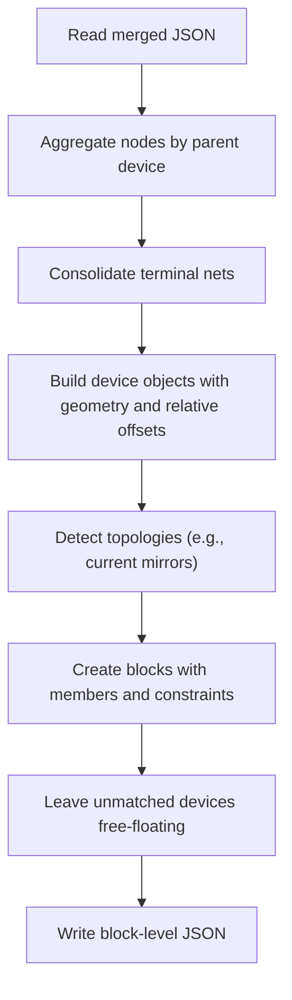
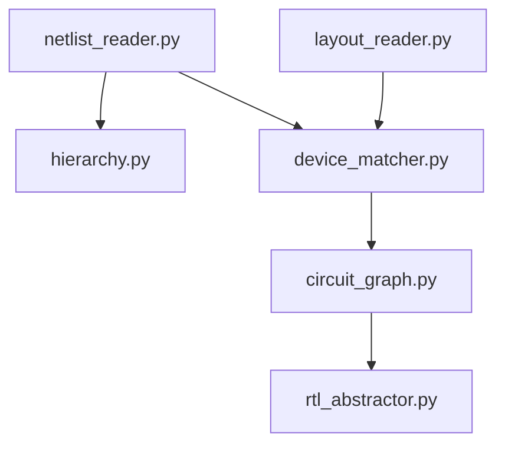

# Netlist Processing

<cite>
**Referenced Files in This Document**
- [netlist_reader.py](file://parser/netlist_reader.py)
- [hierarchy.py](file://parser/hierarchy.py)
- [circuit_graph.py](file://parser/circuit_graph.py)
- [device_matcher.py](file://parser/device_matcher.py)
- [layout_reader.py](file://parser/layout_reader.py)
- [rtl_abstractor.py](file://parser/rtl_abstractor.py)
- [run_parser_example.py](file://parser/run_parser_example.py)
- [README.md](file://parser/README.md)
- [Xor_Automation.sp](file://examples/xor/Xor_Automation.sp)
- [Miller_OTA.sp](file://examples/Miller_OTA/Miller_OTA.sp)
- [Current_Mirror_CM.sp](file://examples/current_mirror/Current_Mirror_CM.sp)
</cite>

## Table of Contents
1. [Introduction](#introduction)
2. [Project Structure](#project-structure)
3. [Core Components](#core-components)
4. [Architecture Overview](#architecture-overview)
5. [Detailed Component Analysis](#detailed-component-analysis)
6. [Dependency Analysis](#dependency-analysis)
7. [Performance Considerations](#performance-considerations)
8. [Troubleshooting Guide](#troubleshooting-guide)
9. [Conclusion](#conclusion)
10. [Appendices](#appendices)

## Introduction
This document explains the netlist processing system that parses SPICE/CDL netlists, flattens hierarchical subcircuits, extracts device parameters, builds connectivity, and prepares the data for layout analysis. It covers supported syntax variants, the netlist data model, hierarchical expansion and flattening, validation and error handling, and the abstraction pipeline that converts detailed SPICE representations into simplified block-level structures suitable for automated layout reasoning.

## Project Structure
The parser subsystem orchestrates four stages:
- Netlist parsing and flattening
- Layout geometry extraction
- Device matching between netlist and layout
- Merged circuit graph construction

**Diagram sources**
- [README.md:9-40](file://parser/README.md#L9-L40)
- [netlist_reader.py:726-761](file://parser/netlist_reader.py#L726-L761)
- [hierarchy.py:219-310](file://parser/hierarchy.py#L219-L310)
- [layout_reader.py:357-441](file://parser/layout_reader.py#L357-L441)
- [device_matcher.py:85-150](file://parser/device_matcher.py#L85-L150)
- [circuit_graph.py:131-191](file://parser/circuit_graph.py#L131-L191)
- [rtl_abstractor.py:18-274](file://parser/rtl_abstractor.py#L18-L274)

**Section sources**
- [README.md:1-48](file://parser/README.md#L1-L48)

## Core Components
- Netlist reader: Flattens hierarchies, parses leaf devices (MOS, resistors, capacitors), and constructs a connectivity map.
- Hierarchy module: Models arrays, multipliers (m), and fingers (nf) with a tree structure and supports reconstruction and expansion.
- Layout reader: Traverses hierarchical layout files to extract device instances with geometry and parameters.
- Device matcher: Aligns netlist devices to layout instances by type and logical grouping.
- Circuit graph: Builds a NetworkX graph combining electrical connectivity and spatial geometry.
- RTL abstractor: Produces a hierarchical block schema for layout automation by collapsing fingers into parent devices.

**Section sources**
- [netlist_reader.py:13-100](file://parser/netlist_reader.py#L13-L100)
- [hierarchy.py:133-177](file://parser/hierarchy.py#L133-L177)
- [layout_reader.py:14-441](file://parser/layout_reader.py#L14-L441)
- [device_matcher.py:85-150](file://parser/device_matcher.py#L85-L150)
- [circuit_graph.py:131-191](file://parser/circuit_graph.py#L131-L191)
- [rtl_abstractor.py:18-274](file://parser/rtl_abstractor.py#L18-L274)

## Architecture Overview
The system follows a staged pipeline:
1. Flatten hierarchical SPICE/CDL netlists into a flat list of leaf device lines.
2. Parse leaf device lines into logical Device objects with parameters and pins.
3. Build a connectivity map from nets to devices and pins.
4. Extract layout geometry and parameters from OAS/GDS.
5. Match netlist devices to layout instances.
6. Construct a merged graph for downstream AI reasoning.
7. Optionally produce a block-level abstraction for layout automation.

**Diagram sources**
- [netlist_reader.py:726-797](file://parser/netlist_reader.py#L726-L797)
- [hierarchy.py:219-310](file://parser/hierarchy.py#L219-L310)
- [layout_reader.py:357-441](file://parser/layout_reader.py#L357-L441)
- [device_matcher.py:85-150](file://parser/device_matcher.py#L85-L150)
- [circuit_graph.py:142-191](file://parser/circuit_graph.py#L142-L191)
- [rtl_abstractor.py:18-274](file://parser/rtl_abstractor.py#L18-L274)

## Detailed Component Analysis

### Netlist Reader: Data Model and Parsing
- Data structures:
  - Device: instance name, type, pin-to-net mapping, and parameter dictionary.
  - Netlist: stores devices and a reverse map from net names to lists of (device, pin) pairs.
- Value parsing: Converts SPICE-style numeric suffixes (f, p, n, u, m, k, meg, g) into floats.
- Device parsers:
  - parse_mos: Supports CDL-style MOS with model, pins, and parameters; handles nf, m, array suffixes, and generates expanded children with parent and index metadata.
  - parse_cap: Handles both simple and CDL-style capacitors with cval and geometric parameters.
  - parse_res: Handles both simple and CDL-style resistors with width/length and multiplier parameters.
- Line dispatcher: Detects device types by token count and model prefix.
- Main reader: Orchestrates flattening, parsing, and connectivity building.

**Diagram sources**
- [netlist_reader.py:13-100](file://parser/netlist_reader.py#L13-L100)
- [netlist_reader.py:51-72](file://parser/netlist_reader.py#L51-L72)
- [netlist_reader.py:114-119](file://parser/netlist_reader.py#L114-L119)

**Section sources**
- [netlist_reader.py:13-100](file://parser/netlist_reader.py#L13-L100)
- [netlist_reader.py:478-720](file://parser/netlist_reader.py#L478-L720)
- [netlist_reader.py:726-761](file://parser/netlist_reader.py#L726-L761)

### Hierarchical Netlist Processing and Flattening
- Subcircuit extraction: Parses .SUBCKT/.ENDS blocks into Subckt objects.
- Top-level identification: Uses filename match or unused-as-child heuristic.
- Instance expansion: Recursively expands X-instances, remapping ports and avoiding name collisions by hierarchical prefixing.
- Block-aware flattening: Tracks which top-level instance and subcircuit each expanded device belongs to.

**Diagram sources**
- [netlist_reader.py:260-318](file://parser/netlist_reader.py#L260-L318)
- [netlist_reader.py:121-149](file://parser/netlist_reader.py#L121-L149)
- [netlist_reader.py:152-221](file://parser/netlist_reader.py#L152-L221)

**Section sources**
- [netlist_reader.py:260-318](file://parser/netlist_reader.py#L260-L318)
- [netlist_reader.py:325-457](file://parser/netlist_reader.py#L325-L457)

### Hierarchy Modeling: Arrays, Multipliers, and Fingers
- Array suffix parsing: Extracts 0-based indices from names like MM9<7>.
- Parameter extraction: Safely converts m and nf to integers, with warnings and clamping for invalid values.
- Tree structure: HierarchyNode represents parent/multiplier/finger levels; DeviceHierarchy aggregates counts and leaf enumeration.
- Reconstruction: From expanded devices, rebuilds hierarchy with correct m, nf, and array semantics.
- Expansion: Generates leaf Device objects with resolved pins and parent/finger indices.

**Diagram sources**
- [hierarchy.py:133-177](file://parser/hierarchy.py#L133-L177)
- [hierarchy.py:183-217](file://parser/hierarchy.py#L183-L217)

**Section sources**
- [hierarchy.py:44-74](file://parser/hierarchy.py#L44-L74)
- [hierarchy.py:219-310](file://parser/hierarchy.py#L219-L310)
- [hierarchy.py:316-418](file://parser/hierarchy.py#L316-L418)
- [hierarchy.py:434-475](file://parser/hierarchy.py#L434-L475)

### Layout Reader: Geometry Extraction
- Supports flat and hierarchical layouts.
- Recognizes transistor, resistor, and capacitor PCells by naming conventions.
- Parses PCell parameters from properties and merges them into device entries.
- Computes absolute positions, orientation, and bounding boxes.
- Recursively walks references to find leaf device instances.

**Diagram sources**
- [layout_reader.py:357-441](file://parser/layout_reader.py#L357-L441)
- [layout_reader.py:153-229](file://parser/layout_reader.py#L153-L229)

**Section sources**
- [layout_reader.py:14-441](file://parser/layout_reader.py#L14-L441)

### Device Matcher: Logical Alignment
- Groups layout and netlist devices by type (nmos, pmos, res, cap).
- Sorts by natural order and spatial position.
- Matches by exact count, then by logical parent grouping for expanded multi-finger devices, with warnings for mismatches.
- Produces a deterministic mapping from netlist device names to layout indices.

**Diagram sources**
- [device_matcher.py:25-77](file://parser/device_matcher.py#L25-L77)
- [device_matcher.py:85-150](file://parser/device_matcher.py#L85-L150)

**Section sources**
- [device_matcher.py:85-150](file://parser/device_matcher.py#L85-L150)

### Circuit Graph: Merging Electrical and Geometry
- Adds device nodes with type, width, length, and nf.
- Ignores global supply nets.
- Classifies nets by connectivity (bias, signal, gate).
- Edges encode behavioral relations (shared_gate, shared_source, shared_drain, connection).
- Merged graph augments nodes with geometry and connects devices based on shared nets.

**Diagram sources**
- [circuit_graph.py:18-138](file://parser/circuit_graph.py#L18-L138)
- [circuit_graph.py:142-191](file://parser/circuit_graph.py#L142-L191)

**Section sources**
- [circuit_graph.py:18-191](file://parser/circuit_graph.py#L18-L191)

### RTL Abstraction: Block-Level Representation
- Aggregates finger-level nodes into parent devices and computes bounding boxes.
- Consolidates terminal nets per parent device.
- Infers topology groups (e.g., current mirrors by shared gate and source).
- Produces blocks with relative finger offsets and constraints for layout automation.
- Writes a JSON schema where blocks are the top-level interactive units and individual fingers are hidden.

**Diagram sources**
- [rtl_abstractor.py:18-274](file://parser/rtl_abstractor.py#L18-L274)

**Section sources**
- [rtl_abstractor.py:18-274](file://parser/rtl_abstractor.py#L18-L274)

## Dependency Analysis
- netlist_reader depends on hierarchy for array suffix parsing and on device_matcher for validation and matching.
- hierarchy depends on netlist_reader’s Device type indirectly via string references.
- layout_reader is independent and relies on gdstk for file parsing.
- device_matcher depends on netlist_reader’s Device and hierarchy’s logical grouping.
- circuit_graph depends on netlist_reader’s Netlist and layout_reader’s geometry.
- rtl_abstractor consumes merged graph outputs and produces block-level JSON.

**Diagram sources**
- [netlist_reader.py:470-471](file://parser/netlist_reader.py#L470-L471)
- [hierarchy.py:30-34](file://parser/hierarchy.py#L30-L34)
- [device_matcher.py:85-150](file://parser/device_matcher.py#L85-L150)
- [circuit_graph.py:131-191](file://parser/circuit_graph.py#L131-L191)
- [rtl_abstractor.py:18-274](file://parser/rtl_abstractor.py#L18-L274)

**Section sources**
- [netlist_reader.py:470-471](file://parser/netlist_reader.py#L470-L471)
- [hierarchy.py:30-34](file://parser/hierarchy.py#L30-L34)

## Performance Considerations
- Flattening and parsing operate in linear passes over the number of lines and devices.
- Connectivity building uses a dictionary keyed by net names; worst-case O(N) per net for append operations.
- Graph construction compares pairs of devices per net; complexity scales with the square of device count per net.
- Layout traversal is proportional to the number of references and sub-cells.
- Matching uses sorting and grouping; complexity dominated by O(N log N) for sorting plus linear grouping.

[No sources needed since this section provides general guidance]

## Troubleshooting Guide
Common issues and remedies:
- Unknown subcircuit during flattening: The flattener warns and skips X-instances whose subcircuit definition is missing. Verify .SUBCKT definitions and filenames.
- Non-integer m or nf: Hierarchy conversion rounds and clamps values to defaults; inspect warnings and correct netlist parameters.
- Name collisions in hierarchies: Prefixing avoids collisions; ensure hierarchical prefixes propagate to internal nets.
- Supply nets interfering with graph classification: Global nets are ignored; confirm naming conventions (e.g., vdd, vss).
- Partial device matching: When counts differ, the matcher logs warnings and performs partial matching; adjust layout or netlist to align logical parents.

**Section sources**
- [netlist_reader.py:163-167](file://parser/netlist_reader.py#L163-L167)
- [hierarchy.py:116-126](file://parser/hierarchy.py#L116-L126)
- [circuit_graph.py:65-77](file://parser/circuit_graph.py#L65-L77)
- [device_matcher.py:117-136](file://parser/device_matcher.py#L117-L136)

## Conclusion
The netlist processing system integrates SPICE/CDL parsing, hierarchical flattening, parameter extraction, connectivity mapping, and layout geometry alignment into a unified pipeline. It supports complex device expansions (arrays, multipliers, fingers) and produces both detailed and block-level abstractions suitable for automated layout analysis and AI-driven placement/routing.

[No sources needed since this section summarizes without analyzing specific files]

## Appendices

### Supported SPICE/CDL Syntax Variants
- MOS devices:
  - CDL-style with model and parameters (e.g., nf, m, l, w, nfin).
  - Array suffix notation for indexed copies.
- Capacitors and resistors:
  - Both simple and CDL-style formats with value or cval/w/l parameters.
- Hierarchies:
  - .SUBCKT/.ENDS blocks with port lists.
  - X-instances with port remapping and recursive expansion.

**Section sources**
- [netlist_reader.py:478-720](file://parser/netlist_reader.py#L478-L720)
- [Miller_OTA.sp:14-26](file://examples/Miller_OTA/Miller_OTA.sp#L14-L26)
- [Current_Mirror_CM.sp:14-22](file://examples/current_mirror/Current_Mirror_CM.sp#L14-L22)
- [Xor_Automation.sp:14-28](file://examples/xor/Xor_Automation.sp#L14-L28)

### Example Netlist Structures and Transformations
- Example netlists demonstrate:
  - Hierarchical subcircuits (.SUBCKT/.ENDS).
  - MOS devices with nf, m, l, nfin parameters.
  - Capacitors and resistors with CDL-style parameters.
- Transformation pipeline:
  - Flattening converts hierarchical X-instances into flat leaf device lines.
  - Parsing yields Device objects with normalized parameters.
  - Connectivity mapping enables merged graph construction.
  - Matching aligns logical devices to layout instances.
  - Abstraction collapses fingers into block-level representations.

**Section sources**
- [run_parser_example.py:13-61](file://parser/run_parser_example.py#L13-L61)
- [netlist_reader.py:726-797](file://parser/netlist_reader.py#L726-L797)
- [circuit_graph.py:131-191](file://parser/circuit_graph.py#L131-L191)
- [rtl_abstractor.py:18-274](file://parser/rtl_abstractor.py#L18-L274)