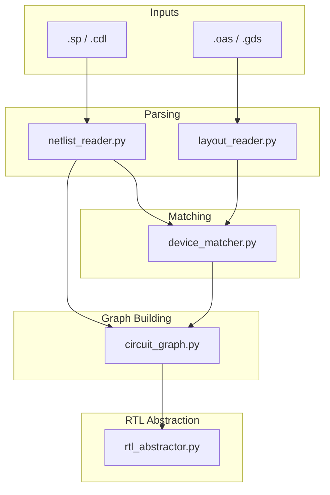
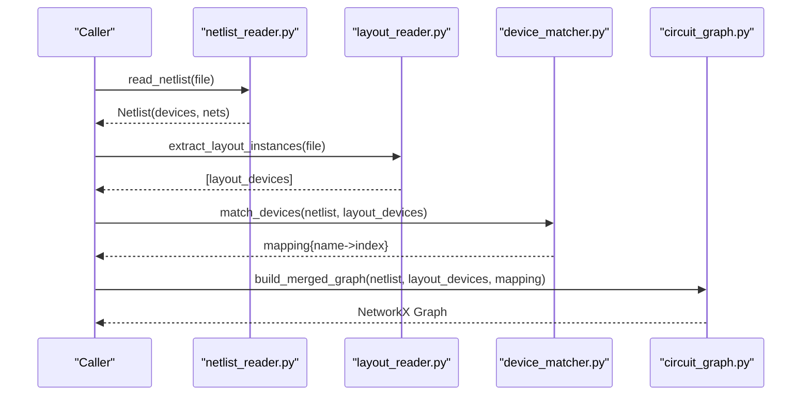
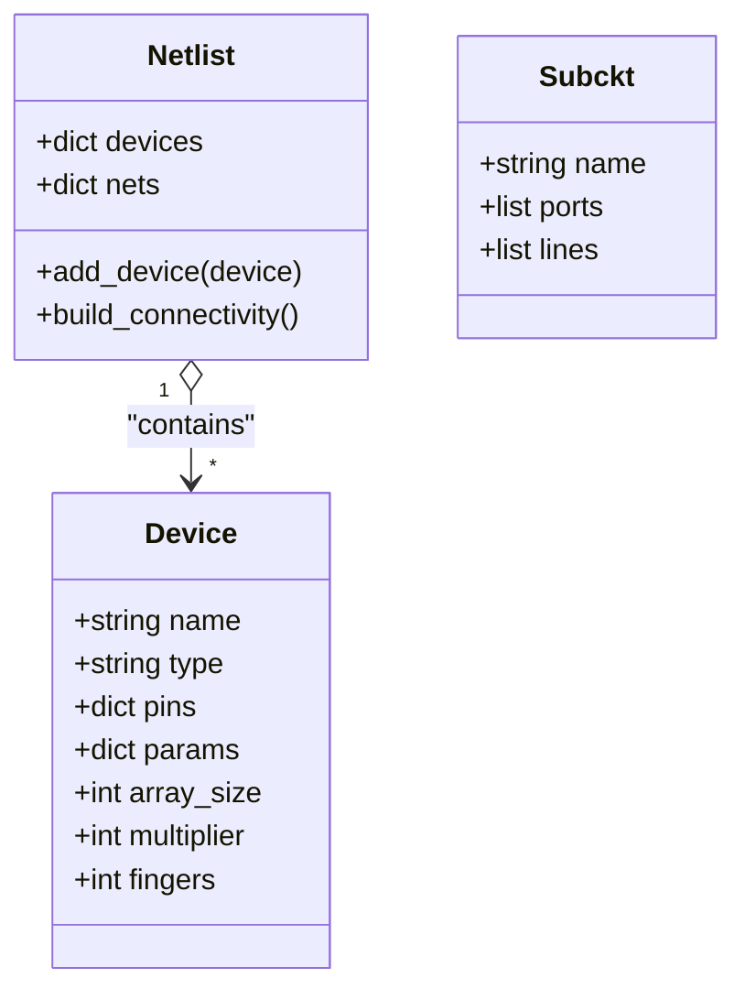
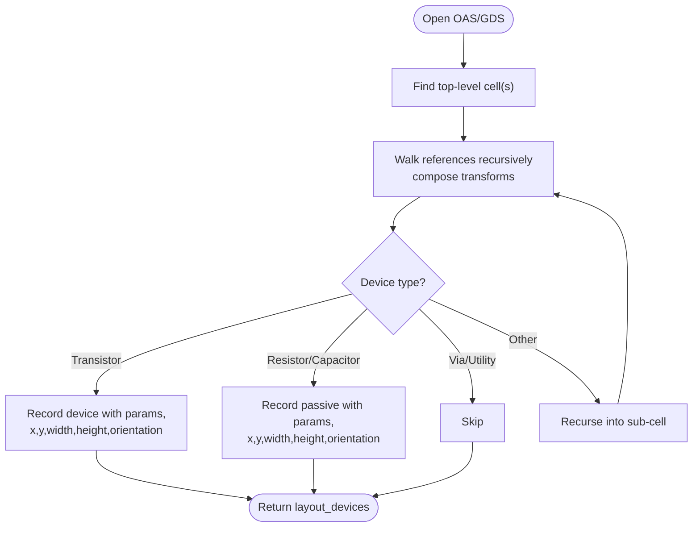
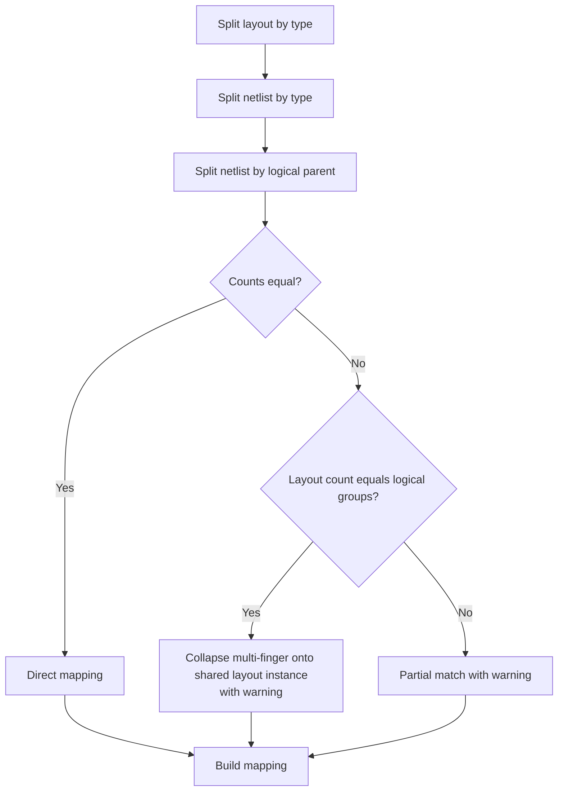
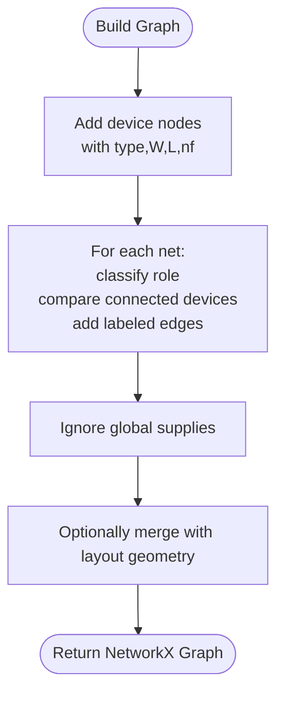
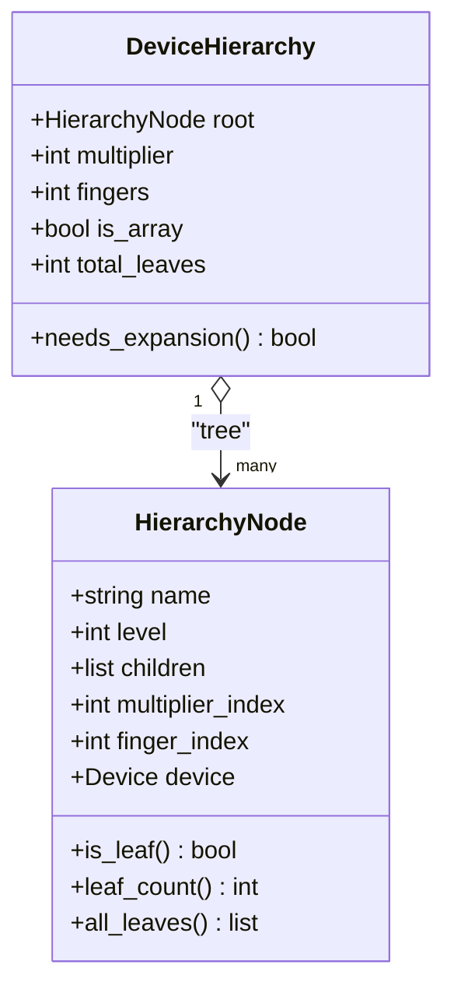
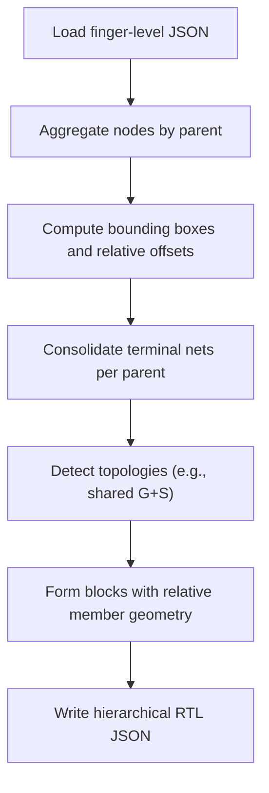
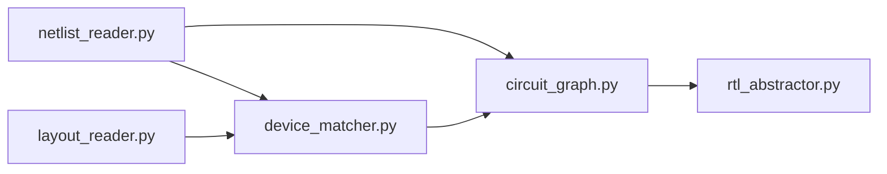

# Parser System

<cite>
**Referenced Files in This Document**
- [parser/README.md](file://parser/README.md)
- [parser/run_parser_example.py](file://parser/run_parser_example.py)
- [parser/netlist_reader.py](file://parser/netlist_reader.py)
- [parser/layout_reader.py](file://parser/layout_reader.py)
- [parser/device_matcher.py](file://parser/device_matcher.py)
- [parser/circuit_graph.py](file://parser/circuit_graph.py)
- [parser/hierarchy.py](file://parser/hierarchy.py)
- [parser/rtl_abstractor.py](file://parser/rtl_abstractor.py)
- [examples/Layout_RTL.json](file://examples/Layout_RTL.json)
- [examples/current_mirror/Current_Mirror_CM.json](file://examples/current_mirror/Current_Mirror_CM.json)
- [tests/validation_script.py](file://tests/validation_script.py)
</cite>

## Table of Contents
1. [Introduction](#introduction)
2. [Project Structure](#project-structure)
3. [Core Components](#core-components)
4. [Architecture Overview](#architecture-overview)
5. [Detailed Component Analysis](#detailed-component-analysis)
6. [Dependency Analysis](#dependency-analysis)
7. [Performance Considerations](#performance-considerations)
8. [Troubleshooting Guide](#troubleshooting-guide)
9. [Conclusion](#conclusion)
10. [Appendices](#appendices)

## Introduction
This document explains the parser system that converts SPICE/CDL netlists and OAS/GDS layout geometry into a unified NetworkX graph. It covers:
- Circuit graph construction from netlists
- Device data model for PMOS/NMOS and passives
- Hierarchy management for multi-level analog circuits
- Device matching between schematic and layout
- Netlist abstraction and RTL conversion
- Data model specifications and validation
- Examples of parsed structures and usage

## Project Structure
The parser subsystem resides under parser/ and integrates four stages:
- Netlist parsing and hierarchy flattening
- Layout geometry extraction
- Device matching between netlist and layout
- Merged circuit graph construction
- Hierarchical block abstraction for RTL

**Diagram sources**
- [parser/README.md:9-40](file://parser/README.md#L9-L40)
- [parser/run_parser_example.py:13-61](file://parser/run_parser_example.py#L13-L61)

**Section sources**
- [parser/README.md:1-48](file://parser/README.md#L1-L48)

## Core Components
- Netlist reader: Parses SPICE/CDL into logical devices and connectivity, flattens hierarchies, and constructs a Netlist object.
- Layout reader: Extracts device instances from OAS/GDS, including absolute positions, orientation, and PCell parameters.
- Device matcher: Aligns netlist devices to layout instances by type and logical grouping, handling multi-finger and array expansions.
- Circuit graph: Builds an electrical graph from netlist connectivity and merges it with layout geometry to produce a merged graph.
- Hierarchy manager: Encodes array/multiplier/finger expansions and reconstructs logical parents for multi-finger devices.
- RTL abstraction: Produces a hierarchical block schema from finger-level nodes, grouping matched devices into rigid blocks.

**Section sources**
- [parser/netlist_reader.py:13-761](file://parser/netlist_reader.py#L13-L761)
- [parser/layout_reader.py:14-441](file://parser/layout_reader.py#L14-L441)
- [parser/device_matcher.py:25-151](file://parser/device_matcher.py#L25-L151)
- [parser/circuit_graph.py:18-191](file://parser/circuit_graph.py#L18-L191)
- [parser/hierarchy.py:44-475](file://parser/hierarchy.py#L44-L475)
- [parser/rtl_abstractor.py:18-274](file://parser/rtl_abstractor.py#L18-L274)

## Architecture Overview
The pipeline proceeds in four steps:
1. Parse netlist and flatten hierarchies
2. Extract layout instances
3. Match devices between netlist and layout
4. Build merged circuit graph and optionally produce RTL blocks

**Diagram sources**
- [parser/run_parser_example.py:23-58](file://parser/run_parser_example.py#L23-L58)
- [parser/netlist_reader.py:726-761](file://parser/netlist_reader.py#L726-L761)
- [parser/layout_reader.py:357-441](file://parser/layout_reader.py#L357-L441)
- [parser/device_matcher.py:85-151](file://parser/device_matcher.py#L85-L151)
- [parser/circuit_graph.py:142-191](file://parser/circuit_graph.py#L142-L191)

## Detailed Component Analysis

### Netlist Reader and Data Model
The netlist reader defines the core data structures and parsing logic:
- Device: encapsulates name, type, pin-to-net mapping, and parameters (including hierarchy metadata).
- Netlist: holds devices and derived connectivity (net-to-(device,pin)) mappings.
- Flattening: extracts subcircuit definitions, identifies top-level subcircuit, and recursively expands X-instances.
- Device parsers: handle MOS, capacitors, and resistors, including CDL-style parameter parsing and unit scaling.
- Value parsing: converts Spice units (f, p, n, u, m, k, meg, g) to floats.

Key behaviors:
- Hierarchical flattening preserves hierarchical prefixes to avoid naming collisions.
- Array suffix parsing supports array-indexed devices (<N>) and recovers array counts during grouping.
- Multi-finger and multiplier expansions generate child devices with parent pointers and index metadata.

**Diagram sources**
- [parser/netlist_reader.py:13-761](file://parser/netlist_reader.py#L13-L761)

**Section sources**
- [parser/netlist_reader.py:13-101](file://parser/netlist_reader.py#L13-L101)
- [parser/netlist_reader.py:51-72](file://parser/netlist_reader.py#L51-L72)
- [parser/netlist_reader.py:114-149](file://parser/netlist_reader.py#L114-L149)
- [parser/netlist_reader.py:152-318](file://parser/netlist_reader.py#L152-L318)
- [parser/netlist_reader.py:325-457](file://parser/netlist_reader.py#L325-L457)
- [parser/netlist_reader.py:478-761](file://parser/netlist_reader.py#L478-L761)

### Layout Reader
The layout reader extracts device instances from OAS/GDS:
- Traverses hierarchical references while composing transforms to compute absolute positions.
- Recognizes transistor, resistor, and capacitor PCells by cell naming conventions.
- Parses PCell parameters from properties and records orientation, width, height, and abutment flags.
- Supports both flat and hierarchical layouts.

**Diagram sources**
- [parser/layout_reader.py:153-229](file://parser/layout_reader.py#L153-L229)
- [parser/layout_reader.py:244-354](file://parser/layout_reader.py#L244-L354)
- [parser/layout_reader.py:357-441](file://parser/layout_reader.py#L357-L441)

**Section sources**
- [parser/layout_reader.py:14-19](file://parser/layout_reader.py#L14-L19)
- [parser/layout_reader.py:44-83](file://parser/layout_reader.py#L44-L83)
- [parser/layout_reader.py:153-229](file://parser/layout_reader.py#L153-L229)
- [parser/layout_reader.py:244-354](file://parser/layout_reader.py#L244-L354)
- [parser/layout_reader.py:357-441](file://parser/layout_reader.py#L357-L441)

### Device Matcher
The matcher aligns netlist devices to layout instances:
- Groups devices by type (nmos, pmos, res, cap) and sorts by natural order.
- Matches by exact count, then by collapsing logical multi-finger groups onto shared layout instances, with warnings for mismatches.
- Spatial sorting of layout instances is supported for deterministic fallback matching.

**Diagram sources**
- [parser/device_matcher.py:25-151](file://parser/device_matcher.py#L25-L151)

**Section sources**
- [parser/device_matcher.py:25-151](file://parser/device_matcher.py#L25-L151)

### Circuit Graph Construction
The circuit graph:
- Adds device nodes with type and geometric parameters.
- Classifies nets by behavioral roles (bias, signal, gate) based on pin roles and counts.
- Creates edges between devices connected by the same net, labeling relations (shared_bias, shared_source, shared_gate, shared_drain, connection).
- Merges electrical connectivity with layout geometry to produce a unified graph with both electrical and spatial attributes.

**Diagram sources**
- [parser/circuit_graph.py:18-191](file://parser/circuit_graph.py#L18-L191)

**Section sources**
- [parser/circuit_graph.py:18-191](file://parser/circuit_graph.py#L18-L191)

### Hierarchy Management
Hierarchy encoding supports:
- Array suffix parsing for array-indexed devices
- Multiplier (m) and finger (nf) expansions
- Reconstruction of logical parents and leaf counts
- Expansion of hierarchy into leaf Device objects with resolved pins and indices

**Diagram sources**
- [parser/hierarchy.py:133-217](file://parser/hierarchy.py#L133-L217)
- [parser/hierarchy.py:219-475](file://parser/hierarchy.py#L219-L475)

**Section sources**
- [parser/hierarchy.py:44-93](file://parser/hierarchy.py#L44-L93)
- [parser/hierarchy.py:99-127](file://parser/hierarchy.py#L99-L127)
- [parser/hierarchy.py:133-217](file://parser/hierarchy.py#L133-L217)
- [parser/hierarchy.py:219-475](file://parser/hierarchy.py#L219-L475)

### RTL Abstraction
RTL abstraction produces a hierarchical block schema:
- Aggregates finger-level nodes into parent devices, computing bounding boxes and relative offsets
- Consolidates terminals per parent device
- Infers topology groups (e.g., current mirrors) and forms rigid blocks
- Outputs a JSON with blocks, devices, and topologies

**Diagram sources**
- [parser/rtl_abstractor.py:18-274](file://parser/rtl_abstractor.py#L18-L274)

**Section sources**
- [parser/rtl_abstractor.py:18-274](file://parser/rtl_abstractor.py#L18-L274)

## Dependency Analysis
- netlist_reader depends on hierarchy for array suffix parsing and device hierarchy reconstruction.
- circuit_graph consumes Netlist and layout geometry to produce merged graphs.
- device_matcher operates independently on netlist and layout arrays.
- rtl_abstractor consumes the output of earlier stages to produce block-level JSON.

**Diagram sources**
- [parser/netlist_reader.py:471](file://parser/netlist_reader.py#L471)
- [parser/run_parser_example.py:8-11](file://parser/run_parser_example.py#L8-L11)

**Section sources**
- [parser/netlist_reader.py:471](file://parser/netlist_reader.py#L471)
- [parser/run_parser_example.py:8-11](file://parser/run_parser_example.py#L8-L11)

## Performance Considerations
- Graph building compares all pairs of connected devices per net; complexity is O(E + V + N * sum(deg(v)^2)) where N is the number of nets. For large designs, consider:
  - Pre-partitioning nets by role to reduce cross-device comparisons
  - Using indexed connectivity structures to avoid repeated scans
- Layout traversal is O(L) where L is the number of references; ensure early filtering of non-device cells.
- Matching uses sorting and grouping; natural sorting keys improve stability and reduce mismatches.

## Troubleshooting Guide
Common issues and remedies:
- Mismatched device counts: The matcher logs warnings and falls back to spatial matching; verify that multi-finger expansions are correctly represented in the netlist and that layout instances are present.
- Unknown subcircuit during flattening: The flattener warns and skips the instance; ensure all referenced subcircuits are defined.
- Invalid layout format: The layout reader raises an error for unsupported extensions; confirm file type is .gds or .oas.
- Validation failures: Use the validation script to compare widths between original finger-level and new device-level geometry.

**Section sources**
- [parser/device_matcher.py:117-142](file://parser/device_matcher.py#L117-L142)
- [parser/netlist_reader.py:163-167](file://parser/netlist_reader.py#L163-L167)
- [parser/layout_reader.py:363-368](file://parser/layout_reader.py#L363-L368)
- [tests/validation_script.py:4-31](file://tests/validation_script.py#L4-L31)

## Conclusion
The parser system provides a robust pipeline from SPICE/CDL and layout geometry to a unified graph and hierarchical RTL schema. It supports complex multi-level analog circuits through hierarchy management, precise device matching, and structured abstraction suitable for AI-driven layout automation.

## Appendices

### Data Model Specifications
- Device
  - name: string
  - type: string (nmos, pmos, res, cap)
  - pins: dict mapping pin label to net
  - params: dict of parameters (e.g., l, nf, m, parent, multiplier_index, finger_index)
  - convenience properties: array_size, multiplier, fingers
- Netlist
  - devices: dict of Device keyed by name
  - nets: dict mapping net to list of (device_name, pin)
- Layout Device Entry
  - cell: string (PCell name)
  - x, y: float (absolute position)
  - width, height: float (bounding box)
  - orientation: string (e.g., "R0", "R90", "MX")
  - passive_type: string ("res" or "cap") for passives
  - params: dict of PCell parameters
  - abut_left, abut_right: booleans for transistor abutment flags
- RTL JSON (Block-level)
  - metadata: pdk, abstraction_level, selection rules
  - blocks: list of rigid blocks with members and geometry
  - devices: free-floating devices outside blocks
  - topologies: inferred topologies (e.g., current mirrors)

**Section sources**
- [parser/netlist_reader.py:13-72](file://parser/netlist_reader.py#L13-L72)
- [parser/layout_reader.py:182-227](file://parser/layout_reader.py#L182-L227)
- [examples/Layout_RTL.json:1-152](file://examples/Layout_RTL.json#L1-L152)

### Example Parsed Structures
- Finger-level example: [examples/current_mirror/Current_Mirror_CM.json:1-200](file://examples/current_mirror/Current_Mirror_CM.json#L1-L200)
- Device-level example: [examples/Layout_RTL.json:1-152](file://examples/Layout_RTL.json#L1-L152)

**Section sources**
- [examples/current_mirror/Current_Mirror_CM.json:1-200](file://examples/current_mirror/Current_Mirror_CM.json#L1-L200)
- [examples/Layout_RTL.json:1-152](file://examples/Layout_RTL.json#L1-L152)

### Usage Examples
- End-to-end walkthrough: [parser/run_parser_example.py:13-58](file://parser/run_parser_example.py#L13-L58)
- RTL abstraction CLI: [parser/rtl_abstractor.py:269-274](file://parser/rtl_abstractor.py#L269-L274)

**Section sources**
- [parser/run_parser_example.py:13-61](file://parser/run_parser_example.py#L13-L61)
- [parser/rtl_abstractor.py:269-274](file://parser/rtl_abstractor.py#L269-L274)