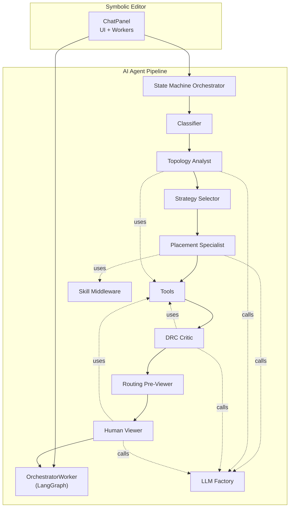
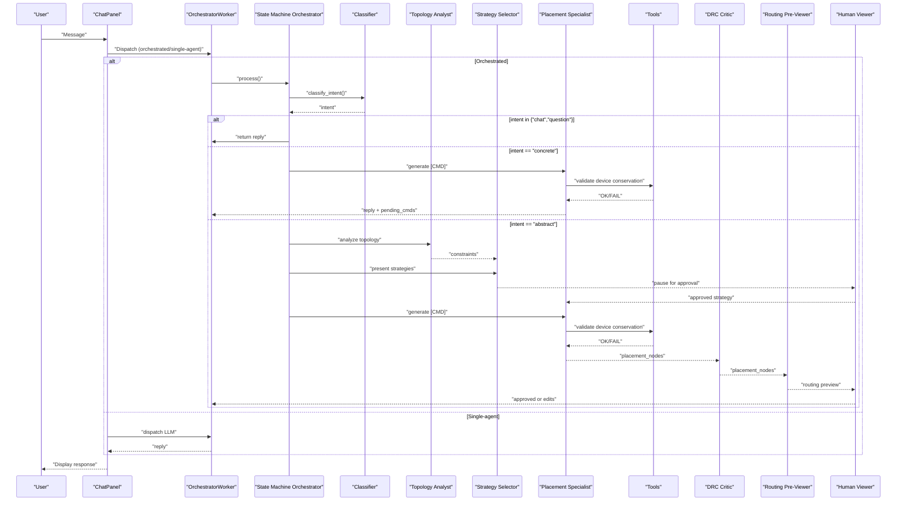
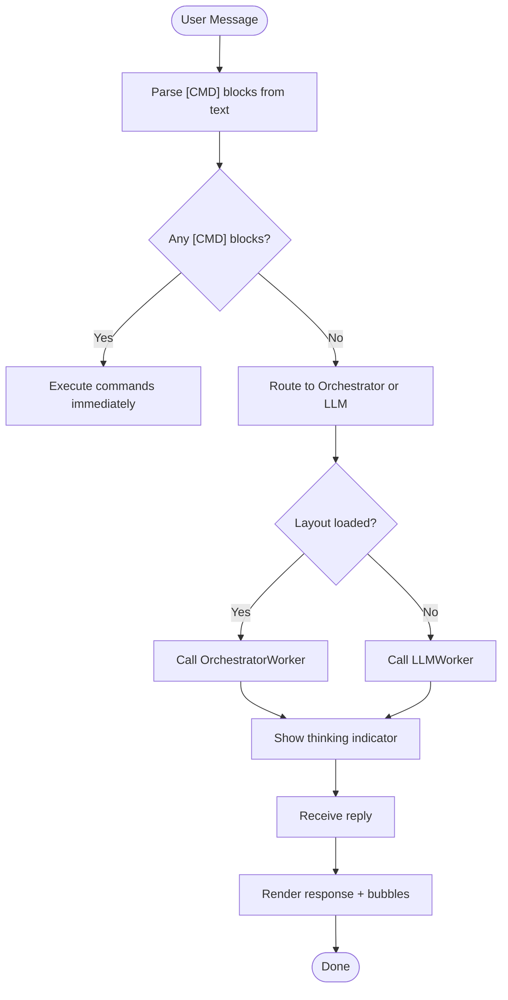
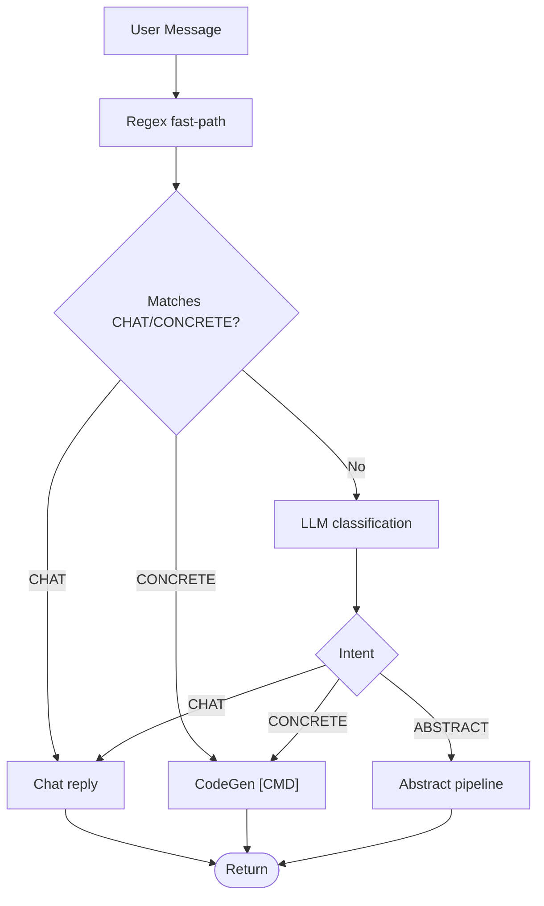
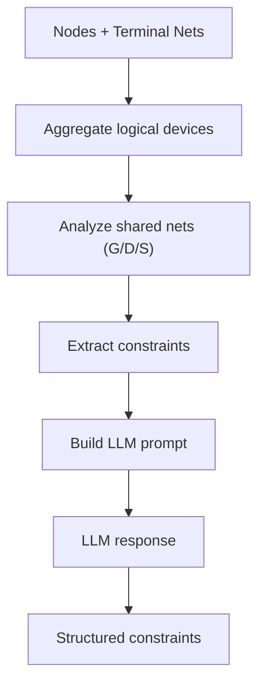
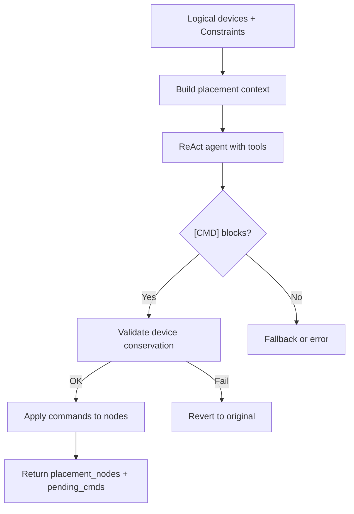
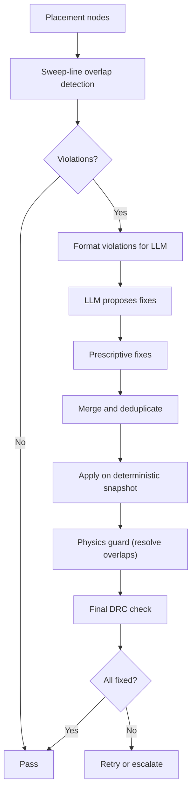
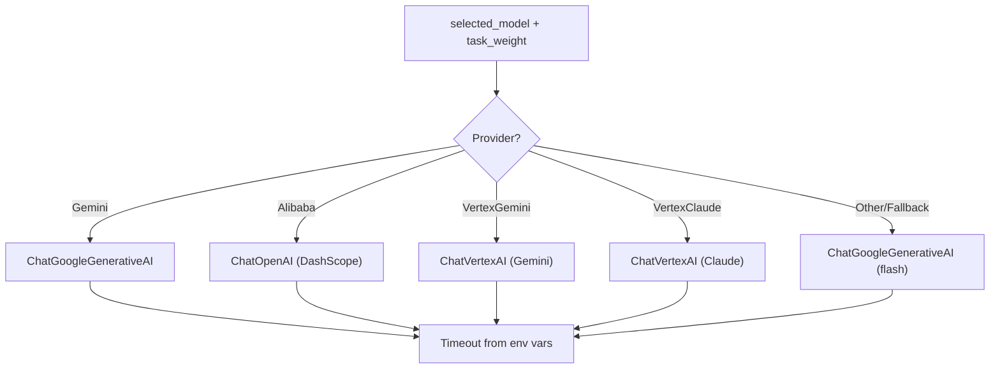
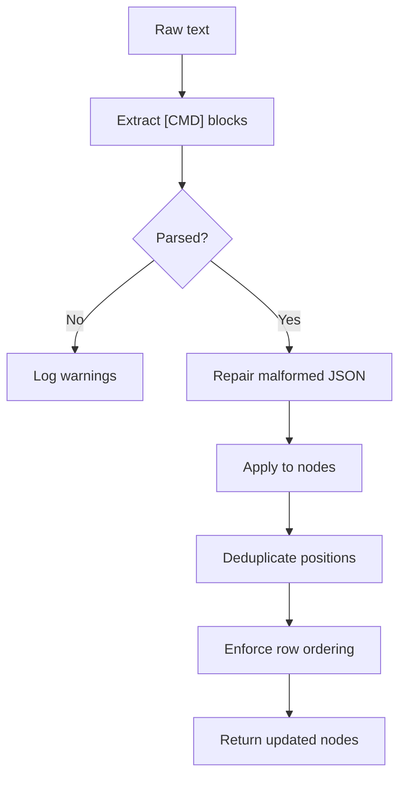
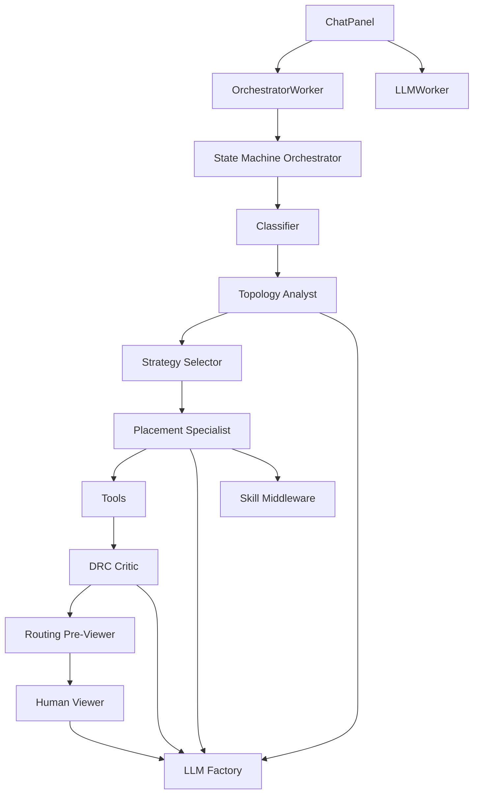

# AI Chat Panel and Multi-Agent System

<cite>
**Referenced Files in This Document**
- [chat_panel.py](file://symbolic_editor/chat_panel.py)
- [orchestrator.py](file://ai_agent/ai_chat_bot/agents/orchestrator.py)
- [classifier.py](file://ai_agent/ai_chat_bot/agents/classifier.py)
- [topology_analyst.py](file://ai_agent/ai_chat_bot/agents/topology_analyst.py)
- [placement_specialist.py](file://ai_agent/ai_chat_bot/agents/placement_specialist.py)
- [drc_critic.py](file://ai_agent/ai_chat_bot/agents/drc_critic.py)
- [llm_factory.py](file://ai_agent/ai_chat_bot/llm_factory.py)
- [skill_middleware.py](file://ai_agent/ai_chat_bot/skill_middleware.py)
- [cmd_utils.py](file://ai_agent/ai_chat_bot/cmd_utils.py)
- [tools.py](file://ai_agent/ai_chat_bot/tools.py)
- [state.py](file://ai_agent/ai_chat_bot/state.py)
- [nodes.py](file://ai_agent/ai_chat_bot/nodes.py)
- [graph.py](file://ai_agent/ai_chat_bot/graph.py)
- [analog_kb.py](file://ai_agent/ai_chat_bot/analog_kb.py)
</cite>

## Table of Contents
1. [Introduction](#introduction)
2. [Project Structure](#project-structure)
3. [Core Components](#core-components)
4. [Architecture Overview](#architecture-overview)
5. [Detailed Component Analysis](#detailed-component-analysis)
6. [Dependency Analysis](#dependency-analysis)
7. [Performance Considerations](#performance-considerations)
8. [Troubleshooting Guide](#troubleshooting-guide)
9. [Conclusion](#conclusion)
10. [Appendices](#appendices)

## Introduction
This document describes the AI Chat Panel and Multi-Agent System for analog IC layout automation. It explains the agent orchestration architecture, intent classification and routing, specialized agents (classifier, DRC critic, placement specialist, topology analyst), LLM provider integration, command execution pipeline, and skill middleware system. It also covers the chat interface, conversation history management, and AI-assisted design workflows, with practical examples, collaboration patterns, and troubleshooting guidance.

## Project Structure
The AI system spans two main areas:
- Symbolic Editor UI (chat panel) that hosts the AI assistant and routes requests to workers
- AI Agent pipeline (orchestrator, agents, tools, and LLM factory) that performs layout analysis, placement, and verification

**Diagram sources**
- [chat_panel.py:1-908](file://symbolic_editor/chat_panel.py#L1-L908)
- [orchestrator.py:1-226](file://ai_agent/ai_chat_bot/agents/orchestrator.py#L1-L226)
- [nodes.py:1-1016](file://ai_agent/ai_chat_bot/nodes.py#L1-L1016)
- [graph.py:1-52](file://ai_agent/ai_chat_bot/graph.py#L1-L52)
- [classifier.py:1-105](file://ai_agent/ai_chat_bot/agents/classifier.py#L1-L105)
- [topology_analyst.py:1-326](file://ai_agent/ai_chat_bot/agents/topology_analyst.py#L1-L326)
- [placement_specialist.py:1-829](file://ai_agent/ai_chat_bot/agents/placement_specialist.py#L1-L829)
- [drc_critic.py:1-987](file://ai_agent/ai_chat_bot/agents/drc_critic.py#L1-L987)
- [tools.py:1-230](file://ai_agent/ai_chat_bot/tools.py#L1-L230)
- [skill_middleware.py:1-278](file://ai_agent/ai_chat_bot/skill_middleware.py#L1-L278)
- [llm_factory.py:1-131](file://ai_agent/ai_chat_bot/llm_factory.py#L1-L131)

**Section sources**
- [chat_panel.py:1-908](file://symbolic_editor/chat_panel.py#L1-L908)
- [graph.py:1-52](file://ai_agent/ai_chat_bot/graph.py#L1-L52)

## Core Components
- Chat Panel: A Qt-based UI that manages conversation, routes to single-agent or orchestrated multi-agent workers, and renders responses with animated “thinking” indicators.
- Orchestrator: A state machine that classifies intent and routes to either a chat-only path or a 4-stage pipeline (Topology Analyst → Strategy Selector → Placement Specialist → DRC Critic → Routing Pre-Viewer → Human Viewer).
- Agents:
  - Classifier: Fast regex-based intent classification, with LLM fallback.
  - Topology Analyst: Extracts layout constraints from netlists and topology.
  - Strategy Selector: Summarizes strategies and waits for human approval.
  - Placement Specialist: Generates [CMD] blocks for device placement with strict validation.
  - DRC Critic: Detects and fixes placement violations with a cost-driven legalizer.
  - Routing Pre-Viewer: Estimates routing quality and suggests improvements.
  - Human Viewer: Pauses for human-in-the-loop approval or edits.
- Tools: Safe wrappers around layout and verification functions (DRC, routing scoring, device conservation).
- Skill Middleware: Progressive disclosure of placement skills to agents.
- LLM Factory: Centralized provider selection and model instantiation with timeouts and environment-based configuration.
- Command Utilities: Parsing and application of [CMD] blocks with deduplication and row-order enforcement.
- State: Typed dictionary defining the orchestrator state machine and shared context.

**Section sources**
- [chat_panel.py:1-908](file://symbolic_editor/chat_panel.py#L1-L908)
- [orchestrator.py:1-226](file://ai_agent/ai_chat_bot/agents/orchestrator.py#L1-L226)
- [classifier.py:1-105](file://ai_agent/ai_chat_bot/agents/classifier.py#L1-L105)
- [topology_analyst.py:1-326](file://ai_agent/ai_chat_bot/agents/topology_analyst.py#L1-L326)
- [placement_specialist.py:1-829](file://ai_agent/ai_chat_bot/agents/placement_specialist.py#L1-L829)
- [drc_critic.py:1-987](file://ai_agent/ai_chat_bot/agents/drc_critic.py#L1-L987)
- [tools.py:1-230](file://ai_agent/ai_chat_bot/tools.py#L1-L230)
- [skill_middleware.py:1-278](file://ai_agent/ai_chat_bot/skill_middleware.py#L1-L278)
- [llm_factory.py:1-131](file://ai_agent/ai_chat_bot/llm_factory.py#L1-L131)
- [cmd_utils.py:1-171](file://ai_agent/ai_chat_bot/cmd_utils.py#L1-L171)
- [state.py:1-37](file://ai_agent/ai_chat_bot/state.py#L1-L37)

## Architecture Overview
The system supports two execution modes:
- Single-agent chat: Direct LLM invocation for quick answers and immediate [CMD] execution.
- Multi-agent orchestrator: A LangGraph-based pipeline with human-in-the-loop interruptions and retries.

**Diagram sources**
- [chat_panel.py:1-908](file://symbolic_editor/chat_panel.py#L1-L908)
- [orchestrator.py:1-226](file://ai_agent/ai_chat_bot/agents/orchestrator.py#L1-L226)
- [nodes.py:1-1016](file://ai_agent/ai_chat_bot/nodes.py#L1-L1016)
- [classifier.py:1-105](file://ai_agent/ai_chat_bot/agents/classifier.py#L1-L105)
- [placement_specialist.py:1-829](file://ai_agent/ai_chat_bot/agents/placement_specialist.py#L1-L829)
- [drc_critic.py:1-987](file://ai_agent/ai_chat_bot/agents/drc_critic.py#L1-L987)
- [tools.py:1-230](file://ai_agent/ai_chat_bot/tools.py#L1-L230)

## Detailed Component Analysis

### Chat Panel
- Manages layout context, chat history, and animated “thinking” indicators.
- Routes messages to single-agent or orchestrated multi-agent workers.
- Parses [CMD] blocks from AI responses and executes them immediately.
- Emits signals for user commands and orchestrator resumes.

**Diagram sources**
- [chat_panel.py:1-908](file://symbolic_editor/chat_panel.py#L1-L908)

**Section sources**
- [chat_panel.py:1-908](file://symbolic_editor/chat_panel.py#L1-L908)

### Intent Classification and Routing
- Fast-path regex matches casual and direct commands.
- LLM-based classification for ambiguous cases.
- Routes to chat-only, concrete command generation, or abstract strategy pipeline.

**Diagram sources**
- [classifier.py:1-105](file://ai_agent/ai_chat_bot/agents/classifier.py#L1-L105)

**Section sources**
- [classifier.py:1-105](file://ai_agent/ai_chat_bot/agents/classifier.py#L1-L105)

### Specialized Agents

#### Topology Analyst
- Converts layout JSON and terminal nets into a structured constraint snapshot.
- Uses domain knowledge to identify matching/symmetry requirements and groupings.

**Diagram sources**
- [topology_analyst.py:1-326](file://ai_agent/ai_chat_bot/agents/topology_analyst.py#L1-L326)

**Section sources**
- [topology_analyst.py:1-326](file://ai_agent/ai_chat_bot/agents/topology_analyst.py#L1-L326)

#### Strategy Selector
- Summarizes Topology Analyst output and presents strategies to the user.
- Pauses for human approval before proceeding.

**Section sources**
- [nodes.py:395-447](file://ai_agent/ai_chat_bot/nodes.py#L395-L447)

#### Placement Specialist
- Generates [CMD] blocks for device placement with strict validation:
  - Inventory conservation
  - Row-based constraints
  - Routing-aware ordering
  - Mode-specific sequencing (common-centroid, interdigitated, mirror biasing, simple)
- Integrates Skill Middleware for progressive disclosure of placement skills.

**Diagram sources**
- [placement_specialist.py:1-829](file://ai_agent/ai_chat_bot/agents/placement_specialist.py#L1-L829)
- [skill_middleware.py:1-278](file://ai_agent/ai_chat_bot/skill_middleware.py#L1-L278)
- [nodes.py:450-612](file://ai_agent/ai_chat_bot/nodes.py#L450-L612)

**Section sources**
- [placement_specialist.py:1-829](file://ai_agent/ai_chat_bot/agents/placement_specialist.py#L1-L829)
- [skill_middleware.py:1-278](file://ai_agent/ai_chat_bot/skill_middleware.py#L1-L278)
- [nodes.py:450-612](file://ai_agent/ai_chat_bot/nodes.py#L450-L612)

#### DRC Critic
- Detects overlaps, gaps, and row-type violations with a sweep-line algorithm.
- Produces prescriptive fixes with cost-driven legalizer and symmetry preservation.
- Merges LLM-generated fixes with deterministic corrections.

**Diagram sources**
- [drc_critic.py:1-987](file://ai_agent/ai_chat_bot/agents/drc_critic.py#L1-L987)
- [nodes.py:637-800](file://ai_agent/ai_chat_bot/nodes.py#L637-L800)

**Section sources**
- [drc_critic.py:1-987](file://ai_agent/ai_chat_bot/agents/drc_critic.py#L1-L987)
- [nodes.py:637-800](file://ai_agent/ai_chat_bot/nodes.py#L637-L800)

#### Routing Pre-Viewer and Human Viewer
- Estimates routing complexity and presents a preview for human review.
- Supports human-in-the-loop approvals and edits.

**Section sources**
- [nodes.py:800-1016](file://ai_agent/ai_chat_bot/nodes.py#L800-L1016)

### LLM Provider Integration
- Centralized factory selects provider and model based on selected_model and task weight.
- Supports timeouts configurable via environment variables.
- Providers supported include Gemini, Alibaba DashScope, Vertex AI (Gemini and Claude), with fallback behavior.

**Diagram sources**
- [llm_factory.py:1-131](file://ai_agent/ai_chat_bot/llm_factory.py#L1-L131)

**Section sources**
- [llm_factory.py:1-131](file://ai_agent/ai_chat_bot/llm_factory.py#L1-L131)

### Command Execution Pipeline
- Parses [CMD] blocks from text and JSON, with repair logic for malformed inputs.
- Applies commands to nodes with deduplication and row-order enforcement.
- Enforces PMOS/NMOS row ordering and fluid spacing.

**Diagram sources**
- [cmd_utils.py:1-171](file://ai_agent/ai_chat_bot/cmd_utils.py#L1-L171)

**Section sources**
- [cmd_utils.py:1-171](file://ai_agent/ai_chat_bot/cmd_utils.py#L1-L171)

### Skill Middleware System
- Scans skills directory for markdown frontmatter and builds a catalog.
- Injects skills into agent prompts and exposes a load_skill tool for on-demand loading.
- Supports both flat and nested skill layouts.

**Section sources**
- [skill_middleware.py:1-278](file://ai_agent/ai_chat_bot/skill_middleware.py#L1-L278)

### Conversation History Management
- Chat history normalization, trimming, and persistence to JSON.
- Deduplicates consecutive messages and strips thinking blocks.
- Maintains a bounded history to prevent uncontrolled growth.

**Section sources**
- [nodes.py:187-209](file://ai_agent/ai_chat_bot/nodes.py#L187-L209)

### State Machine and LangGraph
- Typed LayoutState defines inputs, topology, strategy, placement, DRC, routing, pending commands, and approval.
- LangGraph builder registers nodes and edges for the pipeline.
- Conditional edges support retries and human-in-the-loop flows.

**Section sources**
- [state.py:1-37](file://ai_agent/ai_chat_bot/state.py#L1-L37)
- [graph.py:1-52](file://ai_agent/ai_chat_bot/graph.py#L1-L52)
- [nodes.py:1-1016](file://ai_agent/ai_chat_bot/nodes.py#L1-L1016)

## Dependency Analysis
- UI-to-worker coupling: ChatPanel uses signals/slots to communicate with OrchestratorWorker and LLMWorker threads.
- Agent-to-tool coupling: Placement Specialist and DRC Critic rely on tools for validation and fixes.
- LLM factory decouples provider selection from agent logic.
- LangGraph centralizes control flow and retries.

**Diagram sources**
- [chat_panel.py:1-908](file://symbolic_editor/chat_panel.py#L1-L908)
- [orchestrator.py:1-226](file://ai_agent/ai_chat_bot/agents/orchestrator.py#L1-L226)
- [nodes.py:1-1016](file://ai_agent/ai_chat_bot/nodes.py#L1-L1016)
- [llm_factory.py:1-131](file://ai_agent/ai_chat_bot/llm_factory.py#L1-L131)
- [skill_middleware.py:1-278](file://ai_agent/ai_chat_bot/skill_middleware.py#L1-L278)
- [tools.py:1-230](file://ai_agent/ai_chat_bot/tools.py#L1-L230)

**Section sources**
- [chat_panel.py:1-908](file://symbolic_editor/chat_panel.py#L1-L908)
- [nodes.py:1-1016](file://ai_agent/ai_chat_bot/nodes.py#L1-L1016)

## Performance Considerations
- Task-weighted LLM calls: Light tasks use shorter/cheaper models; heavy tasks use more capable models.
- Timeout configuration: Environment variables allow tuning per task weight.
- Sweep-line DRC: O(N log N + R) overlap detection for large-scale layouts.
- Deduplication and snapping: Reduces redundant command processing and improves stability.
- Retry logic: Graceful handling of provider timeouts with bounded attempts.

[No sources needed since this section provides general guidance]

## Troubleshooting Guide
Common issues and resolutions:
- LLM timeouts: Increase LLM_TIMEOUT_LIGHT or LLM_TIMEOUT_HEAVY; verify provider credentials.
- Missing or invalid [CMD] blocks: Repair logic attempts to fix malformed JSON; ensure blocks are properly formatted.
- Device conservation failures: Placement Specialist validates that no devices are deleted or duplicated.
- DRC violations persist: DRC Critic merges LLM fixes with deterministic prescriptive fixes; review device row ordering and symmetry.
- Human-in-the-loop interruptions: Use approvals or edits; the system supports resuming from strategy and viewer stages.

**Section sources**
- [llm_factory.py:19-26](file://ai_agent/ai_chat_bot/llm_factory.py#L19-L26)
- [cmd_utils.py:84-101](file://ai_agent/ai_chat_bot/cmd_utils.py#L84-L101)
- [nodes.py:594-602](file://ai_agent/ai_chat_bot/nodes.py#L594-L602)
- [nodes.py:714-724](file://ai_agent/ai_chat_bot/nodes.py#L714-L724)

## Conclusion
The AI Chat Panel and Multi-Agent System integrates a robust orchestration pipeline with intent classification, topology analysis, placement, and verification. It leverages a skill middleware, typed state management, and a centralized LLM factory to provide reliable, human-in-the-loop AI-assisted analog layout workflows. The system balances performance with deterministic safeguards to ensure design correctness.

## Appendices

### Practical Examples
- Optimize placement: “Suggest a better placement” triggers the 4-stage pipeline.
- Immediate device swap: “Swap MM28 with MM25” generates a [CMD] block and executes immediately.
- Improve matching: “Improve the matching” routes to Topology Analyst → Strategy Selector → Placement Specialist → DRC Critic.

### Agent Collaboration Patterns
- Classifier → Topology Analyst → Strategy Selector → Placement Specialist → DRC Critic → Routing Pre-Viewer → Human Viewer
- Single-agent fallback for quick chat and concrete commands

### API Rate Limiting and Fallback Strategies
- Configure timeouts per task weight via environment variables.
- Fallback to lighter models or alternative providers when encountering rate limits or timeouts.
- Retry logic with bounded attempts for transient failures.

[No sources needed since this section provides general guidance]